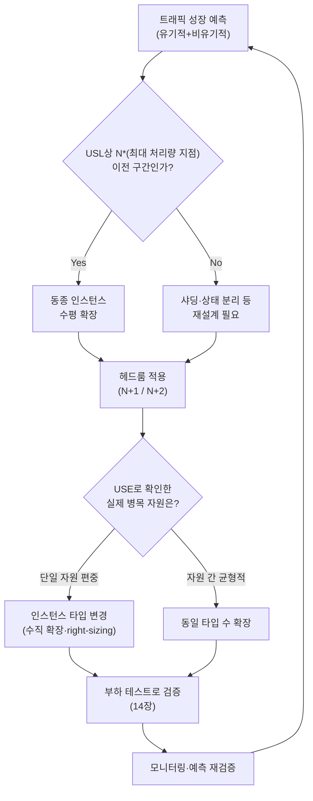

<strong>용량 계획(Capacity Planning)</strong>이란 미래의 트래픽 성장을 예측하고, 그 성장을 감당할 하드웨어·인스턴스를 언제·얼마나·어떤 형태로 확보할지 결정하는 방법론을 말합니다. 성능 목표(SLO)와 성능 예산이 "무엇을 지켜야 하는가"를 정의한다면, 용량 계획은 그 목표를 지키는 데 필요한 자원의 양을 시간 축 위에서 미리 확보하는 일입니다. 이 결정을 소홀히 하면 벌어지는 일은 두 가지 방향 모두 나쁩니다. 트래픽이 예측보다 빨리 늘어나면 헤드룸이 바닥나 장애 직전까지 서비스가 위태로워지고, 반대로 과도하게 넉넉히 잡으면 쓰지도 않을 인스턴스 비용을 계속 지불하게 됩니다. 클라우드의 오토스케일링이 이 문제를 자동으로 풀어준다고 여기기 쉽지만, 오토스케일링은 이미 벌어진 부하 증가에 반응하는 장치이지 "언제, 얼마나 필요할지"를 미리 계산하는 장치가 아닙니다. 이 장은 트래픽 성장을 수치로 예측하고, 수평 확장이 어디까지 유효한지 모델로 가늠하며, 장애 내성을 위한 헤드룸을 얼마나 둘지, 그리고 그 자원을 수평·수직 중 어떤 형태로 늘릴지 판단하는 기준을 정리합니다.

## 이 장을 읽기 전에

**전제 지식**: 이 장은 [05장: 성능 예산 수립](/post/design-decisions/performance-budgeting-methodology/)에서 다룬 예산 배분 개념, [06장: SLO/SLA 정의](/post/design-decisions/slo-sla-definition-team-alignment/)에서 다룬 목표 정의, [07장: 지연시간 vs 처리량](/post/design-decisions/latency-vs-throughput-architecture-decisions/)에서 다룬 Little's Law·유틸리제이션과 지연의 관계를 전제로 합니다. 이 셋을 이미 정했다는 가정 위에서 "그 목표를 지키려면 자원이 얼마나 필요한가"를 다룹니다.

**이 장의 깊이**: **심화** 난이도로, 트래픽 성장을 유기적·비유기적 성장으로 나눠 예측하는 방법, Universal Scalability Law(USL)로 수평 확장의 한계를 모델링하는 방법, 장애 내성을 위한 헤드룸(N+1/N+2) 산정, 수평·수직 확장과 인스턴스 right-sizing 판단 기준을 다룹니다. **다루지 않는 것**: 이 계획을 실제로 검증하는 부하 테스트 설계 방법론은 [14장: Load Testing 설계](/post/design-decisions/load-testing-design-performance-goal-verification/), 클라우드 인스턴스 선택의 비용 대비 성능 분석은 [15장: Cost-Performance 분석](/post/design-decisions/cloud-cost-performance-analysis/), 데이터베이스 커넥션 풀 크기 산정은 [10장: 데이터베이스 접근 최적화](/post/design-decisions/database-access-optimization-strategy/), 큐잉·유틸리제이션의 수학적 배경은 [07장](/post/design-decisions/latency-vs-throughput-architecture-decisions/)으로 위임합니다.

## 당신의 수준에 맞는 경로

| 수준 | 읽을 부분 | 핵심 목표 |
|------|---------|---------|
| **개념을 처음 접함** | 도입 ~ "용량 계획이 답해야 하는 질문" | 용량 계획이 SLO·예산과 다른 축의 결정임을 이해 |
| **예측·모델을 만들어야 함** | "트래픽 성장 예측" ~ "헤드룸과 장애 내성" | 성장 예측과 확장 한계를 수치로 다루는 방법 습득 |
| **확장 방식을 결정함** | "하드웨어·인스턴스 스케일링 결정" ~ "비판적 시각" | 수평/수직·right-sizing 판단과 모델의 한계 인지 |

## 용량 계획의 역사와 성능 목표 (역사·배경)

용량 계획은 원래 메인프레임 시대의 문제였습니다. 컴퓨팅 자원이 비싸고 조달에 몇 달이 걸리던 1960–1980년대에는 배치 작업 스케줄과 큐잉 이론([07장](/post/design-decisions/latency-vs-throughput-architecture-decisions/)에서 다룬 Erlang·Little의 결과)을 바탕으로 "다음 분기에 CPU가 몇 대 더 필요한가"를 계산하는 것이 전산실 운영의 핵심 업무였습니다. 이 시절의 용량 계획은 확장이 느리고 되돌리기 어려웠기 때문에, 예측을 보수적으로 잡고 여유를 넉넉히 두는 쪽으로 기울어 있었습니다.

수평 확장의 한계를 수학적으로 정식화하려는 시도는 1967년 Gene Amdahl이 병렬화 가능한 비율만으로 속도 향상의 상한을 구한 Amdahl's law에서 출발합니다. 1993년 Neil Gunther는 여기에 "분산된 자원 간에 상태를 맞추는 데 드는 지연"이라는 코히런시(coherency) 항을 추가해 <strong>Universal Scalability Law(USL)</strong>를 정식화했고, 이는 노드를 늘릴수록 어느 시점부터 처리량이 정체를 넘어 오히려 줄어드는 현상까지 설명하는 모델이 되었습니다([Performance Dynamics: How to Quantify Scalability](https://www.perfdynamics.com/Manifesto/USLscalability.html)).

클라우드와 오토스케일링은 조달 리드타임 문제를 크게 줄였지만 용량 계획 자체를 없애지는 못했습니다. 인스턴스를 몇 분 안에 늘릴 수 있어도 계정별 쿼터, 특정 리전의 인스턴스 재고, 예약 인스턴스 약정, 그리고 확장된 인스턴스가 실제로 트래픽을 받아 예열(warm-up)되기까지의 시간은 여전히 존재합니다. Google이 정리한 SRE(Site Reliability Engineering) 관행은 이런 배경에서 용량 계획을 "예측된 미래 수요를 요구되는 가용성 수준으로 서비스할 수 있도록 충분한 용량과 이중화를 보장하는 일"로 규정하고, 이를 트래픽이 자연스럽게 늘어나는 유기적 성장과 마케팅 캠페인·기능 출시처럼 사업적 사건에서 오는 비유기적 성장으로 나눠 다루는 방식을 실무에 정착시켰습니다.

## 용량 계획이 답해야 하는 질문

용량 계획은 하나의 질문이 아니라 서로 다른 축의 세 질문에 답하는 일입니다. 첫째는 **언제**입니다 — 현재 트래픽 추세로 볼 때 언제 지금의 용량이 목표 SLO를 위협하기 시작하는가입니다. 둘째는 **얼마나**입니다 — 예측된 피크 수요를 감당하면서 일부 자원이 죽어도 버틸 수 있는 헤드룸을 얼마나 둘 것인가입니다. 셋째는 **어떤 형태로**입니다 — 그 여유분을 같은 종류의 인스턴스를 늘리는 수평 확장으로 채울지, 더 큰 인스턴스로 바꾸는 수직 확장으로 채울지입니다. 세 질문 모두 [05장](/post/design-decisions/performance-budgeting-methodology/)에서 정한 성능 예산과 [06장](/post/design-decisions/slo-sla-definition-team-alignment/)에서 정한 SLO를 입력값으로 받아, "이 목표를 지키려면 자원이 얼마나 있어야 하는가"라는 산출값으로 바꾸는 작업입니다. 목표를 정의하는 일과 그 목표를 채울 자원을 계산하는 일은 서로 다른 스킬이고, 조직 내에서도 흔히 다른 사람이 담당합니다.

## 트래픽 성장 예측: 유기적 성장과 비유기적 성장

트래픽 성장은 성격이 다른 두 갈래로 나뉩니다. <strong>유기적 성장(organic growth)</strong>은 제품이 자연스럽게 채택·사용되면서 늘어나는 수요로, 과거 추세를 선형·지수 회귀 등으로 외삽해 어느 정도 예측할 수 있습니다. <strong>비유기적 성장(inorganic growth)</strong>은 기능 출시, 마케팅 캠페인, 제휴, 미디어 노출처럼 사업적 의사결정이 만드는 계단식 변화로, 과거 추세선만으로는 잡히지 않고 해당 이벤트를 계획하는 팀과의 사전 조율이 있어야만 예측에 반영됩니다. 두 성장을 구분하지 않고 하나의 추세선만 그리면, 다음 분기에 대규모 마케팅이 예정돼 있어도 그 수요가 예측에서 통째로 누락됩니다.

예측에서 못지않게 중요한 것은 **리드타임**입니다. 새 하드웨어를 조달하거나 클라우드 사업자에게 예약 용량을 확보하는 데 걸리는 시간보다 예측이 짧은 기간만 내다본다면, 예측이 아무리 정확해도 실행에 옮길 시간이 없습니다. 그리고 예측은 한 번 세우고 끝나는 것이 아니라, 실제 트래픽과 주기적으로 대조해 오차를 좁혀가야 하는 살아있는 프로세스입니다. 예측과 실측이 계속 어긋난다면 이는 예측 모델 자체가 불안정하다는 신호이며, 이 상태를 방치하면 과잉 프로비저닝(비용 낭비) 또는 용량 부족(장애 위험) 중 하나로 이어질 수밖에 없습니다.

```python
# 개념 예시: 최근 N주간의 유기적 성장 추세를 선형 회귀로 외삽 (비유기적 성장은 별도 가산)
# 실행 환경: Python 3.11, numpy 1.26
import numpy as np

weeks = np.array([1, 2, 3, 4, 5, 6, 7, 8])
peak_qps = np.array([4200, 4350, 4500, 4680, 4800, 4950, 5100, 5300])

slope, intercept = np.polyfit(weeks, peak_qps, deg=1)
organic_forecast_week16 = slope * 16 + intercept

# 비유기적 성장: 9주차에 대규모 캠페인으로 트래픽이 40% 추가된다고 사업팀이 통보한 경우
inorganic_bump = organic_forecast_week16 * 0.4
total_forecast_week16 = organic_forecast_week16 + inorganic_bump

print(f"유기적 예측: {organic_forecast_week16:.0f} QPS, 비유기적 포함: {total_forecast_week16:.0f} QPS")
```

이 스크립트는 선형 회귀 하나로 성장을 예측하는 최소 예시일 뿐입니다. 실제로는 계절성(연말, 특정 요일 피크)과 성장률 자체의 변화(가속·둔화)까지 반영해야 하며, 무엇보다 비유기적 성장 항목은 코드가 아니라 사업팀과의 정기적인 커뮤니케이션 프로세스로 채워 넣어야 하는 값입니다.

## Universal Scalability Law: 수평 확장의 한계

트래픽 성장을 예측했다면 다음 질문은 "노드를 늘리는 것만으로 그 성장을 계속 감당할 수 있는가"입니다. <strong>Universal Scalability Law(USL)</strong>는 동시성(N, 노드 수 또는 동시 요청 수)에 따른 처리량 X(N)을 다음 식으로 모델링합니다.

```text
X(N) = γN / (1 + α(N−1) + βN(N−1))
```

여기서 γ(감마)는 이상적인 선형 확장 시의 단위당 처리량이고, α(알파, contention)는 공유 자원을 두고 기다리는 큐잉 지연의 비중이며, β(베타, coherency)는 노드 사이에 상태를 맞추는 데 드는 비용의 비중입니다. α만 있으면(β=0) 이 식은 Amdahl's law로 줄어들어 처리량이 상한선에 점근하고, β가 0보다 크면 특정 동시성 지점을 지나서는 처리량이 정점을 찍고 실제로 **감소**하기 시작합니다. 코히런시 비용이 확장 이득을 역전시키는 지점이 있다는 것이 USL이 Amdahl's law에 더한 핵심입니다.

이 파라미터는 이론으로 가정하는 값이 아니라, 서로 다른 동시성 수준에서 실측한 (동시성, 처리량) 표본에 곡선을 맞춰(curve fitting) 추정하는 값입니다. 아래는 [14장](/post/design-decisions/load-testing-design-performance-goal-verification/)에서 다룰 부하 테스트로 얻은 표본을 가정하고, USL 파라미터를 추정해 이론상 최대 처리량 지점을 계산하는 스크립트입니다.

```python
# 실행 환경: Python 3.11, numpy 1.26, scipy 1.11 (pip install numpy scipy)
import numpy as np
from scipy.optimize import curve_fit

def usl_throughput(n, sigma, kappa, gamma):
    # sigma: contention(alpha), kappa: coherency(beta), gamma: 이상적 선형 처리량 계수
    return (gamma * n) / (1 + sigma * (n - 1) + kappa * n * (n - 1))

# 부하 테스트(14장)로 동시성 단계별로 측정한 (N, 처리량) 표본
concurrency = np.array([1, 4, 8, 16, 32, 64, 128])
throughput = np.array([1000, 3800, 7000, 12500, 19800, 24000, 22000])

params, _ = curve_fit(usl_throughput, concurrency, throughput, p0=[0.01, 0.001, 1000], maxfev=10000)
sigma, kappa, gamma = params

# USL이 예측하는 최대 처리량 지점 N* = sqrt((1-sigma)/kappa)
n_star = np.sqrt((1 - sigma) / kappa)
x_max = usl_throughput(n_star, sigma, kappa, gamma)
print(f"sigma={sigma:.4f} kappa={kappa:.6f} N*={n_star:.1f} X_max={x_max:.0f}")
```

이 계산이 알려주는 것은 "노드를 무한정 늘리는 전략이 유효한 구간이 어디까지인가"입니다. N*를 넘어서는 확장은 노드를 추가할수록 오히려 처리량이 줄어드는 구간에 들어서므로, 그 지점 전에 아키텍처(샤딩, 상태 분리, 코히런시 감소)를 바꾸는 재설계가 필요하다는 신호로 읽어야 합니다. 다만 이 모델은 최소 여러 동시성 단계에서 측정한 실측 데이터가 있어야 신뢰할 수 있고, 표본이 적거나 노이즈가 크면 추정된 σ·κ 값 자체가 불안정해질 수 있습니다.

## 헤드룸과 장애 내성: N+1 / N+2 목표

예측된 피크 수요를 정확히 맞추는 용량은 위험합니다. 노드 하나만 죽어도 남은 노드들이 갑자기 늘어난 부하를 감당하지 못해 연쇄적으로 무너질 수 있기 때문입니다. Google SRE 관행은 이 문제를 각 클러스터(또는 노드)가 실제로 견딜 수 있는 한계치, 즉 **breaking point**를 부하 테스트로 먼저 확인한 뒤, 그 한계치를 기준으로 피크 수요를 감당하는 데 필요한 최소 클러스터 수에 여유분을 더하는 방식으로 다룹니다.

> "Good capacity planning can reduce the probability that a cascading failure will occur. Capacity planning should be coupled with performance testing to determine the load at which the service will fail." — Google, [*Site Reliability Engineering*, Chapter 22: Addressing Cascading Failures](https://sre.google/sre-book/addressing-cascading-failures/)

같은 문서는 클러스터당 한계가 5,000 QPS이고 부하가 클러스터 사이에 고르게 분산된다고 가정할 때, 피크 서비스 부하가 19,000 QPS라면 N+2 이중화를 위해 약 6개의 클러스터가 필요하다는 예시를 듭니다. **N+1**은 노드 하나가 죽어도 버티는 목표이고, **N+2**는 하나가 이미 죽은 상태에서 유지보수로 하나를 더 내려도 버티는 목표입니다 — 후자는 배포·패치 중에도 장애 허용치를 유지해야 하는 서비스에 흔히 쓰입니다.

```python
# 개념 예시: "클러스터당 breaking point → 필요 클러스터 수"를 헤드룸 목표에 맞춰 계산
import math

def clusters_needed(breaking_point_qps: float, peak_qps: float, redundancy: int) -> int:
    # redundancy: N+redundancy 목표. redundancy=2 -> 클러스터 2개가 죽어도 버텨야 함
    base_clusters = math.ceil(peak_qps / breaking_point_qps)
    return base_clusters + redundancy

# 클러스터당 한계 5,000 QPS, 피크 트래픽 19,000 QPS, N+2 목표
print(clusters_needed(5000, 19000, 2))  # -> 6
```

헤드룸 목표는 고정된 정답이 아니라 그 서비스가 감당할 수 있는 위험 수준에 대한 조직적 결정입니다. 헤드룸을 크게 잡을수록 장애 내성은 커지지만 평상시 유휴 자원이 늘어나 비용이 오르므로, 이 트레이드오프는 [15장: Cost-Performance 분석](/post/design-decisions/cloud-cost-performance-analysis/)의 관점과 함께 검토해야 합니다.

## 하드웨어·인스턴스 스케일링 결정

헤드룸까지 포함한 필요 용량이 정해지면 마지막 결정은 그 용량을 **어떤 형태**로 채울지입니다. <strong>수평 확장(horizontal scaling)</strong>은 같은 종류의 인스턴스를 더 추가하는 방식으로, 단일 장애점을 줄이고 앞서 다룬 N+1/N+2 헤드룸과 잘 맞물리지만 USL이 보여주듯 코히런시 비용 때문에 무한정 유효하지는 않습니다. <strong>수직 확장(vertical scaling)</strong>은 인스턴스 하나의 CPU·메모리·스토리지를 키우는 방식으로, 노드 간 조율 비용이 없는 워크로드(단일 프로세스 인메모리 캐시, 특정 배치 작업)에서는 더 단순하고 효율적일 수 있지만 결국 그 클라우드 사업자가 제공하는 가장 큰 인스턴스 타입이라는 상한에 부딪히고, 그 지점부터는 샤딩 같은 재설계가 불가피해집니다.

어느 쪽을 택하든 "인스턴스 타입 자체가 워크로드에 맞는가"라는 **right-sizing** 질문이 선행되어야 합니다. AWS Well-Architected Framework의 성능 효율성 설계 원칙은 클라우드의 가상화된 자원을 활용해 실제로 비교 실험을 해볼 것을 권고합니다.

> "With virtual and automatable resources, you can quickly carry out comparative testing using different types of instances, storage, or configurations." — AWS, [Well-Architected Framework: Performance Efficiency — Design Principles](https://docs.aws.amazon.com/wellarchitected/latest/framework/perf-dp.html)

right-sizing을 하기 전에 먼저 답해야 할 질문은 "지금 병목인 자원이 정말 무엇인가"입니다. CPU가 부족해 보이는 증상이 실제로는 메모리 부족으로 인한 스와핑이거나 디스크 I/O 대기일 수 있고, 잘못 짚은 자원을 키우면 비용만 늘고 병목은 그대로 남습니다. Brendan Gregg가 정리한 **USE 메서드**는 이 진단을 체계화한 것으로, 모든 자원에 대해 같은 세 가지 질문을 던지도록 요구합니다.

> "For every resource, check utilization, saturation, and errors." — Brendan Gregg, [The USE Method](https://www.brendangregg.com/usemethod.html)

여기서 <strong>유틸리제이션(utilization)</strong>은 해당 자원이 바쁜 시간의 비율, <strong>포화(saturation)</strong>는 그 자원에 대기 중인 초과 작업의 양, <strong>에러(errors)</strong>는 자원이 실패를 일으키고 있는지를 뜻합니다. CPU·메모리·디스크·네트워크 각각에 이 세 질문을 던져 실제로 한계에 다다른 자원을 먼저 찾은 뒤에야 "그 자원을 수직으로 키울지, 그 자원이 병목인 노드를 수평으로 늘릴지"를 판단할 수 있습니다.

마지막으로, 오토스케일링과 용량 계획을 혼동하지 않아야 합니다. 오토스케일링은 이미 관측된 부하 증가(CPU 사용률, 큐 길이 등)에 반응해 사후적으로 인스턴스를 늘리는 장치이고, 그 반응에는 새 인스턴스가 뜨고 워밍업되는 시간만큼의 지연이 있습니다. 용량 계획은 그 반응이 오기 **전에** 예측된 성장에 맞춰 쿼터·예약 용량·기본 클러스터 수를 미리 확보하는 일이며, 오토스케일링은 그 계획된 기준선 위에서 짧은 변동을 흡수하는 보조 장치로 보는 것이 정확합니다.



## 흔한 오개념

<strong>"오토스케일링이 있으니 용량 계획이 필요 없다"</strong>는 가장 흔한 오해입니다. 오토스케일링은 이미 벌어진 부하 증가에 반응할 뿐이고, 그 반응 자체가 인스턴스 기동·워밍업 시간만큼 지연됩니다. 트래픽이 그 반응 시간보다 빠르게 치솟는 이벤트(비유기적 성장, 갑작스러운 바이럴)에서는 오토스케일링이 따라잡기 전에 이미 포화가 시작될 수 있고, 계정 쿼터나 리전 재고 같은 상한은 오토스케일링이 대신 풀어주지 못합니다.

<strong>"과거 추세를 선형으로 외삽하면 충분한 예측이다"</strong>도 위험한 단순화입니다. 유기적 성장은 추세 외삽으로 어느 정도 잡히지만, 비유기적 성장(출시·캠페인)은 추세선에 나타나지 않는 계단식 변화이기 때문에 사업팀과의 정기적 커뮤니케이션 없이는 예측에서 통째로 빠집니다. 추세선만 보고 안심하다가 캠페인 당일 용량이 부족해지는 사고가 반복되는 이유입니다.

<strong>"CPU 사용률 70% 같은 고정 임계값이 모든 서비스에 안전선이다"</strong>도 흔한 오개념입니다. [07장](/post/design-decisions/latency-vs-throughput-architecture-decisions/)에서 다뤘듯 유틸리제이션과 지연의 관계는 큐잉 특성과 워크로드에 따라 달라지고, USL의 α·β 값도 서비스마다 다릅니다. 어떤 서비스는 유틸리제이션 60%에서 이미 지연 tail이 무너지고, 어떤 서비스는 85%까지도 여유가 있을 수 있으므로 임계값은 각 서비스의 실측 데이터로 정해야 합니다.

## 판단 기준

| 상황 | 권장 | 비권장 |
|------|------|--------|
| 유기적 성장 예측 | 추세 회귀 + 주기적 실측 대조 | 한 번 세운 예측을 재검증 없이 유지 |
| 비유기적 성장(출시·캠페인) | 사업팀과 정기 동기화로 별도 가산 | 추세선만으로 반영됐다고 가정 |
| 수평 확장 계속 여부 | USL로 N* 추정 후 그 이전 구간만 확장 | 무한정 노드 추가 |
| 장애 내성 목표 | 배포 중 유지보수까지 고려하면 N+2, 아니면 N+1부터 | 헤드룸 없이 예측치에 딱 맞춰 프로비저닝 |
| 병목 자원 식별 | USE(사용률·포화·에러)로 자원별 확인 후 확장 | 증상만 보고 임의의 자원부터 키움 |
| 워크로드 간 조율 비용 | 낮으면 수직 확장도 고려, 높으면 수평 확장 우선 | 모든 경우에 같은 확장 방식 고정 |
| 트래픽 급변 대응 | 계획된 기준선 + 오토스케일링을 보조로 사용 | 오토스케일링만으로 용량 계획을 대체 |

## 비판적 시각: 한계와 트레이드오프

USL 같은 수학적 모델은 σ·κ를 안정적으로 추정할 수 있을 만큼 여러 동시성 단계의 실측 데이터가 있을 때만 유효합니다. 표본이 적거나 측정 환경이 실제 프로덕션 트래픽 패턴(버스트, 상관관계 있는 도착)과 다르면 추정된 파라미터가 실제 한계와 크게 어긋날 수 있으며, 이 모델은 "왜 무한정 수평 확장이 통하지 않는가"를 이해하는 도구로 쓰되 유일한 근거로 삼기에는 부족합니다.

트래픽 예측 자체도 근본적으로 불확실합니다. 예측 데이터를 모으는 과정이 여러 팀에 흩어져 있어 느리고 오류가 섞이기 쉽고, 예측과 실측이 계속 어긋난다면 그 자체가 예측 프로세스가 불안정하다는 신호입니다. 이런 불확실성 아래에서 헤드룸을 얼마나 둘지는 결국 과잉 프로비저닝 비용과 용량 부족 리스크 사이의 조직적 판단이며, 이 저울질은 [15장: Cost-Performance 분석](/post/design-decisions/cloud-cost-performance-analysis/) 없이는 완결되지 않습니다.

클라우드의 탄력성도 무제한은 아닙니다. 계정별 쿼터, 특정 리전·가용 영역의 인스턴스 타입 재고, GPU처럼 수요가 몰리는 자원의 예약 대기열은 "필요할 때 언제든 늘릴 수 있다"는 가정을 흔듭니다. 이런 제약이 있는 환경에서는 오토스케일링에 기대는 사후 대응보다, 예상 성장 구간에 맞춰 예약 용량이나 쿼터 상향을 미리 신청해두는 사전 계획이 더 중요해집니다.

## 마무리

- [ ] 용량 계획이 SLO·성능 예산과 어떻게 다른 축의 결정인지, 오토스케일링과는 어떻게 다른지 설명할 수 있다.
- [ ] 유기적 성장과 비유기적 성장을 구분해 예측하고, 예측을 실측과 주기적으로 대조해야 하는 이유를 말할 수 있다.
- [ ] Universal Scalability Law의 contention·coherency 항이 수평 확장의 상한을 어떻게 설명하는지 이해한다.
- [ ] breaking point와 N+1/N+2 헤드룸으로 필요 클러스터·인스턴스 수를 계산할 수 있다.
- [ ] USE 메서드로 실제 병목 자원을 먼저 식별한 뒤 수평/수직 확장을 판단할 수 있다.
- [ ] 이 모델·예측들의 한계(표본 부족, 예측 불확실성, 클라우드 쿼터 제약)를 인지하고 있다.

**이전 장**: [성능 코드 리뷰](/post/design-decisions/performance-focused-code-review-guide/) (챕터 12)

**다음 장에서는** 이 장에서 세운 용량 계획(breaking point 가정, USL 파라미터, 헤드룸 목표)이 실제로 맞는지 검증하는 **Load Testing 설계**를 다룹니다. 부하 테스트를 어떻게 설계하고, 그 결과를 이 장의 목표와 어떻게 대조할지 정리합니다.

→ [Load Testing 설계](/post/design-decisions/load-testing-design-performance-goal-verification/) (챕터 14)
