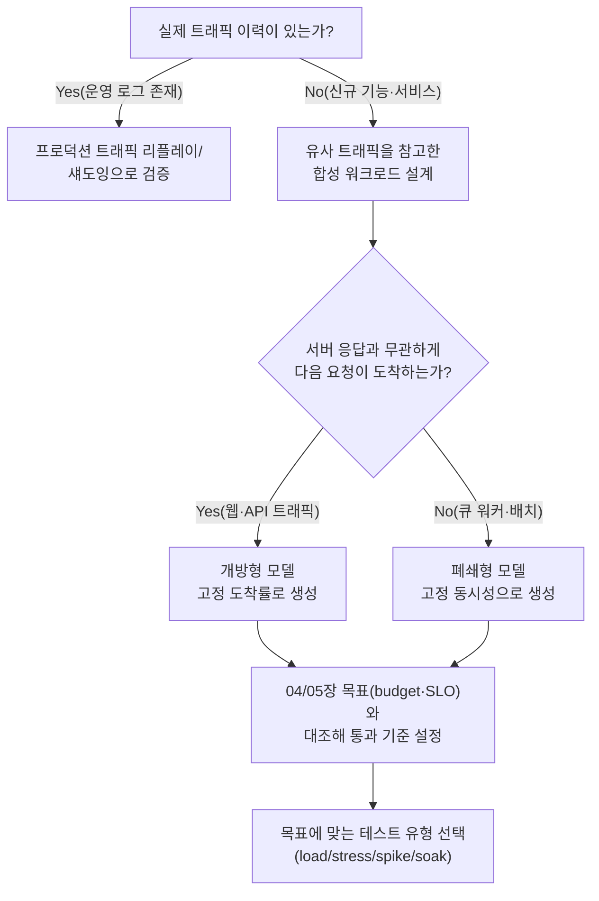

**Load Testing 설계**란 앞선 장들에서 합의한 성능 예산과 SLO가 실제 부하 아래서도 지켜지는지를, 프로덕션과 최대한 닮은 트래픽으로 미리 확인하는 설계 결정을 말합니다. 문제는 "부하를 걸어본다"는 행위 자체가 아니라 무엇을 검증 목표로 삼을지, 어떤 트래픽 모양으로 걸지, 결과를 어떻게 읽을지를 정하는 데 있습니다. 이 세 가지를 명시하지 않은 부하 테스트는 통과해도 아무것도 증명하지 못하는 경우가 흔합니다 — 응답이 오면 다음 요청을 보내는 식으로 설계된 도구는 서버가 정말 느려지는 구간일수록 오히려 그 구간을 덜 때리게 되고, 그 결과 대시보드의 p99는 멀쩡해 보이는데 프로덕션에 배포하자마자 타임아웃이 쏟아지는 일이 벌어집니다. 이 장은 그런 "통과했지만 틀린" 부하 테스트를 피하기 위한 설계 기준을 다룹니다.

## 이 장을 읽기 전에

이 장은 [12장: Capacity Planning](/post/design-decisions/capacity-planning-methodology-performance-goals/)에서 세운 용량 목표, [04장: 성능 예산 수립](/post/design-decisions/performance-budgeting-methodology/)의 latency budget, [05장: SLO/SLA 정의](/post/design-decisions/slo-sla-definition-team-alignment/)의 합의된 목표치를 전제로 합니다. p50/p95/p99, throughput, latency budget 같은 용어가 낯설다면 [17장: 성능 용어·지표 입문](/post/design-decisions/performance-terminology-metrics-fundamentals/)을 먼저 읽는 편이 좋습니다.

**이 장의 깊이**: **심화** 난이도로, 부하 테스트가 검증해야 할 목표를 앞 장들의 결정과 연결하는 법, 프로덕션 트래픽을 현실적으로 모델링하는 법(open/closed 워크로드 모델), 그리고 부하 테스트 결과를 오독하게 만드는 대표적 함정(coordinated omission, percentile 집계 오류)을 다룹니다. **다루지 않는 것**: 용량 목표를 계산하는 방법론 자체는 [12장](/post/design-decisions/capacity-planning-methodology-performance-goals/), 배칭·큐잉이 지연-처리량을 맞바꾸는 일반 이론은 [06장](/post/design-decisions/latency-vs-throughput-architecture-decisions/), 단일 벤치마크의 통계적 유의성(워밍업, 반복 횟수, 분산 관리)은 Tr.01의 [통계적 벤치마킹](/post/profiling-analysis/statistical-benchmarking/), 부하 테스트를 CI에 상시 편입해 회귀를 잡는 절차는 Tr.12, 커넥션 풀 크기 산정은 [09장](/post/design-decisions/database-access-optimization-strategy/)에서 각각 다룹니다.

## 당신의 수준에 맞는 경로

| 수준 | 읽을 부분 | 핵심 목표 |
|------|---------|---------|
| **초보자** | "부하 테스트가 검증하는 것" ~ "현실적 트래픽 패턴 모델링" | 부하 테스트 유형과 open/closed 모델의 차이 이해 |
| **중급자** | "부하 테스트 결과의 오독 함정" ~ "흔한 오개념" | coordinated omission·percentile 집계 오류를 식별하는 법 |
| **전문가** | "판단 기준" ~ "비판적 시각" | 트래픽 모델·도구 선택과 결과 해석의 한계 판단 |

## 역사·배경: 부하 테스트 도구와 사고방식의 변천

부하 테스트 도구의 역사는 "동시 사용자 수를 흉내 내는 것"에서 "도착률을 정확히 재현하는 것"으로 무게중심이 옮겨온 과정이기도 합니다. Apache JMeter는 1998년 Stefano Mazzocchi가 Apache JServ의 성능을 검증하기 위해 작성한 것이 시작이었고, 스레드 수만큼 가상 사용자를 만들어 순차적으로 요청·응답을 반복하는 방식을 오랫동안 업계 표준처럼 써 왔습니다. 이 방식은 큐 워커처럼 "이전 작업이 끝나야 다음 작업을 당겨오는" 시스템에는 잘 맞지만, 사용자가 서버 상태와 무관하게 요청을 계속 보내는 웹·API 트래픽에는 근본적으로 다른 모델이 필요하다는 문제의식이 뒤따랐습니다.

이 문제의식을 정식으로 언어화한 것이 Schroeder, Wierman, Harchol-Balter가 2006년 NSDI에서 발표한 "Open Versus Closed: A Cautionary Tale"입니다. 이 논문은 "이전 작업이 끝나야 다음이 시작되는" 폐쇄형(closed) 워크로드와 "서버 상태와 무관하게 도착하는" 개방형(open) 워크로드를 구분하고, 같은 시스템이라도 어느 모델로 부하를 걸었는지에 따라 관찰되는 성능 특성이 크게 달라질 수 있음을 보였습니다. 이후 Azul Systems의 Gil Tene가 이 구분을 측정 도구의 문제로 확장해, 2013년 무렵 **coordinated omission**이라는 이름으로 "폐쇄형 부하 생성기가 서버가 느려지는 구간을 스스로 덜 측정하게 되는 현상"을 정리했습니다. Tene는 이를 바로잡기 위해 기존 wrk를 포크해 고정 처리량 옵션(`-R`)과 HdrHistogram 기반의 정밀한 지연시간 기록을 더한 wrk2를 만들었습니다. wrk2 저장소는 스스로를 "a constant throughput, correct latency recording variant of wrk"로 소개하며, 응답이 도착한 시점이 아니라 원래 전송되었어야 할 시점을 기준으로 지연시간을 계산한다고 설명합니다([GitHub: giltene/wrk2](https://github.com/giltene/wrk2)). 같은 문제의식은 이후 스크립트 기반 도구에도 이어져, 2016년 스웨덴 스타트업 Load Impact가 시작한 k6는 2021년 Grafana Labs에 인수된 뒤 `constant-arrival-rate`라는 이름으로 개방형 모델을 1급 기능으로 제공하고 있습니다.

## 부하 테스트가 검증하는 것

부하 테스트를 "얼마나 빠른지 보는 것"으로만 이해하면 목표 없이 트래픽만 늘리다 끝나기 쉽습니다. 이 장에서는 부하 테스트를 앞 장들에서 이미 합의된 목표를 확인하는 절차로 다루며, [Grafana k6 공식 문서](https://grafana.com/docs/k6/latest/testing-guides/api-load-testing/)가 정리한 유형 구분을 그 목표에 맞춰 다시 배치하면 아래와 같습니다.

| 유형 | 검증하는 목표 | 연결되는 결정 |
|------|--------------|--------------|
| Smoke | 최소 부하에서도 스크립트·환경이 정상 동작하는가 | 테스트 자체의 신뢰성 |
| Load (평균 부하) | 평상시 트래픽에서 SLO(p95/p99)를 지키는가 | 05장 SLO |
| Stress | 피크 트래픽에서도 성능이 완만하게 저하되는가, 급격히 무너지는가 | 12장 용량 목표 |
| Spike | 갑작스러운 트래픽 급증에서 살아남는가 | 07장 아키텍처 패턴의 내결함성 |
| Soak | 장시간 부하에서 메모리·커넥션 누수로 서서히 저하되는가 | 09장 커넥션 풀 정책 |
| Breakpoint | 어느 지점에서 시스템이 실제로 무너지는가 | 12장 용량 상한 |

이 표에서 중요한 것은 유형 이름이 아니라 오른쪽 열입니다. "부하 테스트를 돌렸다"는 사실만으로는 아무것도 검증되지 않으며, 어떤 유형이 어떤 결정을 확인하기 위한 것인지 사전에 문서화해야 결과를 팀이 같은 기준으로 해석할 수 있습니다.

## 현실적 트래픽 패턴 모델링

부하 테스트의 신뢰도는 트래픽 양보다 트래픽 모양이 프로덕션과 얼마나 닮았는가에 더 크게 좌우됩니다. Schroeder 등이 구분한 두 모델은 여기서 실무적 선택으로 이어집니다. **폐쇄형(closed) 모델**은 고정된 수의 가상 사용자가 각자 "요청 → 응답 → think time → 다음 요청"을 반복하는 방식으로, 큐에서 작업을 하나씩 당겨오는 배치 워커나 내부 파이프라인을 흉내 낼 때 적합합니다. **개방형(open) 모델**은 서버 응답과 무관하게 정해진 도착률로 요청을 계속 흘려보내는 방식으로, 사용자가 서버 상태를 신경 쓰지 않고 각자 요청을 보내는 대부분의 웹·API 트래픽에 더 가깝습니다. 두 모델 중 무엇을 골라야 하는가는 실제 트래픽이 "서버가 느려지면 사용자도 요청을 줄이는가"라는 질문에 대한 답으로 결정됩니다 — 답이 "아니오"라면 개방형이 맞고, 폐쇄형으로 걸면 시스템이 느려질수록 부하 생성기 스스로 부하를 줄여주는 셈이 되어 정확히 확인하고 싶은 상황을 가려버립니다.

트래픽 모양을 이루는 또 다른 축은 도착 패턴의 형태입니다. 실제 트래픽은 초 단위로 균일하지 않고 버스트(짧은 시간에 몰리는 폭증)와 하루 주기의 diurnal 패턴(업무 시간대 피크, 새벽 저점)을 가지며, 사용자 한 명이 요청 사이에 두는 think time도 실제 UI 조작 습관을 반영해야 합니다. 균등 분포로 도착률을 고정하면 평균적으로는 목표 TPS를 채우더라도 실제 피크 순간의 동시 부하는 과소평가되기 쉽습니다.

트래픽을 어떻게 확보하느냐에서도 선택이 갈립니다. **합성 워크로드**는 통제하기 쉽고 재현 가능하지만, 설계자가 상상한 트래픽과 실제 트래픽 사이의 간극만큼 대표성을 잃습니다. **프로덕션 트래픽 리플레이(섀도잉)**는 실제 요청 로그를 재생하거나 실시간 트래픽을 복제해 신규 경로로 흘려보내는 방식으로 대표성은 높지만, 개인정보·상태 변경(쓰기 요청의 중복 실행) 문제와 재현성(같은 조건을 반복하기 어려움) 문제를 함께 가져옵니다. 신규 기능처럼 참조할 이력이 없다면 유사 기능의 트래픽 형태를 참고한 합성 워크로드로 시작하고, 이미 운영 중인 경로를 변경하는 경우라면 리플레이로 회귀를 검증하는 편이 안전합니다.



개방형 모델을 실제 스크립트로 표현하면 아래와 같습니다. k6의 `constant-arrival-rate` executor는 요청이 응답 완료 여부와 무관하게 정해진 시간당 반복 수를 유지하도록 VU(가상 사용자) 수를 자동으로 늘리거나 줄입니다.

```javascript
import http from 'k6/http';
import { check } from 'k6';

export const options = {
  scenarios: {
    steadyArrival: {
      executor: 'constant-arrival-rate', // 개방형 모델: 응답 대기와 무관하게 도착률을 고정
      rate: 500,             // 초당 500 요청: 12장에서 정한 예상 피크 트래픽 기준
      timeUnit: '1s',
      duration: '10m',
      preAllocatedVUs: 200,  // 시작 시 미리 확보하는 VU 수
      maxVUs: 1000,          // 응답이 느려져도 도착률을 유지하기 위한 VU 상한
    },
  },
  thresholds: {
    // 05장에서 합의한 SLO(p99 < 50ms)를 테스트 통과 기준으로 그대로 사용
    http_req_duration: ['p(99)<50', 'p(95)<20'],
    http_req_failed: ['rate<0.001'],
  },
};

export default function () {
  const res = http.get('https://api.internal.example.com/v1/orders/123');
  check(res, { 'status is 200': (r) => r.status === 200 });
}
```

`maxVUs`를 목표 도착률 대비 넉넉하게 잡지 않으면 서버가 느려질 때 k6 자체가 VU 부족으로 도착률을 유지하지 못해 다시 폐쇄형처럼 동작하게 되므로, VU 소진 경고(`dropped_iterations`)를 함께 모니터링해야 합니다. 스크립트 없이 커맨드라인만으로 같은 원리를 확인하려면 wrk2로 고정 처리량을 강제할 수 있습니다.

```bash
# wrk2: 초당 500 요청으로 고정(폐쇄형의 coordinated omission 회피), --latency로 HdrHistogram 분포 출력
wrk -t4 -c200 -d10m -R500 --latency https://api.internal.example.com/v1/orders/123
```

두 스니펫 모두 실제 목표 지표(p99, 실패율)를 스크립트나 실행 옵션에 그대로 박아 넣어, "통과/실패"가 사람의 판단이 아니라 앞 장에서 합의한 숫자로 자동 결정되게 하는 것이 핵심입니다.

## 부하 테스트 결과의 오독 함정

**Coordinated omission**은 이 장에서 가장 흔하면서도 가장 늦게 발견되는 함정입니다. 폐쇄형 부하 생성기는 응답을 받아야 다음 요청을 보내므로, 서버가 5초간 멈췄다면 그 5초 동안 나갔어야 할 수백 건의 요청이 애초에 생성되지 않고 단 하나의 "느린 응답"만 기록됩니다. 실제로는 그 5초 구간에 도착했을 모든 요청이 비슷하게 지연되었어야 하는데, 폐쇄형 도구는 이 구간의 표본 자체를 만들지 않으므로 percentile 계산에서 완전히 누락됩니다. HdrHistogram은 `recordValueWithExpectedInterval()`이라는 메서드로 이 누락을 사후 보정하는데, 예상 도착 간격을 넘는 응답이 관측되면 그 사이에 있었어야 할 값들을 보간해 채워 넣는 방식입니다([GitHub: HdrHistogram/HdrHistogram](https://github.com/HdrHistogram/hdrhistogram)). 근본적인 예방책은 사후 보정이 아니라 애초에 개방형 모델·고정 도착률 도구로 측정해 누락 자체를 만들지 않는 것입니다.

두 번째 함정은 **percentile을 평균 내는 습관**입니다. 여러 인스턴스에서 각각 측정한 p99 값을 단순 평균하거나, 여러 시간 구간의 p99를 평균하는 방식은 수학적으로 유효하지 않습니다 — percentile은 분포 전체를 알아야 계산할 수 있는 값이라 percentile끼리 평균을 내면 원래 분포에서는 나올 수 없는 값이 만들어집니다. 여러 노드·구간을 종합해야 한다면 원시 지연시간 표본(또는 HdrHistogram 같은 병합 가능한 히스토그램)을 합친 뒤 그 합본에서 다시 percentile을 계산해야 합니다.

세 번째 함정은 **테스트 환경과 프로덕션의 물리적 차이**입니다. 부하 테스트가 같은 리전의 더 적은 노드, 더 작은 커넥션 풀([09장](/post/design-decisions/database-access-optimization-strategy/) 참고), 또는 프로덕션과 다른 네트워크 홉 수 위에서 실행되면 관찰된 병목이 실제 병목과 다를 수 있습니다. 이 경우 절대 수치보다 "병목이 어디서 먼저 나타나는가"라는 상대적 신호에 집중하고, 최종 확인은 카나리 배포나 프로덕션 트래픽 일부로 재검증하는 것이 안전합니다.

## 흔한 오개념

**"TPS·QPS 숫자가 목표치를 넘기면 부하 테스트는 통과다"**는 가장 흔한 오해입니다. 처리량이 목표를 넘어도 그 처리량을 내는 동안 개별 요청의 p99·p999가 SLO를 넘고 있을 수 있으며, 총량 지표만 보면 이 초과를 놓칩니다. 통과 기준은 항상 처리량과 percentile 지연시간을 함께 명시해야 합니다.

**"폐쇄형 부하 생성기로 측정한 p99가 곧 프로덕션의 p99다"**도 흔한 오해입니다. 위에서 다룬 coordinated omission 때문에, 폐쇄형 도구는 서버가 가장 느려지는 구간의 표본을 스스로 줄여서 만들며, 그 결과 나온 p99는 실제보다 낙관적인 값일 가능성이 높습니다. 프로덕션과 비슷한 신뢰도를 얻으려면 개방형 모델·고정 도착률 도구로 다시 측정해야 합니다.

**"테스트 환경이 프로덕션과 달라도 결과는 스케일만 다를 뿐 방향은 같다"**도 위험한 가정입니다. 환경이 다르면 병목이 이동하는 경우가 흔합니다 — 테스트 환경에서는 애플리케이션 CPU가 먼저 한계에 닿지만 프로덕션에서는 커넥션 풀이나 네트워크 대역폭이 먼저 한계에 닿을 수 있고, 이 경우 테스트에서 얻은 최적화 우선순위 자체가 뒤바뀝니다.

## 판단 기준

| 상황 | 권장 | 비권장 |
|------|------|--------|
| 사용자가 서버 응답과 무관하게 요청을 보내는 웹·API 트래픽 | 개방형 모델, 고정 도착률(k6 `constant-arrival-rate`, wrk2 `-R`) | 폐쇄형 고정 동시성으로 tail latency 은폐 |
| 큐에서 작업을 하나씩 당겨오는 배치·워커 | 폐쇄형 모델, 고정 동시성 | 불필요하게 개방형 도착률 강제 |
| 신규 기능·트래픽 이력 없음 | 유사 서비스 트래픽 형태를 참고한 합성 워크로드 | 균등 분포·상시 최대치 가정 |
| 이미 운영 중인 경로의 변경 검증 | 프로덕션 트래픽 리플레이·섀도잉 | 합성 트래픽만으로 회귀 판단 |
| 통과 기준 정의 | 04장 budget·05장 SLO의 percentile과 처리량을 함께 명시 | 평균 지연시간·총 TPS만으로 판정 |
| 여러 노드·구간의 percentile 종합 | 원시 표본(또는 병합 가능한 히스토그램)을 합쳐 재계산 | percentile 값 자체를 평균 |
| 테스트 환경과 프로덕션 차이가 클 때 | 상대적 병목 이동 여부에 집중, 카나리로 최종 재검증 | 절대 수치를 프로덕션에 그대로 대입 |

## 비판적 시각: 한계와 트레이드오프

부하 테스트는 아무리 정교하게 설계해도 프로덕션을 완전히 대체하지 못합니다. Google SRE 도서는 스트레스 테스트의 목적을 시스템과 구성 요소의 한계를 파악하는 것으로 규정하면서도, 이런 사전 테스트와 별개로 실제 서비스 위에서 수행하는 프로덕션 테스트(블랙박스 테스트)를 신뢰성 확보의 핵심으로 다룹니다([Google SRE Book: Testing for Reliability](https://sre.google/sre-book/testing-reliability/)). 즉 부하 테스트가 통과했다는 사실은 "이 정도까지는 무너지지 않는다"는 조건부 확신일 뿐, 프로덕션의 실제 트래픽 구성·의존 서비스 상태·데이터 분포까지 보장하지는 않습니다.

트래픽 재현의 정밀도를 높이려는 투자에도 체감 한계가 있습니다. 합성 워크로드를 프로덕션과 완벽히 같게 만들려는 시도는 결국 프로덕션 자체를 복제하는 것과 다르지 않아지고, 그 비용이 실제로 줄이는 리스크보다 커지는 지점이 존재합니다. 이 지점을 넘어서면 부하 테스트에 더 투자하기보다 카나리 릴리스·다크 런치처럼 실제 트래픽의 일부만 위험에 노출하는 점진적 배포로 넘어가는 편이 비용 대비 효과가 좋습니다.

마지막으로, 부하 테스트를 통과시키는 것 자체가 목표가 되는 조직 함정도 있습니다. 통과 기준이 모호하거나 매번 느슨하게 재조정되면, 부하 테스트는 실제 위험 신호를 걸러내는 장치가 아니라 배포를 승인받기 위한 형식적 절차로 전락합니다. 이를 막으려면 통과 기준을 04·05장에서 이미 합의한 숫자에 고정하고, 기준을 바꿀 때는 그 근거를 남기는 것이 필요합니다.

## 마무리

- [ ] 이 부하 테스트가 검증하려는 목표가 04장 budget·05장 SLO 중 어떤 percentile·처리량 지표인지 사전에 명시했는가?
- [ ] 실제 트래픽이 서버 응답과 무관하게 도착하는지 판단해 개방형·폐쇄형 모델 중 맞는 것을 선택했는가?
- [ ] Coordinated omission을 피하기 위해 고정 도착률 기반 도구(k6 arrival-rate executor, wrk2 등)를 사용했는가?
- [ ] 여러 노드·구간의 percentile을 평균 내지 않고 원시 표본을 합쳐 재계산했는가?
- [ ] 테스트 환경과 프로덕션의 차이(네트워크, 커넥션 풀, 하드웨어)가 병목 자체를 바꿀 수 있음을 결과 해석에 반영했는가?
- [ ] 부하 테스트 통과가 프로덕션 안전을 보장하지 않는다는 전제 아래 카나리·프로덕션 테스트와 병행했는가?

**이전 장**: [Capacity Planning](/post/design-decisions/capacity-planning-methodology-performance-goals/) (챕터 12)

**다음 장**: [Cost-Performance 분석](/post/design-decisions/cloud-cost-performance-analysis/) (챕터 14) — 부하 테스트로 확인한 처리량·지연시간이 실제로 얼마의 인프라 비용을 요구하는지, 성능 목표를 낮추는 것과 비용을 더 쓰는 것 중 무엇이 합리적인 선택인지를 판단하는 기준을 정리합니다.
