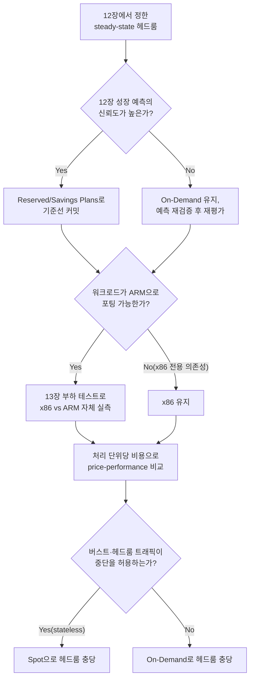

**Cost-Performance 분석**이란 클라우드 인스턴스 타입·커밋먼트 방식·CPU 아키텍처 같은 선택지를 "얼마나 빠른가"가 아니라 "낸 돈 대비 얼마나 일을 하는가"라는 단위 경제로 평가해, 어떤 조합이 조직의 성능 목표를 가장 낮은 총소유비용(TCO)으로 충족하는지 결정하는 일을 말합니다. [12장](/post/design-decisions/capacity-planning-methodology-performance-goals/)에서 필요한 인스턴스 수를 정하고 [13장](/post/design-decisions/load-testing-design-performance-goal-verification/)에서 그 용량이 실제로 목표를 지키는지 검증했다면, 남은 질문은 그 용량을 어떤 인스턴스 타입·아키텍처·구매 방식으로 채울 때 가장 적은 비용으로 같은 성능을 살 수 있는가입니다. 이 질문에 답하지 않으면 두 가지 실패 모드가 동시에 열립니다. 시간당 요금이 싸다는 이유로 처리량이 낮은 인스턴스를 골라 결국 더 많은 인스턴스를 사서 총비용이 오르는 경우, 그리고 반대로 벤더가 발표한 price-performance 수치를 그대로 믿고 커밋먼트에 들어갔다가 실제 워크로드에서는 그 이득이 재현되지 않는 경우입니다. 이 장은 이 두 실패를 피하기 위해 비교 단위를 무엇으로 삼을지, 커밋먼트 스펙트럼을 어떻게 활용할지, 그리고 아키텍처 전환처럼 되돌리기 어려운 결정을 언제·어떻게 검증할지에 대한 판단 기준을 정리합니다.

## 이 장을 읽기 전에

이 장은 [04장: 성능 예산 수립](/post/design-decisions/performance-budgeting-methodology/)에서 정한 latency budget, [12장: Capacity Planning](/post/design-decisions/capacity-planning-methodology-performance-goals/)에서 정한 필요 클러스터 수와 N+1/N+2 헤드룸, [13장: Load Testing 설계](/post/design-decisions/load-testing-design-performance-goal-verification/)에서 얻은 실측 처리량·지연시간 수치를 전제로 합니다. "이 인스턴스가 초당 몇 요청을 처리하는가"라는 숫자가 이미 있어야 이 장의 비율 계산이 성립하므로, 아직 그 숫자가 없다면 이 장보다 12·13장을 먼저 적용하는 편이 좋습니다.

**이 장의 깊이**: **심화** 난이도로, price-performance를 시간당 요금이 아니라 처리 단위당 비용으로 재정의하는 법, On-Demand·Reserved·Savings Plans·Spot 커밋먼트가 성능 목표와 어떻게 맞물리는지, 그리고 x86-ARM 같은 아키텍처 전환을 벤더 수치가 아니라 자체 벤치마크로 검증하는 절차를 다룹니다. **다루지 않는 것**: 필요 인스턴스 수 자체를 계산하는 방법론은 [12장](/post/design-decisions/capacity-planning-methodology-performance-goals/), 그 수치를 검증하는 부하 테스트 설계는 [13장](/post/design-decisions/load-testing-design-performance-goal-verification/), 캐싱으로 요청 자체를 줄이는 전략은 [08장](/post/design-decisions/caching-strategy-performance-impact/), 커넥션 풀·쿼리 최적화 같은 데이터베이스 접근 비용은 [09장](/post/design-decisions/database-access-optimization-strategy/), 지연-처리량 트레이드오프의 큐잉 이론적 배경은 [06장](/post/design-decisions/latency-vs-throughput-architecture-decisions/)에서 각각 다룹니다.

## 당신의 수준에 맞는 경로

| 수준 | 읽을 부분 | 핵심 목표 |
|------|---------|---------|
| **비용 비교를 처음 함** | 도입 ~ "Price-Performance 비율" | 시간당 요금 대신 처리 단위당 비용으로 비교하는 사고를 익힘 |
| **구매 방식을 결정해야 함** | "커밋먼트 스펙트럼" ~ "아키텍처 선택으로서의 인스턴스 결정" | On-Demand·Reserved·Spot과 아키텍처 전환의 트레이드오프 이해 |
| **조직 차원의 결정을 검증함** | "판단 기준" ~ "비판적 시각" | 벤더 수치의 한계와 자체 재검증 필요성을 판단 |

## TCO 개념의 역사와 클라우드 비용 모델의 변천

**총소유비용(TCO, Total Cost of Ownership)** 개념 자체는 20세기 초까지 뿌리를 두고 있지만, IT 구매 의사결정 용어로 널리 퍼진 것은 1987년 Gartner Group이 이를 대중화하면서부터입니다([Wikipedia: Total cost of ownership](https://en.wikipedia.org/wiki/Total_cost_of_ownership)). 이 시기는 기업 컴퓨팅이 중앙 데이터센터에서 개인용 데스크톱으로 옮겨가면서, 장비의 실제 비용이 하나의 IT 예산 항목에 더 이상 온전히 담기지 않게 된 시점과 맞물립니다. 클라우드 이전 시대의 TCO는 하드웨어 구매가, 전력·냉각, 운영 인력, 감가상각을 모두 더하는 정적인 계산이었고, 한 번 사면 몇 년을 그대로 써야 했기 때문에 결정을 자주 되돌릴 수 없었습니다.

2006년 Amazon EC2가 시간 단위 종량제(pay-as-you-go)를 상용화하면서 TCO 계산의 성격이 바뀌었습니다. 자산을 사는 결정에서 사용량에 따라 매 순간 다시 내릴 수 있는 결정으로 바뀐 것입니다. 그 뒤로 이 유연성과 절감을 맞바꾸는 여러 구매 방식이 등장했습니다. 2009년 무렵 도입된 예약 인스턴스(Reserved Instances)는 1년·3년 단위로 사용량을 미리 약정하는 대신 할인을 받는 방식이었고, 비슷한 시기의 스팟(Spot) 시장은 유휴 용량을 경매 방식으로 훨씬 싸게 파는 대신 언제든 회수될 수 있다는 조건을 달았습니다. 이후 특정 인스턴스 타입에 묶이지 않고 시간당 지출 약정만으로 할인을 받는 Savings Plans가 더해지면서 커밋먼트의 유연성은 한층 넓어졌습니다.

같은 시기 클라우드 비용을 다루는 조직적 실천도 하나의 분야로 자리 잡았습니다. 2019년 무렵 결성된 FinOps Foundation은 클라우드 지출을 엔지니어링·재무·비즈니스 팀이 함께 다루는 운영 프레임워크를 표준화하려 했고, 이 조직이 제시하는 정의는 FinOps를 "an operational framework and cultural practice which maximizes the business value of technology"로 규정합니다([FinOps Foundation: What is FinOps?](https://www.finops.org/introduction/what-is-finops/)). 이 정의에서 중요한 것은 FinOps가 단순한 비용 절감 활동이 아니라, 성능·안정성 목표와 지출을 같은 테이블에서 논의하도록 만드는 협업 구조라는 점입니다. 인스턴스 아키텍처 자체의 경쟁도 이 시기에 본격화되었습니다. AWS는 2018년 Graviton(ARM 기반) 1세대를 시작으로 2019년 Graviton2, 2021년 Graviton3를 거쳐 세대마다 코어 수·캐시·메모리 대역폭을 늘려왔고, 2025년 말 프리뷰를 거쳐 2026년 상반기 정식 출시된 Graviton5는 192코어와 이전 세대 대비 큰 폭으로 늘어난 L3 캐시를 앞세워 x86 계열과의 price-performance 경쟁을 다시 한 단계 끌어올렸습니다.

## Price-Performance 비율: 비교 단위를 무엇으로 삼을 것인가

인스턴스를 비교할 때 가장 흔히 저지르는 실수는 시간당 요금(`$/hour`)만으로 저렴함을 판단하는 것입니다. 시간당 요금이 더 싼 인스턴스라도 처리량이 그보다 더 큰 폭으로 낮다면, 목표 처리량을 채우기 위해 더 많은 인스턴스가 필요해져 총비용은 오히려 늘어납니다. 이 문제를 피하려면 비교 단위를 시간당 요금이 아니라 **처리한 작업 단위당 비용**(`$/request`, `$/QPS-hour`, 워크로드에 따라서는 `$/GB 처리`)으로 바꿔야 하며, 이 값이 곧 price-performance 비율입니다. 분모에 들어가는 처리량은 벤더가 발표한 일반 벤치마크 수치가 아니라 [13장](/post/design-decisions/load-testing-design-performance-goal-verification/)에서 자신의 실제 워크로드로 측정한 값이어야 의미가 있습니다. 벤더 벤치마크는 대개 정수 연산·웹 요청·데이터베이스 쿼리처럼 대표성 있는 합성 워크로드로 만들어지며, 부동소수점 연산이 많거나 분기가 잦은 코드, 혹은 특정 SIMD 명령어에 강하게 의존하는 핫패스에서는 그 비율이 그대로 재현되지 않을 수 있습니다.

아래 스크립트는 이미 12·13장에서 확보한 실측 처리량과 각 인스턴스의 시간당 요금(온디맨드·예약·스팟 등 구매 방식별로 다름)을 입력받아 price-performance 비율을 계산하고 순위를 매기는 최소 예시입니다. 여기서 중요한 것은 계산식이 아니라 입력값의 출처입니다 — `measured_qps`에 벤치마크로 검증되지 않은 숫자를 넣으면 결과 순위 전체가 무의미해집니다.

```python
# 실행 환경: Python 3.11
# measured_qps는 13장의 load test(k6 constant-arrival-rate 등)로 실제 측정한 값을 사용해야 함.
from dataclasses import dataclass

@dataclass
class InstanceOption:
    name: str
    hourly_price_usd: float   # 구매 방식(on-demand/reserved/spot)별로 별도 계산
    measured_qps: float       # 13장 부하 테스트로 실측한 처리량 (벤더 벤치마크 아님)

def cost_per_million_requests(opt: InstanceOption) -> float:
    requests_per_hour = opt.measured_qps * 3600
    return (opt.hourly_price_usd / requests_per_hour) * 1_000_000

options = [
    InstanceOption("c7g.xlarge (ARM, on-demand)", hourly_price_usd=0.1445, measured_qps=9800),
    InstanceOption("c7i.xlarge (x86, on-demand)", hourly_price_usd=0.1785, measured_qps=10200),
    InstanceOption("c7g.xlarge (ARM, 1yr reserved)", hourly_price_usd=0.0930, measured_qps=9800),
]

for opt in sorted(options, key=cost_per_million_requests):
    print(f"{opt.name}: ${cost_per_million_requests(opt):.3f} / 100만 요청")
```

이 예시의 가격은 리전·시점에 따라 실제와 다를 수 있는 예시 값이며, 실제 의사결정에는 반드시 현재 가격표와 자신의 워크로드로 측정한 `measured_qps`를 대입해야 합니다. 이 계산이 보여주는 핵심은 순위가 시간당 요금 순서와 다르게 나올 수 있다는 것이고, 처리량 차이가 요금 차이보다 크면 더 비싼 인스턴스가 실제로는 더 저렴한 선택이 됩니다.

## 커밋먼트 스펙트럼: On-Demand·Reserved·Savings Plans·Spot

같은 인스턴스 타입이라도 구매 방식에 따라 실제 지불 가격은 크게 달라지며, 이 구매 방식들은 "얼마나 확실하게 미리 약속하는가"를 축으로 하는 하나의 스펙트럼을 이룹니다. **On-Demand**는 약정 없이 쓴 만큼만 내는 방식으로 유연하지만 단가가 가장 높습니다. **Reserved Instances**와 **Savings Plans**는 1년 또는 3년 단위로 사용량(또는 지출액)을 미리 약속하는 대신 상당한 할인을 받는 방식으로, [12장](/post/design-decisions/capacity-planning-methodology-performance-goals/)에서 정한 N+1/N+2 헤드룸 중에서도 트래픽이 줄어들 일이 거의 없는 **안정적인 기준선(steady-state baseline)** 용량에 적용할 때 안전합니다. 예측이 틀려도 이미 약정한 용량을 놀리게 되는 것이 이 방식의 근본적인 리스크이므로, 약정 기간은 [12장](/post/design-decisions/capacity-planning-methodology-performance-goals/)의 성장 예측이 얼마나 신뢰할 수 있는지에 맞춰 골라야 합니다. **Spot Instances**는 클라우드 사업자의 유휴 용량을 경매 방식으로 최대 90%까지 할인된 가격에 제공하지만([AWS: Amazon EC2 Spot Instances](https://aws.amazon.com/ec2/spot/)), 용량이 필요해지면 짧은 통지 후 회수될 수 있어 리전·인스턴스 타입별 평균 회수 빈도가 공개되어 있는 만큼 그 변동성 자체를 설계에 반영해야 합니다.

이 스펙트럼을 헤드룸 구조에 그대로 대응시키면 결정이 단순해집니다. 절대 줄지 않을 기준선은 Reserved·Savings Plans로 약정해 최저 단가를 확보하고, 트래픽이 늘었다 줄었다 하는 탄력적 구간은 On-Demand로 채우며, 재시작 가능하고 상태를 갖지 않는(stateless) 배치·비동기 작업이나 여유 헤드룸은 Spot으로 채워 회수 위험을 감수할 가치가 있는 곳에만 그 위험을 배치합니다. 지연시간 SLO가 타이트한 프론트엔드 요청 경로에 Spot을 단독으로 쓰면, 회수 통지 이후 새 인스턴스가 뜨고 예열되는 동안 그 경로 전체가 SLO를 위반할 수 있으므로 페일오버 대상 없이 사용하는 것은 위험합니다. 실제 가격·회수 빈도 데이터를 확인하려면 아래처럼 클라우드 사업자의 CLI로 최근 가격 이력을 조회해 볼 수 있습니다.

```bash
# 최근 스팟 가격 이력 조회 (예시): 실제 결정 전에는 콘솔의 Spot Instance Advisor로
# 리전·인스턴스 타입별 평균 회수 빈도까지 함께 확인해야 함
aws ec2 describe-spot-price-history \
  --instance-types c7g.xlarge \
  --product-descriptions "Linux/UNIX" \
  --max-items 5
```

## 아키텍처 선택으로서의 인스턴스 결정: x86 vs ARM

인스턴스 타입 선택은 때로 요금표 안에서의 선택을 넘어 **CPU 명령어 집합 아키텍처(ISA)**를 바꾸는 결정이 됩니다. AWS의 Graviton 계열이 대표적인 예로, 공식 제품 페이지는 Graviton 기반 인스턴스가 비교 가능한 x86 기반 인스턴스보다 최대 20% 저렴하고 에너지는 최대 60% 적게 쓴다고 밝히고 있습니다([AWS: AWS Graviton](https://aws.amazon.com/ec2/graviton/)). 이 수치만 보면 ARM으로 옮기지 않을 이유가 없어 보이지만, 이 결정은 [12장](/post/design-decisions/capacity-planning-methodology-performance-goals/)에서 다룬 수평·수직 확장 결정과 달리 되돌리는 비용이 훨씬 큽니다. 컴파일 툴체인, 서드파티 바이너리 의존성, 그리고 C++ 코드가 x86 전용 SIMD 명령어(AVX2·AVX-512 등)에 직접 의존하는 핫패스를 갖고 있다면 ARM의 SVE/NEON으로 옮기는 데 별도의 포팅과 재검증이 필요합니다. 이 포팅 비용을 무시하고 벤더가 발표한 일반 수치만으로 전환을 결정하면, 실제 워크로드에서는 그 이득이 재현되지 않거나 포팅 자체의 공수가 절감액을 넘어서는 경우가 생깁니다.

세대 간 격차도 이 결정을 계속 움직이는 변수입니다. Graviton 계열은 세대마다 코어 수·캐시 용량·코어 간 지연을 크게 바꿔왔고, 2025년 말 프리뷰를 거쳐 공개된 최신 세대는 192개 코어와 이전 세대 대비 대폭 확장된 L3 캐시, 그리고 더 낮아진 코어 간 지연을 내세우고 있습니다. 이는 아키텍처 전환 결정이 한 번 내리고 끝나는 것이 아니라, 다음 세대가 나올 때마다 다시 검토해야 하는 살아있는 결정이라는 뜻입니다. 따라서 x86-ARM 전환은 벤더의 발표 자료를 출발점으로 삼되, 최종 판단은 반드시 [13장](/post/design-decisions/load-testing-design-performance-goal-verification/)의 부하 테스트 절차를 두 아키텍처에 동일하게 적용한 자체 벤치마크로 내려야 합니다.



## 흔한 오개념

**"시간당 요금이 싼 인스턴스가 결국 더 저렴하다"**는 가장 흔한 오해입니다. 처리량이 요금 차이보다 더 큰 폭으로 낮다면 목표 처리량을 채우는 데 더 많은 인스턴스가 필요해지고, 총비용은 오히려 늘어납니다. 비교는 항상 시간당 요금이 아니라 처리 단위당 비용으로 해야 합니다.

**"Reserved Instances나 Savings Plans에 약정하면 무조건 이득"**이라는 가정도 위험합니다. 약정한 용량은 실제 사용 여부와 무관하게 청구되므로, [12장](/post/design-decisions/capacity-planning-methodology-performance-goals/)의 성장 예측이 부정확해 트래픽이 예상보다 줄면 약정 자체가 낭비가 됩니다. 약정은 변동성이 낮은 기준선에만 걸고, 탄력적 구간은 On-Demand·Spot으로 남겨야 합니다.

**"벤더가 발표한 price-performance 수치(예: ARM 인스턴스가 x86 대비 최대 20% 저렴)를 우리 워크로드에도 그대로 적용할 수 있다"**도 흔한 오개념입니다. 이 수치는 벤더가 선택한 대표 워크로드 기준이며, SIMD 의존도가 높거나 분기가 잦은 코드에서는 그 격차가 더 크거나 더 작게, 때로는 반대 방향으로 나타날 수 있습니다. 전환 전에는 반드시 자체 워크로드로 재현해야 합니다.

## 판단 기준

| 상황 | 권장 | 비권장 |
|------|------|--------|
| 인스턴스 비교 단위 | 처리 단위당 비용(`$/request` 등) | 시간당 요금만 비교 |
| 안정적인 기준선 용량(12장 N+1) | Reserved/Savings Plans 커밋 | 전량 On-Demand로 방치 |
| 변동 폭이 큰 탄력적 구간 | On-Demand로 유연하게 대응 | 불확실한 예측에 장기 약정 |
| 재시작 가능한 stateless 배치·헤드룸 | Spot으로 비용 절감 | 지연 SLO가 타이트한 경로에 Spot 단독 사용 |
| 아키텍처(x86/ARM) 전환 검토 | 13장 절차로 자체 벤치마크 후 결정 | 벤더 발표 수치만으로 전환 확정 |
| 약정 기간 선택 | 12장 성장 예측의 신뢰도에 맞춰 1yr/3yr 결정 | 예측 불확실성을 무시하고 장기 약정 |
| 비용-성능 결정의 근거 자료 | 13장에서 검증한 실측 처리량 | 마케팅 벤치마크·타사 사례 그대로 대입 |

## 비판적 시각: 한계와 트레이드오프

price-performance 수치는 발표 시점의 스냅샷일 뿐, 세대 교체 속도를 따라가지 못하면 금방 낡습니다. 몇 년 사이 세대마다 코어 수·캐시·가격이 다시 조정되는 것에서 보듯, "지금 20% 저렴하다"는 사실이 다음 세대에도 유지된다는 보장은 없으며, 이 장의 계산은 한 번 내리고 끝나는 결정이 아니라 [10장](/post/design-decisions/building-team-performance-culture/)에서 다루는 팀 성능 문화와 Tr.12의 회귀 방지 프로세스처럼 주기적으로 재검증해야 하는 살아있는 절차로 다뤄야 합니다.

비용-성능 분석의 정확도는 그 위에 있는 용량 예측의 정확도를 넘어설 수 없습니다. [12장](/post/design-decisions/capacity-planning-methodology-performance-goals/)에서 다뤘듯 트래픽 성장 예측 자체가 불확실하므로, 그 예측을 입력으로 삼는 커밋먼트 결정도 같은 불확실성을 그대로 물려받습니다. 예측이 자주 빗나가는 조직이라면 장기 약정 비중을 낮추고 단기 재평가 주기를 짧게 가져가는 편이 더 안전한 경우가 많습니다.

마지막으로 FinOps 같은 거버넌스 체계를 도입하는 것 자체에도 비용이 있습니다. 비용-성능 분석을 정례화하고 여러 팀의 지출·성능 데이터를 모으는 프로세스는 인력과 도구 투자를 요구하며, 클라우드 지출 규모가 작은 조직에서는 이 거버넌스 자체의 운영 비용이 절감액을 넘어설 수 있습니다. 어느 수준의 정례화가 적절한지는 조직의 클라우드 지출 규모와 변화 속도에 비례해 판단해야 하며, 모든 조직이 같은 수준의 정교함을 갖출 필요는 없습니다.

## 마무리

- [ ] 인스턴스를 시간당 요금이 아니라 처리 단위당 비용(price-performance 비율)으로 비교할 수 있다.
- [ ] On-Demand·Reserved·Savings Plans·Spot의 트레이드오프를 12장의 헤드룸 구조(기준선 vs 탄력적 구간)에 대응시켜 설명할 수 있다.
- [ ] 약정 기간을 성장 예측의 신뢰도에 맞춰 선택해야 하는 이유를 말할 수 있다.
- [ ] x86-ARM 같은 아키텍처 전환을 벤더 수치가 아니라 13장의 자체 벤치마크로 검증해야 하는 이유를 설명할 수 있다.
- [ ] price-performance 수치가 세대 교체·워크로드에 따라 달라지는 스냅샷임을 인지하고 주기적 재검증의 필요성을 판단할 수 있다.

**이전 장**: [Load Testing 설계](/post/design-decisions/load-testing-design-performance-goal-verification/) (챕터 13)

여기서 다룬 판단 기준들이 실제로 유지되는지는 결국 [Tr.12: 성능 회귀 방지](/post/regression-prevention/getting-started-performance-regression-prevention-strategies/)의 자동화된 게이트로 이어져야 하며, 트랙 간 전체 그림과 다른 11개 트랙의 권장 순서는 [Low-latency 최적화 시리즈 개요](/post/low-latency-optimization-series/getting-started-low-latency-optimization-series-overview/)에서 확인할 수 있습니다.

**다음 장**: [메모리 안전성 트레이드오프](/post/design-decisions/memory-safety-performance-tradeoffs-rust-ffi/) (챕터 16)
