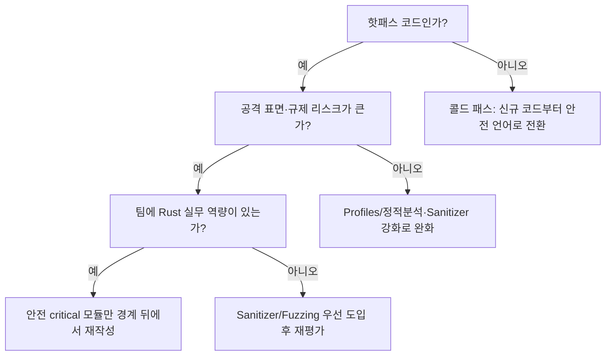

**메모리 안전성 트레이드오프**란 극한 성능이 요구되는 코드베이스에서 "안전성 경계(safety boundary)를 어디에 그을 것인가"를 정하는 아키텍처·조직 의사결정을 말합니다. C++로 짠 초저지연 핫패스는 손으로 관리하는 포인터와 수명 덕분에 빠르지만 use-after-free·이중 해제 같은 메모리 오류의 위험을 안고, Rust처럼 컴파일 타임에 소유권을 강제하는 언어는 그 위험을 없애는 대신 기존 C++ 자산과의 경계(FFI, Foreign Function Interface)에서 새로운 비용과 새로운 버그 클래스를 만듭니다. 이 장은 "Rust냐 C++냐"를 고르는 장이 아니라, 이미 C++로 돌아가는 핫패스가 있는 팀이 안전성 요구(규제·보안·장애 비용)와 재작성 비용·팀 역량을 놓고 경계의 위치를 결정하는 기준을 다룹니다.

## 이 장을 읽기 전에

**완전한 초보자?** 이 장은 [트랙 인트로](/post/design-decisions/getting-started-performance-design-decision-making/)에서 정리한 "이 트랙은 경계를 정하는 트랙"이라는 프레임과, [가독성 vs 성능](/post/design-decisions/readability-vs-performance-tradeoff/)에서 다룬 복잡도-성능 트레이드오프 판단 방식을 전제로 합니다. C/C++에서 흔한 메모리 오류(use-after-free, buffer overflow, double free)가 무엇인지, FFI가 서로 다른 언어의 함수를 서로 호출하게 해주는 경계라는 정도만 알면 충분합니다.

**이 장의 깊이**: 이 장은 **전문가** 난이도입니다. Rust FFI를 주된 예시로 삼아 안전성 경계를 어디에 둘지의 판단 기준·검증 도구의 커버리지 공백·조직적 비용을 다룹니다. **다루지 않는 것**: Rust 언어 문법과 unsafe API 사용법 자체(공식 Rust 문서 참고), C++ 컴파일러별 하드닝 플래그의 구체 목록(→ Tr.02 C++ 언어 트랙), 규제·감사 요구사항 자체의 세부 절차(→ [15장: 규제·보안 제약 하 성능](/post/design-decisions/regulated-secure-performance-tradeoffs-expert/))입니다.

## 당신의 수준에 맞는 경로

| 수준 | 읽을 부분 | 핵심 목표 |
|------|---------|---------|
| **처음 접하는 실무자** | "메모리 안전 언어 논쟁의 좌표" | 왜 지금 이 논쟁이 조직 의사결정 안건이 됐는지 배경을 이해 |
| **FFI를 도입 중인 엔지니어** | "안전 경계는 어떻게 동작하는가" ~ "흔한 오개념" | 경계에서 소유권이 넘어가는 방식과 검증 공백을 파악 |
| **리드·아키텍트** | "판단 기준" ~ "비판적 시각" | 안전 경계의 위치를 조직 차원에서 결정하고 근거를 문서화 |

---

## 메모리 안전 언어 논쟁의 좌표: CVE 통계에서 WG21 표결까지

이 논쟁이 조직의 의사결정 안건이 된 것은 추상적인 이념 때문이 아니라 축적된 취약점 통계 때문입니다. 구글과 마이크로소프트가 각각 공개한 분석에서 Chromium과 Windows의 고심각도 취약점 중 오랫동안 70% 안팎이 메모리 안전 결함(버퍼 오버런, use-after-free 등)에서 비롯됐다고 보고되어 왔고([Chromium 프로젝트: Memory safety](https://www.chromium.org/Home/chromium-security/memory-safety/), [Microsoft MSRC: We need a safer systems programming language](https://www.microsoft.com/en-us/msrc/blog/2019/07/we-need-a-safer-systems-programming-language) 참고), Android는 신규 코드에서 메모리 안전 언어 비중을 늘린 뒤 2024년 기준 메모리 안전 취약점 비중을 24% 수준까지 낮췄다고 보도되었습니다([Google Security Blog: Eliminating Memory Safety Vulnerabilities at the Source](https://security.googleblog.com/2024/09/eliminating-memory-safety-vulnerabilities-Android.html) 참고). 이 수치는 "메모리 안전 오류가 침해 사고의 다수를 차지한다"는 근거로 반복 인용되며, 각국 사이버 보안 기관이 정책 문서를 낼 때의 출발점이 됩니다.

Rust는 2015년 1.0 버전을 내놓으며 컴파일 타임에 소유권(ownership)과 대여(borrow) 규칙을 강제해 런타임 오버헤드 없이 use-after-free·데이터 레이스 다수를 원천 차단하는 접근을 대중화했고, 이후 리눅스 커널이 2022년 말 6.1 버전부터 커널 모듈 작성 언어로 Rust를 받아들이면서 "기존 C 자산 옆에 Rust를 놓는" 점진적 도입 모델이 하나의 표준 패턴으로 자리잡았습니다. 이 흐름은 2025년 6월 미국 CISA(사이버보안·인프라보안국)와 NSA가 공동으로 낸 메모리 안전 언어 권고 문서로 이어졌는데, 이 문서는 메모리 안전 언어로의 전환을 촉구하면서 위와 같은 CVE 비중 통계를 근거로 들고, DARPA의 TRACTOR 프로그램처럼 C 코드를 자동으로 Rust로 변환하는 연구에 대한 투자도 함께 언급합니다([The Register: CISA/NSA call for memory safe languages](https://www.theregister.com/2025/06/27/cisa_nsa_call_formemory_safe_languages/) 참고. CISA 원문 사이트는 접근이 제한되어 이 보도를 대체 출처로 인용합니다).

C++ 표준위원회(WG21)도 같은 압력에 대응했지만 접근은 갈렸습니다. Sean Baxter가 제안한 "Safe C++"는 Rust에 가까운 소유권·수명 규칙을 C++ 언어 자체에 새로 들여오는 방식이었던 반면, Bjarne Stroustrup과 Herb Sutter가 주도한 ["Profiles"(P3081)](https://isocpp.org/files/papers/P3081R2.pdf)는 기존 C++ 문법 안에서 포인터 산술·C 스타일 캐스트 등 위험한 패턴을 프로젝트·모듈 단위로 선택적으로 금지하는 방식을 취합니다. C++ Safety and Security 연구 그룹 표결에서 Profiles 19표, Safe C++ 9표, 양쪽 모두 11표, 중립 6표로 갈렸고, 위원회는 Safe C++가 사실상 언어 재설계에 가까워 명세·구현 리스크와 생태계 마이그레이션 부담이 크다고 판단해 C++26 일정에 맞는 점진적 경로인 Profiles 쪽을 택했습니다([InfoWorld: Safe C++ proposal for memory safety flames out](https://www.infoworld.com/article/4065702/safe-c-proposal-for-memory-safety-flames-out.html) 참고). 이 결정은 아직 진행형입니다. Profiles의 표준 문구와 구현체는 C++26을 목표로 작업 중이라, 지금 당장 프로덕션에서 기댈 수 있는 완성된 안전망은 아닙니다.

이 역사에서 이 트랙이 가져가야 할 결론은 "어느 언어가 이겼는가"가 아니라, 극한 성능 코드베이스를 가진 조직이라면 이미 이 논쟁의 결과와 무관하게 "안전성 경계를 어디에 둘 것인가"라는 질문에 답해야 하는 시점이 왔다는 것입니다.

## 안전 경계는 어떻게 동작하는가

### FFI 경계에서 소유권이 넘어가는 방식

Rust와 C++는 서로 다른 객체 모델을 갖습니다. C++의 가상 함수 테이블, 예외 전파, 소멸자 기반 RAII는 Rust 쪽에서 그대로 이해할 수 없고, Rust의 트레이트 객체나 제네릭 역시 C++가 직접 링크할 수 없습니다. 두 언어가 공통으로 이해하는 것은 `extern "C"` 함수 시그니처와 그 아래의 안정된 C ABI뿐이라, 그 이상의 타입(문자열, 컬렉션, 다형 객체)을 주고받으려면 양쪽이 합의한 수동 프로토콜이나 `cxx` 같은 브리지 라이브러리가 필요합니다. 아래는 C++ 쪽이 핸들을 만들어 Rust 라이브러리에 소유권을 넘기는 최소 예시입니다.

```cpp
// C++: 핸들을 만들고 사용한 뒤 반드시 한 번만 파괴 함수를 호출해야 한다.
#include <cstddef>

extern "C" {
  void* market_data_handle_create(const char* config, std::size_t len);
  void  market_data_handle_destroy(void* handle);
}

void run(const char* cfg, std::size_t len) {
  void* h = market_data_handle_create(cfg, len);
  // ... h를 사용하는 핫패스 ...
  market_data_handle_destroy(h); // 이 호출을 빠뜨리면 Rust 쪽 Box가 누수된다
}
```

Rust 쪽은 이 원시 포인터를 받아 `Box`로 감싸 소유권을 명시적인 값으로 되돌리고, 파괴 함수 안에서만 다시 `Box`로 복원해 드롭시킵니다. 이 지점이 바로 borrow checker의 보호가 일시적으로 꺼지는 자리입니다.

```rust
// Rust: Box::into_raw로 소유권을 C++ 쪽 포인터에 실어 보내고,
// destroy 함수 안에서만 Box::from_raw로 되돌려 drop 시킨다.
use std::os::raw::c_char;

pub struct MarketDataHandle { /* 필드 생략 */ }

impl MarketDataHandle {
    fn new(_config: *const c_char, _len: usize) -> Self { MarketDataHandle {} }
}

#[no_mangle]
pub extern "C" fn market_data_handle_create(
    config: *const c_char,
    len: usize,
) -> *mut MarketDataHandle {
    Box::into_raw(Box::new(MarketDataHandle::new(config, len)))
}

/// # Safety
/// `handle`은 `market_data_handle_create`가 반환한 값이어야 하고, 정확히 한 번만 호출돼야 한다.
#[no_mangle]
pub unsafe extern "C" fn market_data_handle_destroy(handle: *mut MarketDataHandle) {
    if !handle.is_null() {
        drop(Box::from_raw(handle));
    }
}
```

두 코드 모두 각 언어 컴파일러 관점에서는 문법적으로 유효하지만, "정확히 한 번 파괴"라는 계약은 두 언어 어느 쪽 컴파일러도 강제하지 못합니다. Rust의 소유권 검사는 `Box::from_raw` 안쪽에서만 다시 작동하므로, 이 경계 자체는 여전히 사람이 지키는 문서화된 약속이며, 조직이 FFI 경계 코드를 일반 코드보다 더 무겁게 리뷰해야 하는 이유이기도 합니다.

### 안전성 검증 도구가 커버하는 범위

경계 양쪽을 도구로 검증할 때 흔히 놓치는 것은 "어느 도구도 경계 자체를 온전히 커버하지 못한다"는 사실입니다. Miri는 Rust MIR을 인터프리트해 정의되지 않은 동작을 잡아내지만 안전한 Rust와 일부 unsafe 블록에 한정되고 C++ 쪽 코드는 볼 수 없습니다. AddressSanitizer·UndefinedBehaviorSanitizer·ThreadSanitizer는 C++ 쪽의 메모리·타입·데이터 레이스 오류를 잡지만 계측 오버헤드 때문에 프로덕션 핫패스에서 상시로 켜 둘 수 없고, Rust 쪽 안전성 불변식은 이해하지 못합니다. 결국 정확히 FFI 경계 함수들, 즉 `market_data_handle_create`/`destroy` 같은 지점은 두 도구 체계 사이의 공백에 놓이며, 이 부분만 별도로 표적화한 퍼징(`cargo-fuzz` 등)이나 계약 테스트를 조직이 직접 마련해야 합니다.

### FFI 호출 자체는 거의 공짜다 — 진짜 비용은 다른 곳에 있다

`extern "C"` 함수 호출은 가상 호출 디스패치나 예외 언와인딩이 끼지 않는 일반 함수 호출과 ABI 수준에서 동급이라, 호출 자체의 오버헤드는 보통 다른 작업량에 묻힐 만큼 작습니다. [`cxx`](https://cxx.rs/) 같은 브리지 라이브러리도 정적 타입 매핑과 컴파일 타임 검증만 추가할 뿐 런타임 복사·직렬화·런타임 검사를 넣지 않는 방향으로 설계되어 있어, "경계를 넘는 것 자체"가 병목이 되는 경우는 흔치 않습니다. 실제 비용은 (1) `std::string`↔`String`처럼 서로 다른 힙 표현을 가진 비-POD 타입을 오갈 때의 복사, (2) 배치 대신 매 원소마다 경계를 넘나드는 촘촘한 호출 패턴, (3) 기본적으로 크로스 언어 LTO가 꺼져 있어 컴파일러가 경계 너머로 인라인하지 못하는 데서 생깁니다. 아래는 순수 호출 오버헤드만 격리해 측정하는 벤치마크 뼈대이며, 실제 배율은 링크 방식·LTO 설정·CPU 마이크로아키텍처에 따라 달라지므로 각자 환경에서 재현해 확인해야 합니다.

```cpp
#include <benchmark/benchmark.h>

extern "C" long long ffi_add(long long a, long long b); // Rust cdylib에서 제공

static long long native_add(long long a, long long b) { return a + b; }

static void BM_NativeCall(benchmark::State& state) {
  long long x = 1;
  for (auto _ : state) benchmark::DoNotOptimize(x = native_add(x, 1));
}
BENCHMARK(BM_NativeCall);

static void BM_FfiCall(benchmark::State& state) {
  long long x = 1;
  for (auto _ : state) benchmark::DoNotOptimize(x = ffi_add(x, 1));
}
BENCHMARK(BM_FfiCall);

BENCHMARK_MAIN();
```

Rust 쪽은 `cargo build --release`로 만든 `#[no_mangle] pub extern "C" fn ffi_add`를 정적/동적 라이브러리로 내보내고, `g++ -O2 bench.cpp libffi_add.a -lbenchmark -lpthread`(x86-64 Linux, GCC 13 또는 Clang 17 기준 예시)로 링크해 실행합니다. 크로스 언어 LTO를 켜지 않은 기본 설정에서는 `BM_FfiCall`이 `BM_NativeCall`보다 약간 더 느리게 나오는 경우가 흔하지만, 이 차이가 실제 워크로드에서 유의미한지는 호출 빈도와 원소 크기에 달려 있으므로 프로파일러로 실제 핫패스에서 재현하기 전에는 결론을 내리지 않는 것이 좋습니다(측정 방법론은 [Tr.01 통계적 벤치마킹](/post/profiling-analysis/statistical-benchmarking/) 참고).

## 흔한 오개념 세 가지

**"Rust로 바꾸면 자동으로 더 빨라진다"**는 사실이 아닙니다. Borrow checker는 안전성을 보장하는 도구이지 성능을 보장하는 도구가 아니며, 경계를 잘못 그으면 원래 없던 마샬링 비용이 추가되어 오히려 느려질 수 있습니다. 성능은 항상 별도로 측정해야 하는 대상입니다.

**"unsafe 블록이 있으면 그 Rust 코드는 안전하지 않으니 의미가 없다"**는 것도 오해입니다. `unsafe`는 안전성 포기 선언이 아니라 컴파일러가 자동으로 증명해 주지 못하는 좁은 영역을 사람이 명시적으로 표시해 감사 범위를 좁히는 도구입니다. 나머지 코드베이스는 여전히 borrow checker의 보호를 받고, 리뷰어는 `unsafe` 블록만 집중해서 볼 수 있습니다.

**"메모리 안전 언어 도입은 곧 전면 재작성을 뜻한다"**는 것도 실무와 다릅니다. Android가 취한 경로처럼 신규 코드부터 안전 언어로 작성하고 기존 자산은 경계 뒤에 남겨 두는 점진적 모델이 일반적이며, 전면 재작성은 오히려 위험이 큰 선택지 중 하나로 취급됩니다.

## 판단 기준: 안전 경계를 어디에 둘 것인가

안전 경계의 위치는 "이 컴포넌트가 공격 표면에 얼마나 노출되는가"와 "이미 검증된 핫패스를 건드리는 비용이 재작성 위험을 정당화하는가"라는 두 축으로 갈립니다. 아래 표는 흔한 상황별로 권장·비권장 방향을 정리한 것이고, 실제 결정은 팀의 Rust 역량과 규제 요구 수준에 따라 조정됩니다.

| 상황 | 권장 방향 | 비권장 |
|------|---------|--------|
| 신규 네트워크 파싱 경로(공격 표면 큼) | 신규 코드는 안전 언어로, 경계는 파싱 입구에 배치 | 레거시 파서에 패치만 반복 누적 |
| 이미 검증된 초저지연 핫루프(수십 ns 단위) | 현상 유지 + 정적분석·Profiles·Sanitizer 상시화 | 검증 없이 전면 재작성 착수 |
| 팀에 Rust 실무 경험이 없고 납기가 임박 | Sanitizer/Fuzzing 우선 강화 후 재평가 | 무리하게 부분 재작성부터 시작 |
| 규제 대상 컴포넌트(15장 참고) | 규제팀과 함께 경계·감사 로그를 같이 설계 | 성능팀 단독으로 경계 결정 |
| 크로스 언어 빌드·릴리스 파이프라인 미비 | 도구체인(CI, 링크, 버전 고정)부터 정비 | 도구 정비 없이 경계부터 확장 |



이 흐름에서 나온 결정은 성능 코드 리뷰 체크리스트에 반영해 새 FFI 경계가 생길 때마다 같은 기준으로 검토되도록 하는 것이 좋습니다([11장: 성능 코드 리뷰 가이드](/post/design-decisions/performance-focused-code-review-guide/) 참고). 경계를 확정한 뒤에는 그 경계가 시간이 지나며 조용히 무너지지 않도록 회귀 방지 체계에 편입시킵니다([Tr.12 성능 회귀 방지 인트로](/post/regression-prevention/getting-started-performance-regression-prevention-strategies/) 참고).

## 비판적 시각: 한계와 트레이드오프

FFI 경계 자체가 새로운 버그 클래스를 만든다는 점은 과소평가되기 쉽습니다. 이중 해제나 소유권 프로토콜 누락은 두 언어 컴파일러 중 어느 쪽도 강제하지 못하는 "문서로만 존재하는 계약"에 의존하므로, 안전 언어를 도입했다고 해서 조직의 리뷰 부담이 사라지는 것이 아니라 그 부담이 경계 지점으로 응축됩니다.

C++ Profiles는 아직 초기 표준화 단계입니다. P3081은 C++26을 목표로 하고 있고 이 글 시점에도 표준 문구와 구현체가 함께 다듬어지는 중이라, 지금 당장 프로덕션이 기댈 수 있는 완성된 안전망으로 취급하면 안 됩니다. Safe C++가 부결된 이유(사실상 언어 재설계, 생태계 마이그레이션 부담)를 이해하지 않고 Profiles를 "이미 해결된 문제"로 낙관하는 것은 위험한 가정입니다.

부분 도입의 조직적 비용도 실질적입니다. 두 언어의 빌드 시스템과 CI 파이프라인을 나란히 유지하고, 두 언어를 모두 다룰 수 있는 인력을 채용·교육하는 비용은 종종 FFI 경계 자체의 성능 이득보다 커서, 이 논쟁이 성능 논쟁이 아니라 조직 역량 논쟁으로 흘러가는 경우가 많습니다.

무엇보다 "안전이냐 성능이냐"라는 프레이밍 자체가 종종 잘못 제기됩니다. 진짜 트레이드오프는 안전성 그 자체가 아니라 안전 경계로 옮겨가는 이행 비용과 검증 비용에 있습니다. 이 구분을 놓치면 팀 간 논쟁이 기술적 근거 없는 이념 대립으로 흐르기 쉽습니다.

## 마무리

- [ ] 이 코드베이스에서 안전성 경계를 둘 수 있는 최소 두세 개의 후보 위치를 제시할 수 있는가?
- [ ] FFI 호출 자체의 비용과 비-POD 타입 마샬링 비용을 구분해 측정 계획을 세울 수 있는가?
- [ ] 전면 재작성 대신 부분 도입이 정당화되는 조건과 그 반대 조건을 구분할 수 있는가?
- [ ] Miri·Sanitizer·Fuzzing이 각각 커버하지 못하는 공백을 식별하고 경계 코드에 별도 검증을 배정할 수 있는가?
- [ ] 규제 요구([15장](/post/design-decisions/regulated-secure-performance-tradeoffs-expert/))와 안전 경계 결정을 하나의 문서로 연결할 수 있는가?

**이전 장**: [트랙 인트로](/post/design-decisions/getting-started-performance-design-decision-making/) (00장)

**다음 장에서는** 이 트랙 전체가 전제로 쓰는 어휘를 정리합니다. SLO, p99, throughput, latency budget 같은 용어의 정의와 첫 성능 목표를 세우는 감각을 다루며, 01장부터 이어지는 판단 기준들이 공통으로 참조하는 기초를 놓습니다.

→ [성능 용어·지표 입문](/post/design-decisions/performance-terminology-metrics-fundamentals/)
