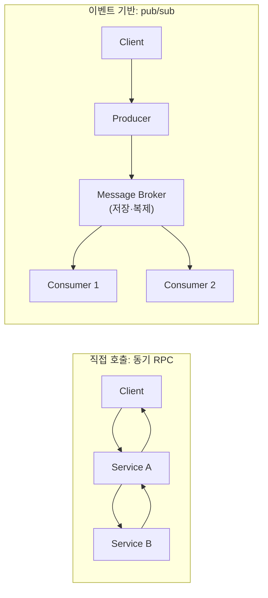

**Event-driven 아키텍처 성능**이란 서비스 간 통신을 동기 직접 호출(synchronous direct call) 대신 메시지 브로커(message broker)를 통한 비동기 발행·구독(pub/sub)으로 구성했을 때 지연시간과 처리량이 어떻게 구조적으로 달라지는지 파악하고, 그 트레이드오프를 근거로 언제 브로커를 두고 언제 직접 호출을 유지할지 판단하는 것을 말합니다. 팀들은 흔히 "결합도를 낮춘다"는 이유만으로 이벤트 기반 설계를 채택한 뒤, 브로커가 요청 경로에 추가하는 지연을 나중에야 발견합니다. 반대로 팬아웃(fan-out)과 백프레셔(backpressure)가 필요한 지점에서도 "동기 호출이 더 빠르다"는 직관만으로 직접 호출을 고집하다가 한 서비스의 장애가 호출 체인 전체로 전파되는 결합 위험을 떠안기도 합니다. 이 장은 두 통신 방식이 지연·처리량·결합도 축에서 근본적으로 무엇을 교환하는지를 메커니즘 수준에서 짚고, 선택 기준을 정리합니다.

## 이 장을 읽기 전에

이 장은 [07장: 지연시간 vs 처리량](/post/design-decisions/latency-vs-throughput-architecture-decisions/)에서 다룬 Little's Law·큐잉·배칭의 구조적 상충과, [08장: Low-latency 아키텍처 패턴](/post/design-decisions/low-latency-architecture-design-patterns/)에서 다룬 이벤트 루프·비동기 I/O 실행 모델, [01장: 성능 용어·지표 입문](/post/design-decisions/performance-terminology-metrics-fundamentals/)에서 다룬 지연시간·처리량의 기본 정의를 전제로 합니다. 메시지 큐, pub/sub, 비동기 처리라는 단어가 낯설지 않은 정도면 충분합니다.

**이 장의 깊이**: **심화** 난이도로, 메시지 브로커가 직접 호출 대비 지연시간·처리량 곡선을 왜, 어디서 바꾸는지를 전달 보장(delivery semantics)과 결합 구조(choreography/orchestration) 관점에서 설명하고, 브로커 도입 여부를 판단하는 기준을 제공합니다. **다루지 않는 것**: 큐잉·배칭 자체의 수학적 근거(Little's Law, 유틸리제이션)는 [07장](/post/design-decisions/latency-vs-throughput-architecture-decisions/)에서, 브로커를 도입한 뒤 그 실행 경로를 어떤 스레드 모델로 짤지는 [08장](/post/design-decisions/low-latency-architecture-design-patterns/)에서, 특정 브로커 제품의 클러스터 운영·튜닝 상세와 네트워크 스택 최적화는 [Tr.10 네트워크 최적화 트랙](/post/network-optimization/getting-started-network-performance-tuning/)에서 다룹니다. 이 장은 "브로커를 쓸지 말지, 쓴다면 무엇을 대가로 치르는지"라는 설계 판단에 집중합니다.

## 당신의 수준에 맞는 경로

| 수준 | 읽을 부분 | 핵심 목표 |
|------|---------|---------|
| **초보자** | "역사·배경" ~ "직접 호출과 이벤트 기반 통신의 구조적 차이" | 두 통신 방식이 실행 시점·결합도에서 근본적으로 다른 이유 이해 |
| **중급자** | "브로커가 더하는 지연 구성요소" ~ "결합 구조의 선택" | 브로커 홉·전달 보장·다단계 워크플로 조율이 지연·복잡도에 미치는 영향 파악 |
| **전문가** | "판단 기준" ~ "비판적 시각" | 워크로드·조직 구조에 따라 직접 호출과 브로커를 선택·조합하는 판단 |

## 역사·배경: 메시지 큐에서 이벤트 기반 아키텍처로

비동기 메시징 자체는 새로운 개념이 아닙니다. IBM은 1993년 MQSeries(현 IBM MQ)를 출시해 기업 시스템 간 메시지 큐 통신을 상용화했고, 이후 엔터프라이즈 통합 패턴(Enterprise Integration Patterns)이라는 이름으로 메시지 채널·라우터·변환기 같은 구조가 정리되었습니다. 오늘날 low-latency·대용량 스트리밍 환경에서 표준처럼 쓰이는 Apache Kafka는 2010년 LinkedIn 내부에서 Jay Kreps, Neha Narkhede, Jun Rao가 로그 처리용 분산 메시징 시스템으로 설계했고, 2011년 오픈소스로 공개되어 같은 해 NetDB 워크숍에서 논문으로 발표된 뒤 Apache Software Foundation에 기증되었습니다. 이 계보에서 나온 브로커들은 "생산자와 소비자를 시간·장소적으로 분리한다"는 목표를 공유하지만, 그 대가로 무엇을 지연시키는지는 구현마다 다릅니다.

같은 시기 반응형 시스템(reactive systems) 진영은 메시지 기반 통신을 지연·처리량이 아니라 <strong>회복성(resilience)과 탄력성(elasticity)</strong>의 수단으로 정식화했습니다. Jonas Bonér 등이 2014년 9월 16일 공개한 Reactive Manifesto 2.0은 메시지 기반 통신이 "컴포넌트 사이의 경계를 확립해 느슨한 결합·격리·위치 투명성을 보장"하며, 메시지 큐를 관찰하고 필요할 때 백프레셔를 가해 "부하 관리·탄력성·흐름 제어"를 가능하게 한다고 설명합니다([Reactive Manifesto](https://www.reactivemanifesto.org/)). 즉 이벤트 기반 설계의 원래 동기는 지연시간 단축이 아니라 결합 해제와 과부하 방지였고, 이 출발점을 놓치면 "이벤트 기반=빠르다"는 오해로 이어지기 쉽습니다. 이벤트 스키마를 서비스·플랫폼 간에 통일하려는 시도도 이어져, CNCF Serverless Working Group이 주도한 [CloudEvents](https://cloudevents.io/) 명세는 2024년 1월 CNCF Graduated 등급에 도달하며 AWS·Azure·Google Cloud 등 주요 클라우드가 채택하는 사실상의 이벤트 봉투(envelope) 표준이 되었습니다.

## 직접 호출과 이벤트 기반 통신의 구조적 차이

직접 호출(동기 RPC, 함수 호출, gRPC unary 호출 등)에서는 호출자가 피호출자의 실행이 끝나고 응답이 돌아올 때까지 대기하며, 두 서비스의 프로세스 수명과 장애가 그 순간 하나의 호출 스택으로 묶입니다. 이 구조의 지연시간은 "네트워크 왕복 + 상대 서비스의 처리 시간"으로 비교적 단순하게 예측할 수 있고, 상대가 즉시 응답 가능하다면 지연은 최소화됩니다. 반면 이벤트 기반 통신에서는 생산자(producer)가 이벤트를 브로커에 발행하고 즉시 제어를 돌려받으며, 소비자(consumer)는 자신의 속도로 이벤트를 꺼내 처리합니다. 생산자와 소비자는 서로의 존재나 처리 속도를 알 필요가 없고, 소비자가 다운되어도 이벤트는 브로커에 남아 있다가 나중에 처리될 수 있습니다.

이 차이는 곧 지연시간의 정의 자체를 바꿉니다. 직접 호출의 지연시간은 "호출부터 응답까지"로 명확하지만, 이벤트 기반 경로에서 "종단 간(end-to-end) 지연시간"은 생산자가 이벤트를 발행한 시점부터 소비자가 그 이벤트의 처리를 끝낸 시점까지이며, 이 사이에는 브로커로의 네트워크 홉, 브로커 내부의 저장·복제, 그리고 소비자가 큐를 소비하는 주기(polling interval, prefetch 설정)가 모두 끼어듭니다. 소비자가 밀려 있으면(컨슈머 랙, consumer lag) 이벤트는 브로커에 오래 머물고, 이 지연은 직접 호출에서는 존재하지 않는 종류의 지연입니다. 즉 이벤트 기반 설계는 결합도를 낮추는 대신 지연시간을 예측 가능한 "왕복 시간"에서 예측하기 어려운 "생산·소비 속도 차이에 따라 변하는 대기 시간"으로 바꿉니다.

## 브로커가 더하는 지연 구성요소

브로커를 경유하는 경로의 지연은 대략 다음 네 구간으로 분해할 수 있습니다: (1) 생산자에서 브로커까지의 네트워크 홉과 직렬화, (2) 브로커가 메시지를 내구성 있게 기록하는 비용(디스크 fsync, 복제 확인 대기), (3) 소비자가 새 메시지를 인지하기까지의 폴링·구독 지연, (4) 소비자 측 역직렬화와 처리 자체의 시간입니다. 직접 호출에도 (1)과 (4)에 해당하는 비용은 있지만, (2)와 (3)은 브로커라는 중간 매개체가 있을 때만 발생하는 순수 추가 비용입니다.



직접 호출 경로는 두 서비스 사이를 한 번 왕복하면 끝나지만, 이벤트 경로는 브로커라는 노드가 하나 더 끼어들고 소비자가 여럿이면 각 소비자가 독립된 속도로 이벤트를 소비합니다. 이 구조 덕분에 소비자 하나가 느려지거나 죽어도 다른 소비자와 생산자는 영향받지 않지만, 특정 소비자 관점의 "이 이벤트가 처리되기까지 걸린 시간"은 브로커에 머문 시간만큼 늘어납니다.

이 추가 비용 중 최소한 얼마가 순수하게 "직접 호출을 큐로 바꾸는 것" 자체에서 오는지 격리해 보는 것이 유용합니다. 아래 벤치마크는 실제 브로커의 네트워크·디스크 비용은 배제하고, 같은 프로세스 안에서 직접 함수 호출과 뮤텍스로 보호된 큐를 통한 전달을 비교해 "구조적 오버헤드의 하한"만 측정합니다.

```cpp
#include <benchmark/benchmark.h>
#include <mutex>
#include <queue>

// 컴파일: g++ -O2 -std=c++17 bench.cpp -lbenchmark -lpthread (x86-64, GCC 13 기준)
// 실제 브로커는 네트워크 홉·직렬화·디스크 fsync·복제 확인이 추가되므로
// 이 수치는 "큐잉 자체"가 더하는 최소 오버헤드이지 브로커 전체 지연이 아니다.

int handle(int x) { return x + 1; }  // 피호출 서비스의 처리 로직 대역

static void BM_DirectCall(benchmark::State& state) {
  int payload = 42;
  for (auto _ : state) {
    int result = handle(payload);
    benchmark::DoNotOptimize(result);
  }
}
BENCHMARK(BM_DirectCall);

static void BM_QueuedCall(benchmark::State& state) {
  std::queue<int> q;
  std::mutex m;
  int payload = 42;
  for (auto _ : state) {
    { std::lock_guard<std::mutex> lock(m); q.push(payload); }
    int item;
    { std::lock_guard<std::mutex> lock(m); item = q.front(); q.pop(); }
    int result = handle(item);
    benchmark::DoNotOptimize(result);
  }
}
BENCHMARK(BM_QueuedCall);

BENCHMARK_MAIN();
```

이 벤치마크에서 `BM_QueuedCall`은 락 획득·해제 두 쌍만큼의 오버헤드가 `BM_DirectCall`보다 더 든다는 것을 보여줍니다(플랫폼·컴파일러·경쟁 스레드 수에 따라 배율은 달라지므로 절대 수치는 직접 재현해 확인합니다). 실제 Kafka·RabbitMQ 같은 브로커를 경유하면 여기에 네트워크 왕복(같은 데이터센터 내에서도 흔히 수백 µs–수 ms대이지만, 브로커 종류·설정·네트워크 환경에 따라 크게 달라집니다), 디스크 내구성 보장, 컨슈머 그룹 리밸런싱 같은 비용이 추가되므로, 종단 간 지연은 이 인메모리 큐 실험보다 훨씬 큽니다. 이 벤치마크의 목적은 절대치가 아니라 "브로커가 없어도 큐잉이라는 구조 자체가 지연을 더한다"는 방향성을 확인하는 것입니다.

## 전달 보장과 지연의 트레이드오프

메시지 브로커를 쓰는 이유 중 하나는 소비자가 죽어도 메시지가 유실되지 않는다는 전달 보장이지만, 이 보장은 공짜가 아닙니다. Kafka는 세 가지 전달 시맨틱을 지원합니다: **at-most-once**(비동기 발행 후 확인 없이 흘려보내 유실 가능), **at-least-once**(확인응답을 기다려 유실은 막지만 재전송 시 중복 가능), **exactly-once**(멱등 프로듀서와 트랜잭션으로 중복도 막음)입니다. 멱등 프로듀서(idempotent producer)는 Kafka 0.11부터 지원되며, exactly-once는 트랜잭션 기능을 추가로 요구합니다([Confluent: Kafka Delivery Semantics](https://docs.confluent.io/kafka/design/delivery-semantics.html)).

```properties
# Kafka 프로듀서 설정 예시 (전달 보장 강화, 지연 증가를 감수)
enable.idempotence=true   # 재전송 시 중복 방지 (0.11+)
acks=all                  # 모든 in-sync replica의 확인을 기다림
transactional.id=svc-a-tx # exactly-once를 위한 트랜잭션 프로듀서 식별자
```

`acks=all`은 리더 파티션뿐 아니라 팔로워 복제본까지 기록을 확인한 뒤에야 발행이 완료된 것으로 보므로, `acks=1`(리더만 확인)보다 지연이 늘어납니다. 트랜잭션까지 켜면 소비자 쪽에서도 커밋되지 않은 메시지를 걸러내는 절차가 추가로 필요합니다. 정리하면 "유실 없음"과 "중복 없음"을 강하게 보장할수록 발행·소비 경로의 지연은 늘어나며, 이 트레이드오프를 어느 수준에서 받아들일지는 06장에서 정의한 latency budget과 SLO([06장: SLO/SLA 정의](/post/design-decisions/slo-sla-definition-team-alignment/))에 맞춰 결정해야 합니다.

## 결합 구조의 선택: Choreography vs Orchestration, 그리고 Outbox 패턴

여러 서비스가 이벤트로 연쇄 반응을 일으켜야 하는 워크플로(예: 주문 생성 → 결제 → 재고 차감 → 배송 준비)는 두 가지 방식으로 조율할 수 있습니다. <strong>오케스트레이션(orchestration)</strong>은 중앙 조정자가 각 단계를 명령형으로 호출·감시하는 방식으로, 전체 흐름을 한곳에서 볼 수 있어 추적과 디버깅이 쉽지만 조정자가 단일 장애점이자 결합점이 됩니다. <strong>코레오그래피(choreography)</strong>는 각 서비스가 이전 단계의 이벤트를 구독하고 자율적으로 다음 이벤트를 발행하는 방식으로, 중앙 의존성은 없지만 이벤트 체인이 길어질수록 "지금 이 요청이 전체적으로 어디까지 진행됐는지"를 추적하기 어려워집니다. 지연시간 관점에서 코레오그래피는 각 홉마다 브로커 왕복이 추가되어 전체 워크플로의 종단 간 지연이 홉 수에 비례해 늘어나는 경향이 있고, 오케스트레이션은 조정자가 각 단계를 동기 또는 병렬로 호출할 수 있어 지연을 더 세밀하게 통제할 수 있습니다.

이런 다단계 워크플로에서 흔히 발생하는 문제는 "DB에는 주문이 기록됐는데 이벤트는 발행되지 못했다" 같은 원자성 붕괴입니다. 이를 막는 표준 해법이 <strong>아웃박스 패턴(outbox pattern)</strong>으로, 상태 변경과 이벤트를 같은 DB 트랜잭션 안에서 아웃박스 테이블에 함께 기록한 뒤, 별도 프로세스(CDC 또는 폴러)가 그 테이블을 읽어 브로커에 발행합니다. 이 패턴은 DB 트랜잭션 경계와 브로커 발행 사이에 폴링 지연을 하나 더 끼워 넣는 대신 원자성을 보장하며, DB 접근 경로에서의 배칭·풀링 판단은 [10장: 데이터베이스 접근 최적화](/post/design-decisions/database-access-optimization-strategy/)에서 다루는 기준을 그대로 따릅니다.

## 흔한 오개념

<strong>"이벤트 기반 아키텍처는 항상 더 빠르다"</strong>는 가장 흔한 오해입니다. Reactive Manifesto가 명시하듯 메시지 기반 통신의 원래 목표는 결합 해제와 과부하 제어이지 지연 단축이 아니며, 브로커를 경유하는 순간 네트워크 홉·저장·폴링 지연이 추가됩니다. 사용자가 결과를 실시간으로 기다리는 경로(결제 승인, 검색 자동완성)에 이벤트 기반을 도입하면 오히려 체감 지연이 늘어날 수 있습니다.

<strong>"메시지 브로커를 쓰면 안정성은 저절로 따라온다"</strong>도 위험한 가정입니다. 앞서 본 것처럼 전달 보장은 `acks`·멱등성·트랜잭션 설정에 따라 수준이 다르고, 기본 설정(`acks=1`, 비멱등 발행)은 여전히 유실·중복 가능성을 남깁니다. 소비자 로직이 멱등하게 설계되지 않았다면 at-least-once 재전송이 중복 처리(중복 결제, 중복 알림)로 이어질 수 있습니다.

<strong>"동기 직접 호출은 결합도가 높으니 항상 피해야 한다"</strong>는 것도 과도한 일반화입니다. 지연 예산이 빠듯하고 응답이 즉시 필요한 경로, 특히 한 프로세스 안이나 같은 데이터센터의 저지연 서비스 사이에서는 직접 호출이 여전히 가장 단순하고 예측 가능한 선택입니다. 결합도를 낮추는 것과 지연시간을 낮추는 것은 별개의 축이며, 이 두 축을 하나로 묶어 판단하면 잘못된 기본값을 고르기 쉽습니다.

## 판단 기준

| 상황 | 권장 | 비권장 |
|------|------|--------|
| 사용자가 결과를 실시간으로 기다림(결제 승인, 자동완성) | 직접 호출(동기 RPC) | 이벤트 발행 후 폴링 대기 |
| 하나의 이벤트를 여러 소비자가 독립적으로 처리(팬아웃, 감사 로그, 알림) | 이벤트 기반(pub/sub) | 생산자가 각 소비자를 직접 호출 |
| 소비자가 일시적으로 느려지거나 다운될 수 있음 | 브로커로 완충(backpressure) | 동기 호출로 직접 결합 |
| 다단계 워크플로의 원자성이 중요(주문·결제·재고) | 아웃박스 패턴 + 이벤트 | DB 커밋과 이벤트 발행 분리 |
| 워크플로 추적·디버깅이 최우선 | 오케스트레이션 | 긴 코레오그래피 체인 |
| 강한 전달 보장 필요(정산, 과금) | `acks=all` + 멱등/트랜잭션 프로듀서 | 기본 설정(`acks=1`, 비멱등) |

- [ ] 이 경로는 사용자가 응답을 실시간으로 기다리는가, 아니면 비동기로 완료돼도 되는가?
- [ ] 브로커가 추가하는 지연(홉·저장·폴링)이 이 경로의 latency budget 안에 들어오는가?
- [ ] 소비자 로직이 at-least-once 재전송에도 안전하도록 멱등하게 설계되었는가?
- [ ] 다단계 워크플로의 상태 변경과 이벤트 발행이 같은 트랜잭션(또는 아웃박스)으로 원자적인가?
- [ ] 코레오그래피 체인이 길어져 추적·디버깅이 어려워지고 있지는 않은가?

## 비판적 시각: 한계와 트레이드오프

이벤트 기반 아키텍처의 결합 해제는 실행 시점의 결합을 코드 리뷰 시점·운영 시점의 암묵적 결합으로 옮기는 것에 가깝습니다. 이벤트 스키마가 바뀌면 그 이벤트를 구독하는 모든 소비자가 영향을 받지만, 직접 호출과 달리 컴파일러나 타입 시스템이 이를 잡아주지 않아 스키마 변경이 배포 이후에야 발견되는 경우가 흔합니다. CloudEvents 같은 봉투 표준은 메타데이터 형식을 통일할 뿐 페이로드 스키마 진화 자체를 해결하지 못하므로, 스키마 레지스트리와 하위 호환성 규칙을 별도로 운영해야 하며 이 관행이 무너지면 "분산 모놀리스(distributed monolith)"라는 비판대로 서비스는 나뉘어 있지만 배포는 여전히 함께 해야 하는 상태에 빠집니다.

브로커 자체의 아키텍처도 지연·비용 트레이드오프가 고정돼 있지 않습니다. Kafka는 4.x 계열에서 ZooKeeper 의존을 완전히 제거하고 KRaft 합의 프로토콜로 전환했고, 같은 계열에서 콜드 데이터를 오브젝트 스토리지로 내리는 계층형 저장소(tiered storage)를 실사용 가능한 수준으로 성숙시켰습니다([Gravitee: Apache Kafka News 2026](https://www.gravitee.io/blog/apache-kafka-news-2026_whats-next)). 이런 "디스크리스(diskless)" 방향은 브로커 운영 비용을 낮추지만, 오래된 데이터나 재처리(replay) 경로의 조회 지연은 로컬 디스크보다 늘어날 수 있어, "어떤 데이터를 얼마나 빨리 다시 읽어야 하는가"라는 질문에 따라 비용과 지연을 다시 저울질해야 합니다. 즉 브로커 도입 여부뿐 아니라 브로커 내부의 저장 계층 선택도 이 장에서 다룬 것과 같은 종류의 트레이드오프를 계속 만들어냅니다.

마지막으로, 코레오그래피가 만드는 이벤트 체인은 관측성(observability) 투자 없이는 운영이 사실상 불가능합니다. 분산 추적(distributed tracing)으로 이벤트 간 인과관계를 이어 붙이지 않으면 장애 원인 파악에 걸리는 시간이 직접 호출 체인보다 훨씬 길어지고, 이는 지연시간 지표에는 잡히지 않지만 실제 운영 비용에서 가장 크게 체감되는 트레이드오프 중 하나입니다.

## 마무리

- [ ] 직접 호출과 이벤트 기반 통신이 지연시간을 각각 "예측 가능한 왕복"과 "생산·소비 속도 차이에 따른 대기"로 어떻게 다르게 정의하는지 설명할 수 있다.
- [ ] 브로커가 추가하는 지연을 네트워크 홉·저장·폴링·역직렬화 네 구간으로 분해할 수 있다.
- [ ] at-most-once/at-least-once/exactly-once 전달 보장이 각각 어떤 지연 비용을 요구하는지 설명할 수 있다.
- [ ] choreography와 orchestration의 지연·추적성 트레이드오프를 구분하고, 아웃박스 패턴이 해결하는 문제를 말할 수 있다.
- [ ] 워크로드 특성(실시간 응답 필요 여부, 팬아웃, 전달 보장 수준)에 따라 직접 호출과 이벤트 기반을 선택·조합할 수 있다.

**이전 장**: [메모리 안전성 트레이드오프](/post/design-decisions/memory-safety-performance-tradeoffs-rust-ffi/) (챕터 17)

이 장으로 **Low-latency 성능 설계·의사결정 트랙**의 커리큘럼을 마칩니다. 지금까지 언제 최적화를 시작·중단할지, 가독성과 성능을 어떻게 저울질할지, SLO와 latency budget을 어떻게 세울지, 그리고 이 장에서 다룬 아키텍처 수준의 통신 방식 선택까지가 이 트랙이 다루는 "결정의 지도"입니다. 실제 코드·플랫폼 수준의 구체 기법은 Tr.02(C++ 언어 최적화)부터 Tr.10(네트워크 최적화)까지 각 기술 트랙에서 다루며, 그 전체 지도는 아래 시리즈 개요에 정리돼 있습니다. 이 장에서 내린 결정들이 시간이 지나도 지켜지는지 검증하는 방법은 [Tr.12 성능 회귀 방지](/post/regression-prevention/getting-started-performance-regression-prevention-strategies/)에서 이어집니다.

→ [Introduction: Low-latency 성능 설계·의사결정](/post/design-decisions/getting-started-performance-design-decision-making/) (트랙 개요로 돌아가기)

→ [Low-latency 최적화 시리즈 개요](/post/low-latency-optimization-series/getting-started-low-latency-optimization-series-overview/) (전체 12트랙 로드맵)
