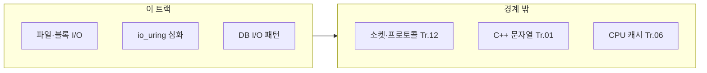

이 트랙은 "데이터가 저장장치를 오가는 경로"의 지연시간을 줄이는 영역을 책임집니다. µs 단위에서는 시스템콜 비용, 복사 횟수, I/O 스케줄링이 지연시간의 상당 부분을 차지합니다.

## 이 트랙이 책임지는 범위

- I/O 패턴과 비용 모델 (동기 vs 비동기, 블로킹 vs 논블로킹)
- 비동기 I/O 기법 (epoll, io_uring, IOCP, AIO)
- Zero-copy 기법 (sendfile, splice, mmap)
- Memory-mapped I/O 최적화
- 파일시스템과 블록 디바이스 특성 이해
- Direct I/O vs Buffered I/O 선택

## 이 트랙이 다루지 않는 것 (경계)

- 네트워크 소켓/프로토콜 최적화 (→ 네트워크 최적화 트랙 Course 12)
- C++ 언어 레벨 최적화 상세 (→ C++ 언어 트랙)
- CPU 파이프라인/캐시의 하드 분석 (→ CPU 트랙)
- OS 스케줄러/affinity의 상세 (→ OS/런타임 트랙)

## 커리큘럼

**난이도 범례**: **기초**(입문) · **중급**(실무 핵심) · **심화**(깊은 분석·전문 주제) · **전문**(극한·니치). **Tr.NN**은 `optimization-NN-*` 트랙을 가리킵니다. **심화(본 트랙)** 행은 Tr.07에 있는 동일 주제 **개요**를 이어 받습니다.

입문자는 **16 → 01 → 02 → 06 → 10 → 11** 순서로 먼저 읽는 것을 권장합니다. 16은 I/O 지연의 그림을 먼저 잡아 주고, 01~02는 동기/비동기와 이벤트 모델의 차이를 정리하며, 06·10·11은 mmap·Reactor/Proactor·Vectored I/O처럼 이후 심화 챕터의 공통 바닥을 만들어 줍니다.

표 순서는 그대로 두는 편이 더 좋습니다. I/O 트랙은 `03`, `05`, `07`, `12`, `13`, `15`처럼 서로 다른 심화 축을 장 번호 기준으로 참조하는 일이 많아서, 표는 **주제 지도**로 남겨 두고 추천 순서는 **입문자용 진입 경로**로 분리하는 편이 덜 혼란스럽습니다.

| 챕터 | 제목 | 난이도 | 핵심 내용 |
|------|------|--------|-----------|
| 01 | I/O 패턴과 비용 | 기초 | 동기/비동기, 블로킹/논블로킹 비용 모델 |
| 02 | 비동기 I/O 기초 | 중급 | select, poll, epoll, kqueue 비교 |
| 03 | io_uring 심화 | 심화 | 심화(본 트랙); 개요는 Tr.07 |
| 04 | IOCP와 Windows I/O | 중급 | Windows IOCP 모델과 최적화 |
| 05 | Zero-copy 기법 | 심화 | sendfile, splice, copy_file_range 활용 |
| 06 | Memory-mapped I/O | 중급 | mmap 활용과 주의사항 |
| 07 | Direct I/O | 심화 | O_DIRECT와 페이지 캐시 바이패스 |
| 08 | 파일시스템 특성 | 중급 | ext4, XFS, ZFS 등 성능 특성 |
| 09 | 블록 디바이스 최적화 | 심화 | NVMe, SSD 특성과 I/O 스케줄러 |
| 10 | I/O 멀티플렉싱 패턴 | 중급 | Reactor, Proactor 패턴 구현 |
| 11 | Vectored I/O | 중급 | readv/writev, preadv2/pwritev2 활용 |
| 12 | POSIX AIO vs io_uring | 심화 | POSIX AIO와 io_uring 성능 비교 |
| 13 | Database I/O 패턴 | 심화 | WAL, fsync, 저널링 전략과 성능 영향 |
| 14 | File Locking 성능 | 중급 | 파일 잠금이 성능에 미치는 영향과 대안 |
| 15 | 스토리지 스택 커스터마이징 | 전문 | 커널 모듈·특수 FS·벤더 드라이버와의 경계 (운영 리스크·Tr.09 연계) |
| 16 | I/O 비용 직관 | 기초 | 동기/비동기·블로킹/논블로킹·복사 횟수가 지연에 미치는 그림 잡기 (선행: 챕터 01 전에 읽기 권장) |
| 17 | 로깅 성능 전략 | 중급 | 핫패스 로깅 비용 제어, 비동기 로거, 로그 레벨 분리와 I/O 영향 |

## 측정과 검증 (이 트랙 기준)

- I/O 처리량(throughput)과 지연시간(latency) 분리 측정
- 시스템콜 횟수/비용 프로파일링 (strace, perf)
- 복사 횟수 추적 (zero-copy 적용 전후)
- IOPS, 대역폭, 지연시간 분포 분석

## 추천 선행/병행 트랙

- **선행**: Low-latency 프로파일링·성능 분석 (Tr.05)
- **병행**: OS·런타임 (Tr.07), 메모리·할당 (Tr.03)
- **후행**: 네트워크 최적화 (Tr.12)

> **스토리지·DB·파일 처리**가 핫패스라면 이 트랙이 필수에 가깝습니다.

## 왜 이 트랙인가 (동기)

디스크와의 데이터 이동은 시스템 콜·커널 경로·복사 횟수·페이지 캐시 정책이 겹칩니다. Tr.07에서 syscall과 io_uring **개요**를 본 뒤, 이 트랙에서는 **파일·블록·DB 패턴**으로 내려가 실전 튜닝을 합니다. 동일한 “비동기 I/O”라도 워크로드에 따라 이득이 크게 달라지므로, 처리량과 지연 분포를 **분리 측정**하는 습관이 필요합니다.

## Phase별 학습 궤적

**Phase A — 패턴 (챕터 01~02)** 동기/비동기·멀티플렉싱 기초 없이 고급 API만 쓰면 디버깅이 어렵습니다.

**Phase B — 고급 I/O (챕터 03~07, 10~12)** io_uring **심화(본 트랙)**는 Tr.07 개요를 전제로 합니다. zero-copy·mmap·O_DIRECT는 캐시 일관성·이식성 이슈가 큽니다.

**Phase C — 스토리지·DB (챕터 08~09, 13~14)** 파일시스템·NVMe·WAL/fsync는 **심화**입니다. Tr.03 메모리·Tr.09 용량 계획과 연결됩니다.

## 이 트랙을 마친 후 달성할 목표

- **측정**: syscall 횟수·복사 횟수·IOPS·지연 분포를 연결해 설명할 수 있다.
- **선택**: epoll·IOCP·io_uring 등 경로를 플랫폼·워크로드에 맞게 고를 수 있다.
- **연계**: Tr.07 개요와 본 트랙 심화의 차이를 팀에 전달할 수 있다.

## 평가 기준과 이 장을 읽은 후 확인

- [ ] Tr.07 챕터 08(io_uring 개요)과 본 트랙 챕터 03(심화)의 관계를 말할 수 있는가?
- [ ] zero-copy 적용 전후에 무엇을 수치로 비교할지 세 가지 이상 말할 수 있는가?

## 범위와 경계

## 심화·전문가 확장 궤적

Direct I/O·저널링·스케줄러는 환경별로 튜닝 여지가 큽니다. **심화** 챕터는 스테이징에서 재현한 워크로드로만 결론 내리는 것을 권장합니다. 이 트랙의 다음 확장 후보로는 **오브젝트 스토리지/클라우드 블록 스토리지 지연 모델**, **컨테이너·오버레이 파일시스템 I/O**, **전문 저장소 스택 운영**을 두고 검토할 수 있습니다.

## 시리즈 전체 로드맵

12개 트랙의 권장 순서·심화 진입 조건은 **[Low-latency 최적화 시리즈 개요](/collection/optimization-00-series-overview/00-introduction/)**를 참고하세요.
