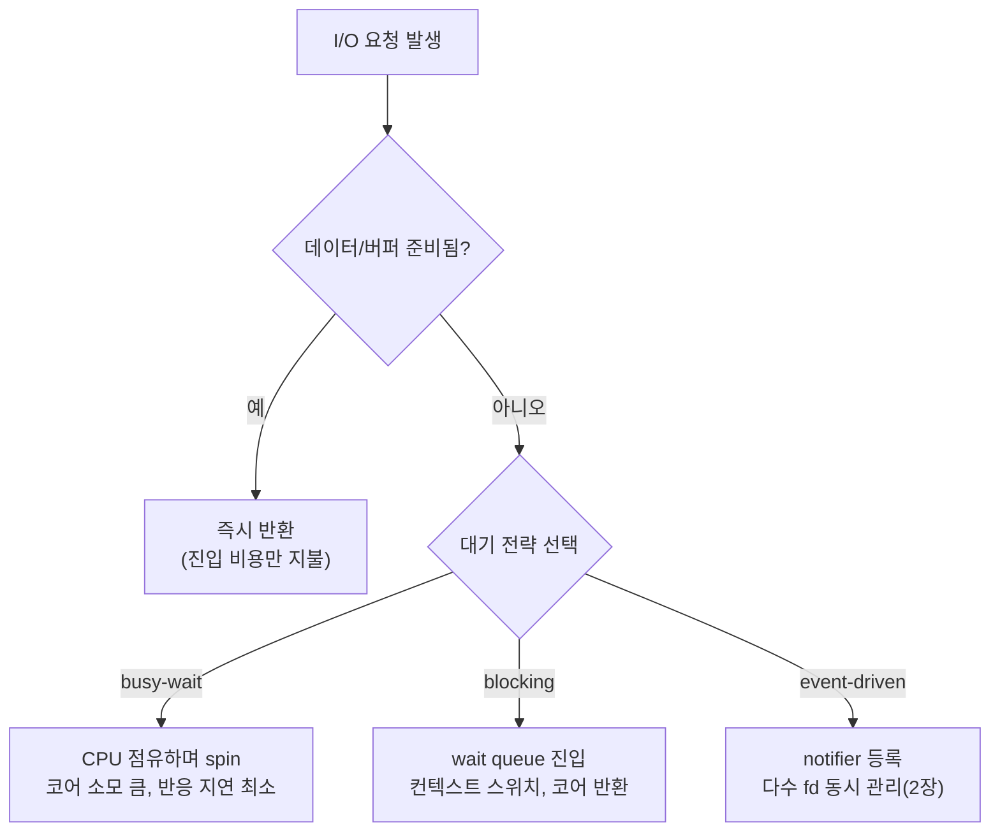

**I/O 패턴과 비용**이란 프로그램이 커널을 거쳐 데이터를 주고받을 때 선택하는 방식(동기/비동기, 블로킹/논블로킹)이 지연시간과 CPU 점유를 어떻게 바꾸는지를 시스템 콜 진입 비용과 대기 방식이라는 두 축으로 분해해 이해하는 것을 말합니다. µs 단위 지연을 다루는 서비스에서는 "read 한 번 호출"이라는 같은 동작도 블로킹으로 부르느냐, 논블로킹으로 부르고 폴링하느냐, 이벤트 통지를 기다리느냐에 따라 실제 소요 시간과 코어 점유 패턴이 크게 달라집니다. 이 장은 이후 챕터에서 다룰 epoll·io_uring·IOCP 같은 구체적 API에 들어가기 전에, "왜 이런 API들이 필요한가"를 설명하는 비용 모델을 세웁니다.

## 이 장을 읽기 전에

**선행 지식**: 프로세스/스레드의 차이, 커널 모드와 사용자 모드의 구분, 컨텍스트 스위치가 무엇인지 정도만 알면 충분합니다. 별도의 선행 챕터는 없으며, 트랙 인트로([Introduction: Low-latency I/O 최적화](/post/io-optimization/getting-started-io-performance-tuning/))에서 이 트랙의 범위를 먼저 확인하는 것을 권장합니다. 그림으로 먼저 감을 잡고 싶다면 [16장: I/O 비용 직관](/post/io-optimization/io-cost-intuition-sync-async-copy-fundamentals/)을 병행해도 좋습니다. 16장이 직관적 그림을 그린다면, 이 장은 그 아래에 있는 시스템 콜 단위 비용 모델을 세웁니다.

**이 장의 깊이**: **기초**입니다. 동기/비동기와 블로킹/논블로킹을 구분하는 개념 정의, 시스템 콜 진입 비용의 구성 요소, busy-wait·blocking·이벤트 기반이라는 세 가지 대기 방식의 비용 차이를 다룹니다. **다루지 않는 것**: `select`/`poll`/`epoll`/`kqueue`의 구체적인 API와 사용법([2장](/post/io-optimization/async-io-select-poll-epoll-kqueue/)), `io_uring`의 SQ/CQ 구조와 심화 기능([3장](/post/io-optimization/io-uring-advanced-deep-dive/)), Windows IOCP의 완료 포트 구조([4장](/post/io-optimization/windows-iocp-io-model-optimization/)), zero-copy 기법([5장](/post/io-optimization/zero-copy-sendfile-splice-copy-file-range/))입니다.

## 당신의 수준에 맞는 경로

| 수준 | 읽을 부분 | 핵심 목표 |
|------|---------|---------|
| **초보자** | "블로킹에서 논블로킹까지" ~ "네 가지 조합" | 동기/비동기와 블로킹/논블로킹이 서로 다른 축임을 구분 |
| **중급자** | "시스템 콜 진입 비용" ~ "대기 방식의 세 가지 유형" | busy-wait·blocking·이벤트 기반의 비용 구조 이해 |
| **전문가** | "판단 기준" ~ "비판적 시각" | 워크로드별 대기 전략 선택과 비용 모델의 한계 판단 |

---

## 블로킹에서 논블로킹까지 (역사·배경)

초기 Unix(1970년대 Bell Labs)의 `read`/`write`는 기본적으로 **블로킹**이었습니다. 호출한 스레드는 데이터가 준비될 때까지 커널 내부에서 대기하고, 그동안 CPU는 스케줄러가 다른 작업에 넘겨줄 수 있었습니다. 여러 파일 디스크립터를 동시에 다뤄야 하는 서버가 늘면서 4.2BSD(1983)는 `select()`를 도입해 "여러 fd 중 준비된 것"을 한 번에 확인하는 멀티플렉싱 축을 열었고, 이후 `fcntl(O_NONBLOCK)`으로 표준화된 논블로킹 플래그는 "호출이 당장 완료되지 않아도 즉시 반환"하는 축을 별도로 제공했습니다. POSIX.1b(1993)의 `aio_*` 계열은 "호출 자체가 완료를 기다리지 않고 별도로 통지받는" 진짜 비동기 모델을 표준에 추가했지만, 커널 구현이 성숙하기까지는 오래 걸렸습니다. 이 세 갈래—멀티플렉싱, 논블로킹, 완료 기반 비동기—가 이후 Linux `epoll`(2002, 커널 2.5.44), Windows `IOCP`(1994, Windows NT 3.5), `io_uring`(2019, 커널 5.1)으로 이어지는 구체적 구현들의 뿌리입니다. 각 구현의 세부 동작은 [2장](/post/io-optimization/async-io-select-poll-epoll-kqueue/), [3장](/post/io-optimization/io-uring-advanced-deep-dive/), [4장](/post/io-optimization/windows-iocp-io-model-optimization/)에서 다루며, 이 장은 그 앞에 있는 "왜 세 갈래로 나뉘었는가"라는 비용 모델에 집중합니다.

## 동기/비동기와 블로킹/논블로킹: 네 가지 조합

동기(synchronous)와 비동기(asynchronous)는 "호출자가 완료를 어떻게 알게 되는가"를 가르는 축이고, 블로킹과 논블로킹은 "호출이 당장 완료되지 않을 때 즉시 반환하는가"를 가르는 축입니다. 두 축은 독립적이라서, 실제로는 다음 네 조합이 모두 존재합니다.

- **동기 + 블로킹**: 가장 전통적인 `read(fd, buf, len)`. 데이터가 준비될 때까지 호출이 반환하지 않습니다.
- **동기 + 논블로킹**: `O_NONBLOCK`을 켠 `read`. 데이터가 없으면 즉시 `EAGAIN`으로 반환하고, 호출자가 직접 재시도(폴링) 여부를 결정합니다. 호출 자체는 여전히 "그 순간의 결과"를 동기적으로 돌려줍니다.
- **비동기 + 준비 통지(readiness)**: `select`/`poll`/`epoll`처럼 "이 fd가 읽기 가능해졌다"는 통지만 받고, 실제 `read`는 통지 이후 호출자가 별도로 수행합니다. 통지와 데이터 전달이 분리되어 있지만, 데이터 자체는 여전히 통지를 받은 스레드가 동기적으로 읽어옵니다.
- **비동기 + 완료 통지(completion)**: `io_uring`이나 Windows `IOCP`처럼 "read 자체를 커널에 제출"하고, 데이터 전달까지 끝난 뒤 완료 이벤트로 결과(읽은 바이트 수, 버퍼)를 통째로 돌려받습니다. 호출자는 제출과 수거를 분리할 뿐 데이터를 직접 끌어오지 않습니다.

이 구분이 중요한 이유는, 흔히 "논블로킹 = 비동기"로 뭉뚱그리기 쉽지만 `epoll` 기반 이벤트 루프는 통지 방식만 비동기이고 데이터 읽기는 여전히 호출자가 동기적으로 수행하는 준비-통지(readiness) 모델이기 때문입니다. `io_uring`/`IOCP`의 완료 기반(completion) 모델과는 시스템 콜 횟수와 데이터 복사 경로가 다르며, 그 차이는 [3장](/post/io-optimization/io-uring-advanced-deep-dive/)과 [12장: POSIX AIO vs io_uring](/post/io-optimization/posix-aio-vs-io-uring-performance-comparison/)에서 성능 수치로 다룹니다.

## 시스템 콜 진입 비용

I/O를 시작하려면 대부분 사용자 모드에서 커널 모드로 전환하는 시스템 콜을 거칩니다. 이 전환은 단순한 함수 호출이 아니라 CPU 권한 레벨(ring)을 바꾸고 레지스터를 저장하는 트랩(trap) 경로를 타므로, 순수한 진입/반환만으로도 고정 비용이 붙습니다. Brendan Gregg의 측정에 따르면 아무 일도 하지 않는 시스템 콜은 현대 CPU에서 대략 수십~100 사이클 수준이었지만, Meltdown 취약점을 막기 위한 KPTI(Kernel Page Table Isolation) 패치가 적용된 이후에는 시스템 콜마다 페이지 테이블을 전환하는 비용이 추가됩니다. 초당 7만 5천 회 수준의 고빈도 시스템 콜 워크로드에서는 추정 4%·실측 5% 손실이 보고되었고, 클라우드 환경 전반에서는 0.1~6% 정도의 성능 저하를 예상할 수 있다고 밝혔습니다. 다만 TLB 페이지 워크에 유난히 민감한 한 스트레스 테스트에서는 25% 이상의 저하가 이상치(outlier)로 관측되었습니다([Gregg, "KPTI/KAISER Meltdown Initial Performance Regressions", 2018](https://www.brendangregg.com/blog/2018-02-09/kpti-kaiser-meltdown-performance.html)). PCID(Process-Context Identifiers) 지원과 huge page를 함께 쓰면 이 오버헤드를 상당 부분 되돌릴 수 있다고도 언급합니다. 정확한 사이클 수는 CPU 세대·커널 버전·완화 패치 조합마다 달라지므로, 절대 수치보다 "시스템 콜은 공짜가 아니고, 완화 패치 이후 특히 그렇다"는 방향성을 기억하는 것이 실무에 더 유용합니다.

이 비용을 직접 확인하려면 순수 시스템 콜 하나를 반복 호출하며 걸린 시간을 나눠보는 것이 가장 간단합니다. 아래 코드는 인자 처리가 거의 없는 `getpid()`를 반복 호출해 평균 진입 비용을 근사합니다. `glibc` 2.25 이후로는 `getpid()`가 항상 실제 시스템 콜을 발생시키므로(과거 버전은 프로세스 시작 시 값을 캐시했습니다) 최신 배포판에서는 이 측정이 유효합니다.

```cpp
// syscall_cost.cpp — Linux x86-64, GCC 13 기준 예시. g++ -O2 syscall_cost.cpp -o syscall_cost
#include <cstdio>
#include <ctime>
#include <unistd.h>

int main() {
  constexpr long kIterations = 10'000'000L;
  timespec start{}, end{};
  clock_gettime(CLOCK_MONOTONIC, &start);
  for (long i = 0; i < kIterations; ++i) {
    getpid();  // 순수 진입/반환 비용만 측정 (인자 검증·데이터 이동 없음)
  }
  clock_gettime(CLOCK_MONOTONIC, &end);
  double elapsed_ns = (end.tv_sec - start.tv_sec) * 1e9 +
                       (end.tv_nsec - start.tv_nsec);
  std::printf("syscall당 평균: %.1f ns (%ld회 반복)\n",
              elapsed_ns / kIterations, kIterations);
  return 0;
}
```

같은 머신에서 반복 측정해 편차를 확인하고, `perf stat -e syscalls:sys_enter_getpid`처럼 이벤트 카운터로 실제 호출 횟수를 교차 검증하는 것이 좋습니다. 컨테이너·가상화 환경에서는 하이퍼바이저 트랩이 추가로 끼어들 수 있어 베어메탈보다 수치가 높게 나오는 경우가 흔합니다. 모든 시스템 콜이 이 비용을 다 지불하는 것은 아닙니다. `clock_gettime`, `gettimeofday`, `getcpu` 같은 일부 호출은 커널이 프로세스 주소 공간에 매핑해 두는 **vDSO(virtual Dynamic Shared Object)**를 통해 실제 트랩 없이 사용자 공간에서 값을 읽어옵니다([man7.org: vdso(7)](https://man7.org/linux/man-pages/man7/vdso.7.html)). 핫패스에서 시간 측정을 자주 한다면 이 차이만으로도 눈에 띄는 절약이 됩니다.

## 대기 방식의 세 가지 유형

시스템 콜 진입 비용이 "한 번 부르는 값"이라면, 대기 방식은 "데이터가 아직 없을 때 무엇을 하는가"를 결정하는 반복적 비용입니다. 크게 세 가지로 나눌 수 있습니다.

- **busy-wait(spin-poll)**: 호출자가 CPU를 계속 점유한 채 조건을 반복 확인합니다. 컨텍스트 스위치가 전혀 없어 데이터가 준비되는 즉시 반응할 수 있지만, 대기하는 동안 코어 하나를 온전히 소모합니다. 대기 시간이 매우 짧고(수백 ns~수 µs) 전용 코어를 할당할 여유가 있는 트레이딩 시스템의 핫패스에서 주로 씁니다.
- **blocking wait**: 호출자가 커널의 wait queue에 들어가고 스케줄러가 다른 작업에 코어를 넘깁니다. 데이터가 준비되면 깨우기(wake-up)와 컨텍스트 스위치가 발생하는데, 이 왕복 비용은 스케줄러 지연을 포함해 보통 수백 ns에서 수 µs대까지 걸립니다. 코어를 낭비하지 않는 대신 반응 지연이 스케줄러 상태에 좌우됩니다.
- **event-driven(멀티플렉싱/완료 통지)**: 여러 fd를 한 번에 등록해 두고, 준비되거나 완료된 것만 통지받습니다. 스레드 수를 fd 수에 비례시키지 않아도 되지만, 통지를 등록·수거하는 자체도 시스템 콜이므로 fd 수·이벤트 빈도에 따라 별도의 비용 곡선을 가집니다. 구체적인 API(`select`/`poll`/`epoll`/`kqueue`)는 [2장](/post/io-optimization/async-io-select-poll-epoll-kqueue/)에서, Reactor/Proactor 패턴으로 묶는 방법은 [10장](/post/io-optimization/io-multiplexing-reactor-proactor-patterns/)에서 다룹니다.

세 방식의 갈림길을 그림으로 보면 다음과 같습니다.



블로킹 호출과 논블로킹 호출의 반환 시점 차이를 코드로 대비하면 다음과 같습니다. 아래는 파이프의 읽기 쪽을 논블로킹으로 설정해, 데이터가 없을 때 `EAGAIN`으로 즉시 반환받는 예시입니다(Linux, `-std=c++17` 이상에서 컴파일 가능).

```cpp
// nonblocking_read.cpp — Linux, g++ -O2 -std=c++17 nonblocking_read.cpp
#include <cerrno>
#include <cstdio>
#include <fcntl.h>
#include <unistd.h>

int main() {
  int fds[2];
  if (pipe(fds) != 0) return 1;
  fcntl(fds[1], F_SETFL, O_NONBLOCK);
  fcntl(fds[0], F_SETFL, O_NONBLOCK);  // 읽기 쪽을 논블로킹으로 전환

  char buf[64];
  ssize_t n = read(fds[0], buf, sizeof(buf));  // 아무도 쓰지 않았으므로 데이터 없음
  if (n < 0 && (errno == EAGAIN || errno == EWOULDBLOCK)) {
    std::printf("데이터 없음: 블로킹 없이 즉시 반환, 재시도는 호출자 책임\n");
  }
  close(fds[0]);
  close(fds[1]);
  return 0;
}
```

같은 `read`를 `O_NONBLOCK` 없이 호출했다면 이 지점에서 스레드가 wait queue에 들어가 블로킹되었을 것입니다. 논블로킹은 이 대기를 없애는 대신, 준비 여부를 확인하는 책임(그리고 재시도 루프의 CPU 비용)을 호출자에게 넘깁니다. `read()`의 `O_NONBLOCK`/`EAGAIN` 동작은 표준 문서에도 명시되어 있습니다([man7.org: read(2)](https://man7.org/linux/man-pages/man2/read.2.html)).

## 흔한 오개념

**"논블로킹 I/O는 항상 더 빠르다"**는 정확하지 않습니다. 논블로킹은 대기를 없앨 뿐이며, 데이터가 준비되지 않았을 때 호출자가 무엇을 하느냐(즉시 포기, 짧은 간격 재시도, busy-poll)에 따라 총 비용이 오히려 늘어날 수 있습니다. 재시도 간격이 너무 짧으면 반복되는 시스템 콜 진입 비용만 누적되고, 너무 길면 반응 지연이 커집니다.

**"비동기 I/O는 논블로킹과 같은 것"**이라는 생각도 흔한 오해입니다. 앞서 본 것처럼 두 축은 독립적이며, `epoll` 기반 이벤트 루프는 통지만 비동기이고 데이터 읽기는 여전히 동기적으로 수행하는 준비-통지 모델입니다. 완료 통지 기반 비동기(`io_uring`/`IOCP`)와 시스템 콜 횟수·데이터 복사 경로가 다르므로 같은 카테고리로 묶으면 성능 특성을 잘못 예측하게 됩니다.

**"시스템 콜은 무시할 만큼 저렴하다"**는 최신 CPU에서 더 이상 항상 참이 아닙니다. KPTI 같은 보안 완화 패치가 적용된 환경에서는 시스템 콜 진입 비용이 유의미하게 늘었고, 핫패스에서 호출 횟수가 많을수록 이 고정 비용이 누적됩니다. 반대로 vDSO로 우회되는 일부 호출은 이 비용을 아예 지불하지 않으므로, "모든 시스템 콜이 똑같이 비싸다"는 일반화도 과합니다.

## 판단 기준

| 워크로드 특성 | 권장 대기 전략 | 이유 |
|------|------|------|
| 초단시간 대기(수백 ns~수 µs), 전용 코어 여유 있음, 반응 지연 최소화가 최우선 | busy-wait/spin-poll | 컨텍스트 스위치를 회피하는 대신 코어 소모를 감수 |
| 대기시간이 길거나 예측 불가능, 코어를 다른 작업에 돌려줘야 함 | blocking 대기 | 스케줄러가 코어를 재분배해 CPU 낭비를 줄임 |
| 다수의 fd를 동시에 감시해야 함 | 이벤트 기반 멀티플렉싱(→[2장](/post/io-optimization/async-io-select-poll-epoll-kqueue/)) 또는 io_uring(→[3장](/post/io-optimization/io-uring-advanced-deep-dive/)) | 스레드 수를 fd 수에 비례시키지 않음 |
| 처리량이 지연보다 중요한 대량 배치 I/O | 완료 기반 비동기(io_uring/IOCP, →[3장](/post/io-optimization/io-uring-advanced-deep-dive/)·[4장](/post/io-optimization/windows-iocp-io-model-optimization/)) | 제출·수거를 분리해 시스템 콜 자체를 배치화 |
| 시간 측정처럼 vDSO가 지원하는 호출을 자주 씀 | 표준 라이브러리 함수 그대로 사용 | 커널 진입 없이 사용자 공간에서 처리됨 |

## 비판적 시각: 한계와 트레이드오프

이 장에서 다룬 비용 모델은 CPU 마이크로아키텍처, 커널 버전, 적용된 보안 완화 패치 조합에 따라 절대 수치가 크게 달라진다는 한계가 있습니다. "시스템 콜이 몇 사이클"이라는 숫자를 코드에 그대로 근거로 삼기보다, 대상 환경에서 직접 재현해 상대적 트레이드오프를 확인하는 습관이 더 안전합니다. busy-wait 전략은 멀티테넌시 환경(공유 서버, 클라우드 vCPU)에서 다른 프로세스의 스케줄링 기회를 빼앗을 수 있고, 클라우드 환경에서는 steal time까지 겹쳐 실제 이득이 기대보다 작을 수 있습니다. 또한 "시스템 콜은 비싸다"는 명제 자체도 io_uring의 `SQPOLL` 모드처럼 커널 스레드가 제출 큐를 미리 폴링해 사용자 스레드의 시스템 콜 자체를 없애는 기법이 존재하므로 절대적이지 않습니다. 이런 회피 기법의 조건과 대가는 [3장](/post/io-optimization/io-uring-advanced-deep-dive/)에서 심화로 다룹니다. 마지막으로, 이 장의 네 가지 조합 분류는 개념을 정리하기 위한 모델일 뿐 커널 구현이 반드시 이 경계를 깔끔하게 따르는 것은 아니며, 실제 구현은 준비-통지와 완료-통지가 섞인 하이브리드인 경우도 있습니다.

## 마무리

이 장을 읽고 나면 다음을 스스로 확인할 수 있어야 합니다.

- [ ] 동기/비동기와 블로킹/논블로킹이 서로 다른 축이며, 네 가지 조합이 가능함을 설명할 수 있다.
- [ ] 시스템 콜 진입 비용이 KPTI 같은 완화 패치로 늘어날 수 있고, vDSO로 일부 호출은 이를 우회함을 설명할 수 있다.
- [ ] busy-wait·blocking·event-driven 세 대기 방식의 비용 구조 차이를 말할 수 있다.
- [ ] "논블로킹=비동기"라는 오개념을 교정하고, 준비-통지와 완료-통지 모델의 차이를 구분할 수 있다.
- [ ] 대기 시간·코어 여유·fd 개수에 따라 어떤 대기 전략을 고를지 판단 기준표로 설명할 수 있다.

**다음 장에서는** 이 장에서 세운 비용 모델 위에 `select`, `poll`, `epoll`, `kqueue`의 구체적인 인터페이스와 각각의 확장성 한계를 다룹니다. 여기서 다룬 "이벤트 기반 대기"가 실제로 어떻게 구현되는지, fd 개수가 늘어날 때 각 API의 비용이 어떻게 달라지는지를 비교합니다.

→ [비동기 I/O 기초: select·poll·epoll·kqueue](/post/io-optimization/async-io-select-poll-epoll-kqueue/)
