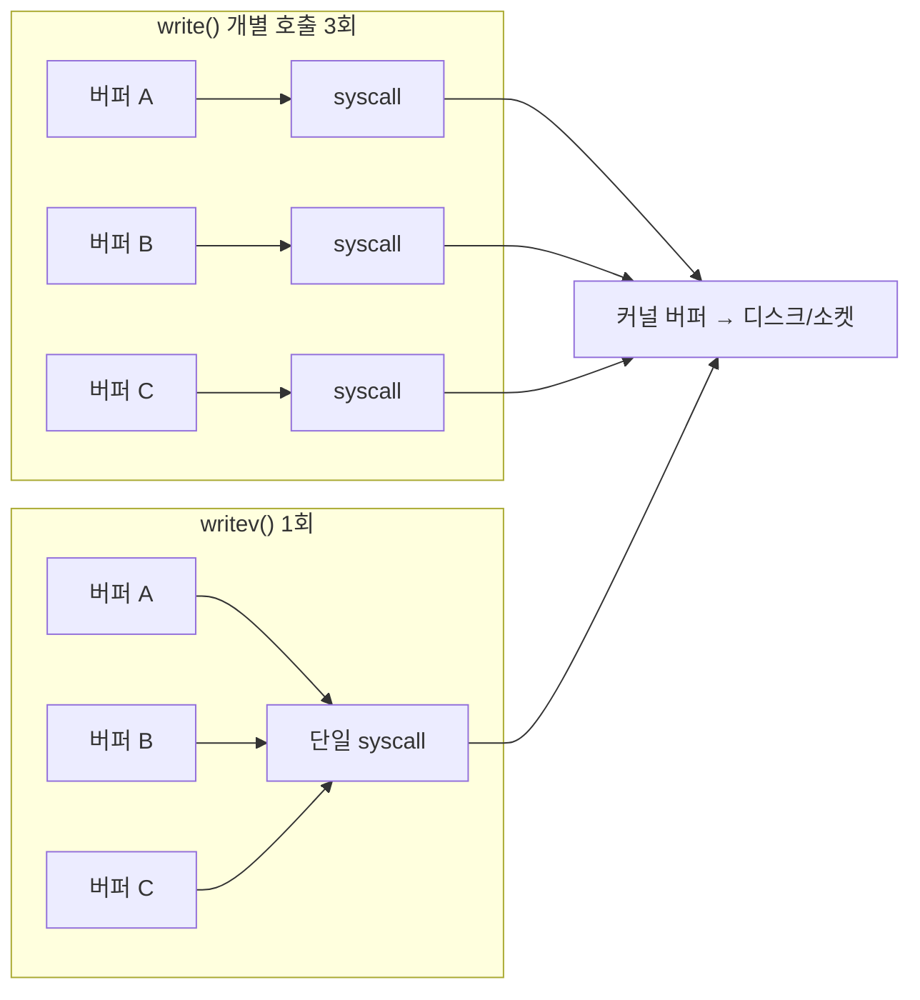

**Vectored I/O**란 메모리 여기저기에 흩어진 여러 개의 버퍼를 하나의 시스템 콜로 묶어 커널에 전달해서 읽거나 쓰는 기법을 말합니다. 로그 레코드처럼 헤더와 페이로드가 서로 다른 버퍼에 있거나, 프로토콜 메시지가 고정 길이 헤더와 가변 길이 바디로 나뉘어 있을 때, 매번 하나의 연속 버퍼로 합쳐서(memcpy) `write` 한 번을 부르는 대신 각 버퍼의 주소와 길이만 배열로 넘기면 커널이 알아서 순서대로 처리해 줍니다. 이 장은 `readv`/`writev`가 시스템 콜 횟수를 줄이는 원리와, `preadv2`/`pwritev2`가 여기에 오프셋과 세밀한 플래그 제어를 더한 이유를 다룹니다.

## 이 장을 읽기 전에

**완전한 초보자?** 이 장은 [10장: I/O 멀티플렉싱 패턴 — Reactor·Proactor](/post/io-optimization/io-multiplexing-reactor-proactor-patterns/)에서 다룬 "논블로킹 파일 디스크립터와 이벤트 루프" 개념을 전제로 합니다. 시스템 콜 하나를 부를 때마다 사용자-커널 모드 전환 비용이 든다는 것과, `write`가 요청한 바이트 전부를 쓴다고 보장하지 않는다(short write)는 것만 알면 충분합니다.

**이 장의 깊이**: 이 장은 **중급**을 대상으로 합니다. `readv`/`writev`의 기본 동작과 `IOV_MAX` 제한, 부분 전송 처리부터 시작해 `preadv2`/`pwritev2`가 추가한 `RWF_` 플래그로 호출 단위 제어를 확장하는 방법까지 다룹니다. **다루지 않는 것**: 커널 버퍼 복사 자체를 없애는 진짜 zero-copy 기법(`sendfile`/`splice`/`copy_file_range`)은 [05장](/post/io-optimization/zero-copy-sendfile-splice-copy-file-range/), `O_DIRECT` 정렬 제약은 [07장](/post/io-optimization/direct-io-o-direct-page-cache-bypass/), 비동기 벡터 연산(`IORING_OP_READV` 등)은 [03장: io_uring 심화](/post/io-optimization/io-uring-advanced-deep-dive/), Windows의 `WSASend`/`ReadFileScatter` 계열 API는 [04장: IOCP와 Windows I/O](/post/io-optimization/windows-iocp-io-model-optimization/), WAL fsync 전략은 [13장: Database I/O 패턴](/post/io-optimization/database-io-wal-fsync-journaling-strategy/)에서 각각 다룹니다.

## 당신의 수준에 맞는 경로

| 수준 | 읽을 부분 | 핵심 목표 |
|------|---------|---------|
| **초보자** | "Vectored I/O의 역사와 배경" ~ "readv/writev: 여러 버퍼를 하나의 시스템 콜로" | 여러 버퍼를 결합해 syscall 횟수를 줄이는 원리 이해 |
| **중급자** | "preadv2/pwritev2: 플래그 기반 세밀한 제어" ~ "판단 기준" | 플래그 선택과 부분 전송 처리를 실무에 적용 |
| **전문가** | "비판적 시각" | 진짜 zero-copy와의 차이, 플랫폼·파일시스템 이식성 한계 판단 |

## Vectored I/O의 역사와 배경

**scatter-gather I/O**라는 발상은 1983년 4.2BSD에서 `readv`/`writev` 시스템 콜로 처음 등장했고, 이후 여러 유닉스 계열이 이를 채택하면서 POSIX.1-2001(Single UNIX Specification)에 표준으로 편입되었습니다. 당시 목적은 지금과 같습니다. 네트워크 프로토콜 스택이나 파일 포맷처럼 논리적으로 분리된 여러 조각을 하나로 합치는 복사 비용 없이, 시스템 콜 하나로 커널에 순서대로 넘기는 것입니다. 리눅스는 여기에 파일 오프셋을 인자로 받는 `preadv`/`pwritev`를 커널 2.6.30(2009년, glibc 2.10)에서 추가해 `pread`/`pwrite`의 벡터 버전을 만들었고, 호출 단위로 동작을 바꿀 수 있는 플래그 인자를 더한 `preadv2`/`pwritev2`를 커널 4.6(2016년, glibc 2.26)에서 추가했습니다. 플래그를 `fcntl`로 파일 디스크립터 전체에 거는 대신 호출마다 지정할 수 있게 한 것이 `preadv2`/`pwritev2`가 존재하는 이유입니다.

## readv/writev: 여러 버퍼를 하나의 시스템 콜로

`readv`와 `writev`는 각각 `struct iovec` 배열을 받아, 배열에 나열된 순서대로 버퍼를 채우거나 소비합니다. `iovec`은 `<sys/uio.h>`에 정의된 단순한 구조체로, 버퍼의 시작 주소(`iov_base`)와 길이(`iov_len`)만 담습니다. 커널은 이 배열을 순회하며 파일(또는 소켓·파이프)과 사용자 버퍼 사이를 오가는데, 사용자 공간에서 보면 이 과정이 시스템 콜 **한 번**으로 끝난다는 점이 핵심입니다. 헤더 8바이트와 페이로드 4KB를 각각 `write` 두 번으로 나눠 보내는 대신, 아래처럼 `iovec` 배열 하나로 묶어 `writev` 한 번만 호출할 수 있습니다.

```c
#include <sys/uio.h>
#include <unistd.h>

ssize_t write_log_record(int fd, const char *header, size_t header_len,
                          const char *payload, size_t payload_len) {
  struct iovec iov[2];
  iov[0].iov_base = (void *)header;
  iov[0].iov_len = header_len;
  iov[1].iov_base = (void *)payload;
  iov[1].iov_len = payload_len;
  return writev(fd, iov, 2);   // syscall 1회로 header+payload 전송
}
```

아래 다이어그램은 같은 세 버퍼를 개별 `write` 세 번으로 보내는 경로와 `writev` 한 번으로 보내는 경로를 대비한 것입니다. 버퍼 개수만큼 시스템 콜이 늘어나느냐, 하나로 끝나느냐의 차이가 사용자-커널 전환 횟수 차이로 직결됩니다.



`iovec` 배열의 길이에는 상한이 있습니다. POSIX.1은 구현체가 이 배열 크기에 제한을 둘 수 있도록 허용하며, 리눅스는 이를 `IOV_MAX`(현재 1024, 과거 리눅스 2.0에서는 16)로 못박아 두고 있습니다.

> "POSIX.1 allows an implementation to place a limit on the number of items that can be passed in iov." — [man7.org: readv(2)/writev(2)](https://man7.org/linux/man-pages/man2/readv.2.html) 매뉴얼 페이지

또 하나 중요한 점은, 반환값이 요청한 전체 바이트 수보다 **작을 수 있다**는 것입니다. 파이프·소켓처럼 버퍼가 꽉 찼거나 비어 있는 상황, 또는 시그널에 의한 인터럽트(`EINTR`)가 겹치면 `readv`/`writev`도 일반 `read`/`write`와 마찬가지로 short read/write를 돌려줍니다. 다만 여러 버퍼에 걸친 부분 전송이므로, 재시도 로직은 남은 `iovec` 배열의 앞부분을 건너뛰고 마지막 항목의 오프셋만 조정해야 합니다. 아래 `writev_full`은 이 처리를 감싼 헬퍼입니다.

```c
#include <sys/uio.h>
#include <unistd.h>
#include <errno.h>

ssize_t writev_full(int fd, struct iovec *iov, int iovcnt) {
  ssize_t total = 0;
  while (iovcnt > 0) {
    ssize_t n = writev(fd, iov, iovcnt);
    if (n < 0) {
      if (errno == EINTR) continue;
      return -1;
    }
    total += n;
    while (iovcnt > 0 && (size_t)n >= iov[0].iov_len) {
      n -= (ssize_t)iov[0].iov_len;
      iov++;
      iovcnt--;
    }
    if (iovcnt > 0) {
      iov[0].iov_base = (char *)iov[0].iov_base + n;
      iov[0].iov_len -= (size_t)n;
    }
  }
  return total;
}
```

`iov` 배열 자체를 앞으로 밀어 버리기 때문에, 호출자가 원본 배열을 다시 쓸 계획이라면 복사본을 넘겨야 합니다. 이 함수는 논블로킹 소켓에는 그대로 쓸 수 없습니다. `EAGAIN`을 별도로 처리해 이벤트 루프에 다시 등록하는 로직이 필요하며, 그 통합 방식은 [10장의 Reactor 패턴](/post/io-optimization/io-multiplexing-reactor-proactor-patterns/)을 참고합니다.

## preadv2/pwritev2: 플래그 기반 세밀한 제어

`preadv`/`pwritev`가 `readv`/`writev`에 파일 오프셋 인자를 더해 `lseek` 없이 특정 위치를 읽고 쓸 수 있게 했다면, `preadv2`/`pwritev2`는 여기에 다섯 번째 인자로 `int flags`를 더해 호출마다 동작을 바꿀 수 있게 했습니다. 이전에는 `O_DSYNC`나 `O_NONBLOCK` 같은 동작을 바꾸려면 `fcntl(F_SETFL)`로 파일 디스크립터 전체의 상태를 바꿔야 했지만, 같은 파일 디스크립터를 여러 목적으로 공유하는 코드에서는 이 방식이 스레드 세이프하지 않습니다. `RWF_` 플래그는 이 문제를 호출 단위로 해결합니다.

| 플래그 | 도입 커널 | 의미 |
|--------|-----------|------|
| `RWF_HIPRI` | 4.6 | 블록 계층 폴링으로 지연시간을 낮추되 CPU를 더 씀(`O_DIRECT`와 함께 쓰는 것이 일반적) |
| `RWF_DSYNC` | 4.7 | 해당 쓰기만 `O_DSYNC`처럼 동작(호출 단위 durable write) |
| `RWF_SYNC` | 4.7 | 해당 쓰기만 `O_SYNC`처럼 동작 |
| `RWF_NOWAIT` | 4.14 | 페이지 캐시 미스·잠금 대기가 필요하면 블로킹 대신 즉시 반환 |
| `RWF_APPEND` | 4.16 | 해당 쓰기만 `O_APPEND`처럼 파일 끝에 추가 |
| `RWF_ATOMIC` | 6.11+(구현 정의) | 파일시스템·블록 디바이스가 지원할 때 torn write 방지(세부는 [08장](/post/io-optimization/filesystem-performance-characteristics-ext4-xfs-zfs/)) |

> "RWF_HIPRI: High priority read/write. Allows block-based filesystems to use polling of the device, which provides lower latency, but may use additional resources." — [man7.org: preadv2(2)/pwritev2(2)](https://man7.org/linux/man-pages/man2/preadv2.2.html) 매뉴얼 페이지

가장 실무적으로 자주 쓰는 것은 `RWF_NOWAIT`입니다. 이벤트 루프 스레드에서 파일을 읽다가 페이지 캐시에 없는 데이터라 디스크 I/O 대기가 필요한 상황이면, 스레드를 블로킹시키는 대신 `EAGAIN`을 받아 워커 스레드나 별도 큐로 넘길 수 있습니다.

```c
#define _GNU_SOURCE
#include <sys/uio.h>
#include <unistd.h>
#include <errno.h>

ssize_t try_read_nowait(int fd, struct iovec *iov, int iovcnt, off_t offset) {
  ssize_t n = preadv2(fd, iov, iovcnt, offset, RWF_NOWAIT);
  if (n < 0 && errno == EAGAIN) {
    // 페이지 캐시 미스로 블로킹이 필요한 상태.
    // 이벤트 루프 스레드를 막지 않고 블로킹 워커 큐로 위임한다.
  }
  return n;
}
```

`RWF_NOWAIT`는 "반드시 즉시 반환한다"를 보장하지 않는다는 점에 주의합니다. 커널 문서는 이를 최선 노력(best-effort) 힌트로 설명하며, 파일시스템에 따라 여전히 짧게 블로킹할 수 있습니다. `RWF_DSYNC`/`RWF_SYNC`는 매 쓰기마다 별도로 `fdatasync`/`fsync`를 호출하는 것보다 오버헤드가 적을 수 있지만, WAL 저널링에서 durable write를 언제 강제할지에 대한 전략은 [13장](/post/io-optimization/database-io-wal-fsync-journaling-strategy/)에서 더 다룹니다.

## 흔한 오개념

**"Vectored I/O는 항상 더 빠르다"**는 절반만 맞습니다. 이득은 시스템 콜 진입/복귀 오버헤드가 전체 비용에서 차지하는 비중이 클 때, 즉 버퍼가 작고 호출 횟수가 많을 때 두드러집니다. 디스크 탐색 시간이나 네트워크 대역폭이 병목인 워크로드에서는 syscall 횟수를 줄여도 체감 차이가 크지 않을 수 있습니다.

**"readv/writev가 항상 요청한 바이트를 전부 처리하고 원자적으로 끝난다"**도 잘못된 가정입니다. 파일 오프셋 갱신 자체는 원자적이어서 여러 스레드가 같은 파일 디스크립터로 `pwritev`를 동시에 불러도 서로의 오프셋을 덮어쓰지 않지만, 반환 바이트 수는 요청보다 작을 수 있습니다. 파이프·소켓·시그널 인터럽트가 겹치면 특히 그렇습니다. 위의 `writev_full`처럼 부분 전송을 처리하는 루프 없이 단발 호출 결과만 믿으면 데이터 누락으로 이어집니다.

**"IOV_MAX까지 벡터 개수를 늘릴수록 이득도 커진다"**도 과도한 일반화입니다. 벡터 개수가 늘면 커널이 순회할 `iovec` 배열도 커지고, 사용자 공간에서 그 배열을 채우는 비용도 무시할 수 없습니다. 실무에서는 로그 레코드의 헤더+바디, 프로토콜 메시지의 몇 개 필드처럼 **수 개~수십 개** 버퍼를 묶는 데서 이득이 가장 크고, 그 이상으로 늘린다고 비례해서 좋아지지는 않습니다.

## 판단 기준

| 상황 | 권장 | 비권장 |
|------|------|--------|
| 헤더+페이로드처럼 논리적으로 분리된 버퍼를 한 번에 전송 | `writev`/`pwritev` | `memcpy`로 합친 뒤 단일 `write` |
| 소켓에 여러 조각을 순서대로 전송 | `writev` | 조각마다 개별 `write` 호출 |
| 페이지 캐시 미스 시 이벤트 루프 블로킹 회피 | `preadv2` + `RWF_NOWAIT` | 블로킹 `preadv`로 스레드 정지 |
| 호출 단위로만 durable write 강제 | `pwritev2` + `RWF_DSYNC`/`RWF_SYNC` | 매 `write` 후 별도 `fsync` 호출 |
| 커널 복사 자체를 없애야 하는 대용량 전송 | [05장](/post/io-optimization/zero-copy-sendfile-splice-copy-file-range/)의 `sendfile`/`splice` | `writev`로 대체 시도 |
| `O_DIRECT` 정렬 제약이 있는 버퍼 | [07장](/post/io-optimization/direct-io-o-direct-page-cache-bypass/) 정렬 규칙 준수 후 `pwritev` | 정렬 없이 `iovec` 구성 |

## 벤치마크: syscall 횟수와 지연시간 비교

**"측정"을 표방하려면 실행 가능한 스켈레톤이 있어야 합니다.** 아래는 같은 4개 버퍼를 개별 `write` 호출 반복과 `writev` 단일 호출로 각각 10만 회 반복해 벽시계 시간을 비교하는 최소 벤치마크입니다. 대상 파일을 `/dev/null`로 잡아 디스크 I/O 대기 자체를 배제하고, 순수하게 syscall 진입/복귀 비용 차이만 드러나도록 설계했습니다.

```c
#include <stdio.h>
#include <string.h>
#include <time.h>
#include <sys/uio.h>
#include <unistd.h>
#include <fcntl.h>

#define N_BUFS 4
#define BUF_SIZE 256
#define ITERS 100000

static double now_sec(void) {
  struct timespec ts;
  clock_gettime(CLOCK_MONOTONIC, &ts);
  return (double)ts.tv_sec + (double)ts.tv_nsec / 1e9;
}

int main(void) {
  int fd = open("/dev/null", O_WRONLY);
  char buf[N_BUFS][BUF_SIZE];
  struct iovec iov[N_BUFS];
  for (int i = 0; i < N_BUFS; i++) {
    memset(buf[i], 'a' + i, BUF_SIZE);
    iov[i].iov_base = buf[i];
    iov[i].iov_len = BUF_SIZE;
  }

  double t0 = now_sec();
  for (int i = 0; i < ITERS; i++)
    for (int j = 0; j < N_BUFS; j++) write(fd, buf[j], BUF_SIZE);
  double t1 = now_sec();
  printf("write x%d loop: %.3f s\n", N_BUFS, t1 - t0);

  double t2 = now_sec();
  for (int i = 0; i < ITERS; i++) writev(fd, iov, N_BUFS);
  double t3 = now_sec();
  printf("writev: %.3f s\n", t3 - t2);

  close(fd);
  return 0;
}
```

`gcc -O2 bench_vectored.c -o bench_vectored`(Linux x86-64, GCC 13 예시)로 빌드하고 `strace -c -e trace=write,writev`로 감싸서 실행하면, `write` 루프 버전은 40만 회, `writev` 버전은 10만 회의 syscall이 잡혀야 합니다.

```text
$ strace -c -e trace=write ./bench_vectored_loop
% time     seconds  usecs/call     calls    errors syscall
------ ----------- ----------- --------- --------- ----------------
100.00    0.041523           0    400000           write

$ strace -c -e trace=writev ./bench_vectored_writev
% time     seconds  usecs/call     calls    errors syscall
------ ----------- ----------- --------- --------- ----------------
100.00    0.011842           0    100000           writev
```

syscall 횟수는 정확히 `N_BUFS`배(4배) 차이가 나지만, 벽시계 시간 차이는 이보다 작게 나오는 경우가 흔합니다. `/dev/null`처럼 커널 내부 작업이 거의 없는 대상에서는 시스템 콜 진입/복귀 자체의 고정 비용이 두드러지지만, 실제 디스크나 소켓 대상에서는 그 비용이 전체 지연시간에서 차지하는 비중이 작아질 수 있습니다. 플랫폼·커널 버전·대상 파일 디스크립터 종류에 따라 배율은 달라지므로, 실제 워크로드에서 직접 재현해 확인하는 것을 권장합니다.

## 비판적 시각: 한계와 트레이드오프

`readv`/`writev`는 시스템 콜 횟수를 줄일 뿐, 커널 내부에서 사용자 버퍼와 커널 버퍼(페이지 캐시 또는 소켓 버퍼) 사이의 복사 자체는 여전히 일어납니다. 이 복사를 아예 없애려면 [05장](/post/io-optimization/zero-copy-sendfile-splice-copy-file-range/)에서 다루는 `sendfile`/`splice`/`copy_file_range` 계열이 필요하며, vectored I/O를 "zero-copy 기법"으로 오해하지 않아야 합니다. `RWF_` 플래그는 파일시스템·블록 디바이스 지원 여부에 따라 무시되거나 `EOPNOTSUPP`를 반환할 수 있어, 크로스 플랫폼·크로스 파일시스템 코드에서는 반환값 검사와 폴백 경로가 필요합니다. 소켓에서 `writev`로 여러 버퍼를 한 번에 보내도 TCP 세그먼트 경계나 Nagle 알고리즘과의 상호작용까지 통제하는 것은 아니며, 그 수준의 네트워크 최적화는 Tr.12(네트워크 최적화 트랙)의 영역입니다. 마지막으로 Windows에는 `readv`/`writev`와 1:1로 대응하는 API가 없고, `WSASend`/`WSARecv`의 `WSABUF` 배열이나 `ReadFileScatter`/`WriteFileGather`로 유사한 기능을 제공하는데, 이 계열은 페이지 크기 정렬 등 별도 제약이 있어 세부 사항은 [04장](/post/io-optimization/windows-iocp-io-model-optimization/)에서 다룹니다.

## 마무리

- [ ] `readv`/`writev`가 여러 버퍼를 단일 시스템 콜로 처리해 syscall 오버헤드를 줄이는 원리를 설명할 수 있다.
- [ ] `IOV_MAX` 제한과 short read/write를 이해하고, 부분 전송을 안전하게 재시도하는 루프를 작성할 수 있다.
- [ ] `preadv2`/`pwritev2`의 `RWF_NOWAIT`, `RWF_DSYNC`/`RWF_SYNC`, `RWF_APPEND` 플래그를 상황에 맞게 선택할 수 있다.
- [ ] vectored I/O가 syscall 횟수만 줄일 뿐 커널 내부 복사는 없애지 못한다는 한계를 설명하고, 진짜 zero-copy가 필요한 경우와 구분할 수 있다.
- [ ] 벤치마크로 syscall 횟수 감소와 실제 지연시간 감소가 항상 비례하지 않는다는 점을 검증할 수 있다.

**이전 장**: [I/O 멀티플렉싱 패턴: Reactor·Proactor](/post/io-optimization/io-multiplexing-reactor-proactor-patterns/) (챕터 10)

**다음 장에서는** `readv`/`writev`처럼 동기적으로 완료를 기다리는 대신, 커널에 요청만 제출하고 완료를 나중에 폴링하거나 통지받는 비동기 I/O 경로를 다룹니다. POSIX AIO(`aio_read`/`aio_write`)의 스레드 기반 구현과 io_uring의 완전 비동기 모델이 실제 워크로드에서 어떤 성능 차이를 보이는지 비교합니다.

→ [POSIX AIO vs io_uring 성능 비교](/post/io-optimization/posix-aio-vs-io-uring-performance-comparison/) (챕터 12)
