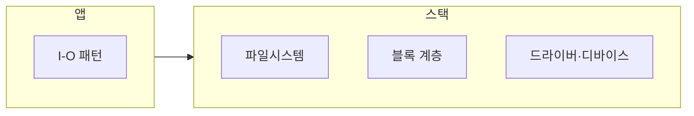

본 장은 **전문** 난이도입니다. 애플리케이션의 `read`/`write` 패턴을 다듬는 것(이 트랙의 다른 챕터)과 별개로, **스토리지 스택 자체**를 바꾸는 결정이 있습니다. 예를 들어 **특수 목적 파일시스템**, **커널 모듈**, **벤더 NVMe 드라이버·펌웨어 튜닝**, **커스텀 blk 계층** 등이 여기에 해당합니다.

## 무엇이 달라지는가

스택 하단을 건드리면 **지연 분포·처리량·장애 모드**가 함께 바뀝니다. 유저 공간 최적화와 달리 **커널 업그레이드·하드웨어 교체·클라우드 하이퍼바이저**와 강하게 결합됩니다.

## 이득이 나올 수 있는 경우

- **극단적 IOPS/latency 목표**: 표준 스택이 **큐 깊이·스케줄러 정책**에서 한계를 보일 때.  
- **전용 하드웨어**: 스토리지 컨트롤러·NIC와 **공동 튜닝**이 필요할 때.  
- **데이터 레이아웃 특수성**: append-only, 대형 순차 스캔 등 **워크로드 특화**가 명확할 때.

## 리스크(짧게 나열)

- **업그레이드**: 커널 마이너 업에서 모듈 ABI가 깨질 수 있습니다.  
- **디버깅**: 크래시가 **서드파티 모듈**로 귀결되면 지원이 느립니다.  
- **보안 표면**: 커널 코드는 권한이 큽니다(Tr.09).  
- **관측**: 기본 메트릭만으로는 **큐 적체** 원인이 안 보일 수 있습니다.

## 검증 프레임

1. **합성 워크로드**: fio 등으로 **대표 패턴**을 고정합니다.  
2. **프로덕션 추적**: 실제 파일 크기·랜덤/순차 비율을 반영합니다.  
3. **장애 주입**: 디스크 지연 증가·패킷 드롭과 **결합 시나리오**를 봅니다.  
4. **롤밹**: 모듈 언로드·드라이버 다운그레이드·이미지 버전 고정(pinning).

## 컨테이너·클라우드 주의

컨테이너는 **호스트 커널**을 공유합니다. 게스트에서만 모듈을 바꿀 수 없는 경우가 많고, 매니지드 서비스에서는 **금지**입니다. “로컬 랩에서 됐다”가 **프로덕션 계약**과 다를 수 있습니다.

## Tr.07·Tr.09와의 연결

- **Tr.07**: `io_uring`, cgroup I/O 제한, 커널 파라미터가 **같은 그림**에 있습니다.  
- **Tr.09**: 변경 승인·감사·보안 리뷰가 필요합니다.

## 마무리

스토리지 스택 커스터마이징은 **성능 엔지니어링**이자 **운영 계약 변경**입니다. 숫자는 Tr.05에서, 책임은 Tr.09에서 닫는다는 전제를 두고 접근하십시오.

## 부록: 질문 15

1. 앱 레벨 튜닝 여지는 아직 있는가?  
2. 목표는 IOPS인가 p99 지연인가?  
3. 데이터 지속성 요구는?  
4. 펌웨어 버전은 고정되는가?  
5. 커널 LTS인가 트래킹인가?  
6. 모듈은 서명되는가?  
7. 크래시 덤프 절차는?  
8. on-call이 스택을 구분해 진단할 수 있는가?  
9. 클라우드 SLA와 충돌하는가?  
10. 스냅샷·백업은?  
11. 마이그레이션 중 성능은?  
12. 멀티 테넌트 noisy neighbor는?  
13. 암호화 계층은 어디에 있는가?  
14. 규제 데이터 상주는?  
15. 롤밹에 걸리는 시간은?

## 부록: 용어

- **blk layer**: 블록 계층(개념)  
- **queue depth**: 장치 큐 깊이  
- **fsync 경로**: 지속성 보장 호출 경로
