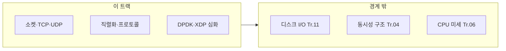

이 트랙은 "데이터가 네트워크를 오가는 경로"의 지연시간을 줄이는 영역을 책임집니다. µs 단위에서는 프로토콜 오버헤드, 직렬화 비용, 커널 네트워크 스택 지연이 전체 지연시간의 상당 부분을 차지합니다.

## 이 트랙이 책임지는 범위

- 소켓 옵션과 버퍼 튜닝 (TCP_NODELAY, SO_SNDBUF, SO_RCVBUF)
- 프로토콜 설계 (바이너리 vs 텍스트, 메시지 프레이밍)
- 직렬화/역직렬화 성능 (Protocol Buffers, FlatBuffers, Cap'n Proto)
- 커널 바이패스 기법 (DPDK, XDP, eBPF)
- TCP 혼잡 제어와 튜닝
- RDMA/InfiniBand 기초

## 이 트랙이 다루지 않는 것 (경계)

- 파일 I/O, 디스크 I/O 최적화 (→ I/O 최적화 트랙 Course 11)
- C++ 언어 레벨 최적화 상세 (→ C++ 언어 트랙)
- CPU 파이프라인/캐시의 하드 분석 (→ CPU 트랙)
- 동시성/멀티스레드 구조 설계 (→ 동시성 트랙)

## 커리큘럼

**난이도 범례**: **기초**(입문) · **중급**(실무 핵심) · **심화**(깊은 분석·전문 주제) · **전문**(극한·니치). **Tr.NN**은 `optimization-NN-*` 트랙을 가리킵니다. **심화(본 트랙)** 행은 Tr.07의 동일 주제 **개요**를 이어 받습니다.

| 챕터 | 제목 | 난이도 | 핵심 내용 |
|------|------|--------|-----------|
| 01 | 네트워크 지연 구조 | 기초 | 네트워크 지연시간 구성 요소 분석 |
| 02 | 소켓 옵션 튜닝 | 중급 | TCP_NODELAY, SO_SNDBUF, 버퍼 최적화 |
| 03 | TCP 성능 최적화 | 중급 | Nagle 알고리즘, Delayed ACK, 혼잡 제어 |
| 04 | UDP 최적화 | 중급 | UDP 활용과 신뢰성 레이어 설계 |
| 05 | 직렬화 성능 비교 | 중급 | Protocol Buffers, FlatBuffers, Cap'n Proto |
| 06 | Zero-copy 직렬화 | 심화 | FlatBuffers, Cap'n Proto zero-copy 활용 |
| 07 | 프로토콜 설계 | 중급 | 저지연 바이너리 프로토콜 설계 원칙 |
| 08 | 메시지 프레이밍 | 중급 | Length-prefix, delimiter, fixed-size 전략 |
| 09 | 네트워크 DPDK 심화 | 전문 | 심화(본 트랙); 개요는 Tr.07 |
| 10 | 네트워크 XDP/eBPF | 전문 | 심화(본 트랙); 개요는 Tr.07 |
| 11 | RDMA 기초 | 심화 | RDMA/InfiniBand 개념과 활용 |
| 12 | gRPC 최적화 | 중급 | gRPC 성능 튜닝 |
| 13 | QUIC 프로토콜 | 심화 | QUIC 성능 특성, 0-RTT 연결, UDP 기반 전송 |
| 14 | TLS/SSL 최적화 | 심화 | TLS 핸드셰이크 최적화, 세션 재개, 0-RTT |
| 15 | Connection Pooling | 중급 | 연결 풀링 전략, Keep-alive, 연결 재사용 |
| 16 | WebSocket 최적화 | 중급 | WebSocket 성능 튜닝, 압축, 메시지 배치 |
| 17 | HTTP/2와 HTTP/3 | 심화 | HTTP/2 멀티플렉싱, HTTP/3 QUIC 기반 성능 비교 |

## 측정과 검증 (이 트랙 기준)

- 네트워크 왕복시간(RTT) 분포 분석 (p50/p95/p99)
- 처리량(throughput)과 지연시간(latency) trade-off 분석
- 직렬화/역직렬화 벤치마크 (메시지 크기별)
- 패킷 캡처를 통한 프로토콜 오버헤드 분석

## 추천 선행/병행 트랙

- **선행**: Low-latency 프로파일링·성능 분석 (Tr.05), I/O 최적화 (Tr.11)
- **병행**: OS·런타임 (Tr.07), 동시성 (Tr.04)

> **네트워크 서버·마이크로서비스·분산 시스템·HFT**에서 이 트랙이 핵심이 됩니다.

## 왜 이 트랙인가 (동기)

RTT·직렬화·프로토콜 오버헤드·커널 스택 비용이 겹치면, 애플리케이션 로직만 최적화해도 한계가 빨리 옵니다. Tr.07의 XDP/eBPF·커널 바이패스 **개요**를 읽은 뒤, 이 트랙에서는 **패킷 처리 심화·RDMA·QUIC·TLS**까지 확장합니다. Tr.04와 함께 보면 수락 루프·스레드 모델과의 상호작용까지 설계할 수 있습니다.

## Phase별 학습 궤적

**Phase A — 전송·TCP/UDP (챕터 01~04)** 지연 구성 요소와 소켓 옵션을 이해합니다.

**Phase B — 직렬화·프로토콜 (챕터 05~08, 12, 15~17)** 메시지 설계가 CPU(Tr.06)·할당(Tr.01)과 만나는 지점입니다.

**Phase C — 커널 바이패스·고급 전송 (챕터 09~11, 13~14)** DPDK·XDP/eBPF **심화(본 트랙)**는 Tr.07 개요 위에 실전을 얹습니다. RDMA·QUIC·TLS 0-RTT는 **심화~전문**에 가깝습니다.

## 이 트랙을 마친 후 달성할 목표

- **측정**: RTT·처리량·직렬화 비용을 분리해 벤치마크할 수 있다.
- **설계**: 바이너리 프로토콜·프레이밍을 지연 예산에 맞게 선택할 수 있다.
- **연계**: Tr.07 개요와 본 트랙 심화의 역할을 팀에 설명할 수 있다.

## 평가 기준과 이 장을 읽은 후 확인

- [ ] Tr.07 챕터 09·10과 본 트랙 챕터 09·10의 난이도·목적 차이를 말할 수 있는가?
- [ ] Tr.11 파일 I/O와 네트워크 I/O의 병목 지표가 어떻게 다른지 예시를 들 수 있는가?

## 범위와 경계

## 심화·전문가 확장 궤적

DPDK·XDP/eBPF는 운영·보안·배포 정책(Tr.09)과 충돌할 수 있습니다. **전문** 난이도 챕터는 스테이징·카나리(Tr.10) 전제를 권장합니다.

## 시리즈 전체 로드맵

12개 트랙의 권장 순서·심화 진입 조건은 **[Low-latency 최적화 시리즈 개요](/collection/optimization-00-series-overview/00-introduction/)**를 참고하세요.
