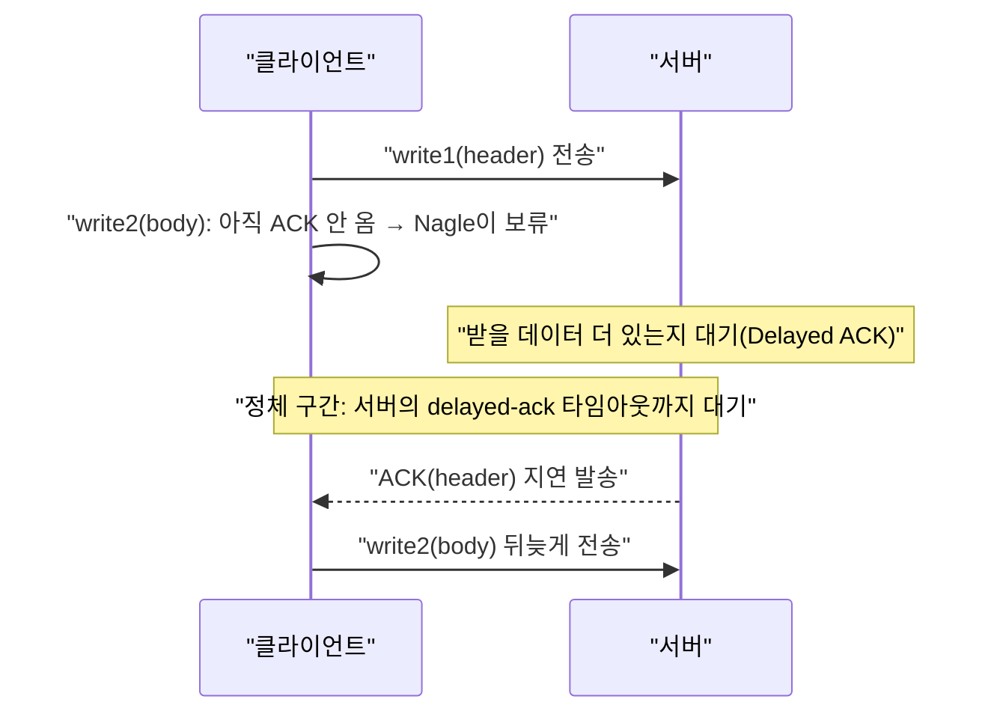

**TCP 성능 최적화**란 TCP가 데이터를 언제 내보내고 얼마나 빨리 창(window)을 늘릴지 결정하는 두 가지 독립적인 메커니즘 — 소규모 세그먼트 지연 로직(Nagle 알고리즘)과 흐름 속도 결정 로직(혼잡 제어 알고리즘) — 이 애플리케이션 지연시간에 미치는 영향을 이해하고 상황에 맞게 조정하는 작업을 말합니다. 같은 소켓 옵션 튜닝이라도 Nagle과 Delayed ACK의 상호작용을 모르면 왜 요청-응답 패턴에서 수십 ms의 정체가 반복되는지 설명할 수 없고, 혼잡 제어 알고리즘의 내부 동작을 모르면 CUBIC에서 BBR로 바꿨을 때 무엇이 좋아지고 무엇이 나빠지는지 예측할 수 없습니다. 이 장은 이 두 메커니즘을 각각 원리부터 짚고, 2026년 7월 기준 IETF 표준화가 진행 중인 BBRv3까지 포함해 언제 어떤 조합을 선택해야 하는지 판단 기준을 제공합니다.

## 이 장을 읽기 전에

**전제 지식**: 이 장은 [소켓 옵션 튜닝](/post/network-optimization/socket-options-tcp-nodelay-buffer-tuning/)(챕터 02)에서 다룬 `TCP_NODELAY`, `SO_SNDBUF`/`SO_RCVBUF` 같은 소켓 API 사용법을 이미 안다고 가정합니다. TCP 3-way handshake, RTT(왕복시간), congestion window(cwnd)라는 용어의 뜻도 전제로 합니다.

**이 장의 깊이**: **중급**입니다. `TCP_NODELAY`를 "켜야 하는 옵션"으로만 아는 수준에서, Nagle 알고리즘과 Delayed ACK가 **왜** 상호작용해서 지연을 만드는지, Reno·CUBIC·BBR이 **내부적으로 무엇을 다르게 판단**해서 전송 속도를 정하는지까지 다룹니다.

**다루지 않는 것**: 소켓 옵션 API의 문법·플랫폼별 차이는 [챕터 02](/post/network-optimization/socket-options-tcp-nodelay-buffer-tuning/)로 위임합니다. UDP 기반 신뢰성 레이어 설계는 [챕터 04](/post/network-optimization/udp-optimization-reliability-layer-design/)에서, 커널 우회를 통한 패킷 처리 심화는 [챕터 10](/post/network-optimization/dpdk-advanced-deep-dive-smartnic-dpu/)·[챕터 11](/post/network-optimization/xdp-ebpf-network-packet-processing-advanced/)에서 다룹니다. BBR/CUBIC 커널 구현체의 소스 코드 워크스루는 이 장의 범위 밖입니다.

## 당신의 수준에 맞는 경로

| 수준 | 읽을 부분 | 핵심 목표 |
|------|---------|---------|
| **초보자** | "역사와 표준 문서" ~ "Nagle과 Delayed ACK의 상호작용" | 40ms급 정체가 왜 발생하는지 원리로 이해 |
| **중급자** | "혼잡 제어 알고리즘 비교" ~ "BBRv3와 IETF 표준화 현황" | Reno·CUBIC·BBR의 판단 기준 차이를 설명 |
| **전문가** | "판단 기준" ~ "비판적 시각" | 프로덕션 트래픽 특성에 맞는 알고리즘 전환을 근거로 판단 |

---

## 역사와 표준 문서

**Nagle 알고리즘**은 1984년 John Nagle이 [RFC 896](https://www.rfc-editor.org/rfc/rfc896.txt)에서 제안했습니다. 당시 문제는 "small-packet problem"이었습니다 — 1바이트 키 입력을 담은 TCP 세그먼트가 40바이트 헤더와 함께 41바이트로 전송되면 오버헤드 비율이 매우 커지므로, 미확인 데이터가 남아 있는 동안에는 새 세그먼트 전송을 억제하고 ACK가 오면 그동안 쌓인 데이터를 한 번에 보내도록 규칙을 정의했습니다. 5년 뒤인 1989년 [RFC 1122](https://www.rfc-editor.org/rfc/rfc1122.html)는 TCP 구현이 수신 세그먼트에 대한 ACK를 즉시 보내지 않고 지연시켜 응답 데이터에 얹어(piggyback) 보낼 기회를 늘리도록 권고하면서, 최대 지연을 500ms로 명시했습니다(실제로는 Linux를 포함한 다수 구현이 이보다 훨씬 짧은 지연값을 사용하는 것이 일반적이며, 정확한 값은 구현 정의입니다). 두 메커니즘은 서로 다른 RFC에서 각자 합리적으로 설계됐지만, 함께 켜졌을 때 상호작용으로 지연을 만드는 조합이 됩니다.

**혼잡 제어**의 역사는 1988년 Van Jacobson의 congestion avoidance 작업에서 시작해 Reno/NewReno로 이어졌고, 이후 RFC 5681로 정리되었습니다. **CUBIC**은 Ha, Rhee, Xu가 개발해 2006년경부터 Linux 기본 알고리즘으로 채택되었고, 이후 2008년 공식 연구 논문으로 발표되었으며, RFC 8312(2018, Informational)를 거쳐 [RFC 9438](https://www.rfc-editor.org/rfc/rfc9438.html)로 2023년 8월 Standards Track에 승격되었습니다. **BBR**은 2016년 Google이 발표한 모델 기반 알고리즘으로, 손실이 아니라 대역폭·RTT 추정치로 전송 속도를 결정한다는 점에서 이전 알고리즘들과 근본적으로 다른 접근을 취합니다. BBRv3는 IETF congestion control working group(ccwg)에서 표준화가 진행 중이며, 이 글을 쓰는 시점의 최신 버전은 [draft-ietf-ccwg-bbr-06](https://datatracker.ietf.org/doc/draft-ietf-ccwg-bbr/)(2026-07-06, Neal Cardwell·Ian Swett·Joseph Beshay 저)으로, 아직 RFC로 발행되지 않은 Active Internet-Draft 상태입니다.

## Nagle 알고리즘의 동작 원리

Nagle 알고리즘의 규칙은 단순합니다. **연결에 아직 확인응답(ACK)되지 않은 데이터가 남아 있는 동안에는, 애플리케이션이 추가로 쓴 작은 데이터를 즉시 세그먼트로 만들어 보내지 않고 버퍼에 모아 둡니다.** ACK가 도착하면 그때까지 쌓인 데이터를 한 세그먼트로 합쳐 전송합니다. 첫 번째 쓰기는 무조건 즉시 나가므로, 문제는 같은 왕복 안에서 **연달아 여러 번 작은 쓰기(write)를 하는 패턴**에서만 나타납니다.

다음은 이 문제를 재현하는 최소한의 클라이언트 코드입니다. 헤더와 바디를 별도의 `write` 호출로 나눠 보내는 흔한 패턴이며, `TCP_NODELAY`를 설정하지 않았습니다.

```c
/* broken_client.c: 헤더/바디를 분리해서 쓰는 흔한 패턴 (문제 재현용) */
#include <arpa/inet.h>
#include <netinet/in.h>
#include <stdio.h>
#include <string.h>
#include <sys/socket.h>
#include <unistd.h>

int connect_to(const char *ip, int port) {
  int fd = socket(AF_INET, SOCK_STREAM, 0);
  struct sockaddr_in addr = {0};
  addr.sin_family = AF_INET;
  addr.sin_port = htons(port);
  inet_pton(AF_INET, ip, &addr.sin_addr);
  connect(fd, (struct sockaddr *)&addr, sizeof(addr));
  return fd;
}

void send_request_broken(int fd) {
  char header[4] = {0, 0, 0, 20};       /* 4바이트 length-prefix */
  char body[20];
  memset(body, 'x', sizeof(body));
  write(fd, header, sizeof(header));    /* 1차 write: 헤더만 */
  write(fd, body, sizeof(body));        /* 2차 write: 바디만 (Nagle이 지연시킬 수 있음) */
}
```

**원인**: 1차 `write`가 ACK 대기 상태를 만들고, 2차 `write`는 그 ACK가 오기 전까지 커널 버퍼에 갇힙니다. 만약 상대편이 Delayed ACK를 쓰고 있고 응답할 데이터가 당장 없다면, 상대는 "곧 보낼 데이터에 ACK를 얹을 수 있을지" 기다리며 ACK 자체를 지연시킵니다. 결과적으로 **클라이언트는 ACK를 기다리고, 서버는 피기백할 데이터를 기다리는** 교착에 가까운 상태가 되고, 이 상태는 서버의 Delayed ACK 타임아웃이 지날 때까지 풀리지 않습니다. 두 메커니즘 모두 각자는 합리적인 최적화지만, 조합되면 지연으로 나타납니다.

다음은 이 상호작용을 시퀀스로 정리한 것입니다.



**올바른 구현**은 지연에 민감한 요청-응답 경로에서 `TCP_NODELAY`를 설정해 Nagle을 끄는 것입니다. 연결 직후, 첫 데이터를 쓰기 전에 설정합니다.

```c
/* fixed_client.c: TCP_NODELAY로 Nagle 비활성화 */
#include <netinet/in.h>
#include <netinet/tcp.h>
#include <stdio.h>
#include <sys/socket.h>

int enable_nodelay(int fd) {
  int one = 1;
  if (setsockopt(fd, IPPROTO_TCP, TCP_NODELAY, &one, sizeof(one)) < 0) {
    perror("setsockopt(TCP_NODELAY)");
    return -1;
  }
  return 0;
}
```

**검증 도구**: 실제 정체가 사라졌는지는 패킷 캡처로 확인합니다. `tcpdump`로 두 세그먼트 사이의 시간 간격을 보면, Nagle+Delayed ACK 조합에서는 두 번째 세그먼트가 지연 ACK 타임아웃만큼 늦게 나가고, `TCP_NODELAY` 적용 후에는 두 세그먼트가 거의 동시에 나갑니다.

```text
# 문제 상황 (TCP_NODELAY 미설정, 관찰 예시)
$ sudo tcpdump -i lo -tttt 'tcp port 9000'
2026-07-14 10:00:00.000010 IP client.5000 > server.9000: Flags [P.], seq 1:5, length 4
2026-07-14 10:00:00.000210 IP server.9000 > client.5000: Flags [.], ack 5, length 0
2026-07-14 10:00:00.040230 IP client.5000 > server.9000: Flags [P.], seq 5:25, length 20
#            ^^^^^^^^^^^^ 약 40ms 간격 — 서버 delayed-ack 타임아웃과 유사

# TCP_NODELAY 적용 후
2026-07-14 10:01:00.000010 IP client.5000 > server.9000: Flags [P.], seq 1:5, length 4
2026-07-14 10:01:00.000015 IP client.5000 > server.9000: Flags [P.], seq 5:25, length 20
#            ^^^^^^^^^^^^ 수 십 µs 이내 — ACK를 기다리지 않고 바로 전송
```

`tcpdump` 캡처만으로는 실제 애플리케이션이 체감하는 지연을 정량화하기 어려우므로, 요청을 보내고 응답을 받을 때까지의 왕복 시간을 직접 측정하는 편이 근거로 삼기 좋습니다. 아래는 `clock_gettime(CLOCK_MONOTONIC, ...)`으로 왕복 시간을 재고 `TCP_NODELAY` on/off를 인자로 비교할 수 있게 만든 간단한 벤치마크 스켈레톤입니다.

```c
/* rtt_bench.c: TCP_NODELAY on/off를 인자로 받아 왕복 시간을 측정 (Linux, gcc -O2 기준) */
#include <arpa/inet.h>
#include <netinet/tcp.h>
#include <stdio.h>
#include <string.h>
#include <sys/socket.h>
#include <time.h>
#include <unistd.h>

static double now_ms(void) {
  struct timespec ts;
  clock_gettime(CLOCK_MONOTONIC, &ts);
  return ts.tv_sec * 1000.0 + ts.tv_nsec / 1e6;
}

int main(int argc, char **argv) {
  int use_nodelay = argc > 1 && argv[1][0] == '1';
  int fd = socket(AF_INET, SOCK_STREAM, 0);
  if (use_nodelay) {
    int one = 1;
    setsockopt(fd, IPPROTO_TCP, TCP_NODELAY, &one, sizeof(one));
  }
  struct sockaddr_in addr = {0};
  addr.sin_family = AF_INET;
  addr.sin_port = htons(9000);
  inet_pton(AF_INET, "127.0.0.1", &addr.sin_addr);
  connect(fd, (struct sockaddr *)&addr, sizeof(addr));

  char header[4] = {0, 0, 0, 20}, body[20], reply[4];
  memset(body, 'x', sizeof(body));

  double t0 = now_ms();
  write(fd, header, sizeof(header));
  write(fd, body, sizeof(body));
  read(fd, reply, sizeof(reply));  /* 서버가 처리 완료 후 4바이트 응답한다고 가정 */
  printf("nodelay=%d elapsed=%.3fms\n", use_nodelay, now_ms() - t0);
  close(fd);
  return 0;
}
```

이 스켈레톤은 상대측 서버가 요청 하나당 4바이트를 응답하는 에코 서버라고 가정합니다. `gcc -O2 rtt_bench.c -o rtt_bench`로 빌드해 `./rtt_bench 0`와 `./rtt_bench 1`을 비교하면, Delayed ACK를 쓰는 서버를 상대로는 전자가 서버의 지연 ACK 타임아웃만큼(구현마다 다르며 흔히 수십 ms) 느리게 나오는 경향을 직접 확인할 수 있습니다. 정확한 배율은 커널 버전·네트워크 스택·서버 구현에 따라 달라지므로 각자 환경에서 재현해 확인해야 합니다.

## Delayed ACK 자체를 조정하는 선택지

`TCP_NODELAY`가 클라이언트 쪽에서 Nagle을 끄는 방법이라면, `TCP_QUICKACK`(Linux)은 상대측이 Delayed ACK 자체를 줄이도록 요청하는 별도의 옵션입니다. 둘은 서로 다른 문제를 건드립니다 — Nagle은 "보내는 쪽이 데이터를 모으는 문제", Delayed ACK은 "받는 쪽이 확인을 미루는 문제"이며, 상호작용에서 생기는 정체는 어느 한쪽만 고쳐도 대부분 사라집니다. 실무에서는 클라이언트·서버 양쪽을 다 통제할 수 없는 경우가 많으므로, 자신이 제어할 수 있는 쪽에서 `TCP_NODELAY`를 켜는 편이 이식성이 높습니다. 소켓 옵션의 정확한 설정 방법과 플랫폼별 차이는 [소켓 옵션 튜닝](/post/network-optimization/socket-options-tcp-nodelay-buffer-tuning/)에서 다뤘으므로 여기서는 반복하지 않습니다.

## 혼잡 제어 알고리즘 비교: Reno, CUBIC, BBR

Nagle/Delayed ACK가 "언제 세그먼트를 내보낼지"를 결정한다면, 혼잡 제어 알고리즘은 "얼마나 많은 데이터를 한 번에 내보낼 수 있는지"(congestion window, cwnd)를 결정합니다. 이 결정 방식의 차이가 손실이 있는 네트워크나 대역폭-지연 곱(BDP)이 큰 경로에서 체감 성능을 크게 가릅니다.

**Reno/NewReno**는 손실 기반(loss-based) AIMD(Additive Increase Multiplicative Decrease) 알고리즘입니다. 매 RTT마다 cwnd를 선형으로 늘리다가, 패킷 손실(중복 ACK 또는 타임아웃)을 혼잡 신호로 해석해 cwnd를 절반으로 줄입니다. 구현이 단순하고 검증된 역사가 길지만, RTT가 크고 대역폭이 넓은 경로에서는 cwnd가 최대치까지 회복하는 데 걸리는 시간이 길어 처리량을 제대로 못 씁니다.

**CUBIC**은 [RFC 9438](https://www.rfc-editor.org/rfc/rfc9438.html)로 2023년 8월 Standards Track에 오른, Linux·Windows·macOS의 기본 알고리즘입니다. cwnd 증가 함수를 선형이 아니라 마지막 손실 이후 경과 시간의 3차 함수로 정의해, 손실 직후에는 보수적으로 늘리다가 시간이 지날수록 빠르게 증가시키고 이전 cwnd 근처에서는 다시 완만해지는 곡선을 그립니다. Reno보다 대역폭-지연 곱이 큰 경로에서 유리하지만, 손실을 여전히 혼잡 신호로 쓰기 때문에 버퍼가 깊은 경로(bufferbloat)에서는 손실이 발생하기 전까지 큐를 계속 채워 지연을 키우는 경향이 있습니다. RFC 9438은 이 알고리즘이 RFC 5681 기준 Reno보다 공격적이라는 점을 인정하며 RFC 5033의 가이드라인을 규범적으로 참조합니다.

**BBR**(Bottleneck Bandwidth and Round-trip propagation time)은 손실이 아니라 **모델 기반**으로 동작합니다. 최근 측정한 전달률(delivery rate)과 최소 RTT로 경로의 병목 대역폭과 왕복 전파 지연을 추정하는 명시적 모델을 만들고, 이 모델에 맞춰 송신 속도와 in-flight 데이터량을 조절합니다. 손실을 기다리지 않으므로 얕은 버퍼나 무작위 손실이 있는 경로(무선망 등)에서 손실 기반 알고리즘보다 처리량이 높고, 깊은 버퍼가 있는 경로에서는 큐를 계속 채우지 않으므로 대기 지연이 낮게 유지되는 경향이 있습니다.

| 항목 | Reno/NewReno | CUBIC | BBR(v3) |
|------|------|------|------|
| 혼잡 신호 | 패킷 손실 | 패킷 손실(+ECN) | 대역폭·RTT 모델(손실은 보조 신호) |
| cwnd 증가 방식 | 선형(AIMD) | 3차 함수(시간 기반) | 모델 추정 기반 페이싱 |
| 대형 BDP 경로 | 회복 느림 | 상대적으로 빠름 | 손실과 무관하게 모델로 수렴 |
| 얕은 버퍼/무작위 손실 | 처리량 저하 | 처리량 저하 | 상대적으로 강함 |
| 깊은 버퍼(bufferbloat) | 지연 증가 | 지연 증가 경향 | 큐 점유를 억제하는 설계 |
| 표준 상태 | RFC 5681 | RFC 9438(Standards Track, 2023) | draft-ietf-ccwg-bbr(진행 중, 2026-07) |
| 기본 채택 | 레거시 | Linux/Windows/macOS 기본 | 옵트인(Google, 일부 CDN 등) |

## BBRv3와 IETF 표준화 현황

BBR은 내부적으로 몇 개의 상태를 순환하는 상태 머신으로 동작합니다. **Startup**에서는 송신 속도를 빠르게 늘리며 병목 대역폭(BBR.max_bw)을 추정하고, **Drain**에서는 Startup 동안 쌓인 큐를 짧게 비웁니다. 이후 **ProbeBW** 상태로 들어가 대역폭 변화에 맞춰 주기적으로 속도를 올렸다 내렸다 하며(하위 단계로 DOWN·CRUISE·REFILL·UP이 있습니다), 가끔 **ProbeRTT** 상태로 잠깐 전송량을 줄여 최소 RTT를 다시 측정합니다.


BBRv3는 이전 BBRv1/v2 대비 ECN 신호 활용, 손실 대응 개선, RTT 공정성 개선을 포함한 버전으로, IETF congestion control working group에서 표준화가 진행 중입니다. 이 글을 쓰는 시점 최신 문서는 [draft-ietf-ccwg-bbr-06](https://datatracker.ietf.org/doc/draft-ietf-ccwg-bbr/)(2026-07-06, Cardwell·Swett·Beshay)이며, TCP와 QUIC 양쪽에 오픈소스 구현체가 존재한다고 명시합니다. 다만 아직 RFC로 발행되지 않은 Internet-Draft이므로, 문서 번호와 세부 파라미터는 후속 버전에서 바뀔 수 있습니다.

혼잡 제어 알고리즘 전환은 커널 모듈만 로드되어 있다면 애플리케이션 코드 수정 없이도 소켓 단위로 가능합니다. 리눅스에서는 연결마다 `TCP_CONGESTION` 소켓 옵션에 알고리즘 이름 문자열을 넣는 것만으로 전환됩니다.

```c
/* set_congestion.c: 연결별로 혼잡 제어 알고리즘 지정 (Linux, root 불필요 — 커널에 모듈 로드는 필요) */
#include <netinet/tcp.h>
#include <stdio.h>
#include <string.h>
#include <sys/socket.h>

int set_congestion_control(int fd, const char *name) {
  if (setsockopt(fd, IPPROTO_TCP, TCP_CONGESTION, name, strlen(name)) < 0) {
    perror("setsockopt(TCP_CONGESTION)");
    return -1;
  }
  return 0;
}
```

적용 후에는 `ss`로 연결별 혼잡 제어 알고리즘과 내부 상태를 확인합니다.

```text
$ ss -tin dst 203.0.113.10
State  Recv-Q Send-Q  Local Address:Port   Peer Address:Port
ESTAB  0      0        10.0.0.5:52344       203.0.113.10:443
	 cubic wscale:7,7 rto:204 rtt:3.2/1.1 mss:1448 cwnd:10 bytes_sent:15234
$ ss -tin dst 203.0.113.11
State  Recv-Q Send-Q  Local Address:Port   Peer Address:Port
ESTAB  0      0        10.0.0.5:52360       203.0.113.11:443
	 bbr wscale:7,7 rto:204 rtt:3.4/1.0 mss:1448 pacing_rate 187500000bps cwnd:44 bytes_sent:98213
```

두 출력의 알고리즘 이름(`cubic`/`bbr`)과 `cwnd`·`pacing_rate` 필드 차이가 실제로 어떤 알고리즘이 적용됐는지 확인하는 가장 직접적인 방법입니다.

## 흔한 오개념

**"TCP_NODELAY를 끄면 무조건 빠르다"**는 절반만 맞습니다. 요청을 보내고 응답을 기다리는 왕복 패턴에서는 Nagle이 손해지만, 대용량을 연속으로 흘려보내는 스트리밍·벌크 전송에서는 Nagle이 오히려 작은 세그먼트를 합쳐 패킷 수와 시스템 콜 오버헤드를 줄여줍니다. 트래픽 패턴이 요청-응답형인지 스트리밍형인지가 먼저 판단 기준입니다.

**"혼잡 제어 알고리즘만 바꾸면 지연이 줄어든다"**도 과장입니다. 혼잡 제어는 네트워크 경로에 손실·큐잉이 있을 때 개입하는 메커니즘이므로, 병목이 애플리케이션 처리 시간이나 직렬화 비용에 있다면 CUBIC을 BBR로 바꿔도 체감 차이는 거의 없습니다. 어디가 병목인지 먼저 프로파일링([프로파일링 트랙](/post/profiling-analysis/getting-started-profiling-performance-analysis-fundamentals/) 참고)한 뒤에 혼잡 제어 전환을 검토합니다.

**"BBR은 항상 CUBIC보다 낫다"**도 반은 틀렸습니다. 초기 BBR(v1) 계열은 손실 기반 알고리즘과 같은 병목을 공유할 때 공정성 문제가 있다는 지적을 받았고, BBRv3는 이를 개선하는 방향으로 설계되었지만 IETF 표준화가 아직 끝나지 않은 만큼 모든 트래픽 조합에서 CUBIC을 대체할 근거가 확정된 것은 아닙니다. 자신의 트래픽 믹스에서 직접 비교 측정하는 것이 안전합니다.

## 판단 기준

| 상황 | 권장 | 비권장 |
|------|------|--------|
| RPC·게임·거래 시스템처럼 작은 메시지의 요청-응답 | `TCP_NODELAY` 설정 | Nagle 기본값 방치 |
| 대용량 스트리밍·파일 전송 | Nagle 기본값 유지 검토 | 무조건 `TCP_NODELAY` 적용 |
| 양쪽 다 제어 가능하고 지연이 40ms급으로 튀는 경우 | 클라이언트 `TCP_NODELAY` 또는 서버 `TCP_QUICKACK` 중 하나 | 둘 다 건드리지 않고 방치 |
| 무손실 확인이 어려운 무선·모바일 경로 | BBR(v3) 검토 | 손실 기반 알고리즘만 고집 |
| 안정성·검증 이력이 최우선인 프로덕션 | CUBIC(기본값) 유지 | 검증 안 된 알고리즘 즉시 전환 |
| 동일 병목을 손실 기반 흐름과 공유 | 공정성 영향 사전 측정 후 BBR 적용 | 측정 없이 전면 전환 |

## 비판적 시각: 한계와 트레이드오프

**BBR의 공정성 논란**은 여전히 진행형입니다. 모델 기반 알고리즘은 손실을 혼잡 신호로 삼지 않으므로, 같은 병목 큐를 손실 기반 알고리즘(Reno/CUBIC)과 공유하면 BBR 흐름이 상대적으로 더 많은 대역폭을 가져갈 수 있다는 지적이 네트워킹 커뮤니티에서 계속 제기되어 왔습니다. BBRv3는 ECN 활용과 loss response 개선으로 이 문제를 완화하는 방향이지만, IETF 문서가 아직 Internet-Draft 단계이므로 최종 사양에서 세부가 달라질 수 있습니다.

**CUBIC의 공격성**도 RFC 9438이 스스로 인정하는 부분입니다. RFC 5681 기준 클래식 Reno보다 공격적으로 동작하도록 설계되어 있어, 오래된 네트워크 장비나 다른 알고리즘과 섞였을 때의 상호작용은 환경마다 다르게 나타날 수 있습니다.

**Delayed ACK 타임아웃 값은 표준이 강제하지 않습니다.** RFC 1122는 최대 500ms를 권고할 뿐 정확한 값을 정하지 않으므로, 리눅스·윈도우·임베디드 스택마다 실제 지연 시간이 다를 수 있습니다. "40ms"라는 수치를 코드 주석이나 문서에 단정적으로 적기보다, 자신의 배포 환경에서 `tcpdump`로 직접 재측정하는 습관이 안전합니다.

## 마무리

이 장을 읽고 나면 다음을 스스로 점검할 수 있어야 합니다.

- [ ] Nagle 알고리즘과 Delayed ACK가 각각 무엇을 위해 설계됐고, 왜 함께 있을 때 정체를 만드는지 설명할 수 있다.
- [ ] `TCP_NODELAY`가 요청-응답 패턴과 스트리밍 패턴에서 각각 다른 효과를 낸다는 것을 판단 기준으로 적용할 수 있다.
- [ ] Reno·CUBIC·BBR이 혼잡 신호로 무엇을 쓰는지 구분하고, 손실 기반과 모델 기반의 차이를 설명할 수 있다.
- [ ] BBRv3가 IETF에서 아직 Internet-Draft 단계(draft-ietf-ccwg-bbr)라는 표준화 현황을 근거로 도입 여부를 신중히 판단할 수 있다.
- [ ] `ss`, `tcpdump` 같은 도구로 실제 적용된 혼잡 제어 알고리즘과 세그먼트 타이밍을 직접 검증할 수 있다.

**다음 장에서는** [UDP 최적화](/post/network-optimization/udp-optimization-reliability-layer-design/)를 다룹니다. TCP가 혼잡 제어·재전송을 스택이 대신 처리해 주는 대신 지연 특성을 완전히 통제하기 어렵다면, UDP는 그 반대편에서 신뢰성 레이어를 애플리케이션이 직접 설계해야 하는 대신 지연 예산을 더 세밀하게 통제할 수 있습니다. 이 장에서 다룬 "손실을 어떻게 해석할 것인가"라는 문제의식은 UDP 위에 재전송·순서 보장을 얹을 때도 그대로 이어집니다.
