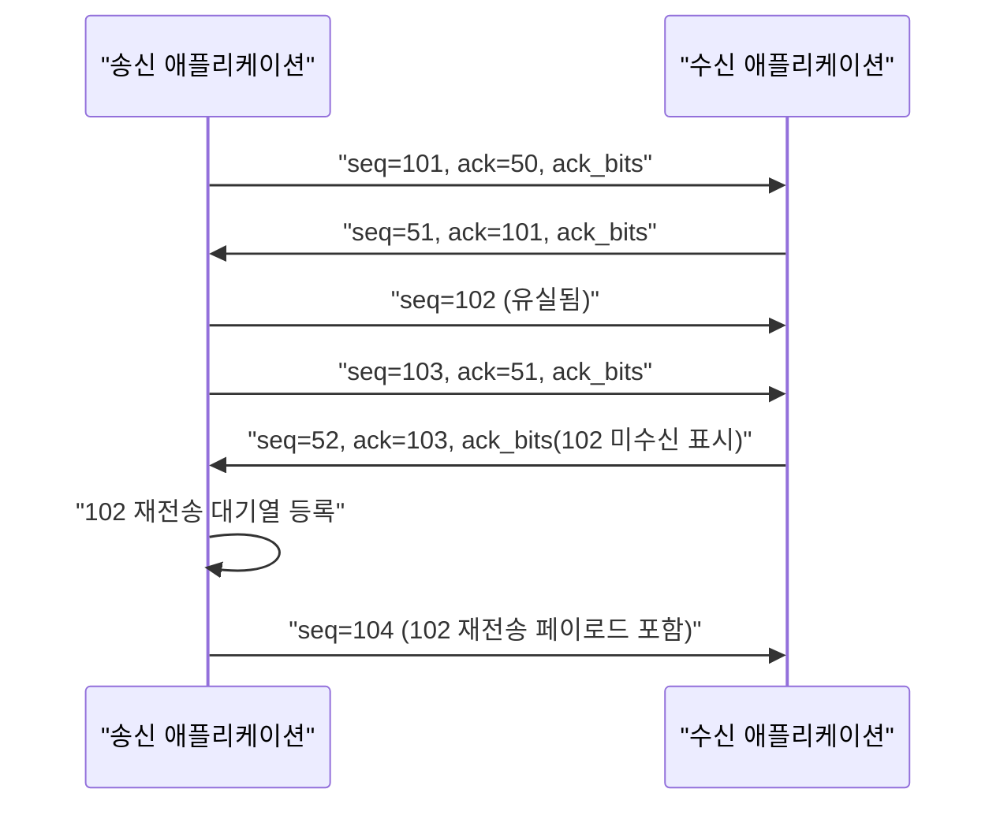

**UDP 최적화**란 전송 계층에서 handshake·혼잡 제어·순서 보장을 제거한 UDP의 저지연 특성을 살리면서, 애플리케이션이 필요로 하는 만큼의 신뢰성만 직접 설계해 얹는 작업을 말한다. TCP는 모든 바이트를 순서대로, 빠짐없이, 혼잡 제어를 통과시켜 전달하는 것을 표준 계약으로 삼기 때문에 손실 패킷 하나가 뒤따르는 모든 패킷의 전달을 막는 head-of-line blocking이 구조적으로 발생한다. 게임 서버의 위치 갱신, 실시간 시세 피드, VoIP·미디어 스트림처럼 "약간 늦은 정확한 데이터"보다 "제때 도착하는 최신 데이터"가 더 가치 있는 워크로드에서는 이 계약이 오히려 손해가 된다. 이 장에서는 UDP가 TCP와 구조적으로 어떻게 다른지, 그리고 필요한 신뢰성만 애플리케이션 레벨에서 골라 구현하는 방법을 다룬다.

## 이 장을 읽기 전에

이 장은 [TCP 성능 최적화](/post/network-optimization/tcp-performance-nagle-congestion-control-bbr/)(챕터 03)에서 다룬 RTT, 재전송 타임아웃, 혼잡 제어의 기본 개념을 전제로 한다. 소켓 버퍼 크기나 `SO_RCVBUF` 같은 옵션 자체의 튜닝 방법은 [소켓 옵션 튜닝](/post/network-optimization/socket-options-tcp-nodelay-buffer-tuning/)(챕터 02)에서 이미 다뤘으므로 여기서는 반복하지 않는다.

**이 장의 깊이**: UDP가 왜 낮은 지연을 제공하는지의 구조적 이유와, 재전송·순서 보장·오류 정정을 애플리케이션이 직접 설계할 때의 표준 패턴(시퀀스 번호, ACK 비트필드, 선택적 재전송, 지터 버퍼, FEC)을 중급 수준에서 다룬다. **다루지 않는 것**: 바이너리 프로토콜의 필드 레이아웃·버전 협상 같은 와이어 포맷 설계 세부사항은 [프로토콜 설계](/post/network-optimization/low-latency-binary-protocol-design-principles/)(챕터 08)와 [메시지 프레이밍](/post/network-optimization/message-framing-length-prefix-delimiter-fixed-size/)(챕터 09)으로 위임하고, 표준화된 UDP 기반 신뢰 전송인 QUIC의 내부 구조는 [QUIC 프로토콜](/post/network-optimization/quic-protocol-0rtt-udp-transport/)(챕터 15)에서 다룬다. NIC 레벨 커널 바이패스로 UDP 패킷을 처리하는 방식은 [DPDK 심화](/post/network-optimization/dpdk-advanced-deep-dive-smartnic-dpu/)(챕터 10)의 영역이다.

## 당신의 수준에 맞는 경로

| 수준 | 읽을 부분 | 핵심 목표 |
|------|---------|---------|
| **초보자** | "UDP의 역사와 설계 철학" ~ "UDP가 빠른 이유" | UDP가 TCP와 구조적으로 다른 지점과 그 대가를 이해 |
| **중급자** | "애플리케이션 레벨 신뢰성 레이어 설계" 전체 | 시퀀스 번호·ACK·재전송·순서·FEC로 최소 신뢰성 레이어를 직접 설계 |
| **전문가** | "커널 배치 API" ~ "비판적 시각" | recvmmsg/GSO 활용과 UDP·TCP·QUIC 중 무엇을 쓸지 판단 |

---

## UDP의 역사와 설계 철학

**UDP(User Datagram Protocol)**는 1980년 존 포스텔(Jon Postel)이 RFC 768로 표준화했으며, TCP보다 먼저 나온 것이 아니라 TCP의 스트림 지향·신뢰성 보장 모델이 맞지 않는 트래픽을 위해 나란히 설계된 얇은 계층이다. RFC 768은 UDP를 "트랜잭션 지향적"이라 부르며 신뢰성을 명시적으로 포기한다.

> "delivery and duplicate protection are not guaranteed" — [RFC 768](https://www.rfc-editor.org/rfc/rfc768) (Postel, 1980)

이 설계 철학은 "신뢰성이 없다"가 아니라 "신뢰성을 커널이 강제하지 않는다"로 읽어야 한다. DNS 질의(단일 요청-응답), 초기 NFS, 이후의 VoIP·온라인 게임·실시간 시세 배포(다수 거래소가 시장 데이터 피드에 UDP 멀티캐스트를 사용한다)까지, UDP를 선택한 애플리케이션들은 공통적으로 "필요한 만큼의 신뢰성을 직접 정의하는 편이 TCP의 일괄 계약보다 낫다"고 판단했다. 이후 2012년부터 구글이 개발한 QUIC(현재 RFC 9000)도 이 철학을 이어받아, UDP 위에 애플리케이션이 제어 가능한 신뢰성·혼잡 제어를 재구축한 결과물이다(챕터 15에서 다룬다).

## UDP가 빠른 이유: TCP와의 근본적 차이

UDP 소켓은 **연결이라는 개념이 없다**. `connect()`를 호출해도 커널 내부에 목적지를 캐싱할 뿐 3-way handshake는 발생하지 않으므로, 첫 패킷부터 데이터를 실어 보낼 수 있다. TCP는 SYN-SYN/ACK-ACK 왕복 없이는 데이터를 보낼 수 없어 최소 1 RTT의 연결 수립 지연이 강제된다. 두 번째 차이는 **순서와 완전성 보장의 부재**다. TCP는 커널 수신 버퍼에서 순서가 어긋나거나 빠진 세그먼트가 있으면 그 뒤에 도착한 데이터를 애플리케이션에 넘기지 않고 대기시킨다. 손실된 패킷 하나가 이후 정상 도착한 모든 데이터의 전달을 막는 이 현상이 head-of-line blocking이며, 실시간 스트림에서는 유실된 옛 데이터를 기다리다 최신 데이터까지 지연되는 역설이 발생한다. UDP는 데이터그램 단위로 애플리케이션에 즉시 전달되므로 이 대기가 원천적으로 없다.

세 번째 차이는 **혼잡 제어의 부재**다. TCP는 커널이 CUBIC이나 BBR 같은 혼잡 제어 알고리즘으로 전송 속도를 스스로 조절하지만(챕터 03), UDP는 애플리케이션이 원하는 속도로 보내는 대로 나간다. 이는 지연에는 유리하지만 네트워크를 보호하는 장치가 사라진다는 뜻이기도 하다. 네 번째 차이는 **데이터그램 경계 보존**이다. TCP는 바이트 스트림이라 애플리케이션이 직접 메시지 경계를 다시 그어야 하지만(챕터 09), UDP는 `sendto()` 한 번이 `recvfrom()` 한 번과 그대로 대응해 프레이밍 부담이 적다. 다만 이 경계는 IP 계층 MTU를 넘는 순간 단편화(fragmentation)로 깨질 수 있으므로, 저지연 경로에서는 페이로드를 경로 MTU 이하로 유지하는 편이 안전하다.

## 애플리케이션 레벨 신뢰성 레이어 설계

TCP가 강제로 제공하던 것들 — 순서 보장, 손실 감지, 재전송, 혼잡 제어 — 을 UDP 위에서 쓰려면 애플리케이션이 직접 골라 구현해야 한다. 핵심은 "전부 구현"이 아니라 "이 워크로드가 실제로 필요로 하는 부분만" 구현하는 것이다. 예를 들어 게임의 캐릭터 위치 갱신은 순서는 신경 쓰지 않아도 되지만(최신 값만 있으면 되므로) 최근 몇 개 패킷의 손실 여부는 알아야 하고, 파일 전송이라면 순서와 완전성이 모두 필요하다.

### 시퀀스 번호와 ACK 비트필드

가장 널리 쓰이는 패턴은 각 패킷에 증가하는 **시퀀스 번호**를 붙이고, 응답 패킷에 "최근 수신한 시퀀스 번호"(ack)와 그 이전 패킷들의 수신 여부를 담은 **비트필드**(ack_bits)를 함께 실어 보내는 것이다. 이 패턴은 Glenn Fiedler가 게임 네트워킹을 위해 정리한 [Reliability and Congestion Avoidance over UDP](https://gafferongames.com/post/reliability_ordering_and_congestion_avoidance_over_udp/)에서 널리 알려졌다. ack_bits의 비트 n이 켜져 있으면 `ack - n` 시퀀스 번호의 패킷이 수신됐다는 뜻이며, 32비트 필드 하나로 최근 33개 패킷의 수신 여부를 한 번에 실어 보낼 수 있다. 이 정보를 이후 여러 패킷에 중복으로 실으면(예: 매 패킷에 최근 32개 ack를 반복 포함) ack 패킷 자체가 유실돼도 다음 패킷의 ack로 복구되므로, 연속된 심각한 손실이 아니면 ack 정보가 끊기지 않는다.

```cpp
#include <cstdint>

// 패킷 헤더: 12바이트 고정. 실제 페이로드는 이 뒤에 이어붙인다.
struct PacketHeader {
  uint32_t sequence;   // 이 패킷의 시퀀스 번호
  uint32_t ack;        // 상대로부터 마지막으로 수신한 시퀀스 번호
  uint32_t ack_bits;    // ack 이전 32개 시퀀스 번호의 수신 비트필드
};

// bit n이 켜져 있으면 (header.ack - n)이 수신됨을 의미한다.
// n == 0 이면 header.ack 자신이 수신됐다는 뜻이 되도록 설계했다.
inline bool is_acked(const PacketHeader& header, uint32_t sequence) {
  uint32_t diff = header.ack - sequence;
  if (diff >= 32) return false;               // 비트필드 범위 밖: 알 수 없음(재전송 후보)
  return (header.ack_bits & (1u << diff)) != 0;
}
```

이 코드에서 `sequence`가 unsigned 정수로 감싸돌기(wraparound) 때문에 뺄셈 비교는 반드시 부호 있는 차이로 처리해야 한다(`int32_t` 캐스팅 후 비교하거나, 감싸돌기 주기 안에서만 유효하다고 가정). 실제 배포 전에는 시퀀스 번호가 `UINT32_MAX`를 넘어 0으로 돌아가는 경계 케이스를 유닛 테스트로 반드시 검증한다.

### 재전송 전략: 타임아웃과 선택적 재전송

ack 비트필드로 어떤 패킷이 안 왔는지 알았다면, 다음은 **언제 다시 보낼지**를 정해야 한다. 가장 단순한 방법은 각 패킷을 보낸 시각을 기록해 두고, RTT 추정치(챕터 03에서 다룬 방식과 동일하게 왕복 시간 샘플의 이동 평균)를 기준으로 한 타임아웃 안에 ack가 오지 않으면 유실로 간주해 재전송하는 것이다. TCP의 전체 재전송(Go-Back-N에 가까운 초기 TCP 동작)과 달리, UDP 위의 커스텀 레이어는 유실된 패킷만 골라 다시 보내는 **선택적 재전송(selective retransmit)**을 자연스럽게 구현할 수 있다 — 어차피 순서 보장이 없으므로 뒤 패킷을 기다리게 할 이유가 없다. 다만 중요도가 낮은 데이터(예: 3틱 전 캐릭터 위치)는 재전송하지 않고 버리는 편이 나을 때가 많다. 이미 더 최신 값이 재전송 대기 중이라면, 오래된 값을 재전송하는 것은 대역폭 낭비이자 head-of-line blocking을 스스로 재현하는 셈이기 때문이다.

아래는 시퀀스 번호·ack·재전송이 실제로 오가는 순서를 보여준다. 102번 패킷이 유실되면 수신 측의 ack_bits가 이를 드러내고, 송신 측은 102번만 골라 재전송한다 — 103·104번은 기다리지 않고 이미 전달된다.



### 순서 보장과 지터 버퍼

순서가 필요한 스트림(오디오·비디오·정렬된 이벤트 로그)이라면 수신 측에 **지터 버퍼(jitter buffer)**를 두고, 시퀀스 번호 순서로 재정렬한 뒤 일정 지연(재생 버퍼 지연)을 두고 애플리케이션에 내보낸다. 이 지연은 네트워크 지터(도착 시간 편차)를 흡수하기 위한 것으로, 버퍼를 키우면 순서 뒤바뀜과 짧은 유실에 강해지지만 그만큼 종단 지연이 늘어난다. 실시간 통화·게임처럼 지연 예산이 빠듯한 도메인에서는 이 버퍼 크기 자체가 지연과 안정성 사이의 핵심 트레이드오프 파라미터가 된다.

### 전송 오류 정정(FEC): 재전송을 피하는 대안

재전송은 최소 1 RTT를 추가로 소모하므로, RTT가 크거나(위성·장거리 회선) 재전송 자체가 늦어서 의미가 없는 실시간 스트림에는 맞지 않을 수 있다. **전방 오류 정정(Forward Error Correction, FEC)**은 원본 데이터에 중복 정보(패리티 패킷)를 미리 섞어 보내, 수신 측이 일부 패킷을 잃어도 재전송 없이 복구하게 하는 방식이다. 예를 들어 10개의 데이터 패킷마다 2개의 패리티 패킷을 추가로 보내면, 그 구간에서 최대 2개까지의 손실을 왕복 없이 즉시 복구할 수 있다. 대가는 항상 추가 대역폭(위 예시에서 20%)을 소모한다는 점이며, 실제 손실률이 FEC가 감당할 수 있는 범위를 넘으면 결국 재전송이나 데이터 폐기로 돌아가야 한다. WebRTC의 오디오 트랙 등 실시간 미디어 스택에서 FEC와 재전송을 함께 쓰는 것이 이런 이유다.

## 커널 배치 API: recvmmsg/sendmmsg와 GSO/GRO

시퀀스 번호·ACK·재전송 로직을 다 설계했더라도, 초당 수만~수백만 개의 작은 UDP 데이터그램을 다뤄야 하는 시세 피드나 게임 서버라면 시스템 콜 자체의 오버헤드가 병목이 될 수 있다. Linux는 `sendto()`/`recvfrom()`을 패킷마다 한 번씩 호출하는 대신, 여러 데이터그램을 한 번의 시스템 콜로 보내고 받는 **`sendmmsg(2)`/`recvmmsg(2)`**를 제공한다. [man7.org의 sendmmsg(2) 문서](https://man7.org/linux/man-pages/man2/sendmmsg.2.html)는 이를 "sendmsg(2)의 확장으로, 호출자가 단일 시스템 콜로 여러 메시지를 전송할 수 있게 한다"고 설명한다.

```c
#include <sys/socket.h>
#include <sys/uio.h>
#include <netinet/in.h>
#include <string.h>

#define BATCH 32

// sockfd는 이미 connect() 또는 bind()된 UDP 소켓이라고 가정한다.
int send_batch(int sockfd, char (*bufs)[1400], size_t *lens, unsigned n) {
  struct mmsghdr msgs[BATCH];
  struct iovec iov[BATCH];
  memset(msgs, 0, sizeof(msgs));

  for (unsigned i = 0; i < n && i < BATCH; ++i) {
    iov[i].iov_base = bufs[i];
    iov[i].iov_len = lens[i];
    msgs[i].msg_hdr.msg_iov = &iov[i];
    msgs[i].msg_hdr.msg_iovlen = 1;
  }

  // 한 번의 시스템 콜로 최대 n개의 데이터그램을 전송한다.
  // 반환값은 실제로 전송된 메시지 수이며, n보다 작을 수 있다.
  return sendmmsg(sockfd, msgs, n, 0);
}
```

반환값이 요청한 `n`보다 작을 수 있으므로 호출자는 반드시 실제 전송 개수를 확인하고 나머지를 재시도하거나 버려야 하며, 배치 크기(`BATCH`)를 키울수록 시스템 콜은 줄지만 첫 패킷이 큐에 쌓인 채 기다리는 제출 지연(submission latency)이 늘어나는 트레이드오프가 있다.

`sendmmsg`/`recvmmsg`는 패킷 개수에 비례해 절감되는 시스템 콜 오버헤드에 효과가 있는 반면, **UDP GSO(Generic Segmentation Offload)**는 커널 4.18부터 `NETIF_F_GSO_UDP_L4`로 추가되어 애플리케이션이 큰 버퍼 하나를 넘기면 커널(또는 NIC)이 이를 여러 UDP 세그먼트로 쪼개 전송 비용을 줄인다. 수신 측의 UDP GRO(Generic Receive Offload)는 반대로 같은 헤더를 가진 여러 데이터그램을 하나로 묶어 상위 계층에 전달하는데, 정확히 어떤 조합·조건에서 소켓 레벨로 노출되는지는 커널 버전과 드라이버에 따라 달라지는 구현 정의 영역이라 배포 환경에서 직접 확인해야 한다. 이 두 배치 경로(시스템 콜 배치와 세그멘테이션 오프로드)는 함께 쓸 때 상호작용이 있으므로, 실제 이득은 반드시 대상 환경에서 측정해야 한다.

```cpp
#include <benchmark/benchmark.h>
#include <sys/socket.h>
#include <sys/uio.h>
#include <arpa/inet.h>
#include <unistd.h>
#include <cstring>

// Linux, GCC 13, -O2 기준(x86-64). sendto 루프 대비 sendmmsg 배치의 시스템 콜
// 오버헤드 차이를 격리 측정한다. 실제 배율은 커널 버전·NIC 드라이버·배치
// 크기에 따라 달라지므로 배포 환경에서 재현 후 사용한다.
constexpr int kBatch = 32;

static void BM_SendtoLoop(benchmark::State& state) {
  int fd = socket(AF_INET, SOCK_DGRAM, 0);
  char buf[64] = {0};
  sockaddr_in dst{}; dst.sin_family = AF_INET; dst.sin_port = htons(9999);
  inet_pton(AF_INET, "127.0.0.1", &dst.sin_addr);
  for (auto _ : state) {
    for (int i = 0; i < kBatch; ++i)
      sendto(fd, buf, sizeof(buf), 0, (sockaddr*)&dst, sizeof(dst));
  }
  close(fd);
}
BENCHMARK(BM_SendtoLoop);

static void BM_SendmmsgBatch(benchmark::State& state) {
  int fd = socket(AF_INET, SOCK_DGRAM, 0);
  sockaddr_in dst{}; dst.sin_family = AF_INET; dst.sin_port = htons(9999);
  inet_pton(AF_INET, "127.0.0.1", &dst.sin_addr);
  connect(fd, (sockaddr*)&dst, sizeof(dst));
  char buf[64] = {0};
  mmsghdr msgs[kBatch]; iovec iov[kBatch];
  for (int i = 0; i < kBatch; ++i) {
    iov[i] = {buf, sizeof(buf)};
    msgs[i] = {}; msgs[i].msg_hdr.msg_iov = &iov[i]; msgs[i].msg_hdr.msg_iovlen = 1;
  }
  for (auto _ : state)
    sendmmsg(fd, msgs, kBatch, 0);
  close(fd);
}
BENCHMARK(BM_SendmmsgBatch);

BENCHMARK_MAIN();
```

`g++ -O2 bench.cpp -lbenchmark -lpthread`로 빌드해 실행하면(커널·NIC 드라이버에 따라 배율은 다르지만) `BM_SendmmsgBatch`가 `BM_SendtoLoop`보다 빠르게 나오는 경우가 흔하다 — 차이는 패킷 32개당 시스템 콜을 32번이 아니라 1번만 호출한다는 데서 온다. 다만 이 벤치마크는 루프백(127.0.0.1)에서 시스템 콜 오버헤드만 격리한 것이므로, 실제 네트워크 경로에서는 NIC 드라이버·GSO/GRO 상호작용까지 포함해 다시 측정해야 한다.

## 흔한 오개념

- **"UDP는 항상 TCP보다 빠르다"**: 잘못 설계된 애플리케이션 레벨 재전송(전체 재전송, 과도한 재전송 반복)은 TCP의 잘 튜닝된 혼잡 제어보다 오히려 꼬리 지연(tail latency)이 나빠질 수 있다. UDP는 "빠를 수 있는 여지"를 줄 뿐, 신뢰성 레이어를 잘못 설계하면 그 여지를 스스로 반납하게 된다.
- **"UDP는 신뢰성이 전혀 없다"**: UDP 자체는 보장하지 않지만, 애플리케이션이 시퀀스 번호와 ACK로 원하는 수준의 신뢰성(전부, 일부, 최신 값만)을 직접 고를 수 있다. "신뢰성 없음"과 "신뢰성을 커널이 강제하지 않음"은 다르다.
- **"UDP에 재전송을 붙이면 결국 TCP를 다시 만드는 것"**: 표면적으로는 비슷해 보이지만, 커스텀 레이어는 순서 보장 없는 선택적 재전송, 오래된 데이터의 의도적 폐기, FEC 병행처럼 TCP의 일괄 계약으로는 표현할 수 없는 정책을 데이터 종류별로 다르게 적용할 수 있다는 점이 근본적으로 다르다.

## 판단 기준: UDP + 커스텀 레이어를 언제 쓸까

| 상황 | 권장 | 비권장 |
|------|------|--------|
| 최신 값만 중요(위치 갱신, 시세 tick) | UDP + 시퀀스 기반 최신값 우선 폐기 | TCP(오래된 값 때문에 최신 값이 지연) |
| 순서·완전성이 반드시 필요한 스트림 | UDP + 순서 보장 신뢰성 레이어 또는 TCP | 순서 보장 없는 원시 UDP |
| 표준화된 신뢰 전송과 0-RTT가 필요 | QUIC(챕터 15) | 신뢰성 레이어를 처음부터 재구현 |
| 손실률이 낮고 재전송 여유(RTT)가 있음 | 선택적 재전송 | FEC로만 처리(대역폭 낭비) |
| 손실률이 높거나 재전송이 늦음(위성·장거리) | FEC 병행 | 재전송에만 의존 |
| 초당 수만 건 이상의 소형 데이터그램 | sendmmsg/recvmmsg, GSO/GRO 활용 | 패킷당 sendto/recvfrom 반복 |
| 다자간 동일 데이터 배포(시장 데이터 피드) | UDP 멀티캐스트 | 수신자 수만큼 유니캐스트 TCP 연결 |

## 비판적 시각: 트레이드오프와 한계

애플리케이션 레벨 신뢰성 레이어를 직접 만드는 것은 **TCP가 수십 년간 다듬어 온 문제를 처음부터 다시 푸는 일**이기도 하다. 혼잡 제어를 생략하면 지연에는 유리하지만, 여러 UDP 스트림이 같은 병목 링크를 공유할 때 서로를 존중하지 않고 네트워크를 밀어붙여 전체 처리량이 붕괴하는 상황(혼잡 붕괴)을 스스로 막아야 한다. 실무에서는 최소한의 속도 제한이나 RTT 기반 백오프를 직접 넣는 경우가 많다. NAT·방화벽 경유 환경에서는 UDP가 "연결 없음"으로 취급돼 idle timeout이 TCP보다 훨씬 짧게 잡히는 미들박스가 흔하고, 일부 기업 방화벽은 UDP 트래픽 자체를 차단하거나 속도를 제한한다. 또한 시퀀스 번호·ACK 비트필드·재전송·지터 버퍼는 코드량과 테스트 표면을 늘리며, 감싸돌기(wraparound)나 재정렬 경계 같은 엣지 케이스는 실제 손실이 나는 환경(느린 네트워크 시뮬레이션, 패킷 드롭 주입)에서 검증하지 않으면 운영 중에야 드러난다. 이런 이유로 QUIC처럼 이미 검증된 표준 위에 신뢰성을 구축할 수 있다면 커스텀 레이어를 처음부터 설계하는 것보다 유리한 경우가 많으며, 커스텀 레이어는 QUIC의 일반 목적 설계가 감당하지 못하는 특수한 정책(예: 오래된 값의 의도적 폐기)이 꼭 필요할 때로 범위를 좁히는 편이 안전하다.

## 마무리

- [ ] UDP가 handshake·순서 보장·혼잡 제어를 생략해 저지연을 얻는 구조적 이유를 설명할 수 있다.
- [ ] 시퀀스 번호와 ACK 비트필드로 손실 감지를, 선택적 재전송으로 필요한 데이터만 복구하는 패턴을 설계할 수 있다.
- [ ] 지터 버퍼로 순서·재생 지연을 조절하고, FEC로 재전송 없이 손실을 흡수하는 대안을 언제 병행할지 판단할 수 있다.
- [ ] sendmmsg/recvmmsg, UDP GSO/GRO가 시스템 콜·세그멘테이션 오버헤드를 줄이는 지점을 구분할 수 있다.
- [ ] UDP + 커스텀 레이어, TCP, QUIC 중 워크로드에 맞는 선택지를 판단 기준 표로 고를 수 있다.
- 혼잡 붕괴·미들박스 차단·엣지 케이스 검증 부담 같은 커스텀 신뢰성 레이어의 대가를 설명할 수 있다.

**다음 장에서는** 애플리케이션이 UDP든 TCP든 실려 보내는 바이트 자체의 비용, 즉 **직렬화 성능**을 다룬다. Protocol Buffers, FlatBuffers, Cap'n Proto가 같은 메시지를 얼마나 다른 비용으로 인코딩·디코딩하는지 비교한다.

→ [직렬화 성능 비교](/post/network-optimization/serialization-performance-protobuf-flatbuffers-capnproto/) (챕터 05)
