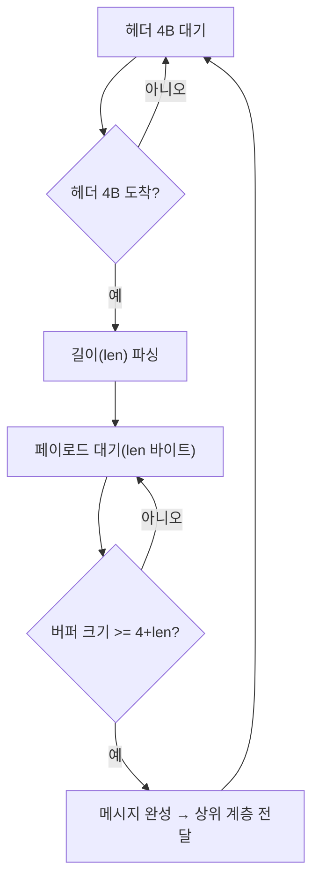

**메시지 프레이밍(message framing)**이란 TCP처럼 경계 없는 바이트 스트림 위에서 "여기까지가 하나의 메시지"라는 경계를 애플리케이션이 스스로 표시하고 복원하는 규약을 말합니다. 소켓 API의 `recv()`는 보낸 쪽이 몇 번의 `send()`로 나누어 썼는지, 하나의 논리적 메시지가 몇 바이트인지 전혀 알려주지 않으므로, 프레이밍 규약이 없으면 수신 측은 "지금 도착한 바이트 뭉치가 메시지 하나인지, 반쪽인지, 두 개가 붙은 것인지"를 구분할 방법이 없습니다. 이 장은 length-prefix, delimiter, fixed-size라는 세 가지 프레이밍 전략이 이 문제를 어떻게 해결하는지, 그리고 부분 수신(partial read) 상황에서 파서를 어떻게 설계해야 하는지를 다룹니다.

## 이 장을 읽기 전에

**전제 지식**: 이 장은 [08장: 프로토콜 설계](/post/network-optimization/low-latency-binary-protocol-design-principles/)에서 다룬 바이너리 프로토콜의 헤더·페이로드 구분을 전제로 하며, [02장: 소켓 옵션 튜닝](/post/network-optimization/socket-options-tcp-nodelay-buffer-tuning/)과 [03장: TCP 성능 최적화](/post/network-optimization/tcp-performance-nagle-congestion-control-bbr/)에서 다룬 Nagle 알고리즘·버퍼링이 "왜 한 번의 `send()`가 한 번의 `recv()`로 그대로 오지 않는지"의 배경이 됩니다. 이 장의 범위는 **TCP·Unix 도메인 소켓처럼 스트림 지향(byte-stream) 전송에서만 발생하는 경계 문제**입니다. [04장: UDP 최적화](/post/network-optimization/udp-optimization-reliability-layer-design/)에서 다루는 UDP 데이터그램은 `recvfrom()` 한 번이 상대의 `sendto()` 한 번에 대응하도록 커널이 경계를 보존하므로, 이 장이 다루는 문제 자체가 발생하지 않습니다.

**이 장의 깊이**: 프레이밍 전략의 원리와 부분 수신 파서 구현까지가 중심이며, **중급~전문가**를 포괄합니다. **다루지 않는 것**: 직렬화 포맷 자체의 self-describing 여부와 스키마 진화는 [05장](/post/network-optimization/serialization-performance-protobuf-flatbuffers-capnproto/)~[07장](/post/network-optimization/next-gen-zero-copy-serialization-formats-yaff/), HTTP/2·HTTP/3의 프레임 포맷은 [19장](/post/network-optimization/http2-http3-multiplexing-quic-comparison/), WebSocket 프레임 구조는 [18장](/post/network-optimization/websocket-performance-tuning-compression-batching/)에서 각각 다룹니다. 이 장은 그 위에 있는 공통 원리, 즉 "스트림에서 경계를 어떻게 표시하고 복원하는가"에 집중합니다.

## 당신의 수준에 맞는 경로

| 수준 | 읽을 부분 | 핵심 목표 |
|------|---------|---------|
| **초보자** | "TCP는 왜 메시지 경계를 보장하지 않는가" ~ "세 가지 프레이밍 전략" | 스트림 경계 문제와 세 전략의 기본 동작 이해 |
| **중급자** | "부분 수신을 처리하는 파싱 상태 머신" ~ "흔한 오개념 바로잡기" | 실전 파서 구현과 흔한 실수 회피 |
| **전문가** | "판단 기준" ~ "비판적 시각" | 상황별 전략 선택과 보안·한계 판단 |

## TCP는 왜 메시지 경계를 보장하지 않는가 (역사·배경)

TCP는 1981년 RFC 793에서부터 스스로를 "순서 있는 바이트 스트림(ordered byte stream)"으로 정의해 왔고, 메시지나 레코드라는 개념 자체를 프로토콜에 넣지 않았습니다. Linux의 `tcp(7)` man 페이지는 이를 명시적으로 확인해 줍니다.

> "TCP does not preserve record boundaries." — [man7.org: tcp(7)](https://man7.org/linux/man-pages/man7/tcp.7.html)

이 설계 결정 때문에 응용 계층은 처음부터 "내가 보낸 논리적 단위가 상대에게 그대로 전달된다"는 보장을 받지 못했습니다. 초기 텍스트 기반 프로토콜(Telnet, SMTP)은 CRLF 같은 구분자로 이 문제를 우회했고, HTTP/1.0은 아예 "연결을 끊는 것"을 메시지 끝의 신호로 사용했습니다. 이 방식은 연결마다 요청 하나만 처리할 수 있어 TCP 핸드셰이크 비용을 반복하는 비효율이 있었고, HTTP/1.1(1997년 RFC 2068, 현재는 2022년 RFC 9112로 개정)은 지속 연결 위에서 여러 메시지를 구분하기 위해 `Content-Length` 헤더(길이 프리픽스의 응용 계층 버전)와 `Transfer-Encoding: chunked`(청크마다 크기를 앞세우는 방식)를 도입했습니다.

```text
4\r\n
Wiki\r\n
5\r\n
pedia\r\n
0\r\n
\r\n
```

RFC 9112는 청크 구조를 다음과 같이 정의합니다.

> "chunk = chunk-size [ chunk-ext ] CRLF chunk-data CRLF" — [RFC 9112: HTTP/1.1](https://www.rfc-editor.org/rfc/rfc9112), 7.1절

청크마다 16진수 크기(`chunk-size`)를 CRLF 앞에 붙이는 이 구조는 사실상 "구분자(CRLF)로 헤더를 끊고, 그 헤더 안에 길이를 넣는" 혼합 전략입니다. 이 장에서 다루는 length-prefix·delimiter·fixed-size 세 전략은 이런 응용 계층 프로토콜들이 스트림 경계 문제를 풀기 위해 반복해서 재발명해 온 세 가지 기본형이라고 볼 수 있습니다.

## 세 가지 프레이밍 전략

프레이밍 전략은 "메시지가 끝났다는 것을 어떻게 알리는가"라는 질문에 대한 답이며, 크게 세 갈래로 나뉩니다. 길이를 먼저 알려주거나, 끝을 표시하는 특정 바이트를 두거나, 아예 길이를 협상하지 않고 고정해 버리는 방식입니다. 셋 다 파싱 복잡도·대역폭 오버헤드·구현 난이도의 서로 다른 지점에 위치합니다.

### Length-prefix 프레이밍

**길이 프리픽스**는 페이로드 앞에 고정 크기 헤더(보통 4바이트 정수)로 뒤따르는 바이트 수를 명시하는 방식입니다. 수신 측은 헤더를 먼저 읽어 길이를 파악한 다음, 그만큼의 바이트가 도착할 때까지 기다리면 되므로 파싱 로직이 단순하고 페이로드 안에 어떤 바이트 값이 와도 프레이밍이 깨지지 않습니다. Protocol Buffers 공식 가이드는 스트림에 여러 메시지를 이어 쓰는 문제를 정확히 이 방식으로 해결하라고 안내합니다.

> "The easiest way to solve this problem is to write the size of each message before you write the message itself." — [protobuf.dev: Streaming Multiple Messages](https://protobuf.dev/programming-guides/techniques/)

헤더의 바이트 순서(엔디안)는 프로토콜 설계자가 정하는 값입니다. 네트워크 프로토콜은 관례적으로 빅엔디안(네트워크 바이트 오더, `htonl`/`ntohl`)을 쓰지만, x86 계열에서만 통신하는 사내 프로토콜이라면 변환 비용을 아끼려고 리틀엔디안을 그대로 쓰는 경우도 흔합니다. 길이 필드의 폭(16비트냐 32비트냐)은 허용할 최대 메시지 크기의 상한을 결정하므로, 페이로드 크기 분포를 보고 정해야 합니다.

### Delimiter 기반 프레이밍

**구분자 프레이밍**은 메시지 끝에 특정 바이트 시퀀스(개행 `\n`, `\r\n`, NUL 등)를 붙이고 수신 측이 그 시퀀스를 스캔해 경계를 찾는 방식입니다. 헤더가 없어 사람이 로그를 눈으로 읽거나 `telnet`으로 손으로 찔러 볼 수 있다는 점이 텍스트 기반 프로토콜(Redis의 RESP, SMTP, HTTP 헤더 자체)에서 여전히 널리 쓰이는 이유입니다. 다만 페이로드 안에 구분자와 같은 바이트가 나타날 수 있는 이진 데이터에는 그대로 쓸 수 없고, 이스케이프(예: SLIP·PPP의 바이트 스터핑)나 별도 인코딩(base64 등으로 구분자 바이트 자체를 배제)이 필요합니다.

### Fixed-size 프레이밍

**고정 크기 프레이밍**은 모든 메시지를 같은 바이트 수로 맞추는 방식으로, 헤더도 구분자도 없이 "N바이트마다 메시지 하나"라는 약속만 있으면 됩니다. 페이로드가 짧으면 패딩으로 채우고 길면 아예 표현할 수 없으므로 가변 길이 데이터에는 부적합하지만, 파싱이 분기 없이 오프셋 계산만으로 끝나 예측 가능한 지연을 요구하는 시스템에 유리합니다. FIX Trading Community의 Simple Binary Encoding(SBE) 명세는 이 특성을 다음과 같이 설명합니다.

> "In SBE, fields of a message occupy proximate space without delimiters or metadata, such as tags." — [FIXTradingCommunity/fix-simple-binary-encoding: 03MessageStructure.md](https://github.com/FIXTradingCommunity/fix-simple-binary-encoding/blob/master/v1-0-STANDARD/doc/03MessageStructure.md)

같은 문서는 SBE 메시지도 스트림 전송에서는 별도 프레이밍이 필요하다고 밝힙니다. "it may be desirable to use an external framing protocol when used with transports that do not preserve message boundaries, such as when they are transmitted on a streaming session protocol"라는 문장은, 고정 크기 인코딩조차 TCP 위에서는 메시지가 몇 개 붙어 오는지 구분할 length-prefix 같은 외부 프레이밍이 필요함을 뜻합니다. 즉 fixed-size는 "필드 인코딩"의 고정 폭이지, 그 자체로 "메시지 경계"를 자동으로 주는 것은 아닙니다.

## 부분 수신을 처리하는 파싱 상태 머신

`recv()`가 한 번에 완전한 메시지 하나를 정확히 돌려준다는 가정은 스트림 소켓에서 성립하지 않습니다. 커널 수신 버퍼 상태, MTU에 따른 세그먼트 분할, 애플리케이션이 미처 다 읽지 않은 상태에서의 재호출 등 여러 이유로 한 번의 `recv()`가 메시지의 일부만 반환하거나, 반대로 여러 메시지를 한꺼번에 반환할 수 있습니다. 따라서 프레이밍 파서는 "충분한 바이트가 쌓일 때까지 기다렸다가, 쌓이면 즉시 처리하고, 남는 바이트는 버려서는 안 된다"는 상태 머신으로 설계해야 합니다.



length-prefix 파서는 위 상태 머신을 그대로 구현하면 됩니다. 아래 `LengthPrefixFramer`는 도착한 바이트를 내부 버퍼에 누적하다가, 헤더 4바이트와 그만큼의 페이로드가 모두 쌓였을 때만 완성된 메시지 하나를 꺼내 줍니다.

```cpp
#include <arpa/inet.h>
#include <cstdint>
#include <cstring>
#include <stdexcept>
#include <vector>

// 부분 수신을 흡수하는 길이-프리픽스 프레이머.
// feed()는 recv()가 몇 바이트를 돌려주든 상관없이 호출할 수 있고,
// 메시지가 완성될 때마다 true를 반환하며 out을 채운다.
class LengthPrefixFramer {
 public:
  bool feed(const uint8_t* data, size_t n, std::vector<uint8_t>& out) {
    buf_.insert(buf_.end(), data, data + n);
    if (buf_.size() < kHeaderSize) return false;  // 헤더도 아직 다 안 옴
    uint32_t len;
    std::memcpy(&len, buf_.data(), kHeaderSize);
    len = ntohl(len);                             // 네트워크 바이트오더(빅엔디안) 가정
    if (len > kMaxMessageSize) {
      throw std::runtime_error("message too large");  // 상한 검증: 아래 "비판적 시각" 참고
    }
    if (buf_.size() < kHeaderSize + len) return false;  // 페이로드가 아직 덜 옴
    out.assign(buf_.begin() + kHeaderSize, buf_.begin() + kHeaderSize + len);
    buf_.erase(buf_.begin(), buf_.begin() + kHeaderSize + len);
    return true;
  }

 private:
  static constexpr size_t kHeaderSize = 4;
  static constexpr uint32_t kMaxMessageSize = 16 * 1024 * 1024;
  std::vector<uint8_t> buf_;
};
```

`buf_.erase`는 남은 데이터를 앞으로 당기는 `O(버퍼 크기)` 복사를 수행하므로, 한 번의 `recv()`에 메시지가 여러 개 쌓이는 고처리량 환경에서는 링 버퍼나 읽기 커서(offset) 방식으로 바꿔 이 복사를 없애는 것이 좋습니다. delimiter 기반 파서는 상태 머신은 같지만 "충분한 바이트가 쌓였는가"를 길이 계산 대신 `memchr`로 구분자를 찾는 것으로 대체합니다.

```cpp
#include <cstring>
#include <vector>

// 개행(\n)을 구분자로 쓰는 파서. 반환값은 처리한 바이트 수(0이면 아직 메시지 미완성).
size_t consume_delimited(const std::vector<uint8_t>& buf, std::vector<uint8_t>& out) {
  const void* p = std::memchr(buf.data(), '\n', buf.size());
  if (!p) return 0;
  const uint8_t* end = static_cast<const uint8_t*>(p);
  out.assign(buf.data(), end);  // 구분자 자체는 out에서 제외
  return (end - buf.data()) + 1;
}
```

구분자 파서는 페이로드에 `\n`이 섞여 있지 않다는 것을 애플리케이션이 보장해야 하며, 그 보장이 없다면 이스케이프 규칙을 추가해야 합니다. fixed-size 파서는 상태가 하나뿐이라 가장 단순합니다. 정확히 `kRecordSize`바이트가 쌓일 때까지 기다렸다가 그대로 잘라내면 되고, 길이 파싱도 구분자 스캔도 필요 없습니다.

## 흔한 오개념 바로잡기

- **"`send()`를 한 번 호출하면 상대는 `recv()`를 한 번 호출해 정확히 그 바이트만 받는다"**: TCP는 바이트 스트림이므로 이런 1:1 대응을 보장하지 않습니다. Nagle 알고리즘(03장)에 의한 코얼레싱, MTU에 따른 세그먼트 분할, 애플리케이션의 수신 타이밍에 따라 하나의 논리 메시지가 여러 번의 `recv()`에 걸쳐 오거나, 여러 메시지가 한 번의 `recv()`에 합쳐져 올 수 있습니다. 프레이밍 파서 없이 "이번에 받은 바이트가 메시지 하나"라고 가정하는 코드는 부하가 커지는 순간 깨집니다.
- **"구분자 프레이밍은 길이를 미리 계산하지 않으니 length-prefix보다 항상 느리다"**: 짧은 메시지에서는 `memchr` 기반 스캔과 4바이트 헤더 파싱의 실행 시간 차이가 거의 없는 경우가 많습니다. 다만 length-prefix는 경계를 찾는 데 필요한 연산이 메시지 길이와 무관한 `O(1)`인 반면 delimiter는 구분자를 만날 때까지 최악의 경우 메시지 전체를 스캔하는 `O(n)`이므로, 메시지가 커질수록 그 격차가 벌어지는 경향이 있습니다. 실제 차이는 플랫폼·컴파일러·`memchr` 구현(SIMD 가속 여부)에 따라 달라지므로 단정하기보다 직접 측정해 확인해야 합니다.
- **"고정 크기 프레이밍은 낡은 방식이라 실무에서 안 쓴다"**: NASDAQ ITCH나 SBE 기반 마켓 데이터 피드처럼 스키마가 고정되고 분기 없는 파싱이 지연 예산에 직결되는 시스템에서는 지금도 고정 크기 레코드가 표준적인 선택입니다. 가변성을 포기하는 대신 파싱 비용을 상수 시간으로 만드는 트레이드오프가 여전히 유효한 영역이 있습니다.

## 판단 기준

| 상황 | 권장 | 비권장 |
|------|------|--------|
| 가변 길이 이진 페이로드, 스키마가 자주 바뀜 | length-prefix(4바이트 헤더 또는 varint) | fixed-size(재설계 비용 큼) |
| 사람이 읽거나 손으로 디버깅할 텍스트 프로토콜 | delimiter(이스케이프 규칙 명시) | length-prefix(가독성 저하) |
| 초저지연·고정 스키마 마켓 데이터 틱 | fixed-size(분기 없는 오프셋 파싱) | delimiter(스캔 비용) |
| 신뢰할 수 없는 외부 클라이언트 입력 | length 필드에 상한 검증 필수 | 상한 없는 length 필드 신뢰 |
| 페이로드에 구분자 바이트가 섞일 수 있음 | length-prefix 또는 이스케이프된 delimiter | 이스케이프 없는 delimiter |

## 비판적 시각: 한계와 트레이드오프

length-prefix 헤더는 신뢰할 수 없는 입력에 대해 방어적으로 다뤄야 합니다. 공격자가 실제 페이로드보다 훨씬 큰 길이 값을 보내면 파서가 그 길이만큼 버퍼를 미리 할당하거나 무한정 대기하다가 메모리 고갈이나 서비스 거부로 이어질 수 있으므로, 위 코드의 `kMaxMessageSize`처럼 애플리케이션이 감당할 수 있는 최대 메시지 크기를 반드시 검증해야 합니다. delimiter 프레이밍은 페이로드가 구분자 바이트를 포함할 가능성을 놓치면 한 메시지가 둘로 쪼개지거나 서로 다른 메시지가 하나로 합쳐지는 프레이밍 오류로 이어지는데, 이 범주의 문제가 실제로 큰 영향을 준 사례가 HTTP 요청 스머글링(request smuggling)입니다. 프런트엔드와 백엔드가 `Content-Length`(길이 프리픽스)와 `Transfer-Encoding: chunked`(청크 길이 기반 구분)를 서로 다르게 우선시하면, 두 파서가 메시지 경계에 합의하지 못해 하나의 TCP 스트림을 다른 방식으로 잘라 읽는 사고가 발생합니다. 이는 특정 라이브러리의 버그라기보다 "같은 스트림에 두 가지 프레이밍 규약이 동시에 허용될 때" 구조적으로 생기는 위험이라, 하나의 커넥션에는 하나의 프레이밍 규약만 허용하는 설계가 근본적인 예방책입니다. fixed-size 프레이밍은 스키마가 바뀌는 순간 레코드 크기 자체를 다시 정의해야 하므로, 버전이 다른 송수신자가 섞인 롤링 배포 환경에서는 별도의 버전 필드나 협상 절차 없이는 호환성을 유지하기 어렵습니다.

세 전략의 실제 파싱 비용 차이를 가늠하려면, 경계 탐지 로직만 떼어내 격리 측정하는 것이 좋습니다. 아래는 길이 헤더 파싱과 `memchr` 구분자 스캔의 실행 시간을 비교하는 Google Benchmark 스켈레톤입니다.

```cpp
#include <benchmark/benchmark.h>
#include <cstdint>
#include <cstring>
#include <vector>

static size_t next_boundary_length_prefixed(const uint8_t* buf, size_t avail) {
  if (avail < 4) return 0;
  uint32_t len;
  std::memcpy(&len, buf, 4);
  len = __builtin_bswap32(len);
  if (avail < 4 + len) return 0;
  return 4 + len;
}

static size_t next_boundary_delimited(const uint8_t* buf, size_t avail) {
  const void* p = std::memchr(buf, '\n', avail);
  if (!p) return 0;
  return static_cast<const uint8_t*>(p) - buf + 1;
}

static void BM_LengthPrefixScan(benchmark::State& state) {
  std::vector<uint8_t> msg(4 + 128, 'x');
  uint32_t len = __builtin_bswap32(128u);
  std::memcpy(msg.data(), &len, 4);
  for (auto _ : state) benchmark::DoNotOptimize(next_boundary_length_prefixed(msg.data(), msg.size()));
}
BENCHMARK(BM_LengthPrefixScan);

static void BM_DelimiterScan(benchmark::State& state) {
  std::vector<uint8_t> msg(128, 'x');
  msg.back() = '\n';
  for (auto _ : state) benchmark::DoNotOptimize(next_boundary_delimited(msg.data(), msg.size()));
}
BENCHMARK(BM_DelimiterScan);

BENCHMARK_MAIN();
```

`g++ -O2 bench.cpp -lbenchmark -lpthread`(x86-64, GCC 13, `-O2` 기준)로 빌드해 실행하면, 128바이트 정도의 짧은 메시지에서는 두 방식의 실행 시간이 노이즈 범위 안에서 비슷하게 나오는 경우가 흔합니다. 메시지 길이를 늘려가며 같은 벤치마크를 반복하면 length-prefix 쪽은 거의 변화가 없는 반면 delimiter 쪽은 스캔 대상이 늘어난 만큼 시간이 증가하는 경향을 직접 확인할 수 있으므로, 실제 채택 전에는 자신의 메시지 크기 분포로 재현해 보는 것이 좋습니다.

## 마무리

- [ ] TCP가 메시지 경계를 보장하지 않는 이유와 UDP와의 차이를 설명할 수 있다.
- [ ] length-prefix·delimiter·fixed-size 세 전략의 동작 원리와 각각의 파싱 비용 특성을 설명할 수 있다.
- [ ] 부분 수신을 흡수하는 상태 머신 기반 파서를 구현할 수 있다.
- [ ] length 필드 상한 검증과 프레이밍 규약 혼용의 위험(요청 스머글링류)을 설명할 수 있다.
- [ ] 페이로드 특성(가변/고정, 텍스트/이진, 신뢰 여부)에 따라 적절한 프레이밍 전략을 선택할 수 있다.

**이전 장**: [프로토콜 설계](/post/network-optimization/low-latency-binary-protocol-design-principles/) (챕터 08)

**다음 장에서는** 커널 네트워크 스택 자체를 우회해 패킷을 처리하는 **DPDK 심화**를 다룹니다. 이 장에서 다룬 프레이밍은 여전히 커널 소켓 버퍼를 거치는 것을 전제로 했지만, 다음 장은 NIC에서 애플리케이션 메모리로 패킷을 직접 옮겨 그 경로 자체의 지연을 없애는 기법과 SmartNIC/DPU 오프로드 동향을 다룹니다.

→ [네트워크 DPDK 심화](/post/network-optimization/dpdk-advanced-deep-dive-smartnic-dpu/) (챕터 10)
