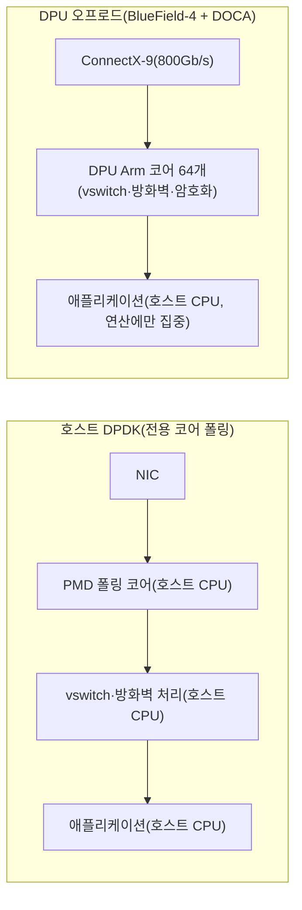

**네트워크 DPDK 심화**란 단일 코어에서 동작하는 PMD(Poll Mode Driver) 폴링 루프를 다중 코어·다중 큐로 확장하고, 플로우 매칭·RSS 같은 반복 작업을 NIC 하드웨어로 오프로드하며, 나아가 NIC 자체를 별도의 연산 도메인으로 승격시킨 SmartNIC·DPU(Data Processing Unit)에 네트워킹·보안·가상 스위칭 부하를 통째로 넘기는 영역을 말합니다. 초당 수백만 패킷을 처리하는 호스트 코어가 늘어날수록 코어 자체의 비용(폴링에 점유되는 CPU, NUMA 정렬, 캐시 경합)이 새로운 병목이 되고, 이 병목을 코드 최적화가 아니라 "어느 하드웨어가 이 작업을 맡을 것인가"라는 아키텍처 결정으로 풀어야 하는 지점에서 이 장이 시작됩니다. 2020년 NVIDIA의 Mellanox 인수 이후 BlueField 계열 DPU가 확산되었고, 2026년 초 발표된 BlueField-4는 그 흐름의 최신 지점을 보여주므로, 이 장에서는 DPDK를 호스트에서 밀어붙이는 한계와 DPU로 옮기는 선택지를 함께 다룹니다.

## 이 장을 읽기 전에

**선행 챕터**: [Tr.07 챕터 07: 커널 바이패스 개요](/post/os-optimization/kernel-bypass-overview/)에서 DPDK가 UIO/VFIO로 NIC 드라이버를 유저 공간으로 옮기고 PMD가 인터럽트 대신 폴링으로 패킷을 가져오는 기본 구조, 그리고 huge page가 왜 필수인지를 다뤘습니다. 이 트랙 안에서는 바로 앞 장인 [메시지 프레이밍](/post/network-optimization/message-framing-length-prefix-delimiter-fixed-size/)에서 애플리케이션이 바이트 스트림을 메시지 단위로 나누는 방법을 다뤘는데, 이 장에서 다루는 하드웨어 오프로드는 그 메시지가 애플리케이션에 도달하기 **이전** 단계, 즉 패킷이 NIC에서 코어로 올라오는 경로 자체를 재구성하는 층입니다.

**전제 지식**: PMD가 폴링으로 패킷을 가져온다는 개념, hugepage와 UIO/VFIO의 역할, CPU 코어를 특정 작업에 격리해 배치하는 pinning 개념에 대한 감이 있으면 충분합니다. RDMA의 큐 페어·ibverbs API는 전제하지 않습니다.

**이 장의 깊이**: **전문**입니다. 단일 코어 PMD 루프를 넘어 다중 코어·다중 큐로 확장하는 방법, `rte_flow`로 플로우 매칭·RSS를 NIC 하드웨어에 위임하는 방법, 그리고 NIC 자체를 별도 연산 도메인으로 만든 SmartNIC/DPU(NVIDIA BlueField-4, DOCA 프레임워크)로 오프로드 대상을 넓히는 아키텍처 판단까지 다룹니다. **다루지 않는 것**: DPDK PMD·EAL·hugepage의 기본 개념(→ Tr.07 챕터 07), RDMA 큐 페어·ibverbs 프로그래밍(→ 이 트랙 챕터 12), XDP·eBPF 프로그램 작성과 검증기(→ 이 트랙 챕터 11, 다음 장)입니다.

## 당신의 수준에 맞는 경로

| 수준 | 읽을 부분 | 핵심 목표 |
|------|---------|---------|
| **중급자** (Tr.07 챕터 07 선행 필요) | "DPDK의 진화" ~ "멀티코어·멀티큐로 확장하기" | 단일 코어 PMD 루프의 한계와 확장 방향 이해 |
| **심화** | "rte_flow: 플로우 매칭을 하드웨어로 넘기기" ~ "SmartNIC·DPU: NIC를 연산 도메인으로" | 오프로드가 CPU 개입을 줄이는 지점과 DPU 아키텍처 이해 |
| **전문가** | "판단 기준" ~ "비판적 시각" | DPDK 호스트 확장 vs DPU 오프로드 선택과 트레이드오프 판단 |

---

## DPDK의 진화: 유저스페이스 드라이버에서 데이터센터 인프라 표준으로 (역사·배경)

DPDK는 2010년 Intel이 공개한 이후 2013년 dpdk.org 커뮤니티(6WIND 주도)로 이관되었고, 2017년 4월 Linux Foundation 산하 프로젝트로 다시 이관되면서 ARM·AT&T·Cavium·Mellanox·NXP·Red Hat·ZTE 등이 골드 멤버로 참여하는 다중 벤더 표준으로 자리잡았습니다([Linux Foundation 공식 발표](https://www.linuxfoundation.org/press/press-release/networking-industry-leaders-join-forces-to-expand-new-open-source-community-to-drive-development-of-the-dpdk-project)). 이 시기 DPDK는 이미 Open vSwitch, FD.io, OPNFV 같은 NFV(Network Function Virtualization) 인프라의 표준 데이터 플레인으로 자리잡았고, 통신사업자들이 라우터·방화벽 같은 네트워크 기능을 범용 서버에서 소프트웨어로 구현하는 흐름을 뒷받침했습니다. 한편 "NIC 자체에 연산 능력을 얹어 호스트 CPU 부담을 줄인다"는 아이디어는 별도의 계보를 탔습니다 — AWS는 2017~2018년 Nitro 시스템으로 가상화·네트워킹·스토리지 처리를 전용 카드로 오프로드하는 모델을 상용화했고, 2019년 무렵 스타트업 Fungible이 이런 전용 카드에 **DPU(Data Processing Unit)**라는 이름을 붙이며 이 용어가 업계에 퍼지기 시작했습니다(정확한 최초 사용 시점은 출처마다 다르게 인용됩니다). 2020년 4월 NVIDIA가 Mellanox 인수를 완료하면서 ConnectX 스마트NIC 라인업과 BlueField DPU 라인업을 함께 확보했고([NVIDIA DOCA 개발자 페이지](https://developer.nvidia.com/networking/doca)), 이후 AMD의 Pensando 인수(2022년)까지 이어지며 "NIC에 범용 코어를 얹어 인프라 처리를 떠넘긴다"는 모델이 주요 벤더 전반의 제품 라인으로 굳어졌습니다. DPDK 심화와 DPU 오프로드는 이렇게 서로 다른 시기에 시작된 두 흐름이지만, 2026년 시점에는 DOCA 같은 프레임워크 안에서 DPDK가 DPU 위에서도 그대로 돌아가는 형태로 합류하고 있습니다.

## 멀티코어·멀티큐로 확장하기

Tr.07 챕터 07에서 다룬 PMD 루프는 코어 하나가 큐 하나를 전담해 폴링하는 그림이었습니다. 실제 프로덕션 DPDK 애플리케이션은 NIC가 지원하는 다중 수신 큐(RX queue)에 **RSS(Receive Side Scaling)**로 플로우를 분산시키고, 큐마다 별도의 lcore(논리 코어)를 배정해 병렬로 폴링합니다. 이때 성능을 좌우하는 요소는 코드 로직이 아니라 배치입니다 — 각 lcore가 담당하는 큐의 메모리 풀(mempool)이 그 lcore와 같은 NUMA 노드에 있어야 패킷 버퍼 접근이 로컬 메모리 대역폭 안에서 끝나고, 그렇지 않으면 QPI/UPI 같은 소켓 간 인터커넥트를 매 패킷마다 타게 됩니다. `rte_eal_remote_launch`로 각 lcore에 폴링 함수를 배정할 때, 함수 안에서 사용하는 `rte_mempool`을 `rte_eth_dev_socket_id`로 얻은 소켓 ID에 맞춰 `rte_pktmbuf_pool_create`로 생성하는 것이 이 정렬의 핵심입니다. 아래는 큐-코어-메모리 풀을 NUMA 노드에 맞춰 초기화하는 구조를 보여주는 골격 코드입니다 — 실제로 컴파일하려면 DPDK 빌드 환경(`meson`/`ninja`로 빌드된 DPDK SDK, `pkg-config libdpdk`)이 필요합니다.

```c
#include <rte_eal.h>
#include <rte_ethdev.h>
#include <rte_mempool.h>
#include <rte_lcore.h>

// NUMA 노드별로 별도 mempool을 만들고, 그 노드에 속한 lcore만 해당 mempool을 쓰게 한다.
// 소켓 경계를 넘는 mempool 접근은 매 패킷마다 원격 메모리 접근 비용을 더한다.
static struct rte_mempool* setup_mempool_for_port(uint16_t port_id, unsigned n_mbufs) {
  int socket_id = rte_eth_dev_socket_id(port_id);  // 이 포트가 물리적으로 붙은 NUMA 노드
  char name[RTE_MEMPOOL_NAMESIZE];
  snprintf(name, sizeof(name), "mbuf_pool_socket_%d", socket_id);

  return rte_pktmbuf_pool_create(name, n_mbufs, /*cache_size=*/256,
                                  /*priv_size=*/0, RTE_MBUF_DEFAULT_BUF_SIZE,
                                  socket_id);
}

// lcore별 폴링 워커: rte_eal_remote_launch(poll_worker, &args, lcore_id)로 배정된다.
static int poll_worker(void* arg) {
  uint16_t port_id = *(uint16_t*)arg;
  uint16_t queue_id = (uint16_t)rte_lcore_id();  // 단순화된 매핑 예시
  struct rte_mbuf* bufs[32];

  for (;;) {
    uint16_t n = rte_eth_rx_burst(port_id, queue_id, bufs, 32);
    for (uint16_t i = 0; i < n; ++i) {
      // 처리 로직(생략): 이 lcore의 mempool과 같은 NUMA 노드에서만 버퍼를 다룬다.
      rte_pktmbuf_free(bufs[i]);
    }
  }
}
```

이 골격이 보여주지 않는 부분(RSS 해시 키·리다이렉션 테이블 설정, lcore와 물리 코어의 pinning, hugepage 노드별 예약)이 실제 멀티코어 DPDK 튜닝 작업 대부분을 차지합니다. `dpdk-devbind.py --status`나 `lscpu`로 NIC와 코어가 같은 NUMA 노드에 있는지 먼저 확인한 뒤 코드를 배치하는 순서가 안전합니다.

```text
$ dpdk-devbind.py --status
Network devices using DPDK-compatible driver
============================================
0000:3b:00.0 'ConnectX-6 Dx' drv=vfio-pci unused=mlx5_core numa_node=0
0000:5e:00.0 'ConnectX-6 Dx' drv=vfio-pci unused=mlx5_core numa_node=1

Network devices using kernel driver
===================================
0000:af:00.0 'I350 Gigabit' if=eth0 drv=igb unused=vfio-pci *Active*
```

위 출력에서 `numa_node=0`과 `numa_node=1`은 각 NIC가 붙은 소켓을 보여줍니다 — `numa_node=0` NIC를 다루는 lcore와 mempool은 반드시 소켓 0에 배정해야 하며, 이 값을 확인하지 않고 코어를 배정하면 코드는 정상 동작하되 지연시간만 원인 불명으로 늘어나는 흔한 실패 패턴이 됩니다.

## rte_flow: 플로우 매칭을 하드웨어로 넘기기

멀티코어로 확장해도 패킷마다 "어느 큐로 보낼지", "이 플로우는 드롭할지" 같은 판단을 소프트웨어에서 반복하면 코어 자원을 계속 소모합니다. **`rte_flow`**는 이 판단 자체를 NIC 하드웨어의 플로우 테이블에 규칙으로 심어, 매칭된 패킷은 아예 애플리케이션 코드를 거치지 않고 지정된 큐로 가거나 드롭되도록 만드는 Generic Flow API입니다. 규칙은 속성(`rte_flow_attr`, ingress/egress·우선순위), 매칭 패턴(`rte_flow_item`의 나열, 예: 이더넷 → IPv4 → TCP), 동작(`rte_flow_action`의 나열, 예: 큐로 보내기·RSS 재분배·드롭)의 세 부분으로 구성됩니다([DPDK Generic flow API 문서](https://doc.dpdk.org/guides-24.07/prog_guide/rte_flow.html)). 아래는 목적지 TCP 포트가 특정 값인 패킷만 전용 큐로 리다이렉트하는 규칙을 만드는 골격입니다 — 이 코드가 성공적으로 오프로드되면, 이후 이 조건에 맞는 패킷은 애플리케이션의 폴링 루프가 아니라 NIC 펌웨어 내부에서 분류되어 큐 배치가 끝납니다.

```c
#include <rte_flow.h>
#include <rte_ethdev.h>

// 목적지 TCP 포트가 dst_port인 패킷을 전용 큐(target_queue)로 보내는 rte_flow 규칙.
// 실제로는 rte_flow_validate로 하드웨어 지원 여부를 먼저 확인해야 한다(생략).
static struct rte_flow* install_port_redirect_rule(uint16_t port_id, uint16_t dst_port,
                                                     uint16_t target_queue) {
  struct rte_flow_attr attr = { .ingress = 1 };

  struct rte_flow_item_eth eth_spec = {0};
  struct rte_flow_item_ipv4 ipv4_spec = {0};
  struct rte_flow_item_tcp tcp_spec = {0}, tcp_mask = {0};
  tcp_spec.hdr.dst_port = rte_cpu_to_be_16(dst_port);
  tcp_mask.hdr.dst_port = RTE_BE16(0xffff);  // 목적지 포트만 정확히 매칭

  struct rte_flow_item pattern[] = {
    { .type = RTE_FLOW_ITEM_TYPE_ETH,  .spec = &eth_spec },
    { .type = RTE_FLOW_ITEM_TYPE_IPV4, .spec = &ipv4_spec },
    { .type = RTE_FLOW_ITEM_TYPE_TCP,  .spec = &tcp_spec, .mask = &tcp_mask },
    { .type = RTE_FLOW_ITEM_TYPE_END },
  };

  struct rte_flow_action_queue queue_action = { .index = target_queue };
  struct rte_flow_action action[] = {
    { .type = RTE_FLOW_ACTION_TYPE_QUEUE, .conf = &queue_action },
    { .type = RTE_FLOW_ACTION_TYPE_END },
  };

  struct rte_flow_error error;
  return rte_flow_create(port_id, &attr, pattern, action, &error);
}
```

이 규칙이 하드웨어에 실제로 오프로드되는지, 혹은 NIC가 지원하지 않아 소프트웨어로 폴백되는지는 NIC 펌웨어·드라이버 조합에 따라 달라지므로 `rte_flow_validate`의 반환값과 벤더 문서의 지원 매트릭스를 반드시 함께 확인해야 합니다. 일부 NIC는 매칭 필드 조합이나 동시에 유지 가능한 규칙 개수에 하드웨어 제약이 있어, 규칙이 많아지면 우선순위가 낮은 규칙부터 조용히 소프트웨어 경로로 밀려날 수 있습니다.

## SmartNIC·DPU: NIC를 연산 도메인으로

`rte_flow`가 "패킷 분류"라는 좁은 작업을 NIC 하드웨어 로직에 위임하는 것이라면, **SmartNIC**과 **DPU**는 여기서 한 단계 더 나아가 NIC 카드 자체에 범용 CPU 코어와 독립된 운영체제를 얹어, 가상 스위칭(OVS 오프로드)·암호화·스토리지 프로토콜 처리 같은 무거운 작업 전체를 호스트 CPU 밖으로 들어냅니다. NVIDIA는 2026년 초 **BlueField-4** DPU를 발표했는데, 64개 Arm Neoverse V2 코어와 128GB LPDDR5 메모리, ConnectX-9 기반 800Gb/s 네트워킹, PCIe Gen6 호스트 인터페이스를 갖추고 Vera Rubin 플랫폼의 일환으로 초기 출시될 예정입니다([NVIDIA 공식 발표](https://blogs.nvidia.com/blog/bluefield-4-ai-factory/), [ServeTheHome 하드웨어 분석](https://www.servethehome.com/nvidia-bluefield-4-with-64-arm-cores-and-800g-networking-announced-for-2026/)). 이 규모의 Arm 코어는 사실상 하나의 독립된 서버이며, DPU는 그 위에서 인프라 서비스 도메인(가상 스위치·방화벽·스토리지 가상화)을 워크로드 도메인(호스트에서 도는 애플리케이션)과 분리해 실행합니다 — 호스트 CPU는 더 이상 vswitch 규칙 매칭이나 IPsec 암·복호화 같은 반복 작업에 사이클을 쓰지 않고 순수 애플리케이션 로직에만 집중할 수 있습니다. **NVIDIA DOCA**는 이 DPU를 프로그래밍하는 SDK로, DPDK와 스토리지 가속용 SPDK를 하위 구성요소로 포함하면서 RDMA 가속·보안 가속을 위한 상위 라이브러리를 얹은 프레임워크입니다([NVIDIA DOCA 개발자 페이지](https://developer.nvidia.com/networking/doca)) — 즉 DOCA 환경에서 DPDK는 사라지는 것이 아니라, 실행 위치가 호스트 코어에서 DPU의 Arm 코어로 옮겨가는 형태로 계속 쓰입니다.



두 경로의 차이는 처리량이 아니라 **어느 코어가 반복 작업의 비용을 부담하는가**입니다. 호스트 DPDK 경로는 vswitch·암호화 로직까지 호스트 코어에서 실행하므로 애플리케이션과 인프라 작업이 같은 코어 예산을 나눠 쓰지만, DPU 오프로드 경로는 그 작업을 물리적으로 분리된 코어로 옮겨 호스트 코어를 애플리케이션 전용으로 비워 둡니다. 다만 이 분리는 공짜가 아닙니다 — 호스트와 DPU 사이의 PCIe 왕복, DPU 내부 처리 지연이 새로운 비용으로 추가되므로, 오프로드가 항상 순이익인 것은 아닙니다.

## 흔한 오개념

- **"DPDK 코드만 다중 코어로 늘리면 처리량이 선형으로 늘어난다"**: 아닙니다. RSS 해시·리다이렉션 테이블이 큐 사이에 플로우를 고르게 분산하지 못하면 특정 코어만 과부하되고 나머지는 유휴 상태가 됩니다. 코어와 mempool이 NUMA 노드에 정렬되지 않으면 소켓 간 인터커넥트 트래픽이 늘어 오히려 코어를 더 추가할수록 대역폭 경합이 커질 수 있습니다.
- **"SmartNIC·DPU에 오프로드하면 언제나 이득이다"**: 아닙니다. 오프로드에는 호스트-DPU 간 PCIe 왕복과 DPU 내부 처리라는 새 지연 구간이 추가됩니다. 오프로드가 유리한 것은 vswitch 규칙 매칭·IPsec 암복호화·스토리지 프로토콜 처리처럼 반복적이고 규칙 기반이라 호스트 코어에서 실행할 때 누적 비용이 큰 작업이며, 트래픽이 적거나 패킷마다 처리 로직이 크게 달라지는 워크로드에서는 오프로드 이득이 왕복 비용을 상쇄하지 못할 수 있습니다.
- **"SmartNIC과 DPDK는 경쟁 관계다"**: 아닙니다. DPU는 NIC에 독립된 컴퓨팅 도메인을 얹은 하드웨어이고, DPDK는 그 위에서(또는 호스트에서) 패킷을 다루는 소프트웨어 프레임워크입니다. NVIDIA DOCA처럼 DPU용 SDK 상당수가 DPDK·SPDK를 내부 구성요소로 그대로 포함합니다.

## 판단 기준: DPDK 호스트 확장 vs DPU 오프로드

| 상황 | 권장 | 비권장 |
|------|------|--------|
| 초당 수천만 패킷, 호스트 코어 여유 확보 가능 | 멀티코어 DPDK(NUMA 정렬 lcore·mempool) | 코어 배치 없이 단일 코어 폴링 유지 |
| 반복적인 플로우 분류·드롭·큐 리다이렉션 | `rte_flow` 하드웨어 오프로드 | 매 패킷을 소프트웨어에서 파싱·판단 |
| vswitch·방화벽·암호화가 호스트 CPU를 상당히 잠식 | SmartNIC/DPU 오프로드(DOCA 등) | 호스트 DPDK 코어를 계속 늘려 흡수 |
| 멀티테넌트 인프라·워크로드 도메인 격리 필요 | DPU(별도 Arm 도메인에서 인프라 서비스 실행) | 호스트 커널·애플리케이션과 같은 권한으로 인프라 로직 실행 |
| 소규모 트래픽·저비용·벤더 종속 회피 우선 | 호스트 DPDK + `rte_flow`만으로 충분히 검토 | 트래픽 규모 대비 과도한 DPU 도입 |
| 오프로드 대상 로직이 패킷마다 크게 달라짐 | 호스트 소프트웨어 처리 유지 | 일반화하기 어려운 로직을 무리하게 하드웨어 규칙으로 표현 |

## 비판적 시각: 한계와 트레이드오프

DPU 오프로드는 호스트 CPU 예산 문제를 해결하는 대신 새로운 위험을 들여옵니다. DPU는 자체 리눅스 운영체제와 원격 관리 인터페이스를 갖춘 독립된 컴퓨팅 도메인이므로, 이 도메인 자체가 별도의 공격 표면이 됩니다 — DPU 펌웨어나 관리 채널이 침해되면 그 DPU가 담당하는 모든 호스트의 네트워크 경로를 장악당할 위험이 있고, 이는 단일 서버의 애플리케이션 취약점보다 파급 범위가 넓습니다. 벤더 종속도 실질적인 비용입니다 — DOCA는 NVIDIA BlueField 생태계 전용이고, AMD Pensando·Intel IPU는 각각 다른 SDK와 프로그래밍 모델을 쓰므로 한 벤더용으로 짠 오프로드 로직이 다른 벤더로 이식되지 않습니다. BlueField-4급 DPU는 카드 자체의 도입 비용이 높고, ROI는 오프로드 대상 작업(vswitch·암호화·스토리지)이 전체 워크로드에서 차지하는 비중과 트래픽 규모에 크게 좌우되므로, 소규모 환경에서는 멀티코어 DPDK와 `rte_flow`만으로 충분한 경우가 많습니다. `rte_flow` 자체도 NIC 펌웨어·드라이버 조합마다 지원하는 매칭 필드와 동시 규칙 개수가 달라, 오프로드가 부분적으로만 성공하고 나머지가 소프트웨어로 폴백되면 규칙별 지연 편차가 커져 예측 가능한 지연 예산을 세우기 어려워질 수 있습니다. 폴링 코어가 상시 CPU를 점유하는 문제([Tr.07 챕터 07](/post/os-optimization/kernel-bypass-overview/)에서 다룬 트레이드오프)도 DPU의 Arm 코어에서 동일하게 재현되므로, "코어를 옮겼다"는 것이 "코어 비용이 사라졌다"를 뜻하지 않는다는 점을 판단 기준에 넣어야 합니다.

## 마무리

- [ ] 멀티코어 DPDK 확장에서 lcore·mempool·NUMA 노드를 정렬해야 하는 이유를 설명할 수 있다.
- [ ] `rte_flow`가 플로우 매칭·큐 리다이렉션을 NIC 하드웨어로 위임하는 방식과 그 한계(펌웨어 의존성, 부분 오프로드)를 설명할 수 있다.
- [ ] SmartNIC/DPU(BlueField-4·DOCA)가 NIC를 독립된 연산 도메인으로 만들어 인프라 작업을 호스트에서 분리하는 원리를 설명할 수 있다.
- [ ] 멀티코어 DPDK·`rte_flow` 오프로드·DPU 오프로드 중 상황에 맞는 선택을 판단 기준으로 고를 수 있다.
- [ ] DPU 도입의 공격 표면 확대·벤더 종속·비용 대비 이득이라는 트레이드오프를 비판적으로 평가할 수 있다.

**이전 장**: [메시지 프레이밍](/post/network-optimization/message-framing-length-prefix-delimiter-fixed-size/) (챕터 09)

**다음 장**에서는 **네트워크 XDP/eBPF 심화**를 다룹니다. Tr.07 챕터 09에서 다룬 XDP/eBPF 개요를 이어받아, 이 장에서 다룬 완전 오프로드(DPDK·DPU)와는 다른 지점 — 커널 안에 남아 프로그래밍 가능한 훅을 두는 부분 오프로드 방식 — 을 심화합니다.

→ [네트워크 XDP/eBPF 심화](/post/network-optimization/xdp-ebpf-network-packet-processing-advanced/) (챕터 11)
