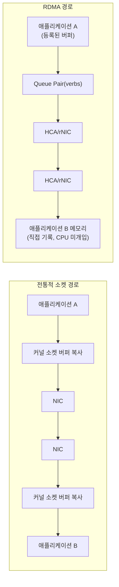

**RDMA(Remote Direct Memory Access)**란 원격 노드의 메모리를 상대방 CPU 개입 없이 직접 읽고 쓰는 통신 방식을 말합니다. 일반 소켓 통신은 송신 측 애플리케이션 버퍼 → 커널 소켓 버퍼 → NIC, 수신 측 NIC → 커널 소켓 버퍼 → 애플리케이션 버퍼로 이어지는 두 번의 복사와 두 번의 커널 진입을 거치지만, RDMA는 전송 프로토콜(패킷 분할·재조립·재전송·흐름제어)을 NIC 하드웨어에 위임하고 등록된 사용자 메모리에 직접 DMA(Direct Memory Access)로 데이터를 옮깁니다. 그 결과로 CPU 사이클 소비와 왕복 지연이 동시에 줄어들며, 이 특성 때문에 분산 스토리지 복제, 인메모리 DB 클러스터링, 그리고 GPU 수천 장이 텐서를 주고받는 대규모 AI 학습 클러스터의 상호연결에서 RDMA·InfiniBand가 사실상 표준으로 자리 잡았습니다. 이 장은 그 원리와 프로덕션 도입 판단 기준을 다룹니다.

## 이 장을 읽기 전에

**전제 지식**: 이 장은 [02장: 소켓 옵션 튜닝](/post/network-optimization/socket-options-tcp-nodelay-buffer-tuning/)에서 다룬 "커널 소켓 버퍼와 시스템 콜 비용" 개념과, [09장: 메시지 프레이밍](/post/network-optimization/message-framing-length-prefix-delimiter-fixed-size/)의 "애플리케이션 레벨 메시지 경계" 개념을 전제로 합니다. 커널 우회(kernel bypass)라는 용어를 처음 접했다면 [Tr.07: 커널 바이패스 개요](/post/os-optimization/kernel-bypass-overview/)를 먼저 읽는 편이 좋습니다.

**이 장의 깊이**: RDMA/InfiniBand의 전송 원리, verbs API가 노출하는 리소스 모델(Queue Pair·메모리 등록·Completion Queue), InfiniBand·RoCEv2·iWARP의 구조적 차이, 그리고 프로덕션 도입 판단 기준까지를 **심화** 수준으로 다룹니다. **다루지 않는 것**: DPDK를 이용한 소프트웨어 패킷 처리 심화([10장](/post/network-optimization/dpdk-advanced-deep-dive-smartnic-dpu/))와 XDP/eBPF 패킷 처리 심화([11장](/post/network-optimization/xdp-ebpf-network-packet-processing-advanced/))는 이 장과 별개의 커널 우회 계열이므로 각 장으로 위임합니다. PFC 없는 차세대 이더넷 표준의 세부는 다음 장인 [Ultra Ethernet Consortium](/post/network-optimization/ultra-ethernet-consortium-uec-next-gen-ethernet/)에서 다룹니다. verbs API의 모든 함수 시그니처를 나열하는 레퍼런스 문서화도 이 장의 목적이 아닙니다.

## 당신의 수준에 맞는 경로

| 수준 | 읽을 부분 | 핵심 목표 |
|------|---------|---------|
| **초보자** | "RDMA와 InfiniBand의 등장" ~ "RDMA의 핵심 동작 원리" | RDMA가 복사·커널 진입을 어떻게 줄이는지 큰 그림을 이해 |
| **중급자** | "Queue Pair·메모리 등록·Completion Queue" ~ "InfiniBand, RoCEv2, iWARP 비교" | verbs API 리소스 모델과 전송 방식별 구조 차이 이해 |
| **전문가** | "판단 기준" ~ "비판적 시각" | 프로덕션 도입 여부와 배포 복잡성·트레이드오프 판단 |

---

## RDMA와 InfiniBand의 등장 (역사와 배경)

InfiniBand는 1999년 8월 결성된 **IBTA(InfiniBand Trade Association)**가 표준화한 상호연결 아키텍처로, 당시 경쟁하던 Intel 주도의 NGIO(Next Generation I/O)와 Compaq·IBM·HP 진영의 Future I/O가 합쳐지며 만들어졌습니다. IBTA는 "Established in August 1999 by industry leaders, the IBTA created a clear and accessible interconnect architecture standard"라고 자신들의 설립 배경을 설명합니다 — IBTA, "Celebrating 25 Years of the InfiniBand Trade Association" ([infinibandta.org](https://www.infinibandta.org/celebrating-25-years-of-the-infiniband-trade-association/)). 초기 InfiniBand는 슈퍼컴퓨팅 상호연결 시장에서 자리를 잡았고, 2003년 11월에는 버지니아 공대의 SDR 10Gb/s 시스템이 세계 3위 슈퍼컴퓨터로 기록되며 성능을 입증했습니다. 이후 이더넷 진영도 RDMA의 이점을 흡수하려 했고, IBTA는 2010년 **RoCE(RDMA over Converged Ethernet)** 규격을 발표해 InfiniBand의 전송 계층 대신 이더넷 프레임 위에 RDMA 의미론을 얹었습니다. 초기 RoCE(현재는 RoCEv1으로 구분)는 MAC 주소 기반이라 라우팅이 불가능했고, 2014년경 IP/UDP 캡슐화를 도입한 **RoCEv2**가 자리 잡으면서 대규모 데이터센터 배포가 본격화되었습니다. 비슷한 시기 iWARP은 기존 TCP/IP 스택 위에 RDMA 의미론을 구현해 별도의 무손실 패브릭 없이도 동작하도록 설계되었지만, 시장 점유율은 InfiniBand·RoCEv2에 비해 낮은 채로 남아 있습니다.

2020년대 들어 InfiniBand의 세대는 HDR(200Gb/s급)를 지나 **NDR(400Gb/s급, 포트당 4레인 100G PAM4)**로 넘어갔고, 2026년 현재 NDR은 이미 성숙해 대다수 신규 AI 클러스터의 기본 사양으로 쓰이며, 다음 세대인 **XDR(800Gb/s급)** 전환이 진행 중입니다(수치는 벤더·세대·배포 시점에 따라 달라지는 로드맵 값으로 이해해야 합니다). 이 흐름을 이끈 것은 GPU 학습 클러스터입니다. NVIDIA의 **GPUDirect RDMA**는 "a direct path for data exchange between the GPU and a third-party peer device using standard features of PCI Express"를 제공한다고 설명합니다 — NVIDIA, "GPUDirect RDMA" 문서 ([docs.nvidia.com](https://docs.nvidia.com/cuda/gpudirect-rdma/)). 즉 NIC가 호스트 DRAM을 거치지 않고 GPU의 PCIe BAR(Base Address Register) 주소에 직접 DMA로 접근하도록 해, 수천 GPU 규모의 all-reduce에서 텐서가 호스트 메모리를 한 번도 거치지 않게 만듭니다.

## RDMA의 핵심 동작 원리

전통적인 소켓 경로에서는 송신 측에서 애플리케이션 버퍼의 데이터를 커널 소켓 버퍼로 복사하고(`send()` 시스템 콜), 커널이 프로토콜 스택(TCP/IP)을 처리해 NIC로 넘기며, 수신 측에서는 역순으로 NIC → 커널 버퍼 → 애플리케이션 버퍼 복사가 한 번 더 일어납니다. RDMA는 이 경로에서 세 가지를 바꿉니다. 첫째, **메모리 등록(memory registration)**을 통해 애플리케이션 버퍼를 물리 메모리에 고정(pin)하고 NIC가 알 수 있는 키(lkey/rkey)를 부여해, NIC가 커널을 거치지 않고 해당 버퍼를 직접 DMA로 읽고 쓸 수 있게 합니다. 둘째, 패킷 분할·재조립·순서 보장·재전송 같은 전송 프로토콜 처리를 NIC 하드웨어(HCA, Host Channel Adapter 또는 rNIC)에 위임해 CPU가 프로토콜 스택을 처리할 필요를 없앱니다. 셋째, 제어 경로(리소스 생성·삭제)는 커널을 거치되, 데이터 경로(전송 요청 게시·완료 확인)는 사용자공간에서 mmap된 하드웨어 레지스터에 직접 접근해 처리합니다. 리눅스 커널 문서는 이 구조를 "fast path operations are typically performed by writing directly to hardware registers mmap()ed into userspace, with no system call or context switch into the kernel"이라고 설명합니다 — Linux Kernel Documentation, "Userspace verbs access" ([docs.kernel.org](https://docs.kernel.org/infiniband/user_verbs.html)). 이 세 가지가 합쳐져 "커널 우회(kernel bypass) + zero-copy"라는 RDMA의 성능 특성이 만들어집니다.



### Queue Pair·메모리 등록·Completion Queue

RDMA 애플리케이션이 `libibverbs`(rdma-core 프로젝트가 배포하는 verbs API 사용자공간 라이브러리)를 통해 다루는 핵심 리소스는 네 가지입니다. **Protection Domain(PD)**은 메모리 영역과 Queue Pair를 묶어 어떤 리소스끼리 서로 접근 가능한지 경계를 정하는 논리적 컨테이너입니다. **메모리 영역(Memory Region, MR)**은 `ibv_reg_mr()`로 등록한 버퍼로, 이때 물리 페이지가 고정(pin)되고 로컬/원격 접근 권한을 나타내는 lkey·rkey가 발급됩니다. **Queue Pair(QP)**는 송신 큐(Send Queue)와 수신 큐(Receive Queue)의 쌍으로, 연결을 표현하는 기본 단위이며 RC(Reliable Connection)·UC(Unreliable Connection)·UD(Unreliable Datagram) 같은 전송 모드를 가집니다. **Completion Queue(CQ)**는 게시한 작업 요청(Work Request)의 완료를 알려주는 큐로, 애플리케이션은 폴링(polling) 또는 이벤트 기반으로 완료를 확인합니다. github의 rdma-core 문서는 libibverbs의 역할을 "libibverbs is a library that allows programs to use RDMA 'verbs' for direct access to RDMA (currently InfiniBand and iWARP) hardware from userspace"라고 요약합니다 — linux-rdma, "libibverbs.md" ([github.com/linux-rdma/rdma-core](https://github.com/linux-rdma/rdma-core/blob/master/Documentation/libibverbs.md)). QP는 생성 직후 곧바로 쓸 수 없고, INIT → RTR(Ready To Receive) → RTS(Ready To Send) 상태 전이를 거쳐야 하며 이 과정에서 상대 QP 번호·rkey 같은 정보를 별도 채널(보통 TCP 소켓)로 교환해야 합니다 — 이 상태 전이 자체는 CPU가 처리하는 제어 경로입니다.

### One-sided 연산과 Two-sided 연산

verbs API가 노출하는 작업은 크게 두 갈래로 나뉩니다. **Two-sided 연산**(`IBV_WR_SEND`/수신 측의 `ibv_post_recv`)은 소켓의 `send`/`recv`와 비슷하게 양쪽이 모두 작업을 게시해야 하며, 수신 측 애플리케이션이 완료를 인지합니다. **One-sided 연산**(`IBV_WR_RDMA_WRITE`, `IBV_WR_RDMA_READ`)은 원격 애플리케이션의 CPU 개입 없이 상대 메모리를 직접 읽거나 씁니다 — 원격 측은 자신의 메모리가 갱신되었는지 알기 위해 별도의 완료 신호(마지막에 작은 SEND를 덧붙이거나, 폴링으로 특정 플래그 바이트 변화를 감지)를 스스로 마련해야 합니다. 아래는 RDMA WRITE 한 번을 게시하는 최소 골격입니다. 실제 QP 상태 전이와 원격 정보 교환(OOB 채널)은 지면상 생략했으므로, 이 코드는 헤더가 설치된 리눅스에서 컴파일은 되지만 실행을 위해서는 나머지 연결 수립 로직과 RDMA 지원 NIC가 필요합니다.

```c
#include <infiniband/verbs.h>
#include <stdint.h>
#include <stddef.h>

// 컴파일: gcc -c rdma_write.c -libverbs (rdma-core 개발 패키지 필요)
// 실행에는 RDMA 지원 HCA와, 상대 QP 번호·rkey를 교환할 별도 OOB 채널(생략)이 필요하다.
int rdma_write_once(struct ibv_context *ctx, void *local_buf, size_t len,
                     uint64_t remote_addr, uint32_t remote_rkey) {
  struct ibv_pd *pd = ibv_alloc_pd(ctx);
  struct ibv_mr *mr = ibv_reg_mr(pd, local_buf, len,
                                  IBV_ACCESS_LOCAL_WRITE | IBV_ACCESS_REMOTE_WRITE);
  struct ibv_cq *cq = ibv_create_cq(ctx, 16, NULL, NULL, 0);

  struct ibv_qp_init_attr qp_attr = {0};
  qp_attr.send_cq = cq;
  qp_attr.recv_cq = cq;
  qp_attr.qp_type = IBV_QPT_RC;              // Reliable Connection
  qp_attr.cap.max_send_wr = 16;
  qp_attr.cap.max_recv_wr = 16;
  qp_attr.cap.max_send_sge = 1;
  qp_attr.cap.max_recv_sge = 1;
  struct ibv_qp *qp = ibv_create_qp(pd, &qp_attr);
  // qp를 INIT -> RTR -> RTS로 전이시키는 ibv_modify_qp() 호출 3회는 생략.

  struct ibv_sge sge = { .addr = (uintptr_t)local_buf, .length = (uint32_t)len, .lkey = mr->lkey };
  struct ibv_send_wr wr = {0}, *bad_wr;
  wr.opcode = IBV_WR_RDMA_WRITE;              // one-sided: 원격 CPU 미개입
  wr.sg_list = &sge;
  wr.num_sge = 1;
  wr.wr.rdma.remote_addr = remote_addr;
  wr.wr.rdma.rkey = remote_rkey;
  wr.send_flags = IBV_SEND_SIGNALED;

  return ibv_post_send(qp, &wr, &bad_wr);      // 완료는 ibv_poll_cq(cq, ...)로 확인
}
```

이 골격에서 주목할 점은 데이터 전송 자체(`ibv_post_send` 호출과 하드웨어의 실제 전송)에는 시스템 콜이 없다는 것입니다. 반면 QP 생성·상태 전이·메모리 등록은 모두 커널을 거치는 제어 경로이므로, RDMA를 "CPU를 전혀 안 쓰는 통신"으로 오해하면 연결 수립·자원 관리 비용을 과소평가하게 됩니다.

## InfiniBand, RoCEv2, iWARP 비교

같은 verbs API 위에서 동작하지만 세 가지 전송 방식은 물리·네트워크 계층이 다르고, 이 차이가 배포 난이도와 손실 허용도를 결정합니다.

| 항목 | InfiniBand | RoCEv2 | iWARP |
|------|-----------|--------|-------|
| 물리/네트워크 계층 | 전용 InfiniBand 패브릭·스위치 | 표준 이더넷 + UDP/IP 캡슐화 | 표준 이더넷 + TCP/IP |
| 손실 허용 | 패브릭 자체가 무손실 설계 | PFC/ECN 기반 "거의 무손실" 튜닝 필요 | TCP 재전송으로 손실 허용(지연 증가) |
| 라우팅 | InfiniBand 서브넷 매니저 | IP 라우팅 가능 | IP 라우팅 가능 |
| 배포 난이도 | 전용 스위치·케이블 도입 필요 | 기존 이더넷 재사용 가능하나 PFC/DCQCN 튜닝 필요 | 상대적으로 낮음, 별도 무손실 설정 불필요 |
| 전형적 지연 특성 | 가장 낮은 편(전용 하드웨어) | InfiniBand보다 다소 높은 편, 튜닝 의존적 | 가장 높은 편(TCP 스택 경유) |

수치화된 지연·대역폭 우열은 NIC 세대, 스위치, MTU, 혼잡 상태에 따라 달라지므로 "구현·환경 정의"로 취급하고, 도입 전 실제 환경에서 `perftest` 계열 도구로 직접 측정하는 것을 권장합니다.

## 벤치마크: RDMA 지연·대역폭 측정

RDMA 지원 NIC를 갖춘 두 노드가 있다면, rdma-core가 배포하는 `perftest` 패키지의 `ib_write_bw`(대역폭)·`ib_write_lat`(지연)로 verbs 경로의 실측치를 얻을 수 있습니다. 아래는 실행 형태와 출력 형식의 예시이며, 실제 수치는 NIC 세대·MTU·스위치·혼잡 여부에 따라 달라지므로 절대값이 아니라 두 설정(예: RoCEv2 vs InfiniBand, MTU 1500 vs 4096)을 같은 조건에서 비교하는 용도로 사용합니다.

```text
# 수신 측(서버)
$ ib_write_bw -d mlx5_0 -x 3 --report_gbits

# 송신 측(클라이언트), 서버 IP로 접속
$ ib_write_bw -d mlx5_0 -x 3 --report_gbits <server_ip>

# 출력 예시 형식 (ConnectX-6, 100GbE RoCEv2, MTU 4096 가정 — 환경마다 수치는 크게 달라짐)
#bytes  #iterations  BW peak[Gb/sec]  BW average[Gb/sec]  MsgRate[Mpps]
65536   1000         97.20            97.15                0.185

# 지연 측정은 ib_write_lat으로 동일한 방식 실행
$ ib_write_lat -d mlx5_0 <server_ip>
```

`-x 3`은 RoCEv2 GID 인덱스를 지정하는 옵션으로, 라우팅 가능한 RoCEv2 GID(IP 기반)를 골라야 정상 동작합니다. InfiniBand 패브릭에서는 GID 지정 없이 동작합니다.

## 흔한 오개념 교정

**"RDMA는 CPU를 전혀 쓰지 않는다"는 절반만 맞습니다.** 데이터 전송의 실제 이동(DMA)은 CPU를 거치지 않지만, 메모리 등록(페이지 고정)과 QP 상태 전이 같은 제어 경로, 그리고 완료를 폴링으로 확인하는 방식을 쓰면 그 폴링 자체가 CPU 사이클을 소모합니다. 인터럽트 기반 완료 통지를 쓰면 CPU 소모는 줄지만 지연이 늘어나는 트레이드오프가 생깁니다.

**"RoCE는 기존 이더넷에 그냥 얹으면 된다"도 오개념입니다.** RDMA의 신뢰성 있는 전송(RC 모드)은 원래 손실이 거의 없는 InfiniBand 패브릭을 가정하고 설계되었기 때문에, 표준 이더넷에서 RoCEv2를 쓰려면 PFC(Priority Flow Control)와 ECN(Explicit Congestion Notification) 기반 혼잡 제어(예: DCQCN)로 사실상 무손실에 가까운 환경을 만들어야 합니다. 이 튜닝 없이 배포하면 패킷 드롭 시 재전송 비용이 커서 일반 TCP보다 나쁜 지연이 나올 수 있습니다.

**"RDMA = InfiniBand"도 정확하지 않습니다.** RDMA는 원격 메모리 접근이라는 프로그래밍 모델(verbs API)이고, 이를 실어 나르는 전송 계층은 InfiniBand·RoCEv2·iWARP 중 하나를 선택할 수 있습니다. 같은 애플리케이션 코드가 전송 계층만 바꿔 동작할 수 있지만, 손실 허용도와 배포 난이도는 전송 계층마다 크게 다릅니다.

## 판단 기준 (언제 쓰고 언제 피할지)

| 상황 | 권장 | 비권장 |
|------|------|--------|
| µs 단위 스토리지 복제·인메모리 DB 클러스터링 | RDMA(RoCEv2/InfiniBand) 검토 | 일반 TCP 소켓 유지 |
| GPU 다대다 all-reduce, 대규모 학습 클러스터 | InfiniBand + GPUDirect RDMA | PCIe 공유 없는 일반 이더넷 |
| 범용 마이크로서비스 간 통신, 배포 단순성 우선 | TCP 기반 gRPC([14장](/post/network-optimization/grpc-performance-tuning-optimization/)) | RDMA 도입(운영 부담 대비 이득 작음) |
| PFC/ECN 튜닝 여력이 없는 대규모 이더넷 패브릭 | RoCEv2 보류, [13장 UEC](/post/network-optimization/ultra-ethernet-consortium-uec-next-gen-ethernet/) 동향 검토 | PFC 없이 RoCE 강행 |
| RDMA 지원이 불확실한 클라우드 인스턴스 | 벤더 문서로 RDMA 지원 여부 사전 확인 | Soft-RoCE(rxe)를 프로덕션 성능 기대치로 사용 |

## 비판적 시각: 한계와 트레이드오프

RoCEv2가 의존하는 PFC는 링크 단위로 백프레셔를 거는 방식이라, 특정 우선순위 큐가 정체되면 그 큐를 공유하는 다른 흐름까지 멈추는 **head-of-line blocking**과 "PFC storm"(백프레셔가 상류로 전파되며 넓은 범위가 정지하는 현상)이 알려진 문제로 지적되어 왔습니다. 이 때문에 대규모 이더넷 데이터센터에서 RoCEv2를 안정적으로 운영하려면 전용 인력이 붙어 PFC/ECN 임계값과 버퍼 배분을 지속적으로 튜닝해야 하며, 이는 상당한 운영 부담입니다. 배포 복잡성도 만만치 않습니다 — InfiniBand는 전용 스위치·서브넷 매니저가 필요하고, RoCEv2는 기존 이더넷을 재사용할 수 있다는 것이 장점이지만 "재사용 가능"과 "튜닝 없이 잘 동작"은 다른 이야기입니다. 클라우드 환경에서는 하이퍼스케일러마다 RDMA 지원 인스턴스 유형과 대역폭이 크게 달라, 온프레미스 대비 이식성이 낮습니다. 커널 우회 구조 때문에 일반적인 `tcpdump` 같은 도구로는 RDMA 트래픽을 직접 들여다보기 어렵고, 문제 진단에는 NIC 벤더가 제공하는 전용 카운터·트레이싱 도구가 필요해 디버깅 난이도도 상대적으로 높습니다. 업계가 PFC 의존을 줄이려는 방향으로 움직이고 있다는 점은 다음 장에서 다룰 Ultra Ethernet Consortium의 등장 배경과도 맞닿아 있습니다.

## 마무리

- [ ] RDMA가 소켓 경로 대비 줄이는 두 가지(복사 횟수, 커널 진입 횟수)를 설명할 수 있다.
- [ ] Protection Domain, Memory Region, Queue Pair, Completion Queue의 역할을 구분할 수 있다.
- [ ] One-sided(RDMA WRITE/READ)와 Two-sided(SEND/RECV) 연산의 완료 통지 방식 차이를 설명할 수 있다.
- [ ] InfiniBand·RoCEv2·iWARP의 손실 허용도·배포 난이도 차이를 비교할 수 있다.
- [ ] "RDMA는 CPU를 전혀 안 쓴다"·"RoCE는 이더넷에 그냥 얹으면 된다"는 오개념을 교정해 설명할 수 있다.
- [ ] 자신의 워크로드에서 RDMA 도입이 배포 부담 대비 이득이 있는지 판단 기준표로 점검할 수 있다.

**다음 장에서는** RoCEv2가 의존하는 PFC 기반 무손실 이더넷의 한계를 넘어서려는 시도인 **Ultra Ethernet Consortium(UEC)**을 다룹니다. 2025년 6월 발표된 UEC Specification 1.0이 PFC 없이 무손실에 가까운 저지연 이더넷을 목표로 어떤 접근을 취하는지, 그리고 이 장에서 다룬 RoCEv2·InfiniBand 대비 어떤 위치에 있는지를 정리합니다.

→ [Ultra Ethernet Consortium(UEC)과 차세대 저지연 이더넷](/post/network-optimization/ultra-ethernet-consortium-uec-next-gen-ethernet/)
