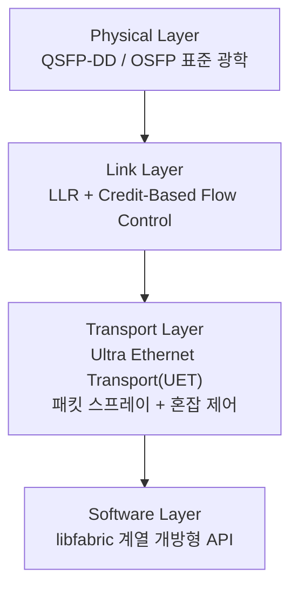
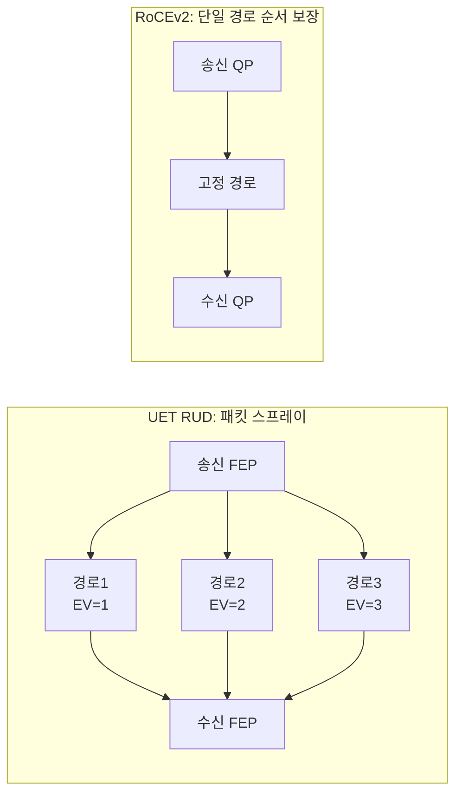

**Ultra Ethernet Consortium(UEC)**은 2023년 7월 리눅스 파운데이션 산하에 결성된 산업 컨소시엄이며, 그 산출물인 **UEC Specification 1.0**(2025년 6월 공개)은 표준 이더넷 물리 계층 위에 InfiniBand급 저지연·무손실 전송을 얹는 것을 목표로 하는 프로토콜 스택입니다. AI 학습 클러스터가 수만 개 GPU 규모로 커지면서, 기존 RoCEv2가 의존하는 PFC(Priority Flow Control)의 congestion spreading·head-of-line blocking 문제와 InfiniBand의 벤더 종속성이 동시에 병목으로 떠올랐고, 이 장은 UEC가 이 두 문제를 어떤 메커니즘으로 풀려고 하는지, 그리고 지금 시점에 이 스펙을 어떻게 판단해야 하는지를 다룹니다.

## 이 장을 읽기 전에

이 장은 [12장: RDMA 기초](/post/network-optimization/rdma-infiniband-fundamentals/)에서 다룬 RDMA의 기본 개념(큐 페어, 원격 메모리 접근, InfiniBand·RoCEv2의 관계)을 전제로 합니다. RDMA가 무엇이고 왜 커널을 우회해 지연을 줄이는지 모른다면 12장을 먼저 읽는 것이 좋습니다. 혼잡 제어의 일반적인 개념(ECN, 윈도우 기반 제어)에 익숙하면 도움이 되며, 해당 기초는 [3장: TCP 성능 최적화](/post/network-optimization/tcp-performance-nagle-congestion-control-bbr/)에서 다룬 내용을 참고할 수 있습니다.

**이 장의 깊이**는 **전문가** 구간입니다. UEC Specification 1.0의 4계층 구조를 개괄하고, 이 트랙 다른 챕터가 다루지 않는 UEC 고유 메커니즘(LLR, CBFC, UET 혼잡 제어, 패킷 스프레이)을 심층적으로 다룹니다. **다루지 않는 것**: RDMA·InfiniBand의 기초 개념(→ 12장), 커널 바이패스·DPDK/XDP 구현 세부사항(→ [10장](/post/network-optimization/dpdk-advanced-deep-dive-smartnic-dpu/), [11장](/post/network-optimization/xdp-ebpf-network-packet-processing-advanced/)), TCP 혼잡 제어 알고리즘 일반론(→ 3장), TLS/PQC 기반 보안(→ [16장](/post/network-optimization/tls-ssl-handshake-optimization-pqc/); UEC의 Transport Security Subsystem은 AES-GCM 기반 자체 계층으로 TLS와 별개이며 이 장에서는 존재만 언급합니다).

## 당신의 수준에 맞는 경로

| 수준 | 읽을 부분 | 핵심 목표 |
|------|---------|---------|
| **중급자** | "UEC의 등장 배경" ~ "UEC 스펙 1.0의 4계층 구조" | UEC가 왜 만들어졌고 무엇을 표준화하는지 이해 |
| **심화** | "PFC 없는 무손실 이더넷" ~ "Ultra Ethernet Transport와 혼잡 제어" | LLR·CBFC·UET 메커니즘의 동작 원리 이해 |
| **전문가** | "RoCEv2·InfiniBand 대비 위치" ~ "비판적 시각" | 도입 판단 기준과 스펙-실리콘 간극을 평가 |

---

## UEC의 등장 배경

UEC는 2023년 7월 19일 AMD, Arista, Broadcom, Cisco, Eviden(Atos), HPE, Intel, Meta, Microsoft가 창립 멤버로 참여해 리눅스 파운데이션 산하 Joint Development Foundation 프로젝트로 출범했습니다. 창립 시점부터 물리 계층(Physical Layer), 링크 계층(Link Layer), 전송 계층(Transport Layer), 소프트웨어 계층(Software Layer) 네 개 워킹 그룹으로 나뉘어 스펙을 작성했고, 2년 가까운 작업 끝에 2025년 6월 11일 샌프란시스코에서 **UEC Specification 1.0**을 공개했습니다. 스펙 문서 자체는 방대한 분량으로 물리 계층부터 API까지 전체 스택을 다룹니다.

이 컨소시엄이 풀려던 문제는 두 갈래입니다. 첫째, RoCEv2가 무손실 전송을 위해 의존하는 PFC는 별도의 헤드룸 버퍼가 필요하고, 한 링크에서 발생한 정체가 pause 프레임을 통해 상류로 전파되면서 congestion spreading과 head-of-line blocking을 일으킵니다. 둘째, InfiniBand는 이 문제를 링크 계층 credit 기반 흐름 제어로 오래전부터 회피해 왔지만, 전용 스위치·케이블·서브넷 매니저 생태계에 묶여 있어 특정 벤더 의존도가 높습니다. UEC는 "표준 이더넷 광학·케이블을 그대로 쓰면서 InfiniBand급 손실 없는 저지연 전송을 얻는" 것을 목표로 설계되었습니다.

## UEC 스펙 1.0의 4계층 구조

UEC Specification 1.0은 창립 당시의 워킹 그룹 구조를 그대로 반영해 네 계층으로 나뉩니다. 물리 계층은 QSFP-DD·OSFP 등 기존 이더넷 광학 표준을 그대로 채택해 하드웨어 생태계와의 호환성을 유지합니다. 링크 계층은 이 장의 핵심인 **LLR(Link Level Retry)**과 **CBFC(Credit-Based Flow Control)**를 도입해 PFC 없이도 무손실 전송을 가능하게 합니다. 전송 계층은 새로운 프로토콜인 **UET(Ultra Ethernet Transport)**로, 커넥션리스 구조와 패킷 단위 멀티패스(packet spraying), 그리고 혼잡 제어·손실 감지 서브시스템을 포함합니다. 소프트웨어 계층은 libfabric 계열의 개방형 API를 통해 상위 애플리케이션(NCCL, MPI 등)이 벤더에 종속되지 않고 UET를 사용할 수 있게 합니다.



네 계층 중 물리 계층은 기존 이더넷 표준을 그대로 재사용하므로 이 장에서 따로 다루지 않으며, 소프트웨어 계층의 API 세부사항은 벤더 SDK가 안정화된 뒤 별도로 다룰 만한 주제입니다. 아래에서는 UEC가 실제로 차별화되는 링크 계층과 전송 계층 메커니즘에 집중합니다.

## PFC 없는 무손실 이더넷: LLR과 CBFC

전통적인 PFC는 수신 버퍼가 임계치에 도달하면 상류 스위치에 pause 프레임을 보내 트래픽 전체를 멈추는 방식입니다. 이 방식은 RTT와 MTU를 감안한 헤드룸 버퍼를 요구하고, 하나의 흐름이 만든 정체가 pause 프레임을 통해 관련 없는 다른 흐름까지 막아버리는 head-of-line blocking으로 이어지기 쉽습니다. UEC는 이 문제를 링크 계층에서 두 가지 메커니즘으로 대체합니다.

**LLR(Link Level Retry)**은 링크 단위에서 지역적으로 오류를 복구하는 재전송 프로토콜입니다. 송신 측은 프레임을 시퀀스 번호와 함께 리플레이 버퍼(replay buffer)에 저장해 두고, 수신 측은 마이크로초 단위의 왕복 시간 안에 ACK 또는 NACK으로 응답합니다. NACK을 받으면 go-back-N 방식으로 해당 시퀀스 이후를 재전송해 tail loss를 방지합니다. 이 과정은 링크 하나 안에서 끝나므로 상위 계층이나 다른 링크로 정체가 전파되지 않습니다.

**CBFC(Credit-Based Flow Control)**는 수신 측이 사용 가능한 버퍼 공간만큼 신용(credit)을 미리 발급하고, 송신 측은 그 신용 범위 안에서만 전송하는 능동적 흐름 제어입니다. 송신·수신 양측은 각각 사용된 신용과 반환된 신용을 두 개의 순환 카운터(cyclic counter)로 추적하며, 이는 가상 채널(virtual channel) 단위로 관리됩니다(정확한 카운터 비트 폭은 공개 자료에 구체적으로 명시되어 있지 않아 구현 정의로 남겨둡니다). PFC보다 필요한 헤드룸 버퍼가 작고, 설정이 단순하며, 무엇보다 링크가 막히기 전에 미리 전송을 조절하므로 pause 프레임 자체가 필요 없습니다. 스펙은 CBFC가 PFC를 완전히 밀어내는 것이 아니라 "PFC와 병행하거나 대체할 수 있다"고 규정하는데, 이는 뒤에서 다룰 오개념과 직결됩니다. LLR·CBFC는 둘 다 **선택적(optional)** 기능으로 정의되어 있고, 이더넷 호환성을 유지하기 위해 LLDP(Link Layer Discovery Protocol)로 링크 양단이 사전에 활성화 여부를 협상합니다.

```text
# UET 링크 계층 프레임의 개념적 필드 구성 (스펙 요약, 실제 비트 배치는 구현 정의)
LLR_FRAME {
  seq_number   : uint32   # 리플레이 버퍼 슬롯을 가리키는 시퀀스 번호
  payload      : bytes
  crc          : uint32
}
LLR_ACK_NACK {
  ack_seq      : uint32   # 마지막으로 수신 확인된 시퀀스 번호
  nack_flag    : bool     # true면 go-back-N 재전송 트리거
}
CBFC_CREDIT_UPDATE {
  vc_id        : uint8    # virtual channel 식별자
  credit_count : uint     # 순환 카운터, 사용 가능 버퍼 슬롯 수(비트 폭은 구현 정의)
}
```

위 구조는 스펙 문서의 개념을 요약한 의사 필드 정의이며 실제 비트 레이아웃이 아닙니다. 오늘 시점에서 이 메커니즘을 직접 관측할 방법은 없지만, 기존 RoCEv2 환경에서 PFC가 실제로 얼마나 pause 프레임을 만들어내는지는 지금도 확인할 수 있습니다.

```text
$ ethtool -S eth0 | grep -i pause
     tx_pause_frames: 184032
     rx_pause_frames: 219871
     tx_pfc_frames_prio3: 91204
```

이 카운터가 꾸준히 증가한다면 해당 링크가 PFC 헤드룸 버퍼와 pause 전파에 실제로 의존하고 있다는 신호이며, UEC 도입을 검토할 때 "지금 우리 환경에서 PFC가 실제로 문제를 일으키는가"를 판단하는 출발점이 됩니다. 반대로 pause 카운터가 거의 늘지 않는다면 CBFC로 얻을 실익이 크지 않을 수 있습니다.

## Ultra Ethernet Transport(UET)와 혼잡 제어

UET는 RoCEv2·InfiniBand의 커넥션 지향·순서 보장 전제를 버리고 **커넥션리스**와 **패킷 단위 멀티패스**를 기본으로 설계되었습니다. 각 패킷은 엔트로피 값(Entropy Value, EV)을 달리 부여받아 ECMP 상에서 서로 다른 경로로 흩뿌려지는데, 이를 **패킷 스프레이(packet spraying)**라 부릅니다. 단일 경로만 쓰는 기존 방식과 달리 다중 경로를 동시에 활용해 네트워크 전체의 대역폭을 고르게 소비하고 특정 경로로 트래픽이 몰리는 polarization을 피합니다.



패킷이 경로마다 다르게 도착하면 순서가 뒤섞이므로, UET는 용도에 따라 네 가지 전송 모드를 정의합니다. AI 학습처럼 순서보다 처리량이 중요한 워크로드는 신뢰성은 보장하되 순서는 재조립에 맡기는 모드를 쓰고, HPC의 일부 집합 통신처럼 순서 보장이 필요한 워크로드는 단일 경로 모드를 선택할 수 있습니다.

| 모드 | 신뢰성 | 순서 | 주 사용처 |
|------|--------|------|-----------|
| RUD | 있음 | 없음(패킷 스프레이 허용) | AI 학습 트래픽(기본값) |
| ROD | 있음 | 있음(단일 경로) | 순서가 중요한 HPC 집합 통신 |
| UUD | 없음 | 없음 | 상위 계층이 자체 신뢰성을 구현하는 소프트웨어 프로토콜 |
| RUDI | 있음(멱등적) | 없음 | 재시도해도 부작용이 없는 멱등 연산 |

혼잡 제어는 두 알고리즘을 병행하도록 권장합니다. **NSCC(Network Signal-based Congestion Control)**는 ECN 마킹(빠른 1비트 신호)과 RTT 변화(느린 신호)를 함께 보고, ECN이 있고 RTT도 높으면 윈도우를 적극적으로 줄이고 ECN도 없고 RTT도 낮으면 빠르게 윈도우를 키우는 식으로 네 가지 조합에 서로 다른 반응 강도를 적용합니다. **RCCC(Receiver Credit-based Congestion Control)**는 수신 측이 신용을 전적으로 관리하는 방식으로, 여러 송신자가 한 수신자에 몰리는 incast 상황에는 강하지만 반대로 한 송신자가 여러 수신자에 트래픽을 뿌리는 outcast나 네트워크 내부 스위치 정체에는 상대적으로 약합니다. 손실 감지는 타임아웃에만 의존하지 않고, 드롭될 패킷의 헤더만 우선순위를 높여 전달하는 packet trimming, 마지막 수신 시퀀스와 누락 시퀀스 간 거리로 손실을 추정하는 out-of-order count, EV와 시퀀스 번호 쌍으로 손실을 정밀 추적하는 방식을 함께 사용해 타임아웃보다 훨씬 빠르게(수 마이크로초 단위로) 손실을 감지합니다.

## RoCEv2·InfiniBand 대비 위치

세 기술은 모두 "낮은 지연으로 원격 메모리에 접근한다"는 목표를 공유하지만 손실 처리와 경로 활용 방식에서 갈립니다. InfiniBand는 20년 넘게 검증된 전용 credit 기반 링크 흐름 제어와 서브넷 매니저를 갖췄지만 전용 스위치·케이블·NIC 생태계에 묶여 있습니다. RoCEv2는 표준 이더넷 위에서 InfiniBand의 verbs API를 재사용하지만 무손실을 보장하기 위해 PFC에 의존하며, 그 결과 헤드룸 버퍼와 congestion spreading 문제를 그대로 물려받습니다. UEC의 UET는 표준 이더넷 물리 계층을 쓴다는 점에서 RoCEv2와 같은 편이지만, PFC 대신 LLR·CBFC로 무손실을 구현하고 단일 경로·순서 보장 대신 커넥션리스·멀티패스를 기본으로 삼는다는 점에서 RoCEv2의 단순한 개명이 아니라 새로운 전송 계층입니다.

| 항목 | InfiniBand | RoCEv2 | UEC(UET) |
|------|-----------|--------|----------|
| 물리 매체 | 전용 IB 스위치·케이블 | 표준 이더넷 | 표준 이더넷 |
| 무손실 메커니즘 | 링크 계층 credit 흐름 제어 | PFC(헤드룸 버퍼 필요) | LLR + CBFC |
| 경로 활용 | 서브넷 매니저 기반 라우팅 | 단일 경로, 순서 보장 | 커넥션리스 멀티패스(RUD 기준) |
| 혼잡 제어 | 벤더별 구현(예: 적응형 라우팅) | DCQCN 계열 | NSCC + RCCC 병행 |
| 벤더 생태계 | 사실상 단일 벤더 중심 | 멀티벤더, PFC 튜닝 부담 | 멀티벤더, 개방형 스펙 |
| 성숙도(2026-07 기준) | 배포 검증 완료, 대규모 실적 다수 | 널리 배포됨 | 스펙 1.0 확정, 실리콘·상호운용 검증 진행 중 |

## 흔한 오개념

**"UEC는 PFC를 완전히 없앤다"**는 오해가 흔하지만, 스펙은 CBFC를 "PFC와 병행하거나 대체할 수 있다"고 규정합니다. 실제 배치에서는 전환기 하드웨어와 섞여 PFC가 여전히 남아 있는 구성도 가능하며, "PFC 제거"는 목표이지 스펙이 강제하는 절대 조건이 아닙니다.

**"스펙 1.0이 나왔으니 이미 상용 배포 가능한 프로토콜이다"**라는 오해도 주의해야 합니다. 스펙 문서 공개와 상호운용 가능한 실리콘의 대량 가용성은 별개 사안이며, 발표 시점 기준으로는 준수 프로그램(compliance program)과 초기 구현이 "진행 중"이라고만 언급되었을 뿐 구체적인 하드웨어 일반 출시 시점은 스펙 문서에 명시되어 있지 않습니다. 도입을 검토한다면 벤더의 실제 실리콘·드라이버 로드맵을 별도로 확인해야 합니다.

**"UEC가 일반 데이터센터 이더넷(TCP/IP) 트래픽까지 대체한다"**는 것도 범위를 넘는 오해입니다. UET는 AI/HPC의 RDMA 트래픽에 최적화된 전송 계층이며, 웹 트래픽·마이크로서비스 간 통신 같은 범용 TCP/IP 워크로드를 대체하는 것을 목표로 하지 않습니다.

## 판단 기준

| 상황 | 권장 | 비권장 |
|------|------|--------|
| 수만 GPU 규모 신규 AI 클러스터를 백지에서 설계, 멀티벤더 조달이 전제 | UEC 로드맵을 추적하며 벤더 호환성 확인 후 PoC로 단계적 검토 | 검증되지 않은 초기 프로필로 전체 프로덕션 즉시 전환 |
| 기존 InfiniBand 클러스터가 안정적으로 운영 중 | 당장 마이그레이션보다 실리콘 가용성·상호운용 인증 성숙도를 관찰 | 검증 안 된 상태에서 급하게 전환 |
| 기존 RoCEv2 + PFC 환경에서 `ethtool` pause 카운터가 꾸준히 증가하고 HOL blocking이 의심됨 | CBFC/LLR 지원 NIC·스위치 로드맵을 확인하고 소규모 PoC 구성 | PFC 파라미터 튜닝만으로 무기한 버티기 |
| 범용 마이크로서비스·웹 트래픽(비 RDMA) | 기존 TCP/IP 스택과 3장의 혼잡 제어 튜닝 유지 | UEC 도입 검토는 해당 없음 |

## 비판적 시각: 한계와 트레이드오프

스펙 발표와 실제 배포 가능한 실리콘 사이의 간극은 빠르게 좁혀지고는 있지만 아직 완전히 메워지지 않았습니다. Keysight와 Broadcom이 800GE 라인 레이트에서 LLR·CBFC 상호운용성을 시연했다는 보도가 있었으나, 이 장 작성 시점 기준으로 1차 출처(공식 보도자료·벤더 공지)를 확인하지 못해 시연 일자·세부 조건은 미확인 상태로 남겨둡니다. 사실이라면 서로 다른 벤더의 테스트 장비와 스위치 실리콘이 실제로 UEC 링크 계층 프로토콜로 통신할 수 있음을 보인 초기 사례가 되겠지만, 이는 어디까지나 "상호운용성 시연"이지 다수 벤더 제품이 폭넓게 상용 구매 가능하다는 뜻은 아니며, 대규모 프로덕션 배포 실적은 이 장 작성 시점 기준으로 아직 축적되지 않았습니다. CBFC가 PFC의 헤드룸 버퍼 문제를 줄이더라도 여전히 신용 교환과 버퍼 관리라는 상태를 링크 양단이 유지해야 하므로, "완전히 공짜인 무손실"은 아닙니다. RCCC는 incast에 강한 대신 outcast와 네트워크 내부 정체에는 상대적으로 약하다고 스펙 스스로 인정하는 지점이며, 두 알고리즘을 병행해야 한다는 요구 자체가 구현 복잡도를 늘립니다. RUD/ROD/UUD/RUDI 네 가지 전송 모드와 AI Base/AI Full/HPC 등 여러 구현 프로필이 공존하는 구조는 유연성을 주는 대신, 실제 배포에서 어떤 조합이 상호운용되는지 검증하는 부담을 사업자에게 떠넘깁니다. 마지막으로 기존 RoCEv2·InfiniBand 생태계(드라이버, 운영 노하우, 벤치마크 축적)의 관성은 상당하므로, 스펙상의 이론적 우위가 실제 전환을 자동으로 정당화하지는 않습니다.

### 더 읽을 거리

- [UEC Specification 1.0 발표 — Ultra Ethernet Consortium](https://ultraethernet.org/ultra-ethernet-consortium-uec-launches-specification-1-0-transforming-ethernet-for-ai-and-hpc-at-scale/) — 2025-06-11 스펙 1.0 공개 공식 발표문
- [Ultra Ethernet's Design Principles and Architectural Innovations (arXiv 2508.08906)](https://arxiv.org/html/2508.08906v1) — UET·패킷 스프레이·NSCC/RCCC 혼잡 제어의 아키텍처 배경을 다루는 기술 논문
- [Announcing Ultra Ethernet Consortium — Linux Foundation](https://www.linuxfoundation.org/press/announcing-ultra-ethernet-consortium-uec) — 2023-07-19 UEC 결성 공식 발표문

## 마무리

- UEC가 2023년 리눅스 파운데이션 산하에 결성된 배경과 2025-06 Specification 1.0이 풀려는 문제(PFC의 congestion spreading, InfiniBand의 벤더 종속성)를 설명할 수 있다.
- LLR과 CBFC가 PFC 없이 무손실 링크를 만드는 원리(리플레이 버퍼·시퀀스 재전송, 신용 기반 능동 흐름 제어)를 설명할 수 있다.
- UET의 커넥션리스 멀티패스(패킷 스프레이)와 RUD/ROD/UUD/RUDI 전송 모드의 차이를 구분할 수 있다.
- NSCC·RCCC 혼잡 제어가 각각 어떤 신호(ECN+RTT, 수신 신용)에 반응하고 어떤 상황(incast vs outcast)에 약한지 설명할 수 있다.
- RoCEv2·InfiniBand 대비 UEC의 위치를 손실 처리·경로 활용·성숙도 축으로 비교할 수 있다.
- 스펙 발표와 실제 실리콘 가용성 사이의 간극을 인지하고, 도입 여부를 성급하게 결정하지 않을 수 있다.

**다음 장에서는** 애플리케이션 계층으로 눈을 돌려 gRPC의 성능 튜닝을 다룹니다. 이 장에서 다룬 UEC·RDMA가 데이터센터 내부 팹릭의 물리·전송 계층 최적화라면, gRPC는 그 위에서 서비스 간 호출이 실제로 겪는 직렬화·연결 관리·스트리밍 오버헤드를 다루는 상위 계층 최적화입니다. → [gRPC 최적화](/post/network-optimization/grpc-performance-tuning-optimization/) (챕터 14)

**이전 장**: [RDMA 기초](/post/network-optimization/rdma-infiniband-fundamentals/) (챕터 12)
