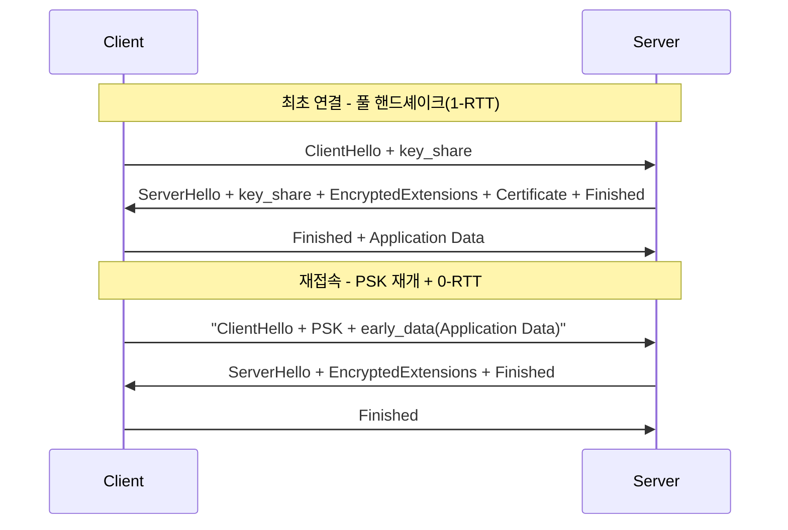

**TLS/SSL 최적화**란 연결을 맺을 때마다 발생하는 암호화 핸드셰이크의 왕복(RTT)과 계산 비용을 줄여, 실제 데이터를 주고받기까지 걸리는 시간을 단축하는 것을 말합니다. HTTPS API 서버든 gRPC 백엔드든, 매 연결은 TCP 3-way handshake 위에 TLS 핸드셰이크라는 추가 왕복을 얹습니다. 연결이 짧고 자주 새로 맺어지는 마이크로서비스·모바일 클라이언트 환경에서는 이 추가 RTT가 전체 응답 지연의 상당 부분을 차지하며, 여기에 최근에는 양자 컴퓨터 위협에 대비한 PQC(post-quantum cryptography) 하이브리드 키교환이 핸드셰이크 패킷 크기를 키우면서 새로운 지연 요인으로 떠올랐습니다. 이 장에서는 TLS 1.3 핸드셰이크의 구조, 세션 재개(session resumption)와 0-RTT가 지연을 줄이는 방식과 그 대가로 지불하는 재전송(replay) 위험, 그리고 PQC 하이브리드 키교환이 이 균형에 어떤 변화를 주는지를 다룹니다.

## 이 장을 읽기 전에

**전제 지식**: TCP 3-way handshake와 RTT의 기본 개념([20장: 네트워크 지연 직관](/post/network-optimization/network-latency-intuition-rtt-bandwidth-fundamentals/)), 그리고 대칭키·비대칭키 암호의 역할 차이 정도만 알면 충분합니다. 소켓 옵션 수준의 커널 버퍼링은 [02장](/post/network-optimization/socket-options-tcp-nodelay-buffer-tuning/)에서, TCP 자체의 혼잡 제어·Nagle은 [03장](/post/network-optimization/tcp-performance-nagle-congestion-control-bbr/)에서 다뤘으므로 여기서는 반복하지 않습니다.

**이 장의 깊이**: 심화. TLS 1.3 핸드셰이크의 메시지 흐름, PSK 기반 세션 재개와 0-RTT의 보안 모델, ML-KEM 기반 PQC 하이브리드 키교환이 핸드셰이크 지연에 미치는 실제 영향까지 다룹니다.

**다루지 않는 것**: 개별 암호 스위트(AES-GCM vs ChaCha20-Poly1305)의 CPU 성능 비교, 인증서 체인 검증·OCSP stapling·mTLS 인증서 운영 정책은 범위 밖입니다. QUIC 위에서의 0-RTT 전송 계층 자체는 [15장: QUIC 프로토콜](/post/network-optimization/quic-protocol-0rtt-udp-transport/)에서, 핸드셰이크 반복 자체를 없애는 연결 재사용 전략은 [17장: Connection Pooling](/post/network-optimization/connection-pooling-keep-alive-reuse-strategy/)에서, HTTP/2·HTTP/3의 멀티플렉싱 비교는 [19장](/post/network-optimization/http2-http3-multiplexing-quic-comparison/)에서 다루므로 이 장은 TLS 핸드셰이크 자체의 구조와 비용에 집중합니다.

## 당신의 수준에 맞는 경로

| 수준 | 읽을 부분 | 핵심 목표 |
|------|---------|---------|
| **중급자** | "TLS 핸드셰이크의 변천" ~ "TLS 1.3 핸드셰이크 메커니즘" | 2-RTT에서 1-RTT로 줄어든 구조와 이유 이해 |
| **중급~심화** | "세션 재개와 0-RTT" | PSK 재개·0-RTT가 지연을 줄이는 원리와 재전송 위험 이해 |
| **전문가** | "PQC 하이브리드 키교환" ~ "비판적 시각" | PQC 도입이 지연·패킷 크기에 미치는 영향을 판단하고 도입 시점 결정 |

---

## TLS 핸드셰이크의 변천 (역사·배경)

SSL 2.0(1995)과 SSL 3.0(1996)을 거쳐 TLS 1.0(1999, RFC 2246)부터 TLS 1.2(2008, RFC 5246)까지는 풀 핸드셰이크에 **2번의 왕복(2-RTT)**이 필요했습니다. 클라이언트가 `ClientHello`를 보내면 서버가 `ServerHello`·인증서·`ServerKeyExchange`를 응답하고, 클라이언트가 다시 `ClientKeyExchange`와 `Finished`를 보낸 뒤에야 서버의 `Finished`로 핸드셰이크가 끝나는 구조였습니다. 이 사이 오래된 암호 스위트, 재협상(renegotiation) 취약점, 압축 기반 공격(CRIME) 등 여러 보안 문제가 누적되었습니다.

TLS 1.3(2018, [RFC 8446](https://datatracker.ietf.org/doc/html/rfc8446))은 핸드셰이크를 근본적으로 재설계했습니다. 키 교환 그룹을 `ClientHello`에서 미리 추측해 보내고 서버가 곧바로 인증서·`Finished`까지 응답하는 구조로 바꿔 **풀 핸드셰이크를 1-RTT로 단축**했고, RC4·3DES·정적 RSA 키 교환 같은 취약한 조합을 제거했습니다. 이 재설계 위에서 세션 재개는 아예 왕복을 하나 더 줄이는 **0-RTT(zero round trip time) 모드**로 확장되었고, 최근에는 여기에 양자 내성 키교환이 하이브리드로 얹히면서 핸드셰이크의 비용 구조가 다시 한번 바뀌고 있습니다.

## TLS 1.3 핸드셰이크 메커니즘

TLS 1.3의 풀 핸드셰이크는 클라이언트가 지원하는 키 교환 그룹에 대한 **key_share**를 `ClientHello`에 실어 보내는 것에서 시작합니다. 서버는 그룹이 맞으면 자신의 key_share와 `EncryptedExtensions`·`Certificate`·`CertificateVerify`·`Finished`를 한 번에 응답하고, 클라이언트는 서버 인증서를 검증한 뒤 자신의 `Finished`를 보내면서 애플리케이션 데이터를 실어 보낼 수 있습니다. TLS 1.2까지 별도 메시지였던 키 교환과 인증 처리가 이렇게 하나의 왕복으로 압축된 것이 1-RTT 단축의 핵심입니다.



핸드셰이크가 실제로 몇 개의 메시지와 바이트로 구성되는지는 mermaid 그림만으로는 알 수 없고, `openssl s_client`나 패킷 캡처로 직접 확인하는 것이 가장 정확합니다. 아래는 TLS 1.3 서버에 접속했을 때 나오는 협상 결과 출력 예시입니다(OpenSSL 3.x, 실제 필드 값은 서버·라이브러리 버전에 따라 달라집니다).

```text
$ openssl s_client -connect example.com:443 -tls1_3 -brief
CONNECTION ESTABLISHED
Protocol version: TLSv1.3
Ciphersuite: TLS_AES_128_GCM_SHA256
Peer certificate: CN = example.com
Hash used: SHA256
Signature type: RSA-PSS
Negotiated TLS1.3 group: X25519
```

이 출력의 `Negotiated TLS1.3 group` 값이 곧 어떤 키 교환(고전 X25519인지 PQC 하이브리드인지)이 실제로 선택되었는지를 보여 주므로, 설정만 믿지 말고 운영 환경에서 이 값을 주기적으로 확인하는 것이 안전합니다.

## 세션 재개와 0-RTT

**세션 재개(session resumption)**는 이미 한 번 완료한 핸드셰이크의 비밀값을 재사용해, 다음 연결에서 인증서 검증과 비대칭키 연산을 다시 하지 않도록 하는 기법입니다. TLS 1.3에서는 핸드셰이크가 끝난 뒤 서버가 `NewSessionTicket` 메시지로 **PSK(pre-shared key) identity**를 클라이언트에 넘겨주고, 클라이언트는 다음 연결의 `ClientHello`에 이 PSK identity를 실어 보내 재개를 요청합니다. 이때 PSK만으로 키를 정하는 `psk_ke` 모드와, PSK에 더해 매번 새로운 (고전 타원곡선 또는 PQC 하이브리드) 키 교환을 함께 수행하는 `psk_dhe_ke` 모드가 있으며, 후자만 완전한 forward secrecy를 보장합니다.

재개를 한 단계 더 압축한 것이 **0-RTT(early data)** 입니다. 클라이언트가 PSK를 갖고 있다면 `ClientHello`와 동시에 `early_data` 확장에 애플리케이션 데이터를 실어 보낼 수 있어, 서버 응답을 기다리지 않고 첫 패킷에서 요청을 완료할 수 있습니다. 그러나 이 데이터는 서버가 아직 아무 값도 기여하지 않은 상태에서 이전 세션의 PSK만으로 암호화되므로, RFC 8446은 이 성질을 명확히 경고합니다.

> "There are no guarantees of non-replay between connections." — [RFC 8446, Section 2.3](https://datatracker.ietf.org/doc/html/rfc8446) (IETF, 2018)

즉 네트워크 중간에서 0-RTT 첫 패킷을 그대로 복사해 재전송하면 서버가 같은 요청을 다시 처리할 수 있다는 뜻이며, 이는 TLS가 제공하는 기밀성·무결성과는 별개의 문제입니다. 결제·잔액 차감처럼 상태를 바꾸는 비-idempotent 요청에 0-RTT를 허용하면 중복 처리로 이어질 수 있으므로, 실무에서는 idempotent한 GET류 요청에만 0-RTT를 열어 주거나, 서버 측에 재전송 캐시(single-use ticket, bloom filter 기반 중복 탐지)를 두고 ticket 유효 시간을 짧게 제한하는 방식으로 위험을 줄입니다.

세션 재개와 0-RTT의 효과는 실제로 측정해서 확인하는 것이 안전합니다. 아래는 OpenSSL의 `s_time`으로 신규 핸드셰이크와 재개 핸드셰이크의 처리량을 비교하는 벤치마크 스켈레톤입니다(OpenSSL 3.x, Linux 기준; 결과는 서버 CPU·네트워크 RTT·인증서 종류에 따라 달라지므로 각자 환경에서 재현해야 합니다).

```bash
# 신규 핸드셰이크만 반복 (매번 풀 핸드셰이크)
openssl s_time -connect example.com:443 -tls1_3 -new -time 10

# 세션 재개 반복 (동일 세션 티켓으로 handshake 생략)
openssl s_time -connect example.com:443 -tls1_3 -reuse -time 10
```

두 명령의 `connections/user sec` 값을 비교하면 재개가 줄여 주는 핸드셰이크 비용을 대략 가늠할 수 있습니다. 다만 이 수치는 서버의 CPU 성능·비대칭키 연산 가속(AES-NI, ECDSA 하드웨어 지원) 여부에 따라 크게 달라지므로 절대값이 아니라 상대 비교 용도로만 사용해야 합니다.

## PQC 하이브리드 키교환이 핸드셰이크 지연에 미치는 영향

2024년 8월 NIST가 [FIPS 203](https://csrc.nist.gov/pubs/fips/203/final)으로 표준화한 **ML-KEM(Module-Lattice-Based Key-Encapsulation Mechanism)** 은 양자 컴퓨터로도 깨기 어렵다고 여겨지는 격자 기반 키 캡슐화 알고리즘입니다. TLS는 이를 단독으로 쓰지 않고 기존 타원곡선 키 교환과 나란히 계산해 두 결과를 합치는 **하이브리드** 방식을 채택했는데, 이는 ML-KEM에서 예상치 못한 취약점이 발견되더라도 X25519 같은 검증된 고전 알고리즘이 여전히 보안을 지탱하도록 하기 위해서입니다. IETF의 [draft-ietf-tls-ecdhe-mlkem](https://datatracker.ietf.org/doc/draft-ietf-tls-ecdhe-mlkem/) 초안(RFC Editor 처리 중, IANA 코드 포인트 4588)이 정의하는 **X25519MLKEM768** 그룹이 사실상의 표준 하이브리드로 자리 잡았습니다.

문제는 이 하이브리드가 핸드셰이크 메시지 크기를 눈에 띄게 키운다는 점입니다. 위 초안에 따르면 X25519MLKEM768의 클라이언트 key_share는 1216바이트(ML-KEM 부분 1184바이트 + X25519 32바이트), 서버 key_share는 1120바이트(ML-KEM 부분 1088바이트 + X25519 32바이트)에 달합니다. X25519 단독 key_share가 32바이트에 불과했던 것과 비교하면 `ClientHello` 하나의 크기가 대략 300바이트대에서 1000바이트대로 늘어나는 셈입니다. 이 정도 크기는 TCP 초기 혼잡 윈도우(대부분의 스택에서 IW10, 약 14600바이트) 안에는 들어오지만, 여러 TLS 확장이 함께 실리는 실제 `ClientHello`에서는 MTU를 넘어 패킷이 분할되거나, 미들박스가 예상보다 큰 `ClientHello`를 비정상으로 판단해 차단하는 사례도 보고되어 있습니다. Cloudflare·Chrome·Firefox·Safari 등 주요 사업자는 2024~2026년 사이 X25519MLKEM768을 기본 또는 옵트인으로 지원하기 시작했지만([Cloudflare PQC 지원 현황](https://developers.cloudflare.com/ssl/post-quantum-cryptography/pqc-support/)), 지원 버전과 기본 활성화 여부는 클라이언트·서버 조합마다 다르므로 도입 전 실측이 필요합니다.

```text
# tcpdump로 관측한 ClientHello 크기 비교 예시(환경에 따라 실제 값은 다름)
# 고전 X25519만 사용
IP client.54321 > server.443: Flags [P.], length 296  (TLS ClientHello)

# X25519MLKEM768 하이브리드 포함
IP client.54321 > server.443: Flags [P.], length 1288 (TLS ClientHello)
```

정리하면 PQC 하이브리드가 핸드셰이크 지연에 미치는 영향은 크게 두 갈래입니다. 하나는 ML-KEM 캡슐화·복호화 연산 자체의 **CPU 비용**이고, 다른 하나는 커진 key_share가 만드는 **패킷 크기·프래그멘테이션 비용**입니다. 최신 서버 하드웨어에서는 ML-KEM 연산 자체는 마이크로초 단위로 끝나는 경우가 많아 CPU 비용의 절대적 영향은 제한적이라고 보고되지만, 초당 수만 건의 신규 연결을 처리하는 로드밸런서·CDN 엣지에서는 이 비용이 누적되어 무시할 수 없는 수준이 됩니다. 반면 패킷 크기 증가는 미들박스 호환성과 손실이 잦은 네트워크에서의 재전송 확률에 영향을 주므로, 순수 CPU 벤치마크만으로 PQC 도입 영향을 판단하면 놓치는 부분이 생깁니다.

## 흔한 오개념

**"0-RTT는 TLS로 암호화되어 있으니 안전하다"**는 틀린 생각입니다. 암호화는 기밀성과 무결성을 보장하지만, 공격자가 암호화된 첫 패킷 전체를 그대로 복사해 재전송하는 것을 막지는 못합니다. RFC 8446이 명시하듯 0-RTT 데이터는 연결 간 재전송에 대한 보장이 없으므로, 안전은 TLS 계층이 아니라 애플리케이션이 idempotent 설계와 재전송 탐지로 책임져야 합니다.

**"PSK 기반 세션 재개를 쓰면 PQC 하이브리드 계산 비용을 완전히 피할 수 있다"**도 흔한 오해입니다. forward secrecy를 유지하는 `psk_dhe_ke` 모드에서는 재개 시에도 매번 새로운 (하이브리드) 키 교환을 수행하므로 ML-KEM 캡슐화 비용이 그대로 재발생합니다. 이 비용을 정말로 건너뛰려면 forward secrecy를 포기하는 `psk_ke` 모드를 써야 하는데, 이는 과거 세션 하나가 노출되면 그 PSK로 이어진 이후 재개 세션들까지 위험해질 수 있다는 대가를 동반합니다.

**"PQC 하이브리드 오버헤드는 CPU 비용이 지배적이다"**도 절반만 맞는 이야기입니다. 앞서 본 것처럼 X25519MLKEM768의 key_share 크기는 고전 방식의 30배 이상으로 커지며, 초저지연 환경에서는 이 패킷 크기 증가가 프래그멘테이션·미들박스 차단 형태로 CPU 비용보다 더 크게 지연에 기여하는 경우가 흔합니다. PQC 도입 영향을 판단할 때는 CPU 프로파일링과 함께 실제 패킷 캡처로 핸드셰이크 바이트 수를 확인해야 합니다.

## 판단 기준

| 상황 | 권장 | 비권장 |
|------|------|--------|
| idempotent 읽기(GET, 캐시 조회) 지연 단축 | 0-RTT 허용 | 결제·상태 변경 요청에 0-RTT 허용 |
| 재접속이 잦은 모바일·마이크로서비스 클라이언트 | 세션 티켓 재개(`psk_dhe_ke`) | 매번 풀 핸드셰이크만 고집 |
| 장기 보관 데이터의 harvest-now-decrypt-later 위협이 있는 서비스 | X25519MLKEM768 하이브리드 우선 도입 | PQC 도입을 무기한 보류 |
| 손실 많은 네트워크·미들박스 경유 구간 | 실측 후 하이브리드 그룹 선택적 적용 | 검증 없이 전면 강제 활성화 |
| FIPS 인증이 필수인 규제 환경 | SecP256r1MLKEM768 등 FIPS 승인 조합 확인 | 브라우저 기본값(X25519MLKEM768)을 그대로 가정 |

## 비판적 시각: 한계와 트레이드오프

PQC 하이브리드 표준은 아직 확정과 변화가 반복되는 단계입니다. Cloudflare가 초기에 배포했던 `X25519Kyber768Draft00`은 최종 표준화 과정에서 `X25519MLKEM768`로 대체되었고, 이후에도 IANA 코드 포인트와 세부 인코딩이 조정될 수 있습니다. 알고리즘 애자일리티(algorithm agility)를 갖추지 않은 채 특정 그룹 하나만 하드코딩하면, 표준이 바뀔 때마다 재배포가 필요해집니다. 또한 FIPS 인증을 요구하는 규제 환경에서는 ML-KEM은 승인되지만 X25519는 미승인이라는 비대칭 때문에 `SecP256r1MLKEM768` 같은 대안을 써야 하는데, 이는 주요 브라우저가 기본으로 협상하는 그룹이 아니어서 별도 설정이 필요합니다.

0-RTT의 재전송 방지 책임을 애플리케이션에 넘기는 설계도 논쟁의 대상입니다. 분산된 여러 서버 인스턴스가 하나의 재전송 캐시를 공유하지 못하면 로드밸런서 뒤에서 같은 0-RTT 요청이 서로 다른 인스턴스에 각각 도달해 중복 처리될 수 있고, 이를 막으려면 별도의 분산 캐시나 티켓을 특정 인스턴스에 고정하는 라우팅이 필요해 시스템 복잡도가 늘어납니다. 세션 티켓 자체도 탈취되면 유효 기간 동안 재개 공격에 노출되므로, 지연 단축과 티켓 수명·로테이션 주기 사이의 균형은 트래픽 패턴에 맞춰 계속 조정해야 하는 값입니다.

## 마무리

- [ ] TLS 1.3 풀 핸드셰이크가 1-RTT로 줄어든 구조와 그 이유를 설명할 수 있다.
- [ ] PSK 기반 세션 재개에서 `psk_ke`와 `psk_dhe_ke`의 forward secrecy 차이를 구분할 수 있다.
- [ ] 0-RTT의 재전송 위험을 RFC 근거로 설명하고, idempotent 제한·재전송 캐시로 완화하는 방법을 적용할 수 있다.
- [ ] PQC 하이브리드 키교환이 핸드셰이크에 미치는 영향을 CPU 비용과 패킷 크기 비용으로 나눠 판단할 수 있다.
- [ ] 조직의 위협 모델과 규제 요구사항에 따라 PQC 도입 시점과 그룹 선택을 결정할 수 있다.

**이전 장**: [QUIC 프로토콜](/post/network-optimization/quic-protocol-0rtt-udp-transport/) (챕터 15)

핸드셰이크 자체의 비용을 아무리 줄여도, 매 요청마다 새 연결을 맺는다면 그 이득은 제한적입니다. 다음 장에서는 **Connection Pooling**을 다룹니다. Keep-alive와 연결 재사용 전략으로 핸드셰이크를 아예 반복하지 않도록 설계하는 방법을 정리하며, 이 장에서 다룬 세션 재개·0-RTT와 결합했을 때의 실전 효과를 함께 살펴봅니다.

→ [Connection Pooling](/post/network-optimization/connection-pooling-keep-alive-reuse-strategy/) (챕터 17)
