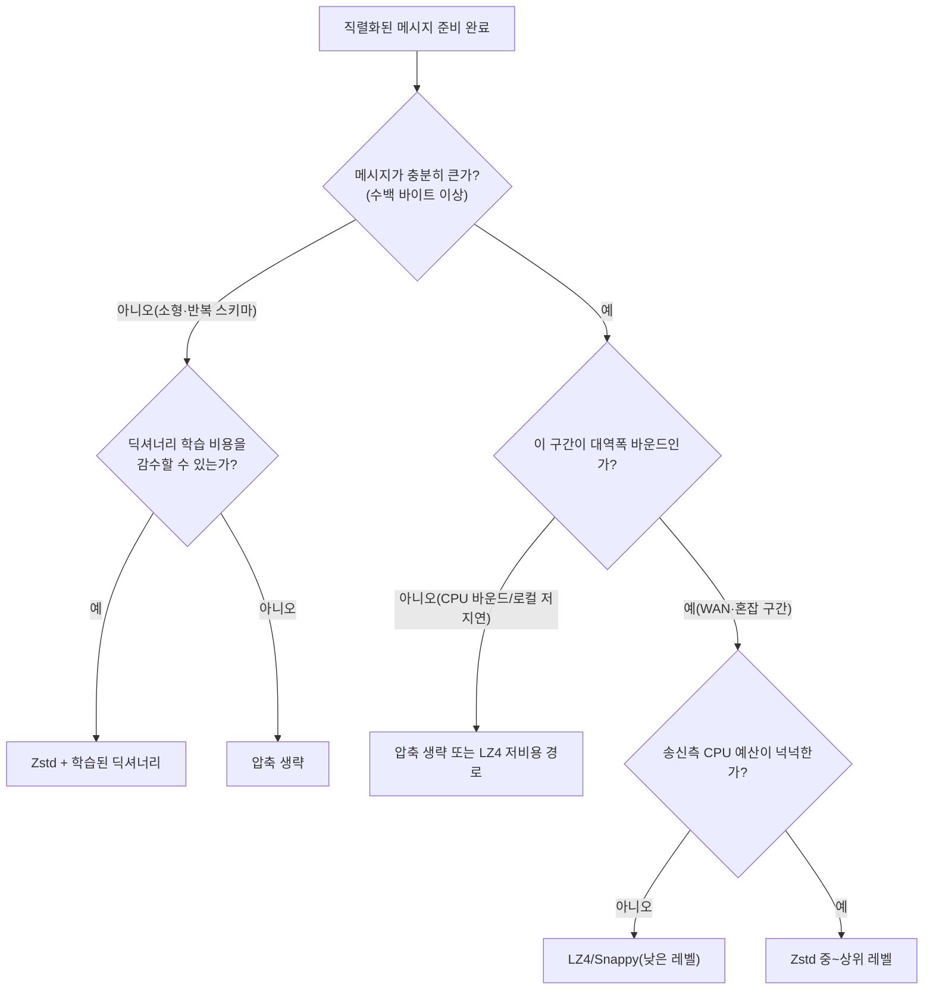

**네트워크 압축 전략**이란 직렬화된 메시지를 네트워크로 보내기 직전에 LZ4·Zstd·Snappy 같은 범용 압축기로 한 번 더 줄여, "CPU 시간을 써서 전송 시간을 줄이는" 거래를 의도적으로 설계하는 것을 말합니다. 이 거래는 항상 이득이 아닙니다. 압축은 공짜가 아니라 CPU 사이클을 쓰는 연산이고, 대역폭이 넉넉하거나 메시지가 작으면 압축에 쓴 CPU 시간이 절약한 전송 시간보다 커질 수 있습니다. 이 장에서는 압축 알고리즘 내부에서 무슨 일이 일어나는지, 왜 어떤 것은 빠르고 어떤 것은 압축률이 높은지, 그리고 메시지 크기·CPU 예산·네트워크 대역폭이라는 세 변수로 언제 압축을 켜고 끌지 판단하는 방법을 다룹니다.

## 이 장을 읽기 전에

**전제 지식**: [챕터 20: 네트워크 지연 직관](/post/network-optimization/network-latency-intuition-rtt-bandwidth-fundamentals/)에서 다룬 RTT·대역폭·직렬화 비용의 구분을 그대로 씁니다. 압축은 "직렬화 비용"과 "전송 비용" 사이에 CPU 연산을 하나 더 끼워 넣는 것이므로, 그 둘의 경계가 흐릿하면 이 장의 손익분기점 논의를 따라가기 어렵습니다. 또한 [챕터 05: 직렬화 성능 비교](/post/network-optimization/serialization-performance-protobuf-flatbuffers-capnproto/)에서 다룬 "직렬화 결과가 이미 바이너리로 조밀한가, 텍스트라 성긴가"의 구분도 전제로 합니다.

**이 장의 깊이**: 압축 알고리즘의 내부 구현(LZ77 매치 탐색 알고리즘, FSE/tANS 엔트로피 코더의 비트 연산)까지는 들어가지 않고, "왜 이런 트레이드오프가 생기는가"를 이해할 수 있는 수준까지만 다룹니다. **다루지 않는 것**: 직렬화 포맷 자체의 설계·zero-copy 기법(챕터 05·06·07에서 다룸), gRPC의 압축 옵션 설정(챕터 14), WebSocket의 permessage-deflate(챕터 18), HTTP/2·HTTP/3의 헤더 압축(HPACK/QPACK, 챕터 19), TLS 계층의 압축(챕터 16)입니다. 이 장은 그 위에 있는 "애플리케이션이 페이로드를 압축할지 말지"라는 한 단계에 집중합니다.

## 당신의 수준에 맞는 경로

| 수준 | 읽을 부분 | 핵심 목표 |
|------|---------|---------|
| **초보자** | "압축 알고리즘의 계보" ~ "매치 탐색과 엔트로피 코딩" | 압축기가 내부에서 무엇을 하는지 원리 이해 |
| **중급자** | "세 갈래 트레이드오프" ~ "소형 메시지 문제와 딕셔너리 압축" | 워크로드별 손익분기점을 실제로 계산·측정 |
| **전문가** | "판단 기준" ~ "비판적 시각" | 알고리즘·레벨·딕셔너리 선택과 하드웨어 오프로드 판단 |

---

## 압축 알고리즘의 계보 (역사·배경)

범용 무손실 압축의 기본 아이디어는 1977년 Abraham Lempel과 Jacob Ziv가 발표한 **LZ77** 알고리즘으로 거슬러 올라갑니다. "지금까지 본 데이터 중 지금 위치와 똑같은 부분이 있으면, 그 데이터를 다시 쓰는 대신 (거리, 길이) 쌍으로 가리킨다"는 아이디어가 핵심이며, 이후 등장한 대부분의 범용 압축기(zlib/deflate, LZ4, Zstd, Snappy)가 이 아이디어를 계승합니다. 저지연 네트워크에서 실제로 쓰이는 세 압축기는 등장 시점이 서로 다릅니다. Google은 2005년경부터 내부적으로 "Zippy"라는 이름으로 쓰던 압축기를 2011년 [**Snappy**](https://github.com/google/snappy)라는 이름으로 오픈소스화했고, BigTable·MapReduce·내부 RPC 시스템에서 압축 속도가 압축률보다 중요한 경로에 적용해 왔습니다. 같은 2011년, Yann Collet이 압축·해제 속도를 극한으로 끌어올린 **LZ4**를 공개했습니다. Collet은 이후 Facebook에서 압축률과 속도의 균형을 다시 설계한 **Zstd(Zstandard)**를 2015년에 공개했고, 이 포맷은 2021년 IETF [**RFC 8878**](https://datatracker.ietf.org/doc/html/rfc8878)로 표준화되어 미디어 타입과 콘텐츠 인코딩이 정의되었습니다. RFC 8878은 Zstd가 파일 압축뿐 아니라 파이프·스트리밍 압축, 즉 "미리 정해진 만큼의 중간 저장 공간만으로 임의 길이의 순차 입력 스트림을 처리"하도록 설계되어 데이터 통신에 쓸 수 있음을 명시합니다.

## 매치 탐색과 엔트로피 코딩: 압축이 실제로 하는 일

LZ77 계열 압축기는 두 단계로 동작합니다. 첫 단계는 **매치 탐색(match finding)**으로, 입력 버퍼에서 이전에 나온 것과 똑같은 바이트 시퀀스를 찾아 (거리, 길이) 쌍으로 치환합니다. 반복이 많은 데이터(같은 필드 이름이 반복되는 JSON, 같은 스키마가 반복되는 protobuf 메시지 다발)일수록 이 단계에서 크게 줄어듭니다. 두 번째 단계는 **엔트로피 코딩(entropy coding)**으로, 남은 리터럴 바이트와 (거리, 길이) 쌍을 등장 빈도에 따라 더 짧은 비트열로 재인코딩합니다. LZ4는 이 두 번째 단계를 사실상 생략하거나 매우 단순화해 압축·해제 속도를 최대화하는 대신 압축률을 희생합니다. Zstd는 **FSE(Finite State Entropy)**와 **tANS(table-based Asymmetric Numeral System)** 계열의 엔트로피 코더를 매치 탐색 단계 뒤에 붙여, LZ4보다 느리지만 zlib/deflate급 이상의 압축률을 냅니다. Snappy는 LZ4와 마찬가지로 엔트로피 코딩 단계 없이 매치 탐색 결과를 그대로 내보내는 쪽에 가깝고, 그 대신 압축·해제 양쪽 모두에서 안정적으로 빠른 속도와 손상된 입력에 대한 견고함을 설계 목표로 삼습니다. 이 구조 차이가 뒤에서 다룰 압축률·속도 트레이드오프의 근본 원인입니다.

## 세 갈래 트레이드오프: 압축률·압축 속도·해제 속도

압축기를 고를 때 실제로 마주치는 축은 압축률 하나가 아니라 **압축률·압축 속도·해제 속도** 세 개입니다. 아래 표는 각 프로젝트의 공식 저장소가 공개한 벤치마크 수치입니다(Silesia 압축 코퍼스 기준, 단일 코어). 서로 다른 머신·컴파일러·버전에서 측정된 값이라 절대치를 그대로 비교하기보다는 **같은 계열 안에서의 상대적 위치**를 보는 용도로 씁니다.

| 압축기 | 압축률 | 압축 속도 | 해제 속도 | 출처 |
|--------|--------|-----------|-----------|------|
| LZ4 (기본, v1.10.0) | 2.10 | ~675 MB/s | ~3850 MB/s | [facebook/zstd README](https://github.com/facebook/zstd) |
| LZ4 (기본, v1.9.0, 별도 측정) | 2.10 | ~780 MB/s | ~4970 MB/s | [lz4/lz4 README](https://github.com/lz4/lz4) |
| Snappy 1.1.4 | 2.09 | ~565 MB/s | ~1950 MB/s | [lz4/lz4 README](https://github.com/lz4/lz4) |
| Zstd 1.5.7 (레벨 1) | 2.90 | ~510 MB/s | ~1550 MB/s | [facebook/zstd README](https://github.com/facebook/zstd) |
| Zstd (`--fast=1`) | 2.44 | ~545 MB/s | ~1850 MB/s | [facebook/zstd README](https://github.com/facebook/zstd) |
| zlib/deflate 1.3.1 (레벨 1) | 2.74 | ~105 MB/s | ~390 MB/s | [facebook/zstd README](https://github.com/facebook/zstd) |

이 표에서 읽어야 할 것은 절대 수치가 아니라 구조입니다. LZ4와 Snappy는 압축률에서 손해를 보는 대신 압축·해제 속도가 zlib류보다 한 자릿수 이상 빠르고, Zstd는 낮은 레벨에서도 LZ4보다 압축률이 30~40% 높으면서 압축 속도는 크게 뒤지지 않습니다. Zstd는 레벨을 1에서 22까지 올릴 수 있는데, 레벨을 올릴수록 압축 속도는 20배 이상 느려질 수 있는 반면 해제 속도는 레벨과 거의 무관하게 일정합니다. 즉 "압축은 보내는 쪽이 한 번 비용을 치르고, 해제는 받는 쪽이 거의 고정 비용으로 처리한다"는 비대칭이 있으므로, 송신자와 수신자의 CPU 예산이 다르면 레벨 선택도 달라져야 합니다.

## 네트워크 관점에서의 손익분기점

압축이 전체 지연시간에 순이익을 주려면 다음 부등식이 성립해야 합니다. **압축 소요 시간 + 압축된 데이터의 전송 시간 + 해제 소요 시간 < 압축하지 않은 원본의 전송 시간**. 전송 시간은 대략 `메시지 크기 ÷ 유효 대역폭`이므로, 대역폭이 매우 넓은 구간(같은 데이터센터 내 25/100GbE, RDMA 링크)에서는 우변이 이미 매우 작아 좌변의 압축·해제 시간이 이를 넘어서기 쉽습니다. 반대로 대역폭이 좁거나 혼잡한 WAN 구간에서는 우변이 크므로 압축이 쉽게 순이익을 냅니다. 여기에 CPU 예산이라는 세 번째 변수가 끼어듭니다. 압축·해제는 CPU 사이클을 쓰므로, 이미 CPU가 병목인 고처리량 서버에서는 "전송 시간은 줄지만 그 CPU 사이클을 다른 요청 처리에 못 쓰게 되어 처리량(throughput)이 준다"는 형태로 손해가 나타날 수 있습니다. 결국 판단은 "이 경로가 대역폭 바운드인가, CPU 바운드인가"를 먼저 확인하는 데서 시작합니다. 대역폭 바운드면 압축이 유리한 방향이고, CPU 바운드면 압축을 켜기 전에 반드시 실측해야 합니다.

```cpp
#include <benchmark/benchmark.h>
#include <lz4.h>
#include <zstd.h>
#include <string>
#include <vector>

// 스키마 반복이 있는 RPC 메시지를 흉내낸 대표 버퍼(실제 페이로드로 교체해 재측정할 것)
static std::string make_payload(size_t n) {
  std::string s;
  s.reserve(n);
  for (size_t i = 0; i < n; ++i) s.push_back(char('a' + (i % 17)));
  return s;
}

static void BM_LZ4Compress(benchmark::State& state) {
  auto payload = make_payload(static_cast<size_t>(state.range(0)));
  std::vector<char> out(LZ4_compressBound(static_cast<int>(payload.size())));
  for (auto _ : state) {
    int written = LZ4_compress_default(payload.data(), out.data(),
                                        static_cast<int>(payload.size()),
                                        static_cast<int>(out.size()));
    benchmark::DoNotOptimize(written);
  }
}
BENCHMARK(BM_LZ4Compress)->Arg(256)->Arg(4096)->Arg(65536);

static void BM_ZstdCompress(benchmark::State& state) {
  auto payload = make_payload(static_cast<size_t>(state.range(0)));
  std::vector<char> out(ZSTD_compressBound(payload.size()));
  for (auto _ : state) {
    size_t written = ZSTD_compress(out.data(), out.size(), payload.data(),
                                    payload.size(), /*level=*/3);
    benchmark::DoNotOptimize(written);
  }
}
BENCHMARK(BM_ZstdCompress)->Arg(256)->Arg(4096)->Arg(65536);

BENCHMARK_MAIN();
```

`g++ -O2 bench.cpp -lbenchmark -lpthread -llz4 -lzstd -o bench`로 빌드합니다(Linux, `liblz4-dev`·`libzstd-dev` 설치 필요; 컴파일러·플랫폼·라이브러리 버전에 따라 절대 수치는 달라지므로 반드시 실제 배포 환경에서 재측정합니다). 메시지 크기를 256바이트부터 64KB까지 인자로 바꿔가며 돌리면, 크기가 커질수록 압축 이득이 커지는지 아니면 오버헤드 비중이 줄지 않는지를 같은 코드로 확인할 수 있습니다.

## 소형 메시지 문제와 딕셔너리 압축

저지연 RPC·틱 데이터·게임 스냅샷처럼 메시지가 수백 바이트 단위로 작은 경우, 압축기는 매치를 찾을 재료(과거 데이터)가 메시지 안에 거의 없어 압축률이 크게 떨어지거나 오히려 프레임 헤더 때문에 원본보다 커지기도 합니다. Zstd는 이 문제를 위해 **딕셔너리(dictionary) 압축**을 지원합니다. 같은 스키마를 반복하는 메시지 샘플을 모아 오프라인으로 딕셔너리를 학습시켜 두면, 매 메시지가 "이 딕셔너리에 이미 있는 패턴"을 참조할 수 있어 개별 메시지 안에 반복 재료가 없어도 압축이 듭니다.

```bash
# 대표 메시지 샘플(수백~수천 개)을 모아 소형 메시지의 반복 스키마를 사전에 학습
zstd --train samples/*.bin -o rpc.dict --maxdict=16384
```

학습된 딕셔너리는 압축·해제 양쪽에서 미리 로드해 재사용합니다. 아래는 이미 로드한 딕셔너리 버퍼로 개별 메시지를 압축하는 최소 스케치입니다(딕셔너리 로딩·컨텍스트 수명 관리는 생략).

```cpp
#include <zstd.h>
#include <cstddef>

// cctx와 dict는 연결 수립 시 한 번만 만들어 재사용한다(메시지마다 새로 만들지 않는다)
size_t compress_with_dict(ZSTD_CCtx* cctx, const void* dict, size_t dict_size,
                           const void* src, size_t src_size,
                           void* dst, size_t dst_cap, int level) {
  return ZSTD_compress_usingDict(cctx, dst, dst_cap, src, src_size,
                                  dict, dict_size, level);
}
```

딕셔너리는 스키마가 바뀌면 재학습이 필요하고, 압축·해제 양쪽이 같은 딕셔너리를 갖고 있어야 하므로 배포 파이프라인에 딕셔너리 버전 관리가 하나 더 늘어난다는 비용이 있습니다. 이 비용을 감수할 가치가 있는지는 "메시지가 얼마나 작고, 얼마나 반복적인 스키마를 쓰는가"에 달려 있습니다.

## 흔한 오개념

**"압축은 켜두면 항상 이득이다"**는 사실이 아닙니다. 앞서 본 손익분기 부등식대로, 대역폭이 넉넉한 로컬 구간이나 이미 조밀한 바이너리(FlatBuffers·Cap'n Proto zero-copy 결과, 이미지·오디오처럼 이미 압축된 데이터)에서는 압축 시도 자체가 CPU만 쓰고 크기는 거의 줄지 않거나 프레임 헤더 때문에 커지기도 합니다.

**"압축률이 높을수록 무조건 좋다"**도 틀린 직관입니다. Zstd 레벨을 19 이상으로 올리면 압축률은 조금 더 오르지만 압축 속도가 수십 배 느려질 수 있어, 그 CPU 시간을 절약한 전송 시간이 상쇄하지 못하는 경우가 흔합니다. 저지연 백엔드 경로에서는 대개 낮은~중간 레벨(1~6 부근)이 실무적으로 쓰이고, 상위 레벨은 배치·아카이브처럼 지연이 아니라 저장 비용이 목표인 경로에 맞습니다.

**"TLS/HTTPS를 쓰면 애플리케이션 레벨 압축은 필요 없다"**도 오해입니다. TLS 자체의 압축 기능은 CRIME 공격 이후 사실상 폐기되었고([챕터 16: TLS/SSL 최적화](/post/network-optimization/tls-ssl-handshake-optimization-pqc/) 참고), TLS는 페이로드를 압축해 주지 않습니다. 반대로 애플리케이션이 비밀 값과 공격자가 일부 제어 가능한 값을 한 메시지에 섞어 압축한 뒤 암호화하면 압축된 크기 변화로 비밀 값을 추측하는 BREACH류 부채널 공격의 표면이 생길 수 있으므로, "압축 후 암호화" 조합에서 압축 대상에 비밀 값과 공격자 제어 값이 섞이지 않는지는 별도로 점검해야 합니다.

## 판단 기준

아래 다이어그램은 이 장에서 다룬 손익분기 논리를 판단 순서로 정리한 것입니다. 메시지 크기와 CPU·대역폭 병목 여부를 먼저 확인한 뒤에야 알고리즘·레벨을 고르는 순서를 강조합니다.



| 워크로드 특성 | 권장 | 비권장 |
|--------------|------|--------|
| µs 단위 HFT, 데이터센터 내 전용 저지연 링크 | 압축 생략(대역폭 바운드가 아님) | 매 메시지 압축 시도 |
| 소형 반복 스키마 RPC(수백 바이트~수 KB) | Zstd + 학습된 딕셔너리 | 딕셔너리 없는 기본 압축 |
| WAN 구간·대역폭 제약, 배치·복제 트래픽 | Zstd 중~상위 레벨 | LZ4만 사용(대역폭 절감 부족) |
| CPU 예산이 빠듯한 고처리량 서버 | LZ4/Snappy(낮은 CPU 비용) | Zstd 상위 레벨(CPU 병목 악화) |
| 이미 압축·암호화된 페이로드(이미지, TLS 세션 등) | 압축 생략 | 재압축 시도(이득 거의 없음) |
| 지속 연결(스트림형 세션) | 압축 컨텍스트 재사용 스트리밍 API | 메시지마다 새 컨텍스트 생성 |
| 메시지 큐 프로듀서(예: Kafka류 배치 전송) | 배치 단위 Zstd/LZ4(개별 레코드 아님) | 레코드 단위로 쪼개 압축 |

## 비판적 시각: 한계와 트레이드오프

공식 벤치마크 표의 숫자는 **Silesia 코퍼스**(텍스트·바이너리 파일 모음)를 기준으로 하며, 여러분의 실제 페이로드(반복적인 protobuf 메시지, 무작위성이 큰 센서 값, 이미 조밀한 zero-copy 바이너리)는 이 코퍼스와 통계적 성질이 다를 수 있습니다. 벤치마크 수치를 참고 감각으로만 쓰고, 실제 도입 전에는 반드시 실제 트래픽 샘플로 재측정해야 합니다. 네트워크 하드웨어 트렌드도 이 계산을 계속 바꿉니다. 25/100GbE, [챕터 12: RDMA 기초](/post/network-optimization/rdma-infiniband-fundamentals/)처럼 유효 대역폭이 넓어질수록 손익분기점은 "압축하지 않는 쪽"으로 이동하는 경향이 있고, 반대로 Intel QAT 같은 하드웨어 압축 오프로드나 [챕터 10: DPDK 심화](/post/network-optimization/dpdk-advanced-deep-dive-smartnic-dpu/)에서 다루는 SmartNIC/DPU 오프로드를 쓸 수 있으면 CPU 비용 항을 거의 0에 가깝게 낮출 수 있어 계산이 다시 뒤집힙니다. 이런 오프로드 하드웨어가 없는 일반적인 서버 환경을 기준으로 이 장의 판단 기준을 세웠다는 점은 분명히 해 둘 필요가 있습니다. 마지막으로, 압축률·속도 숫자는 라이브러리 버전마다 바뀝니다. Zstd 1.5.7은 소형 데이터 압축 속도가 이전 버전 대비 개선되었다고 [프로젝트 릴리스 노트](https://github.com/facebook/zstd/releases/tag/v1.5.7)에 명시되어 있는데, 이는 "한 번 측정한 숫자를 코드 주석에 고정값으로 박아 두면 다음 라이브러리 업그레이드 때 틀린 근거가 된다"는 뜻이기도 합니다. 벤치마크 스켈레톤을 CI에 남겨 두고 라이브러리를 올릴 때마다 재실행하는 편이 안전합니다.

## 마무리

이 장을 읽고 나면 다음을 할 수 있어야 합니다.

- [ ] LZ77 계열 압축기가 매치 탐색과 엔트로피 코딩 두 단계로 동작하며, LZ4/Snappy와 Zstd의 압축률 차이가 여기서 온다는 것을 설명할 수 있다.
- [ ] 압축률·압축 속도·해제 속도 세 축의 트레이드오프를 이해하고, 각 알고리즘이 어느 쪽에 치우쳐 있는지 설명할 수 있다.
- [ ] "압축 시간 + 전송 시간 + 해제 시간 대 원본 전송 시간" 손익분기 부등식으로, 대역폭 바운드/CPU 바운드 경로를 구분해 압축 여부를 판단할 수 있다.
- [ ] 소형 반복 메시지에서 딕셔너리 압축이 필요한 이유와 그 운영 비용(딕셔너리 버전 관리)을 설명할 수 있다.
- [ ] "압축은 항상 이득", "압축률이 높을수록 좋다", "TLS면 충분하다"는 오개념을 교정하고, 워크로드별로 알고리즘·레벨·딕셔너리 사용 여부를 선택할 수 있다.
- [ ] 벤치마크 수치가 코퍼스·버전·하드웨어에 의존한다는 것을 알고, 실제 배포 전 자체 트래픽으로 재측정할 수 있다.

이 장은 Low-latency 네트워크 최적화 트랙(Tr.12)의 마지막 장입니다. 트랙 전체를 관통하는 흐름(전송·소켓 → 직렬화·프로토콜 → 커널 바이패스·고급 전송)은 [트랙 인트로](/post/network-optimization/getting-started-network-performance-tuning/)에서 다시 확인할 수 있고, 12개 트랙 전체의 권장 순서와 트랙 간 연계는 [Low-latency 최적화 시리즈 개요](/post/low-latency-optimization-series/getting-started-low-latency-optimization-series-overview/)에 정리되어 있습니다.
