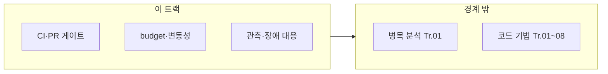

이 트랙은 "성능이 다시 느려지지 않게 만드는 시스템"을 책임집니다. µs 단위에서는 작은 변경도 레이턴시 분포를 망칠 수 있으므로, 성능을 제품 품질의 일부로 운영합니다.

## 이 트랙이 책임지는 범위

한 번 잡은 성능을 계속 유지하려면, 회귀를 자동으로 감지하고 팀 프로세스에 강제하는 장치가 필요합니다. 다음 네 가지가 그 장치를 이룹니다.

- 성능 테스트/벤치마크 자동화(재현 가능한 환경과 기준선)
- PR 단위 성능 검증(허용 오차, 실패 시 대응)
- performance budget 운영(핫패스 예산, tail latency 예산)
- 릴리즈/배포 과정에서의 성능 체크(게이트, 롤백 기준)

## 이 트랙이 다루지 않는 것 (경계)

이 트랙은 "이미 확보한 성능을 지키는 절차"만 다루고, 성능을 처음 만들어내는 작업은 각 전문 트랙의 몫입니다.

- 각 레이어(C++/컴파일러/CPU/OS)의 구체 최적화 기법 (→ 각 트랙)
- 최초 성능 개선을 위한 병목 분석 상세 (→ 프로파일링 트랙)

흔한 오해 하나를 짚으면: "성능 테스트를 자동화하고 CI에 넣기만 하면 회귀가 저절로 사라진다"는 생각입니다. 실제로는 벤치마크 결과의 변동성(노이즈)을 관리하지 않으면 게이트가 너무 자주 실패해 팀이 알림을 무시하기 시작하거나(피로도), 반대로 임계값을 너무 느슨하게 잡아 실제 회귀를 놓칩니다. [Google SRE Book, "Monitoring Distributed Systems"](https://sre.google/sre-book/monitoring-distributed-systems/)가 지적하듯, 알림은 "행동으로 이어질 수 있을 만큼만" 울려야 하며, 이 트랙의 06(기준선)·07(변동성 관리)·09(알림 전략) 챕터가 정확히 이 균형을 다룹니다.

## 커리큘럼

**난이도 범례**: **기초**(입문) · **중급**(실무 핵심) · **심화**(깊은 분석·전문 주제) · **전문**(극한·니치). **Tr.NN**은 `optimization-NN-*` 트랙을 가리킵니다.

이 트랙은 **번호 순서대로(01 → 17) 읽으면 됩니다.** 01은 “무엇을 회귀라고 부를지”를 먼저 정의하고, 02–04는 자동화·CI·PR 게이트의 최소 골격을 만들며, 06은 기준선 개념을 안정시켜 줍니다.

| 챕터 | 제목 | 난이도 | 핵심 내용 |
|------|------|--------|-----------|
| 01 | 성능 회귀란 무엇인가 | 기초 | 성능 회귀의 정의·발생 원인·영향 범위와 탐지 직관 |
| 02 | 성능 테스트 자동화 | 기초 | 성능 테스트 자동화 구축 |
| 03 | 벤치마크 CI 통합 | 중급 | 벤치마크 CI 통합, CodSpeed 2026 기능 확장(메모리 계측·AI Wizard·MCP 서버·환경 변화 탐지)과 Bencher의 베어메탈 동일성 벤치마킹 |
| 04 | PR 성능 게이트 | 중급 | PR 단위 성능 게이트 |
| 05 | Performance Budget 운영 | 심화 | Performance budget 운영 |
| 06 | 기준선 관리 | 중급 | 성능 기준선 관리 |
| 07 | 변동성 관리 | 심화 | 성능 변동성 관리 |
| 08 | 관측 가능성 플랫폼 | 심화 | 성능 관측 가능성 플랫폼 |
| 09 | 알림 전략 | 중급 | 성능 알림 전략 |
| 10 | 카나리 배포 | 심화 | 카나리 배포와 성능 검증 |
| 11 | 성능 장애 대응 | 중급 | 성능 장애 대응 프로세스 |
| 12 | 장기 추세 분석 | 심화 | 장기 성능 추세 분석 |
| 13 | 성능 부채 관리 | 중급 | 성능 부채 관리 |
| 14 | Benchmark as Code | 중급 | GitHub Actions/GitLab CI 기반 벤치마크 자동화 예시 |
| 15 | 모니터링 대시보드 | 중급 | Grafana, Prometheus 기반 성능 모니터링 대시보드 설계 |
| 16 | Post-mortem 분석 | 중급 | 성능 장애 사후 분석 템플릿과 프로세스 |
| 17 | 분산·클러스터 성능 회귀 | 전문 | 샤딩·다중 리전·샘플링과 벤치마크 하이브리드 게이트 |

## 측정과 검증 (이 트랙 기준)

이 트랙의 측정은 "한 번 확인하고 끝"이 아니라 계속 반복되는 것을 전제로 하므로, 사람이 매번 눈으로 판단하지 않아도 되도록 계약·기준·추세로 고정하는 데 초점을 둡니다.

- 성능 지표를 "테스트 가능한 계약"으로 만들기
- 분포 기반 기준(p95/p99/p999)과 변동성 관리
- 장기 추세 관측으로 성능 부채를 조기에 발견

## 추천 선행/병행 트랙

- **선행**: Low-latency 프로파일링·성능 분석 (Tr.01), 성능 설계·의사결정 (Tr.11)
- **병행**: Tr.01–08 전부 (최적화 성과를 **지속**시키는 장치)

> **"빠르게 만드는 것"보다 "빠른 상태를 유지하는 것"이 더 어렵습니다.** 이 트랙은 지속 가능성을 담당합니다.

## 왜 이 트랙인가 (동기)

한 번 최적화해도 PR마다 레이턴시 분포는 흔들립니다. 벤치마크가 없으면 “언제 느려졌는지”조차 알기 어렵고, 있어도 **변동성·기준선·게이트**가 없으면 무시되기 쉽습니다. 이 트랙은 Tr.01에서 만든 측정 역량을 **팀 운영 규칙**으로 고정합니다.

## Phase별 학습 궤적

**Phase A — 정의·자동화 기초 (챕터 01–04, 14)** 회귀의 정의를 먼저 잡고 테스트·CI·PR 게이트를 연결합니다. Tr.01의 벤치 설계가 없으면 게이트가 노이즈에 무력화됩니다.

**Phase B — 예산·변동성·관측 (챕터 05–09)** performance budget과 알림은 Tr.11 SLO와 맞물립니다.

**Phase C — 릴리즈·장기 (챕터 10–13, 15–16, 17)** 카나리, 장애 대응, 추세, 부채, 대시보드, 포스트모템, 분산·클러스터 회귀는 **심화–전문** 운영 주제입니다.

## 이 트랙을 마친 후 달성할 목표

- **구축**: 성능 회귀를 PR 단위로 잡을 최소 파이프라인을 설명할 수 있다.
- **운영**: p95/p99 기준과 변동성 허용 범위를 문서화할 수 있다.
- **연계**: Tr.11 목표와 Tr.12 게이트가 어떻게 맞물리는지 그릴 수 있다.

## 평가 기준과 이 장을 읽은 후 확인

위 목표를 "설명할 수 있다"에서 그치지 않고, 실제로 아래를 실습해봤는지 스스로 점검합니다.

- [ ] 자신의 프로젝트에 PR 단위 성능 게이트를 실제로 붙여 본 적이 있는가?
- [ ] 벤치마크 결과의 변동성(노이즈)을 실제로 측정하고, 그에 맞춰 임계값을 조정해 본 적이 있는가?
- [ ] 카나리 배포나 롤백 기준을 실제 릴리즈 프로세스에 적용해 본 적이 있는가?

## 범위와 경계

## 심화·전문가 확장 궤적

지속적 프로파일링(Tr.01)과 모니터링 대시보드(챕터 15)를 함께 설계하면, 프로덕션 꼬리 지연과 CI 벤치의 괴리를 줄일 수 있습니다.

## 시리즈 전체 로드맵

12개 트랙의 권장 순서·심화 진입 조건은 <strong>[Low-latency 최적화 시리즈 개요](/post/low-latency-optimization-series/getting-started-low-latency-optimization-series-overview/)</strong>를 참고하세요.

## 지금 바로 이어 읽을 곳

**01 → 02 → 03** 순으로 읽으면 성능 회귀의 정의에서 테스트 자동화·벤치마크 CI 통합까지 이어집니다.

- [성능 회귀란 무엇인가](/post/regression-prevention/performance-regression-definition-detection-fundamentals/) (챕터 01)
- [성능 테스트 자동화 구축](/post/regression-prevention/performance-test-automation-fundamentals/) (챕터 02)
- [벤치마크 CI 통합](/post/regression-prevention/benchmark-ci-integration-codspeed-bencher/) (챕터 03)
