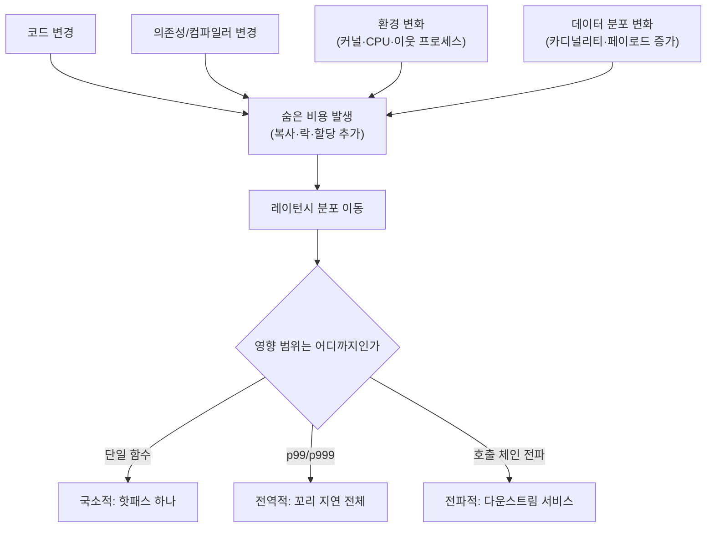

<strong>성능 회귀(Performance Regression)</strong>란 소프트웨어가 이전과 똑같이 정확한 결과를 내면서도 이전보다 느려지거나 더 많은 자원(CPU, 메모리, I/O)을 쓰게 된 상태를 말합니다. 기능 테스트는 여전히 통과하기 때문에 회귀가 조용히 배포되기 쉽고, µs 단위 지연을 다루는 시스템에서는 이 조용함이 곧 사고로 이어집니다. 이 장은 회귀를 "코드가 깨졌다"는 감각이 아니라 "분포가 이동했다"는 감각으로 다시 정의하고, 무엇이 회귀를 만들며 그 영향이 어디까지 번지는지, 그리고 회귀와 측정 노이즈를 어떻게 구분하기 시작하는지를 다룹니다. 이 트랙의 나머지 챕터가 다루는 자동화·게이트·기준선·변동성 관리는 모두 이 장에서 정의하는 개념 위에 세워집니다.

## 이 장을 읽기 전에

**완전한 초보자?** 이 장은 특정 선행 챕터를 요구하지 않습니다. [트랙 인트로](/post/regression-prevention/getting-started-performance-regression-prevention-strategies/)에서 이 트랙 전체의 책임 범위를 확인했다면 바로 읽을 수 있고, [챕터 02: 성능 테스트 자동화](/post/regression-prevention/performance-test-automation-fundamentals/)를 읽기 전에 먼저 이 장을 읽는 것을 권장합니다. "회귀가 무엇인지" 정의 없이 자동화부터 만들면 무엇을 잡아야 하는지 애매해지기 때문입니다.

**전제 지식**: `std::string`이나 STL 컨테이너가 힙 할당을 쓴다는 정도의 C++ 감각, 그리고 "레이턴시는 평균이 아니라 분포로 본다"는 감각이 있으면 충분합니다. 마이크로벤치마크 도구 사용법 자체는 전제하지 않습니다.

**이 장의 깊이**: 이 장은 **기초** 난이도로, 개념과 직관을 다룹니다. "탐지"는 통계적으로 유의한지 판단하는 감각까지만 다루고, 실제 자동화 파이프라인 구축은 [챕터 02](/post/regression-prevention/performance-test-automation-fundamentals/), CI 통합은 [챕터 03](/post/regression-prevention/benchmark-ci-integration-codspeed-bencher/), 노이즈와 변동폭을 정량적으로 다루는 통계 기법은 [챕터 07](/post/regression-prevention/performance-variance-noise-management/), 기준선 관리 정책은 [챕터 06](/post/regression-prevention/performance-baseline-management-strategy/)로 위임합니다. **다루지 않는 것**: 프로파일러로 병목을 찾는 방법(→ [Tr.01 프로파일링 트랙](/post/profiling-analysis/getting-started-profiling-performance-analysis-fundamentals/))과 분산 환경에서의 회귀 판단(→ [챕터 17](/post/regression-prevention/distributed-cluster-performance-regression-expert/))입니다.

## 당신의 수준에 맞는 경로

| 수준 | 읽을 부분 | 핵심 목표 |
|------|---------|---------|
| **초보자** | "성능 회귀 개념의 역사와 배경" ~ "발생 원인" | 회귀가 버그와 다르다는 것과 4가지 발생 원인 이해 |
| **중급자** | "왜 조용히 숨는가" ~ "흔한 오개념" | 회귀가 기능 테스트를 통과하는 이유와 영향 범위 구분 |
| **전문가** | "판단 기준" ~ "비판적 시각" | 회귀 vs 노이즈 판단과 팀마다 회귀 정의가 달라지는 이유 |

## 성능 회귀 개념의 역사와 배경

회귀(regression)라는 용어는 원래 "이전에는 되던 기능이 다시 안 되는 것"을 가리키는 기능 회귀 테스트에서 왔습니다. 성능 회귀는 이 개념을 확장한 것으로, 기능적으로는 완전히 정상이면서 속도나 자원 사용량만 나빠진 경우를 가리킵니다.

> "A software performance regression is a situation where the software still functions correctly, but performs more slowly or uses more memory or resources than before." — [Wikipedia: Software regression](https://en.wikipedia.org/wiki/Software_regression)

이 정의가 실무에 자리 잡은 배경에는 대규모 브라우저·런타임 프로젝트의 지속적 벤치마킹 문화가 있습니다. Chromium 프로젝트는 커밋마다 성능 대시보드에 결과를 쌓고, 회귀 전담 담당자가 로테이션으로 알림을 확인해 이분 탐색(bisect)으로 원인 커밋을 찾는 **Perf Regression Sheriffing** 체계를 오래 운영해 왔습니다. 이런 체계가 필요했던 이유는 단순합니다. 개별 PR 작성자는 자신의 변경이 다른 함수의 캐시 지역성이나 락 경합에 미치는 영향을 예측하기 어렵고, 회귀는 대개 한 커밋의 문제가 아니라 여러 작은 변경이 누적된 결과로 드러나기 때문입니다.

같은 시기에 학계에서도 벤치마크 결과 자체가 신뢰할 수 없을 수 있다는 문제가 제기되었습니다. Georges, Buytaert, Eeckhout의 2007년 논문은 JVM 워밍업·GC·스레드 스케줄링이 만드는 실행 시간 변동이 통계적으로 엄밀하게 통제되지 않으면 "회귀처럼 보이는 노이즈"와 "진짜 회귀"를 구분할 수 없다는 점을 정량적으로 보였습니다. 이 통찰은 C++ 마이크로벤치마크에도 그대로 적용되며, 이 트랙이 자동화·기준선·변동성 관리를 별도 챕터로 나눠 다루는 이유이기도 합니다.

## 성능 회귀란 무엇인가: 정의와 판별

<strong>성능 회귀는 "정확성은 그대로인데 성능 지표가 이전보다 나빠진 상태"</strong>로 정의합니다. 여기서 핵심은 두 가지 대비입니다. 첫째, 회귀는 버그가 아닙니다. 출력은 여전히 맞고, 단위 테스트도 여전히 통과합니다. 둘째, 회귀는 절대적 느림이 아니라 **상대적** 느림입니다. "느리다"가 아니라 "이전보다 느려졌다"이므로, 비교할 **기준선(baseline)** 없이는 회귀라는 판단 자체가 성립하지 않습니다.

성능 지표는 레이턴시(주로 p50/p95/p99 같은 분위수), 처리량(초당 처리 요청 수), 자원 사용량(CPU 사이클, 메모리 상주량, 할당 횟수), 비용(같은 처리량을 내는 데 드는 인스턴스 시간) 중 하나 이상으로 표현됩니다. 어떤 지표를 기준으로 삼을지는 워크로드 성격에 따라 다르며, 지표 자체의 선택과 SLO 연계는 [Tr.11: 성능 설계·의사결정](/post/design-decisions/getting-started-performance-design-decision-making/)의 영역입니다. 이 장에서는 "회귀를 판단하려면 지표와 기준선이 먼저 고정되어야 한다"는 전제만 확인하고 넘어갑니다.

## 발생 원인: 코드·의존성·환경·데이터 변화

성능 회귀는 크게 네 갈래에서 발생합니다. 실무에서는 이 네 갈래를 구분하는 것 자체가 원인 조사의 첫 단계입니다. 같은 증상(지연 증가)이라도 원인 범주가 다르면 대응(코드 롤백, 의존성 핀 고정, 인프라 조정, 데이터 재설계)이 완전히 달라지기 때문입니다.

**코드 변경**은 가장 흔하고 가장 추적하기 쉬운 원인입니다. 알고리즘 복잡도가 바뀌거나(O(n) 순회가 O(n²)로), 핫패스에 락·할당·가상 호출이 새로 끼어들거나, 리팩토링 과정에서 참조로 받던 값을 값으로 받게 되는 식의 미묘한 변화가 여기 속합니다. 아래 예시는 기능적으로 완전히 동일한 리팩토링이 핫패스에 복사 비용을 끼워 넣는 전형적인 패턴을 보여줍니다.

```cpp
#include <string>
#include <vector>

struct Record {
  std::string key;
  std::string payload;  // 수백 바이트 이상일 수 있음
};

long long checksum_before(const std::vector<Record>& records) {
  // 회귀 이전: const 참조로 순회, 복사 없음
  long long sum = 0;
  for (const auto& r : records) {
    sum += static_cast<long long>(r.key.size() + r.payload.size());
  }
  return sum;
}

long long checksum_after(const std::vector<Record>& records) {
  // 회귀 유입: auto가 참조를 잃으면서 반복마다 Record 전체가 복사됨
  // (key, payload 두 string의 힙 버퍼가 매 반복 새로 할당·해제됨)
  long long sum = 0;
  for (auto r : records) {
    sum += static_cast<long long>(r.key.size() + r.payload.size());
  }
  return sum;
}
```

두 함수는 코드 리뷰에서 "타입 추론을 `auto`로 정리했다"는 정도로만 보이고, 반환값도 완전히 같습니다. 그런데 `checksum_after`는 레코드 수만큼 `std::string` 복사 생성자를 호출하므로, 레코드가 많고 `payload`가 SSO 임계값을 넘는 크기라면 반복마다 힙 할당·해제가 새로 발생합니다. 이런 변화는 컴파일 경고도, 정적 분석 경고도 트리거하지 않는 경우가 많고, 단위 테스트는 여전히 통과합니다. 오직 레이턴시 측정만이 이 회귀를 드러냅니다.

**의존성 변경**은 라이브러리·컴파일러·런타임 버전을 올릴 때 발생합니다. 표준 라이브러리 구현이 바뀌면 컨테이너의 성장 배율이나 해시 함수가 바뀔 수 있고, 컴파일러 버전이 바뀌면 동일한 소스에서도 인라이닝·벡터화 판단이 달라져 코드를 한 줄도 건드리지 않았는데 생성된 기계어가 달라집니다. 전이 의존성(transitive dependency)이 조용히 올라가는 경우가 특히 위험한데, 직접 수정한 파일이 없으니 원인 후보에서 아예 배제되기 쉽습니다.

**환경 변화**는 코드·의존성이 그대로여도 실행 조건이 바뀌어 발생합니다. 커널 버전 업그레이드가 시스템 콜 비용을 바꾸거나, CPU 마이크로코드 업데이트가 특정 보안 완화 기법을 강제로 켜면서 분기 예측·투기 실행 성능에 영향을 주거나, 컨테이너 환경에서 이웃 프로세스(noisy neighbor)가 캐시·메모리 대역폭을 잠식하는 경우가 여기 속합니다. CI 러너가 공유 클라우드 인스턴스일 때는 이런 변화가 팀의 통제 밖에 있으므로, 회귀처럼 보이는 신호가 실제로는 환경 변화일 가능성을 항상 열어 둬야 합니다.

**데이터 변화**는 코드·의존성·환경이 전부 동일해도 입력 분포가 성장하거나 바뀌면서 성능이 나빠지는 경우입니다. 해시맵의 키 카디널리티가 늘어 충돌이 잦아지거나, 캐시에 담기던 작업 세트가 데이터 증가로 캐시 크기를 넘어서거나, 페이로드 크기가 커져 SSO나 인라인 버퍼의 이점이 사라지는 식입니다. 이 원인은 배포 시점에는 드러나지 않고 서비스가 성장한 뒤에야 나타나므로, "최근에 아무것도 안 바꿨는데 느려졌다"는 보고의 상당수가 여기 해당합니다.

## 왜 조용히 숨는가: 메커니즘과 영향 범위

성능 회귀가 기능 테스트를 통과하는 이유는 단순합니다. 단위 테스트는 "결과가 맞는가"만 확인하고 "얼마나 걸렸는가"는 확인하지 않습니다. 위 예시의 복사 비용, 새로 끼어든 락, 캐시 미스 증가는 모두 **실행 경로**가 아니라 **실행 비용**에만 영향을 주므로, 어서션(assertion) 기반 테스트의 관측 범위 밖에 있습니다. 이 비용을 드러내려면 시간·자원을 직접 측정하는 별도의 계측이 필요하며, 그 계측을 자동화하는 것이 [챕터 02](/post/regression-prevention/performance-test-automation-fundamentals/)의 몫입니다.

숨는 방식은 하나가 아닙니다. 원인이 결과로 나타나기까지의 경로를 정리하면 다음과 같습니다.



**국소적 영향**은 특정 함수나 모듈 하나의 실행 시간만 늘어나는 경우입니다. 호출 빈도가 낮거나 다른 작업과 겹쳐 실행되면 전체 처리량에는 잘 드러나지 않을 수 있습니다. **전역적 영향**은 평균은 그대로인데 p99·p999 같은 꼬리 지연만 나빠지는 경우로, 락 경합이나 GC 정지처럼 "가끔 크게 걸리는" 패턴에서 흔히 나타납니다. 평균만 보는 대시보드는 이런 회귀를 통째로 놓칩니다. **전파적 영향**은 한 서비스의 지연 증가가 호출 체인을 타고 상류 서비스의 타임아웃·재시도를 유발해 시스템 전체의 처리량을 끌어내리는 경우로, 마이크로서비스 환경에서 가장 다루기 어렵습니다. 여러 리전·샤드에 걸친 전파 패턴을 판단하는 구체적 기법은 [챕터 17: 분산·클러스터 성능 회귀](/post/regression-prevention/distributed-cluster-performance-regression-expert/)에서 다룹니다.

## 흔한 오개념

<strong>"성능 회귀는 결국 버그의 일종이다"</strong>라는 생각은 틀립니다. 버그는 출력이 틀리는 것이고, 회귀는 출력은 맞으면서 비용만 늘어나는 것입니다. 이 둘을 같은 취급하면 회귀를 "언젠가 고치면 되는 사소한 문제"로 미루기 쉽지만, 저지연 시스템에서는 비용 증가 자체가 SLO 위반으로 직결되는 1급 결함입니다.

<strong>"평균 실행 시간이 같으면 회귀가 없다"</strong>는 것도 흔한 오해입니다. 락 경합, 캐시 스래싱, GC 정지 같은 원인은 대부분의 요청에는 영향을 주지 않고 일부 요청만 크게 늦추므로, 평균은 그대로여도 p99·p999는 크게 나빠질 수 있습니다. 분위수를 함께 보지 않으면 가장 해로운 회귀를 놓칩니다.

<strong>"CI에서 잡히지 않으면 회귀가 아니다"</strong>라는 가정도 위험합니다. CI 환경의 워크로드·데이터 규모·하드웨어가 프로덕션과 다르면, 데이터 카디널리티에 의존하는 회귀나 특정 CPU 세대에서만 드러나는 회귀는 CI를 통과한 채 배포됩니다. CI 게이트는 회귀를 잡는 하나의 그물이지 완전한 보증이 아닙니다.

## 판단 기준: 회귀인가 노이즈인가

측정값이 나빠졌다고 곧바로 회귀라고 단정할 수는 없습니다. 반복 측정 자체가 워밍업 상태, 스레드 스케줄링, 열 스로틀링 때문에 흔들리기 때문입니다. 아래는 "회귀로 다뤄야 할 신호"와 "노이즈로 의심해야 할 신호"를 구분하는 실무 기준입니다. 통계적 유의성을 정식으로 검증하는 절차(변동폭 추정, 검정 방법 선택)는 [챕터 07: 성능 변동성 관리](/post/regression-prevention/performance-variance-noise-management/)에서 다룹니다.

| 신호 | 회귀로 볼 근거 | 노이즈로 볼 근거 |
|------|--------------|----------------|
| 재현성 | 동일 커밋을 재실행해도 반복적으로 나빠짐 | 재실행하면 원래 수준으로 돌아옴 |
| 변화 폭 | 기존 변동 범위(런투런 편차)를 뚜렷이 벗어남 | 과거에도 관측되던 변동 범위 안 |
| 원인 후보 | 최근 커밋에 핫패스 변경·의존성 업데이트가 있음 | 최근 변경 없이 환경(러너·이웃 프로세스)만 다름 |
| 분포 형태 | 분포 전체 또는 꼬리가 일관되게 이동 | 이상치 한두 개만 튀고 나머지는 그대로 |
| 영향 지속성 | 이후 커밋에서도 계속 유지됨 | 다음 실행에서 사라짐 |

## 비판적 시각: 한계와 논쟁

"성능 회귀"라는 이름표는 생각보다 합의된 기준이 아닙니다. 어떤 변화 폭부터 회귀로 부를지는 팀마다 다르고, 그 임계값을 너무 낮게 잡으면 사소한 노이즈에도 알림이 울려 알림 피로(alert fatigue)를 만듭니다. 반대로 임계값을 너무 높게 잡으면 실제 회귀가 여러 건 누적된 뒤에야 발견됩니다. 이 균형점을 어디에 둘지는 [챕터 09: 성능 알림 전략](/post/regression-prevention/performance-alerting-strategy-design/)의 문제이지만, 균형점이 존재한다는 사실 자체가 "회귀"라는 판정이 순수하게 객관적이지 않다는 뜻이기도 합니다.

또한 모든 성능 저하가 나쁜 것은 아닙니다. 정확성 버그를 고치기 위해 추가 검증 로직을 넣으면서 의도적으로 몇 퍼센트 느려지는 변경은 "회귀"라는 이름으로 게이트에 걸리더라도 되돌려서는 안 되는 트레이드오프입니다. 자동화된 게이트가 이런 의도적 저하와 실수로 인한 저하를 구분하지 못하면, 팀은 게이트를 신뢰하지 않고 우회하는 습관을 들이게 됩니다. 마지막으로, 모든 경로와 모든 데이터 규모에서 회귀를 완벽하게 측정하는 것은 비용이 매우 크므로, 실무에서는 핫패스와 대표 워크로드를 선별해 측정 범위를 의도적으로 좁히며, 이 좁힘 자체가 일부 회귀를 놓칠 위험을 내포합니다.

## 평가 기준 (학습 성과 목표)

- [ ] 성능 회귀와 기능 버그의 차이를 "결과 정확성 vs 비용"으로 설명할 수 있다.
- [ ] 코드·의존성·환경·데이터 변화라는 네 가지 발생 원인을 구분하고 각각의 예시를 들 수 있다.
- [ ] 회귀가 왜 단위 테스트를 통과하는지, 그리고 국소적·전역적·전파적 영향의 차이를 설명할 수 있다.
- [ ] 평균이 같아도 꼬리 지연(p99/p999)에서 회귀가 숨을 수 있다는 것을 설명할 수 있다.
- [ ] 측정값 악화가 회귀인지 노이즈인지 판단하는 최소 기준(재현성·변화 폭·원인 후보)을 적용할 수 있다.

## 용어 정리

| 용어 | 설명 |
|------|------|
| **성능 회귀** | 정확성은 유지한 채 레이턴시·처리량·자원 사용량이 이전보다 나빠진 상태 |
| **기준선(Baseline)** | 회귀 여부를 판단하는 비교 대상이 되는 이전 측정값 또는 측정 분포 |
| **꼬리 지연(Tail Latency)** | p95/p99/p999처럼 분포의 끝부분에서 나타나는 지연으로, 평균에는 드러나지 않는 경우가 많음 |
| **노이즈(Noise)** | 코드 변경과 무관하게 반복 측정 사이에 발생하는 자연스러운 변동 |
| **이분 탐색(Bisect)** | 회귀가 어느 커밋에서 시작됐는지 이진 탐색으로 좁혀 찾는 기법 |

## 자주 묻는 질문

**Q: 회귀 판단에 반드시 통계 검정이 필요한가요?**
A: 엄밀하게 하려면 필요하지만, 이 장 수준에서는 재현성과 과거 변동 범위 대비 변화 폭만으로도 1차 판단이 가능합니다. 정식 검정 방법과 임계값 설계는 [챕터 07](/post/regression-prevention/performance-variance-noise-management/)에서 다룹니다.

**Q: 의존성 업데이트로 인한 회귀는 어떻게 대응하나요?**
A: 우선 버전을 고정(pin)해 회귀를 되돌린 뒤, 별도 브랜치에서 원인을 재현하고 업스트림 이슈 여부를 확인합니다. 이 판단을 CI 파이프라인에 통합하는 방법은 [챕터 03](/post/regression-prevention/benchmark-ci-integration-codspeed-bencher/)에서 다룹니다.

**Q: 데이터 성장으로 인한 회귀는 코드 리뷰로 막을 수 있나요?**
A: 대부분 막기 어렵습니다. 리뷰 시점에는 데이터가 아직 그 규모에 도달하지 않았기 때문입니다. 대신 대표 데이터 규모를 반영한 벤치마크와 장기 추세 관측이 필요하며, 후자는 [챕터 12: 장기 추세 분석](/post/regression-prevention/long-term-performance-trend-analysis/)에서 다룹니다.

## 더 읽을 거리

- [Wikipedia: Software regression](https://en.wikipedia.org/wiki/Software_regression) — 기능 회귀와 성능 회귀의 정의를 함께 다루는 개괄 문서
- [Chromium: Perf Sheriffing](https://www.chromium.org/developers/tree-sheriffs/perf-sheriffs/) — 대규모 프로젝트가 회귀 알림과 이분 탐색을 로테이션으로 운영하는 실무 사례
- [Georges, Buytaert, Eeckhout (2007): Statistically Rigorous Java Performance Evaluation](https://www2.ccs.neu.edu/racket/Performance/andy-georges-paper.pdf) — 반복 측정과 통계적 엄밀성 없이는 회귀와 노이즈를 구분할 수 없다는 것을 보인 고전 논문

## 다음 장에서는

**이전 장**: 없음 — 이 장은 [트랙 인트로](/post/regression-prevention/getting-started-performance-regression-prevention-strategies/)를 읽은 뒤 챕터 02보다 먼저 읽는 개념 장입니다.

이 장에서 정의한 "회귀"와 "기준선" 개념을 실제로 자동화하려면 **성능 테스트 자동화 구축**이 다음 단계입니다. 회귀를 어떤 원인 범주로 분류했는지가 실패 시 대응 방식(코드 롤백, 의존성 핀 고정, 인프라 조정)을 정하므로, 자동화를 설계할 때도 이 장의 네 가지 원인 구분을 계속 참조하게 됩니다. 트랙 전체를 다시 조망하려면 [시리즈 전체 로드맵](/post/low-latency-optimization-series/getting-started-low-latency-optimization-series-overview/)도 참고하세요.

→ [성능 테스트 자동화 구축](/post/regression-prevention/performance-test-automation-fundamentals/) (챕터 02)
