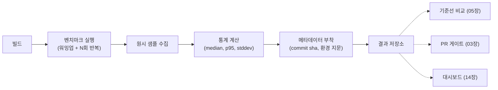

**성능 테스트 자동화**란 사람이 수동으로 벤치마크를 돌리고 숫자를 눈으로 비교하던 과정을, CI 파이프라인이 매 커밋·매 PR마다 스스로 실행하고 결과를 저장하는 시스템으로 바꾸는 작업을 말합니다. 동기는 단순합니다. 사람이 "느려진 것 같다"고 느낄 때는 이미 여러 커밋이 쌓여 원인을 좁히기 어려운 시점이고, 벤치마크를 로컬에서만 가끔 돌리면 실행할 때마다 환경이 달라 숫자를 신뢰하기 어렵습니다. 이 장은 이 문제를 "매번 같은 방식으로 실행되고, 결과가 항상 어딘가에 쌓이는" 최소한의 자동화 골격으로 해결하는 방법을 다룹니다.

## 이 장을 읽기 전에

**완전한 초보자?** 이 장은 [00장: 트랙 인트로](/post/regression-prevention/getting-started-performance-regression-prevention-strategies/)에서 이 트랙이 다루는 범위를 확인했다는 것을 전제로 합니다. CI 파이프라인이 "커밋 시 자동으로 빌드·테스트를 실행하는 시스템"이라는 정도의 개념과, [Tr.01 프로파일링·성능 분석 인트로](/post/profiling-analysis/getting-started-profiling-performance-analysis-fundamentals/)에서 다루는 마이크로벤치마크 하네스(Google Benchmark 등)의 기본 사용법을 알고 있으면 충분합니다. 아직 "회귀"라는 말 자체가 낯설다면 [17장: 성능 회귀란 무엇인가](/post/regression-prevention/performance-regression-definition-detection-fundamentals/)를 먼저 읽는 것을 권장합니다.

**이 장의 깊이**: 이 장은 **기초** 난이도입니다. "성능 테스트를 CI에 어떻게 얹는가"의 아키텍처 — 트리거, 실행 환경, 결과 수집 — 를 다루되, 특정 벤더·도구의 세부 사용법까지는 들어가지 않습니다. **다루지 않는 것**: CodSpeed·Bencher 같은 구체적 SaaS 통합과 도구 선택([02장](/post/regression-prevention/benchmark-ci-integration-codspeed-bencher/)), PR을 언제 통과·차단시킬지의 정책 설계([03장](/post/regression-prevention/pr-performance-gate-design/)), 결과를 어떻게 기준선으로 승격·갱신할지의 전략([05장](/post/regression-prevention/performance-baseline-management-strategy/)), 측정 노이즈의 통계적 처리([06장](/post/regression-prevention/performance-variance-noise-management/)), GitHub Actions·GitLab CI 구체 워크플로 파일 작성([13장](/post/regression-prevention/benchmark-as-code-github-actions-gitlab-ci/))입니다. 이 장은 그 모든 챕터가 딛고 설 **바닥**을 놓는 역할만 합니다.

## 당신의 수준에 맞는 경로

| 수준 | 읽을 부분 | 핵심 목표 |
|------|---------|---------|
| **초보자** | "역사와 배경" ~ "핵심 개념" | 왜 수동 벤치마킹으로는 부족한지, 자동화의 세 축이 무엇인지 이해 |
| **중급자** | "반복 가능한 실행 환경 설계" ~ "결과 수집 파이프라인 설계" | 노이즈 원인을 통제하고 결과를 구조화된 형태로 쌓는 방법 습득 |
| **전문가** | "판단 기준" ~ "비판적 시각" | 전용 러너 투자 시점과 파이프라인 자체의 한계·유지비용 판단 |

## 역사와 배경: 왜 성능 테스트를 자동화하는가

성능 테스트를 CI에 자동으로 얹는다는 아이디어는 새롭지 않습니다. **LLVM 프로젝트**는 2010년대 초반부터 **[LNT](https://llvm.org/docs/lnt/)**라는 성능 추적 인프라를 운영해 왔습니다. LNT는 벤치마크 실행 커맨드라인 도구와, 결과를 저장·시각화하는 웹 애플리케이션으로 구성되며, 커밋마다 LLVM이 생성한 코드의 성능을 추적해 회귀를 사후(post-commit)에 잡아내는 것을 주 목적으로 설계되었습니다. 핵심은 "머신·테스트 스위트·실행(run)·샘플"이라는 개념으로 데이터를 구조화해, 시간에 따른 성능 변화를 추적 가능하게 만든 것입니다.

**Rust 컴파일러 팀**의 `rustc-perf`도 비슷한 문제의식에서 출발했습니다. rustc-dev-guide는 이 파이프라인을 다음과 같이 설명합니다.

> "After every PR is merged, a suite of benchmarks are run against the compiler." — [Rust Compiler Development Guide: Performance testing](https://rustc-dev-guide.rust-lang.org/tests/perf.html)

즉 PR이 머지될 때마다 벤치마크 스위트가 자동으로 실행되고, 그 결과가 [perf.rust-lang.org](https://perf.rust-lang.org/)에 시계열로 누적됩니다. 두 사례 모두 공통적으로 "사람이 수동으로 실행 버튼을 누르는 대신, 커밋이라는 이벤트가 자동으로 실행을 트리거하고, 결과는 항상 같은 곳에 같은 형식으로 쌓인다"는 원칙을 따릅니다. 이 원칙이 바로 이 장에서 다룰 자동화의 본질이고, 이후 챕터들이 다루는 CI 통합·PR 게이트·기준선 관리는 모두 이 골격 위에 세워지는 정책들입니다.

## 핵심 개념: 성능 테스트 자동화의 세 축

성능 테스트 자동화는 세 가지 요소가 맞물려야 완성됩니다. 첫째는 **트리거 통합**으로, "언제 벤치마크를 실행할 것인가"를 정하는 부분입니다. 매 커밋마다, 매 PR마다, 혹은 야간 배치(nightly)로 실행할 수 있고, 트리거 빈도가 높을수록 회귀를 빠르게 잡지만 실행 비용도 커집니다. 둘째는 **반복 가능한 실행 환경**으로, 같은 코드를 같은 방식으로 실행했을 때 매번 비슷한 숫자가 나오도록 만드는 부분입니다. 셋째는 **결과 수집 파이프라인**으로, 실행 결과를 구조화된 형태로 저장해 다음 챕터들(기준선 비교, 게이트 판정, 대시보드)이 소비할 수 있게 만드는 부분입니다.

이 장은 이 중 뒤의 두 축 — 실행 환경과 결과 수집 — 에 집중합니다. 트리거 통합의 구체적인 CI 설정은 [13장: Benchmark as Code](/post/regression-prevention/benchmark-as-code-github-actions-gitlab-ci/)에서, 트리거된 결과를 PR 통과·차단에 쓰는 정책은 [03장](/post/regression-prevention/pr-performance-gate-design/)에서 다룹니다. 여기서는 "벤치마크가 실행되는 순간"부터 "결과가 저장소에 안착하는 순간"까지의 파이프라인 자체를 설계하는 데 집중합니다.

## 반복 가능한 실행 환경 설계

성능 테스트가 유닛 테스트와 근본적으로 다른 점은, **같은 입력에 같은 코드를 실행해도 매번 다른 숫자가 나온다**는 것입니다. 유닛 테스트는 assert가 참인지 거짓인지만 판정하면 되지만, 성능 테스트는 "이 숫자가 정말 코드 변화 때문인지, 아니면 실행 환경의 잡음 때문인지"를 구분해야 합니다. 이 구분이 안 되면 이후 챕터의 기준선 비교나 PR 게이트가 아무리 정교해도 무의미합니다.

잡음의 주요 원인은 다음과 같습니다.

- **CPU 주파수 스케일링과 터보 부스트**: 코어 온도·전력 상태에 따라 클럭이 실행 도중 변하면, 같은 코드도 실행 시점마다 다른 속도로 돕니다.
- **공유 CI 러너의 다중 테넌시**: GitHub Actions의 공용 러너나 공유 클라우드 VM은 다른 워크로드와 물리 자원을 나눠 쓰므로, "이웃 소음(noisy neighbor)"이 측정값에 섞입니다.
- **컨테이너 오버헤드**: cgroup 제약, 가상 네트워크 스택, 오버레이 파일시스템은 베어메탈 대비 일정한 오버헤드와 변동성을 추가합니다.
- **콜드 캐시·워밍업 부재**: 첫 실행은 명령어 캐시·데이터 캐시가 비어 있어 이후 실행보다 느립니다. 워밍업 반복 없이 첫 번째 측정값을 그대로 쓰면 실제 코드 변화보다 캐시 상태 차이가 더 크게 나타날 수 있습니다.

이 문제에 대한 실무적 대응은 통제 가능한 만큼 통제하고, 통제할 수 없는 잡음은 다음 챕터([06장](/post/regression-prevention/performance-variance-noise-management/))의 통계적 방법으로 흡수하는 것입니다. 통제 가능한 부분으로는 전용 러너에서 코어 고정(core pinning)과 주파수 고정, 워밍업 반복 후 측정, 고정 반복 횟수(또는 최소 실행 시간) 사용이 있습니다. 아래는 리눅스에서 벤치마크 프로세스를 특정 코어에 고정하고 CPU 거버너를 `performance`로 맞추는 개념 스크립트입니다. 코어 번호·거버너 경로는 하드웨어·커널 버전에 따라 다르므로 실제 러너에서 반드시 확인 후 적용해야 합니다.

```bash
#!/usr/bin/env bash
set -euo pipefail

# 예시: 4번 코어를 벤치마크 전용으로 고정하고, 주파수 스케일링을 끔
# (경로·코어 번호는 배포판·커널·클라우드 벤더에 따라 다름 - 구현 정의)
BENCH_CORE=4

echo performance | sudo tee /sys/devices/system/cpu/cpu${BENCH_CORE}/cpufreq/scaling_governor

# taskset으로 벤치마크 실행을 해당 코어에만 배치
taskset -c "${BENCH_CORE}" ./bench_harness --benchmark_repetitions=10
```

이 스크립트는 "재현 가능한 환경"이 코드 몇 줄이 아니라 **러너 자체의 하드웨어·OS 설정에 대한 합의**라는 점을 보여줍니다. 컨테이너에서 실행한다면 `--cpuset-cpus`로 동일한 효과를 낼 수 있지만, 컨테이너 런타임 자체의 오버헤드는 여전히 남습니다. 전용 베어메탈 러너와 공유 클라우드 러너 중 무엇을 쓸지는 팀의 회귀 탐지 민감도와 예산에 달려 있으며, 이 트레이드오프는 뒤의 판단 기준에서 다시 다룹니다.

## 결과 수집 파이프라인 설계

실행 환경을 통제했다면, 다음은 실행 결과를 **어떻게 저장해서 나중에 비교 가능하게 만들 것인가**입니다. 이 파이프라인은 크게 다섯 단계로 나눌 수 있습니다. 벤치마크 하네스가 원시 샘플(반복 실행별 소요 시간)을 만들고, 이 샘플에서 평균·중앙값·표준편차·백분위수 같은 통계량을 계산하고, 여기에 커밋 해시·타임스탬프·컴파일러 플래그·실행 환경 지문(하드웨어·OS·러너 ID) 같은 메타데이터를 붙이고, 마지막으로 구조화된 형식으로 영속 저장소에 기록합니다.



저장 형식은 팀 규모에 따라 단순한 JSON 파일을 Git 저장소에 커밋하는 방식부터, 시계열 데이터베이스에 직접 쓰는 방식까지 다양합니다. 중요한 것은 형식이 아니라 **최소한 어떤 필드가 항상 있어야 하는가**입니다. 아래는 한 벤치마크 실행 결과를 표현하는 최소 스키마 예시입니다.

```json
{
  "benchmark_name": "BM_ConcatReserveAppend",
  "commit_sha": "a1b2c3d4",
  "timestamp": "2026-07-15T09:00:00Z",
  "environment": {
    "runner_id": "bare-metal-01",
    "cpu_model": "AMD EPYC 7763",
    "governor": "performance",
    "compiler": "gcc-13 -O2"
  },
  "iterations": 10,
  "stats": {
    "median_ns": 214.3,
    "p95_ns": 231.7,
    "stddev_ns": 6.1
  }
}
```

이 스키마의 `environment` 필드가 핵심입니다. 환경 지문 없이 숫자만 쌓으면, 몇 달 뒤 "왜 지난주부터 갑자기 느려졌지"를 조사할 때 코드 변경 때문인지 러너가 바뀌었기 때문인지 구분할 수 없습니다. 이 저장소는 이후 챕터들이 공통으로 소비하는 **단일 진실 공급원(source of truth)** 역할을 합니다 — [05장](/post/regression-prevention/performance-baseline-management-strategy/)은 여기서 기준선을 골라내고, [03장](/post/regression-prevention/pr-performance-gate-design/)은 최신 실행 결과를 기준선과 비교해 PR 통과 여부를 정하며, [14장](/post/regression-prevention/performance-monitoring-dashboard-grafana-prometheus/)은 이 데이터를 대시보드로 시각화합니다.

## 흔한 오개념 교정

**"CI에서 한 번 실행해서 나온 숫자가 곧 진실이다"**는 잘못된 가정입니다. 단일 실행값은 그 순간의 잡음을 그대로 포함하므로, 파이프라인은 항상 여러 번 반복 실행한 통계량(중앙값·백분위수)을 저장해야 합니다. 반복 횟수를 몇 번으로 할지, 이상치를 어떻게 다룰지의 구체적 통계 기법은 [06장](/post/regression-prevention/performance-variance-noise-management/)에서 다루지만, "한 번의 숫자를 믿지 않는다"는 원칙은 파이프라인 설계 단계부터 반영되어야 합니다.

**"성능 테스트는 유닛 테스트 프레임워크에 시간 측정 assert만 추가하면 된다"**도 흔한 오해입니다. 유닛 테스트는 pass/fail 이진 판정만 필요하지만, 성능 테스트는 시계열로 누적되는 원시 데이터 저장소가 필요합니다. `assert(duration_ms < 100)` 같은 하드코딩된 임계값은 하드웨어가 바뀌거나 컴파일러가 업그레이드되는 순간 의미를 잃고, 무엇보다 "왜 100ms인가"에 대한 근거(기준선)가 파이프라인 어디에도 남지 않습니다.

**"컨테이너에서 실행하면 로컬 개발 환경과 동일한 결과가 나온다"**는 기대도 자주 깨집니다. 컨테이너는 애플리케이션 의존성을 고정하는 데는 유용하지만, cgroup 스케줄링·오버레이 파일시스템·가상 네트워크는 베어메탈과 다른 성능 특성을 만듭니다. 컨테이너 안에서 측정한 절대값을 로컬 벤치마크의 절대값과 직접 비교하는 것은 위험하며, 같은 실행 방식(컨테이너 vs 베어메탈)끼리만 비교하는 것이 안전합니다.

## 판단 기준 (언제 무엇을 선택할지)

| 상황 | 권장 | 비권장 |
|------|------|--------|
| 커밋마다 빠른 신호가 필요한 핫패스 벤치 | 전용/베어메탈 러너 + 코어 고정 | 공유 CI 러너에서 절대값 신뢰 |
| 팀 초기, 벤치 수가 적고 예산이 제한적 | 공유 CI 러너 + 상대 비교(직전 대비 델타) | 처음부터 전용 하드웨어 투자 |
| 결과 저장 | 커밋마다 환경 지문 포함한 구조화 레코드 | 로그에만 찍고 휘발시키는 방식 |
| 반복 실행 | 워밍업 후 고정 반복 횟수(또는 최소 시간) 확보 | 첫 실행값 1회만 기록 |
| 컨테이너 사용 | 같은 실행 방식끼리만 비교 | 컨테이너 값과 베어메탈 값을 직접 비교 |

### 자주 하는 실수

- **환경 지문 누락**: 러너·컴파일러 버전 없이 숫자만 저장하면 몇 달 뒤 원인 추적이 불가능합니다.
- **워밍업 없는 단일 실행**: 콜드 캐시 상태를 코드 변화로 오인합니다.
- **컨테이너/베어메탈 값 교차 비교**: 실행 방식이 다르면 절대값 비교 자체가 무효합니다.
- **파이프라인만 만들고 소비자를 안 정함**: 저장은 하지만 아무도 기준선·게이트로 연결하지 않으면 데이터가 죽은 데이터로 쌓입니다.

## 비판적 시각: 한계와 트레이드오프

아무리 정교하게 설계해도 CI 환경의 잡음을 완전히 제거할 수는 없습니다. 전용 베어메탈 러너는 잡음을 크게 줄이지만 구매·유지보수 비용이 들고, 클라우드 공유 러너는 저렴하지만 이웃 소음을 통계로만 흡수할 수 있습니다. 또한 파이프라인 자체가 하나의 소프트웨어 시스템이므로, 하네스 버전이 바뀌거나 러너가 교체될 때마다 파이프라인도 유지보수 대상이 됩니다 — 이 유지비용이 누적되면 그 자체가 관리해야 할 부채가 되며, 이는 [12장: 성능 부채 관리](/post/regression-prevention/performance-debt-management-strategy/)에서 다루는 문제와 맞닿아 있습니다. 마지막으로, 팀 규모가 작고 벤치마크 대상 코드가 적을 때는 이 모든 인프라를 갖추는 비용이 실제로 얻는 이득보다 클 수 있습니다 — 자동화는 목적이 아니라 회귀를 놓치는 비용을 줄이기 위한 수단이라는 점을 잊지 않아야 합니다.

## 마무리

- CI 자동화 없이 수동 벤치마킹만으로는 "언제 느려졌는지"를 재구성하기 어렵다는 점을 설명할 수 있다.
- LNT·rustc-perf 사례에서 "커밋 이벤트 트리거 + 구조화된 결과 누적"이라는 공통 원칙을 말할 수 있다.
- CPU 주파수 스케일링·공유 러너·컨테이너 오버헤드·콜드 캐시가 만드는 잡음의 원인을 구분할 수 있다.
- 결과 수집 파이프라인의 다섯 단계(실행 → 원시 샘플 → 통계 계산 → 메타데이터 부착 → 저장)를 그릴 수 있다.
- 환경 지문 없는 저장, 단일 실행값 신뢰, 컨테이너/베어메탈 교차 비교라는 흔한 실수를 피할 수 있다.
- 전용 러너 투자와 공유 러너 사용 중 팀 상황에 맞는 선택 기준을 설명할 수 있다.

**다음 장에서는** 이 장에서 만든 실행·수집 골격을 실제 CI 도구에 연결합니다. CodSpeed의 2026년 확장 기능(메모리 계측·AI 기반 회귀 분석·MCP 서버 연동·환경 변화 자동 탐지)과 Bencher의 베어메탈 동일성 벤치마킹 접근을 비교하며, 어떤 도구가 어떤 팀 상황에 맞는지 정리합니다.

→ [벤치마크 CI 통합](/post/regression-prevention/benchmark-ci-integration-codspeed-bencher/) (챕터 02)
