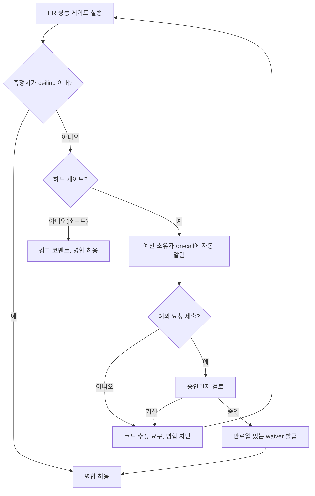

**Performance budget 운영**이란 이미 합의된 성능 예산(레이턴시·할당 횟수·바이너리 크기 등의 상한선)을 CI 파이프라인의 자동 판정과 인간의 승인 절차로 실제 집행하는 활동을 말합니다. 예산 숫자를 문서에 적어두는 것과 그 숫자를 어길 때 병합을 막고, 어길 수밖에 없는 상황에서 누가 얼마 동안 예외를 허락할지 정하는 것은 전혀 다른 문제입니다. 팀이 처음 예산을 도입할 때는 대개 숫자를 정하는 데 집중하지만, 6개월 뒤 그 예산이 지켜지고 있는지는 순전히 운영 체계 — 게이트가 얼마나 엄격한지, 예외가 얼마나 쉽게 남발되는지, 초과 사실이 누구에게 얼마나 빨리 전달되는지 — 에 달려 있습니다. 이 장은 이미 정해진 예산 숫자를 전제로, 그 숫자를 무너뜨리지 않게 만드는 CI 게이트·에스컬레이션·예외 승인 절차를 다룹니다.

## 이 장을 읽기 전에

**전제 지식**: 이 장은 [PR 성능 게이트 설계](/post/regression-prevention/pr-performance-gate-design/)에서 다룬 "PR 단위로 성능을 비교해 pass/fail을 내리는 게이트"가 이미 존재한다고 가정합니다. 또한 예산 숫자 자체를 어떻게 산정하는지(SLO에서 컴포넌트별 예산을 배분하는 방법론)는 [Tr.11 성능 예산 수립](/post/design-decisions/performance-budgeting-methodology/)에서 다루므로 이 장에서는 반복하지 않습니다.

**이 장의 깊이**: 이 장은 **심화** 난이도로, "예산 숫자가 이미 있다"는 전제 위에서 그 숫자를 CI 게이트에 실제로 반영하는 정책 설계(하드/소프트 게이트 구분), 예산을 초과했을 때 조직 내부에서 벌어지는 에스컬레이션 흐름, 그리고 예외를 승인하는 거버넌스(누가·얼마나·언제까지 승인할 수 있는가)를 다룹니다.

**다루지 않는 것**: 게이트가 통계적으로 pass/fail을 어떻게 계산하는지(임계값·비교 알고리즘)는 [03장](/post/regression-prevention/pr-performance-gate-design/), 예산의 절대 기준선이 시간이 지나며 어떻게 갱신되어야 하는지는 [05장 기준선 관리](/post/regression-prevention/performance-baseline-management-strategy/), 측정 노이즈로 인한 오탐 억제는 [06장 변동성 관리](/post/regression-prevention/performance-variance-noise-management/), 초과 알림의 채널·우선순위 설계는 [08장 알림 전략](/post/regression-prevention/performance-alerting-strategy-design/)에서 각각 다룹니다.

## 당신의 수준에 맞는 경로

| 수준 | 읽을 부분 | 핵심 목표 |
|------|---------|---------|
| **중급자** | "Error Budget과의 유사성" ~ "하드 게이트와 소프트 게이트" | budget이 baseline 대비 상대 회귀와 다른 개념임을 이해 |
| **심화 학습자** | "예산 초과 시 에스컬레이션 흐름" ~ "예외 승인 프로세스 설계" | 초과 발생 시 조직이 취해야 할 절차를 설계 |
| **전문가** | "판단 기준" ~ "비판적 시각" | 하드/소프트 게이트 선택과 거버넌스 실패 패턴을 판단 |

---

## Error Budget과의 유사성 (배경)

성능 예산을 "위반 시 배포를 막는 계약"으로 운영하는 발상은 신뢰성 공학의 **error budget** 정책과 구조적으로 같습니다. 이 개념은 2016년 Betsy Beyer 등이 편집한 Google의 *Site Reliability Engineering* 서적에서 SLO 대비 허용 가능한 불안정성의 총량으로 처음 대중화되었고, 이후 Google SRE Workbook이 이를 "위반 시 릴리스를 멈추는 정책"으로 구체화했습니다. Google SRE는 SLO를 기준으로 4주 단위 오류 허용량을 정의하고, 이를 소진하면 예외 없이 릴리스를 동결하는 정책을 문서화하고 있습니다.

> "If the service has exceeded its error budget for the preceding four-week window, we will halt all changes and releases other than P0 issues or security fixes until the service is back within its SLO." — Google SRE Workbook, [Error Budget Policy](https://sre.google/workbook/error-budget-policy/)

이 정책 문서에서 특히 눈여겨볼 부분은 "예외를 어떻게 처리하는가"입니다. 같은 문서는 회사 전체 네트워크 장애나 다른 팀이 이미 동결한 서비스에 의존한 장애처럼, 팀의 통제 밖에서 budget이 소진된 경우를 예외로 명시하고, 계산 방식 자체에 이견이 있을 때는 "CTO에게 에스컬레이션한다"고 규정합니다. 성능 예산 운영에서도 구조는 동일합니다 — 초과를 기계적으로 차단하는 규칙과, 그 규칙이 부당하다고 판단될 때 누구에게 얼마나 빨리 에스컬레이션할지를 규정하는 절차가 함께 있어야 합니다. 다만 성능 예산은 4주 오류 총량이 아니라 PR 단위의 즉시 판정이 많다는 점에서 에스컬레이션 주기가 훨씬 짧고 빈번하다는 차이가 있습니다.

## 하드 게이트와 소프트 게이트: budget과 regression의 차이

성능 예산을 CI에 반영할 때 가장 먼저 갈리는 결정은 "무엇과 비교하는가"입니다. **budget 게이트**는 절대 상한선(예: p99 레이턴시 180µs 이하)과 비교하고, **regression 게이트**([03장](/post/regression-prevention/pr-performance-gate-design/)의 주제)는 직전 baseline 대비 변화율과 비교합니다. 이 둘은 종종 같은 CI 단계에서 함께 동작하지만 실패 의미가 다릅니다 — regression 게이트 실패는 "이번 PR이 상황을 악화시켰다"는 뜻이고, budget 게이트 실패는 "악화 여부와 무관하게 계약을 어겼다"는 뜻입니다. 오래전부터 서서히 나빠져 baseline이 이미 예산을 초과한 상태라면 regression 게이트는 조용히 통과하지만 budget 게이트는 계속 실패해야 합니다.

budget 게이트는 다시 **하드(hard)**와 **소프트(soft)**로 나뉩니다. 하드 게이트는 위반 시 병합 자체를 막고, 소프트 게이트는 PR 코멘트나 대시보드 경고로만 알리고 병합은 허용합니다. 모든 예산을 하드로 만들면 사소한 지표 하나로 팀 전체 처리량이 막히고, 모든 예산을 소프트로 두면 예산이 장식으로 전락합니다. 실무에서는 사용자 체감에 직접 연결된 소수의 지표(예: 주문 매칭 경로 p99)만 하드로, 참고용 지표(예: 부가 로깅 경로 할당 횟수)는 소프트로 두는 것이 일반적입니다.

예산을 코드가 아니라 별도 설정으로 선언해두면 하드/소프트 구분과 소유자·에스컬레이션 대상을 한곳에서 관리할 수 있습니다. 아래는 그런 설정 파일의 예시이며, `ceiling`은 baseline 대비 델타가 아니라 절대 수치라는 점이 03장의 regression 설정과 다릅니다.

```yaml
# perf-budget.yaml — 절대 상한(ceiling)과 하드/소프트 구분, 소유자·에스컬레이션 채널을 함께 선언
budgets:
  - id: order_match_p99
    metric: p99_latency_us
    ceiling: 180
    type: hard
    owner: "@matching-engine-team"
    escalation: "#perf-oncall"
  - id: md_parser_alloc
    metric: allocations_per_call
    ceiling: 0
    type: soft
    owner: "@md-team"
    escalation: "#perf-oncall"
exceptions:
  - budget_id: order_match_p99
    approved_by: "@jane-lead"
    reason: "정렬 알고리즘 임시 교체(PR#4821에서 원복 예정)"
    expires_at: "2026-08-01"
```

이 설정 파일 자체도 코드처럼 PR 리뷰 대상이어야 합니다. `ceiling`을 조용히 완화하는 변경이 승인 없이 merge되면 예산은 문서상으로만 존재하게 되므로, 이 파일에 대한 변경은 예산 소유 조직의 리뷰를 필수로 강제하는 것이 안전합니다.

## 예산 초과 시 에스컬레이션 흐름

하드 게이트가 실패했을 때 그다음 무엇이 벌어지는지가 운영의 핵심입니다. 실패를 그냥 "빨간 CI"로 남겨두면 작성자는 재시도만 반복하다 지치고, 결국 게이트를 우회하는 방법을 찾게 됩니다. 실패는 자동으로 예산 소유자에게 전달되고, 소유자가 "코드를 고친다" 또는 "예외를 요청한다" 중 하나를 선택하는 지점까지 흐름이 이어져야 합니다.



이 흐름에서 "승인권자 검토" 단계가 형식적으로 남지 않으려면 승인 권한을 코드로 강제해야 합니다. GitHub의 CODEOWNERS는 이런 강제에 쓸 수 있는 기존 메커니즘입니다.

> "When reviews from code owners are required, an approval from *any* of the owners is sufficient to meet this requirement." — GitHub Docs, [About code owners](https://docs.github.com/en/repositories/managing-your-repositorys-settings-and-features/customizing-your-repository/about-code-owners)

`perf-budget.yaml`의 `exceptions` 블록을 CODEOWNERS로 지정된 팀만 병합할 수 있는 별도 파일로 분리하면, "예외를 아무나 추가하지 못하게" 만드는 절차를 브랜치 보호 규칙만으로 강제할 수 있습니다. 다만 CODEOWNERS는 "소유자 중 한 명"의 승인만 요구하므로, 여러 승인자가 필요한 조직은 별도의 승인 카운트 규칙을 얹어야 합니다.

## 예외 승인(Waiver) 프로세스 설계

예외는 없앨 대상이 아니라 설계할 대상입니다. 예외가 전혀 없는 예산 체계는 P0 장애 핫픽스조차 막아버려 결국 사람이 게이트를 끄는 방식으로 우회되고, 예외가 무한정 허용되는 체계는 예산이 있으나 마나 한 숫자가 됩니다. 실무에서 통하는 waiver는 세 가지 속성을 반드시 가집니다 — **누가 승인했는지**, **왜 필요한지**, **언제 만료되는지**입니다. 이 중 만료일이 가장 자주 생략되는데, 만료일 없는 waiver는 사실상 예산 완화와 같습니다.

CI가 waiver를 실제로 반영하려면 게이트 판정 로직이 ceiling 비교와 함께 활성 waiver 여부를 매 실행마다 다시 확인해야 합니다. 아래는 그 판정을 최소 형태로 표현한 예시이며, 실제 측정값 수집은 [02장](/post/regression-prevention/benchmark-ci-integration-codspeed-bencher/)에서 다루는 벤치마크 CI 도구가 담당합니다.

```python
from datetime import date

def gate_decision(budget: dict, measured: float, exceptions: list[dict]) -> str:
    """budget 설정, 측정치, 활성 예외 목록으로 병합 가능 여부를 판정한다."""
    if measured <= budget["ceiling"]:
        return "merge_ok"

    active_waiver = next(
        (e for e in exceptions
         if e["budget_id"] == budget["id"]
         and date.fromisoformat(e["expires_at"]) >= date.today()),
        None,
    )
    if active_waiver:
        return "merge_ok_with_waiver"

    return "block_merge" if budget["type"] == "hard" else "warn_only"
```

이 함수의 핵심은 waiver 만료 확인이 "승인 시점"이 아니라 "매 CI 실행 시점"에 일어난다는 점입니다. 승인 시점에만 확인하면 waiver가 만료된 뒤에도 오래된 CI 상태가 캐시되어 병합이 계속 허용될 수 있습니다. 실제 CodSpeed 같은 벤치마크 CI 도구는 이런 승인을 리포지터리 관리자만 처리할 수 있도록 제한하는 방식으로 이 문제를 부분적으로 해결합니다.

> "When working with an organization's repository, only admins are allowed to acknowledge regressions." — CodSpeed Docs, [Performance Checks](https://codspeed.io/docs/features/performance-checks)

만료 임박 waiver를 누구에게 언제 알릴지는 이 장의 범위가 아니라 [08장 알림 전략](/post/regression-prevention/performance-alerting-strategy-design/)의 몫이며, 만료 후에도 반복적으로 재승인되는 waiver는 사실상 해소되지 않은 회귀이므로 [12장 성능 부채 관리](/post/regression-prevention/performance-debt-management-strategy/)의 부채 항목으로 넘겨 추적하는 것이 바람직합니다.

## 흔한 오개념

**"예산 초과는 예외 없이 무조건 병합을 막아야 한다"**는 틀린 전제입니다. Google SRE의 error budget 정책조차 P0 장애 픽스와 보안 패치를 동결 예외로 명시합니다. 예외가 전혀 없는 하드 게이트는 실제 장애 대응 상황에서 사람이 CI 자체를 끄게 만들어, 그 뒤로는 게이트가 있으나 없으나 마찬가지가 됩니다. 필요한 것은 "예외 없음"이 아니라 "누가 언제까지 승인했는지 기록되는 예외"입니다.

**"예외 승인은 팀 리드 아무나 구두로 해도 된다"**는 것도 흔한 오해입니다. 승인자가 CODEOWNERS나 그에 준하는 강제 메커니즘 없이 구두·채팅으로만 정해지면, 시간이 지나 "누가 이걸 승인했더라"를 아무도 답하지 못하는 상태가 됩니다. 예외 승인은 PR의 코드 변경과 동일하게 감사 가능한 기록(승인자·사유·만료일이 diff로 남는 파일)으로 남겨야 사후에 재구성할 수 있습니다.

**"한 번 승인된 예외는 문제가 해결될 때까지 유효하다"**는 가정도 위험합니다. "문제가 해결될 때까지"는 무기한과 다르지 않습니다. waiver는 반드시 구체적인 만료일을 갖고, 만료일에 문제가 남아 있다면 재승인이 아니라 예산 자체의 재검토(정말 이 ceiling이 맞는가) 또는 부채 등록으로 이어져야 합니다.

## 판단 기준

| 상황 | 권장 | 비권장 |
|------|------|--------|
| 사용자 체감 핫패스(주문 매칭, 시세 전파 등) | 하드 게이트 + ceiling | 소프트 게이트로만 관찰 |
| 참고용·부가 경로 지표 | 소프트 게이트(경고만) | 모든 지표를 하드로 강제 |
| 장애 핫픽스·보안 패치 | 사전 정의된 동결 예외 규칙 적용 | 임시로 게이트 자체를 비활성화 |
| 일시적 회귀(리팩터링 중) | 만료일 있는 waiver, 승인자·사유 기록 | 무기한 예외, 구두 승인 |
| 반복적으로 재승인되는 예외 | 예산 재검토 또는 성능 부채로 등록 | 매번 같은 사유로 연장 |
| 예산 설정 파일 변경 | CODEOWNERS 등 강제 리뷰 대상 | 아무나 병합 가능한 일반 설정 |

## 비판적 시각: 한계와 트레이드오프

하드 게이트를 늘릴수록 팀의 배포 속도는 예산 위반 빈도에 정비례해 느려지므로, 예산 개수 자체를 신중하게 제한하지 않으면 게이트가 개발 마찰의 원인으로 지목되어 결국 조직적으로 무력화됩니다. 반대로 예외 프로세스를 지나치게 가볍게 만들면 "일단 예외로 넘기고 나중에 고친다"는 패턴이 굳어져 예산이 사실상 소프트 게이트와 구별되지 않게 됩니다 — 이 긴장은 기술로 완전히 해결되지 않고, 조직이 예외 승인 빈도를 정기적으로 검토하는 관행으로만 억제할 수 있습니다. 또한 error budget 정책을 그대로 성능에 이식하면 "4주 총량" 같은 집계 방식이 즉시 판정이 필요한 PR 게이트와 잘 맞지 않을 수 있으므로, 유사성은 설계의 참고 틀로만 쓰고 세부 정책은 팀의 배포 빈도에 맞춰 다시 설계해야 합니다.

## 마무리

이 장을 읽은 후 다음을 확인할 수 있어야 합니다.

- [ ] budget 게이트(절대 ceiling)와 regression 게이트(baseline 대비 델타)의 판정 기준 차이를 설명할 수 있는가?
- [ ] 하드 게이트와 소프트 게이트를 어떤 기준으로 나눌지 말할 수 있는가?
- [ ] 예산 초과가 발생했을 때 소유자 알림부터 waiver 발급까지 이어지는 흐름을 그릴 수 있는가?
- [ ] waiver에 반드시 포함되어야 할 세 가지 속성(승인자·사유·만료일)을 말할 수 있는가?
- [ ] 만료된 waiver가 CI에서 매번 다시 검증되어야 하는 이유를 설명할 수 있는가?
- [ ] 반복 재승인되는 예외를 성능 부채로 전환해야 하는 이유를 설명할 수 있는가?

**다음 장에서는** budget의 절대 ceiling이 아니라, 시간이 지나며 흔들리는 **baseline 자체를 어떻게 갱신·관리할지**를 다룹니다. 하드웨어 교체, 컴파일러 업그레이드, 정당한 성능 개선이 baseline에 반영되지 않으면 이 장에서 만든 게이트는 낡은 기준으로 계속 오탐을 냅니다.

→ [기준선 관리 전략](/post/regression-prevention/performance-baseline-management-strategy/)
