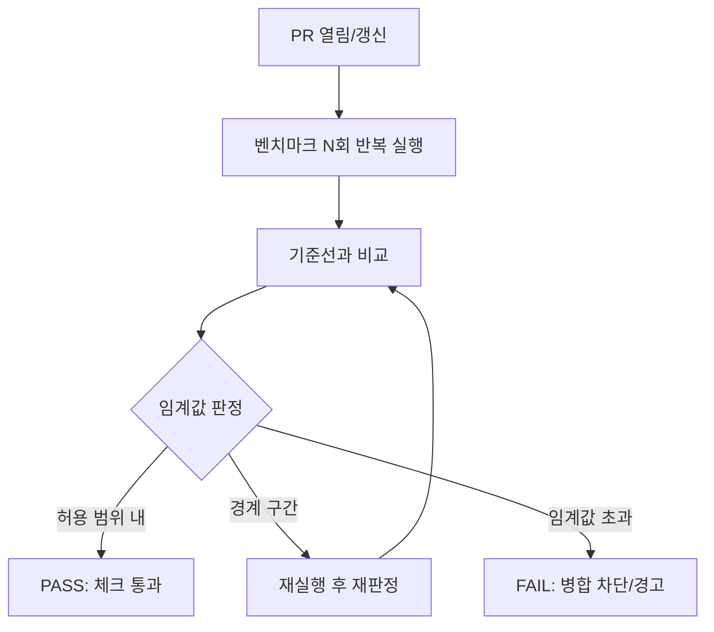

**PR 성능 게이트**란 풀 리퀘스트(PR)마다 벤치마크 결과를 기준선과 자동으로 비교해, 병합을 허용할지·경고할지·차단할지를 결정하는 CI 단계를 말합니다. 코드 리뷰가 스타일과 로직을 걸러내듯, 성능 게이트는 "이 변경이 핫패스를 얼마나 늦추는가"를 사람이 매번 눈으로 확인하지 않아도 되게 만듭니다. 문제는 게이트를 만드는 것 자체가 아니라, 임계값을 어떻게 정하고 실패를 어떻게 처리하며 노이즈로 인한 오탐(false positive)을 어떻게 줄이느냐입니다. 임계값이 너무 빡빡하면(tight) 정상적인 변동에도 매번 빨간불이 켜져 팀이 게이트를 신뢰하지 않게 되고, 너무 느슨하면 실제 회귀가 조용히 병합됩니다.

## 이 장을 읽기 전에

이 장은 [03장: 벤치마크 CI 통합](/post/regression-prevention/benchmark-ci-integration-codspeed-bencher/)에서 벤치마크를 CI 파이프라인에 연결하는 방법을 이미 안다고 전제합니다. CodSpeed·Bencher 같은 도구가 벤치마크를 어떻게 실행하고 PR에 결과를 게시하는지는 03장에서 다뤘으므로 여기서는 반복하지 않습니다. 또한 [01장: 성능 회귀란 무엇인가](/post/regression-prevention/performance-regression-definition-detection-fundamentals/)에서 정의한 "회귀"의 개념을 전제로 합니다.

**이 장의 깊이**: PR 단위로 "통과/경고/차단"을 결정하는 게이트 로직 자체 — 임계값의 종류, 실패 처리 정책, 오탐을 줄이는 통계적 습관을 중급 수준에서 다룹니다. **다루지 않는 것**: 기준선 데이터를 어디에 저장하고 언제 갱신할지는 [06장: 기준선 관리](/post/regression-prevention/performance-baseline-management-strategy/)에서, 노이즈의 근본 원인(하드웨어 지터·스케줄링·캐시 상태)과 격리 기법은 [07장: 변동성 관리](/post/regression-prevention/performance-variance-noise-management/)에서, 팀 단위 예산 배분과 소급 적용은 [05장: Performance Budget 운영](/post/regression-prevention/performance-budget-operational-enforcement/)에서, GitHub Actions/GitLab CI로 게이트를 실제로 코드화하는 방법은 [14장: Benchmark as Code](/post/regression-prevention/benchmark-as-code-github-actions-gitlab-ci/)에서 다룹니다.

## 당신의 수준에 맞는 경로

| 수준 | 읽을 부분 | 핵심 목표 |
|------|---------|---------|
| **입문** | "게이트의 구성 요소" ~ "임계값의 세 가지 방식" | PR 게이트가 무엇을 자동화하는지, 임계값 종류의 차이를 이해 |
| **중급** | "게이트 판정 로직" ~ "실패 시 처리 정책" | 실제 임계값·정책을 설계하고 실패 처리 흐름을 구성 |
| **전문** | "판단 기준" ~ "비판적 시각" | 상황별 임계값 선택과 게이트의 한계를 판단 |

## 게이트의 역사·배경

PR 단위 성능 게이트는 새로운 발상이 아닙니다. Mozilla의 Firefox 프로젝트는 Perfherder라는 시스템으로 커밋마다 성능 시계열을 수집하고, Student's t-test 기반 변화점 탐지로 회귀 후보를 자동 표시해 왔습니다. 그러나 성능 데이터가 정규분포를 따른다는 t-test의 가정이 실제 벤치마크 데이터에는 잘 맞지 않아 오탐·미탐이 만만치 않게 발생한다는 사실이 후속 연구에서 지적되었습니다. Rust 생태계의 `criterion.rs`는 개별 함수 단위 벤치마크에서 부트스트랩 샘플링과 T-검정을 결합해 "직전 실행 대비 변화"를 판정하고, 결과가 노이즈 범위 안에 들면 무시하도록 설계되었습니다.

> "The noise threshold is configurable, and defaults to `+-2%`." — [Criterion.rs 사용자 가이드: Command-Line Output](https://bheisler.github.io/criterion.rs/book/user_guide/command_line_output.html) 문서. 즉 직전 실행과 ±2% 이내 차이는 기본적으로 노이즈로 간주되어 회귀로 보고되지 않습니다.

이 두 사례는 PR 게이트 설계의 핵심 긴장을 보여줍니다. 통계적으로 엄밀한 검정(t-test)은 변동성을 고려하지만 분포 가정이 깨지면 오탐을 만들고, 단순 퍼센트 임계값은 이해하기 쉽지만 변동성 규모를 반영하지 못합니다. 2023년 이후 등장한 CodSpeed·Bencher 같은 SaaS형 지속적 벤치마킹 도구(03장 참고)는 이 둘을 절충해 퍼센트 기준과 통계적 기준을 함께 제공하는 방향으로 수렴하고 있습니다.

## 게이트의 구성 요소

PR 성능 게이트는 네 단계로 이루어집니다. 첫째, PR이 열리거나 갱신될 때 트리거되어 정해진 벤치마크 집합을 실행합니다. 둘째, 실행 결과(보통 여러 번 반복한 표본)를 기준선(baseline)과 비교합니다. 셋째, 정해진 임계값 규칙으로 "허용 범위 내/경계/초과"를 판정합니다. 넷째, 판정 결과를 PR의 상태 체크(status check)에 반영해 병합 가능 여부에 영향을 줍니다. 이 네 단계 중 앞의 두 단계(트리거·실행)는 03장이 다루는 CI 통합의 영역이고, 이 장은 셋째·넷째 단계 — 판정 로직과 실패 처리 — 에 집중합니다.



## 임계값의 세 가지 방식

<strong>절대 임계값(absolute)</strong>은 "500µs를 넘으면 실패"처럼 고정된 값을 기준으로 삼습니다. 이해하기 쉽고 [05장의 Performance Budget](/post/regression-prevention/performance-budget-operational-enforcement/)과 자연스럽게 연결되지만, 하드웨어나 컴파일러가 바뀌면 기준값 자체가 무의미해질 수 있습니다.

<strong>상대 임계값(percentage)</strong>은 "기준선 평균 대비 +5% 이상 느려지면 실패"처럼 비율로 판정합니다. Bencher의 Percentage Test가 대표적인 예로, 기준선 평균에 허용 비율을 곱해 상한·하한을 계산하고 새 측정값이 그 범위를 벗어나면 경고를 발생시킵니다. 절대 임계값보다 이식성이 좋지만, 벤치마크마다 변동성 크기가 다르다는 사실을 반영하지 못해 변동성이 큰 벤치마크에서는 오탐이, 변동성이 작은 벤치마크에서는 미탐이 나기 쉽습니다.

<strong>통계적 임계값(statistical)</strong>은 과거 측정값의 분포를 사용해 "이번 값이 우연히 나올 확률이 낮다"를 판정합니다. Bencher는 z-score 검정과 Student's t-test 검정을 함께 제공하는데, z-score 검정은 충분한 과거 표본(대략 30개 이상)이 쌓였을 때 신뢰할 만하고, t-test 기반 예측 구간(prediction interval)은 표본이 적을 때 더 유연하게 동작합니다. 두 검정 모두 상한·하한 경계를 "평균에서 어느 정도 벗어나면 경고"라는 누적 비율(0.5–1.0)로 표현합니다. 통계적 임계값은 변동성 규모를 자동으로 반영한다는 장점이 있지만, 과거 표본이 오염되어 있으면(이미 회귀가 섞여 있으면) 기준 자체가 흔들립니다.

## 게이트 판정 로직

실무에서는 세 방식 중 하나만 쓰기보다, 퍼센트 규칙과 통계적 규칙을 함께 적용해 서로의 약점을 보완하는 경우가 많습니다. 아래는 이런 조합을 보여주는 최소한의 판정 함수입니다. `baseline_samples`는 최근 기준선 실행에서 모은 값들(예: 최근 20회의 대표값), `pr_samples`는 이번 PR 브랜치에서 반복 실행한 값들입니다.

```python
from statistics import mean, stdev

def gate_decision(baseline_samples: list, pr_samples: list,
                   pct_bound: float = 0.05, z_bound: float = 2.0) -> str:
    """percentage 규칙과 z-score 규칙을 함께 적용해 PASS/WARN/FAIL을 결정한다."""
    base_mean = mean(baseline_samples)
    base_sd = stdev(baseline_samples) if len(baseline_samples) > 1 else 0.0
    pr_mean = mean(pr_samples)

    pct_delta = (pr_mean - base_mean) / base_mean
    z_score = (pr_mean - base_mean) / base_sd if base_sd > 0 else 0.0

    if pct_delta <= pct_bound and abs(z_score) <= z_bound:
        return "PASS"
    if pct_delta > pct_bound * 2 or abs(z_score) > z_bound * 1.5:
        return "FAIL"
    return "WARN"  # 경계 구간: 재실행하거나 사람이 검토
```

이 함수는 두 규칙 중 하나라도 크게 벗어나면 실패로, 둘 다 여유 있게 통과하면 성공으로, 그 사이는 "경계"로 분류해 즉시 차단하지 않고 재실행·사람 검토로 넘깁니다. `pct_bound`, `z_bound`와 그 배수는 벤치마크마다, 팀마다 달라야 하는 값이며 한 번 정하고 끝나는 것이 아니라 [06장](/post/regression-prevention/performance-baseline-management-strategy/)에서 기준선을 갱신할 때 함께 재검토해야 합니다.

## 실패 시 처리 정책

게이트가 "실패"를 판정한 다음 무엇을 할지는 임계값 설계만큼 중요합니다. 크게 세 가지 정책이 있습니다. <strong>하드 블록(hard block)</strong>은 게이트 실패 시 PR을 병합할 수 없게 만듭니다. 핫패스처럼 회귀 비용이 큰 코드에 적합하지만, 오탐이 잦으면 개발 속도를 떨어뜨리고 팀이 게이트를 우회하려는 유인을 만듭니다. <strong>소프트 경고(soft warn)</strong>는 PR에 코멘트만 남기고 병합을 막지 않습니다. 신뢰도가 낮은 벤치마크나 이력이 부족한 신규 벤치마크에 적합하지만, 아무도 코멘트를 읽지 않으면 사실상 무의미해집니다. <strong>에스컬레이션(escalation)</strong>은 실패 시 자동 병합은 막되, 정해진 라벨과 정당화 사유를 남기면 성능 오너의 승인으로 우회할 수 있게 합니다. 이 방식은 판단을 사람에게 넘기면서도 우회 이력을 남겨 추적 가능하게 만듭니다.

세 정책을 벤치마크 성격별로 다르게 적용하는 것이 일반적입니다. 신규 벤치마크는 기준선 표본이 쌓일 때까지 소프트 경고로 시작해 데이터가 축적된 후 하드 블록으로 승격하고, 알려진 핫패스는 처음부터 하드 블록으로, 탐색적이거나 변동성이 큰 벤치마크는 에스컬레이션으로 두는 식입니다.

## 흔한 오개념

<strong>"벤치마크를 한 번만 실행해 기준값과 비교하면 충분하다"</strong>는 오개념입니다. 단일 실행값은 그 자체로 노이즈를 포함하므로, 반복 실행(예: 10–20회)의 대표값(중앙값 또는 절사평균)과 그 분산을 함께 봐야 위 판정 함수의 `z_score` 같은 계산이 의미를 가집니다.

<strong>"임계값은 한 번 정하면 영구히 고정한다"</strong>도 잘못된 가정입니다. 하드웨어 세대가 바뀌거나 컴파일러 버전이 올라가거나 벤치마크 자체가 리팩토링되면, 과거에 맞춰 둔 퍼센트·z-score 경계가 더 이상 유효하지 않습니다. 임계값은 기준선 갱신 주기(06장)에 맞춰 함께 재검토해야 합니다.

<strong>"게이트 실패는 곧 성능 회귀"</strong>라는 가정도 위험합니다. CI 러너의 일시적 부하, 플래키(flaky)한 벤치마크, 또는 정확성 버그를 고치기 위해 의도적으로 감수한 비용일 수도 있습니다. 실패를 곧바로 "고쳐야 할 버그"로 취급하기 전에 재실행과 원인 분류(triage)를 거쳐야 하며, 이 절차가 없으면 에스컬레이션 정책의 우회 라벨이 정당한 트레이드오프와 진짜 회귀를 구분하지 못한 채 남용됩니다.

## 판단 기준

| 상황 | 권장 임계값 방식 | 권장 실패 처리 |
|------|-----------------|---------------|
| 이미 알려진 핫패스, 기준선 표본 충분 | 통계적(z-score/t-test) + 퍼센트 병행 | 하드 블록 |
| 신규 벤치마크, 기준선 표본 부족 | 퍼센트(넉넉한 상한)만 우선 | 소프트 경고 |
| 변동성이 큰 벤치마크(I/O·네트워크 포함) | 퍼센트 상한을 넓게, 통계 검정은 참고용 | 에스컬레이션 |
| 크로스 플랫폼 CI(러너 이질적) | 절대 임계값 지양, 상대·통계 임계값 사용 | 에스컬레이션 |
| 정확성 수정으로 인한 의도적 성능 저하 | 해당 없음(임계값 문제 아님) | 승인 후 기준선 갱신([06장](/post/regression-prevention/performance-baseline-management-strategy/)) |

## 비판적 시각: 한계와 트레이드오프

통계적으로 엄밀해 보이는 검정도 오탐을 없애 주지 않습니다. Mozilla Perfherder의 사례를 분석한 연구는 t-test가 정규성·등분산을 가정하지만 실제 성능 측정값은 이 가정을 자주 위반해, 변화점 탐지(change point detection) 결과에 상당한 오탐·미탐이 남는다고 지적합니다. 해당 연구는 대안으로 PELT, E-divisive, BOCPD 같은 변화점 탐지 기법을 비교 평가하는데, 어떤 단일 기법도 모든 상황에서 우월하지 않다는 것이 핵심 결론입니다. 게이트를 아무리 정교하게 설계해도 노이즈의 근본 원인(공유 CI 러너, 캐시 상태, 스케줄링 변동)을 줄이지 않으면 판정 로직만으로는 한계가 있으며, 이 근본 원인 통제는 [07장](/post/regression-prevention/performance-variance-noise-management/)의 영역입니다.

게이트가 지나치게 엄격하면 "게이트 피로(gate fatigue)"가 생깁니다. 오탐이 반복되면 개발자는 실패를 진지하게 보지 않고 기계적으로 재실행 버튼을 누르거나 에스컬레이션 라벨을 습관적으로 붙이게 되고, 이는 결국 진짜 회귀도 같은 방식으로 넘어가게 만듭니다. 반대로 에스컬레이션·우회 메커니즘 자체도 거버넌스 없이 두면 성능 오너의 승인이 형식적 절차로 전락해 회귀를 숨기는 통로가 될 수 있습니다. 우회 이력을 감사 가능하게 남기고 주기적으로 검토하는 절차가 병행되어야 게이트가 신뢰를 유지합니다. 마지막으로, 공유 클라우드 CI 러너에서 실행되는 벤치마크는 근본적으로 이웃 워크로드의 영향을 받으므로, 게이트 로직을 아무리 다듬어도 전용/베어메탈 러너로의 전환(03장에서 다룬 Bencher의 접근)이 더 근본적인 해법일 수 있습니다.

## 마무리

이 장을 읽은 후 다음을 확인할 수 있어야 합니다.

- [ ] PR 게이트가 트리거·실행·비교·판정·상태 반영의 네 단계로 이루어진다는 것을 설명할 수 있다.
- [ ] 절대·상대·통계적 임계값의 차이와 각각의 한계를 구분할 수 있다.
- [ ] 하드 블록·소프트 경고·에스컬레이션 정책을 상황에 맞게 선택할 수 있다.
- [ ] 단일 실행 비교, 고정 임계값, "실패=회귀" 같은 오개념을 피할 수 있다.
- [ ] 게이트 판정 로직만으로는 노이즈의 근본 원인을 해결할 수 없다는 한계를 설명할 수 있다.

**이전 장**: [벤치마크 CI 통합](/post/regression-prevention/benchmark-ci-integration-codspeed-bencher/) (챕터 03)

**다음 장에서는** PR 게이트를 통과한 이후의 더 큰 그림 — 팀 전체가 핫패스별 예산을 정하고 운영하는 **Performance Budget 운영**을 다룹니다. 이 장에서 다룬 임계값 설계가 개별 PR의 관문이라면, 다음 장은 그 임계값들이 어떤 예산 체계 안에서 배분되고 소급 조정되는지를 정리합니다.

→ [Performance Budget 운영](/post/regression-prevention/performance-budget-operational-enforcement/) (챕터 05)
