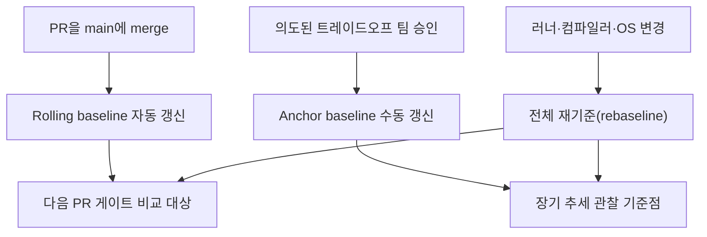

**기준선(baseline) 관리**란 "지금 측정한 성능 수치가 정상인지 회귀인지"를 판단할 때 비교 대상으로 삼는 기준 상태를 정하고, 그 기준을 언제 어떻게 갱신할지 결정하는 운영 전략을 말합니다. 벤치마크 자체는 숫자를 만들 뿐이며, 그 숫자가 "나쁜지"를 말해주는 것은 항상 기준선과의 차이입니다. 기준선을 잘못 고르면 두 방향으로 실패합니다. 너무 고정적이면 정당한 성능 트레이드오프까지 매번 실패로 표시해 팀이 게이트를 무시하게 되고, 너무 느슨하게 계속 갱신하면 하루 1%씩 느려지는 점진적 회귀가 "직전 대비 변화 없음"으로 영원히 통과됩니다. 이 장에서는 fixed·rolling·hybrid 기준선 전략의 차이, 기준선을 갱신해야 하는 시점과 하지 말아야 하는 시점, 그리고 서로 다른 하드웨어·환경에서 기준선을 동기화하는 원칙을 다룹니다.

## 이 장을 읽기 전에

**선행 지식**: 이 장은 [Performance Budget 운영](/post/regression-prevention/performance-budget-operational-enforcement/)(챕터 04)에서 다룬 "예산은 팀이 합의한 상한선"이라는 개념과, [성능 회귀란 무엇인가](/post/regression-prevention/performance-regression-definition-detection-fundamentals/)(챕터 17)의 회귀 정의를 전제로 합니다. budget이 "넘으면 안 되는 절대 상한"이라면, baseline은 "직전 대비 얼마나 달라졌는가"를 재는 상대적 기준점이라는 차이를 먼저 구분해 두면 이 장이 쉬워집니다.

**이 장의 깊이**: 기준선의 개념적 구조(무엇을 기준선으로 삼을지, 언제 갱신할지, 여러 환경에서 어떻게 맞출지)를 중급 수준에서 다룹니다. **다루지 않는 것**: 벤치마크 CI 도구의 구체적 설정 방법(CodSpeed·Bencher의 계측·워크플로 설정은 [벤치마크 CI 통합](/post/regression-prevention/benchmark-ci-integration-codspeed-bencher/), 챕터 02), 노이즈를 통계적으로 얼마나 신뢰할지([변동성 관리](/post/regression-prevention/performance-variance-noise-management/), 챕터 06), PR에서 기준선을 어떻게 게이트에 적용할지([PR 성능 게이트](/post/regression-prevention/pr-performance-gate-design/), 챕터 03), 기준선을 몇 달 단위로 관찰해 서서히 나빠지는 추세를 잡는 방법([장기 추세 분석](/post/regression-prevention/long-term-performance-trend-analysis/), 챕터 11)은 각 챕터로 위임합니다.

## 당신의 수준에 맞는 경로

| 수준 | 읽을 부분 | 핵심 목표 |
|------|---------|---------|
| **입문자** | "기준선의 계보" ~ "기준선이란 무엇인가" | baseline과 budget의 차이, 기준선의 두 축(값·환경)을 이해 |
| **중급자** | "기준선 갱신 전략" ~ "다중 환경 기준선 동기화" | fixed/rolling/hybrid를 상황에 맞게 선택하고 갱신 트리거를 설계 |
| **실무 적용** | "판단 기준" ~ "비판적 시각" | 팀의 기준선 거버넌스(누가·언제 승인하는지)를 설계 |

---

## 기준선의 계보 (배경)

성능 기준선이라는 개념 자체는 성능 공학보다 오래된 통계적 공정 관리(SPC, Statistical Process Control)에서 빌려온 사고방식입니다. 공정의 "정상 범위"를 먼저 정의하고 그 범위를 벗어나는 신호만 이상으로 취급한다는 원리가, 소프트웨어 성능 회귀 탐지에도 그대로 적용됩니다. 브라우저 엔진처럼 초 단위로 수백 개 벤치마크를 지속적으로 실행하는 프로젝트에서는 이 문제가 일찍부터 실무 문제였습니다. Chromium 프로젝트는 성능 대시보드에서 그래프상의 변화 지점을 기준으로 삼아 그 지점 앞뒤 커밋 구간을 이분 탐색(bisect)하는 Pinpoint 도구를 운영해 왔는데, 이는 "기준선은 고정된 숫자가 아니라 그래프 위의 한 지점이며 회귀가 의심되면 그 지점 자체를 재검증한다"는 태도를 보여줍니다. 이 방식은 뒤에서 다룰 rolling baseline과 bisect 기반 원인 추적의 원형입니다.

> 커밋 범위를 좁혀 가는 이 방식은 "성능 그래프의 변화 지점 앞의 알려진 좋은 상태"를 비교 기준으로 삼아, 그 구간 내 커밋을 순차 테스트해 회귀를 유발한 특정 변경을 찾아낸다 — [Chromium: Bisecting Performance Regressions](https://chromium.googlesource.com/chromium/src/+/HEAD/docs/speed/bisects.md) 문서 요지.

이후 GitHub Actions·GitLab CI 기반 지속적 벤치마킹 SaaS(CodSpeed, Bencher 등)가 등장하면서 "PR의 base 브랜치 최신 커밋을 기준선으로 자동 선택"하는 rolling 방식이 표준 패턴으로 자리잡았습니다. CodSpeed는 PR 실행 시 "base 브랜치의 가장 최근 CodSpeed 실행 리포트"를 기준선으로 선택하고, 그 기준선 대비 속도 변화율(impact)을 계산합니다. Bencher는 여기서 한 걸음 더 나아가 (branch, testbed, measure) 조합마다 독립된 threshold와 boundary limit을 두어, 기준선 자체를 정적 값이 아니라 통계적 모델(z-score, t-test, IQR 등)로 취급합니다. 두 도구 모두 "기준선은 매번 재계산되는 움직이는 목표"라는 관점을 공유하며, 이는 고정된 숫자를 오래 유지하던 이전 관행과 대비됩니다.

## 기준선이란 무엇인가

기준선은 두 가지 축으로 정의됩니다. 하나는 **값의 축**으로, 비교 대상이 되는 성능 수치(또는 수치의 분포)이고, 다른 하나는 **환경의 축**으로, 그 값이 어떤 하드웨어·컴파일러·OS·데이터셋 조합에서 측정되었는지입니다. 두 축 중 하나만 관리하면 기준선은 무의미해집니다. 값만 저장하고 환경을 기록하지 않으면, 러너 스펙이 바뀐 뒤에도 예전 값과 비교해 "회귀"라고 잘못 판정하게 됩니다. 반대로 환경만 고정하고 값 갱신 규칙이 없으면, 팀은 매번 수동으로 "이번엔 봐줄지"를 판단해야 해서 게이트가 사람의 재량에 좌우됩니다. 실무에서 기준선은 보통 "커밋 해시 + 환경 식별자(테스트베드) + 측정 분포(평균·표준편차 또는 분위수)"의 3중 조합으로 저장되며, 이 조합이 하나라도 바뀌면 별개의 기준선으로 취급하는 것이 안전합니다.

## 기준선 갱신 전략

**Fixed baseline(고정 기준선)**은 특정 릴리즈나 특정 커밋 시점의 성능을 오랫동안 비교 기준으로 유지하는 방식입니다. 장기간 같은 기준으로 비교하므로 추세를 읽기 쉽고, 팀이 "출시 이후 지금까지 몇 % 느려졌는가"를 한눈에 답할 수 있습니다. 단점은 시간이 지날수록 기준선과 현재 코드의 차이(기능 추가, 의도된 트레이드오프)가 누적되어, 비교 결과가 "회귀"인지 "정상적인 발전"인지 해석하기 어려워진다는 것입니다.

**Rolling baseline(이동 기준선)**은 PR마다 base 브랜치의 최신 상태를 기준선으로 다시 잡는 방식입니다. CodSpeed가 "base 브랜치의 가장 최근 리포트"를 자동으로 기준선으로 선택하는 것이 대표적인 예이며, 항상 "직전 상태 대비"라는 좁고 명확한 비교를 하므로 PR 게이트에 적합합니다. 단점은 뒤에서 다룰 **점진적 회귀 누적** 문제입니다. 매 PR이 0.5%씩만 느려지면 개별 PR은 threshold를 넘지 않아 계속 통과되지만, 100개 PR이 지나면 전체는 눈에 띄게 느려져 있습니다.

**Hybrid(혼합) 전략**은 두 방식을 계층으로 분리해 함께 씁니다. PR 게이트에는 rolling baseline을 써서 "이번 변경이 직전 대비 나빠졌는가"를 빠르게 판정하고, 별도로 분기·릴리즈 단위의 **anchor baseline(고정 앵커)**을 유지해 "출시 이후 전체 추세"를 장기 관찰합니다. anchor baseline의 드리프트 감시는 누적 통계가 필요한 작업이므로 [장기 추세 분석](/post/regression-prevention/long-term-performance-trend-analysis/)(챕터 11)에서 다루는 절차와 맞물립니다. 이 장에서 강조할 것은 두 계층을 반드시 분리해서 관리해야 하며, 하나로 뭉뚱그리면 어느 쪽 목적도 제대로 달성하지 못한다는 점입니다.

## 갱신 시점과 드리프트 방지

기준선을 갱신해야 하는 시점은 크게 세 가지입니다. 첫째, **merge 시점의 자동 갱신**으로, rolling baseline은 PR이 base 브랜치에 merge될 때마다 자동으로 그 커밋을 새 기준선으로 삼습니다. 둘째, **의도된 트레이드오프의 수동 승인**으로, 새 기능이 정당하게 몇 % 느려지는 대가로 도입될 때 팀이 명시적으로 검토하고 anchor baseline을 새 값으로 올립니다. 이 승인은 코드 리뷰만큼 진지하게 다뤄야 하며, 승인 기록(누가, 왜, 얼마나)을 남겨야 나중에 "왜 기준선이 이렇게 높아졌는가"를 추적할 수 있습니다. 셋째, **환경 변경에 의한 전체 재기준(rebaseline)**으로, CI 러너 스펙, 컴파일러 버전, OS 커널, 데이터셋이 바뀌면 이전 기준선과의 비교 자체가 무의미해지므로 해당 환경의 기준선을 처음부터 다시 수립해야 합니다.

드리프트는 성격이 다른 두 가지를 함께 가리키는 말이라 혼동하기 쉽습니다. **측정 드리프트**는 같은 코드를 같은 환경에서 반복 측정해도 노이즈 때문에 기준선 자체의 신뢰 구간이 흔들리는 현상으로, 이는 통계적 처리(신뢰구간·이상치 제거)의 문제이며 [변동성 관리](/post/regression-prevention/performance-variance-noise-management/)(챕터 06)에서 다룹니다. **성능 드리프트**는 반대로 측정은 정확한데 실제 코드가 시간이 지나며 조금씩 느려지는데도 rolling baseline이 매번 "직전과 유사"로 통과시켜 회귀가 누적되는 현상입니다. 성능 드리프트를 방지하는 유일한 방법은 rolling baseline만으로 끝내지 않고, 고정된 anchor baseline과 정기적으로 재대조하는 것입니다. 예를 들어 매주 또는 매 릴리즈마다 "이번 anchor 대비 총 변화율"을 별도로 계산해, 개별 PR 게이트에서는 안 보이던 누적 추세를 드러냅니다.

## 다중 환경 기준선 동기화

같은 프로젝트라도 로컬 개발 머신, CI 러너, 스테이징 환경은 CPU 세대·코어 수·컴파일러 버전·커널 스케줄러가 서로 다릅니다. 이때 흔히 저지르는 실수는 한 환경(보통 CI)에서 측정한 절대 수치를 다른 환경에도 그대로 기준선으로 적용하는 것입니다. 이렇게 하면 러너가 노트북보다 느린 환경에서는 항상 "회귀"로 잘못 판정되고, 반대로 더 빠른 환경에서는 실제 회귀도 통과됩니다. Bencher가 threshold를 (branch, testbed, measure) 조합 단위로 독립 관리하는 것은 이 문제에 대한 직접적인 해법으로, 환경마다 별도의 기준선을 유지하고 환경 간에는 절대값이 아니라 "각 환경 내부에서의 상대 변화율"만 비교합니다.

동기화 원칙은 세 가지로 요약됩니다. 첫째, 기준선은 환경(테스트베드) 단위로 독립적으로 저장하고 공유하지 않습니다. 둘째, 환경 간 비교가 꼭 필요하면 절대 수치 대신 "각 환경에서 baseline 대비 몇 % 변화했는가"라는 상대 지표로 맞춥니다. 셋째, 여러 환경 중 하나라도 하드웨어·소프트웨어 스택이 바뀌면 그 환경의 기준선만 재기준하고 나머지 환경은 그대로 둡니다. 분산·클러스터 환경에서 리전별로 하드웨어 스큐(skew)까지 고려해 기준선을 고정하는 더 심화된 절차는 [분산·클러스터 성능 회귀](/post/regression-prevention/distributed-cluster-performance-regression-expert/)(챕터 16)에서 다룹니다. 이 장에서 다루는 것은 그 이전 단계인 "환경이 두세 개만 있어도 기준선을 뒤섞지 않는" 기본 원칙입니다.

## 흔한 오개념

**"기준선은 한 번 정하면 바꾸지 않아야 신뢰할 수 있다"**는 절반만 맞습니다. anchor baseline처럼 장기 추세를 보기 위한 기준선은 함부로 바꾸면 안 되지만, rolling baseline은 애초에 매 merge마다 바뀌도록 설계된 것이며 이를 "불안정하다"고 여기는 것은 목적을 혼동한 것입니다. 반대로 무분별하게 baseline을 계속 올려 실패를 피하는 것("baseline creep")은 승인 없는 갱신이라는 별개의 문제이며, 뒤에서 다룰 거버넌스로 막아야 합니다.

**"PR마다 자동으로 기준선을 갱신하면 회귀 관리는 끝난다"**도 흔한 오해입니다. rolling baseline만 운영하면 앞서 설명한 성능 드리프트, 즉 작은 회귀가 누적되어도 매번 통과되는 문제를 원천적으로 놓칩니다. rolling baseline은 hybrid 전략의 절반일 뿐이며, 나머지 절반인 anchor baseline과 장기 추세 대조가 없으면 게이트가 있어도 전체 성능은 서서히 나빠질 수 있습니다.

**"기준선은 정확한 하나의 숫자여야 한다"**는 통계를 무시한 생각입니다. 같은 코드를 같은 환경에서 반복 실행해도 값은 항상 흔들리므로, 기준선은 점 추정치가 아니라 분포(평균·표준편차, 또는 z-score·IQR 같은 통계 모델)로 표현해야 정상적인 노이즈와 실제 회귀를 구분할 수 있습니다. 이 통계적 표현 방법 자체는 [변동성 관리](/post/regression-prevention/performance-variance-noise-management/)(챕터 06)의 범위입니다.

## 판단 기준

| 상황 | 권장 전략 | 이유 |
|------|-----------|------|
| PR 단위 빠른 게이트 | Rolling baseline | 직전 상태 대비 변화만 빠르게 확인 |
| 릴리즈·분기 단위 추세 관찰 | Fixed/Anchor baseline | 장기간 동일 기준으로 누적 변화 파악 |
| 일반적인 실무 운영 | Hybrid(rolling + anchor) | 즉각 회귀와 누적 드리프트를 함께 방지 |
| 의도된 성능 트레이드오프 반영 | Anchor baseline 수동 갱신 + 승인 기록 | 무단 갱신(baseline creep) 방지 |
| CI 러너·컴파일러·OS 변경 직후 | 해당 환경 전체 재기준 | 이전 기준선과 비교 자체가 무의미해짐 |
| 로컬·CI·스테이징이 혼재 | 환경별 독립 기준선 + 상대 변화율 비교 | 절대값 비교는 환경 차이를 회귀로 오판 |

## 비판적 시각: 한계와 트레이드오프

Rolling baseline은 구현이 간단하고 CodSpeed·Bencher 같은 도구가 기본 제공하지만, 그 자체로는 "느려짐이 항상 작은 조각으로 나뉘어 들어오는" 공격에 취약합니다. 이는 실제 악의적 공격이라기보다, 여러 팀이 각자 "이번 PR은 미세하니 괜찮다"고 판단하는 조직적 행태에서 자연히 발생합니다. 이를 막으려면 anchor baseline과의 정기 대조가 구조적으로 강제되어야 하는데, 이 절차 자체는 도구가 자동으로 해주지 않는 경우가 많아 팀의 운영 규율에 의존합니다.

Fixed/anchor baseline은 반대로 갱신 판단에 사람이 개입해야 하므로 병목이 됩니다. 승인 프로세스가 무겁고 느리면 팀은 결국 "그냥 baseline을 매번 올려서 우회"하는 유혹에 빠지고, 이는 rolling baseline의 문제를 그대로 anchor baseline에도 옮겨오는 결과를 낳습니다. 다중 환경 동기화 원칙(환경별 독립 기준선)도 이상적으로는 옳지만, 환경 수가 늘어날수록 관리해야 할 기준선의 개수가 선형으로 늘어나 운영 부담이 커집니다. 클라우드 인스턴스처럼 같은 이름이라도 세대·리전에 따라 실제 성능이 달라지는 환경에서는 "환경"을 얼마나 세분해서 기준선을 나눌지 자체가 트레이드오프이며, 너무 세분하면 각 기준선의 표본 수가 부족해 통계적 신뢰도가 떨어집니다.

## 마무리

- fixed·rolling·hybrid 기준선 전략의 차이와 각각이 적합한 상황을 설명할 수 있다.
- 기준선을 갱신해야 하는 세 가지 시점(merge, 트레이드오프 승인, 환경 변경)을 구분할 수 있다.
- 측정 드리프트와 성능 드리프트의 차이를 설명하고, 성능 드리프트를 anchor baseline으로 방지하는 이유를 말할 수 있다.
- 여러 환경에서 기준선을 하나로 공유하면 안 되는 이유와 상대 변화율 비교 원칙을 적용할 수 있다.
- baseline creep(무단 갱신으로 회귀를 숨기는 행태)을 식별하고 승인 절차로 막을 수 있다.

**다음 장에서는** 기준선과 비교한 값이 "진짜 회귀"인지 "측정 노이즈"인지를 통계적으로 가르는 방법을 다룹니다. 표본 수, 신뢰구간, 이상치 제거, 반복 측정 전략을 통해 이 장에서 다룬 기준선을 실제로 신뢰할 수 있는 값으로 만드는 절차를 살펴봅니다.

→ [변동성 관리](/post/regression-prevention/performance-variance-noise-management/) (챕터 06)
