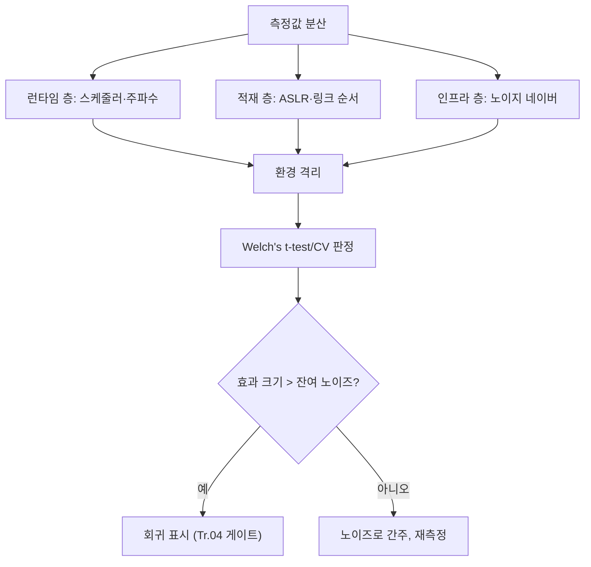

**변동성 관리(variance management)**란 같은 코드를 같은 하드웨어에서 반복 실행해도 매번 조금씩 달라지는 성능 측정값(노이즈)을 통계적으로 다루고, 필요하면 환경을 격리해 그 크기 자체를 줄이는 작업을 말합니다. 회귀 게이트가 아무리 정교해도 노이즈가 실제 회귀보다 크면 게이트는 **무작위로 통과·실패**하는 동전 던지기가 되어버립니다. 이 장은 노이즈가 어디서 오는지, 몇 번 반복해야 신호와 소음을 가를 수 있는지, 그리고 반복을 늘리는 대신 환경을 격리해 애초에 노이즈를 줄이는 선택지를 언제 쓰는지를 다룹니다.

## 이 장을 읽기 전에

이 장은 [기준선 관리](/post/regression-prevention/performance-baseline-management-strategy/)에서 다룬 "기준선을 무엇과 비교할지" 개념과, [Low-latency 프로파일링·성능 분석 트랙의 통계적 벤치마킹](/post/profiling-analysis/statistical-benchmarking/)에서 다룬 신뢰구간·효과 크기 개념을 전제로 합니다. 후자가 "측정을 어떻게 통계적으로 신뢰할 것인가"라는 일반론을 다룬다면, 이 장은 그 통계를 **회귀 방지 파이프라인 안에서 반복 횟수·환경 격리 정책으로 구체화**하는 데 집중합니다. 통계 용어(신뢰구간, p-value, 효과 크기)를 처음 접한다면 위 링크를 먼저 읽는 것을 권합니다.

**이 장의 깊이**: 노이즈의 원천을 층위별로 분류하고, 반복 횟수·유의성 판정 기준을 설계하며, 환경 격리 기법의 비용 대비 효과를 판단하는 수준까지 다룹니다. **다루지 않는 것**: CI 도구별 설정 방법(→ [벤치마크 CI 통합](/post/regression-prevention/benchmark-ci-integration-codspeed-bencher/)), PR 게이트의 승인/차단 로직 자체(→ [PR 성능 게이트](/post/regression-prevention/pr-performance-gate-design/)), 노이즈를 견딘 뒤의 알림 발송 정책(→ [알림 전략](/post/regression-prevention/performance-alerting-strategy-design/)), 분산·다중 노드 환경에서의 샘플링 대표성(→ [분산·클러스터 성능 회귀](/post/regression-prevention/distributed-cluster-performance-regression-expert/))입니다.

## 당신의 수준에 맞는 경로

| 수준 | 읽을 부분 | 핵심 목표 |
|------|---------|---------|
| **중급자** | "노이즈는 어디서 오는가" ~ "노이즈의 원천을 층위로 나누기" | 측정값이 매번 달라지는 이유를 층위별로 설명할 수 있다 |
| **심화** | "통계적 유의성으로 신호와 소음 가르기" ~ "환경 격리로 변동성 자체를 줄이기" | 반복 횟수·유의성 기준을 설계하고 환경 격리 기법을 선택할 수 있다 |
| **전문가** | "판단 기준" ~ "비판적 시각" | 통계적 스무딩과 환경 격리 중 무엇에 투자할지 비용 대비 판단할 수 있다 |

---

## 노이즈는 어디서 오는가 (배경)

성능 측정에 변동성이 있다는 사실 자체는 오래된 상식이지만, 그 변동성이 **얼마나 쉽게 잘못된 결론으로 이어지는지**를 체계적으로 보인 연구는 상대적으로 늦게 나왔습니다. Todd Mytkowicz, Amer Diwan, Matthias Hauswirth, Peter F. Sweeney는 ASPLOS 2009에서 발표한 [측정 편향에 관한 논문](https://sape.inf.usi.ch/publications/asplos09)에서, 환경 변수의 크기나 링크 순서처럼 실험과 무관해 보이는 설정 하나만 바꿔도 서로 다른 최적화 기법의 우열이 뒤집힐 수 있음을 여러 CPU 아키텍처와 컴파일러 조합에서 보였습니다. 이들은 133편의 시스템 논문을 조사해 대부분이 이런 측정 편향(measurement bias)을 통제하지 않았다는 점도 지적했습니다. 이 결과가 회귀 방지에 주는 함의는 단순합니다. **"측정값이 달라졌다"와 "코드가 느려졌다"는 서로 다른 명제이며, 그 차이를 메우는 것이 이 장의 주제입니다.**

노이즈의 근본 원인은 크게 세 층위로 나눌 수 있습니다. 스케줄러·주파수·캐시 상태처럼 실행마다 달라지는 **런타임 층**, ASLR·링크 순서·환경 변수 크기처럼 실행 시작 시점에 고정되지만 실행마다 무작위인 **적재 층**, 그리고 공유 하드웨어·가상화·이웃 프로세스처럼 내가 통제할 수 없는 **인프라 층**입니다. 아래에서 각 층을 순서대로 살펴봅니다.

## 노이즈의 원천을 층위로 나누기

**런타임 층**의 대표적인 원인은 OS 스케줄러 지터(jitter)와 CPU 주파수 변동입니다. 스케줄러는 벤치마크 스레드를 다른 코어로 옮기거나(마이그레이션), 다른 프로세스에 시간을 배분하기 위해 컨텍스트 스위치를 일으킵니다. 여기에 더해 최신 CPU는 열·전력 상황에 따라 클럭을 동적으로 올리고 내리는 터보 부스트(Intel Turbo Boost, AMD Precision Boost)를 사용하므로, 같은 코드가 어떤 순간에는 더 높은 클럭으로, 어떤 순간에는 낮은 클럭으로 실행됩니다. 캐시·분기 예측기의 워밍 상태도 실행 시점의 우연에 좌우되는 런타임 노이즈입니다.

**적재 층**의 노이즈는 프로세스가 시작되는 그 순간에 고정되어 버리는 값들에서 옵니다. ASLR(Address Space Layout Randomization)은 스택·힙·라이브러리의 가상 주소를 매 실행마다 무작위로 배치하는데, 이 배치가 캐시 라인 정렬이나 TLB 히트율에 영향을 미쳐 실행 시간을 바꿀 수 있습니다. 환경 변수의 총 크기나 링크 순서도 스택 정렬을 미묘하게 바꿔 비슷한 효과를 냅니다. Mytkowicz 등이 지적한 것이 바로 이 층의 문제입니다 — 코드를 전혀 바꾸지 않아도 이런 요인만으로 측정값이 갈립니다.

**인프라 층**의 노이즈는 클라우드·컨테이너 환경의 **노이지 네이버(noisy neighbor)**에서 옵니다. 같은 물리 호스트를 공유하는 다른 VM·컨테이너가 캐시·메모리 대역폭·네트워크를 두고 경쟁하면, 내 벤치마크의 측정값은 내 코드와 무관하게 흔들립니다. CI 러너가 매번 다른 물리 노드에 배정되는 구조라면 이 노이즈는 더 커집니다. [벤치마크 CI 통합](/post/regression-prevention/benchmark-ci-integration-codspeed-bencher/)에서 다루는 베어메탈 동일성 벤치마킹은 바로 이 인프라 층의 노이즈를 없애려는 접근입니다.

## 통계적 유의성으로 신호와 소음 가르기

노이즈를 완전히 없앨 수 없다면, 남은 선택지는 **"이 차이가 노이즈보다 큰가"를 통계적으로 판정**하는 것입니다. 가장 단순한 접근은 평균과 표준편차만 비교하는 것이지만, 지연 분포는 대개 오른쪽으로 긴 꼬리를 가지는 비대칭 분포이므로 평균과 표준편차만으로는 분포 모양을 놓치기 쉽습니다. 두 표본(기준선 실행과 PR 실행)의 평균이 다를 때 그 차이가 우연인지 판단하려면 t-검정 계열의 가설 검정이 필요한데, 두 표본의 분산이 다르다고 가정하는 **Welch's t-test**가 벤치마크 비교에 더 안전합니다 — 표준 스튜던트 t-검정은 두 표본의 분산이 같다고 가정하지만, PR 변경이 실제로 분산 자체를 바꾸는 경우(예: 락 경합 추가)에는 이 가정이 깨지기 때문입니다. 분포가 정규분포에서 크게 벗어난다고 판단되면 순위 기반의 비모수 검정(Mann-Whitney U)으로 대체하는 것도 흔한 선택입니다.

유의성 판정 하나만으로는 부족합니다. 표본 수를 충분히 늘리면 **아주 작은 차이도 통계적으로 유의**해질 수 있으므로, p-value와 함께 **효과 크기(effect size)**, 즉 차이의 절대·상대 크기가 실무적으로 의미 있는 수준인지 같이 봐야 합니다. 실무에서는 이를 **변동계수(coefficient of variation, CV = 표준편차 / 평균)**로 단순화해 쓰는 경우가 많습니다. CV가 낮다는 것은 같은 조건에서 반복해도 값이 촘촘하게 모인다는 뜻이므로, PR 실행값과 기준선 실행값의 차이가 "각 표본의 CV로 설명되는 범위"를 넘어설 때만 회귀로 표시하는 방식입니다.

```cpp
#include <benchmark/benchmark.h>

static void BM_HotPath(benchmark::State& state) {
  for (auto _ : state) {
    // 측정 대상 코드
    benchmark::DoNotOptimize(state.iterations());
  }
}

// Repetitions(20): 벤치마크 전체를 20회 반복 실행해 실행 간(run-to-run) 분산을 드러냄
// DisplayAggregatesOnly(true): 개별 반복이 아니라 mean/median/stddev/cv 집계만 출력
BENCHMARK(BM_HotPath)->Repetitions(20)->DisplayAggregatesOnly(true);

BENCHMARK_MAIN();
```

Google Benchmark는 [`--benchmark_repetitions` 옵션](https://github.com/google/benchmark/blob/main/docs/user_guide.md)으로 벤치마크 프로그램 전체를 여러 번 다시 실행하도록 지시하면 각 반복의 평균·중앙값·표준편차·변동계수(CV)를 자동으로 계산해 보고합니다. 다만 이 반복은 한 프로세스 안에서 루프를 도는 것과 달리 매번 새로 실행되므로, 위에서 설명한 적재 층 노이즈(ASLR 등)까지 포함해 측정하게 됩니다. 이는 오히려 장점이 될 수도 있습니다 — CI에서 실제로 겪을 노이즈를 더 현실적으로 반영하기 때문입니다.

## 반복 횟수를 어떻게 설계할 것인가

"몇 번 반복하면 충분한가"는 회귀 방지 파이프라인을 설계할 때 가장 자주 나오는 질문이지만, 정답은 고정된 숫자가 아니라 **탐지하고 싶은 최소 효과 크기와 노이즈의 크기(CV)에 따라 달라지는 계산 결과**입니다. 검정력 분석(power analysis)은 "노이즈가 CV만큼 있는 상황에서, 실제 차이가 δ(퍼센트)일 때 이를 검출할 확률(검정력)을 80~90%로 맞추려면 표본이 몇 개 필요한가"를 역산하는 방법입니다. 대략적인 근사식은 표본 크기 n이 (CV / δ)²에 비례한다는 것인데, 이는 노이즈가 2배 커지면 필요한 반복 횟수가 4배로 늘어난다는 뜻이므로, "반복을 늘려서 해결"하는 접근이 노이즈가 클수록 빠르게 비효율적으로 변한다는 것을 보여줍니다.

```python
#!/usr/bin/env python3
# 요구 사항: Python 3.9+, scipy>=1.9 (pip install scipy)
# 실행: python3 variance_gate.py
import math
from scipy import stats

def required_repetitions(cv: float, min_detectable_pct: float, power: float = 0.8) -> int:
    """CV(변동계수)와 검출하려는 최소 변화율(min_detectable_pct, 예: 0.03=3%)로부터
    근사 표본 크기를 역산한다. z_alpha/z_beta는 양측 검정, 유의수준 0.05 기준."""
    z_alpha, z_beta = 1.96, stats.norm.ppf(power)
    n = ((z_alpha + z_beta) * cv / min_detectable_pct) ** 2
    return math.ceil(n)

def is_regression(baseline: list[float], candidate: list[float], alpha: float = 0.05) -> bool:
    """두 표본의 분산이 다를 수 있다고 가정하는 Welch's t-test로 유의성만 판단한다.
    실무에서는 이 결과에 효과 크기(예: 평균 차이 3% 이상)를 함께 요구해야 한다."""
    _, p_value = stats.ttest_ind(baseline, candidate, equal_var=False)
    return p_value < alpha and (sum(candidate) / len(candidate)) > (sum(baseline) / len(baseline))

if __name__ == "__main__":
    print(required_repetitions(cv=0.06, min_detectable_pct=0.03))  # 예: CV 6%에서 3% 변화 검출
```

이 스크립트는 두 가지를 분리해서 보여줍니다. `required_repetitions`는 사전에 "이 정도 노이즈에서 이 정도 변화를 잡고 싶다"를 반복 횟수로 환산하는 계획 단계이고, `is_regression`은 실제 게이트 실행 시점에 두 표본을 비교하는 판정 단계입니다. 두 함수 모두 근사치이므로, CV 자체가 실행 환경마다 다르다는 점(다음 절)을 감안해 여유를 두고 설계해야 합니다. 워밍업 반복(캐시·분기 예측기를 안정 상태로 만들기 위한 예열 실행)은 이 계산에 포함하지 않고 별도로 버리는 것이 일반적입니다.

## 환경 격리로 변동성 자체를 줄이기

반복 횟수를 늘리는 것은 **노이즈를 통계적으로 상쇄**하는 접근이고, 환경 격리는 **노이즈 자체를 줄여 더 적은 반복으로도 유의성을 얻는** 접근입니다. 두 접근은 배타적이지 않고 보완적이며, CI 실행 시간 예산이 빠듯할수록 환경 격리의 가치가 커집니다. 아래 목록은 Google Benchmark 프로젝트가 정리한 [변동성 감소 가이드](https://github.com/google/benchmark/blob/main/docs/reducing_variance.md)와 대체로 일치하는 실무 항목들입니다.

- **CPU 주파수 고정**: `cpupower frequency-set --governor performance`로 주파수 스케일링 거버너를 고정하고, 터보 부스트를 끄면(`echo 0 | sudo tee /sys/devices/system/cpu/cpufreq/boost`, 플랫폼·커널 버전에 따라 경로가 다를 수 있음) 클럭 변동에서 오는 노이즈를 제거할 수 있습니다.
- **CPU 격리·고정**: `taskset -c 0 ./benchmark`로 벤치마크 프로세스를 특정 코어에 고정하면 코어 간 이주(migration)를 막습니다. 부팅 시 [`isolcpus` 커널 파라미터](https://www.kernel.org/doc/html/latest/admin-guide/kernel-parameters.html)로 특정 코어를 스케줄러의 일반 배정 대상에서 아예 제외하면, 그 코어에는 다른 프로세스가 배정되지 않아 격리 효과가 더 강해집니다.
- **하이퍼스레딩(SMT) 비활성화**: 동일 물리 코어를 공유하는 논리 코어가 있으면 경합이 생기므로, BIOS 또는 `/sys` 인터페이스로 SMT를 끄는 것도 변동성을 줄이는 방법입니다.
- **ASLR 비활성화**: `echo 0 > /proc/sys/kernel/randomize_va_space`로 주소 무작위화를 끄면 적재 층 노이즈가 줄지만, 이는 보안 완화 기법을 끄는 것이므로 **격리된 벤치마크 전용 환경에서만** 적용하고 프로덕션에는 적용하지 않습니다.
- **전용 러너·베어메탈**: 공유 CI 러너 대신 전용 물리 머신이나 예약된 인스턴스를 쓰면 노이지 네이버 문제를 원천적으로 줄일 수 있습니다. 이 접근의 CI 도구 차원 구현은 [벤치마크 CI 통합](/post/regression-prevention/benchmark-ci-integration-codspeed-bencher/)에서 다룹니다.

이 목록의 기법은 서로 독립적으로 도입할 수 있지만, 모두 적용해도 노이즈가 0이 되지는 않습니다. 환경 격리는 CV를 낮춰 필요한 반복 횟수를 줄여주는 것이지, 통계적 판정 자체를 대체하지는 못합니다.



## 흔한 오개념

**"평균만 비교하면 충분하다"**는 오개념입니다. 지연 분포는 꼬리가 길기 때문에 평균이 같아도 p99가 크게 달라질 수 있고, 노이즈의 크기(분산)가 커지면 평균 자체의 신뢰구간도 넓어져 작은 회귀를 평균으로는 아예 잡을 수 없습니다. p50과 p99를 같이 보고, 가능하면 분포 전체(히스토그램)를 비교 대상에 포함해야 합니다.

**"반복 횟수를 늘리면 노이즈가 항상 사라진다"**도 오개념입니다. 반복을 늘리면 **평균 추정치의 표준오차**는 줄어들지만, 이는 노이즈가 무작위(random)라는 전제에서만 성립합니다. 링크 순서나 특정 CI 노드의 하드웨어 편차처럼 **체계적 편향(systematic bias)**이 있다면, 아무리 반복해도 그 편향은 사라지지 않고 오히려 "통계적으로 유의하지만 실제로는 환경 차이인" 잘못된 신호로 굳어질 수 있습니다. 이런 편향은 반복이 아니라 환경 격리나 설정 무작위화로만 줄일 수 있습니다.

**"CI의 가상 러너에서도 로컬 개발 머신과 같은 정밀도를 기대할 수 있다"**도 흔한 착각입니다. 공유 클라우드 러너는 노이지 네이버·가변 CPU 세대·스로틀링이 흔해 CV가 로컬 전용 머신보다 훨씬 클 수 있습니다. CI 환경의 실제 CV를 먼저 측정해보지 않고 로컬에서 검증한 반복 횟수·임계값을 그대로 CI에 옮기면 오탐이 급증합니다.

## 판단 기준

| 상황 | 우선 조치 | 근거 |
|------|-----------|------|
| CV가 이미 낮고(예: 2% 이하) 반복 여유가 있음 | 반복 횟수만 소폭 늘려 통계적으로 처리 | 환경 격리 비용 대비 효과가 낮음 |
| CV가 높고(예: 10% 이상) CI 실행 시간 예산이 빠듯함 | 환경 격리(주파수 고정·CPU 고정) 먼저 적용 | 반복만으로는 필요 표본 수가 과도하게 커짐 |
| 공유 클라우드 러너에서 게이트 오탐이 잦음 | 노이지 네이버 의심, 전용 러너·베어메탈 검토 | 인프라 층 노이즈는 반복으로 해결 안 됨 |
| 탐지하려는 회귀 폭이 매우 작음(1% 이하) | CV·반복·환경 격리를 모두 강화 | 작은 효과 크기는 노이즈에 쉽게 묻힘 |
| 벤치마크가 이미 안정적이나 실패가 산발적 | 개별 실패 로그에서 체계적 편향(특정 노드·시간대) 먼저 확인 | 무작위 노이즈와 체계적 편향의 대응이 다름 |

## 비판적 시각: 한계와 트레이드오프

환경 격리는 공짜가 아닙니다. 전용 러너·베어메탈은 비용과 운영 부담을 늘리고, ASLR·SMT 비활성화는 보안·처리량 트레이드오프를 수반하므로 벤치마크 전용 환경에 한정해야 합니다. 통계적 판정도 만능은 아닙니다 — 유의수준과 검정력을 아무리 정교하게 잡아도, 표본 자체가 실제 프로덕션 트래픽 패턴을 대표하지 못하면([분산·클러스터 성능 회귀](/post/regression-prevention/distributed-cluster-performance-regression-expert/)에서 다루는 대표성 문제) 통계적으로 유의한 결과가 실무적으로는 무의미할 수 있습니다. 또한 변동성 관리에 투입하는 엔지니어링 노력 자체가 팀의 속도를 늦출 수 있으므로, CV를 얼마까지 줄일지·반복을 얼마나 늘릴지는 회귀 탐지의 가치와 CI 파이프라인 속도 사이의 명시적 타협점이어야 합니다. "노이즈를 완전히 제거"하는 것은 목표가 될 수 없고, "남은 노이즈의 크기를 알고 그에 맞게 임계값을 정하는 것"이 현실적인 목표입니다.

## 마무리

- [ ] 노이즈의 원천을 런타임·적재·인프라 세 층위로 구분해 설명할 수 있는가?
- [ ] 왜 두 표본 비교에 Welch's t-test가 표준 t-검정보다 안전한 기본값인지 설명할 수 있는가?
- [ ] CV와 탐지하려는 최소 효과 크기로부터 필요한 반복 횟수를 근사할 수 있는가?
- [ ] 반복 횟수를 늘리는 것과 환경을 격리하는 것 중 무엇을 먼저 투입할지 CV 크기로 판단할 수 있는가?
- [ ] "반복을 늘리면 노이즈가 항상 사라진다"는 오개념이 왜 틀렸는지 설명할 수 있는가?

**이전 장**: [기준선 관리](/post/regression-prevention/performance-baseline-management-strategy/) (챕터 05)에서는 "무엇과 비교할 것인가"를 다뤘다면, 이 장은 "그 비교가 노이즈에 묻히지 않게 하려면 무엇을 해야 하는가"를 다뤘습니다. 다음 장에서는 이렇게 걸러낸 신호를 장기간 누적해 추세로 보여주는 [관측 가능성 플랫폼](/post/regression-prevention/performance-observability-platform-design/)을 다룹니다. 변동성이 줄어든 측정값이라야 관측 플랫폼의 대시보드와 알림이 의미를 갖습니다.
