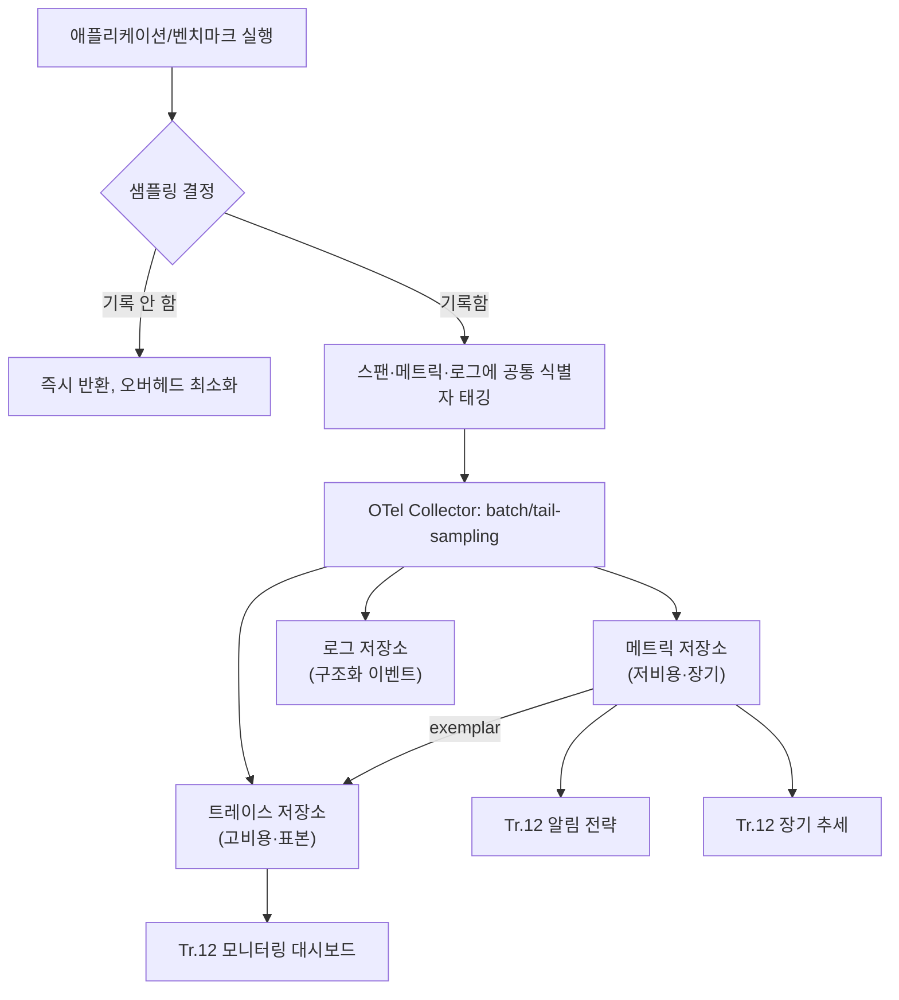

**성능 관측 가능성 플랫폼(performance observability platform)**이란 메트릭·트레이스·로그라는 서로 다른 성능 신호를 하나의 조사 흐름 안에서 서로 조인(join)할 수 있게 설계하는 시스템을 말합니다. 회귀 게이트가 "느려졌다"는 사실 하나를 알려주는 것과, 그 느려짐이 어떤 요청·어떤 함수·어떤 커밋에서 왔는지까지 이어서 보여주는 것은 전혀 다른 난이도의 문제입니다. 대시보드에 메트릭 그래프, 별도 화면에 트레이스 뷰어, 또 다른 화면에 로그 검색창을 각각 열어두는 것만으로는 관측 가능성이 생기지 않습니다. 세 신호가 물리적으로 다른 저장소에 있어도 **공통 식별자로 서로를 가리킬 수 있어야** 회귀 조사가 "그래프를 눈으로 대조하는 일"에서 "클릭 한 번으로 원인 후보를 좁히는 일"로 바뀝니다. 이 장은 그 연결을 가능하게 하는 아키텍처적 선택—무엇을 어디에 저장하고, 무엇으로 서로를 연결하며, 어디까지 계측 비용을 감수할지—를 다룹니다.

## 이 장을 읽기 전에

이 장은 [변동성 관리](/post/regression-prevention/performance-variance-noise-management/)에서 다룬 "노이즈를 걸러낸 신호"가 이미 있다는 것과, [기준선 관리](/post/regression-prevention/performance-baseline-management-strategy/)에서 다룬 "무엇과 비교하는가" 개념을 전제로 합니다. 이 장은 그렇게 걸러진 신호를 **어디에 저장하고 어떻게 서로 연결할지**의 설계 문제에 집중합니다. **다루지 않는 것**: CI 도구별 벤치마크 수집 설정(→ [벤치마크 CI 통합](/post/regression-prevention/benchmark-ci-integration-codspeed-bencher/), [Benchmark as Code](/post/regression-prevention/benchmark-as-code-github-actions-gitlab-ci/)), Grafana·Prometheus 대시보드를 실제로 구축하는 절차(→ [모니터링 대시보드](/post/regression-prevention/performance-monitoring-dashboard-grafana-prometheus/)), 임계값·알림 채널 정책(→ [알림 전략](/post/regression-prevention/performance-alerting-strategy-design/)), 누적된 데이터로 장기 추세를 추출하는 통계 기법(→ [장기 추세 분석](/post/regression-prevention/long-term-performance-trend-analysis/))입니다. 이 장은 그 모든 후속 작업이 딛고 설 **데이터 모델**을 다룹니다.

**이 장의 깊이**: 메트릭·트레이스·로그 세 신호의 역할 분담, 이들을 연결하는 구체적 메커니즘(공통 식별자, exemplar), 카디널리티·비용·계측 오버헤드의 설계 트레이드오프까지 다룹니다. 특정 벤더 제품의 화면 조작법은 다루지 않습니다.

## 당신의 수준에 맞는 경로

| 수준 | 읽을 부분 | 핵심 목표 |
|------|---------|---------|
| **중급자** | "세 기둥에서 상관 분석으로" ~ "메트릭·트레이스·로그의 역할 분담" | 세 신호가 왜 필요하고 각각 무엇을 답하는지 설명할 수 있다 |
| **심화** | "상관관계를 설계로 만들기" ~ "카디널리티·비용·오버헤드의 트레이드오프" | 공통 식별자와 exemplar로 신호를 연결하고 샘플링 전략을 설계할 수 있다 |
| **전문가** | "판단 기준" ~ "비판적 시각" | 플랫폼 투자 규모를 조직 상황에 맞게 판단하고 한계를 비판적으로 평가할 수 있다 |

---

## 세 기둥에서 상관 분석으로 (배경)

관측 가능성을 메트릭·로그·트레이스라는 **세 기둥(three pillars)**으로 나누는 관점은 오랫동안 업계 표준 설명 틀이었습니다. 이 틀이 실무에 뿌리내리는 데 결정적 역할을 한 것이 **OpenTelemetry**입니다. 분산 추적 계측을 표준화하려던 **OpenTracing**과 메트릭·트레이스를 함께 다루던 구글 주도의 **OpenCensus**는 2019년까지 별도 프로젝트로 경쟁하며 계측 생태계를 갈라놓았고, 두 프로젝트의 리더십은 이 분열이 "누구나 쓸 수 있는 고품질 텔레메트리"라는 공동 목표를 방해한다고 판단해 하나의 이니셔티브로 합치기로 결정했습니다. 그 결과물이 2019년 5월 CNCF 산하로 출범한 OpenTelemetry이며, 이후 벤더 중립적인 계측 표준(OTLP 프로토콜, 시맨틱 컨벤션)으로 자리 잡아 2026년 5월 CNCF Graduated 등급까지 승격되었습니다. 이 등급 승격 발표에서 CNCF는 12,000명 이상의 기여자와 2,800개 이상 기업의 참여, Amazon·Bloomberg·eBay 등 프로덕션 채택 사례를 근거로 들었습니다.

세 기둥 모델에 대한 비판도 존재합니다. Honeycomb의 Charity Majors가 주창하는 **"observability 2.0"** 관점은 메트릭·로그·트레이스를 애초에 분리 저장하지 말고, 컨텍스트가 풍부한 **넓은 구조화 이벤트(wide structured event, 사실상 span)** 하나를 단일 진실 공급원으로 삼아 나머지를 그로부터 **파생(derive)**시키자고 주장합니다. 이 장은 어느 한쪽이 정답이라고 단정하지 않습니다. 세 기둥이든 단일 wide-event 모델이든, 회귀 진단에서 실제로 필요한 것은 "이 신호와 저 신호가 같은 사건을 가리킨다"는 것을 기계적으로 증명할 수 있는 연결 고리이기 때문입니다. 아래 절부터는 그 연결을 실제로 설계하는 방법을 다룹니다.

## 메트릭·트레이스·로그의 역할 분담

세 신호를 같은 목적(성능 회귀 원인 규명)에 함께 쓰는 이유는 각자 답할 수 있는 질문이 다르기 때문입니다. 하나만 있으면 항상 "그래서 다음엔 뭘 봐야 하지?"라는 질문이 남습니다.

### 메트릭: 무엇이 회귀했는가

메트릭은 시간에 따른 숫자 하나(또는 히스토그램 버킷)를 저장하는 가장 저렴한 신호입니다. 태그(레이블) 조합이 늘어날수록 저장 비용이 기하급수적으로 늘어나는 **카디널리티 제약** 때문에, 메트릭은 보통 "서비스명·엔드포인트·리전" 정도의 낮은 차원으로 집계됩니다. 그 대가로 장기간(수개월~수년) 저비용으로 보존할 수 있고, "p99 지연이 화요일 새벽부터 15% 올랐다"처럼 **언제 어떤 지표가 회귀했는지**를 빠르게 보여주는 데 최적입니다. 다만 메트릭 자체는 "왜"를 답하지 못합니다.

### 트레이스: 어디서 시간이 갔는가

트레이스는 하나의 요청(또는 하나의 벤치마크 반복 실행)이 여러 함수·서비스·스레드를 거치는 동안 각 구간(span)에서 소요된 시간을 나무 구조로 기록합니다. 메트릭이 "얼마나 많이 느려졌는가"의 집계라면, 트레이스는 "이 특정 실행에서 어느 구간이 느려졌는가"를 보여주는 개별 사례입니다. 트레이스는 스팬마다 함수명·인자·스레드 ID 같은 고차원 컨텍스트를 담기 때문에 카디널리티 제약이 사실상 없지만, 그만큼 저장 비용이 크고 전수 보존이 비현실적이라 대개 샘플링됩니다.

### 로그: 무엇이 바뀌었는가

로그(구조화 이벤트)는 "이 실행에서 어떤 빌드·커밋·설정·환경 변수가 쓰였는가"처럼 트레이스 스팬 안에 넣기엔 어색하지만 원인 규명에 필수적인 컨텍스트를 담습니다. 배포 이벤트, 설정 변경, CI 환경 지문(컴파일러 버전, 최적화 플래그) 같은 것이 대표적입니다. 메트릭이 회귀가 **언제** 시작됐는지 알려주면, 그 시점 전후의 로그는 **무엇이 바뀌었길래** 회귀가 시작됐는지에 대한 가장 직접적인 후보를 제공합니다.

이 세 신호는 서로 대체재가 아니라 보완재입니다. 메트릭으로 회귀 발생 시점을 좁히고, 그 시점의 트레이스로 느려진 구간을 좁히고, 그 구간·시점의 로그로 원인이 된 변경을 좁히는 것이 회귀 조사의 자연스러운 순서입니다. 문제는 이 세 조회를 사람이 수동으로 대조해야 한다면, 조사 시간이 신호 개수만큼 늘어난다는 것입니다.

## 상관관계를 설계로 만들기: 공통 식별자와 exemplar

세 신호를 실제로 연결하려면 저장 시점부터 **공통 식별자**를 모든 신호에 함께 태깅해야 합니다. 분산 추적에서는 이를 트레이스 컨텍스트(trace ID, span ID)라 부르고, 벤치마크·CI 맥락에서는 여기에 커밋 SHA, 벤치마크 실행 ID, 빌드 플래그 해시 같은 값을 추가로 태깅합니다. 핵심은 "메트릭의 한 점, 트레이스의 한 스팬, 로그의 한 줄이 같은 사건을 가리킨다"는 것을 문자열 하나의 일치로 증명할 수 있게 만드는 것입니다.

이 연결을 메트릭 쪽에서 구체적으로 구현하는 메커니즘이 **exemplar**입니다. exemplar는 히스토그램 버킷 같은 집계 메트릭에 "이 버킷에 실제로 기여한 대표 트레이스 ID"를 함께 붙여 저장하는 것으로, Grafana 공식 문서는 이를 "주어진 시간 구간에서 측정된 특정 트레이스를 대표하는 값"이라고 설명합니다. 지연 히스토그램이 튀는 구간을 그래프에서 발견하면, 그 지점의 exemplar를 클릭해 바로 그 트레이스로 이동할 수 있어 "메트릭에서 트레이스로" 건너뛰는 수동 검색을 없앨 수 있습니다. Prometheus는 2.26 버전부터 OpenMetrics 노출 형식으로 exemplar를 네이티브 지원하며, 표준 계측 계층인 OpenTelemetry SDK도 exemplar 부착을 지원합니다.

```yaml
# OpenTelemetry Collector 파이프라인 설계 스케치(개념 예시, 실제 배포 시 exporter별 옵션은 버전에 따라 다름)
receivers:
  otlp:
    protocols:
      grpc:
      http:
processors:
  batch: {}          # 익스포트 전 배치 처리로 네트워크 호출 수를 줄임
  tail_sampling:      # 오류·느린 요청 등 "관심 있는" 트레이스만 보존
    policies:
      - name: slow-traces
        type: latency
        latency: { threshold_ms: 200 }
exporters:
  prometheus:         # 메트릭: 낮은 카디널리티, 장기 보존
  otlphttp/traces:    # 트레이스: tail sampling을 거친 표본만 저장
  loki:               # 로그: 구조화 이벤트, 커밋 SHA·빌드 플래그 태깅
service:
  pipelines:
    metrics: { receivers: [otlp], processors: [batch], exporters: [prometheus] }
    traces: { receivers: [otlp], processors: [batch, tail_sampling], exporters: [otlphttp/traces] }
    logs: { receivers: [otlp], processors: [batch], exporters: [loki] }
```

이 설정 스케치가 보여주는 핵심은 세 파이프라인이 **같은 수집기(collector)를 통과**하면서도 서로 다른 보존 정책(메트릭은 전수·장기, 트레이스는 표본·단기)을 적용받는다는 점입니다. 실제 필드명·exporter 옵션은 OpenTelemetry Collector 버전과 벤더 배포판(예: Grafana Alloy, 각 클라우드 관리형 서비스)마다 달라지므로, 여기서는 구조만 참고하고 배포 시점의 공식 문서를 따라야 합니다.

## 카디널리티·비용·오버헤드의 트레이드오프

트레이스를 전수 보존하고 싶은 유혹은 자연스럽지만, 고빈도 핫패스에서는 요청마다 스팬을 만들고 내보내는 비용 자체가 측정 대상에 영향을 줍니다. 이는 [변동성 관리](/post/regression-prevention/performance-variance-noise-management/)에서 다룬 "측정 자체가 노이즈를 만든다"는 문제와 같은 구조입니다 — 계측이 무거울수록 계측이 측정하려는 지연에 스스로를 더한다는 관찰자 효과(observer effect)가 커집니다. 그래서 실무에서는 두 층의 결정을 분리합니다. 하나는 **무엇을 얼마나 자주 기록할지**(샘플링 비율), 다른 하나는 **어떻게 하면 그 기록이 핫패스를 최소한으로 건드릴지**(비동기 익스포트, 배치 전송)입니다.

**tail-based sampling**(꼬리 기반 샘플링)은 요청이 끝난 뒤에야 "이 트레이스가 느렸는지, 오류가 났는지"를 알 수 있다는 점에 착안해, 전체 요청 중 정상 범위는 낮은 비율로만 남기고 느린 꼬리(p99 근방)나 오류는 우선적으로 전량 보존하는 전략입니다. 이렇게 하면 저장 비용은 낮게 유지하면서도, 회귀 조사에 실제로 필요한 "느렸던 사례"의 트레이스는 놓치지 않을 확률이 높아집니다. 반대로 head-based sampling(요청 시작 시점에 미리 비율을 정해 무작위로 선택)은 구현은 단순하지만, 드물게 발생하는 느린 꼬리를 우연히 놓칠 위험이 더 큽니다.

계측 자체의 오버헤드를 핫패스에서 줄이는 가장 단순한 방법은 스팬을 만들지 여부를 실행 초반에 확률적으로 결정해, 샘플링 대상이 아닌 실행에서는 스팬 생성·속성 채우기·직렬화 비용을 아예 건너뛰는 것입니다. 아래는 그 판단 지점만 격리한 예시입니다(실제 트레이서 SDK 연동 없이, 샘플링 결정 로직만 컴파일·실행 가능하게 축약).

```cpp
#include <atomic>
#include <cstdint>
#include <random>

// 스레드마다 하나씩 두는 것을 권장: rd()/gen()을 요청마다 새로 만들면 그 자체가 오버헤드가 됨
thread_local std::mt19937 rng(std::random_device{}());

// sample_rate: 0.0~1.0. 예를 들어 0.01은 요청의 약 1%만 전체 계측을 수행.
bool should_trace(double sample_rate) {
  std::uniform_real_distribution<double> dist(0.0, 1.0);
  return dist(rng) < sample_rate;
}

void handle_request(bool force_trace_on_slow_path) {
  // force_trace_on_slow_path: 이미 알려진 느린 경로(에러 재시도 등)로 진입했다면
  // 확률 샘플링을 건너뛰고 항상 기록 — tail-based sampling의 앞단 근사
  const bool trace_this = force_trace_on_slow_path || should_trace(0.01);
  if (!trace_this) {
    // 스팬 생성·속성 채우기·직렬화를 모두 건너뛰어 핫패스 비용을 0에 가깝게 유지
    return;
  }
  // trace_this == true인 실행에서만 실제 스팬 시작·속성 부여·익스포터 큐잉을 수행
}
```

이 패턴의 핵심은 "샘플링 여부를 판단하는 비용" 자체를 극단적으로 싸게 만드는 것입니다. 실제 계측 SDK 대부분이 내부적으로 비슷한 조기 반환(early return) 구조를 쓰지만, SDK가 그 판단을 어디서 하는지(요청 진입 직후인지, 스팬 종료 시점인지)에 따라 핫패스에 남는 잔여 오버헤드가 달라지므로 도입 전 해당 SDK·버전의 벤치마크로 확인해야 합니다. 계측 오버헤드의 절대 수치는 언어 바인딩·SDK 버전·컴파일 옵션에 따라 크게 갈리므로 이 장에서 특정 퍼센트를 단정하지 않습니다.



## 흔한 오개념

**"로그를 많이 남기면 관측 가능성이 좋아진다"**는 오개념입니다. 구조화되지 않았거나 공통 식별자가 없는 로그는 양이 아무리 많아도 다른 신호와 조인할 수 없어, 사람이 눈으로 훑어야 하는 텍스트 더미로 남습니다. 관측 가능성은 로그의 양이 아니라 **다른 신호와의 연결 가능성**에서 나옵니다.

**"트레이스(또는 wide event) 하나면 메트릭·로그가 필요 없다"**도 지나친 단순화입니다. observability 2.0 관점처럼 하나의 넓은 이벤트에서 다른 데이터 타입을 파생시키는 접근은 매력적이지만, 장기 보존 비용과 조직의 계측 성숙도(모든 팀이 일관되게 넓은 이벤트를 방출하도록 규율을 지키는 것)를 함께 감당해야 성립합니다. 계측 규율이 약한 조직에서는 낮은 카디널리티의 메트릭이 여전히 가장 안정적으로 신뢰할 수 있는 신호입니다.

**"대시보드에 그래프를 모아두면 통합 플랫폼이다"**도 흔한 착각입니다. 화면 하나에 메트릭 패널과 트레이스 패널을 나란히 배치하는 것은 UX 통합일 뿐, 데이터가 공통 식별자로 조인되지 않으면 사람이 두 그래프를 눈으로 대조해야 하는 수고는 그대로 남습니다. 실제 통합은 저장소가 아니라 **식별자 설계**에서 결정됩니다.

## 판단 기준

| 상황 | 우선 조치 | 근거 |
|------|-----------|------|
| CI 벤치마크만 있고 프로덕션 트래픽과의 상관이 필요 없음 | 메트릭 중심의 단순 구조로 충분, 트레이스 전수 도입은 과잉 투자 | 상관 대상이 적으면 연결 비용을 들일 이유가 약함 |
| 회귀가 특정 요청 패턴에서만 재현되고 원인 불명 | 해당 경로에 트레이스·exemplar 도입 우선 | 메트릭 집계만으로는 "어느 요청"인지 좁힐 수 없음 |
| 트레이스 저장 비용이 예산을 초과함 | tail-based sampling으로 전환, 정상 트래픽 샘플링 비율 축소 | 느린 꼬리만 우선 보존해도 조사 가치의 대부분을 유지 |
| 여러 팀이 각자 다른 필드명으로 계측 중 | 시맨틱 컨벤션(OTel semantic conventions) 통일부터 | 식별자 이름이 다르면 조인 자체가 불가능 |
| 핫패스 지연 예산이 매우 빠듯함(마이크로초 단위) | 샘플링 결정을 요청 진입 직후로 당기고 미샘플 경로의 오버헤드를 별도 벤치마크로 검증 | 계측이 측정 대상을 왜곡하는 관찰자 효과를 통제해야 함 |

## 비판적 시각: 한계와 트레이드오프

관측 가능성 플랫폼 투자는 공짜가 아닙니다. 고카디널리티 트레이스·로그를 오래 보존할수록 저장·질의 비용이 비선형으로 늘어나며, 업계에서는 이를 두고 "관측 가능성 도구의 비용 위기"라는 표현까지 나올 정도로 비용 통제가 실무의 상수가 되었습니다. observability 2.0류의 단일 wide-event 모델은 이 비용 문제를 근본적으로 다르게 풀겠다는 제안이지만, 아직 세 기둥 모델만큼 도구·인력 생태계가 성숙하지 않았고 조직 전체의 계측 규율에 더 많이 의존한다는 점에서 논쟁적입니다. 벤더 종속성도 무시할 수 없는 문제입니다 — OpenTelemetry가 계측 API·프로토콜을 표준화했지만, 실제 저장·질의·상관 UI는 여전히 벤더별 제품에 묶이는 경우가 많아 "표준 계측, 종속적 백엔드"라는 이중 구조가 흔합니다. 마지막으로, 계측이 촘촘해질수록 계측 코드 자체가 핫패스 지연 예산을 갉아먹을 위험이 커지므로, 관측 가능성 확보와 지연 예산 보호는 항상 서로를 견제하는 관계로 다뤄야 합니다.

## 마무리

- [ ] 메트릭·트레이스·로그가 각각 "무엇이 회귀했는가·어디서 시간이 갔는가·무엇이 바뀌었는가" 중 어떤 질문에 답하는지 구분할 수 있는가?
- [ ] 세 기둥 모델과 observability 2.0(wide-event) 모델의 핵심 차이와 각각의 전제 조건을 설명할 수 있는가?
- [ ] 공통 식별자·exemplar가 메트릭에서 트레이스로 건너뛰는 조사를 어떻게 자동화하는지 설명할 수 있는가?
- [ ] tail-based sampling과 head-based sampling의 차이와 각각이 놓치기 쉬운 사례를 말할 수 있는가?
- [ ] 계측 자체가 핫패스에 더하는 관찰자 효과를 어떻게 통제할지 설계할 수 있는가?

**이전 장**: [변동성 관리](/post/regression-prevention/performance-variance-noise-management/) (챕터 06)에서는 노이즈를 걸러 신뢰할 수 있는 신호를 만드는 법을 다뤘다면, 이 장은 그 신호를 메트릭·트레이스·로그로 나누어 저장하면서도 서로 조인 가능하게 만드는 플랫폼 설계를 다뤘습니다. 다음 장에서는 이렇게 연결된 신호 위에서 **언제·누구에게·어떤 채널로** 회귀를 알릴지 결정하는 [알림 전략](/post/regression-prevention/performance-alerting-strategy-design/)을 다룹니다. 상관 분석이 되어 있어야 알림 하나가 "그래프 링크"가 아니라 "원인 후보"를 담을 수 있습니다.
