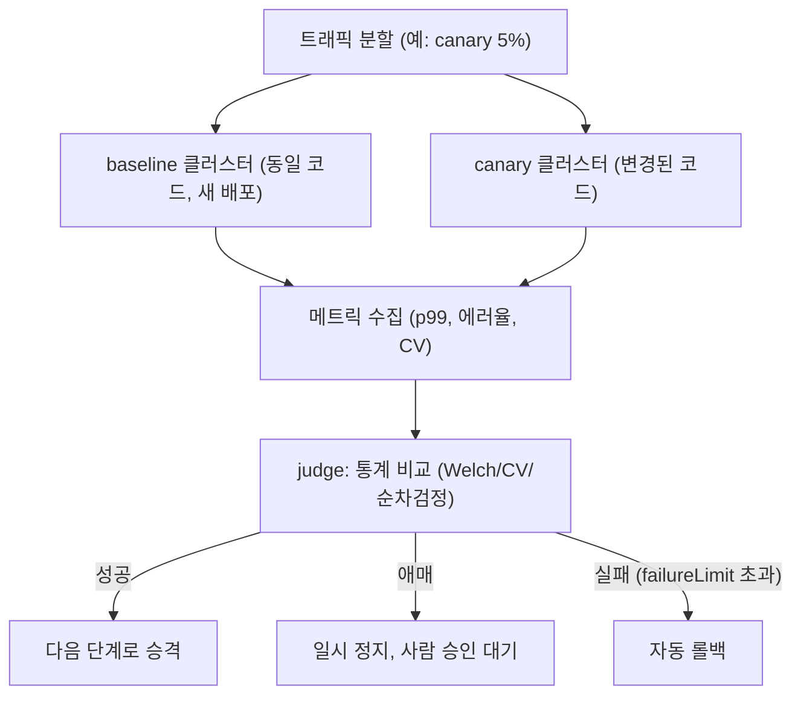

**카나리 배포와 성능 검증**이란 새 버전을 전체 트래픽이 아니라 소수 비율에만 노출한 뒤, 그 소수 트래픽에서 관측한 성능 지표를 기준 집단과 통계적으로 비교해 전체 배포를 계속할지 되돌릴지 자동으로 판단하는 절차를 말합니다. PR 성능 게이트([PR 성능 게이트](/post/regression-prevention/pr-performance-gate-design/))는 벤치마크 환경에서 코드 변경 전후를 비교하지만, 실제 프로덕션 트래픽 믹스·데이터 분포·인프라 이웃 효과는 벤치마크로 완전히 재현되지 않습니다. 캐시 히트율이 실트래픽에서만 달라지거나, 특정 고객의 요청 패턴이 핫 경로를 다르게 태우는 경우가 그렇습니다. 카나리 배포는 이런 "벤치마크는 통과했지만 프로덕션에서만 드러나는 회귀"를 잡아내는 마지막 안전망이며, 이 장은 트래픽을 어떻게 나누고, 무엇을 자동으로 비교하며, 그 비교를 통계적으로 얼마나 신뢰할 수 있는지를 다룹니다.

## 이 장을 읽기 전에

이 장은 [PR 성능 게이트](/post/regression-prevention/pr-performance-gate-design/)에서 다룬 "병합 전 게이트의 임계값·실패 정책" 개념과, [변동성 관리](/post/regression-prevention/performance-variance-noise-management/)에서 다룬 Welch's t-test·변동계수(CV)·검정력 분석 개념을 전제로 합니다. PR 게이트가 "병합 전에 격리된 환경에서" 비교한다면, 카나리는 "병합 후 실제 프로덕션 트래픽 위에서 동시에" 비교한다는 점이 다릅니다. **이 장의 깊이**: 트래픽 분할 구조 설계, 메트릭 기반 judge의 자동 승격·롤백 로직, 그리고 카나리 특유의 통계적 비교 방법론(동시성 비교와 순차 검정)까지 다룹니다. **다루지 않는 것**: 다중 리전·샤딩 환경에서 샘플 대표성을 확보하는 문제(→ [분산·클러스터 성능 회귀](/post/regression-prevention/distributed-cluster-performance-regression-expert/)), Welch's t-test·CV·검정력 분석 자체의 통계적 원리(→ [변동성 관리](/post/regression-prevention/performance-variance-noise-management/)), 카나리가 실패로 판정된 이후의 장애 대응 절차(→ [성능 장애 대응](/post/regression-prevention/performance-incident-response-process/))입니다.

## 당신의 수준에 맞는 경로

| 수준 | 읽을 부분 | 핵심 목표 |
|------|---------|---------|
| **중급자** | "카나리 배포의 기원과 통계적 자동화로의 진화" ~ "트래픽 분할과 카나리 구성" | 카나리가 왜 필요하고 트래픽을 어떻게 나누는지 이해한다 |
| **심화** | "메트릭 기반 자동 승격·롤백 로직" ~ "카나리 비교의 통계적 방법론" | judge 알고리즘의 판정 흐름과 동시성 비교의 이점을 설명할 수 있다 |
| **전문가** | "판단 기준" ~ "비판적 시각" | 언제 카나리가 부적합한지, 어떤 함정이 통계를 무력화하는지 판단할 수 있다 |

---

## 카나리 배포의 기원과 통계적 자동화로의 진화 (배경)

"카나리"라는 이름은 탄광에서 유독 가스를 사람보다 먼저 감지하도록 데려간 카나리아 새에서 왔습니다. 소프트웨어 배포에서는 2000년대 후반부터 Google·Facebook 같은 대규모 서비스 조직이 신버전을 전체가 아닌 일부 서버·일부 사용자에게만 먼저 노출해 문제를 조기에 발견하는 관행으로 이 이름을 차용했습니다. 초기 카나리 판정은 수동이었습니다 — 엔지니어가 baseline과 canary의 대시보드 그래프를 나란히 띄워 놓고 눈으로 비교한 뒤 계속 진행할지 되돌릴지 판단했습니다.

이 수동 판정을 통계적으로 자동화한 대표적 사례가 Netflix와 Google이 함께 2018년에 공개한 **[Kayenta](https://cloud.google.com/blog/products/gcp/introducing-kayenta-an-open-automated-canary-analysis-tool-from-google-and-netflix)**입니다. Kayenta는 canary 배포를 baseline·canary·production 세 그룹으로 나누는 구조를 도입했는데, 이는 "지금 운영 중인 production과 canary를 직접 비교"하는 대신 canary와 정확히 같은 코드·설정으로 **새로 띄운 baseline 클러스터**를 함께 만들어 canary와 나란히 비교하는 방식입니다. 이렇게 하는 이유는 뒤에 나올 흔한 오개념에서 자세히 다룹니다. Kayenta는 각 메트릭에 대해 개별 통계 검정을 수행한 뒤 가중합으로 0~100점의 **canary score**를 계산하고, 점수 구간에 따라 자동 승격(success)·사람 승인 경로(marginal)·자동 롤백(failure)으로 분기하는 **judge** 알고리즘을 정의했습니다.

Kayenta 이후 Kubernetes 생태계에서는 Flagger, [Argo Rollouts](https://argo-rollouts.readthedocs.io/en/stable/features/canary/) 같은 프로그레시브 딜리버리(progressive delivery) 컨트롤러가 이 개념을 서비스 메시·인그레스 레벨의 가중치 기반 라우팅과 결합해 표준화했습니다. Argo Rollouts는 카나리 단계를 `steps` 목록으로 선언하고, 각 단계에서 `setWeight`로 트래픽 비율을 올리며 `analysis` 객체로 메트릭 기반 자동 분석을 실행합니다. 더 최근에는 "고정된 표본 수를 다 채운 뒤 한 번에 판정"하는 대신, 데이터가 들어오는 대로 계속 관찰하면서도 오탐률을 엄격히 통제하는 **순차 검정(sequential testing)** 이론을 카나리 판정에 적용하는 연구가 나왔습니다. Michael Lindon, Chris Sanden, Vaché Shirikian은 [KDD 2022에서 발표한 논문](https://arxiv.org/abs/2205.14762)에서, 확률적 순서(stochastic order) 검정에 기반한 순차 검정으로 카나리 판정을 지속적으로 모니터링하면서도 거짓 탐지 확률을 엄격히 제어할 수 있음을 보였습니다. 이 흐름은 "카나리를 얼마나 오래 돌려야 하는가"라는 질문에 고정된 시간 대신 통계적으로 정당화된 답을 주는 방향으로 가고 있습니다.

## 트래픽 분할과 카나리 구성

카나리 배포의 첫 번째 설계 결정은 **트래픽을 어떻게 나눌 것인가**입니다. 서비스 메시(sidecar 기반 가중치 라우팅)나 L7 로드밸런서, 또는 Kubernetes 인그레스 컨트롤러가 요청의 일정 비율을 canary 파드로 보내고 나머지는 stable(기존) 버전으로 보냅니다. 이때 비율은 처음부터 크게 잡지 않고, 5% → 20% → 50% → 100%처럼 **단계적으로 램프업**하면서 각 단계마다 멈춰 서서(pause) 메트릭을 관찰하는 것이 표준적인 패턴입니다. 비율을 작게 시작하는 이유는 실제 결함이 있을 때 **영향받는 사용자 수(blast radius)**를 줄이기 위함이고, 단계를 나누는 이유는 트래픽이 늘어날수록만 드러나는 문제(연결 풀 고갈, GC 압력 증가)를 중간 단계에서 잡기 위함입니다.

앞서 배경 절에서 언급한 Kayenta의 baseline·canary·production 삼분할 구조가 중요한 것은 바로 이 지점입니다. canary를 **오래 떠 있던 기존 production**과 비교하면, canary가 방금 재시작되었다는 사실 자체가 비교를 왜곡합니다. JIT 워밍업, 캐시 콜드 스타트, 연결 풀이 아직 다 차지 않은 상태 같은 "막 시작한 프로세스의 공통 특성"이 코드 변경과 무관하게 canary 쪽 지표를 나쁘게 보이게 만들 수 있습니다. 이를 막기 위해 canary와 **동일한 코드·설정으로 새로 배포한 baseline**을 함께 띄우고, canary는 이 baseline과 비교합니다. 두 그룹 모두 "막 시작했다"는 조건이 같아지므로, 남는 차이는 코드 변경 자체에서 온다고 더 안전하게 말할 수 있습니다.

```yaml
# 개념 스케치: Argo Rollouts의 단계적 카나리 (실제 클러스터에 적용하려면
# Rollout/AnalysisTemplate CRD와 메트릭 프로바이더 설정이 추가로 필요함)
apiVersion: argoproj.io/v1alpha1
kind: Rollout
metadata:
  name: order-service
spec:
  strategy:
    canary:
      steps:
        - setWeight: 5
        - pause: { duration: 5m }
        - analysis:
            templates:
              - templateName: latency-and-error-rate
        - setWeight: 20
        - pause: { duration: 10m }
        - setWeight: 50
        - pause: { duration: 10m }
        - setWeight: 100
```

이 구성에서 `pause`는 다음 단계로 넘어가기 전 관찰 시간을 강제하고, `analysis`는 별도로 정의한 `AnalysisTemplate`을 참조해 메트릭 판정을 트리거합니다. 다만 이 YAML은 카나리 "단계 설계"의 개념을 보이기 위한 스케치이며, 실제 배포에는 서비스 메시·인그레스와의 트래픽 라우팅 연결, 메트릭 프로바이더 자격 증명 같은 클러스터별 설정이 추가로 필요합니다.

## 메트릭 기반 자동 승격·롤백 로직

트래픽이 나뉘어도 무엇을 "실패"로 볼지 정의하지 않으면 카나리는 그저 위험을 분산했을 뿐 아무것도 자동으로 판정하지 못합니다. [Argo Rollouts의 `AnalysisTemplate`](https://argo-rollouts.readthedocs.io/en/stable/features/analysis/)은 이 판정 로직을 `interval`(측정 주기), `count`(총 측정 횟수), `successCondition`(성공으로 볼 조건), `failureLimit`(허용할 실패 측정 횟수)로 선언합니다. 예를 들어 5분마다 Prometheus에서 canary와 baseline의 p99 지연 비율을 계산해 그 값이 1.1(10% 이내 저하) 미만이면 성공으로 표시하고, 5번 측정 중 3번 이상 조건을 어기면 해당 분석 실행 전체를 실패로 판정하는 식입니다.

```yaml
# 개념 스케치: Prometheus 기반 AnalysisTemplate
# (metric.provider.prometheus의 address·query는 클러스터 환경에 맞게 채워야 함)
apiVersion: argoproj.io/v1alpha1
kind: AnalysisTemplate
metadata:
  name: latency-and-error-rate
spec:
  metrics:
    - name: p99-latency-ratio
      interval: 5m
      count: 5
      failureLimit: 2
      successCondition: result[0] < 1.1
      provider:
        prometheus:
          address: http://prometheus.monitoring:9090
          query: |
            (
              histogram_quantile(0.99, rate(http_request_duration_seconds_bucket{track="canary"}[5m]))
              /
              histogram_quantile(0.99, rate(http_request_duration_seconds_bucket{track="baseline"}[5m]))
            )
```

판정 결과는 세 갈래로 나뉘는 것이 Kayenta 이후의 일반적인 패턴입니다. 조건을 계속 만족하면 **자동 승격**(다음 트래픽 단계로 진행), `failureLimit`을 넘기면 **자동 롤백**(트래픽을 stable로 되돌리고 canary 파드 종료), 점수가 애매한 구간이면 **사람 승인**을 기다리는 일시 정지 상태로 둡니다. 이 세 번째 경로가 중요한 이유는, 통계적 판정이 항상 이분법적으로 명확하지 않기 때문입니다 — 표본이 아직 적어 신뢰구간이 넓을 때 성급하게 자동 롤백하면 정상적인 변경도 계속 되돌리게 되고, 성급하게 승격하면 회귀를 놓치게 됩니다.

## 카나리 비교의 통계적 방법론

카나리와 baseline을 비교할 때 쓰는 통계 도구 자체(Welch's t-test, 변동계수, 검정력 분석)는 [변동성 관리](/post/regression-prevention/performance-variance-noise-management/)에서 다룬 것과 같습니다. 카나리 맥락에서 특별히 짚을 지점은 두 가지입니다.

첫째, 카나리와 baseline은 **같은 시간대의 트래픽**을 나눠 받으므로, PR 게이트처럼 "어제 벤치마크 결과"와 "오늘 벤치마크 결과"를 비교할 때 끼어드는 시간대별 트래픽 패턴 차이(피크 시간 vs 새벽, 요일별 변화)가 원천적으로 통제됩니다. 이는 카나리 비교의 강점이지만, 동시에 **표본 크기가 canary 비율에 비례해 줄어든다**는 대가가 따릅니다. 트래픽의 5%만 canary로 보내면, 검정력 분석이 요구하는 표본 수를 채우는 데 그만큼 더 오래 기다려야 합니다.

둘째, "5분마다 계속 재검정한다"는 구조 자체가 통계적으로 조심해야 할 함정을 만듭니다. 고정된 유의수준(예: p < 0.05)으로 설계된 가설 검정은 **한 번만 검정한다**는 전제 위에 서 있는데, 같은 데이터 스트림을 반복해서 다시 검정하면(이른바 "peeking") 우연히 유의한 결과가 나올 확률이 검정 횟수만큼 누적되어 명목 유의수준보다 훨씬 커집니다. Kayenta처럼 **정해진 관찰 기간이 끝난 뒤 한 번만 최종 판정**하거나, 앞서 배경 절에서 소개한 Lindon 등의 순차 검정(sequential testing)처럼 **반복 관찰을 전제로 오탐률을 통제하도록 설계된 통계 절차**를 쓰는 것이 이 함정을 피하는 두 가지 정석입니다. 반대로 "매 관찰마다 고정 임계값의 t-test를 새로 돌려 하나라도 걸리면 롤백"하는 방식은 얼핏 안전해 보이지만 실제로는 오탐을 스스로 키우는 설계입니다.



## 흔한 오개념

**"카나리 비율을 낮추면 위험이 사라진다"**는 절반만 맞는 생각입니다. 비율을 낮추면 결함이 있을 때 영향받는 사용자 수(blast radius)는 확실히 줄어들지만, 동시에 표본 크기도 줄어들어 [변동성 관리](/post/regression-prevention/performance-variance-noise-management/)에서 다룬 검정력 분석 관점에서는 **작은 회귀를 탐지할 능력 자체가 떨어집니다**. 트래픽이 적은 서비스에서 카나리 비율을 극단적으로 낮추면, 통계적으로 유의한 판정을 내리기 전에 관찰 시간이 비현실적으로 길어질 수 있습니다.

**"카나리가 통과하면 전체 배포도 안전하다"**도 흔한 착각입니다. 카나리는 전체 트래픽의 일부만, 전체 노드 중 일부에서만 검증합니다. 트래픽을 100%로 올리면 그제서야 나타나는 문제(연결 풀 고갈, 공유 캐시 압박, 하위 의존 서비스의 동시 부하)가 있으므로, 단계적 램프업의 마지막 단계까지 관찰을 이어가야 하며 카나리 통과를 "완전히 검증됨"과 동일시하면 안 됩니다.

**"방금 배포한 canary를 기존에 떠 있던 production과 비교하면 충분하다"**는 배경 절에서 다룬 Kayenta의 핵심 교훈을 놓치는 생각입니다. 갓 시작한 프로세스의 워밍업 효과가 코드 변경의 효과와 섞이므로, 가능하면 canary와 같은 시점에 새로 띄운 baseline과 비교해야 합니다.

## 판단 기준

| 상황 | 권장 | 이유 |
|------|------|------|
| QPS가 충분히 높은 서비스 | 메트릭 기반 카나리 게이트 적합 | 짧은 시간에 검정력을 채울 표본이 모임 |
| QPS가 낮은 내부 서비스 | 카나리 비율을 높이거나 관찰 기간을 늘림, 또는 섀도우 트래픽 병행 검토 | 표본 부족으로 카나리 판정이 유의미해지기까지 오래 걸림 |
| 스키마 변경을 동반한 배포 | 카나리 단독 사용 지양, 별도 마이그레이션 전략과 결합 | 되돌릴 수 없는 상태 변경은 트래픽 비율 조절로 막을 수 없음 |
| p99 tail latency 회귀가 우려되는 핫패스 | 평균이 아닌 p99/p999 비율을 successCondition에 사용 | 평균은 꼬리 분포의 악화를 가릴 수 있음 |
| 다중 리전·샤딩 환경 | 이 장의 단일 클러스터 모델을 그대로 적용하지 말고 대표성 문제를 먼저 검토 | [분산·클러스터 성능 회귀](/post/regression-prevention/distributed-cluster-performance-regression-expert/) 참조 |

## 비판적 시각: 한계와 트레이드오프

카나리 배포는 만능 안전망이 아닙니다. 관찰 기간이 하루 전체의 트래픽 주기(피크 시간, 배치 작업 시간대)를 다 덮지 못하면 특정 시간대에만 나타나는 회귀를 놓칠 수 있고, 짧은 카나리 여러 개를 연달아 통과시키는 과정에서 각각은 통계적으로 무해해 보이지만 누적되면 체감 성능이 서서히 나빠지는 "죽음의 천 번 베임(death by a thousand cuts)" 패턴은 개별 카나리 게이트로는 잡히지 않습니다. 이런 누적형 열화는 [장기 추세 분석](/post/regression-prevention/long-term-performance-trend-analysis/)처럼 더 긴 시간 축에서 관찰하는 장치와 함께 써야 잡힙니다. baseline 클러스터를 canary와 별도로 유지하는 것 자체가 컴퓨팅 비용과 운영 복잡도를 늘리므로, 트래픽이 적거나 인스턴스 비용이 큰 서비스에서는 이 비용이 부담될 수 있습니다. 기능 플래그(feature flag)가 canary 그룹에도 함께 걸려 있으면 플래그의 효과와 코드 변경의 효과가 뒤섞여 판정을 오염시킬 수 있고, canary로 라우팅되는 트래픽이 특정 지역·특정 테넌트에 치우쳐 있으면 판정이 전체 사용자를 대표하지 못할 수도 있습니다. 카나리는 "프로덕션에서 조기에 신호를 얻는 도구"이지 "완전한 검증"을 대체하는 도구가 아니라는 전제를 유지해야 합니다.

## 마무리

- [ ] baseline·canary·production을 왜 세 그룹으로 나누는지, 재시작 효과가 왜 비교를 왜곡하는지 설명할 수 있는가?
- [ ] `interval`·`count`·`successCondition`·`failureLimit`이 카나리 judge의 승격·롤백·보류 판정을 어떻게 구성하는지 설명할 수 있는가?
- [ ] 카나리 비교가 시간대 효과를 통제하는 대신 표본 크기를 희생한다는 트레이드오프를 설명할 수 있는가?
- [ ] 반복 관찰(peeking)이 고정 유의수준 검정의 오탐률을 왜 키우는지, 이를 피하는 두 가지 접근을 설명할 수 있는가?
- [ ] 카나리 비율을 낮추는 것이 blast radius와 검정력에 각각 어떤 영향을 미치는지 구분할 수 있는가?

**이전 장**: [알림 전략](/post/regression-prevention/performance-alerting-strategy-design/)에서는 회귀 신호를 언제 누구에게 알릴지를 다뤘다면, 이 장은 배포 과정 자체에서 그 신호를 자동으로 승격·롤백 결정에 연결하는 방법을 다뤘습니다. 다음 장에서는 카나리 게이트를 포함해 이미 실패가 확정된 뒤에 팀이 무엇을 해야 하는지, [성능 장애 대응](/post/regression-prevention/performance-incident-response-process/) 프로세스를 다룹니다.
