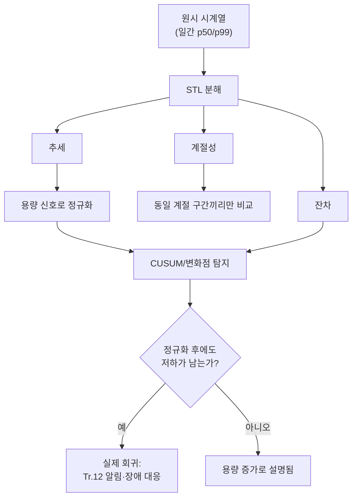

**장기 추세 분석(long-term trend analysis)**이란 성능 지표를 PR 하나하나의 짝비교가 아니라 몇 주에서 몇 달에 걸친 연속된 시계열로 보고, 그 안에서 점진적 저하·계절성·용량 변화를 통계적으로 구분해내는 작업을 말합니다. [기준선 관리](/post/regression-prevention/performance-baseline-management-strategy/)에서 지적했듯, rolling baseline은 매 PR이 직전 대비 0.5%만 느려져도 threshold 아래이므로 항상 통과시킵니다. 100개 PR이 지나면 전체는 눈에 띄게 느려져 있어도, 어떤 개별 게이트도 "범인"으로 지목되지 않습니다. 이 장은 이렇게 칼로 자르듯 나뉘지 않는 저하를 시계열 분해와 변화점 탐지로 드러내는 동시에, 트래픽 계절성이나 데이터 볼륨 증가처럼 코드와 무관한 정상적 변화를 회귀로 오판하지 않는 방법을 다룹니다.

## 이 장을 읽기 전에

**선행 지식**: 이 장은 [기준선 관리](/post/regression-prevention/performance-baseline-management-strategy/)(챕터 05)에서 다룬 anchor baseline과 성능 드리프트 개념, 그리고 [변동성 관리](/post/regression-prevention/performance-variance-noise-management/)(챕터 06)에서 다룬 통계적 유의성·변동계수(CV) 개념을 전제로 합니다. 06장이 "이번 PR과 직전 상태를 비교할 때 신호와 소음을 가르는 법"을 다뤘다면, 이 장은 같은 통계적 태도를 **하나의 짝비교가 아니라 수십~수백 개 관측치로 이뤄진 시계열 전체**로 확장합니다. [성능 장애 대응](/post/regression-prevention/performance-incident-response-process/)(챕터 10)이 이미 터진 급격한 저하에 대응하는 절차였다면, 이 장은 그 정도로 급격하지 않아 알림도 울리지 않는 저하를 사전에 찾아내는 데 목적이 있습니다.

**이 장의 깊이**: 시계열을 추세·계절성·잔차로 분해하는 원리, 점진적 저하의 시작 시점을 통계적으로 특정하는 변화점 탐지, 용량 증가를 회귀와 분리하는 정규화 절차를 다룹니다. **다루지 않는 것**: 이 데이터를 어떤 도구로 수집·저장할지(→ [관측 가능성 플랫폼](/post/regression-prevention/performance-observability-platform-design/), 챕터 07), Grafana·Prometheus 대시보드 구성(→ [모니터링 대시보드](/post/regression-prevention/performance-monitoring-dashboard-grafana-prometheus/), 챕터 14), 탐지된 이상을 누구에게 어떻게 알릴지(→ [알림 전략](/post/regression-prevention/performance-alerting-strategy-design/), 챕터 08), 단일 PR 비교의 통계적 방법론 자체(→ 챕터 06), 리전·샤드별 대표성 문제(→ [분산·클러스터 성능 회귀](/post/regression-prevention/distributed-cluster-performance-regression-expert/), 챕터 16)는 각 챕터로 위임합니다. 하드웨어 증설·용량 산정 같은 프로비저닝 의사결정 자체도 이 장의 범위 밖입니다.

## 당신의 수준에 맞는 경로

| 수준 | 읽을 부분 | 핵심 목표 |
|------|---------|---------|
| **중급자** | "왜 개별 게이트로는 부족한가" ~ "시계열로 본 성능 지표" | 점진적 저하가 게이트를 통과하는 이유와 시계열 분해 원리 이해 |
| **심화** | "점진적 저하 탐지" ~ "용량 변화와 회귀 구분하기" | CUSUM·변화점 탐지로 저하 시점을 특정하고 용량 요인을 분리 |
| **전문가** | "판단 기준" ~ "비판적 시각" | 장기 추세 감시 체계를 설계하고 그 한계를 인지 |

---

## 왜 개별 게이트로는 부족한가 (배경)

[변동성 관리](/post/regression-prevention/performance-variance-noise-management/)에서 다뤘듯, PR 게이트는 노이즈보다 큰 변화만 회귀로 표시합니다. 이 설계는 오탐을 줄이는 대가로 **노이즈 크기 이하의 실제 저하는 통과시킨다**는 맹점을 필연적으로 갖습니다. 문제는 이런 미세한 저하가 서로 독립적이지 않다는 데 있습니다. 메모리 할당 패턴이 조금씩 나빠지거나, 로깅이 매 릴리즈 조금씩 늘어나거나, 새 기능이 핫패스에 얇은 레이어를 하나씩 추가하는 식으로 **같은 방향으로 누적**되면, 개별 PR은 항상 무죄이지만 6개월 후의 코드베이스는 유죄입니다. 이 현상은 통계적 공정 관리(SPC)에서 이미 반세기 전에 다뤄진 문제와 본질적으로 같습니다. 1950년대에 E. S. Page가 제안한 CUSUM(누적합) 관리도는 개별 표본 하나가 관리 상한선을 넘는지가 아니라, **표본들이 목표값에서 벗어난 편차를 계속 더해 나가다 그 누적합이 특정 임계값을 넘는 순간**을 이상 신호로 잡는 방식으로, 개별 표본으로는 드러나지 않는 작은 지속적 이동(sustained shift)을 잡기 위해 고안되었습니다. 성능 회귀 방지에서 필요한 것도 정확히 이것입니다. 매 PR은 정상 범위 안에 있지만 그 편차가 한쪽으로만 계속 쌓이는 패턴을 잡아내는 감시 체계입니다.

## 시계열로 본 성능 지표: 추세·계절성·잔차 분해

일간·주간 단위로 모은 p50/p99 시계열을 그대로 보면 추세(서서히 좋아지거나 나빠지는 방향), 계절성(요일·시간대에 따라 반복되는 패턴), 잔차(둘로 설명되지 않는 나머지 변동)가 뒤섞여 있어 "지금 나빠지고 있는가"를 눈으로 판단하기 어렵습니다. **STL(Seasonal-Trend decomposition using LOESS)**은 시계열을 이 세 성분으로 분리하는 표준적인 방법으로, statsmodels 공식 문서는 이를 "Season-Trend decomposition using LOESS"라고 정의합니다 — [statsmodels: STL](https://www.statsmodels.org/stable/generated/statsmodels.tsa.seasonal.STL.html) 문서. 성능 지표에서 계절성은 흔히 요일 단위(평일과 주말의 트래픽 믹스 차이), 하루 단위(피크 시간대의 캐시 압박·오토스케일링 동작), 또는 배포 주기(릴리즈 직후의 콜드 캐시 구간) 형태로 나타납니다. 추세 성분만 따로 뽑아 감시하면, 계절성 때문에 매주 반복되는 등락을 회귀와 혼동하지 않으면서 실제로 서서히 움직이는 방향만 볼 수 있습니다.

```python
#!/usr/bin/env python3
# 요구 사항: Python 3.10+, pandas>=2.0, statsmodels>=0.14 (pip install pandas statsmodels)
# 입력: daily_p99.csv (columns: date, p99_ms). period=7(요일 계절성)이면 최소 2~3주 이상의 이력이 필요.
import pandas as pd
from statsmodels.tsa.seasonal import STL

def decompose(series: pd.Series, period: int = 7) -> pd.DataFrame:
    """robust=True로 일시적 급등(배포 사고 등) 이상치가 추세 추정을 왜곡하는 것을 줄인다."""
    result = STL(series, period=period, robust=True).fit()
    return pd.DataFrame({"trend": result.trend, "seasonal": result.seasonal, "residual": result.resid})

if __name__ == "__main__":
    df = pd.read_csv("daily_p99.csv", parse_dates=["date"], index_col="date")
    parts = decompose(df["p99_ms"], period=7)
    print(parts.tail(14))
```

이 분해는 그 자체로 "회귀 여부"를 판정해주지 않습니다. 추세 성분이 우상향이라는 것만으로는 코드 저하인지, 아래에서 다룰 용량 증가인지 알 수 없고, robust STL도 계절 주기 자체가 바뀌면(예: 트래픽 패턴이 근본적으로 달라짐) 추세와 계절 성분을 잘못 나눌 수 있습니다.

## 점진적 저하 탐지: 변화점 탐지와 CUSUM

추세 성분을 뽑았다면 다음 질문은 "언제부터 나빠지기 시작했는가"입니다. 단순히 최근 값과 과거 평균을 비교하는 대신, **변화점 탐지(change point detection)**는 시계열 전체에서 통계적 성질(평균·분산)이 바뀌는 지점을 자동으로 찾아냅니다. Python의 `ruptures` 라이브러리는 이런 오프라인 변화점 탐지 방법들을 제공하며, 공식 문서는 이 패키지를 "a Python library for off-line change point detection"이라고 소개하고 PELT·이진 분할(Binseg) 등 여러 탐지 알고리즘을 함께 제공한다고 설명합니다 — [ruptures 공식 문서](https://centre-borelli.github.io/ruptures-docs/). 시계열 예측 라이브러리 Prophet도 유사한 문제를 다루는데, 공식 문서에 따르면 Prophet은 먼저 다수의 **잠재 변화점(potential changepoints)**을 지정한 뒤, 그 지점에서의 변화 폭에 희소성을 유도하는 사전분포(L1 정규화와 동등)를 적용해 실제로 유의미한 변화점만 남기는 방식으로 동작합니다 — [Prophet: Trend Changepoints](https://facebook.github.io/prophet/docs/trend_changepoints.html) 문서. 세 방법(CUSUM, ruptures, Prophet) 모두 "언제 성질이 바뀌었는가"를 데이터로부터 역산한다는 공통점이 있고, 어느 것을 쓰든 나온 시점을 그대로 [기준선 관리](/post/regression-prevention/performance-baseline-management-strategy/)에서 다룬 커밋 이분 탐색(bisect)의 시작 구간으로 넘기면 원인 커밋 후보를 좁힐 수 있습니다.

CUSUM은 별도 라이브러리 없이 몇 줄로 직접 구현할 수 있다는 실무적 장점이 있습니다. 잔차의 누적 상방 편차가 임계값을 넘는 시점을 찾는 방식이며, 아래 구현은 표준적인 tabular CUSUM 공식을 따릅니다.

```python
# 요구 사항: Python 3.10+ (표준 라이브러리만 사용)
import statistics

def cusum_alarm(residual: list[float], k: float, h: float) -> int | None:
    """k: 허용 편차(보통 잔차 표준편차의 0.5배), h: 경보 임계값(보통 표준편차의 4~5배).
    누적 상방 편차 s_pos가 h를 넘는 첫 인덱스를 반환하고, 없으면 None을 반환한다."""
    s_pos = 0.0
    for i, x in enumerate(residual):
        s_pos = max(0.0, s_pos + x - k)
        if s_pos > h:
            return i
    return None

if __name__ == "__main__":
    residual = [0.1, -0.2, 0.3, 0.8, 1.1, 1.4, 1.6, 1.9]  # STL 잔차 예시(ms 단위)
    std = statistics.pstdev(residual)
    idx = cusum_alarm(residual, k=0.5 * std, h=4 * std)
    print(f"저하 시작 추정 인덱스: {idx}")
```

`k`와 `h`를 잔차의 표준편차 배수로 잡는 것은 관습적인 시작점일 뿐이며, 실제 값은 [변동성 관리](/post/regression-prevention/performance-variance-noise-management/)에서 측정한 CV와 탐지하려는 최소 효과 크기에 맞춰 조정해야 합니다. `h`를 너무 낮게 잡으면 정상적인 잔차 변동에도 경보가 울리고, 너무 높게 잡으면 실제 저하도 오래 방치됩니다.

## 용량 변화와 회귀 구분하기

추세가 우상향이라고 해서 항상 코드 회귀는 아닙니다. 처리하는 데이터 볼륨이 늘거나, 인덱스·해시테이블이 커지거나, 요청량 자체가 증가하면 알고리즘이 전혀 바뀌지 않아도 지연은 자연스럽게 늘어납니다. 이런 경우를 구분하는 기본 원칙은 **원시 지표(raw metric) 대신 작업 단위당 지표(normalized metric)를 추세 감시 대상으로 삼는 것**입니다. 초당 요청 수나 처리 중인 레코드 수 같은 용량 신호를 함께 기록해두면, p99 지연을 그 용량 신호에 대해 회귀(regress)시킨 뒤 남는 잔차만 감시할 수 있습니다.

```python
# 요구 사항: Python 3.10+, numpy>=1.24 (pip install numpy)
import numpy as np

def capacity_normalized_residual(p99_ms: np.ndarray, capacity_signal: np.ndarray) -> np.ndarray:
    """capacity_signal(예: 초당 요청 수, 인덱스 크기)로 p99_ms를 선형 회귀로 설명한 뒤 남는 잔차를 반환한다.
    잔차가 여전히 우상향이면 용량 증가로 설명되지 않는 저하가 남아 있다는 뜻이다."""
    slope, intercept = np.polyfit(capacity_signal, p99_ms, 1)
    predicted = slope * capacity_signal + intercept
    return p99_ms - predicted
```

이 회귀가 선형이라는 가정이 항상 맞는 것은 아닙니다. 해시테이블 재해시나 B-트리 깊이 증가처럼 용량과 지연의 관계가 계단형이거나 비선형인 자료구조도 흔하므로, 잔차에 여전히 뚜렷한 패턴이 남아 있다면 선형 대신 구간별 회귀나 로그 변환을 검토해야 합니다. 정규화 후에도 잔차가 CUSUM 경보를 낸다면, 그때 비로소 "용량으로 설명되지 않는 저하"로서 회귀 조사 대상이 됩니다.



## 흔한 오개념

**"추세선이 우상향이면 무조건 회귀다"**는 오개념입니다. 요청량·데이터 볼륨이 함께 늘고 있다면 용량 신호로 정규화한 잔차부터 확인해야 하며, 원시 지표만 보고 회귀로 단정하면 애초에 원인이 아닌 용량 증설·샤딩 작업에 시간을 낭비하게 됩니다.

**"계절성 패턴은 노이즈이니 무시해도 된다"**도 흔한 착각입니다. 계절 성분을 무시하고 서로 다른 요일·시간대 값을 그대로 비교하면, 평일 피크와 주말 새벽을 비교해 존재하지 않는 회귀를 만들어내거나(오탐), 반대로 매주 같은 시각끼리만 우연히 비슷해 실제 저하를 놓치는(미탐) 양쪽 실수가 모두 가능합니다. 계절 성분은 제거 대상이지 무시 대상이 아닙니다.

**"anchor baseline과 정기 재대조만 하면 장기 추세 관리는 끝난다"**는 절반만 맞습니다. [기준선 관리](/post/regression-prevention/performance-baseline-management-strategy/)에서 다룬 anchor baseline 재대조는 "이번 분기 시작 대비 지금이 몇 % 다른가"라는 **두 점 사이의 비교**입니다. 이는 저하가 있었다는 사실은 알려주지만, 그 저하가 분기 내내 서서히 쌓인 것인지 특정 시점에 급격히 발생한 것인지, 계절성 때문에 우연히 그 두 시점만 차이가 커 보이는 것인지는 구분해주지 못합니다. 이 장에서 다루는 시계열 분해·변화점 탐지는 그 두 점 사이를 채우는 연속적인 관측이며, anchor baseline 재대조를 대체하는 것이 아니라 "왜, 언제" 저하가 발생했는지를 보완하는 절차입니다.

## 판단 기준

| 상황 | 권장 접근 | 근거 |
|------|-----------|------|
| 추세 방향과 대략적 크기만 빠르게 확인 | 이동평균(EWMA)로 스무딩한 추세선 | 계산 비용이 낮고 해석이 쉬움 |
| 저하 시작 시점을 특정해 원인 커밋을 좁혀야 함 | CUSUM 또는 변화점 탐지(PELT/Binseg) | 변화 시점을 자동으로 특정해 bisect 범위를 줄임 |
| 트래픽에 뚜렷한 일·주 단위 패턴이 있음 | STL로 계절성을 분리한 뒤 잔차만 감시 | 계절 성분을 미리 제거해야 잔차가 신호로 남음 |
| 데이터 볼륨·요청량이 함께 증가 중 | 용량 신호로 정규화한 뒤 잔차 재분석 | 원시 절대값 비교는 용량 증가를 회귀로 오판 |
| 시계열 이력이 아직 짧음(수 주 미만) | 판단 보류, anchor baseline 대조만 유지 | 계절 성분 추정에는 최소 2~3 계절 주기가 필요 |

## 비판적 시각: 한계와 트레이드오프

장기 추세 분석은 본질적으로 **사후적(reactive)**입니다. 변화점을 신뢰성 있게 특정하려면 그 변화점 이후로도 어느 정도 관측치가 쌓여야 하므로, "저하가 시작된 순간"과 "저하를 확신하는 순간" 사이에는 항상 지연이 있습니다. 이는 PR 게이트([PR 성능 게이트](/post/regression-prevention/pr-performance-gate-design/))를 대체하지 못하고 보완할 뿐입니다. 용량 정규화도 신뢰할 수 있는 용량 신호(요청량, 데이터 크기)가 이미 계측되어 있어야 가능하며, 이 계측 자체가 없다면 [관측 가능성 플랫폼](/post/regression-prevention/performance-observability-platform-design/)에서 그 배관을 먼저 갖춰야 합니다. 조직적으로는 "이건 그냥 용량이 늘어서 그렇다"는 설명이 실제 회귀를 덮는 변명으로 오남용될 위험도 있으므로, 정규화 후 잔차가 여전히 우상향일 때는 반드시 원인 조사로 이어지는 절차가 있어야 합니다. 마지막으로 STL·CUSUM·변화점 탐지 모두 파라미터(계절 주기, k/h, 최소 세그먼트 길이)에 민감하며, 이 값을 잘못 잡으면 도구를 도입한 것 자체가 오탐·미탐의 새로운 원천이 될 수 있습니다.

## 마무리

- [ ] 개별 PR 게이트가 왜 점진적 저하를 통과시키는지, CUSUM이 이 문제를 어떻게 다루는지 설명할 수 있는가?
- [ ] STL 분해로 추세·계절성·잔차를 분리하는 이유와, 계절 성분을 왜 제거가 아니라 무시하면 안 되는지 설명할 수 있는가?
- [ ] CUSUM 또는 변화점 탐지로 저하 시작 시점을 추정하고, 그 결과를 bisect에 넘기는 흐름을 그릴 수 있는가?
- [ ] 용량 신호로 지표를 정규화해 회귀와 정상적인 용량 증가를 구분할 수 있는가?
- [ ] anchor baseline 재대조와 이 장의 시계열 분석이 서로 대체가 아니라 보완 관계임을 설명할 수 있는가?

**이전 장**: [성능 장애 대응](/post/regression-prevention/performance-incident-response-process/)(챕터 10)이 이미 터진 급격한 저하에 대응하는 절차를 다뤘다면, 이 장은 그 정도로 급하지 않아 알림도 울리지 않는 저하를 시계열로 미리 찾아내는 방법을 다뤘습니다. **다음 장에서는** 이렇게 누적된 저하 중 당장 고칠 여력이 없어 의도적으로 남겨두는 것들을 어떻게 목록화하고 상환 우선순위를 매길지, [성능 부채 관리](/post/regression-prevention/performance-debt-management-strategy/)(챕터 12)에서 다룹니다.
