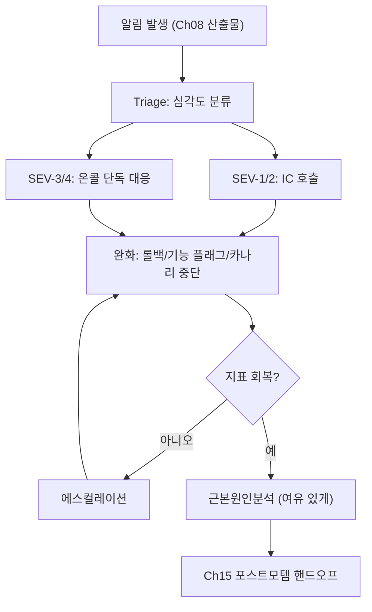

**성능 장애 대응(performance incident response)**이란 벤치마크·PR 게이트를 통과했거나 그 이후 서서히 나타나 프로덕션까지 넘어온 성능 저하를, 알림이 울린 시점부터 완화·근본원인 확정까지 일관된 절차로 처리하는 과정을 말합니다. 가용성 장애(서버가 죽는 것)와 달리 성능 장애는 "여전히 응답은 하지만 p99가 두 배가 됐다"처럼 애매하게 시작되는 경우가 많고, 그래서 대응자가 매번 "이게 진짜 장애인가, 노이즈인가"부터 새로 판단해야 한다면 대응 속도와 일관성 모두 떨어집니다. 이 장은 그 판단과 대응을 온콜 담당자 한 사람의 직관에 맡기지 않고, 탐지 인계·triage·완화·근본원인분석이라는 반복 가능한 단계와 에스컬레이션 기준으로 고정하는 방법을 다룹니다.

## 이 장을 읽기 전에

이 장은 [알림 전략](/post/regression-prevention/performance-alerting-strategy-design/)에서 이미 "언제 알림을 울릴지"를 설계했다고 전제하고, **알림이 울린 다음 순간부터** 이야기를 시작합니다. 또한 [카나리 배포와 성능 검증](/post/regression-prevention/canary-deployment-performance-verification/)에서 다룬 점진적 배포·자동 롤백 메커니즘이 이미 갖춰져 있다고 가정하며, 이 장에서는 그 메커니즘을 사람이 판단해 언제 발동시킬지를 다룹니다. [변동성 관리](/post/regression-prevention/performance-variance-noise-management/)에서 다룬 노이즈와 신호를 가르는 통계적 배경지식이 있으면 triage 단계를 더 잘 이해할 수 있습니다.

**이 장의 깊이**: 중급 구간에서는 탐지 인계부터 완화까지의 실행 절차를, 심화 구간에서는 근본원인분석 절차·온콜 런북 설계·에스컬레이션 기준 수립을 다룹니다. **다루지 않는 것**: 알림 임계값 자체의 설계(→ [알림 전략](/post/regression-prevention/performance-alerting-strategy-design/)), 카나리 자동 롤백의 내부 메커니즘(→ [카나리 배포와 성능 검증](/post/regression-prevention/canary-deployment-performance-verification/)), 장애 종료 후 작성하는 포스트모템 문서 자체의 템플릿(→ [Post-mortem 분석](/post/regression-prevention/performance-incident-postmortem-template-process/)), 분산·다중 리전 환경 특유의 대응 난이도(→ [분산·클러스터 성능 회귀](/post/regression-prevention/distributed-cluster-performance-regression-expert/))입니다.

## 당신의 수준에 맞는 경로

| 수준 | 읽을 부분 | 핵심 목표 |
|------|---------|---------|
| **중급자** | "인시던트 대응이라는 개념의 기원" ~ "완화: 되돌릴 것인가, 고칠 것인가" | 알림 인계 이후 triage·완화 단계를 순서대로 실행할 수 있다 |
| **심화** | "근본원인분석: 완화 이후에 시작한다" ~ "에스컬레이션 기준" | RCA 절차, 온콜 런북 구조, 에스컬레이션 기준을 설계할 수 있다 |
| **전문가** | "판단 기준" ~ "비판적 시각" | 롤백과 forward-fix 중 무엇을 택할지, 에스컬레이션 비용을 어떻게 저울질할지 판단할 수 있다 |

---

## 인시던트 대응이라는 개념의 기원 (역사·배경)

성능 장애 대응 절차의 뼈대는 IT 업계가 처음 발명한 것이 아니라, 소방·재난 현장에서 써 온 **ICS(Incident Command System)**를 소프트웨어 운영에 맞게 옮겨온 것입니다. 여러 기관이 동시에 현장에 도착했을 때 누가 무엇을 결정할지 미리 정해두지 않으면 혼란만 커진다는 교훈이, "역할을 미리 나누고 한 사람이 전체 상태를 대표한다"는 원칙으로 정리된 것입니다. 구글은 2016년에 출간한 *Site Reliability Engineering*의 "Managing Incidents" 장에서 이 구조를 소프트웨어 장애 대응에 맞게 체계화했고, 핵심은 사건 지휘자(Incident Commander), 실제로 시스템을 고치는 실무 담당자, 이해관계자에게 상황을 전달하는 커뮤니케이션 담당자, 장기적인 자원·일정을 조율하는 기획 담당자로 역할을 나누는 것입니다. 각자가 자신의 역할에만 집중하면 같은 결정을 두 사람이 중복해서 내리거나 아무도 안 내리는 상황을 막을 수 있습니다.

이 구조에서 사건 지휘자의 책임 중 특히 되짚어볼 만한 것은 실시간 기록입니다.

> "The incident commander's most important responsibility is to keep a living incident document." — Betsy Beyer 외, *Site Reliability Engineering* (O'Reilly, 2016), ["Managing Incidents"](https://sre.google/sre-book/managing-incidents/) 장

성능 장애에서는 이 기록이 특히 중요합니다. 지연 지표는 시간에 따라 오르내리므로, "언제 완화 조치를 넣었고 그 직후 지표가 어떻게 움직였는지"를 그 순간에 적어두지 않으면 나중에 [Post-mortem 분석](/post/regression-prevention/performance-incident-postmortem-template-process/)에서 원인과 결과를 재구성하기가 훨씬 어려워집니다. 구글은 [Emergency Response](https://sre.google/sre-book/emergency-response/) 장에서 대응자가 압도당했다고 느끼면 주저 없이 더 많은 사람을 끌어들이라고도 강조하는데, 이는 뒤에서 다룰 에스컬레이션 기준의 배경이 되는 원칙입니다.

## 탐지 인계에서 완화까지

성능 장애 대응은 크게 네 단계로 진행됩니다. 알림 시스템이 이상 신호를 올리면([알림 전략](/post/regression-prevention/performance-alerting-strategy-design/)의 산출물), 온콜 담당자가 그 신호의 심각도를 판정하는 **triage**, 심각도에 따라 지표를 정상 범위로 되돌리는 **완화(mitigation)**, 완화 이후 여유를 두고 진행하는 **근본원인분석(RCA)**, 그리고 확정된 원인을 다음 챕터의 포스트모템 프로세스로 넘기는 **핸드오프**입니다. 이 네 단계를 분리하는 이유는 단순합니다 — 완화와 원인 규명을 같은 사람이 같은 순간에 하려고 하면, 지표가 계속 나쁜 상태로 방치되는 시간이 길어집니다. 아래 다이어그램은 이 흐름과 각 단계에서 갈라지는 경로를 보여줍니다.



### Triage: 심각도를 어떻게 나눌 것인가

알림이 울렸다고 모두 같은 무게로 다뤄지면 안 됩니다. PagerDuty의 인시던트 대응 문서는 심각도를 5단계로 나누고, 애매할 때는 낮은 등급이 아니라 **높은 등급으로 취급**한 뒤 사건이 끝난 후에 재분류하라고 권합니다. 성능 장애에 이 틀을 그대로 옮기면, "고객이 체감할 정도의 전면적 지연 증가"와 "일부 엔드포인트의 p99만 소폭 상승"을 같은 SEV로 묶지 않게 됩니다. 아래 표는 이 아이디어를 성능 회귀 맥락에 맞춰 재구성한 것으로, 각 조직의 SLO(→ [성능 설계·의사결정 트랙의 SLO/SLA 정의](/post/design-decisions/getting-started-performance-design-decision-making/))에 맞춰 임계값은 조정해야 합니다.

| 등급 | 판정 기준(예시) | 대응 |
|------|-----------------|------|
| SEV-1 | 핵심 경로 p99가 SLO를 2배 이상 초과, 다수 고객 영향 | IC 호출, 즉시 완화 착수 |
| SEV-2 | 핵심 경로 p99가 SLO를 초과, 영향 범위가 넓어지는 중 | IC 호출 권장, 완화 우선 |
| SEV-3 | 일부 엔드포인트·리전에 한정된 지연 증가 | 온콜 단독 대응, 필요 시 에스컬레이션 |
| SEV-4 | 처리량·자원 사용 지표의 경미한 악화 | 티켓 생성, 다음 근무 시간에 처리 |

triage의 목적은 원인을 밝히는 것이 아니라 **"지금 몇 명이, 얼마나 급하게 매달려야 하는가"**를 몇 분 안에 결정하는 것입니다. 이 판정에 오래 걸리면 걸릴수록 완화 착수가 늦어지므로, 판정 기준은 미리 문서화해 온콜 담당자가 그 자리에서 표만 보고 결정할 수 있어야 합니다.

### 완화: 되돌릴 것인가, 고칠 것인가

triage로 심각도가 정해지면 다음은 지표를 정상 범위로 되돌리는 완화입니다. 완화의 목표는 근본원인 제거가 아니라 **사용자 영향을 멈추는 것**이므로, 원인을 다 이해하지 못한 상태에서도 실행할 수 있어야 합니다. 가장 흔히 쓰는 완화 수단은 최근 배포를 되돌리는 롤백이고, [카나리 배포와 성능 검증](/post/regression-prevention/canary-deployment-performance-verification/)에서 다룬 자동 중단 메커니즘이 이미 있다면 카나리 단계에서 걸러지지 못한 문제도 수동으로 같은 경로를 태워 되돌릴 수 있습니다. 롤백이 여의치 않은 경우(여러 변경이 뒤섞여 배포됐거나, 데이터 마이그레이션이 얽혀 있는 경우)에는 기능 플래그로 문제의 경로만 끄거나, 트래픽을 일시적으로 제한(throttle)해 부하를 줄이는 것도 완화 수단입니다.

완화 수단을 고를 때 자주 놓치는 함정은 **롤백 자체가 새로운 위험을 만들 수 있다**는 점입니다. 배포 이후 스키마가 바뀌었거나 다른 서비스가 이미 새 버전에 맞춰 호출을 바꿨다면, 되돌리는 행위 자체가 또 다른 장애를 낳을 수 있습니다. 그래서 롤백 절차는 장애가 나기 전에 미리 연습해 둬야 하며, "되돌리기 전에 무엇을 확인해야 하는가"는 다음 절의 런북에 포함되어야 할 항목입니다.

## 근본원인분석: 완화 이후에 시작한다

지표가 정상으로 돌아왔다면, 그 다음에야 **왜 느려졌는지**를 파고드는 근본원인분석(RCA)을 시작합니다. 완화 전에 RCA를 시작하면 조사하는 동안에도 사용자는 계속 나쁜 지연을 겪게 되므로, 순서를 바꾸지 않는 것이 원칙입니다. 성능 회귀의 RCA는 대개 "어느 커밋에서 지표가 꺾였는가"를 좁혀 들어가는 이분 탐색으로 시작하는데, 이 과정 자체는 [Low-latency 프로파일링·성능 분석 트랙](/post/profiling-analysis/getting-started-profiling-performance-analysis-fundamentals/)에서 다루는 프로파일링 기법과 이어집니다. 아래 스크립트는 그 이분 탐색을 자동화하는 뼈대로, `git bisect run`에 벤치마크 실행과 임계값 판정을 연결해 사람이 매 커밋마다 수동으로 확인하지 않아도 되게 합니다.

```bash
#!/usr/bin/env bash
# 요구 사항: git, 빌드 도구 체인, 아래 THRESHOLD_US에 맞는 벤치마크 바이너리
# 실행: git bisect start <bad_commit> <good_commit> && git bisect run ./bisect_check.sh
set -euo pipefail

THRESHOLD_US=150   # RCA 대상 회귀의 최소 감지선(예: p50 150us 초과 시 "느림"으로 판정)

cmake --build build --target hot_path_bench -j"$(nproc)" || exit 125  # 빌드 실패는 125로 skip
result_us=$(./build/hot_path_bench --benchmark_format=json \
  | python3 -c 'import json,sys; d=json.load(sys.stdin); print(int(d["benchmarks"][0]["real_time"]))')

echo "commit=$(git rev-parse --short HEAD) result_us=${result_us}"
[ "${result_us}" -le "${THRESHOLD_US}" ]   # 0(정상) 또는 1(회귀)을 git bisect에 반환
```

이 스크립트는 빌드 실패(환경 문제로 컴파일이 안 되는 커밋)를 회귀와 구분하기 위해 종료 코드 125로 건너뛰게 하는데, 이걸 빠뜨리면 `git bisect`가 빌드 실패를 회귀로 오판해 엉뚱한 커밋을 지목할 수 있습니다. 또한 RCA 단계의 벤치마크는 [변동성 관리](/post/regression-prevention/performance-variance-noise-management/)에서 다룬 노이즈 문제에 그대로 노출되므로, 임계값 하나만으로 이분 탐색하기보다는 반복 실행과 통계적 판정을 곁들이는 것이 안전합니다. RCA의 산출물은 "회귀를 일으킨 변경과 그 메커니즘"이며, 이 결과가 다음 장인 [Post-mortem 분석](/post/regression-prevention/performance-incident-postmortem-template-process/)의 입력이 됩니다. 원인이 명확하지 않거나 근본적인 구조 문제로 판명되면, 즉시 고치는 대신 [성능 부채 관리](/post/regression-prevention/performance-debt-management-strategy/)의 백로그로 넘기는 것도 정당한 결론입니다.

## 온콜 런북: 무엇을 미리 적어둘 것인가

triage·완화 단계가 몇 분 안에 일관되게 돌아가려면, 그 순간에 판단할 것을 최소화하고 미리 적어둔 절차를 따르게 해야 합니다. 이를 위한 문서가 온콜 런북이며, 좋은 런북은 "무엇을 확인하고, 어떤 명령을 실행하고, 언제 다음 사람을 부를지"를 담되 특정 사고의 서술이 아니라 **재사용 가능한 절차**로 쓰여 있어야 합니다. 아래는 성능 장애 온콜 런북 항목이 갖춰야 할 구조를 개념적으로 스케치한 것으로, 실제 문서는 각 조직의 대시보드·명령에 맞춰 채워 넣어야 합니다.

```text
런북: 핵심 경로 p99 지연 급증
1. 확인할 대시보드: [서비스명] p50/p99/에러율, 배포 타임라인 오버레이
   (대시보드 자체의 설계는 → 모니터링 대시보드 챕터)
2. 첫 5분 안에 답할 질문:
   - 최근 30분 내 배포/설정 변경이 있었는가? (있다면 롤백 후보 1순위)
   - 특정 리전/샤드에 국한되는가, 전역적인가?
   - 처리량도 함께 떨어졌는가, 지연만 올랐는가?
3. 완화 실행 명령: (배포 도구별 롤백/기능 플래그 토글 명령을 명시)
4. 완화 후 재확인: 완화 실행 후 N분 뒤 같은 대시보드에서 회복 확인
5. 에스컬레이션 트리거: 아래 "에스컬레이션 기준" 표 참고
6. 완료 후: RCA 티켓 생성, 로그·그래프 스냅샷을 인시던트 문서에 첨부
```

이 런북은 정적인 문서가 아니라 **매 인시던트 이후 갱신되는 산출물**입니다. 대응 도중 런북에 없는 판단을 내렸다면, 그 판단을 다음 버전의 런북에 추가하는 것이 [Post-mortem 분석](/post/regression-prevention/performance-incident-postmortem-template-process/)에서 다룰 후속 조치의 전형적인 항목입니다. 런북이 오래된 대시보드 링크나 이미 폐기된 명령을 담고 있으면, 위기 상황에서 대응자가 런북 자체를 신뢰하지 않게 되므로 정기적으로 실제로 실행해 검증하는 것이 중요합니다.

## 에스컬레이션 기준

에스컬레이션은 "이 문제를 나 혼자 처리하기 어렵다"는 것을 인정하고 더 많은 사람·권한을 끌어들이는 절차입니다. 구글 SRE 책은 대응자가 압도당했다고 느끼는 순간 주저 없이 사람을 더 부르라고 조언하는데, 실무에서는 이 판단을 개인의 감에만 맡기면 에스컬레이션이 너무 늦게 일어나는 경향이 있으므로 트리거 조건을 미리 숫자로 못박아 둡니다. 아래 표는 그 트리거의 뼈대를 보여줍니다.

| 트리거 조건 | 에스컬레이션 대상 | 기대 응답 |
|------|-----------|------|
| SEV-1/2로 판정, 15분 내 완화 미착수 | IC(사건 지휘자), 서비스 오너 | 5분 내 응답 |
| 완화를 시도했으나 지표가 회복되지 않음 | 해당 서비스 시니어 엔지니어 | 10분 내 응답 |
| 원인이 여러 서비스에 걸쳐 있다고 의심됨 | 관련 팀 전체, IC | 15분 내 응답 |
| 온콜 담당자가 15분간 다음 조치를 판단하지 못함 | 백업 온콜, 팀 리드 | 즉시 |
| 롤백이 데이터·스키마 위험을 수반 | 서비스 오너 + 인프라 팀 | 롤백 전 승인 |

에스컬레이션 기준을 명시하는 것의 핵심 가치는 "누구를 부를지 눈치 보는 시간"을 없애는 것입니다. 이 표는 조직마다 다르게 채워야 하고, 특히 심각도 판정(위의 triage 표)과 짝을 이뤄야 실제로 동작합니다 — 심각도 표 없이 에스컬레이션 표만 있으면 트리거 조건 자체가 애매해집니다.

## 흔한 오개념

**"성능이 떨어지면 무조건 롤백해야 한다"**는 오개념입니다. 여러 변경이 뒤섞여 배포됐거나 되돌리는 것 자체가 데이터·스키마 위험을 수반한다면, 문제가 된 경로만 기능 플래그로 끄는 forward-fix가 더 안전한 완화일 수 있습니다. 완화 수단의 선택은 "가장 빠르고 가장 위험이 적은 방법이 무엇인가"로 판단해야지, 롤백을 기본값으로 고정해서는 안 됩니다.

**"온콜 담당자가 근본원인까지 찾아야 인시던트가 끝난다"**도 흔한 오개념입니다. triage와 완화의 목적은 사용자 영향을 멈추는 것이지 원인을 완전히 규명하는 것이 아니며, 두 목표를 뒤섞으면 지표가 나쁜 상태로 방치되는 시간만 길어집니다. RCA는 완화 이후 여유를 두고, 필요하면 다른 사람에게 넘겨서 진행해도 됩니다.

**"알림이 울리면 무조건 인시던트다"**도 오개념입니다. [변동성 관리](/post/regression-prevention/performance-variance-noise-management/)에서 다룬 것처럼 측정 노이즈만으로도 알림 임계값을 넘을 수 있으므로, triage 단계는 "이것이 실제 회귀인지" 판정하는 필터 역할도 겸합니다. 이 필터링을 생략하고 모든 알림을 곧장 완화 절차로 밀어 넣으면 온콜 피로만 쌓입니다.

## 판단 기준

| 상황 | 권장 조치 | 근거 |
|------|-----------|------|
| 최근 배포 직후 발생, 원인 배포가 명확 | 롤백을 1순위 완화로 시도 | 가장 빠르고 검증된 되돌리기 경로 |
| 여러 변경이 뒤섞여 배포됨, 롤백이 다른 위험 수반 | 기능 플래그로 문제 경로만 차단 | 롤백 자체의 부작용 회피 |
| 심각도 판정이 애매함 | 더 높은 등급으로 취급 후 사후 재분류 | 늦은 에스컬레이션의 비용이 더 큼 |
| 완화 후 지표가 회복되지 않음 | 즉시 에스컬레이션, 완화 수단 재검토 | 같은 조치를 반복해도 회복 안 되면 가정이 틀렸다는 신호 |
| RCA 결과가 구조적 문제로 판명 | 근본 수정을 성능 부채로 등록 | 인시던트 도중 구조를 다시 설계하지 않음 |

## 비판적 시각: 한계와 트레이드오프

이 절차 전체는 온콜 인력과 문서화에 지속적인 투자를 요구하며, 공짜가 아닙니다. 런북을 정기적으로 검증하지 않으면 위기 순간에 신뢰할 수 없는 문서가 되고, 에스컬레이션 기준을 너무 낮게 잡으면 온콜 피로(alert fatigue의 인시던트 버전)가 쌓여 정작 중요한 호출에 둔감해지는 역효과가 납니다. 반대로 기준을 너무 높게 잡으면 에스컬레이션이 늦어져 사용자 영향이 불필요하게 길어집니다. 또한 롤백을 만능 완화 수단으로 여기는 조직 문화는 "왜 처음부터 그 변경이 회귀를 일으켰는가"라는 질문을 흐리게 만들 수 있으므로, 완화와 RCA를 분리하되 RCA를 생략하는 습관으로 이어지지 않도록 경계해야 합니다. 이 절차는 단일 서비스·단일 리전을 전제로 설계된 것에 가깝고, 샤딩·다중 리전·부분 트래픽 롤아웃이 얽힌 환경에서는 triage와 완화 자체가 더 복잡해지므로 [분산·클러스터 성능 회귀](/post/regression-prevention/distributed-cluster-performance-regression-expert/)에서 다루는 층별 게이트와 함께 적용해야 합니다.

## 마무리

- [ ] 탐지 인계·triage·완화·RCA 네 단계를 순서와 목적의 차이로 설명할 수 있는가?
- [ ] 심각도(SEV) 판정 기준을 자신의 조직의 SLO에 맞춰 구체적인 수치로 채울 수 있는가?
- [ ] 롤백과 forward-fix 중 무엇을 먼저 시도할지 상황에 따라 판단할 수 있는가?
- [ ] 왜 RCA를 완화 이전이 아니라 이후에 시작해야 하는지 설명할 수 있는가?
- [ ] 에스컬레이션 트리거를 개인의 판단이 아니라 명시적 조건으로 문서화할 수 있는가?
- [ ] 온콜 런북이 정적 문서가 아니라 매 인시던트마다 갱신되어야 하는 이유를 설명할 수 있는가?

**이전 장**: [카나리 배포와 성능 검증](/post/regression-prevention/canary-deployment-performance-verification/) (챕터 10)에서 배포 단계의 자동 검증·롤백을 다뤘다면, 이 장은 그 검증을 통과하지 못했거나 배포 이후에야 드러난 성능 저하를 사람이 어떻게 대응하는지를 다뤘습니다. 다음 장에서는 개별 인시던트를 넘어, 이렇게 걸러낸 신호들이 시간이 지나며 어떤 패턴을 그리는지 보는 [장기 추세 분석](/post/regression-prevention/long-term-performance-trend-analysis/)을 다룹니다. 한 번의 인시던트에서 확정한 근본원인이 반복되는지, 아니면 우연이었는지는 장기 추세를 봐야 알 수 있습니다.

→ [장기 추세 분석](/post/regression-prevention/long-term-performance-trend-analysis/) (챕터 12)
