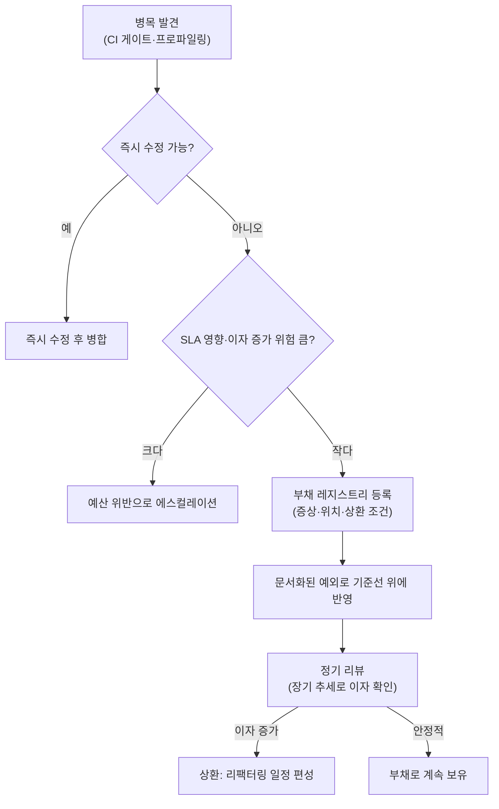

**성능 부채(performance debt)**란 이미 알려진 성능 병목을 지금 당장 고치지 않고, 그 결정과 근거를 명시적으로 남긴 채 의도적으로 미루는 것을 말합니다. 이름은 기술 부채(technical debt)에서 왔지만 다루는 대상은 코드 구조가 아니라 지연시간·처리량 같은 성능 계약입니다. 마감이 촉박한 릴리스에서 N+1 쿼리나 동기 I/O 하나를 완벽히 고치는 대신 캐시로 임시 완화하고 넘어가는 선택은 실무에서 드물지 않지만, 이 선택이 아무 기록 없이 이루어지면 몇 달 뒤 "언제부터, 왜 이렇게 느려졌는지" 아무도 답하지 못하는 상황이 됩니다. 이 장은 그런 의도적 지연을 성능 회귀와 구분해서 다루는 방법 — 무엇을 부채로 등록할지, 어떻게 문서화·추적할지, 언제 상환을 강제할지 — 를 정리합니다.

## 이 장을 읽기 전에

이 장은 [Performance Budget 운영](/post/regression-prevention/performance-budget-operational-enforcement/)에서 다룬 "예산 위반을 어떻게 처리할지", [기준선 관리](/post/regression-prevention/performance-baseline-management-strategy/)에서 다룬 "기준선을 언제 갱신할지", 그리고 [성능 회귀란 무엇인가](/post/regression-prevention/performance-regression-definition-detection-fundamentals/)에서 정의한 회귀 개념을 전제로 합니다. 특히 마지막 링크에서 정의한 "의도치 않게 굳어진 저하"라는 회귀의 정의와, 이 장에서 다루는 "의도적으로 승인된 저하"인 부채를 구분하는 것이 이 장의 출발점입니다.

**이 장의 깊이**: 성능 부채를 회귀·예산 위반과 구분해 정의하고, 부채를 레지스트리로 문서화·추적하는 구체적 메커니즘과 상환 여부를 판단하는 기준까지 다룹니다. **다루지 않는 것**: 예산 자체를 어떻게 설계할지(→ [Performance Budget 운영](/post/regression-prevention/performance-budget-operational-enforcement/)), 기준선 갱신 절차 자체(→ [기준선 관리](/post/regression-prevention/performance-baseline-management-strategy/)), 부채의 누적 추세를 어떻게 시각화·집계할지(→ [장기 추세 분석](/post/regression-prevention/long-term-performance-trend-analysis/)), 이 레지스트리 검사를 CI 파이프라인에 실제로 연결하는 법(→ [Benchmark as Code](/post/regression-prevention/benchmark-as-code-github-actions-gitlab-ci/))입니다.

## 당신의 수준에 맞는 경로

| 수준 | 읽을 부분 | 핵심 목표 |
|------|---------|---------|
| **초보자** | "기술 부채에서 성능 부채로" ~ "성능 부채란 무엇인가" | 성능 부채가 회귀와 다른 개념임을 이해한다 |
| **중급자** | "성능 부채의 발생 형태와 이자" ~ "부채 레지스트리" | 부채를 문서화·추적하는 구체적 메커니즘을 적용한다 |
| **전문가** | "판단 기준" ~ "비판적 시각" | 상환 시점을 판단하고 레지스트리 거버넌스의 한계를 평가한다 |

---

## 기술 부채에서 성능 부채로 (역사·배경)

1992년 OOPSLA에서 Ward Cunningham은 재무 소프트웨어의 리팩터링 필요성을 동료에게 설명하기 위해 부채 은유를 처음 제시했습니다.

> "Shipping first time code is like going into debt." — Ward Cunningham, "The WyCash Portfolio Management System" (OOPSLA 1992 경험 보고서, [c2.com 원문](http://c2.com/doc/oopsla92.html))

이 은유는 이후 코드 구조 전반의 리팩터링 필요성을 가리키는 말로 자리잡았습니다. Martin Fowler는 2009년 [기술 부채 사분면(Technical Debt Quadrant)](https://martinfowler.com/bliki/TechnicalDebtQuadrant.html)에서 이 개념을 "신중한(prudent) vs 무분별한(reckless)"과 "의도적(deliberate) vs 비의도적(inadvertent)" 두 축으로 나눴는데, 이 장이 다루는 성능 부채는 이 사분면 중 정확히 **신중하고 의도적인 부채**만을 가리킵니다. 존재조차 몰랐던 병목이 방치된 경우(무분별하거나 비의도적인 경우)는 부채가 아니라 [성능 회귀](/post/regression-prevention/performance-regression-definition-detection-fundamentals/) 그 자체로 취급해야 합니다.

성능 영역에서 이 은유를 신뢰성 있게 실천한 대표적 사례는 Google SRE의 error budget 정책입니다. 이 정책은 한 분기 동안 특정 장애 유형이 예산의 20%를 초과해 소비하면 다음 분기 계획에 P0 항목으로 강제 등재하도록 규정해([Error Budget Policy](https://sre.google/workbook/error-budget-policy/)), "미루는 결정은 반드시 문서와 기한을 동반해야 한다"는 원칙을 프로세스로 못박았습니다. 성능 부채 관리도 같은 원칙 위에 서 있습니다 — 미루는 것 자체는 허용하되, 미룬다는 결정과 그 조건은 반드시 기록되어야 합니다.

## 성능 부채란 무엇인가

성능 부채와 성능 회귀는 겉보기엔 둘 다 "예산보다 느린 상태"지만 성립 조건이 다릅니다. 회귀는 **감지되지 않았거나 승인되지 않은 채** 굳어진 저하이고, 부채는 **감지되고, 책임자가 승인하고, 조건이 기록된 채** 유예된 저하입니다. 이 차이는 사소하지 않습니다 — 승인과 기록이 없는 저하는 아무리 "의도했다"고 주장해도 부채가 아니라 회귀이며, [PR 성능 게이트](/post/regression-prevention/pr-performance-gate-design/)나 인시던트 프로세스로 다뤄야 할 대상입니다.

실무에서 부채로 등록되는 흔한 형태는 다음과 같습니다.

- 마감에 쫓겨 근본 원인(N+1 쿼리, 인덱스 부재)을 고치는 대신 캐시나 배치화로 임시 완화한 경로
- 트래픽이 낮아 성능 예산 위반이 실제 사용자 영향으로 이어지지 않는다고 판단해 유예한 API
- 리팩터링 비용이 당장의 이득보다 크다고 판단된 코스 그레인 락이나 동기 I/O
- 마이그레이션 중간 상태처럼, 완전히 고치려면 더 큰 아키텍처 변경이 선행되어야 하는 병목

## 성능 부채의 발생 형태와 이자

기술 부채 은유를 끝까지 밀어붙이면 부채에는 **원금**과 **이자**가 있습니다. 원금은 지금 시점에 초과된 비용(예: 예산보다 35ms 느린 p99)이고, 이자는 시간이 지나며 늘어나는 추가 비용입니다. 모든 성능 부채가 이자를 동반하지는 않습니다 — 트래픽이 거의 없는 관리자 전용 엔드포인트의 느린 조회는 사용량이 늘지 않는 한 원금이 고정된 채로 남아 상환하지 않고 오래 들고 있어도 실무적으로 무해할 수 있습니다. 반대로 핫패스에 있는 부채는 트래픽이 늘수록, 혹은 다른 팀이 그 위에 기능을 계속 쌓을수록 고치는 비용과 방치 비용이 함께 커지는 **복리 구조**를 가집니다. 이 차이를 구분하지 못하면 이자가 거의 없는 부채에 상환 자원을 낭비하거나, 반대로 빠르게 불어나는 부채를 방치하게 됩니다.

부채를 코드에 남길 때는 아래처럼 위치·근거·상환 조건을 마커로 표시해 두는 것이 출발점입니다. 이 마커 자체는 빌드에 영향을 주지 않는 주석이지만, 뒤에서 다룰 레지스트리와 짝을 이뤄야 의미가 있습니다.

```cpp
// order_service.cpp
// PERF-DEBT: PERF-1042 — N+1 쿼리 패턴. docs/perf-debt.yaml 참조.
// 상환 조건: 동시 사용자 5,000명 초과 또는 p99 > 130ms
std::vector<Order> OrderRepository::findByUserId(UserId id) {
  // 사용자별 주문을 조회한 뒤 각 주문의 상세를 개별 쿼리로 다시 가져옴 (N+1)
  auto orders = db_.query("SELECT id FROM orders WHERE user_id = ?", id);
  for (auto& order : orders) {
    order.details = db_.query("SELECT * FROM order_items WHERE order_id = ?", order.id);
  }
  return orders;
}
```

이 마커는 "여기 부채가 있다"는 신호일 뿐, 상환 조건이나 승인 이력까지 코드에 다 적을 수는 없습니다. 코드가 자주 바뀌는 파일에 긴 근거를 남기면 리팩터링 때마다 주석이 낡은 채로 방치되기 쉬우므로, 세부 내용은 별도의 레지스트리 파일로 분리하고 코드에는 식별자(`PERF-1042`)만 남깁니다.

## 부채 레지스트리: 문서화·추적 메커니즘

**부채 레지스트리**는 각 부채 항목의 증상·위치·원인·완화책·승인자·상환 조건·추적 이슈를 한곳에 모은 문서입니다. 백로그 티켓만으로는 부족한데, 일반 백로그는 "언제 갚을지"를 관리하지만 부채 레지스트리는 그에 더해 "왜 지금 안 갚아도 되는지"와 "어떤 조건이 되면 반드시 갚아야 하는지"까지 명시적으로 담아야 하기 때문입니다.

```yaml
# docs/perf-debt.yaml — 성능 부채 레지스트리 항목 예시
- id: PERF-1042
  symptom: "주문 조회 API p99가 예산(80ms) 대비 35ms 초과"
  location: "order_service.cpp:OrderRepository::findByUserId"
  root_cause: "N+1 쿼리 패턴, order_items.order_id에 인덱스 없음"
  mitigation: "쿼리 결과 60초 TTL 캐시로 임시 완화"
  accepted_by: "backend-team-lead, 2026-05-02"
  repay_trigger: "동시 사용자 5,000명 초과 또는 p99 > 130ms 시 즉시 재우선순위화"
  tracking_issue: "JIRA-4821"
  review_cycle: "quarterly"
```

각 필드는 서로 다른 질문에 답합니다. `symptom`·`location`·`root_cause`는 "무엇이, 어디서, 왜" 느린지를 [성능 회귀란 무엇인가](/post/regression-prevention/performance-regression-definition-detection-fundamentals/)에서 정의한 언어로 기록하고, `mitigation`은 완전한 해결이 아니라 임시 완화책임을 분명히 합니다. `accepted_by`는 이 저하가 승인 없이 방치된 회귀가 아니라 책임자가 서명한 부채임을 증명하고, `repay_trigger`는 [기준선 관리](/post/regression-prevention/performance-baseline-management-strategy/)에서 기준선을 조용히 재설정하는 대신 "이 조건이 되면 반드시 갚는다"는 계약을 명시합니다. `review_cycle`이 없는 레지스트리는 등록 시점에는 정확해도 시간이 지나며 방치되는 죽은 문서가 되기 쉽습니다.

부채를 승인하는 순간, 초과된 값은 [기준선 관리](/post/regression-prevention/performance-baseline-management-strategy/)의 기준선을 조용히 갱신하는 방식이 아니라 **레지스트리에 문서화된 예외로 기준선 위에 얹어야** 합니다. 그래야 나중에 누군가 기준선 변경 이력만 보고 "언제부터 이렇게 느려졌는지" 추적할 때, 회귀와 승인된 부채를 혼동하지 않습니다.

레지스트리와 코드의 마커가 따로 놀면 레지스트리는 금방 낡습니다. 아래 스크립트는 소스에 남은 `PERF-DEBT` 식별자와 레지스트리 항목을 대조해, 레지스트리에 없는 식별자(미문서화된 부채)를 CI에서 잡아냅니다.

```bash
#!/usr/bin/env bash
# scripts/check-perf-debt.sh
# 소스의 PERF-DEBT 마커 ID가 모두 레지스트리에 등록돼 있는지 확인한다.
# 요구 사항: bash 4+, grep. 실행: ./scripts/check-perf-debt.sh
set -euo pipefail

REGISTRY="docs/perf-debt.yaml"
mapfile -t marker_ids < <(grep -rhoE 'PERF-DEBT: PERF-[0-9]+' src/ \
  | grep -oE 'PERF-[0-9]+' | sort -u)

missing=0
for id in "${marker_ids[@]}"; do
  if ! grep -q "id: ${id}$" "$REGISTRY"; then
    echo "미등록 성능 부채 마커: ${id} (레지스트리에 없음)" >&2
    missing=1
  fi
done

exit "$missing"
```

이 스크립트는 구조적 누락(마커는 있는데 레지스트리 항목이 없음)만 잡을 뿐, 등록된 내용의 품질(상환 조건이 현실적인지, 승인자가 실제 책임자인지)까지는 검증하지 못합니다. 이런 CI 검사를 실제 파이프라인의 어느 단계에 배치할지는 [Benchmark as Code](/post/regression-prevention/benchmark-as-code-github-actions-gitlab-ci/)에서 다루는 워크플로 구성과 함께 봐야 합니다.

지금까지 다룬 발견·분류·등록·리뷰의 흐름을 하나의 결정 다이어그램으로 정리하면 다음과 같습니다.



## 흔한 오개념 교정

**"성능 부채와 회귀는 같은 것이다"**는 오개념입니다. 회귀는 의도치 않게 굳어진 저하이고 부채는 승인·문서화된 유예입니다. 두 개념을 섞으면 승인되지 않은 저하까지 "이미 알고 있던 부채"라고 사후 합리화하게 되어, 정작 조사해야 할 회귀가 방치됩니다.

**"레지스트리에 기록만 해두면 관리는 끝난다"**도 오개념입니다. `review_cycle`이 있어도 아무도 실제로 리뷰하지 않으면 레지스트리는 등록 당시의 스냅샷으로 굳어버립니다. 트래픽 패턴이 바뀌어 `repay_trigger` 조건이 이미 충족됐는데도 아무도 확인하지 않는다면, 문서화된 부채가 사실상 미문서화된 회귀와 같은 상태로 되돌아갑니다.

**"모든 부채는 결국 상환해야 한다"**는 것도 일괄적으로 참은 아닙니다. 이자가 거의 붙지 않는 부채(트래픽이 늘지 않는 경로, 상환 비용이 매우 큰 레거시)는 재우선순위화 조건이 충족되지 않는 한 계속 들고 가는 것이 합리적인 선택일 수 있습니다. 반대로 "이자가 없으니 신경 쓰지 않아도 된다"고 단정하는 것도 위험한데, 트래픽 패턴은 예고 없이 바뀌기 때문입니다. 판단은 "상환한다/안 한다"의 이분법이 아니라 `repay_trigger` 조건과 정기 리뷰로 지속적으로 갱신되어야 합니다.

## 판단 기준

| 상황 | 권장 대응 | 근거 |
|------|-----------|------|
| p99 초과가 SLA/SLO에 직접 연결됨 | 지금 상환(부채로 등록하지 않음) | 승인해도 사용자 영향이 즉시 발생 |
| 트래픽 증가에 비례해 이자가 커지는 핫패스 | 부채로 등록하되 조기 상환 계획을 `repay_trigger`에 명시 | 방치 비용이 시간에 비례해 커짐 |
| 저빈도 경로, 상환 비용이 매우 큼, 이자 거의 없음 | 부채로 등록, 정기 리뷰만 수행 | 지금 갚는 비용이 방치 비용보다 큼 |
| 승인·문서화 없이 발견된 저하 | 부채가 아니라 회귀로 취급, 즉시 조사 | 승인 이력이 없으면 정의상 부채가 아님 |
| 레지스트리 항목이 리뷰 주기를 넘겨 방치됨 | 즉시 재검토(triage), 필요 시 에스컬레이션 | 리뷰 없는 레지스트리는 죽은 문서와 같음 |

## 비판적 시각: 한계와 트레이드오프

부채 레지스트리는 사람이 실제로 리뷰할 때만 의미가 있고, 리뷰 자체를 강제하는 장치가 없으면 등록 순간의 스냅샷으로 굳어버립니다. 더 근본적인 문제는 조직적 인센티브에 있습니다 — 부채를 승인할 권한이 있는 사람(팀 리드, PM)이 대개 상환 우선순위도 함께 정하는데, 새 기능 개발과 부채 상환이 항상 같은 백로그에서 경쟁하는 한 부채는 구조적으로 뒤로 밀리기 쉽습니다. 레지스트리가 있다고 이 힘의 불균형이 저절로 해소되지는 않습니다. 또한 기술 부채 은유 자체에 대한 비판처럼, "이자만 내면 계속 써도 된다"는 프레이밍이 실제로는 이자가 계단식으로 튀는(어느 트래픽 임계값을 넘는 순간 급격히 나빠지는) 경우를 과소평가하게 만들 수 있습니다. 마지막으로, 부채 승인 절차가 있다는 사실 자체가 "일단 승인받고 미루자"는 식의 남용을 부추길 위험도 있어, `repay_trigger`를 모호하게(예: "트래픽이 늘면 검토") 적어 사실상 무기한 유예로 쓰는 관행은 경계해야 합니다.

## 마무리

- [ ] 성능 부채와 성능 회귀를 승인·문서화 여부로 구분해 설명할 수 있는가?
- [ ] 부채의 원금과 이자가 다르고, 이자가 트래픽에 비례해 커지는 경우와 그렇지 않은 경우를 구분할 수 있는가?
- [ ] 부채 레지스트리에 어떤 필드(증상·위치·원인·완화책·승인자·상환 조건·리뷰 주기)가 필요한지 말할 수 있는가?
- [ ] 부채를 승인할 때 기준선을 조용히 갱신하는 대신 문서화된 예외로 남겨야 하는 이유를 설명할 수 있는가?
- [ ] "부채는 결국 다 갚아야 한다"거나 "기록만 하면 끝"이라는 오개념이 왜 틀렸는지 설명할 수 있는가?

**이전 장**: [장기 추세 분석](/post/regression-prevention/long-term-performance-trend-analysis/)에서는 성능 지표의 장기 궤적을 관측해 서서히 나빠지는 신호를 잡는 방법을 다뤘다면, 이 장은 그렇게 발견됐거나 처음부터 알고 있던 저하를 회귀로 다급하게 처리할지 문서화된 부채로 관리할지 가르는 기준을 다뤘습니다. 다음 장에서는 이런 레지스트리 검사와 게이트 로직을 실제 파이프라인 코드로 관리하는 [Benchmark as Code](/post/regression-prevention/benchmark-as-code-github-actions-gitlab-ci/)를 다룹니다. 부채 레지스트리 검증 스크립트도 결국 벤치마크 파이프라인과 같은 방식으로 버전 관리되고 CI에서 실행되어야 하기 때문입니다.
