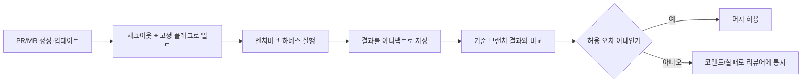

**Benchmark as Code**란 벤치마크 하네스·기준선·비교 규칙을 애플리케이션 코드와 동일하게 저장소에 버전관리하고, GitHub Actions나 GitLab CI 같은 CI 시스템이 PR·커밋마다 자동으로 실행하도록 만드는 운영 패턴을 말합니다. 벤치마크가 개발자 로컬 머신에만 존재하고 "생각날 때 수동으로 돌리는" 스크립트로 남아 있으면, 벤치마크 자체가 코드베이스와 함께 진화하지 못하고 리뷰도 받지 못한 채 방치되기 쉽습니다. 이 장은 그 벤치마크를 코드 리뷰·CI 실행·아티팩트 저장의 대상으로 승격시키는 구체적인 파이프라인 구성을 GitHub Actions와 GitLab CI 두 플랫폼 기준으로 다룹니다.

## 이 장을 읽기 전에

이 장은 [Tr.12 03장: 벤치마크 CI 통합](/post/regression-prevention/benchmark-ci-integration-codspeed-bencher/)에서 다룬 "벤치마크를 CI에 붙인다"는 개념과, [Tr.01 Google Benchmark 실전](/post/profiling-analysis/google-benchmark-practical/)에서 다룬 벤치마크 코드 작성법을 전제로 합니다. 마이크로벤치마크를 작성할 줄 알고, CI가 PR마다 파이프라인을 실행한다는 것만 알면 충분합니다.

**이 장의 깊이**: 이 장은 **중급**입니다. GitHub Actions 워크플로 YAML과 GitLab CI `.gitlab-ci.yml` 두 가지로 "벤치마크 실행 → 결과 저장 → 기준과 비교"까지 이어지는 최소 파이프라인 구성을 다룹니다. **다루지 않는 것**: CodSpeed·Bencher 같은 상용/전문 벤치마킹 플랫폼의 세부 기능(메모리 계측, 베어메탈 동일성 등)은 [03장](/post/regression-prevention/benchmark-ci-integration-codspeed-bencher/), 기준선을 언제·어떻게 갱신할지는 [06장](/post/regression-prevention/performance-baseline-management-strategy/), 임계값 초과 시 누구에게 어떻게 알릴지는 [09장](/post/regression-prevention/performance-alerting-strategy-design/), 예산 자체의 설계는 [05장](/post/regression-prevention/performance-budget-operational-enforcement/)에서 각각 다룹니다. 이 장은 그 모든 정책을 담을 **파이프라인의 뼈대**에 집중합니다.

## 당신의 수준에 맞는 경로

| 수준 | 읽을 부분 | 핵심 목표 |
|------|---------|---------|
| **입문자** | "Benchmark as Code의 배경" ~ "벤치마크를 코드로 관리한다는 것" | 왜 벤치마크를 코드로 다뤄야 하는지 이해 |
| **중급자** | "GitHub Actions 파이프라인 구성" ~ "GitLab CI 파이프라인 구성" | 두 플랫폼에서 벤치마크 자동화 워크플로를 직접 구성 |
| **실무 적용자** | "판단 기준" ~ "비판적 시각" | 자신의 CI 환경에 맞는 구성 선택과 한계 인지 |

---

## Benchmark as Code의 배경

<strong>Infrastructure as Code(IaC)</strong>가 서버 구성을 코드로 선언해 리뷰·재현·롤백이 가능하게 만든 것처럼, Benchmark as Code는 "무엇을 어떻게 측정하고 무엇을 통과 기준으로 볼지"를 코드와 설정 파일로 선언합니다. GitHub Actions는 2019년 정식 출시되며 저장소 안에 워크플로를 YAML로 선언하는 방식을 대중화했고, 이 흐름을 타고 `benchmark-action/github-action-benchmark` 같은 오픈소스 액션이 등장해 Cargo(Rust), Go, Google Benchmark(C++), JMH(Java), BenchmarkDotNet(.NET) 등 여러 언어의 벤치마크 출력을 CI 결과로 흡수하는 방법을 표준화했습니다. GitLab CI는 조금 다른 경로를 택해, 벤치마크 자체보다 넓은 개념인 **메트릭 리포트**(`artifacts:reports:metrics`)로 커스텀 수치를 MR(Merge Request)에 표시하는 기능을 제공합니다. 두 플랫폼 모두 핵심은 같습니다 — 벤치마크 실행과 결과 비교를 사람이 손으로 하지 않고 파이프라인 정의 파일 안에 고정한다는 것입니다.

## 벤치마크를 코드로 관리한다는 것

벤치마크를 코드로 관리한다는 것은 단순히 "CI에서 벤치마크를 실행한다"는 뜻을 넘어, 세 가지 산출물을 모두 저장소 안에 버전관리 대상으로 둔다는 뜻입니다. 첫째는 **벤치마크 하네스 코드**(무엇을 측정하는지), 둘째는 **비교·판정 설정**(무엇을 기준으로 통과/실패를 가를지 — 임계값·비교 대상 브랜치), 셋째는 **파이프라인 정의**(언제, 어떤 환경에서, 어떤 순서로 실행할지)입니다. 이 세 산출물이 모두 코드 리뷰 대상이 되면, 벤치마크를 추가·수정하는 PR 자체가 "이 성능 지표를 왜 이렇게 측정하기로 했는가"라는 논의를 남깁니다. 반대로 벤치마크가 개인 스크립트나 위키 문서로만 존재하면, 담당자가 바뀌거나 시간이 지나면 무엇을 왜 측정했는지 아무도 재구성할 수 없게 됩니다.

이 패턴이 실제로 작동하려면 벤치마크 코드와 애플리케이션 코드가 **같은 커밋에서 함께 바뀔 수 있어야** 합니다. 함수 시그니처가 바뀌면 벤치마크 코드도 같은 PR에서 컴파일이 깨져야 리뷰어가 놓치지 않습니다. 아래는 그런 벤치마크 코드 예시로, 정렬 함수의 성능을 측정하는 최소 Google Benchmark 하네스입니다. 이 코드 자체가 저장소의 `bench/` 디렉터리에 커밋되어 애플리케이션 코드와 나란히 버전관리됩니다.

```cpp
#include <algorithm>
#include <random>
#include <vector>
#include <benchmark/benchmark.h>

static std::vector<int> make_shuffled(size_t n) {
  std::vector<int> v(n);
  for (size_t i = 0; i < n; ++i) v[i] = static_cast<int>(i);
  std::mt19937 rng(42);  // 고정 시드: 실행마다 동일한 입력 분포 보장
  std::shuffle(v.begin(), v.end(), rng);
  return v;
}

static void BM_SortRandomInts(benchmark::State& state) {
  const size_t n = static_cast<size_t>(state.range(0));
  for (auto _ : state) {
    state.PauseTiming();
    auto data = make_shuffled(n);   // 정렬 전 준비는 측정 구간 밖에서
    state.ResumeTiming();
    std::sort(data.begin(), data.end());
    benchmark::DoNotOptimize(data.data());
  }
}
BENCHMARK(BM_SortRandomInts)->Arg(1 << 10)->Arg(1 << 16);

BENCHMARK_MAIN();
```

이 하네스가 CI에서 매번 같은 방식으로 컴파일·실행되고, 그 출력이 다음 절의 워크플로가 소비할 수 있는 형식으로 저장되어야 파이프라인이 완성됩니다. 컴파일 플래그(`-O2` 등)나 CPU 스로틀링 같은 실행 환경 변수가 흔들리면 결과 자체가 신뢰할 수 없어지므로, 러너 이미지와 컴파일러 버전도 워크플로 파일에 고정해 둡니다.

## GitHub Actions 파이프라인 구성

GitHub Actions에서 가장 널리 쓰이는 접근은 `benchmark-action/github-action-benchmark`처럼 벤치마크 출력 파일을 읽어 이전 결과와 비교하는 액션을 워크플로 마지막 단계에 배치하는 것입니다. 이 액션은 `tool` 입력값으로 `googlecpp`(Google Benchmark), `cargo`(Rust), `go`, `pytest` 등 여러 벤치마크 프레임워크의 출력 형식을 인식하고, `alert-threshold`(기본 `200%`)를 넘는 성능 저하가 감지되면 `fail-on-alert` 설정에 따라 워크플로를 실패시키거나 `comment-on-alert` 설정에 따라 커밋에 코멘트를 남깁니다. 아래 워크플로는 PR이 열릴 때마다 앞서 만든 `BM_SortRandomInts` 하네스를 빌드·실행하고, 그 콘솔 출력을 파일로 저장한 뒤 액션에 넘기는 최소 구성입니다.

```yaml
name: benchmark
on:
  pull_request:
    branches: [main]

jobs:
  run-benchmark:
    runs-on: ubuntu-22.04
    steps:
      - uses: actions/checkout@v4

      - name: Install Google Benchmark
        run: sudo apt-get update && sudo apt-get install -y libbenchmark-dev

      - name: Build benchmark
        run: g++ -O2 -std=c++17 bench/sort_bench.cpp -lbenchmark -lpthread -o sort_bench

      - name: Run benchmark
        run: ./sort_bench --benchmark_repetitions=5 | tee output.txt

      - name: Compare against baseline
        uses: benchmark-action/github-action-benchmark@v1
        with:
          tool: 'googlecpp'
          output-file-path: output.txt
          alert-threshold: '130%'
          fail-on-alert: true
          comment-on-alert: true
          github-token: ${{ secrets.GITHUB_TOKEN }}
```

이 워크플로에서 눈여겨볼 부분은 `alert-threshold`를 기본값 `200%`보다 훨씬 보수적인 `130%`로 낮춘 것입니다. 기본값은 "두 배 이상 느려져야 경고"라는 뜻이라 대부분의 µs 단위 핫패스에는 지나치게 느슨하며, 실제 임계값을 어디에 둘지는 팀의 변동성 데이터를 본 뒤 [07장: 변동성 관리](/post/regression-prevention/performance-variance-noise-management/)와 [09장: 알림 전략](/post/regression-prevention/performance-alerting-strategy-design/)의 기준을 참고해 정합니다. 이 액션은 기본적으로 `gh-pages` 브랜치에 결과 이력을 누적해 시계열 차트를 제공하는데, 이 저장소 자체를 장기 기준선으로 쓸지 별도 저장소를 둘지는 [06장: 기준선 관리](/post/regression-prevention/performance-baseline-management-strategy/)에서 다루는 결정입니다. CodSpeed나 Bencher처럼 전용 SaaS를 쓰는 경우 이 단계 전체가 해당 플랫폼의 액션으로 대체되며, 그 차이와 선택 기준은 [03장](/post/regression-prevention/benchmark-ci-integration-codspeed-bencher/)에 있습니다.

## GitLab CI 파이프라인 구성

GitLab CI는 벤치마크 전용 액션 생태계가 GitHub Actions만큼 크지 않은 대신, `artifacts:reports:metrics`라는 범용 메커니즘으로 커스텀 수치를 MR 위젯에 노출합니다. 이 리포트는 **OpenMetrics** 텍스트 형식의 파일을 아티팩트로 업로드하면, GitLab이 소스 브랜치와 대상 브랜치의 값을 자동으로 비교해 "변경된 지표·새 지표·삭제된 지표"로 나눠 MR에 보여주는 방식으로 동작합니다. 단, 이 기능은 GitLab Premium/Ultimate 티어에서만 제공되므로, Free 티어에서는 벤치마크 출력을 일반 `artifacts`로 올려두고 별도 스크립트나 이전 파이프라인 아티팩트를 내려받아 비교하는 방식을 직접 구성해야 합니다.

```yaml
stages:
  - benchmark

benchmark:
  stage: benchmark
  image: gcc:13
  rules:
    - if: '$CI_PIPELINE_SOURCE == "merge_request_event"'
  script:
    - apt-get update && apt-get install -y libbenchmark-dev
    - g++ -O2 -std=c++17 bench/sort_bench.cpp -lbenchmark -lpthread -o sort_bench
    - ./sort_bench --benchmark_format=json > output.json
    - python3 bench/convert_to_openmetrics.py output.json > metrics.txt
  artifacts:
    reports:
      metrics: metrics.txt
    paths:
      - output.json
    expire_in: 30 days
```

`convert_to_openmetrics.py`는 저장소에 함께 커밋되는 작은 변환 스크립트로, Google Benchmark의 JSON 출력(`--benchmark_format=json`)을 GitLab이 요구하는 `metric_name{label="value"} <value>` 형태의 OpenMetrics 라인으로 바꿔주는 역할만 합니다. 이 스크립트가 파이프라인 정의·벤치마크 하네스와 함께 저장소에 있다는 점이 이 장에서 강조하는 "코드로 관리"의 핵심입니다 — 변환 규칙이 바뀌면 그 변경도 diff로 남고 리뷰를 거칩니다. `paths`로 원본 JSON도 함께 보존해 두면, 메트릭 리포트가 지원되지 않는 티어에서도 이전 파이프라인의 아티팩트를 내려받아 수동으로 비교할 수 있는 안전망이 됩니다.

두 플랫폼의 파이프라인은 결국 같은 흐름을 서로 다른 어휘로 표현합니다.



## 흔한 오개념 바로잡기

<strong>"벤치마크를 CI에 붙이면 그 자체로 회귀를 막는다"</strong>는 오해가 흔합니다. 파이프라인은 결과를 비교할 뿐이며, 무엇을 임계값으로 삼을지·노이즈를 어떻게 걸러낼지는 별도의 정책 설계가 필요합니다. 임계값을 대충 기본값으로 두면 경고가 너무 늦게 뜨거나(둔감) 반대로 매 PR마다 오탐이 쏟아져(민감) 팀이 알림을 무시하게 되는데, 이 부분은 [07장](/post/regression-prevention/performance-variance-noise-management/)과 [09장](/post/regression-prevention/performance-alerting-strategy-design/)이 다룹니다.

<strong>"공유 러너에서 실행하면 결과를 그대로 믿을 수 있다"</strong>도 자주 나오는 오해입니다. GitHub Actions의 공용 `ubuntu-22.04` 러너나 GitLab의 공유 러너는 다른 워크플로와 물리 자원을 공유하는 가상 환경이라, 절대 시간값 자체는 실행마다 수 퍼센트에서 수십 퍼센트까지 흔들릴 수 있습니다. 이 문제의 근본 대응(전용 러너, 베어메탈 격리, 상대 비교 위주 설계)은 [03장의 Bencher 베어메탈 동일성 벤치마킹](/post/regression-prevention/benchmark-ci-integration-codspeed-bencher/)에서 다룹니다. 이 장의 파이프라인은 "무엇을 비교할지"의 골격이지, 그 비교의 통계적 신뢰도까지 보장하지 않습니다.

<strong>"YAML 워크플로만 저장소에 있으면 Benchmark as Code가 완성된다"</strong>도 흔한 축소 해석입니다. 파이프라인 정의만 코드화되고 벤치마크 하네스나 변환 스크립트가 별도 도구·수작업으로 남아 있으면, 여전히 "이 수치가 왜 이렇게 계산됐는지" 저장소만 보고는 재구성할 수 없습니다. 세 산출물(하네스·비교 설정·파이프라인 정의) 모두가 버전관리 대상이어야 이 장에서 말하는 패턴이 성립합니다.

## 판단 기준

| 상황 | 권장 | 비권장 |
|------|------|--------|
| 오픈소스·다국어 벤치마크, 이력 차트 필요 | `github-action-benchmark` + gh-pages 이력 | 매번 수동 비교 |
| GitLab, Premium/Ultimate 사용 중 | `artifacts:reports:metrics`로 MR 위젯 노출 | 별도 대시보드 신규 구축 |
| GitLab Free 티어 | 아티팩트 저장 + 커스텀 비교 스크립트 | 메트릭 리포트 기능 가정 |
| 변환·비교 스크립트 필요 | 저장소에 커밋해 리뷰 대상으로 | 개인 로컬 스크립트로 방치 |
| 정밀한 절대 수치 비교가 중요 | 전용 러너·베어메탈([03장](/post/regression-prevention/benchmark-ci-integration-codspeed-bencher/)) | 공유 러너 결과를 그대로 신뢰 |
| 임계값·알림 정책 | [09장](/post/regression-prevention/performance-alerting-strategy-design/) 기준으로 별도 설계 | 액션 기본값(200%) 그대로 사용 |

## 비판적 시각: 한계와 트레이드오프

CI에서 벤치마크를 실행하는 순간, 그 결과는 "지금 이 러너의 상태"라는 조건부 진실이 됩니다. 공유 러너의 노이즈는 완전히 제거되지 않으며, 워크플로 YAML을 아무리 정교하게 짜도 근본적인 하드웨어 변동성 문제를 코드만으로 해결할 수는 없습니다. 또한 벤치마크 하네스와 변환 스크립트를 저장소에 두는 것은 유지보수 부담을 늘리는 선택이기도 합니다 — 애플리케이션 코드가 바뀔 때마다 벤치마크 코드도 함께 갱신해야 하고, 이를 게을리하면 컴파일은 되지만 더는 의미 있는 경로를 측정하지 않는 "죽은 벤치마크"가 조용히 쌓일 수 있습니다. GitLab의 메트릭 리포트처럼 유료 티어에 묶인 기능에 의존하면, 조직의 라이선스 정책이 바뀔 때 파이프라인 전체를 다시 설계해야 하는 위험도 있습니다. 이런 이유로 이 장의 워크플로는 "완성된 회귀 방지 체계"가 아니라, 그 위에 임계값·알림·기준선 정책을 얹을 수 있는 뼈대로 이해하는 것이 맞습니다.

## 마무리

- [ ] Benchmark as Code가 하네스·비교 설정·파이프라인 정의 세 가지 모두를 버전관리한다는 뜻임을 설명할 수 있다.
- [ ] GitHub Actions에서 `github-action-benchmark` 액션의 `tool`·`alert-threshold`·`fail-on-alert` 역할을 설명할 수 있다.
- [ ] GitLab CI에서 `artifacts:reports:metrics`가 무엇을 제공하고 Free 티어에서 무엇을 직접 구성해야 하는지 안다.
- [ ] 공유 러너의 노이즈·죽은 벤치마크 같은 이 패턴의 한계를 인지하고 있다.
- [ ] 임계값·알림·기준선 정책은 이 장이 아니라 05·06·07·09장에서 설계한다는 경계를 안다.

**이전 장**: [성능 부채 관리](/post/regression-prevention/performance-debt-management-strategy/) (13장)에서는 갚지 않고 쌓이는 성능 저하를 부채로 다루는 법을 살펴봤습니다.

**다음 장에서는** 이 장에서 만든 파이프라인이 쌓아 올린 결과를 사람이 지속적으로 관찰할 수 있는 형태로 바꾸는 **Grafana·Prometheus 기반 모니터링 대시보드 설계**를 다룹니다. CI 파이프라인이 매 PR의 결과를 만든다면, 대시보드는 그 결과들이 시간에 따라 그리는 추세를 보여줍니다.

→ [모니터링 대시보드](/post/regression-prevention/performance-monitoring-dashboard-grafana-prometheus/) (15장)
