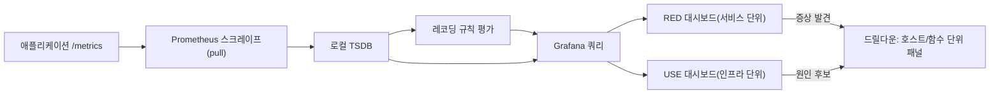

**성능 모니터링 대시보드**란 Prometheus 같은 시계열 저장소에 쌓인 지연·처리량 지표를 Grafana 같은 도구로 상시 관찰 가능한 화면으로 만드는 설계 산출물을 말합니다. CI 게이트가 "이번 PR이 기준선보다 느려졌는가"라는 이진 판정을 내려준다면, 대시보드는 그 사이 어디에서도 잡히지 않는 것—배포 후 서서히 나빠지는 p99, 특정 시간대에만 나타나는 꼬리 지연, 여러 서비스가 동시에 느려지는 패턴—을 사람이 계속 들여다볼 수 있게 만드는 장치입니다. 문제는 대시보드를 "만드는 것"과 "믿을 수 있게 유지하는 것"이 전혀 다른 난이도라는 점입니다. 패널을 아무렇게나 늘어놓은 대시보드는 새로고침될 때마다 원본 히스토그램을 다시 집계하느라 느려지고, UI에서만 수정되어 누가 왜 바꿨는지 추적할 수 없게 되며, 결국 아무도 열어보지 않는 화면으로 전락합니다. 이 장은 그런 실패를 피하기 위해 Prometheus가 지연 분포를 내부적으로 어떻게 저장하는지, 그 저장 방식이 대시보드 쿼리 비용에 어떤 제약을 거는지, 그리고 Grafana에서 그 지표를 어떤 레이아웃 원칙과 운영 방식으로 화면에 옮길지를 다룹니다.

## 이 장을 읽기 전에

이 장은 [관측 가능성 플랫폼](/post/regression-prevention/performance-observability-platform-design/)에서 다룬 "메트릭·트레이스·로그를 무엇으로 연결할지"와, [알림 전략](/post/regression-prevention/performance-alerting-strategy-design/)에서 다룬 "신호를 누구에게 언제 보낼지"가 이미 정해져 있다는 것을 전제합니다. 이 장은 그 전제 위에서 **화면을 어떻게 구성해야 사람이 신호를 오독하지 않는지**에 집중합니다. **다루지 않는 것**: CI 도구별 벤치마크 수집·자동화 스크립트(→ [벤치마크 CI 통합](/post/regression-prevention/benchmark-ci-integration-codspeed-bencher/), [Benchmark as Code](/post/regression-prevention/benchmark-as-code-github-actions-gitlab-ci/)), 임계값·이상탐지·라우팅 정책 자체(→ [알림 전략](/post/regression-prevention/performance-alerting-strategy-design/)), 무엇을 기준선으로 삼을지·변동성을 어떻게 통계적으로 걸러낼지(→ [기준선 관리](/post/regression-prevention/performance-baseline-management-strategy/), [변동성 관리](/post/regression-prevention/performance-variance-noise-management/)), 누적된 시계열에서 장기 추세를 뽑아내는 통계 기법(→ [장기 추세 분석](/post/regression-prevention/long-term-performance-trend-analysis/))입니다. 이 장은 그 모든 데이터를 **어떤 지표로, 어떤 화면 구조로 노출할지**를 다룹니다.

**이 장의 깊이**: Prometheus의 히스토그램 데이터 모델(classic·native)과 quantile 계산의 내부 동작, 레코딩 규칙으로 쿼리 비용을 낮추는 원리, Grafana 대시보드를 코드로 관리하는 방식, RED/USE 레이아웃 원칙과 드릴다운 설계까지 다룹니다. 특정 벤더 SaaS의 화면 조작법이나 PromQL 문법 전체를 나열하지는 않습니다.

## 당신의 수준에 맞는 경로

| 수준 | 읽을 부분 | 핵심 목표 |
|------|---------|---------|
| **중급자** | "Prometheus와 Grafana의 결합" ~ "Prometheus 히스토그램과 지연 분포의 표현" | 두 도구가 왜 짝을 이루는지, 히스토그램이 지연 분포를 어떻게 저장하는지 이해한다 |
| **심화** | "레코딩 규칙으로 대시보드 쿼리 비용 낮추기" ~ "레이아웃 원칙" | 쿼리 비용을 낮추는 사전 계산과 RED/USE 기반 화면 구조를 설계할 수 있다 |
| **전문가** | "판단 기준" ~ "비판적 시각" | 히스토그램 종류·쿼리 전략·레이아웃을 상황에 맞게 선택하고 한계를 판단할 수 있다 |

---

## Prometheus와 Grafana의 결합: 왜 이 조합인가 (배경)

**Prometheus**는 2012년 SoundCloud에서 시작되었습니다. Google 출신 엔지니어 Matt T. Proud와 Julius Volz가 SoundCloud에 합류해, 컨테이너 오케스트레이션 위에서 돌아가는 수백 개 마이크로서비스를 기존 모니터링 도구로는 감당할 수 없다는 문제에 부딪혔고, 클라이언트가 메트릭을 밀어 넣는(push) 대신 서버가 각 대상을 주기적으로 끌어오는(pull) 스크레이프 모델과 자체 질의 언어(PromQL)를 갖춘 시계열 저장소를 사내 프로젝트로 만들기 시작했습니다. 2012년 말에는 이미 대상에서 메트릭을 긁어 TSDB에 저장하고 그래프로 질의하는 원형이 동작했고, 이 구조는 이후 오픈소스로 공개되어 CNCF의 두 번째 졸업 프로젝트가 되었습니다. **Grafana**는 이보다 조금 늦은 2014년, Torkel Ödegaard가 Kibana(당시 Graphite 데이터를 시각화하기 위해 손보던 코드베이스)를 포크해 만든 별도 프로젝트로 출발했습니다. Grafana는 특정 저장소에 종속되지 않는 시각화 계층을 목표로 삼았기 때문에, Prometheus가 "무엇을 얼마나 효율적으로 저장·질의할 것인가"를 담당하고 Grafana가 "그것을 사람이 읽을 화면으로 어떻게 배치할 것인가"를 담당하는 역할 분담이 생태계 차원에서 자연스럽게 굳어졌습니다.

이 역할 분담은 성능 회귀 대시보드에도 그대로 적용됩니다. 지연·처리량 데이터를 어떻게 버킷화해서 저장할지는 Prometheus의 히스토그램 모델이 결정하고, 그 데이터를 어떤 패널·레이아웃·드릴다운 경로로 보여줄지는 Grafana의 대시보드 설계가 결정합니다. 둘 중 하나만 잘해서는 신뢰할 수 있는 대시보드가 나오지 않습니다 — 저장 모델이 성긴 채로 화면만 예쁘게 꾸미면 quantile 값 자체가 부정확하고, 반대로 저장은 정교해도 화면 구조가 어수선하면 사람이 신호를 놓칩니다.

## Prometheus 히스토그램과 지연 분포의 표현

Prometheus의 데이터 모델에서 모든 시계열은 **메트릭 이름 + 레이블 집합**으로 식별됩니다. 지연처럼 분포 자체가 중요한 지표는 단일 숫자(평균)로 대표할 수 없기 때문에, Prometheus는 이를 **히스토그램(histogram)** 타입으로 노출합니다. 전통적인 방식(classic histogram)은 미리 정해둔 버킷 경계(`le`, less-than-or-equal)마다 "이 경계 이하로 관측된 누적 횟수"를 별도의 카운터 시계열로 저장합니다. 예를 들어 `hotpath_latency_seconds_bucket{le="0.1"}`과 `{le="0.5"}`가 각각 별개의 시계열이 되는 식입니다. 이 구조에서 `histogram_quantile()` 함수가 계산하는 p99 같은 값은 정확한 원본 관측값이 아니라, 관측치가 속한 버킷의 경계 사이를 **선형 보간(linear interpolation)**해 만든 추정치입니다.

이 추정의 오차는 버킷 경계를 얼마나 촘촘하게 잡았는가에 정확히 비례합니다. Prometheus 공식 문서는 관측값이 200ms~300ms 사이의 넓은 버킷 하나에 몰릴 경우, 실제 p95가 220ms인데도 히스토그램이 295ms처럼 크게 벗어난 값을 추정할 수 있음을 보여주며, 다음과 같이 정리합니다.

> "If you use a histogram, you control the error in the dimension of the observed value, via choosing the appropriate bucket layout in case of the classic histogram (tough) or via choosing a bucket resolution in case of a native histogram (easy)." — [Prometheus 공식 문서: Histograms and summaries](https://prometheus.io/docs/practices/histograms/)

**native histogram**은 이 문제를 버킷 경계를 지수적으로 촘촘하게 자동 생성하는 방식으로 완화합니다. 관측값이 넓은 범위에 흩어져 있어도 상대 오차가 일정 범위 안에 들어오도록 해상도를 자동 조정하며, 버킷마다 별도 시계열을 만드는 대신 하나의 시계열 안에 희소(sparse) 버킷 구조로 저장해 카디널리티 부담도 낮춥니다. [Prometheus는 v3.8.0부터 native histogram을 정식(stable) 기능으로 지원](https://prometheus.io/docs/specs/native_histograms/)하지만, 스크레이프 설정에서 `scrape_native_histograms: true`를 명시해야 실제로 수집되며(v4.0부터는 기본값이 true), remote write로 전송하려면 `send_native_histograms` 설정도 별도로 켜야 합니다. 클라이언트 라이브러리가 native histogram 노출을 지원해야 하므로, 기존 classic histogram 계측을 곧바로 걷어내기보다는 당분간 두 형식을 병행하는 것이 안전합니다.

## 레코딩 규칙으로 대시보드 쿼리 비용 낮추기

대시보드 패널이 열릴 때마다 `histogram_quantile(0.99, rate(hotpath_latency_seconds_bucket[5m]))`처럼 원본 버킷 시계열을 처음부터 다시 집계하면, 조회 범위가 길어지거나 레이블 조합(서비스·인스턴스·리전)이 늘어날수록 질의 자체가 무거워집니다. 여러 사람이 같은 대시보드를 동시에 열거나 자동 새로고침 주기가 짧으면 이 비용은 Prometheus 서버에 반복적으로 청구됩니다. **레코딩 규칙(recording rule)**은 자주 조회하는 표현식을 미리 계산해 새 시계열로 저장해 두는 기능으로, 대시보드는 원본 버킷 대신 이 사전 계산된 시계열을 조회하기만 하면 됩니다.

```yaml
groups:
  - name: hotpath-latency-recording
    interval: 30s
    rules:
      - record: hotpath:latency_seconds:p99
        expr: histogram_quantile(0.99, sum(rate(hotpath_latency_seconds_bucket[5m])) by (le, service))
      - record: hotpath:latency_seconds:p50
        expr: histogram_quantile(0.50, sum(rate(hotpath_latency_seconds_bucket[5m])) by (le, service))
```

`interval`은 이 규칙이 얼마나 자주 재계산되는지를 결정하는 트레이드오프 지점입니다. 짧게 잡으면 대시보드가 보여주는 값이 더 최신이지만 Prometheus 서버의 평가 부담이 늘고, 길게 잡으면 부담은 줄지만 급격한 회귀가 반영되기까지 지연이 생깁니다. 실무에서는 대시보드 자동 새로고침 주기와 레코딩 규칙 `interval`을 맞추는 것이 일반적이며, 사람이 눈으로 보는 주기보다 훨씬 짧게 재계산해봐야 그 차이를 체감할 수 없다는 점을 기억할 필요가 있습니다.

## Grafana 대시보드 아키텍처와 dashboard-as-code

Grafana의 대시보드는 내부적으로 패널·변수·레이아웃 정보를 담은 하나의 **JSON 모델**입니다. 이 JSON을 Grafana UI에서 마우스로 직접 수정할 수도 있지만, 그렇게 하면 "누가 언제 왜 이 패널을 바꿨는가"가 UI 편집 이력에만 남고 코드 리뷰나 롤백 대상이 되지 못합니다. **dashboard-as-code**는 이 JSON(또는 이를 생성하는 Jsonnet·Terraform 코드)을 애플리케이션 코드와 동일하게 Git 저장소에 두고, Grafana의 **provisioning** 기능으로 배포 시점에 읽어 들이는 방식입니다.

```yaml
apiVersion: 1
providers:
  - name: "regression-prevention"
    orgId: 1
    folder: "Performance"
    type: file
    disableDeletion: false
    allowUiUpdates: false
    updateIntervalSeconds: 30
    options:
      path: /etc/grafana/dashboards/regression-prevention
      foldersFromFilesStructure: true
```

`allowUiUpdates: false`가 이 설정의 핵심입니다. 이 값을 켜두면 누군가 UI에서 패널을 임시로 고쳐도 다음 provisioning 주기에 Git에 있는 버전으로 되돌아가므로, Git이 "지금 이 대시보드가 실제로 어떤 모습이어야 하는가"에 대한 단일 진실 공급원(source of truth)으로 유지됩니다. 다만 이렇게 하면 온콜 상황에서 급하게 패널 하나를 임시로 바꿔보는 것도 막히므로, 팀에 따라서는 조사용 임시 대시보드는 UI 편집을 허용하고 표준 회귀 대시보드만 provisioning으로 잠그는 절충을 택하기도 합니다.

## 레이아웃 원칙: RED·USE와 드릴다운 계층

[Grafana 공식 가이드](https://grafana.com/docs/grafana/latest/visualizations/dashboards/build-dashboards/best-practices/)는 하나의 대시보드가 하나의 질문에 답하도록 좁혀 설계할 것과, 시계열 그래프를 겹쳐 쌓는(stack) 표현을 피할 것을 핵심 원칙으로 제시합니다. 겹쳐 쌓은 그래프는 각 계열의 실제 값을 가리기 쉽고, 하나의 화면에 서로 다른 질문에 답하는 패널이 뒤섞이면 보는 사람이 지금 무엇을 확인해야 하는지 판단하는 데 시간을 씁니다. 이 원칙을 성능 회귀 맥락에 적용하는 표준적인 방법이 **RED**와 **USE** 두 방법론을 계층으로 나누는 것입니다. **RED**(Rate, Errors, Duration)는 "사용자가 겪는 요청 하나하나가 얼마나 빠르고 성공적인가"를 서비스 단위로 보여주며, 증상을 알리는 데 최적이라 이 층의 패널에 알림([알림 전략](/post/regression-prevention/performance-alerting-strategy-design/) 참고)을 겁니다. **USE**(Utilization, Saturation, Errors)는 "그 서비스를 떠받치는 CPU·메모리·큐가 얼마나 포화되어 있는가"를 인프라 단위로 보여주며, RED 층에서 증상이 발견된 뒤 원인 후보를 좁히는 드릴다운 대상으로 쓰입니다.



지연 분포처럼 "평균만으로는 오독하기 쉬운" 지표는 단일 percentile 선 그래프보다 **heatmap** 패널로 시간에 따른 버킷별 분포 전체를 보여주는 것이 유리합니다. p99 선 하나만 보면 급격한 변화만 보이지만, heatmap은 분포의 모양이 통째로 넓어지는지, 일부 요청만 꼬리로 빠지는지를 함께 드러냅니다. 마지막으로 새로고침 주기는 데이터가 실제로 바뀌는 속도에 맞춰야 합니다 — 5분 단위로 집계되는 레코딩 규칙 결과를 10초마다 새로고침해봐야 화면은 대부분의 시간 동안 같은 값을 반복해서 다시 그릴 뿐이며, 이는 브라우저와 Grafana 서버 양쪽에 불필요한 부하만 더합니다.

## 흔한 오개념

**"histogram_quantile이 반환하는 p99는 정확한 실측값이다"**는 오개념입니다. 앞서 다룬 것처럼 classic histogram 기반 quantile은 버킷 경계 사이를 선형 보간한 추정치이며, 버킷을 성기게 잡을수록 실제 분포와 크게 어긋날 수 있습니다. native histogram은 이 오차를 크게 줄이지만, 이 역시 유한한 버킷 해상도 안에서의 근사라는 사실은 달라지지 않습니다. 정확한 개별 요청 지연이 필요하면 해당 요청의 트레이스를 exemplar로 따라가야 합니다.

**"패널을 많이 넣을수록 관측력이 좋은 대시보드다"**도 오개념입니다. 패널이 늘어날수록 한 화면이 답하는 질문의 개수도 늘어나고, 보는 사람은 지금 어떤 질문에 대한 답을 찾고 있는지 스스로 다시 판단해야 합니다. Grafana 공식 가이드가 새로고침 주기에 대해 지적하듯, 데이터가 실제로 바뀌는 속도보다 잦은 갱신은 네트워크·백엔드 부하만 늘릴 뿐 관측력을 높이지 않으며, 같은 논리가 패널 개수에도 적용됩니다 — 화면이 답하려는 질문 하나에 필요한 만큼만 패널을 두고, 나머지는 드릴다운 화면으로 옮기는 편이 낫습니다.

**"Grafana 패널에 임계값 색상(threshold)을 걸어두면 알림 전략을 따로 설계할 필요가 없다"**도 흔한 실수입니다. 패널 임계값은 사람이 화면을 보고 있을 때만 작동하는 시각 신호일 뿐, 아무도 화면을 보지 않는 새벽에 발생한 회귀를 능동적으로 알리지 못합니다. 심각도 분류·라우팅·억제 규칙을 갖춘 알림 체계는 [알림 전략](/post/regression-prevention/performance-alerting-strategy-design/)에서 별도로 설계해야 하며, 대시보드는 어디까지나 조사와 확인을 위한 화면입니다.

## 판단 기준

| 상황 | 권장 | 비권장 |
|------|------|--------|
| 핫패스 지연 분포 노출(Prometheus ≥3.8, 클라이언트 지원 시) | native histogram 도입 검토 | 넓은 고정 버킷의 classic histogram만 계속 사용 |
| 대시보드 기본 화면에서 자주 조회하는 quantile | 레코딩 규칙으로 사전 계산 | 매 새로고침마다 원본 버킷을 재집계 |
| 표준 회귀 대시보드 배포 | Git에 JSON 저장 + provisioning(`allowUiUpdates: false`) | UI에서만 수정하고 저장소에 반영하지 않음 |
| 서비스별 사용자 체감 성능 확인 | RED 대시보드 | RED 화면에 인프라 포화도 지표까지 뒤섞기 |
| 원인 후보를 좁히는 드릴다운 | USE 대시보드로 이동 | 서비스 대시보드 하나에 모든 지표를 나열 |
| 지연 분포의 시간대별 변화 관찰 | heatmap 패널 | percentile 선 그래프 하나로만 판단 |
| 회귀를 능동적으로 알려야 하는 경우 | 별도 알림 체계(알림 전략 참고) | 패널 threshold 색상 변화만 신뢰 |

## 비판적 시각: 한계와 트레이드오프

레이블 카디널리티는 대시보드 설계에서 가장 쉽게 간과되는 비용입니다. RED 대시보드에 `user_id`나 `request_id` 같은 고차원 레이블을 그대로 붙이면 시계열 개수가 폭발적으로 늘어나 Prometheus TSDB 메모리와 질의 성능을 동시에 악화시키며, 이는 [관측 가능성 플랫폼](/post/regression-prevention/performance-observability-platform-design/)에서 다룬 카디널리티 제약과 정확히 같은 문제입니다. dashboard-as-code로 잠가 두어도 provisioning 배포 파이프라인 자체가 느슨하면(예: 검토 없이 아무나 머지 가능) Git이 진실 공급원이라는 전제가 형식적으로만 유지될 수 있습니다. 장기 보존을 위해 다운샘플링·retention을 적용하면 대시보드에서 볼 수 있는 과거 데이터의 해상도가 낮아져, 오래된 꼬리 지연 패턴을 되짚어 볼 때 세부 정보가 이미 뭉개져 있을 수 있습니다 — 이 문제는 [장기 추세 분석](/post/regression-prevention/long-term-performance-trend-analysis/)에서 더 다룹니다. native histogram 도입도 공짜가 아닙니다. 계측 라이브러리·수집기·remote write 파이프라인 전체가 새 형식을 지원해야 하고, 과도기에는 classic·native 두 형식을 병행 운영하며 저장 비용이 잠시 늘어나는 것을 감수해야 합니다. 마지막으로, 잘 정리된 대시보드가 존재한다는 사실 자체가 "회귀가 없다"는 보장이 되지는 않습니다 — 대시보드는 사람이 볼 때만 작동하므로, PR 게이트([PR 성능 게이트](/post/regression-prevention/pr-performance-gate-design/))와 능동 알림이 같이 있어야 회귀 방지 체계가 완성됩니다.

## 마무리

- [ ] classic histogram의 quantile이 왜 선형 보간에 의한 추정치인지, native histogram이 이를 어떻게 완화하는지 설명할 수 있는가?
- [ ] 레코딩 규칙이 대시보드 쿼리 비용을 낮추는 원리와 `interval` 선택의 트레이드오프를 설명할 수 있는가?
- [ ] dashboard-as-code로 대시보드를 관리할 때 `allowUiUpdates` 설정이 무엇을 보장하고 무엇을 희생하는지 판단할 수 있는가?
- [ ] RED·USE 두 레이아웃을 구분해 서비스 층과 인프라 층 드릴다운 구조를 설계할 수 있는가?
- [ ] 대시보드 임계값 색상과 능동 알림 체계가 왜 다른 역할인지 설명할 수 있는가?

**이전 장**: [Benchmark as Code](/post/regression-prevention/benchmark-as-code-github-actions-gitlab-ci/)(챕터 14)에서는 CI 파이프라인 안에서 벤치마크를 코드로 자동화하는 방법을 다뤘다면, 이 장은 그렇게 쌓인 지표를 Prometheus·Grafana로 상시 관찰하는 화면을 어떻게 설계할지를 다뤘습니다. 다음 장에서는 대시보드와 알림이 실제로 장애를 가리켰을 때, 그 사건을 어떻게 기록하고 재발을 막을지를 다루는 [Post-mortem 분석](/post/regression-prevention/performance-incident-postmortem-template-process/)으로 이어집니다.
