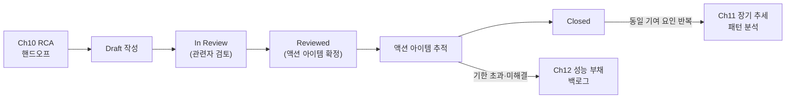

**성능 장애 사후분석(post-mortem)**이란 완화(mitigation)와 근본원인분석까지 끝난 성능 인시던트를, 같은 실수가 반복되지 않도록 문서로 남기고 재발 방지 조치를 끝까지 추적하는 과정을 말합니다. [성능 장애 대응](/post/regression-prevention/performance-incident-response-process/)에서 다룬 triage·완화·RCA는 "지금 이 장애를 어떻게 끝낼 것인가"에 집중하지만, 인시던트가 끝난 직후 그 기억이 가장 생생할 때 아무것도 기록하지 않으면 같은 유형의 회귀가 몇 달 뒤 똑같은 원인으로 재발해도 아무도 "저번에 이거 봤었는데"라고 말할 수 없습니다. 더 흔한 실패는 문서 자체는 쓰지만 "담당자 미정, 기한 없음"인 액션 아이템 목록으로 끝나는 경우인데, 이 장은 그 문서를 **비난 없이(blameless)** 쓰는 이유와, 액션 아이템을 초안 작성에서 완료(closed)까지 추적하는 절차를 다룹니다.

## 이 장을 읽기 전에

이 장은 [성능 장애 대응](/post/regression-prevention/performance-incident-response-process/)에서 이미 triage·완화를 마치고 근본원인분석(RCA)으로 "무엇이 회귀를 일으켰는가"까지 확정했다고 전제합니다. 그 확정된 원인과 인시던트 중 남긴 실시간 기록이 이 장에서 다루는 post-mortem 문서의 재료가 됩니다. [모니터링 대시보드](/post/regression-prevention/performance-monitoring-dashboard-grafana-prometheus/)에서 본 지표 스냅샷은 post-mortem의 타임라인·영향 범위 절에 그대로 인용됩니다.

**이 장의 깊이**: 중급 구간에서 post-mortem을 언제 쓸지 트리거 기준을 정하고, 문서 구조와 액션 아이템 추적 절차를 세우는 것까지 다룹니다. **다루지 않는 것**: triage·완화·에스컬레이션 자체의 실행 절차(→ [성능 장애 대응](/post/regression-prevention/performance-incident-response-process/)), 여러 인시던트가 쌓였을 때의 장기 패턴 분석(→ [장기 추세 분석](/post/regression-prevention/long-term-performance-trend-analysis/)), 완료하지 못한 액션 아이템이 조직의 기술 부채로 굳어졌을 때의 우선순위 운영(→ [성능 부채 관리](/post/regression-prevention/performance-debt-management-strategy/)), 다중 리전·분산 환경에서 post-mortem 범위가 넓어질 때의 복잡성(→ [분산·클러스터 성능 회귀](/post/regression-prevention/distributed-cluster-performance-regression-expert/))입니다.

## 당신의 수준에 맞는 경로

| 수준 | 읽을 부분 | 핵심 목표 |
|------|---------|---------|
| **초보자** | "Blameless Post-mortem의 기원" ~ "Post-mortem 문서 구조" | post-mortem이 왜 필요하고 무엇을 담는지 이해 |
| **중급자** | "비난 없는(Blameless) 분석 문화" ~ "재발 방지: 액션 아이템 추적" | 비난 없이 작성하는 방법과 액션 아이템을 완료까지 추적하는 절차를 실행 |
| **전문가** | "판단 기준" ~ "비판적 시각" | post-mortem 트리거 기준을 조직에 맞게 조정하고, 형식화의 함정을 경계 |

---

## Blameless Post-mortem의 기원 (역사·배경)

"실수를 저지른 사람을 처벌하면 실수가 줄어든다"는 직관은 오래전부터 항공·의료·원자력 같은 고위험 산업에서 틀린 것으로 확인됐습니다. 안전 연구자 **Sidney Dekker**는 이를 "Bad Apple Theory"라고 부르며, 개인을 솎아내는 방식은 사고를 일으킨 시스템적 조건(절차의 모호함, 도구의 결함, 압박이 큰 의사결정 상황)을 그대로 남겨둔 채 다음 사람이 같은 함정에 빠지게 만든다고 지적했습니다. 이 관점을 소프트웨어 엔지니어링에 옮겨온 것은 2012년 5월, 당시 Etsy의 CTO였던 **John Allspaw**가 회사 엔지니어링 블로그에 쓴 글이었습니다. 그는 "실수한 엔지니어가 책임을 면하는 것"이 아니라, 안전과 책임(accountability)의 균형을 맞추는 **Just Culture**를 만드는 것이 목적이라고 밝혔습니다.

> "Having a Just Culture means that you're making effort to balance safety and accountability. It means that by investigating mistakes in a way that focuses on the situational aspects of a failure's mechanism [...] an organization can come out safer than it would normally be if it had simply punished the actors involved as a remediation." — John Allspaw, ["Blameless PostMortems and a Just Culture"](https://www.etsy.com/codeascraft/blameless-postmortems), Etsy Code as Craft (2012)

이 아이디어는 2016년 구글이 출간한 *Site Reliability Engineering*의 "Postmortem Culture" 장에서 업계 표준에 가까운 형태로 정리됩니다. 구글은 post-mortem을 "사건의 영향, 완화·해결을 위한 조치, 근본원인(들), 재발 방지를 위한 후속 조치를 기록한 문서"로 정의하고, 비난 없는 문서란 관련자 전원이 그 순간 가진 정보로 선의를 갖고 행동했다고 가정하는 문서라고 규정합니다.

> "For a postmortem to be truly blameless, it must focus on identifying the contributing causes of the incident without indicting any individual or team for bad or inappropriate behavior." — Betsy Beyer 외, *Site Reliability Engineering* (O'Reilly, 2016), ["Postmortem Culture: Learning from Failure"](https://sre.google/sre-book/postmortem-culture/) 장

성능 회귀 맥락에서 이 역사가 중요한 이유는, 지연이 서서히 나빠지는 회귀는 "누가 그 커밋을 리뷰했는가"를 캐묻기 딱 좋은 소재이기 때문입니다. 리뷰어를 탓하기 시작하면 다음 리뷰어는 통과시키는 대신 방어적으로 모든 PR을 지연시키게 되고, 정작 "왜 이 회귀가 CI 게이트를 통과했는가"라는 시스템 질문은 묻히게 됩니다.

## 언제 Post-mortem을 쓰는가: 트리거 기준

모든 성능 저하마다 정식 post-mortem을 쓰면 문서 작업이 실제 개선보다 커지므로, 트리거 기준을 미리 정해 두어야 합니다. 구글 SRE 책은 사용자에게 보이는 다운타임·데이터 손실·온콜 개입·해결 시간 초과·모니터링 실패라는 다섯 가지 트리거를 제시하는데, 이를 성능 회귀에 맞게 옮기면 아래와 같은 기준이 됩니다.

| 트리거 조건 | 성능 회귀 맥락에서의 의미 |
|------|------|
| 사용자 체감 지연·처리량 저하가 임계 이상 지속 | [알림 전략](/post/regression-prevention/performance-alerting-strategy-design/)의 SLO 위반이 일정 시간 이상 유지됨 |
| 온콜 담당자의 수동 개입(롤백, 기능 플래그 차단) | [성능 장애 대응](/post/regression-prevention/performance-incident-response-process/)에서 완화 조치가 실제로 발동함 |
| 해결까지 걸린 시간이 목표치를 초과 | triage부터 지표 회복까지 SEV별 목표 시간을 넘김 |
| 모니터링이 놓쳐 사람이 먼저 발견 | 알림 임계값 설계의 허점을 드러내는 신호 |
| 동일 유형의 회귀가 반복해서 발생 | [장기 추세 분석](/post/regression-prevention/long-term-performance-trend-analysis/)에서 패턴으로 확인됨 |

이 중 하나라도 해당하면 정식 post-mortem을 쓰고, 어디에도 해당하지 않는 경미한 회귀(PR 게이트에서 걸러졌거나 카나리 단계에서 자동 롤백된 경우)는 인시던트 기록만 남기고 넘어가도 충분합니다. 트리거 기준을 문서화해 두지 않으면 "이 정도면 써야 하나"를 매번 새로 논쟁하게 되고, 결국 아무도 쓰지 않는 쪽으로 기웁니다.

## Post-mortem 문서 구조

post-mortem 문서는 자유 서술이 아니라 정해진 절 구조를 따라야 인시던트마다 다른 사람이 읽어도 필요한 정보를 같은 자리에서 찾을 수 있습니다. 아래는 그 구조를 개념적으로 스케치한 것으로, 실제 문서는 조직의 위키·이슈 트래커 형식에 맞춰 채워야 합니다.

```text
post-mortem: <인시던트 제목>
상태: Draft → In Review → Reviewed → Closed

1. 요약: 무슨 일이 있었고 사용자에게 어떤 영향을 미쳤는가 (2~3문장)
2. 영향 범위: 지속 시간, 영향받은 경로/리전, p50/p95/p99 변화폭, 영향받은 사용자·요청 비율
3. 타임라인: 회귀 유입 시점 → 알림 발생 → triage → 완화 조치 → 지표 회복
   (각 시점마다 근거가 된 대시보드·로그 링크를 남긴다)
4. 기여 요인(contributing factors): 단일 "근본원인"이 아니라 복수로 나열
   예) 벤치마크가 누락된 경로, 리뷰에서 놓친 할당 패턴, 카나리 관찰 시간이 짧았던 점
5. 잘된 점 / 아쉬운 점: 대응 과정에서 효과적이었던 것과 그렇지 않았던 것
6. 액션 아이템: 담당자, 티켓 링크, 기한, 완료까지 추적할 태그
```

**타임라인**과 **기여 요인**을 분리해서 쓰는 이유는, 시간순 사실 기록과 "왜 그랬는가"에 대한 해석을 섞으면 나중에 다시 읽었을 때 무엇이 관찰된 사실이고 무엇이 그 순간의 추측이었는지 구분할 수 없기 때문입니다. **기여 요인을 복수로 표기**하는 것도 의도적인 선택인데, "이 PR이 근본원인이다"라는 단수 서술은 정작 그 PR이 통과할 수 있었던 시스템적 조건(벤치마크 커버리지 공백, 리뷰 체크리스트 누락 등)을 가려버립니다.

문서는 한 번 쓰고 끝나는 것이 아니라 **상태를 가진 산출물**로 관리해야 액션 아이템이 방치되지 않습니다. 아래 다이어그램은 [성능 장애 대응](/post/regression-prevention/performance-incident-response-process/)에서의 핸드오프부터 이 문서의 상태 전이, 그리고 처리되지 못한 항목이 어디로 흘러가는지를 보여줍니다.



## 비난 없는(Blameless) 분석 문화

blameless라는 단어는 "아무도 책임지지 않는다"는 뜻이 아니라, **개인의 실수를 벌하는 대신 그 실수가 가능했던 시스템 조건을 고치는 데 책임을 진다**는 뜻입니다. Allspaw는 이를 두고 엔지니어가 실수의 세부 사항을 안전하게 공유할 수 있을 때, 오히려 재발 방지 조치에 가장 적극적으로 나서게 된다고 설명합니다. 실무에서 이를 지키는 구체적인 장치는 다음과 같습니다.

- **문서 언어에서 이름을 지운다**: "김OO가 잘못된 설정을 배포했다" 대신 "설정 변경이 검증 없이 배포됐다"처럼 행위자가 아니라 행위와 그 행위를 가능하게 한 조건을 주어로 쓴다.
- **사후 확신 편향(hindsight bias)을 경계한다**: 원인이 밝혀진 지금 시점에서 보면 "그때 그걸 놓친 게 이상하다"고 느끼기 쉽지만, 당사자는 그 순간 지금과 다른 정보만 가지고 있었다. Dekker는 이를 "local rationality"라고 부르는데, 당사자의 결정은 그 순간 그가 가진 정보 안에서는 합리적이었다는 뜻입니다. 이 관점 없이 쓰인 post-mortem은 "왜 더 조심하지 않았는가"라는 질문으로 흘러 결국 비난으로 돌아갑니다.
- **작성자와 액션 아이템 담당자를 분리한다**: 문서를 쓰는 사람과 실제로 고치는 사람이 다르면, 문서가 한 사람의 자기 방어가 아니라 팀의 공동 산출물이 됩니다.
- **검토 후 확정한다**: PagerDuty의 post-mortem 가이드는 초안을 관련자와 검토한 뒤에야 액션 아이템을 확정하라고 권합니다. 검토 없이 혼자 쓴 문서는 다른 관점의 기여 요인을 놓치기 쉽습니다.

## 재발 방지: 액션 아이템 추적

post-mortem의 가치는 문서 자체가 아니라 그 문서에서 나온 액션 아이템이 실제로 처리되는지에 있습니다. PagerDuty의 post-mortem 가이드는 액션 아이템을 "동사로 시작하는, 범위가 명확하고 완료 여부를 판단할 수 있는" 형태로 쓰라고 권합니다.

> "Write actionable, specific, and bounded tasks." — [PagerDuty Postmortem Documentation, "Step by Step"](https://postmortems.pagerduty.com/how_to_write/writing/)

각 액션 아이템은 담당자, 이슈 트래커 티켓, 기한, 그리고 해당 인시던트를 식별하는 태그(예: `postmortem-2026-07-perf`)를 가져야 나중에 "이 인시던트에서 나온 조치 중 몇 개가 아직 열려 있는가"를 조회할 수 있습니다. 아래는 GitHub Issues를 이슈 트래커로 쓸 때, 특정 태그가 붙은 액션 아이템 중 기한을 넘긴 항목을 뽑아내는 스크립트입니다. `gh` CLI(GitHub CLI)가 설치·인증되어 있으면 그대로 실행할 수 있습니다.

```bash
#!/usr/bin/env bash
# 요구 사항: GitHub CLI(gh)가 설치·인증되어 있고, 액션 아이템 이슈에
# "postmortem-action" 라벨과 "due:YYYY-MM-DD" 형태의 라벨/필드가 있다고 가정
set -euo pipefail

TODAY=$(date +%Y-%m-%d)

gh issue list --label postmortem-action --state open --json number,title,labels \
  | python3 -c "
import json, sys, datetime
today = datetime.date.fromisoformat('$TODAY')
issues = json.load(sys.stdin)
overdue = []
for it in issues:
    for lb in it['labels']:
        if lb['name'].startswith('due:'):
            due = datetime.date.fromisoformat(lb['name'][4:])
            if due < today:
                overdue.append((it['number'], it['title'], due))
for num, title, due in overdue:
    print(f'#{num} 기한 초과({due}): {title}')
"
```

이 스크립트는 "라벨에 기한을 적어둔다"는 조직 관례에 의존하므로, 실제 도입 시에는 이슈 트래커의 커스텀 필드나 프로젝트 보드 자동화로 대체하는 것이 더 견고합니다. 기한을 넘긴 액션 아이템이 계속 쌓이면, 그 항목을 무기한 방치하는 대신 [성능 부채 관리](/post/regression-prevention/performance-debt-management-strategy/)의 정식 백로그로 옮겨 우선순위와 함께 재평가해야 합니다 — post-mortem 액션 아이템 목록은 부채를 임시로 적어두는 곳이지, 부채를 관리하는 도구는 아닙니다. 같은 기여 요인을 지목하는 post-mortem이 반복해서 나온다면, 그 자체가 [장기 추세 분석](/post/regression-prevention/long-term-performance-trend-analysis/)에서 다뤄야 할 구조적 신호입니다.

## 흔한 오개념

**"blameless하면 아무도 책임지지 않는다"**는 오개념입니다. 개인이 처벌을 면하는 대신, 팀 전체가 그 실수를 가능하게 한 시스템을 고칠 책임을 집니다. Allspaw의 표현대로 엔지니어는 "실수에서 완전히 자유로운" 것이 아니라, 재발 방지에 가장 적극적으로 참여할 책임을 갖게 됩니다.

**"post-mortem은 문서를 발행하면 끝난다"**도 흔한 오개념입니다. 상태가 Draft에서 Reviewed로 바뀐 시점이 아니라, 그 안의 액션 아이템이 Closed가 된 시점이 실제로 끝나는 지점입니다. 발행된 채 방치된 문서는 팀에 "이 절차는 형식일 뿐"이라는 신호만 남깁니다.

**"근본원인은 하나다"**도 경계해야 할 오개념입니다. 복잡한 시스템에서 성능 회귀는 대개 여러 조건(느슨한 리뷰 체크리스트, 벤치마크 커버리지 공백, 짧은 카나리 관찰 시간)이 겹쳐야 발생하며, 그중 하나만 지목하고 문서를 닫으면 나머지 조건은 다음 회귀를 기다리게 됩니다.

## 판단 기준

| 상황 | 권장 | 근거 |
|------|------|------|
| 사용자 체감 SLO 위반이 임계 이상 지속되거나 수동 완화가 발동함 | 정식 post-mortem 작성 | 트리거 기준 충족 |
| PR 게이트·카나리 단계에서 자동으로 걸러짐 | 인시던트 기록만 남기고 생략 | 문서 비용 대비 학습 가치가 낮음 |
| 문서에 특정 인물의 실명·비난성 표현이 남음 | 검토 단계에서 행위 중심 문장으로 수정 | blameless 원칙 위반 |
| 액션 아이템에 담당자·기한이 없음 | 검토 완료 전 반드시 채움 | 추적 불가능한 항목은 사실상 폐기됨 |
| 기한을 넘긴 액션 아이템이 누적됨 | 성능 부채 백로그로 이관해 재평가 | post-mortem 목록은 부채 관리 도구가 아님 |

## 비판적 시각: 한계와 트레이드오프

blameless 문화는 선언만으로 만들어지지 않습니다. 관리자가 인사평가에 post-mortem 내용을 참고하는 순간, 엔지니어들은 자신에게 불리할 수 있는 세부 사항을 빼고 쓰기 시작하고, 문서는 조용히 부정확해집니다. 또한 post-mortem이 늘어나면 조직은 "쓰는 것 자체"를 의례로 소비하기 쉬운데, 검토도 없이 템플릿 칸만 채운 문서는 안전 문화의 증거가 아니라 관료적 절차의 흔적일 뿐입니다. 액션 아이템 추적도 마찬가지로, 추적 시스템을 만들어 두는 것과 그 시스템이 실제로 사람을 움직이는 것은 다른 문제입니다 — 결국 액션 아이템에 우선순위와 예산을 배정하는 조직적 의지가 없으면 추적 도구는 미완료 항목의 무덤이 됩니다. 이 장에서 다룬 절차는 단일 팀·단일 인시던트 단위를 전제로 하며, 여러 팀·여러 리전에 걸친 회귀의 post-mortem은 기여 요인을 어느 팀 문서에 귀속시킬지부터 복잡해지므로 [분산·클러스터 성능 회귀](/post/regression-prevention/distributed-cluster-performance-regression-expert/)의 맥락과 함께 다뤄야 합니다.

## 마무리

- [ ] post-mortem 트리거 기준을 자신의 조직 SLO·완화 정책에 맞게 구체화할 수 있는가?
- [ ] 타임라인과 기여 요인을 분리해서 쓰고, 근본원인을 단수가 아닌 복수로 서술할 수 있는가?
- [ ] blameless가 "무책임"이 아니라 "개인 대신 시스템을 고치는 책임"이라는 것을 설명할 수 있는가?
- [ ] 사후 확신 편향을 경계하며 당사자의 그 순간 정보 상태로 서술을 쓸 수 있는가?
- [ ] 액션 아이템에 담당자·티켓·기한을 채우고, 완료까지 추적하는 절차를 세울 수 있는가?
- [ ] 기한을 넘긴 액션 아이템을 성능 부채 백로그로 이관하는 기준을 판단할 수 있는가?

이 장으로 이 트랙의 커리큘럼을 마칩니다. **이전 장**: [모니터링 대시보드](/post/regression-prevention/performance-monitoring-dashboard-grafana-prometheus/)에서 지표를 눈으로 확인하는 체계를 다뤘다면, 이 장은 그 체계가 알림을 울리고 인시던트가 종료된 뒤 무엇을 남겨야 하는지를 다뤘습니다. 트랙 전체의 범위와 각 챕터가 맞물리는 방식은 [트랙 인트로](/post/regression-prevention/getting-started-performance-regression-prevention-strategies/)에서 다시 확인할 수 있고, 12개 트랙 전체의 로드맵은 [Low-latency 최적화 시리즈 개요](/post/low-latency-optimization-series/getting-started-low-latency-optimization-series-overview/)를 참고하세요.
