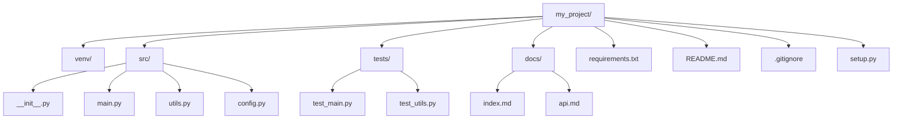

# 챕터 1: 파이썬 환경 설정

> "좋은 시작이 반이다" - 파이썬 개발 환경을 제대로 구축하면 이후 모든 학습이 수월해집니다.

## 학습 목표
- 파이썬을 시스템에 설치하고 설정할 수 있다
- 다양한 운영체제에서 파이썬 환경을 구축할 수 있다
- 가상 환경을 이해하고 활용할 수 있다
- 개발 도구들을 효과적으로 사용할 수 있다

## 핵심 개념(이론)

### 1) “설치”보다 중요한 건 “재현 가능한 환경”이다
환경 설정의 목표는 단순히 파이썬을 실행하는 것이 아니라, **언제/어디서나 동일하게 설치 가능한 상태**를 만드는 것입니다.
프로젝트가 커질수록 “내 PC에서는 되는데요?” 문제가 비용을 폭발시킵니다.

### 2) 가상환경은 ‘선택’이 아니라 ‘기본 안전장치’다
프로젝트마다 의존성 버전이 다르기 때문에, 가상환경이 없으면 충돌이 필연적으로 발생합니다.
가상환경은 패키지를 격리해 충돌을 줄이고, 배포/CI에서도 동일 환경을 재현하기 쉽게 합니다.

### 3) 패키지 관리의 핵심은 “범위와 고정”의 균형이다
학습/개발에서는 최신을 쓰고 싶지만, 운영에서는 재현성이 필요합니다.
따라서 “범위(>=)”와 “고정(lock)”을 목적에 따라 구분하는 습관이 중요합니다.

### 4) 도구(IDE/포매터/린터)는 품질과 속도를 동시에 올린다
초반에 도구 설정이 번거롭게 느껴져도, 코드가 늘어날수록 자동화의 이득이 누적됩니다.
특히 포매팅/린트/테스트 실행을 습관화하면 실수를 줄이고 학습 속도를 올립니다.

## 선택 기준(Decision Guide)
- **단일 프로젝트**도 venv는 쓰는 것이 기본(충돌 예방).
- **팀/운영**이 들어가면: `pyproject.toml` 기반과 CI(테스트/린트)까지 초기에 설계.

## 흔한 오해/주의점
- PATH/인터프리터가 여러 개일 때, “실행되는 파이썬”과 “pip가 설치하는 파이썬”이 다를 수 있습니다.
- OS별 차이는 파일 경로/권한/인코딩에서 자주 터집니다. 초기에 습관을 잡아두세요.

## 요약
- 목표는 설치가 아니라 재현 가능한 개발 환경이다.
- 가상환경은 필수이며, 의존성은 목적에 따라 범위/고정으로 관리한다.

## 파이썬 설치 가이드

### 운영체제별 설치 방법

#### Windows 설치

**방법 1: 공식 웹사이트에서 설치 (권장)**

1. [python.org](https://python.org) 접속
2. 최신 안정 버전 다운로드 (Python 3.11+ 권장)
3. 설치 시 **"Add Python to PATH"** 체크박스 반드시 선택
4. "Install Now" 클릭

```powershell
# 설치 확인
python --version
# 또는
python -V

# pip 확인
pip --version
```

**방법 2: Microsoft Store (초보자용)**
1. Microsoft Store 열기
2. "Python"으로 검색
3. Python 3.x 설치

**방법 3: Anaconda (데이터 과학용)**
1. [anaconda.com](https://anaconda.com) 접속
2. Individual Edition 다운로드
3. 설치 후 Anaconda Navigator 실행

#### macOS 설치

**방법 1: Homebrew (권장)**

```bash
# Homebrew 설치 (없는 경우)
/bin/bash -c "$(curl -fsSL https://raw.githubusercontent.com/Homebrew/install/HEAD/install.sh)"

# Python 설치
brew install python

# 설치 확인
python3 --version
pip3 --version
```

**방법 2: pyenv (버전 관리용)**

```bash
# pyenv 설치
brew install pyenv

# 원하는 Python 버전 설치
pyenv install 3.11.0
pyenv global 3.11.0

# shell 설정 (.zshrc 또는 .bash_profile)
echo 'export PATH="$HOME/.pyenv/bin:$PATH"' >> ~/.zshrc
echo 'eval "$(pyenv init -)"' >> ~/.zshrc
```

#### Linux 설치

**Ubuntu/Debian:**

```bash
# 시스템 업데이트
sudo apt update

# Python 설치
sudo apt install python3 python3-pip python3-venv

# 개발 도구 설치
sudo apt install python3-dev build-essential
```

**CentOS/RHEL:**

```bash
# Python 설치
sudo dnf install python3 python3-pip

# 또는 yum (구버전)
sudo yum install python3 python3-pip
```

### 설치 확인 및 기본 테스트

설치가 완료되면 다음 명령어로 확인하세요:

```bash
# Python 버전 확인
python --version
# 또는 macOS/Linux에서
python3 --version

# pip 버전 확인
pip --version
# 또는 macOS/Linux에서
pip3 --version

# Python 인터프리터 실행
python
# 또는
python3
```

**첫 번째 Python 코드 실행:**

```python
# Python 인터프리터에서
print("Hello, Python!")
print("환경 설정 완료!")

# 종료하려면
exit()
# 또는 Ctrl+D (macOS/Linux), Ctrl+Z (Windows)
```

## 가상 환경 완전 가이드

### 가상 환경이 필요한 이유

**가상 환경의 장점:**
- 🔒 **의존성 격리**: 프로젝트별 독립적인 패키지 관리
- 🔄 **버전 충돌 방지**: 다른 프로젝트 간 라이브러리 버전 충돌 없음
- 🧹 **깔끔한 환경**: 시스템 Python 환경을 깨끗하게 유지
- 📦 **재현 가능성**: 동일한 환경을 다른 곳에서 재현 가능

### venv로 가상 환경 만들기 (권장)

**기본 사용법:**

```bash
# 가상 환경 생성
python -m venv myproject_env

# Windows에서 활성화
myproject_env\Scripts\activate

# macOS/Linux에서 활성화
source myproject_env/bin/activate

# 활성화 확인 (프롬프트에 (myproject_env) 표시됨)
which python
# 또는
python --version

# 비활성화
deactivate
```

**실전 예제 - 웹 프로젝트 환경 구축:**

```bash
# 1. 프로젝트 디렉토리 생성
mkdir my_web_project
cd my_web_project

# 2. 가상 환경 생성
python -m venv venv

# 3. 가상 환경 활성화
# Windows
venv\Scripts\activate
# macOS/Linux
source venv/bin/activate

# 4. 필요한 패키지 설치
pip install flask requests beautifulsoup4

# 5. requirements.txt 생성
pip freeze > requirements.txt

# 6. requirements.txt 내용 확인
cat requirements.txt

# 7. .gitignore 파일 생성
echo "venv/" > .gitignore
echo "__pycache__/" >> .gitignore
echo "*.pyc" >> .gitignore
echo ".env" >> .gitignore

# 8. README.md 파일 생성
cat > README.md << 'EOF'
# Python Learning Project

## 설치 방법

1. 가상 환경 생성:
   ```bash
   python -m venv venv
   ```

2. 가상 환경 활성화:
   - Windows: `venv\Scripts\activate`
   - macOS/Linux: `source venv/bin/activate`

3. 의존성 설치:
   ```bash
   pip install -r requirements.txt
   ```

## 사용법

메인 스크립트 실행:
```bash
python src/main.py
```
EOF

echo "개발 환경 구축 완료!"
```

### 다른 가상 환경 도구들

#### virtualenv (고급 기능)

```bash
# 설치
pip install virtualenv

# 가상 환경 생성
virtualenv myproject_env

# 특정 Python 버전 지정
virtualenv -p python3.11 myproject_env
```

#### conda (데이터 과학용)

```bash
# 가상 환경 생성
conda create -n myproject python=3.11

# 활성화
conda activate myproject

# 패키지 설치
conda install numpy pandas matplotlib

# 비활성화
conda deactivate
```

#### pipenv (모던한 접근)

```bash
# 설치
pip install pipenv

# 프로젝트 초기화
pipenv install

# 패키지 설치
pipenv install requests flask

# 가상 환경 실행
pipenv shell

# 의존성 확인
pipenv graph
```

## 개발 도구 설정

### 코드 에디터 선택과 설정

#### VS Code (무료, 권장)

**설치 및 기본 설정:**

1. [code.visualstudio.com](https://code.visualstudio.com) 에서 다운로드
2. 필수 확장 프로그램 설치:

```json
// 추천 확장 프로그램
{
  "recommendations": [
    "ms-python.python",           // Python 지원
    "ms-python.autopep8",         // 코드 포매팅
    "ms-python.pylint",           // 코드 검사
    "ms-toolsai.jupyter",         // Jupyter 지원
    "ms-vscode.vscode-json",      // JSON 지원
    "formulahendry.code-runner"   // 코드 실행
  ]
}
```

**VS Code 설정 (settings.json):**

```json
{
    "python.defaultInterpreterPath": "./venv/bin/python",
    "python.formatting.provider": "autopep8",
    "python.linting.enabled": true,
    "python.linting.pylintEnabled": true,
    "files.autoSave": "afterDelay",
    "files.autoSaveDelay": 1000,
    "editor.fontSize": 14,
    "editor.tabSize": 4,
    "editor.insertSpaces": true
}
```

#### PyCharm (전문가용)

**Community Edition (무료):**
- [jetbrains.com/pycharm](https://jetbrains.com/pycharm) 다운로드
- 가상 환경 자동 감지
- 강력한 디버깅 도구
- 코드 완성과 리팩토링

**주요 설정:**
1. File → Settings → Project → Python Interpreter
2. 가상 환경 경로 설정
3. Code Style → Python → PEP 8 적용

### Jupyter Notebook 설정

**설치 및 실행:**

```bash
# 가상 환경에서 설치
pip install jupyter notebook

# 또는 JupyterLab (더 현대적)
pip install jupyterlab

# Jupyter Notebook 실행
jupyter notebook

# JupyterLab 실행
jupyter lab
```

**유용한 확장 프로그램:**

```bash
# nbextensions 설치 (Notebook용)
pip install jupyter_contrib_nbextensions
jupyter contrib nbextension install --user

# 유용한 확장 프로그램들
# - Table of Contents: 목차 생성
# - Variable Inspector: 변수 상태 확인
# - Code Folding: 코드 접기
```

### 터미널 및 셸 설정

#### Windows PowerShell 설정

```powershell
# 실행 정책 설정 (가상 환경 활성화를 위해)
Set-ExecutionPolicy -ExecutionPolicy RemoteSigned -Scope CurrentUser

# Windows Terminal 설치 (Microsoft Store에서)
# 더 나은 터미널 경험 제공
```

#### macOS/Linux 셸 설정

```bash
# Oh My Zsh 설치 (선택사항)
sh -c "$(curl -fsSL https://raw.github.com/ohmyzsh/ohmyzsh/master/tools/install.sh)"

# Python 관련 별칭 추가 (.zshrc 또는 .bashrc)
echo 'alias python=python3' >> ~/.zshrc
echo 'alias pip=pip3' >> ~/.zshrc
```

## 패키지 관리 마스터하기

### pip 고급 사용법

```bash
# 패키지 검색
pip search requests

# 패키지 정보 확인
pip show requests

# 설치된 패키지 목록
pip list

# 업그레이드 가능한 패키지 확인
pip list --outdated

# 패키지 업그레이드
pip install --upgrade requests

# 특정 버전 설치
pip install requests==2.28.1

# 범위 지정 설치
pip install 'requests>=2.25.0,<3.0.0'

# requirements.txt에서 설치
pip install -r requirements.txt

# 패키지 제거
pip uninstall requests
```

### requirements.txt 관리

**기본 requirements.txt:**

```txt
# requirements.txt
requests==2.28.1
flask==2.2.2
beautifulsoup4==4.11.1
pandas>=1.5.0
numpy>=1.23.0
matplotlib>=3.6.0
```

**개발용 requirements-dev.txt:**

```txt
# requirements-dev.txt
# 기본 패키지들
-r requirements.txt

# 개발 도구들
pytest==7.2.0
black==22.10.0
flake8==5.0.4
mypy==0.991
jupyter==1.0.0
```

### 프로젝트 구조 베스트 프랙티스



## 핵심 내용

### 파이썬 설치
- **Windows**: Microsoft Store, python.org, Anaconda
- **macOS**: Homebrew, python.org, pyenv
- **Linux**: 패키지 매니저, 소스 컴파일
- 버전 관리 전략 (Python 2 vs 3, LTS 버전 선택)

### 개발 환경 구축
- **IDE 선택**: PyCharm, VS Code, Sublime Text
- **텍스트 에디터**: Vim, Emacs, Nano
- **Jupyter Notebook/Lab**: 데이터 분석과 프로토타이핑
- **설정 최적화**: 인코딩, 경로 설정, 환경 변수

### 가상 환경 관리
- **venv**: 표준 라이브러리 활용
- **virtualenv**: 고급 기능 활용
- **conda**: 패키지와 환경 통합 관리
- **pipenv**: 의존성 관리 개선
- **poetry**: 현대적 의존성 관리

### 패키지 관리
- **pip**: 기본 패키지 관리자
- **requirements.txt**: 의존성 명세
- **setup.py**: 패키지 배포 준비
- **pyproject.toml**: 현대적 프로젝트 설정

## 실습 프로젝트

###️ 프로젝트 1: 개발 환경 완전 구축

**목표:** 실제 프로젝트에서 사용할 수 있는 완전한 개발 환경 구축

**단계별 진행:**

```bash
# 1. 프로젝트 디렉토리 생성
mkdir python_learning_project
cd python_learning_project

# 2. 가상 환경 생성 및 활성화
python -m venv venv
# Windows: venv\Scripts\activate
# macOS/Linux: source venv/bin/activate

# 3. 기본 디렉토리 구조 생성
mkdir src tests docs

# 4. 초기 파일들 생성
touch src/__init__.py
touch src/main.py
touch src/utils.py
touch tests/test_main.py
touch README.md
touch requirements.txt
touch .gitignore

# 5. 개발 도구 설치
pip install pytest black flake8 mypy

# 6. requirements.txt 업데이트
pip freeze > requirements.txt
```

**main.py 예시 코드:**

```python
# src/main.py
"""
Python 학습 프로젝트 메인 모듈
"""

def greet(name: str = "World") -> str:
    """인사말을 반환하는 함수
    
    Args:
        name: 인사할 대상의 이름
        
    Returns:
        인사말 문자열
    """
    return f"Hello, {name}!"

def main():
    """메인 함수"""
    print(greet("Python Learner"))
    print("환경 설정이 완료되었습니다!")

if __name__ == "__main__":
    main()
```

**테스트 코드 예시:**

```python
# tests/test_main.py
"""
main.py 모듈 테스트
"""

import sys
import os

# src 디렉토리를 Python 경로에 추가
sys.path.insert(0, os.path.abspath(os.path.join(os.path.dirname(__file__), '..', 'src')))

from main import greet

def test_greet_default():
    """기본 인사말 테스트"""
    result = greet()
    assert result == "Hello, World!"

def test_greet_with_name():
    """이름이 있는 인사말 테스트"""
    result = greet("Alice")
    assert result == "Hello, Alice!"

def test_greet_empty_string():
    """빈 문자열 테스트"""
    result = greet("")
    assert result == "Hello, !"
```

###️ 프로젝트 2: 다중 환경 관리

**목표:** 여러 프로젝트를 위한 독립적인 환경 구성

```bash
# 웹 개발 환경
mkdir web_project
cd web_project
python -m venv venv
source venv/bin/activate  # 또는 Windows: venv\Scripts\activate
pip install flask django fastapi
pip freeze > requirements.txt
deactivate

# 데이터 분석 환경
mkdir data_project
cd data_project
python -m venv venv
source venv/bin/activate
pip install pandas numpy matplotlib jupyter
pip freeze > requirements.txt
deactivate

# AI/ML 환경
mkdir ml_project
cd ml_project
python -m venv venv
source venv/bin/activate
pip install tensorflow scikit-learn pytorch
pip freeze > requirements.txt
deactivate
```

###️ 프로젝트 3: VS Code 완전 설정

**workspace 설정 파일 (.vscode/settings.json):**

```json
{
    "python.pythonPath": "./venv/bin/python",
    "python.linting.enabled": true,
    "python.linting.pylintEnabled": true,
    "python.linting.flake8Enabled": true,
    "python.formatting.provider": "black",
    "python.testing.pytestEnabled": true,
    "python.testing.pytestArgs": ["tests"],
    "files.associations": {
        "*.py": "python"
    },
    "editor.formatOnSave": true,
    "editor.codeActionsOnSave": {
        "source.organizeImports": true
    }
}
```

## 문제 해결 가이드

### 자주 발생하는 문제들

#### "python: command not found"

**원인:** Python이 PATH에 추가되지 않음

**해결방법:**

```bash
# Windows
# 시스템 → 고급 시스템 설정 → 환경 변수 → PATH에 Python 경로 추가

# macOS/Linux
echo 'export PATH="/usr/local/bin/python3:$PATH"' >> ~/.bashrc
source ~/.bashrc
```

#### 가상 환경 활성화 실패 (Windows)

**원인:** PowerShell 실행 정책

**해결방법:**

```powershell
Set-ExecutionPolicy -ExecutionPolicy RemoteSigned -Scope CurrentUser
```

#### pip 설치 실패

**원인:** 권한 부족 또는 네트워크 문제

**해결방법:**

```bash
# 사용자 레벨 설치
pip install --user package_name

# 프록시 환경에서
pip install --proxy http://proxy.company.com:port package_name

# 캐시 무시
pip install --no-cache-dir package_name
```

#### 가상 환경에서 패키지를 찾을 수 없음

**원인:** 잘못된 Python 인터프리터 사용

**해결방법:**

```bash
# 현재 Python 경로 확인
which python
# 또는
python -c "import sys; print(sys.executable)"

# 가상 환경이 활성화되었는지 확인
echo $VIRTUAL_ENV
```

## 성능 최적화 팁

### pip 설치 속도 향상

```bash
# pip 업그레이드
python -m pip install --upgrade pip

# 미러 서버 사용 (한국)
pip install -i https://pypi.python.org/simple/ package_name

# 병렬 다운로드 활성화
pip install --upgrade pip setuptools wheel
```

### 개발 도구 자동화

**Makefile 예시:**

```makefile
# Makefile
.PHONY: install test format lint clean

install:
	pip install -r requirements.txt
	pip install -r requirements-dev.txt

test:
	pytest tests/

format:
	black src/ tests/

lint:
	flake8 src/ tests/
	mypy src/

clean:
	find . -type d -name "__pycache__" -delete
	find . -name "*.pyc" -delete
```

**실행:**

```bash
make install  # 의존성 설치
make test     # 테스트 실행
make format   # 코드 포매팅
make lint     # 코드 검사
make clean    # 캐시 정리
```

## 체크리스트

### 기본 설치
- [ ] Python 3.8+ 설치 완료
- [ ] pip 설치 및 업그레이드 완료
- [ ] PATH 환경 변수 설정 완료
- [ ] `python --version` 명령어 정상 작동

### 가상 환경
- [ ] venv로 가상 환경 생성 완료
- [ ] 가상 환경 활성화/비활성화 가능
- [ ] requirements.txt 생성 및 사용 가능
- [ ] 프로젝트별 독립 환경 구축 완료

### 개발 도구
- [ ] VS Code 또는 PyCharm 설치 완료
- [ ] Python 확장 프로그램 설치 완료
- [ ] 코드 에디터에서 Python 인터프리터 설정 완료
- [ ] 기본적인 코드 작성 및 실행 가능

### 프로젝트 구조
- [ ] 표준 프로젝트 디렉토리 구조 이해
- [ ] .gitignore 파일 작성 완료
- [ ] README.md 파일 작성 완료
- [ ] 기본 테스트 코드 작성 가능

### 고급 기능
- [ ] Jupyter Notebook 설치 및 실행 가능
- [ ] 코드 포매팅 도구 (black) 사용 가능
- [ ] 코드 검사 도구 (flake8, pylint) 사용 가능
- [ ] 기본적인 디버깅 가능

## 다음 단계

🎉 **축하합니다!** 파이썬 개발 환경 구축을 완료했습니다.

이제 [02. 파이썬 기본 문법](../02_basic_syntax/)으로 넘어가서 파이썬의 기본 문법과 데이터 타입을 학습해봅시다.

**학습 완료 후 확인사항:**
- 가상 환경에서 간단한 Python 코드 실행
- 패키지 설치 및 관리
- 코드 에디터에서 Python 개발

---

💡 **팁:** 환경 설정은 한 번만 제대로 해두면 이후 모든 학습이 수월해집니다. 문제가 발생하면 위의 문제 해결 가이드를 참고하세요! 
