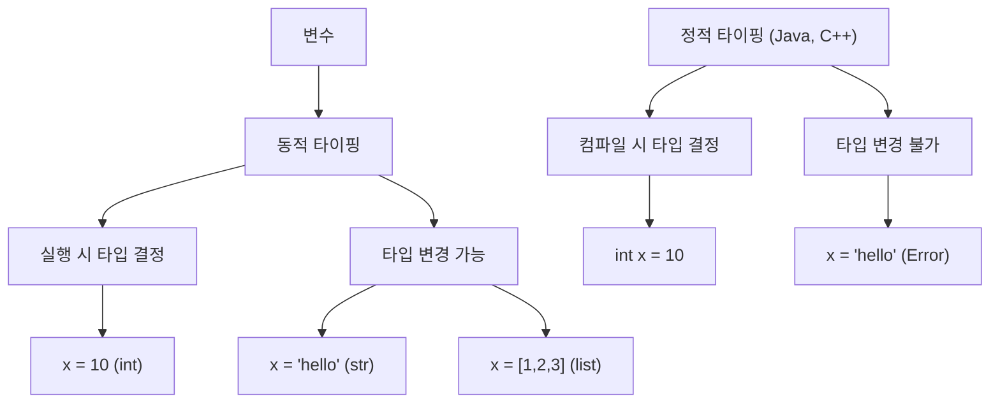
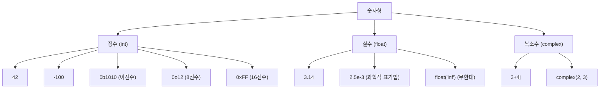

# 챕터 2: 파이썬 기본 문법

> "문법은 언어의 뼈대다" - 파이썬의 기본 문법을 탄탄하게 다지면 모든 고급 기능을 쉽게 이해할 수 있습니다.

## 학습 목표
- 파이썬의 기본 문법을 이해하고 활용할 수 있다
- 다양한 데이터 타입의 특성을 파악할 수 있다
- 변수와 연산자를 적절히 사용할 수 있다
- 파이썬다운 코드(Pythonic)의 기초를 이해할 수 있다

## 핵심 개념(이론)

### 1) 변수는 ‘상자’가 아니라 ‘객체 참조’다
파이썬 변수는 값을 담는 상자가 아니라, **객체를 가리키는 이름(레퍼런스)**입니다.
그래서 대입은 “복사”가 아니라 “참조 연결”이 기본이며, 이 차이가 버그(특히 가변 객체)로 이어집니다.

### 2) 타입 시스템: 동적 타이핑 + 강한 타입(Strong typing)
동적 타이핑은 실행 시점에 타입이 결정된다는 뜻이지, 아무 타입으로 자동 변환해준다는 뜻이 아닙니다.
파이썬은 강한 타입이라 `"1" + 1` 같은 것은 자동으로 맞춰주지 않고 오류가 납니다.

### 3) 연산자/우선순위는 ‘외우기’보다 ‘명확하게 쓰기’가 중요하다
우선순위는 실수를 유발합니다. “헷갈리면 괄호”가 가독성과 안정성을 높입니다.
특히 `is`(정체성)와 `==`(동등성)을 섞으면 버그가 납니다.

### 4) I/O는 실패를 기본으로 설계한다
입력은 항상 잘못될 수 있고, 파일은 항상 없을 수 있습니다.
따라서 타입 변환, 예외 처리, 인코딩을 기본 전제로 두고 코드를 짜는 습관이 중요합니다.

### 5) “파이썬답게(Pythonic)”는 짧게 쓰는 게 아니라 읽기 쉽게 쓰는 것이다
한 줄로 줄이는 것이 목적이 아니라, **의도가 드러나는 코드**가 목적입니다.
가독성이 떨어지는 축약(과한 삼항/중첩 컴프리헨션)은 유지보수 비용을 올립니다.

## 선택 기준(Decision Guide)
- 데이터 변환은 `int()/float()` 같은 명시적 변환을 우선.
- `is`는 **None 비교**에만 우선적으로 사용.
- 입력/파일 I/O는 항상 예외를 염두에 두고 최소한의 검증을 넣기.

## 흔한 오해/주의점
- `eval()`은 편리하지만 보안 위험이 매우 큽니다(입력 섞이면 즉시 취약점).
- “동적 타이핑 = 안전하지 않다”는 오해가 있습니다. 타입 힌트/테스트로 충분히 안정성을 확보할 수 있습니다.

## 요약
- 변수는 참조이며, 동적 타이핑과 강한 타입을 구분한다.
- 우선순위/비교는 명확성을 우선하고, I/O는 실패를 기본으로 설계한다.

## 변수와 식별자

### 변수의 기본 개념

파이썬에서 변수는 값을 저장하는 컨테이너입니다. 변수 선언과 동시에 값을 할당해야 합니다.

```python
# 변수 선언과 할당
name = "Alice"      # 문자열
age = 25           # 정수
height = 165.5     # 실수
is_student = True  # 불린

# 여러 변수 동시 할당
x, y, z = 1, 2, 3
a = b = c = 0      # 같은 값으로 초기화

# 변수 값 교환 (Pythonic!)
x, y = y, x
print(f"x: {x}, y: {y}")  # x: 2, y: 1
```

### 변수 명명 규칙

**✅ 올바른 변수명:**

```python
# 스네이크 케이스 (권장)
user_name = "Alice"
total_score = 100
is_valid = True

# 숫자 포함 (첫 글자 제외)
data1 = "first"
user_2 = "second"

# 언더스코어로 시작 (특별한 용도)
_private_var = "internal use"
__special_var = "very special"
```

**❌ 잘못된 변수명:**

```python
# 예약어 사용 (Error)
# class = "MyClass"  # SyntaxError
# if = 10           # SyntaxError

# 숫자로 시작 (Error)
# 1st_name = "Alice"  # SyntaxError

# 특수문자 사용 (Error)
# user-name = "Alice"   # SyntaxError
# user@email = "test"   # SyntaxError
```

### 동적 타이핑 이해하기



**동적 타이핑 예제:**

```python
# 동적 타이핑의 장점
value = 42          # int 타입
print(type(value))  # <class 'int'>

value = "Hello"     # str 타입으로 변경
print(type(value))  # <class 'str'>

value = [1, 2, 3]   # list 타입으로 변경
print(type(value))  # <class 'list'>

# 타입 힌트 (선택사항, Python 3.5+)
from typing import List, Union

def process_data(data: Union[int, str]) -> str:
    """타입 힌트를 사용한 함수"""
    return str(data)

# 변수 타입 확인
def check_type(var):
    print(f"값: {var}, 타입: {type(var).__name__}")

check_type(42)        # 값: 42, 타입: int
check_type("Hello")   # 값: Hello, 타입: str
check_type(3.14)      # 값: 3.14, 타입: float
```

## 핵심 내용

### 변수와 식별자
- **변수 명명 규칙**: snake_case, 예약어 회피
- **동적 타이핑**: 타입 추론과 변수 재할당
- **메모리 관리**: 객체 참조와 가비지 컬렉션
- **전역/지역 변수**: 스코프 이해

### 기본 데이터 타입
- **숫자형**: int, float, complex
- **문자열**: str, 인코딩, 포매팅
- **불린형**: bool, 논리 연산
- **None**: 특수한 값과 활용법

### 연산자
- **산술 연산자**: +, -, *, /, //, %, **
- **비교 연산자**: ==, !=, <, >, <=, >=
- **논리 연산자**: and, or, not
- **멤버십 연산자**: in, not in
- **신원 연산자**: is, is not

### 입출력
- **print() 함수**: 출력 형식화, 구분자, 종결자
- **input() 함수**: 사용자 입력 처리
- **문자열 포매팅**: %, .format(), f-string

### 주석과 독스트링
- **한 줄 주석**: # 활용법
- **여러 줄 주석**: """ 또는 '''
- **독스트링**: 함수/클래스 문서화
- **주석 작성 원칙**: 코드 설명의 모범 사례

## 실습 프로젝트
1. 계산기 프로그램 (기본 연산)
2. 사용자 정보 입력 및 출력 프로그램
3. 문자열 조작 도구

## 체크리스트
- [ ] 변수 선언과 할당 이해
- [ ] 기본 데이터 타입 구분
- [ ] 연산자 우선순위 파악
- [ ] 입출력 함수 활용
- [ ] 주석 작성 습관 형성

## 다음 단계
기본 문법을 이해했다면, 조건문과 반복문을 활용한 제어 구조를 학습합니다. 

## 기본 데이터 타입

### 숫자형 (Numeric Types)



**정수형 (int):**

```python
# 기본 정수
age = 25
negative = -100
zero = 0

# 다양한 진법 표현
binary = 0b1010      # 이진수 (10진수: 10)
octal = 0o12         # 8진수 (10진수: 10)
hexadecimal = 0xFF   # 16진수 (10진수: 255)

print(f"이진수 {binary}: {bin(binary)}")
print(f"8진수 {octal}: {oct(octal)}")  
print(f"16진수 {hexadecimal}: {hex(hexadecimal)}")

# 큰 수 처리 (파이썬은 임의 정밀도 지원)
big_number = 123456789012345678901234567890
print(f"큰 수: {big_number}")
print(f"타입: {type(big_number)}")

# 언더스코어로 가독성 향상 (Python 3.6+)
million = 1_000_000
billion = 1_000_000_000
print(f"백만: {million}, 십억: {billion}")
```

**실수형 (float):**

```python
# 기본 실수
pi = 3.14159
temperature = -2.5
zero_float = 0.0

# 과학적 표기법
light_speed = 2.998e8    # 2.998 × 10^8
planck = 6.626e-34       # 6.626 × 10^-34

# 특수 값들
infinity = float('inf')      # 무한대
negative_inf = float('-inf') # 음의 무한대
not_a_number = float('nan')  # NaN (Not a Number)

print(f"무한대: {infinity}")
print(f"음의 무한대: {negative_inf}")
print(f"NaN: {not_a_number}")

# 무한대와 NaN 확인
import math
print(f"무한대 확인: {math.isinf(infinity)}")
print(f"NaN 확인: {math.isnan(not_a_number)}")

# 실수 정밀도 문제
print(0.1 + 0.2)  # 0.30000000000000004 (부동소수점 오차)

# 정밀도 문제 해결
from decimal import Decimal
result = Decimal('0.1') + Decimal('0.2')
print(f"정확한 계산: {result}")  # 0.3
```

**복소수형 (complex):**

```python
# 복소수 생성
z1 = 3 + 4j
z2 = complex(2, 5)  # 2 + 5j
z3 = complex(1)     # 1 + 0j

# 복소수 속성
print(f"실수부: {z1.real}")    # 3.0
print(f"허수부: {z1.imag}")    # 4.0
print(f"켤레복소수: {z1.conjugate()}")  # (3-4j)

# 복소수 연산
print(f"덧셈: {z1 + z2}")      # (5+9j)
print(f"곱셈: {z1 * z2}")      # (-14+23j)

# 절댓값 (크기)
import cmath
magnitude = abs(z1)
print(f"절댓값: {magnitude}")   # 5.0
```

### 문자열 (String)

```python
# 문자열 생성 방법들
single_quote = 'Hello'
double_quote = "World"
triple_quote = """여러 줄
문자열을 작성할 때
사용합니다."""

# 문자열 안에 따옴표 포함
quote_in_string = "He said, 'Hello!'"
quote_in_string2 = 'She replied, "Hi there!"'

# 이스케이프 문자
escaped = "첫 번째 줄\n두 번째 줄\t탭 문자"
raw_string = r"C:\Users\name\Documents"  # raw 문자열

print(escaped)
print(raw_string)

# 문자열 인덱싱과 슬라이싱
text = "Python Programming"
print(f"첫 글자: {text[0]}")        # P
print(f"마지막 글자: {text[-1]}")     # g
print(f"처음 6글자: {text[:6]}")     # Python
print(f"7번째부터: {text[7:]}")      # Programming
print(f"역순: {text[::-1]}")         # gnimmargorP nohtyP

# 문자열 메서드들
name = "  Alice Bob  "
print(f"길이: {len(name)}")           # 12
print(f"대문자: {name.upper()}")       # "  ALICE BOB  "
print(f"소문자: {name.lower()}")       # "  alice bob  "
print(f"공백 제거: '{name.strip()}'")  # "Alice Bob"
print(f"치환: {name.replace('Alice', 'Charlie')}")

# 문자열 분할과 결합
sentence = "apple,banana,cherry"
fruits = sentence.split(',')
print(f"분할: {fruits}")             # ['apple', 'banana', 'cherry']

joined = " | ".join(fruits)
print(f"결합: {joined}")             # apple | banana | cherry
```

### 불린형 (Boolean)

```python
# 불린 값
is_true = True
is_false = False

# 불린 변환
print(bool(1))      # True
print(bool(0))      # False
print(bool(""))     # False (빈 문자열)
print(bool("text")) # True
print(bool([]))     # False (빈 리스트)
print(bool([1]))    # True

# Falsy 값들 (False로 평가되는 값들)
falsy_values = [
    False, 0, 0.0, 0j,    # 불린/숫자 Falsy
    "", [], {}, set(),    # 빈 컨테이너들
    None                  # None 값
]

for value in falsy_values:
    print(f"{repr(value)}: {bool(value)}")

# 논리 연산
a, b = True, False
print(f"AND: {a and b}")    # False
print(f"OR: {a or b}")      # True  
print(f"NOT: {not a}")      # False

# 단축 평가 (Short-circuit evaluation)
def get_value():
    print("함수 호출됨")
    return True

result = False and get_value()  # get_value() 호출되지 않음
print(f"결과: {result}")

result2 = True or get_value()   # get_value() 호출되지 않음
print(f"결과2: {result2}")
```

### None 타입

```python
# None 값
empty = None
print(f"None의 타입: {type(empty)}")  # <class 'NoneType'>

# None 확인
if empty is None:
    print("값이 없습니다")

# None을 기본값으로 사용
def greet(name=None):
    if name is None:
        return "안녕하세요!"
    return f"안녕하세요, {name}님!"

print(greet())        # 안녕하세요!
print(greet("Alice")) # 안녕하세요, Alice님!

# None과 False의 차이
print(f"None == False: {None == False}")    # False
print(f"None is False: {None is False}")    # False
print(f"bool(None): {bool(None)}")          # False
```

## 연산자

### 산술 연산자

```python
# 기본 산술 연산
a, b = 10, 3

print(f"덧셈: {a + b}")        # 13
print(f"뺄셈: {a - b}")        # 7
print(f"곱셈: {a * b}")        # 30
print(f"나눗셈: {a / b}")      # 3.3333...
print(f"정수 나눗셈: {a // b}")  # 3
print(f"나머지: {a % b}")       # 1
print(f"거듭제곱: {a ** b}")    # 1000

# 복합 할당 연산자
x = 10
x += 5    # x = x + 5
print(f"+=: {x}")  # 15

x *= 2    # x = x * 2
print(f"*=: {x}")  # 30

# 문자열과 리스트에서의 연산
str1 = "Hello"
str2 = "World"
print(f"문자열 덧셈: {str1 + ' ' + str2}")  # Hello World
print(f"문자열 곱셈: {str1 * 3}")           # HelloHelloHello

list1 = [1, 2]
list2 = [3, 4]
print(f"리스트 덧셈: {list1 + list2}")      # [1, 2, 3, 4]
print(f"리스트 곱셈: {list1 * 3}")          # [1, 2, 1, 2, 1, 2]
```

### 비교 연산자

```python
# 숫자 비교
x, y = 5, 10
print(f"{x} == {y}: {x == y}")   # False
print(f"{x} != {y}: {x != y}")   # True
print(f"{x} < {y}: {x < y}")     # True
print(f"{x} <= {y}: {x <= y}")   # True
print(f"{x} > {y}: {x > y}")     # False
print(f"{x} >= {y}: {x >= y}")   # False

# 연쇄 비교 (Chained comparison)
score = 85
if 80 <= score < 90:
    print("B 등급")

# 문자열 비교 (사전식 순서)
print(f"'apple' < 'banana': {'apple' < 'banana'}")  # True
print(f"'Apple' < 'apple': {'Apple' < 'apple'}")    # True (ASCII 값)

# 리스트 비교 (요소별 비교)
list1 = [1, 2, 3]
list2 = [1, 2, 4]
print(f"{list1} < {list2}: {list1 < list2}")        # True
```

### 논리 연산자

```python
# 논리 연산자
p, q = True, False
print(f"p and q: {p and q}")     # False
print(f"p or q: {p or q}")       # True
print(f"not p: {not p}")         # False

# 다중 조건
age = 25
has_license = True
if age >= 18 and has_license:
    print("운전 가능")

# 논리 연산자의 우선순위
# not > and > or
result = not False or True and False
print(f"연산 결과: {result}")  # True
# 계산 과정: not False -> True, True and False -> False, True or False -> True
```

### 멤버십과 신원 연산자

```python
# 멤버십 연산자 (in, not in)
fruits = ['apple', 'banana', 'cherry']
print(f"'apple' in fruits: {'apple' in fruits}")         # True
print(f"'grape' not in fruits: {'grape' not in fruits}") # True

# 문자열에서 멤버십
text = "Hello, World!"
print(f"'World' in text: {'World' in text}")            # True
print(f"'Python' in text: {'Python' in text}")          # False

# 신원 연산자 (is, is not)
a = [1, 2, 3]
b = [1, 2, 3]
c = a

print(f"a == b: {a == b}")       # True (값 비교)
print(f"a is b: {a is b}")       # False (객체 비교)
print(f"a is c: {a is c}")       # True (같은 객체)

# None 비교에서 is 사용 (권장)
value = None
if value is None:
    print("값이 None입니다.")

# 연산자 우선순위
result = 2 + 3 * 4      # 14 (곱셈 먼저)
result2 = (2 + 3) * 4   # 20 (괄호 먼저)
print(f"연산자 우선순위: {result}, {result2}")
```

## 입출력

### print() 함수 고급 활용

```python
# 기본 출력
print("Hello, World!")

# 여러 값 출력
name = "Alice"
age = 25
print("이름:", name, "나이:", age)

# 구분자 변경
print("A", "B", "C", sep="-")        # A-B-C
print("A", "B", "C", sep="")         # ABC

# 끝 문자 변경
print("첫 번째 줄", end=" ")
print("같은 줄")                     # 첫 번째 줄 같은 줄

# 파일로 출력
with open("output.txt", "w", encoding="utf-8") as f:
    print("파일에 저장됩니다", file=f)

# 형식화된 출력
score = 85.7
print(f"점수: {score:.1f}점")        # 점수: 85.7점
print(f"점수: {score:>6.1f}점")      # 점수:   85.7점 (오른쪽 정렬)
```

### input() 함수

```python
# 기본 입력
name = input("이름을 입력하세요: ")
print(f"안녕하세요, {name}님!")

# 숫자 입력 처리
try:
    age = int(input("나이를 입력하세요: "))
    print(f"당신은 {age}세입니다.")
except ValueError:
    print("올바른 숫자를 입력하세요.")

# 여러 값 입력
data = input("이름과 나이를 공백으로 구분해 입력하세요: ").split()
if len(data) == 2:
    name, age_str = data
    try:
        age = int(age_str)
        print(f"{name}님은 {age}세입니다.")
    except ValueError:
        print("나이는 숫자로 입력하세요.")
```

## 주석과 독스트링

### 주석 작성법

```python
# 한 줄 주석
print("Hello")  # 이것도 한 줄 주석

# 여러 줄 주석
# 첫 번째 줄
# 두 번째 줄
# 세 번째 줄

"""
여러 줄 문자열로 주석
(실제로는 문자열이지만 주석 용도로 사용)
"""

# TODO: 나중에 구현할 기능
# FIXME: 버그 수정 필요
# NOTE: 중요한 사항
```

### 독스트링 (Docstring)

```python
def calculate_area(radius):
    """
    원의 넓이를 계산하는 함수
    
    Args:
        radius (float): 원의 반지름
    
    Returns:
        float: 원의 넓이
    
    Example:
        >>> calculate_area(5)
        78.53981633974483
    """
    import math
    return math.pi * radius ** 2

# 독스트링 확인
print(calculate_area.__doc__)

# 클래스 독스트링
class Person:
    """
    사람을 나타내는 클래스
    
    Attributes:
        name (str): 이름
        age (int): 나이
    """
    
    def __init__(self, name, age):
        """
        Person 인스턴스를 초기화
        
        Args:
            name (str): 이름
            age (int): 나이
        """
        self.name = name
        self.age = age

# 모듈 독스트링 (파일 맨 위에)
"""
이 모듈은 기본 문법 예제를 담고 있습니다.

주요 기능:
- 변수와 데이터 타입
- 연산자
- 입출력
- 문자열 포매팅
"""
```

## 실습 프로젝트

###️ 프로젝트 1: 개인용 계산기

```python
def calculator():
    """개인용 계산기 프로그램"""
    
    print("=== 개인용 계산기 ===")
    print("지원 연산: +, -, *, /, %, **")
    print("종료하려면 'quit' 입력")
    
    while True:
        try:
            # 사용자 입력
            expression = input("\n계산식을 입력하세요 (예: 3 + 5): ").strip()
            
            if expression.lower() == 'quit':
                print("계산기를 종료합니다.")
                break
            
            # 간단한 보안 검사
            allowed_chars = set('0123456789+-*/.%() ')
            if not all(c in allowed_chars for c in expression):
                print("❌ 허용되지 않는 문자가 포함되어 있습니다.")
                continue
            
            # 계산 실행
            #
            # 주의: eval()은 입력이 섞이는 순간 임의 코드 실행 취약점이 됩니다.
            # 여기서는 산술 연산만 허용하는 간단한 안전 평가기를 사용합니다.
            import ast
            import operator as op
            
            _BIN_OPS = {
                ast.Add: op.add,
                ast.Sub: op.sub,
                ast.Mult: op.mul,
                ast.Div: op.truediv,
                ast.FloorDiv: op.floordiv,
                ast.Mod: op.mod,
                ast.Pow: op.pow,
            }
            _UNARY_OPS = {ast.UAdd: op.pos, ast.USub: op.neg}
            
            def safe_eval(expr: str):
                node = ast.parse(expr, mode="eval")
                
                def _eval(n):
                    if isinstance(n, ast.Expression):
                        return _eval(n.body)
                    if isinstance(n, ast.Constant) and isinstance(n.value, (int, float)):
                        return n.value
                    if isinstance(n, ast.BinOp) and type(n.op) in _BIN_OPS:
                        return _BIN_OPS[type(n.op)](_eval(n.left), _eval(n.right))
                    if isinstance(n, ast.UnaryOp) and type(n.op) in _UNARY_OPS:
                        return _UNARY_OPS[type(n.op)](_eval(n.operand))
                    raise ValueError("허용되지 않는 수식입니다.")
                
                return _eval(node)
            
            result = safe_eval(expression)
            
            # 결과 출력
            print(f"결과: {expression} = {result}")
            
            # 결과 타입별 추가 정보
            if isinstance(result, int):
                print(f"정수 결과: {result:,}")
                if result > 0:
                    print(f"이진수: {bin(result)}")
                    print(f"16진수: {hex(result)}")
            elif isinstance(result, float):
                print(f"실수 결과: {result:.6f}")
                if result.is_integer():
                    print("(정수값입니다)")
            
        except ZeroDivisionError:
            print("❌ 0으로 나눌 수 없습니다.")
        except (ValueError, SyntaxError):
            print("❌ 올바른 수식을 입력하세요.")
        except Exception as e:
            print(f"❌ 오류 발생: {e}")

# 계산기 실행
if __name__ == "__main__":
    calculator()
```

###️ 프로젝트 2: 개인정보 관리 프로그램

```python
def personal_info_manager():
    """개인정보 관리 프로그램"""
    
    print("=== 개인정보 관리 프로그램 ===")
    
    # 정보 수집
    print("\n📝 개인정보를 입력해주세요:")
    
    # 이름 입력
    while True:
        name = input("이름: ").strip()
        if name and name.replace(' ', '').isalpha():
            break
        print("올바른 이름을 입력하세요.")
    
    # 나이 입력
    while True:
        try:
            age = int(input("나이: "))
            if 0 <= age <= 150:
                break
            else:
                print("올바른 나이를 입력하세요 (0-150).")
        except ValueError:
            print("숫자로 입력하세요.")
    
    # 이메일 입력
    while True:
        email = input("이메일: ").strip()
        if '@' in email and '.' in email:
            break
        print("올바른 이메일 형식을 입력하세요.")
    
    # 전화번호 입력
    while True:
        phone = input("전화번호 (예: 010-1234-5678): ").strip()
        if len(phone.replace('-', '')) >= 10:
            break
        print("올바른 전화번호를 입력하세요.")
    
    # 주소 입력
    address = input("주소: ").strip()
    
    # 취미 입력
    hobbies = input("취미 (쉼표로 구분): ").strip()
    hobby_list = [h.strip() for h in hobbies.split(',') if h.strip()]
    
    # 정보 정리 및 출력
    print("\n" + "="*50)
    print("📋 입력하신 정보")
    print("="*50)
    
    print(f"👤 이름: {name}")
    print(f"🎂 나이: {age}세")
    
    # 나이대 분류
    if age < 10:
        age_group = "어린이"
    elif age < 20:
        age_group = "청소년"
    elif age < 30:
        age_group = "20대"
    elif age < 40:
        age_group = "30대"
    elif age < 50:
        age_group = "40대"
    elif age < 60:
        age_group = "50대"
    else:
        age_group = "시니어"
    
    print(f"👥 연령대: {age_group}")
    
    print(f"📧 이메일: {email}")
    print(f"📞 전화번호: {phone}")
    
    if address:
        print(f"🏠 주소: {address}")
    
    if hobby_list:
        print(f"🎨 취미: {', '.join(hobby_list)} (총 {len(hobby_list)}개)")
    
    # 생년 계산
    from datetime import datetime
    current_year = datetime.now().year
    birth_year = current_year - age
    print(f"🗓️ 추정 출생년도: {birth_year}년")
    
    # 성인 여부
    is_adult = age >= 18
    print(f"🆔 성인 여부: {'성인' if is_adult else '미성년자'}")
    
    # 이름 분석
    print(f"📝 이름 분석:")
    print(f"   - 글자 수: {len(name)}글자")
    print(f"   - 첫 글자: {name[0]}")
    if len(name) > 1:
        print(f"   - 마지막 글자: {name[-1]}")
    
    # 정보 저장 여부
    save = input("\n💾 정보를 파일로 저장하시겠습니까? (y/n): ").lower()
    if save == 'y':
        filename = f"{name.replace(' ', '_')}_info.txt"
        
        with open(filename, 'w', encoding='utf-8') as f:
            f.write(f"개인정보 - {name}\n")
            f.write("="*30 + "\n")
            f.write(f"이름: {name}\n")
            f.write(f"나이: {age}세 ({age_group})\n")
            f.write(f"이메일: {email}\n")
            f.write(f"전화번호: {phone}\n")
            if address:
                f.write(f"주소: {address}\n")
            if hobby_list:
                f.write(f"취미: {', '.join(hobby_list)}\n")
            f.write(f"생성일: {datetime.now().strftime('%Y-%m-%d %H:%M:%S')}\n")
        
        print(f"✅ 정보가 '{filename}' 파일에 저장되었습니다.")

# 프로그램 실행
if __name__ == "__main__":
    personal_info_manager()
```

###️ 프로젝트 3: 문자열 분석 도구

```python
def string_analyzer():
    """문자열 분석 도구"""
    
    print("=== 문자열 분석 도구 ===")
    
    while True:
        text = input("\n분석할 텍스트를 입력하세요 (종료: 'quit'): ").strip()
        
        if text.lower() == 'quit':
            print("프로그램을 종료합니다.")
            break
        
        if not text:
            print("텍스트를 입력하세요.")
            continue
        
        print("\n" + "="*50)
        print("📊 문자열 분석 결과")
        print("="*50)
        
        # 기본 정보
        print(f"📝 원본 텍스트: '{text}'")
        print(f"📏 전체 길이: {len(text)}글자")
        
        # 공백 제거한 길이
        text_no_space = text.replace(' ', '')
        print(f"📏 공백 제외 길이: {len(text_no_space)}글자")
        
        # 단어 수
        words = text.split()
        print(f"📄 단어 수: {len(words)}개")
        
        if words:
            print(f"📄 단어 목록: {words}")
            
            # 가장 긴/짧은 단어
            longest_word = max(words, key=len)
            shortest_word = min(words, key=len)
            print(f"🔍 가장 긴 단어: '{longest_word}' ({len(longest_word)}글자)")
            print(f"🔍 가장 짧은 단어: '{shortest_word}' ({len(shortest_word)}글자)")
        
        # 문자 종류별 개수
        letters = sum(1 for c in text if c.isalpha())
        digits = sum(1 for c in text if c.isdigit())
        spaces = sum(1 for c in text if c.isspace())
        special = len(text) - letters - digits - spaces
        
        print(f"\n📋 문자 종류별 분석:")
        print(f"   - 영문자: {letters}개")
        print(f"   - 숫자: {digits}개")
        print(f"   - 공백: {spaces}개")
        print(f"   - 특수문자: {special}개")
        
        # 대소문자 분석
        uppercase = sum(1 for c in text if c.isupper())
        lowercase = sum(1 for c in text if c.islower())
        
        if letters > 0:
            print(f"\n🔤 대소문자 분석:")
            print(f"   - 대문자: {uppercase}개")
            print(f"   - 소문자: {lowercase}개")
        
        # 문자 빈도 분석
        char_count = {}
        for char in text.lower():
            if char.isalpha():
                char_count[char] = char_count.get(char, 0) + 1
        
        if char_count:
            print(f"\n📈 문자 빈도 (알파벳만):")
            sorted_chars = sorted(char_count.items(), key=lambda x: x[1], reverse=True)
            for char, count in sorted_chars[:5]:  # 상위 5개만
                print(f"   - '{char}': {count}번")
        
        # 변환 예시
        print(f"\n🔄 텍스트 변환 예시:")
        print(f"   - 대문자: {text.upper()}")
        print(f"   - 소문자: {text.lower()}")
        print(f"   - 제목형: {text.title()}")
        print(f"   - 역순: {text[::-1]}")
        
        # 회문 검사 (앞뒤가 같은 단어)
        clean_text = ''.join(c.lower() for c in text if c.isalnum())
        is_palindrome = clean_text == clean_text[::-1]
        print(f"   - 회문 여부: {'예' if is_palindrome else '아니오'}")
        
        # 저장 옵션
        save = input("\n💾 분석 결과를 저장하시겠습니까? (y/n): ").lower()
        if save == 'y':
            from datetime import datetime
            timestamp = datetime.now().strftime('%Y%m%d_%H%M%S')
            filename = f"string_analysis_{timestamp}.txt"
            
            with open(filename, 'w', encoding='utf-8') as f:
                f.write("문자열 분석 결과\n")
                f.write("="*50 + "\n")
                f.write(f"원본 텍스트: {text}\n")
                f.write(f"전체 길이: {len(text)}글자\n")
                f.write(f"공백 제외 길이: {len(text_no_space)}글자\n")
                f.write(f"단어 수: {len(words)}개\n")
                f.write(f"영문자: {letters}개\n")
                f.write(f"숫자: {digits}개\n")
                f.write(f"공백: {spaces}개\n")
                f.write(f"특수문자: {special}개\n")
                f.write(f"분석 시간: {datetime.now().strftime('%Y-%m-%d %H:%M:%S')}\n")
            
            print(f"✅ 분석 결과가 '{filename}' 파일에 저장되었습니다.")

# 프로그램 실행
if __name__ == "__main__":
    string_analyzer()
```

## 체크리스트

### 변수와 데이터 타입
- [ ] 변수 명명 규칙 숙지
- [ ] 기본 데이터 타입 이해
- [ ] 동적 타이핑 개념 파악
- [ ] type() 함수 활용

### 연산자
- [ ] 산술 연산자 활용
- [ ] 비교 연산자 이해
- [ ] 논리 연산자 활용
- [ ] 연산자 우선순위 파악

### 입출력
- [ ] print() 함수 고급 옵션 활용
- [ ] input() 함수로 사용자 입력 처리
- [ ] 데이터 타입 변환
- [ ] 에러 처리 기초

### 문자열 포매팅
- [ ] f-string 숙달
- [ ] .format() 메서드 이해
- [ ] 포매팅 옵션 활용
- [ ] 상황별 적절한 방법 선택

### 주석과 독스트링
- [ ] 효과적인 주석 작성
- [ ] 독스트링 작성법
- [ ] 코드 문서화 습관
- [ ] PEP 8 스타일 가이드 준수

## 다음 단계

🎉 **축하합니다!** 파이썬 기본 문법을 마스터했습니다.

이제 [03. 제어 구조](../03_control_flow/)로 넘어가서 조건문과 반복문을 활용한 프로그램 흐름 제어를 학습해봅시다.

---

💡 **팁:**
- 변수명은 의미있게 짓는 습관을 기르세요
- f-string을 활용하면 더 읽기 쉬운 코드를 작성할 수 있습니다
- 주석은 '무엇'보다 '왜'를 설명하는 것이 좋습니다
- 에러 메시지를 무시하지 말고 이해하려고 노력하세요
