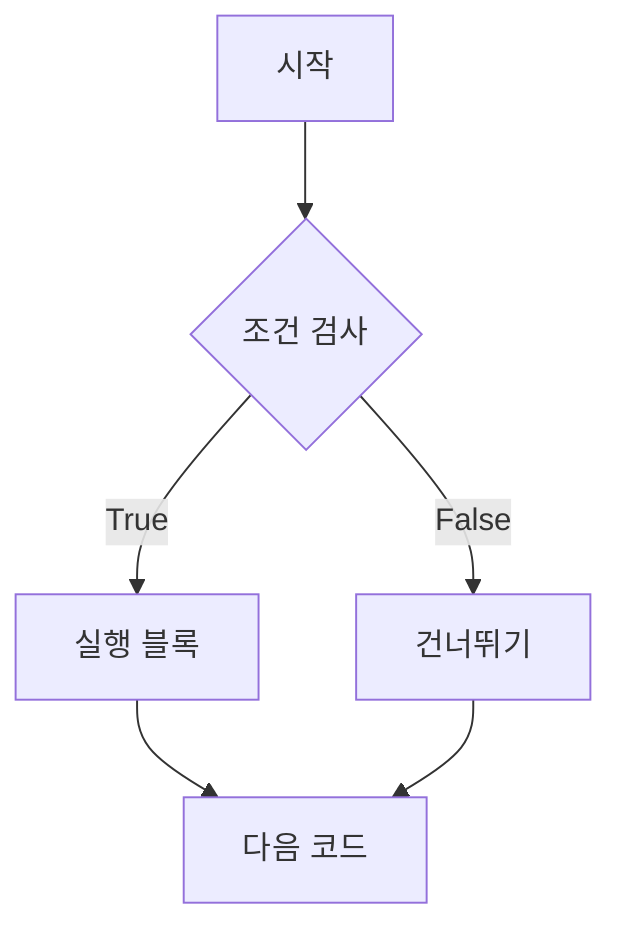
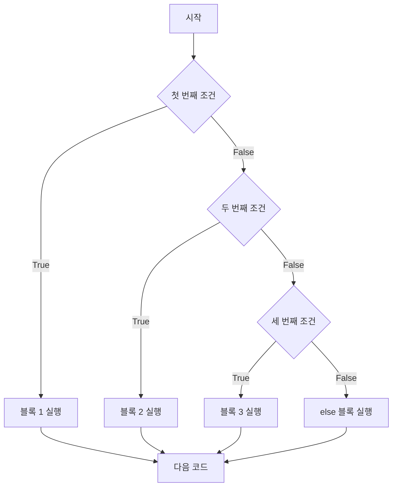
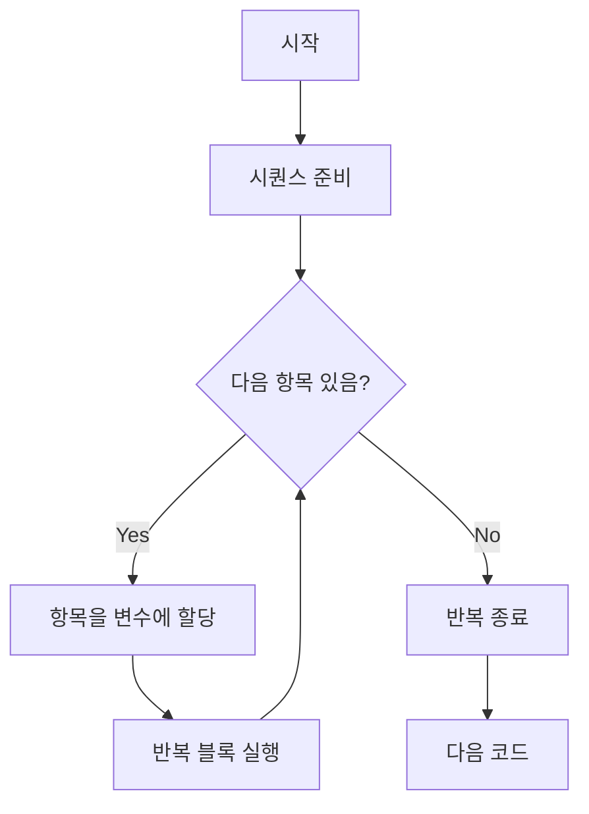
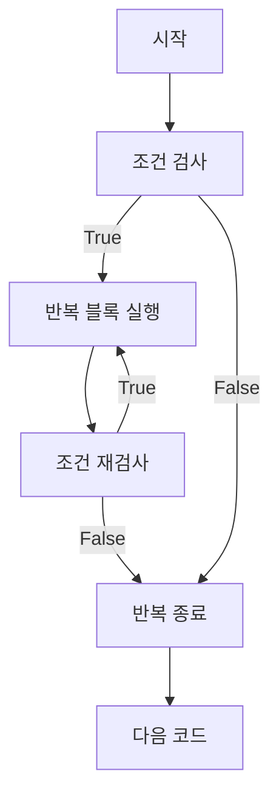

# 챕터 3: 제어 구조

> "프로그램의 흐름을 제어하는 것은 코딩의 핵심이다" - 조건문과 반복문으로 더욱 지능적이고 효율적인 프로그램을 만들어봅시다.

## 학습 목표
- 조건문을 활용하여 프로그램의 분기를 제어할 수 있다
- 반복문을 사용하여 효율적인 코드를 작성할 수 있다
- 중첩 구조와 복합 조건을 이해할 수 있다
- break, continue, else 등의 제어문을 적절히 활용할 수 있다

## 핵심 개념(이론)

### 1) 제어 구조의 목적은 “분기”가 아니라 “의도 표현”이다
조건문/반복문은 실행 흐름을 바꾸기 위한 도구지만, 실무에서는 **의도를 읽기 쉽게 표현**하는 것이 더 중요합니다.
복잡한 분기는 코드가 아니라 요구사항이 복잡하다는 신호일 수 있습니다.

### 2) 반복문의 핵심: “상태 변화”를 최소화하라
버그의 많은 부분은 반복문 내부의 상태가 여러 군데서 바뀌며 생깁니다.
가능하면 상태 변화를 한 곳으로 모으고, `for`/내장 함수로 의도를 드러내는 편이 안전합니다.

### 3) `break/continue/else`는 ‘제어 흐름 계약’이다
`break`는 “중단 조건을 찾으면 즉시 종료”라는 계약을 만들고, `else`는 “끝까지 break 없이 돌았다”는 사실을 표현합니다.
이 의미를 모르면 `for-else`가 오히려 혼란을 줍니다.

### 4) 중첩은 비용이다: 복잡도는 ‘줄 수’가 아니라 ‘경로 수’다
if/for 중첩이 늘어날수록 가능한 실행 경로가 폭발하고 테스트가 어려워집니다.
중첩이 깊다면 함수 분리, 조기 반환(guard), 데이터 구조 변경을 먼저 고려하세요.

## 선택 기준(Decision Guide)
- 반복은 `while`보다 `for`가 기본(종료 조건을 명확히).
- 분기가 많아지면 “조건을 데이터로” 바꾸는 전략(딕셔너리 매핑 등)을 고려.

## 흔한 오해/주의점
- `else`는 “if의 else”만 있는 게 아니라, 반복문에도 붙을 수 있습니다.
- 무한 루프는 나쁜 것이 아니라, 종료 조건/timeout이 없을 때 위험합니다.

## 요약
- 제어 구조는 의도를 표현하는 도구이며, 중첩은 복잡도를 폭발시킨다.
- `break/continue/else`의 의미를 계약으로 이해하고 사용한다.

## 조건문 (Conditional Statements)

### if 문 기본 구조



## 핵심 내용

### 조건문 (if, elif, else)
- **기본 구조**: if-elif-else 체인
- **조건 표현식**: 단축 평가와 논리 연산
- **중첩 조건문**: 복잡한 논리 구조
- **삼항 연산자**: 조건부 표현식 활용

### 반복문
- **for 문**: 시퀀스 순회, range() 활용
- **while 문**: 조건 기반 반복
- **중첩 반복문**: 다차원 데이터 처리
- **무한 루프**: 주의사항과 활용법

### 제어 키워드
- **break**: 반복문 완전 탈출
- **continue**: 현재 반복 건너뛰기
- **else**: 반복문의 정상 완료 처리
- **pass**: 빈 코드 블록 처리

### 고급 제어 구조
- **enumerate()**: 인덱스와 값 동시 처리
- **zip()**: 다중 시퀀스 병렬 처리
- **reversed()**: 역순 순회
- **sorted()**: 정렬된 순회

### 예외 기반 제어
- **try-except**: 예외 처리 기본
- **try-except-else-finally**: 완전한 예외 처리
- **raise**: 예외 발생시키기
- **assert**: 디버깅용 검증

## 실습 프로젝트
1. 학점 계산기 (조건문 활용)
2. 구구단 출력 프로그램 (중첩 반복문)
3. 숫자 맞추기 게임 (while 문과 break)
4. 메뉴 시스템 구현 (복합 제어 구조)

## 체크리스트
- [ ] if-elif-else 구조 이해
- [ ] for, while 반복문 구분
- [ ] break, continue 적절한 사용
- [ ] 중첩 구조 작성 능력
- [ ] 예외 처리 기본 이해

## 다음 단계
제어 구조를 마스터했다면, 코드 재사용성을 높이는 함수 정의와 호출을 학습합니다. 

**기본 if 문:**

```python
# 기본 if 문
age = 18
if age >= 18:
    print("성인입니다.")
    print("투표할 수 있습니다.")

# 조건이 거짓일 때는 아무것도 실행되지 않음
score = 70
if score >= 90:
    print("A 등급")  # 실행되지 않음

print("프로그램 계속 진행")
```

**if-else 문:**

```python
# 두 가지 경우 처리
temperature = 25

if temperature > 30:
    print("더워요! 에어컨을 켜세요.")
else:
    print("시원해요! 창문을 여세요.")

# 숫자의 홀짝 판별
number = 7
if number % 2 == 0:
    print(f"{number}는 짝수입니다.")
else:
    print(f"{number}는 홀수입니다.")
```

### if-elif-else 체인



**학점 계산 예제:**

```python
score = 87

if score >= 90:
    grade = "A"
    print("우수한 성적입니다!")
elif score >= 80:
    grade = "B"
    print("좋은 성적입니다!")
elif score >= 70:
    grade = "C"
    print("보통 성적입니다.")
elif score >= 60:
    grade = "D"
    print("조금 더 노력하세요.")
else:
    grade = "F"
    print("재수강이 필요합니다.")

print(f"당신의 학점은 {grade}입니다.")
```

**복합 조건 처리:**

```python
# 여러 조건을 조합
age = 25
has_license = True
experience_years = 3

if age >= 18 and has_license:
    if experience_years >= 2:
        print("렌터카 이용이 가능합니다.")
    else:
        print("경력이 부족합니다. 보험료가 추가됩니다.")
elif age >= 18:
    print("운전면허를 먼저 취득하세요.")
else:
    print("성인이 되면 다시 신청하세요.")

# 범위 검사
temperature = 25
humidity = 60

if 20 <= temperature <= 26 and 40 <= humidity <= 60:
    print("쾌적한 환경입니다.")
elif temperature < 20:
    print("춥습니다. 난방을 켜세요.")
elif temperature > 26:
    print("덥습니다. 냉방을 켜세요.")
elif humidity < 40:
    print("건조합니다. 가습기를 켜세요.")
elif humidity > 60:
    print("습합니다. 제습기를 켜세요.")
```

### 조건부 표현식 (삼항 연산자)

```python
# 기본 문법: 값1 if 조건 else 값2
age = 20
status = "성인" if age >= 18 else "미성년자"
print(f"나이 {age}세는 {status}입니다.")

# 함수 호출에서 활용
def get_discount_rate(is_member, age):
    return 0.2 if is_member else (0.1 if age >= 65 else 0.05)

discount = get_discount_rate(True, 30)
print(f"할인율: {discount * 100}%")

# 리스트 컴프리헨션과 함께
numbers = [1, 2, 3, 4, 5, 6, 7, 8, 9, 10]
even_odd = ["짝수" if n % 2 == 0 else "홀수" for n in numbers]
print(even_odd)

# 중첩된 조건부 표현식 (권장하지 않음)
score = 85
grade = "A" if score >= 90 else ("B" if score >= 80 else ("C" if score >= 70 else "F"))
print(f"점수 {score}: {grade}등급")
```

## 반복문 (Loops)

### for 문



**기본 for 문:**

```python
# 리스트 순회
fruits = ["사과", "바나나", "체리", "포도"]
for fruit in fruits:
    print(f"과일: {fruit}")

# 문자열 순회
word = "Python"
for char in word:
    print(f"글자: {char}")

# range() 함수 활용
print("1부터 5까지:")
for i in range(1, 6):
    print(f"숫자: {i}")

print("0부터 9까지 (짝수만):")
for i in range(0, 10, 2):
    print(f"짝수: {i}")

print("10부터 1까지 (역순):")
for i in range(10, 0, -1):
    print(f"카운트다운: {i}")
```

**for 문 고급 활용:**

```python
# enumerate() - 인덱스와 값 동시 접근
students = ["Alice", "Bob", "Charlie", "Diana"]
for index, name in enumerate(students):
    print(f"{index + 1}번째 학생: {name}")

# enumerate() 시작 값 지정
for rank, name in enumerate(students, start=1):
    print(f"{rank}등: {name}")

# zip() - 여러 시퀀스 병렬 처리
names = ["Alice", "Bob", "Charlie"]
scores = [85, 92, 78]
ages = [20, 22, 21]

for name, score, age in zip(names, scores, ages):
    print(f"{name} ({age}세): {score}점")

# 딕셔너리 순회
student_info = {"Alice": 85, "Bob": 92, "Charlie": 78}

# 키만 순회
for name in student_info:
    print(f"학생: {name}")

# 값만 순회
for score in student_info.values():
    print(f"점수: {score}")

# 키와 값 동시 순회
for name, score in student_info.items():
    print(f"{name}: {score}점")
```

**중첩 for 문:**

```python
# 구구단 출력
print("=== 구구단 ===")
for i in range(2, 10):
    print(f"\n{i}단:")
    for j in range(1, 10):
        result = i * j
        print(f"{i} × {j} = {result}")

# 2차원 리스트 처리
matrix = [
    [1, 2, 3],
    [4, 5, 6],
    [7, 8, 9]
]

print("행렬 출력:")
for row in matrix:
    for element in row:
        print(f"{element:3d}", end=" ")
    print()  # 줄바꿈

# 좌표계 순회
print("\n좌표계:")
for x in range(3):
    for y in range(3):
        print(f"({x}, {y})", end=" ")
    print()
```

### while 문



**기본 while 문:**

```python
# 카운터 기반 반복
count = 1
while count <= 5:
    print(f"카운트: {count}")
    count += 1  # 조건 변경 필수!

print("반복 완료")

# 사용자 입력 기반 반복
password = ""
while password != "1234":
    password = input("비밀번호를 입력하세요: ")
    if password != "1234":
        print("틀렸습니다. 다시 시도하세요.")

print("로그인 성공!")

# 조건 기반 계산
number = 100
while number > 1:
    print(f"현재 수: {number}")
    number //= 2  # 2로 나누기

print(f"최종 결과: {number}")
```

**while 문 실제 활용:**

```python
# 숫자 맞추기 게임
import random

target = random.randint(1, 100)
attempts = 0
max_attempts = 7

print("1부터 100 사이의 숫자를 맞춰보세요!")
print(f"기회는 {max_attempts}번입니다.")

while attempts < max_attempts:
    try:
        guess = int(input(f"\n{attempts + 1}번째 시도: "))
        attempts += 1
        
        if guess == target:
            print(f"🎉 정답! {attempts}번 만에 맞췄습니다!")
            break
        elif guess < target:
            print("더 큰 수입니다.")
        else:
            print("더 작은 수입니다.")
            
        remaining = max_attempts - attempts
        if remaining > 0:
            print(f"남은 기회: {remaining}번")
    except ValueError:
        print("올바른 숫자를 입력하세요.")
        attempts -= 1  # 잘못된 입력은 기회 차감 안함

if attempts >= max_attempts and guess != target:
    print(f"💥 실패! 정답은 {target}이었습니다.")

# 메뉴 시스템
def show_menu():
    print("\n=== 계산기 메뉴 ===")
    print("1. 더하기")
    print("2. 빼기")
    print("3. 곱하기")
    print("4. 나누기")
    print("0. 종료")

running = True
while running:
    show_menu()
    choice = input("\n선택하세요: ").strip()
    
    if choice == "0":
        print("프로그램을 종료합니다.")
        running = False
    elif choice in ["1", "2", "3", "4"]:
        try:
            a = float(input("첫 번째 수: "))
            b = float(input("두 번째 수: "))
            
            if choice == "1":
                result = a + b
                print(f"결과: {a} + {b} = {result}")
            elif choice == "2":
                result = a - b
                print(f"결과: {a} - {b} = {result}")
            elif choice == "3":
                result = a * b
                print(f"결과: {a} × {b} = {result}")
            elif choice == "4":
                if b != 0:
                    result = a / b
                    print(f"결과: {a} ÷ {b} = {result}")
                else:
                    print("0으로 나눌 수 없습니다.")
        except ValueError:
            print("올바른 숫자를 입력하세요.")
    else:
        print("올바른 메뉴를 선택하세요.")
```

## 제어 키워드

### break와 continue

```python
# break - 반복문 완전 탈출
print("=== break 예제 ===")
for i in range(1, 11):
    if i == 6:
        print("6에서 중단!")
        break
    print(f"숫자: {i}")

print("반복문 종료\n")

# continue - 현재 반복 건너뛰기
print("=== continue 예제 ===")
for i in range(1, 11):
    if i % 2 == 0:  # 짝수 건너뛰기
        continue
    print(f"홀수: {i}")

print("반복문 종료\n")

# while문에서 break와 continue
print("=== while문 break/continue ===")
count = 0
while count < 10:
    count += 1
    
    if count == 5:
        print("5는 건너뜁니다")
        continue
        
    if count == 8:
        print("8에서 중단합니다")
        break
        
    print(f"카운트: {count}")
```

### else 절과 함께 사용하는 break

```python
# for문의 else: break 없이 정상 완료 시 실행
print("=== for-else 구문 ===")

# 정상 완료 예제
for i in range(5):
    print(f"숫자: {i}")
else:
    print("반복문이 정상적으로 완료되었습니다.")

print()

# break로 중단된 경우
search_number = 7
numbers = [1, 3, 5, 7, 9]

for num in numbers:
    print(f"확인 중: {num}")
    if num == search_number:
        print(f"찾았습니다: {search_number}")
        break
else:
    print(f"{search_number}를 찾지 못했습니다.")

# while문의 else
print("\n=== while-else 구문 ===")
password_attempts = 0
max_attempts = 3

while password_attempts < max_attempts:
    password = input(f"비밀번호 입력 ({password_attempts + 1}/{max_attempts}): ")
    password_attempts += 1
    
    if password == "1234":
        print("로그인 성공!")
        break
else:
    print("로그인 실패: 최대 시도 횟수를 초과했습니다.")
```

### pass 문

```python
# pass - 아무것도 하지 않는 구문 (자리표시자)
def todo_function():
    pass  # 나중에 구현 예정

class FutureClass:
    pass  # 나중에 구현 예정

# 조건문에서 pass
score = 85
if score >= 90:
    print("A등급")
elif score >= 80:
    pass  # B등급 처리는 나중에 구현
else:
    print("C등급 이하")

# 예외 처리에서 pass
try:
    risky_operation = 1 / 0
except ZeroDivisionError:
    pass  # 에러를 무시하고 계속 진행
```

## 고급 제어 구조

### enumerate()로 인덱스와 값 함께 처리

```python
# 기본 enumerate 사용
fruits = ["apple", "banana", "cherry", "date"]

print("=== enumerate 기본 사용 ===")
for index, fruit in enumerate(fruits):
    print(f"{index}: {fruit}")

# 시작 번호 지정
print("\n=== enumerate 시작 번호 지정 ===")
for rank, fruit in enumerate(fruits, start=1):
    print(f"{rank}등: {fruit}")

# 조건부 처리와 함께
print("\n=== 조건부 enumerate ===")
scores = [85, 92, 78, 96, 88]
for i, score in enumerate(scores):
    grade = "A" if score >= 90 else "B" if score >= 80 else "C"
    print(f"학생 {i+1}: {score}점 ({grade}등급)")
```

### zip()으로 여러 시퀀스 병렬 처리

```python
# 기본 zip 사용
names = ["Alice", "Bob", "Charlie"]
ages = [25, 30, 35]
cities = ["Seoul", "Busan", "Incheon"]

print("=== zip 기본 사용 ===")
for name, age, city in zip(names, ages, cities):
    print(f"{name} ({age}세) - {city}")

# 길이가 다른 시퀀스
print("\n=== 길이가 다른 시퀀스 ===")
numbers1 = [1, 2, 3, 4, 5]
numbers2 = [10, 20, 30]  # 더 짧음

for n1, n2 in zip(numbers1, numbers2):
    print(f"{n1} + {n2} = {n1 + n2}")
# 짧은 시퀀스에 맞춰 3번만 실행됨

# zip을 이용한 사전 생성
keys = ["name", "age", "city"]
values = ["Diana", 28, "Daegu"]
person_dict = dict(zip(keys, values))
print(f"\n생성된 사전: {person_dict}")

# zip을 이용한 리스트 전치 (transpose)
matrix = [[1, 2, 3], [4, 5, 6], [7, 8, 9]]
transposed = list(zip(*matrix))
print(f"\n원본 행렬: {matrix}")
print(f"전치 행렬: {transposed}")
```

### reversed()와 sorted()

```python
# reversed() - 역순 순회
numbers = [1, 2, 3, 4, 5]

print("=== reversed() 사용 ===")
for num in reversed(numbers):
    print(f"역순: {num}")

# 문자열 역순
text = "Python"
for char in reversed(text):
    print(char, end="")
print()  # 줄바꿈

# sorted() - 정렬된 순회 (원본 변경 없음)
print("\n=== sorted() 사용 ===")
scores = [85, 92, 78, 96, 88]

print("오름차순:")
for score in sorted(scores):
    print(score, end=" ")
print()

print("내림차순:")
for score in sorted(scores, reverse=True):
    print(score, end=" ")
print()

print(f"원본 리스트: {scores}")  # 변경되지 않음

# 복잡한 정렬
students = [
    ("Alice", 85),
    ("Bob", 92),
    ("Charlie", 78),
    ("Diana", 96)
]

print("\n점수순 정렬 (높은 점수부터):")
for name, score in sorted(students, key=lambda x: x[1], reverse=True):
    print(f"{name}: {score}")
```

## 중첩 반복문과 실전 예제

### 구구단 마스터

```python
def multiplication_table():
    """구구단 출력 및 문제 생성"""
    
    print("=== 구구단 마스터 ===")
    print("1. 전체 구구단 보기")
    print("2. 특정 단 보기")
    print("3. 구구단 문제 풀기")
    
    choice = input("선택하세요 (1-3): ")
    
    if choice == "1":
        # 전체 구구단
        for i in range(2, 10):
            print(f"\n=== {i}단 ===")
            for j in range(1, 10):
                print(f"{i} × {j} = {i * j:2d}")
    
    elif choice == "2":
        # 특정 단
        try:
            dan = int(input("몇 단을 보시겠습니까? (2-9): "))
            if 2 <= dan <= 9:
                print(f"\n=== {dan}단 ===")
                for j in range(1, 10):
                    print(f"{dan} × {j} = {dan * j}")
            else:
                print("2-9 사이의 숫자를 입력하세요.")
        except ValueError:
            print("올바른 숫자를 입력하세요.")
    
    elif choice == "3":
        # 구구단 문제 풀기
        import random
        
        correct = 0
        total = 5
        
        print(f"\n구구단 문제 {total}개를 풀어보세요!")
        
        for i in range(total):
            a = random.randint(2, 9)
            b = random.randint(1, 9)
            answer = a * b
            
            try:
                user_answer = int(input(f"\n문제 {i+1}: {a} × {b} = "))
                if user_answer == answer:
                    print("✅ 정답!")
                    correct += 1
                else:
                    print(f"❌ 틀렸습니다. 정답은 {answer}입니다.")
            except ValueError:
                print(f"❌ 숫자를 입력하세요. 정답은 {answer}입니다.")
        
        print(f"\n결과: {correct}/{total} 정답 ({correct/total*100:.1f}%)")
        if correct == total:
            print("🎉 모든 문제를 맞췄습니다!")
        elif correct >= total * 0.8:
            print("👍 잘했습니다!")
        else:
            print("💪 더 연습해보세요!")

# 실행
multiplication_table()
```

### 숫자 맞추기 게임

```python
def number_guessing_game():
    """숫자 맞추기 게임"""
    import random
    
    print("=== 숫자 맞추기 게임 ===")
    print("1부터 100 사이의 숫자를 맞춰보세요!")
    
    # 난이도 선택
    print("\n난이도를 선택하세요:")
    print("1. 쉬움 (10번 기회)")
    print("2. 보통 (7번 기회)")
    print("3. 어려움 (5번 기회)")
    
    difficulty = input("선택 (1-3): ")
    
    if difficulty == "1":
        max_attempts = 10
        level = "쉬움"
    elif difficulty == "2":
        max_attempts = 7
        level = "보통"
    elif difficulty == "3":
        max_attempts = 5
        level = "어려움"
    else:
        max_attempts = 7
        level = "보통"
        print("기본 난이도(보통)로 설정합니다.")
    
    target = random.randint(1, 100)
    attempts = 0
    guessed_numbers = []
    
    print(f"\n난이도: {level} (최대 {max_attempts}번 시도)")
    print("게임 시작!")
    
    while attempts < max_attempts:
        try:
            guess = int(input(f"\n시도 {attempts + 1}/{max_attempts}: "))
            
            if guess < 1 or guess > 100:
                print("1부터 100 사이의 숫자를 입력하세요.")
                continue
            
            if guess in guessed_numbers:
                print("이미 시도한 숫자입니다.")
                continue
            
            attempts += 1
            guessed_numbers.append(guess)
            
            if guess == target:
                print(f"🎉 정답! {attempts}번 만에 맞췄습니다!")
                
                # 성과 평가
                if attempts <= max_attempts // 3:
                    print("🏆 대단합니다! 매우 빠르게 맞췄네요!")
                elif attempts <= max_attempts // 2:
                    print("👍 좋습니다! 빠르게 맞췄네요!")
                else:
                    print("😊 축하합니다!")
                break
            
            elif guess < target:
                print("⬆️ 더 큰 수입니다.")
                # 힌트 제공
                if target - guess >= 30:
                    print("💡 힌트: 많이 작습니다!")
                elif target - guess >= 10:
                    print("💡 힌트: 좀 더 큰 수입니다.")
            
            else:  # guess > target
                print("⬇️ 더 작은 수입니다.")
                # 힌트 제공
                if guess - target >= 30:
                    print("💡 힌트: 많이 큽니다!")
                elif guess - target >= 10:
                    print("💡 힌트: 좀 더 작은 수입니다.")
            
            # 시도한 숫자들 표시
            guessed_numbers.sort()
            print(f"시도한 숫자들: {guessed_numbers}")
            
            remaining = max_attempts - attempts
            if remaining > 0:
                print(f"남은 기회: {remaining}번")
            
        except ValueError:
            print("올바른 숫자를 입력하세요.")
    
    # 게임 종료
    if attempts >= max_attempts and guess != target:
        print(f"\n💥 실패! 정답은 {target}이었습니다.")
        print("다시 도전해보세요!")
    
    # 재시작 여부
    play_again = input("\n다시 플레이하시겠습니까? (y/n): ").lower()
    if play_again == 'y':
        number_guessing_game()
    else:
        print("게임을 종료합니다. 즐거우셨나요? 😊")

# 게임 실행
number_guessing_game()
```

### 학점 관리 시스템

```python
def grade_management_system():
    """학점 관리 시스템"""
    
    students = {}
    
    while True:
        print("\n=== 학점 관리 시스템 ===")
        print("1. 학생 추가")
        print("2. 점수 입력")
        print("3. 성적 조회")
        print("4. 전체 통계")
        print("5. 학점 분포")
        print("0. 종료")
        
        choice = input("\n선택하세요: ").strip()
        
        if choice == "0":
            print("프로그램을 종료합니다.")
            break
        
        elif choice == "1":
            # 학생 추가
            name = input("학생 이름: ").strip()
            if name:
                if name not in students:
                    students[name] = {}
                    print(f"✅ {name} 학생이 추가되었습니다.")
                else:
                    print(f"⚠️ {name} 학생은 이미 등록되어 있습니다.")
            else:
                print("올바른 이름을 입력하세요.")
        
        elif choice == "2":
            # 점수 입력
            if not students:
                print("먼저 학생을 추가하세요.")
                continue
            
            print(f"등록된 학생: {list(students.keys())}")
            name = input("학생 이름: ").strip()
            
            if name not in students:
                print("등록되지 않은 학생입니다.")
                continue
            
            subject = input("과목명: ").strip()
            if not subject:
                print("과목명을 입력하세요.")
                continue
            
            try:
                score = float(input("점수 (0-100): "))
                if 0 <= score <= 100:
                    students[name][subject] = score
                    print(f"✅ {name} 학생의 {subject} 점수 {score}점이 등록되었습니다.")
                else:
                    print("점수는 0-100 사이여야 합니다.")
            except ValueError:
                print("올바른 점수를 입력하세요.")
        
        elif choice == "3":
            # 성적 조회
            if not students:
                print("등록된 학생이 없습니다.")
                continue
            
            print(f"등록된 학생: {list(students.keys())}")
            name = input("학생 이름 (전체 보기: all): ").strip()
            
            if name.lower() == "all":
                # 전체 학생 성적
                for student_name, scores in students.items():
                    print(f"\n📋 {student_name} 학생:")
                    if scores:
                        total = sum(scores.values())
                        average = total / len(scores)
                        
                        print(f"과목별 점수:")
                        for subject, score in scores.items():
                            grade = get_letter_grade(score)
                            print(f"  - {subject}: {score}점 ({grade})")
                        
                        print(f"평균: {average:.1f}점 ({get_letter_grade(average)})")
                    else:
                        print("  등록된 점수가 없습니다.")
            
            elif name in students:
                # 특정 학생 성적
                scores = students[name]
                print(f"\n📋 {name} 학생 성적:")
                
                if scores:
                    total = sum(scores.values())
                    average = total / len(scores)
                    
                    print(f"과목별 점수:")
                    for subject, score in scores.items():
                        grade = get_letter_grade(score)
                        print(f"  - {subject}: {score}점 ({grade})")
                    
                    print(f"총 {len(scores)}과목")
                    print(f"총점: {total}점")
                    print(f"평균: {average:.1f}점 ({get_letter_grade(average)})")
                    
                    # 과목별 순위 (만약 여러 학생이 같은 과목을 들었다면)
                    print(f"\n📊 과목별 상대 순위:")
                    for subject, score in scores.items():
                        rank = calculate_rank(students, subject, score)
                        print(f"  - {subject}: {len(rank)}명 중 {rank.index(score) + 1}등")
                        
                else:
                    print("등록된 점수가 없습니다.")
            else:
                print("등록되지 않은 학생입니다.")
        
        elif choice == "4":
            # 전체 통계
            if not students:
                print("등록된 학생이 없습니다.")
                continue
            
            all_scores = []
            subject_scores = {}
            
            for name, scores in students.items():
                for subject, score in scores.items():
                    all_scores.append(score)
                    if subject not in subject_scores:
                        subject_scores[subject] = []
                    subject_scores[subject].append(score)
            
            if all_scores:
                print(f"\n📊 전체 통계:")
                print(f"총 학생 수: {len(students)}명")
                print(f"총 점수 기록: {len(all_scores)}개")
                print(f"전체 평균: {sum(all_scores)/len(all_scores):.1f}점")
                print(f"최고 점수: {max(all_scores)}점")
                print(f"최저 점수: {min(all_scores)}점")
                
                print(f"\n📚 과목별 통계:")
                for subject, scores in subject_scores.items():
                    avg = sum(scores) / len(scores)
                    print(f"  - {subject}: 평균 {avg:.1f}점 ({len(scores)}명)")
            else:
                print("등록된 점수가 없습니다.")
        
        elif choice == "5":
            # 학점 분포
            if not students:
                print("등록된 학생이 없습니다.")
                continue
            
            grade_count = {"A": 0, "B": 0, "C": 0, "D": 0, "F": 0}
            total_scores = 0
            
            for name, scores in students.items():
                if scores:
                    average = sum(scores.values()) / len(scores)
                    grade = get_letter_grade(average)
                    grade_count[grade] += 1
                    total_scores += 1
            
            if total_scores > 0:
                print(f"\n📈 학점 분포 ({total_scores}명):")
                for grade in ["A", "B", "C", "D", "F"]:
                    count = grade_count[grade]
                    percentage = count / total_scores * 100
                    bar = "█" * int(percentage / 5)  # 5%당 하나의 블록
                    print(f"  {grade}: {count:2d}명 ({percentage:4.1f}%) {bar}")
            else:
                print("성적 데이터가 없습니다.")
        
        else:
            print("올바른 메뉴를 선택하세요.")

def get_letter_grade(score):
    """점수를 학점으로 변환"""
    if score >= 90:
        return "A"
    elif score >= 80:
        return "B"
    elif score >= 70:
        return "C"
    elif score >= 60:
        return "D"
    else:
        return "F"

def calculate_rank(students, subject, target_score):
    """특정 과목에서의 점수 순위 계산"""
    scores = []
    for name, student_scores in students.items():
        if subject in student_scores:
            scores.append(student_scores[subject])
    
    scores.sort(reverse=True)
    return scores

# 시스템 실행
grade_management_system()
```

## 체크리스트

### 조건문
- [ ] if-elif-else 구조 이해
- [ ] 논리 연산자 활용
- [ ] 중첩 조건문 작성
- [ ] 조건부 표현식 활용

### 반복문
- [ ] for문과 range() 활용
- [ ] while문 조건 설정
- [ ] 중첩 반복문 구현
- [ ] 무한 루프 방지

### 제어 키워드
- [ ] break와 continue 적절한 사용
- [ ] for-else, while-else 이해
- [ ] pass 문의 활용
- [ ] 반복문 최적화

### 고급 기능
- [ ] enumerate(), zip() 활용
- [ ] reversed(), sorted() 활용
- [ ] 복잡한 제어 로직 구현
- [ ] 실무형 프로그램 작성

## 다음 단계

🎉 **축하합니다!** 파이썬 제어 구조를 마스터했습니다.

이제 [04. 함수](../04_functions/)로 넘어가서 코드의 재사용성을 높이는 함수 정의와 활용을 학습해봅시다.

---

💡 **팁:**
- 조건문은 간단하고 읽기 쉽게 작성하세요
- 반복문에서는 항상 종료 조건을 명확히 하세요
- break와 continue는 적절히 사용하여 코드를 간결하게 만드세요
- 복잡한 로직은 함수로 분리하여 가독성을 높이세요

print("반복문 종료\n")

# 중첩 반복문에서 break
print("=== 중첩 반복문 break ===")
found = False
for i in range(1, 6):
    for j in range(1, 6):
        if i * j == 12:
            print(f"{i} × {j} = 12를 찾았습니다!")
            found = True
            break
    if found:
        break

# while문에서 break와 continue
print("\n=== while문 제어 ===")
count = 0
while count < 10:
    count += 1
    
    if count == 3:
        print("3은 건너뛰기")
        continue
        
    if count == 7:
        print("7에서 종료")
        break
        
    print(f"카운트: {count}")
```

### else 절과 함께 사용

```python
# for-else: 정상 완료시에만 실행
print("=== for-else 예제 ===")
numbers = [2, 4, 6, 8, 10]

for num in numbers:
    print(f"검사: {num}")
    if num % 2 != 0:  # 홀수 발견
        print("홀수를 발견했습니다!")
        break
else:
    print("모든 수가 짝수입니다.")

# while-else: 조건이 False가 되어 종료시 실행
print("\n=== while-else 예제 ===")
password_attempts = 0
max_attempts = 3

while password_attempts < max_attempts:
    password = input(f"비밀번호 입력 ({password_attempts + 1}/{max_attempts}): ")
    password_attempts += 1
    
    if password == "secret":
        print("로그인 성공!")
        break
    else:
        print("틀렸습니다.")
else:
    print("로그인 실패: 시도 횟수 초과")

# 소수 판별 예제
def is_prime(n):
    if n < 2:
        return False
    
    for i in range(2, int(n ** 0.5) + 1):
        if n % i == 0:
            return False
    else:
        return True

number = 17
if is_prime(number):
    print(f"{number}는 소수입니다.")
else:
    print(f"{number}는 소수가 아닙니다.")
```

### pass 문

```python
# pass - 빈 코드 블록 (문법상 필요할 때)
def future_function():
    """나중에 구현할 함수"""
    pass  # 임시로 비워둠

class FutureClass:
    """나중에 구현할 클래스"""
    pass

# 조건문에서 pass
age = 25
if age >= 18:
    pass  # 성인인 경우 아무것도 하지 않음
else:
    print("미성년자입니다.")

# 예외 처리에서 pass
try:
    result = 10 / 0
except ZeroDivisionError:
    pass  # 에러 무시

# 반복문에서 pass
for i in range(5):
    if i == 2:
        pass  # 2일 때는 아무것도 하지 않음
    else:
        print(f"숫자: {i}")
```

## 고급 제어 구조

### 컬렉션 순회 고급 기법

```python
# reversed() - 역순 순회
fruits = ["사과", "바나나", "체리"]
print("역순 출력:")
for fruit in reversed(fruits):
    print(fruit)

# sorted() - 정렬된 순회 (원본 변경 안함)
numbers = [3, 1, 4, 1, 5, 9, 2, 6]
print("\n정렬된 순서로 출력:")
for num in sorted(numbers):
    print(num, end=" ")

print("\n역순 정렬:")
for num in sorted(numbers, reverse=True):
    print(num, end=" ")

# 딕셔너리를 값으로 정렬
scores = {"Alice": 85, "Bob": 92, "Charlie": 78, "Diana": 96}
print("\n\n점수순 정렬 (높은 순):")
for name in sorted(scores, key=scores.get, reverse=True):
    print(f"{name}: {scores[name]}점")

# 문자열 길이로 정렬
words = ["python", "java", "c", "javascript", "go"]
print("\n길이순 정렬:")
for word in sorted(words, key=len):
    print(f"{word} ({len(word)}글자)")
```

### 조건부 반복

```python
# any()와 all() 활용
numbers = [2, 4, 6, 8, 10]

# 모든 수가 짝수인지 확인
if all(num % 2 == 0 for num in numbers):
    print("모든 수가 짝수입니다.")

# 하나라도 10보다 큰 수가 있는지 확인
if any(num > 10 for num in numbers):
    print("10보다 큰 수가 있습니다.")

# 조건을 만족하는 첫 번째 항목 찾기
names = ["Alice", "Bob", "Charlie", "Anna"]
for name in names:
    if name.startswith("A"):
        print(f"A로 시작하는 첫 번째 이름: {name}")
        break
else:
    print("A로 시작하는 이름을 찾지 못했습니다.")

# 조건을 만족하는 모든 항목 찾기
print("\nA로 시작하는 모든 이름:")
a_names = [name for name in names if name.startswith("A")]
for name in a_names:
    print(f"- {name}")
```

### 반복문 최적화

```python
# 리스트 컴프리헨션 (더 빠르고 간결)
# 기존 방식
squares = []
for i in range(10):
    squares.append(i ** 2)
print("제곱수 (기존):", squares)

# 리스트 컴프리헨션
squares = [i ** 2 for i in range(10)]
print("제곱수 (컴프리헨션):", squares)

# 조건부 컴프리헨션
even_squares = [i ** 2 for i in range(10) if i % 2 == 0]
print("짝수의 제곱:", even_squares)

# 딕셔너리 컴프리헨션
square_dict = {i: i ** 2 for i in range(5)}
print("제곱 딕셔너리:", square_dict)

# 집합 컴프리헨션
unique_lengths = {len(word) for word in ["hello", "world", "python", "code"]}
print("고유 길이들:", unique_lengths)

# 제너레이터 표현식 (메모리 효율적)
sum_squares = sum(i ** 2 for i in range(1000000))  # 메모리 절약
print(f"백만개 수의 제곱합: {sum_squares}")

