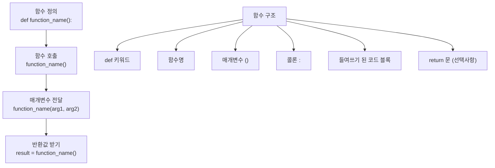

# 챕터 4: 함수

> "Don't Repeat Yourself (DRY)" - 함수는 코드의 재사용성과 가독성을 극대화하는 핵심 도구입니다.

## 학습 목표
- 함수를 정의하고 호출할 수 있다
- 매개변수와 인수의 다양한 형태를 이해할 수 있다
- 스코프와 네임스페이스를 파악할 수 있다
- 람다 함수와 고차 함수를 활용할 수 있다

## 핵심 개념(이론)

### 1) 함수의 역할과 경계
이 챕터의 핵심은 “무엇을 할 수 있나”가 아니라, **어떤 문제를 해결하고 어디까지 책임지는지**를 분명히 하는 것입니다.
경계가 흐리면 코드는 커질수록 결합이 늘어나고 수정 비용이 커집니다.

### 2) 왜 이 개념이 필요한가(실무 동기)
실무에서는 예외 상황, 성능, 협업, 테스트가 항상 문제를 만듭니다.
따라서 이 주제는 기능이 아니라 **품질(신뢰성/유지보수성/보안)**을 위한 기반으로 이해해야 합니다.

### 3) 트레이드오프: 간단함 vs 확장성
대부분의 선택은 “더 단순하게”와 “더 확장 가능하게” 사이에서 균형을 잡는 일입니다.
초기에는 단순함을, 장기 운영/팀 협업이 커질수록 확장성을 더 우선합니다.

### 4) 실패 모드(Failure Modes)를 먼저 생각하라
무엇이 실패하는지(입력, I/O, 동시성, 외부 시스템)를 먼저 떠올리면 설계가 안정적으로 변합니다.
이 챕터의 예제는 실패 모드를 축소해서 보여주므로, 실제 적용 시에는 더 많은 방어가 필요합니다.

### 5) 학습 포인트: 외우지 말고 “판단 기준”을 남겨라
핵심은 API를 외우는 것이 아니라, “언제 무엇을 선택할지” 판단 기준을 정리하는 것입니다.
이 기준이 쌓이면 새로운 라이브러리/도구가 나와도 빠르게 적응할 수 있습니다.

## 선택 기준(Decision Guide)
- 기본은 **가독성/명확성** 우선(최적화는 측정 이후).
- 외부 의존이 늘수록 **경계/추상화**와 **테스트**를 먼저 강화.
- 복잡도가 증가하면 “규칙을 코드로”가 아니라 “구조로” 담는 방향을 고려.

## 흔한 오해/주의점
- 도구/문법이 곧 실력이라는 오해가 있습니다. 실력은 문제를 단순화하고 구조화하는 능력입니다.
- 극단적 최적화/과설계는 학습과 유지보수를 방해할 수 있습니다.

## 요약
- 함수는 기능이 아니라 구조/품질을 위한 기반이다.
- 트레이드오프와 실패 모드를 먼저 생각하고, 판단 기준을 남기자.

## 함수 기본

### 함수 정의와 호출

## 핵심 내용

### 함수 기본
- **함수 정의**: def 키워드 사용법
- **함수 호출**: 매개변수 전달 방식
- **반환값**: return 문 활용
- **독스트링**: 함수 문서화

### 매개변수와 인수
- **위치 인수**: 순서 기반 전달
- **키워드 인수**: 이름 기반 전달
- **기본값 매개변수**: 선택적 인수 처리
- **가변 인수**: *args, **kwargs 활용

### 스코프와 네임스페이스
- **지역 스코프**: 함수 내부 변수
- **전역 스코프**: 모듈 레벨 변수
- **global 키워드**: 전역 변수 수정
- **nonlocal 키워드**: 중첩 함수 변수 접근

### 고급 함수 개념
- **람다 함수**: 익명 함수 정의
- **고차 함수**: 함수를 인수로 받는 함수
- **내장 고차 함수**: map(), filter(), reduce()
- **함수 내 함수**: 중첩 함수 정의

### 함수형 프로그래밍 기초
- **순수 함수**: 부작용 없는 함수
- **재귀 함수**: 자기 자신을 호출하는 함수
- **클로저**: 변수 캡처 메커니즘
- **함수 디코레이터**: 함수 기능 확장

## 실습 프로젝트
1. 수학 함수 라이브러리 (기본 함수)
2. 문자열 처리 도구 (매개변수 활용)
3. 재귀를 활용한 팩토리얼 계산기
4. 함수형 프로그래밍 스타일 데이터 처리

## 체크리스트
- [ ] 함수 정의와 호출 능숙
- [ ] 매개변수 종류별 사용법 이해
- [ ] 스코프 규칙 파악
- [ ] 람다 함수 활용
- [ ] 재귀 함수 구현 능력

## 다음 단계
함수를 마스터했다면, 데이터를 효과적으로 저장하고 조작하는 자료구조를 학습합니다. 

# 스코프 예제
global_var = "전역 변수"

def outer_function():
    outer_var = "외부 함수 변수"
    
    def inner_function():
        inner_var = "내부 함수 변수"
        print(f"내부에서 접근: {global_var}, {outer_var}, {inner_var}")
    
    inner_function()
    print(f"외부에서 접근: {global_var}, {outer_var}")

outer_function()

# global 키워드
counter = 0

def increment():
    global counter  # 전역 변수 수정
    counter += 1
    return counter

print(increment())  # 1
print(increment())  # 2

## 람다 함수와 고차 함수

# 람다 함수 기본
square = lambda x: x ** 2
print(square(5))  # 25

# 여러 매개변수
add = lambda x, y: x + y
print(add(3, 7))  # 10

# 고차 함수 활용
numbers = [1, 2, 3, 4, 5]

# map() - 모든 요소에 함수 적용
squared = list(map(lambda x: x ** 2, numbers))
print(squared)  # [1, 4, 9, 16, 25]

# filter() - 조건에 맞는 요소만 필터링
evens = list(filter(lambda x: x % 2 == 0, numbers))
print(evens)  # [2, 4]

# sorted() - 사용자 정의 키로 정렬
students = [("Alice", 85), ("Bob", 90), ("Charlie", 78)]
sorted_by_score = sorted(students, key=lambda student: student[1])
print(sorted_by_score)  # [('Charlie', 78), ('Alice', 85), ('Bob', 90)]

## 재귀 함수

# 팩토리얼 계산 (재귀)
def factorial(n):
    if n <= 1:
        return 1
    else:
        return n * factorial(n - 1)

print(factorial(5))  # 120

# 피보나치 수열 (재귀)
def fibonacci(n):
    if n <= 1:
        return n
    else:
        return fibonacci(n-1) + fibonacci(n-2)

print([fibonacci(i) for i in range(10)])  # [0, 1, 1, 2, 3, 5, 8, 13, 21, 34]

## 실습 프로젝트

###️ 프로젝트: 수학 라이브러리

import math

def calculator():
    """간단한 계산기 함수 모음"""
    
    def add(a, b):
        """덧셈"""
        return a + b
    
    def multiply(a, b):
        """곱셈"""
        return a * b
    
    def power(base, exponent):
        """거듭제곱"""
        return base ** exponent
    
    def factorial(n):
        """팩토리얼"""
        if n < 0:
            return None
        elif n <= 1:
            return 1
        else:
            return n * factorial(n - 1)
    
    def is_prime(n):
        """소수 판별"""
        if n < 2:
            return False
        for i in range(2, int(math.sqrt(n)) + 1):
            if n % i == 0:
                return False
        return True
    
    # 함수들을 딕셔너리로 반환
    return {
        'add': add,
        'multiply': multiply,
        'power': power,
        'factorial': factorial,
        'is_prime': is_prime
    }

# 사용 예제
calc = calculator()
print(f"3 + 5 = {calc['add'](3, 5)}")
print(f"4! = {calc['factorial'](4)}")
print(f"17은 소수? {calc['is_prime'](17)}")

## 체크리스트

### 함수 기본
- [ ] def 키워드로 함수 정의 가능
- [ ] 매개변수와 반환값 활용
- [ ] 독스트링 작성 습관
- [ ] 함수 호출과 결과 처리

### 고급 매개변수
- [ ] 기본값 매개변수 활용
- [ ] *args, **kwargs 사용
- [ ] 키워드 인수 활용
- [ ] 매개변수 순서 규칙 이해

### 스코프와 고급 개념
- [ ] 지역/전역 스코프 이해
- [ ] 람다 함수 활용
- [ ] 재귀 함수 구현
- [ ] 고차 함수 활용

## 다음 단계

🎉 **축하합니다!** 파이썬 함수를 마스터했습니다.

이제 [05. 자료구조](../05_data_structures/)로 넘어가서 리스트, 딕셔너리, 세트 등 파이썬의 강력한 자료구조를 학습해봅시다.

---

💡 **팁:**
- 함수는 하나의 일만 잘하도록 설계하세요
- 의미 있는 함수명과 매개변수명을 사용하세요
- 독스트링으로 함수의 목적을 명확히 하세요
- 부작용을 최소화하는 순수 함수를 지향하세요 
