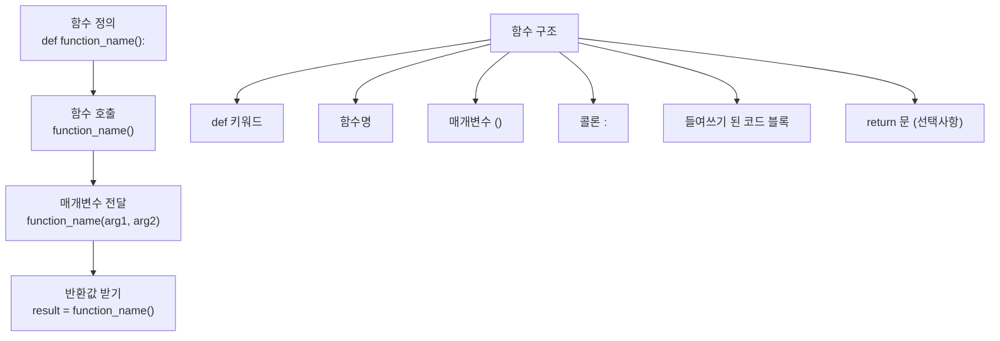

# 챕터 4: 함수

> "Don't Repeat Yourself (DRY)" - 함수는 코드의 재사용성과 가독성을 극대화하는 핵심 도구입니다.

## 학습 목표
- 함수를 정의하고 호출할 수 있다
- 매개변수와 인수의 다양한 형태를 이해할 수 있다
- 스코프와 네임스페이스를 파악할 수 있다
- 람다 함수와 고차 함수를 활용할 수 있다

## 핵심 개념(이론)

### 1) 함수의 역할과 경계
이 챕터의 핵심은 “무엇을 할 수 있나”가 아니라, **어떤 문제를 해결하고 어디까지 책임지는지**를 분명히 하는 것입니다.
경계가 흐리면 코드는 커질수록 결합이 늘어나고 수정 비용이 커집니다.

### 2) 왜 이 개념이 필요한가(실무 동기)
실무에서는 예외 상황, 성능, 협업, 테스트가 항상 문제를 만듭니다.
따라서 이 주제는 기능이 아니라 **품질(신뢰성/유지보수성/보안)**을 위한 기반으로 이해해야 합니다.

### 3) 트레이드오프: 간단함 vs 확장성
대부분의 선택은 “더 단순하게”와 “더 확장 가능하게” 사이에서 균형을 잡는 일입니다.
초기에는 단순함을, 장기 운영/팀 협업이 커질수록 확장성을 더 우선합니다.

### 4) 실패 모드(Failure Modes)를 먼저 생각하라
무엇이 실패하는지(입력, I/O, 동시성, 외부 시스템)를 먼저 떠올리면 설계가 안정적으로 변합니다.
이 챕터의 예제는 실패 모드를 축소해서 보여주므로, 실제 적용 시에는 더 많은 방어가 필요합니다.

### 5) 학습 포인트: 외우지 말고 “판단 기준”을 남겨라
핵심은 API를 외우는 것이 아니라, “언제 무엇을 선택할지” 판단 기준을 정리하는 것입니다.
이 기준이 쌓이면 새로운 라이브러리/도구가 나와도 빠르게 적응할 수 있습니다.

## 선택 기준(Decision Guide)
- 기본은 **가독성/명확성** 우선(최적화는 측정 이후).
- 외부 의존이 늘수록 **경계/추상화**와 **테스트**를 먼저 강화.
- 복잡도가 증가하면 “규칙을 코드로”가 아니라 “구조로” 담는 방향을 고려.

## 흔한 오해/주의점
- 도구/문법이 곧 실력이라는 오해가 있습니다. 실력은 문제를 단순화하고 구조화하는 능력입니다.
- 극단적 최적화/과설계는 학습과 유지보수를 방해할 수 있습니다.

## 요약
- 함수는 기능이 아니라 구조/품질을 위한 기반이다.
- 트레이드오프와 실패 모드를 먼저 생각하고, 판단 기준을 남기자.

## 함수 기본

### 함수 정의와 호출


```mermaid
flowchart TD
    defineFn["함수 정의</br>def function_name():"] --> callFn["함수 호출</br>function_name()"]
    callFn --> passArgs["매개변수 전달</br>function_name(arg1, arg2)"]
    passArgs --> getReturn["반환값 받기</br>result = function_name()"]
    
    fnStructure["함수 구조"] --> kwDef["def 키워드"]
    fnStructure --> fnName["함수명"]
    fnStructure --> params["매개변수 ()"]
    fnStructure --> colon["콜론 :"]
    fnStructure --> indentBlock["들여쓰기 된 코드 블록"]
    fnStructure --> returnStmt["return 문 (선택사항)"]
```

## 핵심 내용

함수 정의 자체는 `def` 키워드, 함수명, 매개변수 목록, 콜론, 들여쓰기 된 본문, 선택적인 `return` 문으로 이루어진 단순한 구조입니다. 여기서 실력 차이를 가르는 지점은 문법이 아니라 **매개변수를 어떻게 설계하는지, 변수가 어느 스코프에 속하는지, 함수를 값처럼 다룰 때 무엇이 가능해지는지**입니다. 아래에서는 이 세 가지 축을 중심으로, 파이썬 함수의 동작 원리를 코드로 확인합니다. 함수에도 문서를 남길 수 있는데, 함수 본문 첫 줄에 문자열 리터럴을 두면 **독스트링(docstring)**이 되어 `help(함수명)`이나 `함수명.__doc__`으로 조회할 수 있습니다.

```python
def celsius_to_fahrenheit(celsius):
    """섭씨 온도를 화씨로 변환한다.

    Args:
        celsius: 섭씨 온도(float 또는 int)
    Returns:
        화씨로 변환된 온도(float)
    """
    return celsius * 9 / 5 + 32

print(celsius_to_fahrenheit(100))       # 212.0
print(celsius_to_fahrenheit.__doc__)    # 위에서 작성한 독스트링 전체가 출력됨
```

### 매개변수 심화: 위치 인수, 키워드 인수, 기본값, *args/**kwargs

**위치 인수(positional argument)**는 호출 시 정의 순서대로 값이 매칭되는 방식이고, **키워드 인수(keyword argument)**는 `이름=값` 형태로 전달해 순서와 무관하게 매칭하는 방식입니다. 매개변수에 **기본값**을 지정하면 호출부에서 생략 가능한 선택적 인수가 되는데, 이때 기본값으로 리스트나 딕셔너리 같은 **가변 객체를 직접 사용하면 안 됩니다** — 기본값은 함수 정의 시점에 단 한 번만 평가되어 모든 호출이 같은 객체를 공유하므로, 한 호출에서 리스트를 변경하면 다음 호출에도 그 변경이 남아 있는 함정이 생깁니다. 인수 개수가 가변적일 때는 `*args`(초과 위치 인수를 튜플로 수집)와 `**kwargs`(초과 키워드 인수를 딕셔너리로 수집)를 씁니다. 매개변수 순서는 "위치 또는 키워드 인수 → `*args` → 키워드 전용 인수 → `**kwargs`"를 따르며, `*` 하나만 놓으면 그 뒤 매개변수는 반드시 키워드로만 전달해야 하는 **키워드 전용(keyword-only)** 인수가 됩니다.

```python
def describe_pet(name, animal_type="dog", *, is_vaccinated=False):
    """이름(위치), 동물 종류(기본값 dog), 접종 여부(키워드 전용)를 받는다."""
    status = "접종 완료" if is_vaccinated else "미접종"
    print(f"{name}은(는) {animal_type}이고, {status}입니다.")

describe_pet("바둑이", "dog")                       # 위치 인수
describe_pet(animal_type="cat", name="나비")         # 키워드 인수 (순서 무관)
describe_pet("초코")                                # animal_type 기본값 "dog" 사용
describe_pet("나비", "cat", is_vaccinated=True)      # is_vaccinated는 * 뒤라 키워드 필수
# describe_pet("나비", "cat", True)  # TypeError: 위치 인수로는 전달 불가
```

```python
def summarize_order(customer, *items, **options):
    """customer(위치 1개), items(가변 위치 인수), options(가변 키워드 인수)."""
    print(f"고객: {customer}")
    print(f"주문 항목: {items}")   # 튜플로 수집됨
    print(f"옵션: {options}")      # 딕셔너리로 수집됨

summarize_order("김철수", "커피", "베이글", 포장=True, 쿠폰코드="WELCOME10")
# 고객: 김철수
# 주문 항목: ('커피', '베이글')
# 옵션: {'포장': True, '쿠폰코드': 'WELCOME10'}
```

```python
# 가변 기본값의 함정과 올바른 처리
def add_item_buggy(item, basket=[]):
    basket.append(item)   # 기본값 리스트가 호출 간에 공유되어 계속 누적된다
    return basket

def add_item(item, basket=None):
    if basket is None:    # 매 호출마다 새 리스트를 만들어 공유 문제를 피한다
        basket = []
    basket.append(item)
    return basket

print(add_item_buggy("사과"))    # ['사과']
print(add_item_buggy("바나나"))  # ['사과', '바나나']  ← 의도치 않은 누적!

print(add_item("사과"))          # ['사과']
print(add_item("바나나"))        # ['바나나']  ← 매번 독립된 리스트
```

### 스코프와 네임스페이스

파이썬은 이름을 찾을 때 **지역(Local) → 인클로징(Enclosing, 중첩 함수의 바깥 함수) → 전역(Global) → 내장(Built-in)** 순서로 검색하며, 이를 **LEGB 규칙**이라 부릅니다. 함수 안에서 변수에 값을 대입하면 파이썬은 기본적으로 그 변수를 지역 변수로 취급하므로, 전역 변수를 함수 내부에서 수정하려면 `global` 키워드로 "이 이름은 전역 스코프의 것"이라고 명시해야 합니다. 마찬가지로 중첩 함수에서 바깥 함수의 지역 변수를 수정하려면 `nonlocal`이 필요합니다. 이 메커니즘이 실무적으로 중요한 이유는 **클로저(closure)** 때문입니다 — 안쪽 함수가 바깥 함수의 변수를 참조한 채로 반환되면, 바깥 함수의 실행이 끝난 뒤에도 그 변수가 메모리에 남아 상태를 유지합니다. 이는 13장에서 다룰 데코레이터가 원본 함수와 부가 로직을 함께 "기억"하는 원리이기도 합니다.

```python
global_var = "전역 변수"

def outer_function():
    outer_var = "외부 함수 변수"

    def inner_function():
        # LEGB 순서로 global_var(전역), outer_var(인클로징)를 모두 찾아낸다
        inner_var = "내부 함수 변수"
        print(f"내부에서 접근: {global_var}, {outer_var}, {inner_var}")

    inner_function()
    print(f"외부에서 접근: {global_var}, {outer_var}")

outer_function()

counter = 0

def increment():
    global counter  # 이 대입이 지역 변수가 아니라 전역 counter를 수정하도록 선언
    counter += 1
    return counter

print(increment())  # 1
print(increment())  # 2
```

클로저를 활용하면 전역 변수 없이도 함수 호출 사이에 상태를 유지하는 카운터를 만들 수 있습니다. `make_counter`가 반환한 `inner`는 자신을 둘러싼 스코프의 `count`를 자유 변수로 캡처하며, `nonlocal`은 그 캡처된 변수를 읽기 전용이 아니라 수정 가능하게 만듭니다.

```python
def make_counter():
    """클로저로 카운터 상태를 캡슐화한다. count는 make_counter의 지역 변수지만
    inner가 이를 자유 변수로 캡처해 호출 사이에도 값이 유지된다."""
    count = 0

    def inner():
        nonlocal count  # 바깥 함수의 count를 수정하겠다고 선언
        count += 1
        return count

    return inner

counter_a = make_counter()
counter_b = make_counter()
print(counter_a())  # 1
print(counter_a())  # 2
print(counter_b())  # 1  ← counter_a와 완전히 독립된 상태
```

### 람다와 고차 함수

**람다(lambda)**는 `lambda 매개변수: 표현식` 형태로 이름 없이 정의하는 함수이며, 표현식 하나만 담을 수 있어(`if`/`for`/`return` 같은 문장은 불가) 짧은 일회성 로직에 적합합니다. **고차 함수(higher-order function)**는 함수를 인수로 받거나 함수를 반환하는 함수를 뜻하며, `map()`(각 요소에 함수 적용), `filter()`(조건을 만족하는 요소만 선택), `sorted()`의 `key` 인수(정렬 기준 함수 지정)가 대표적인 내장 고차 함수입니다. 다만 람다가 복잡해지거나 재사용이 필요해지면 가독성을 위해 `def`로 이름을 붙인 일반 함수로 바꾸는 편이 낫습니다 — "람다는 짧고 일회성일 때만" 이라는 기준을 지키면 코드 리뷰에서 불필요한 논쟁을 줄일 수 있습니다.

```python
square = lambda x: x ** 2
print(square(5))  # 25

add = lambda x, y: x + y
print(add(3, 7))  # 10

numbers = [1, 2, 3, 4, 5]

# map() - 모든 요소에 함수를 적용해 새 이터레이터를 만든다
squared = list(map(lambda x: x ** 2, numbers))
print(squared)  # [1, 4, 9, 16, 25]

# filter() - 조건 함수가 True를 반환하는 요소만 남긴다
evens = list(filter(lambda x: x % 2 == 0, numbers))
print(evens)  # [2, 4]

# sorted() - key로 넘긴 함수의 반환값을 기준으로 정렬한다
students = [("Alice", 85), ("Bob", 90), ("Charlie", 78)]
sorted_by_score = sorted(students, key=lambda student: student[1])
print(sorted_by_score)  # [('Charlie', 78), ('Alice', 85), ('Bob', 90)]
```

### 재귀 함수

**재귀(recursion)**는 함수가 자기 자신을 호출해 문제를 더 작은 동일한 형태의 부분 문제로 쪼개어 푸는 방식입니다. 모든 재귀 함수는 재귀를 멈추는 **기저 사례(base case)**와, 문제를 축소시켜 기저 사례로 수렴시키는 **재귀 단계**를 반드시 가져야 하며, 이 둘 중 하나라도 빠지면 무한 재귀에 빠집니다. 파이썬은 다른 언어와 달리 **꼬리 재귀 최적화(tail call optimization)를 수행하지 않으므로**, 재귀 호출마다 새 스택 프레임이 쌓이고 기본 재귀 한계(`sys.getrecursionlimit()`, 보통 1000)를 넘으면 `RecursionError`가 발생합니다. 따라서 반복 횟수가 크거나 예측 불가능한 경우에는 재귀보다 반복문이나 명시적 스택을 쓰는 편이 안전합니다.

```python
def factorial(n):
    if n <= 1:      # 기저 사례
        return 1
    return n * factorial(n - 1)   # 재귀 단계: n을 n-1 문제로 축소

print(factorial(5))  # 120

def fibonacci(n):
    if n <= 1:      # 기저 사례
        return n
    return fibonacci(n - 1) + fibonacci(n - 2)  # 재귀 단계

print([fibonacci(i) for i in range(10)])  # [0, 1, 1, 2, 3, 5, 8, 13, 21, 34]
```

재귀 깊이 초과는 실제로 마주치는 문제이므로, 아래 예제로 파이썬의 기본 한계와 `RecursionError`를 직접 확인해 봅니다. 참고로 위의 순수 재귀 `fibonacci`는 같은 값을 반복 계산해 입력이 커질수록 호출 횟수가 지수적으로 늘어나는데, 이 비효율은 13장의 `functools.lru_cache` 데코레이터로 해결합니다.

```python
import sys

print(sys.getrecursionlimit())  # 환경에 따라 다르지만 보통 1000

def count_down(n):
    if n <= 0:
        return 0
    return count_down(n - 1)

try:
    count_down(10 ** 6)  # 재귀 한계를 넘어서는 호출
except RecursionError as e:
    print(f"재귀 한계 도달: {e}")
```

### 순수 함수와 부작용

**순수 함수(pure function)**는 같은 입력에 대해 항상 같은 출력을 반환하고, 함수 바깥의 상태(전역 변수, 인수로 받은 가변 객체, 파일/네트워크 I/O 등)를 변경하지 않는 함수입니다. 이런 **부작용(side effect)**이 없으면 함수를 독립적으로 테스트하기 쉽고, 호출 순서를 바꾸거나 결과를 캐싱해도 안전하며, 동시성 환경에서 경쟁 조건을 걱정할 필요가 줄어듭니다. 실무에서는 완전히 순수한 프로그램을 만들기 어렵지만(입출력은 결국 부작용입니다), 계산 로직과 부작용을 일으키는 코드를 분리해두면 어디까지 안전하게 재사용할 수 있는지 판단하기 쉬워집니다.

```python
def add_bonus_impure(scores):
    for i in range(len(scores)):
        scores[i] += 10   # 인수로 받은 리스트를 직접 변경 (부작용)
    return scores

def add_bonus_pure(scores):
    return [score + 10 for score in scores]   # 새 리스트를 반환, 원본은 그대로

original = [70, 80, 90]
add_bonus_impure(original)
print(original)  # [80, 90, 100]  ← 호출만 했는데 원본이 바뀜

original2 = [70, 80, 90]
result = add_bonus_pure(original2)
print(original2)  # [70, 80, 90]  ← 원본 그대로 유지
print(result)      # [80, 90, 100]
```

지금까지 다룬 함수는 변수에 담고, 다른 함수의 인수로 넘기고, 반환값으로 돌려받을 수 있는 **일급 객체(first-class object)**입니다. 이 성질을 활용해 함수를 감싸 새로운 함수를 만드는 기법이 **데코레이터(decorator)**이며, 13장에서 `@` 문법의 동작 원리(`f = deco(f)`)와 `functools.wraps`, 실전 패턴(로깅, 캐싱, 재시도)을 자세히 다룹니다.

## 실습 프로젝트

### 프로젝트 1: 클로저 기반 계산기 라이브러리

내부 함수를 딕셔너리로 묶어 반환하면, 클로저가 각 계산 함수를 하나의 네임스페이스로 캡슐화하면서도 서로 독립적으로 재사용할 수 있는 작은 라이브러리를 만들 수 있습니다.

```python
import math

def calculator():
    """수학 계산 함수 모음을 딕셔너리로 반환하는 팩토리 함수"""

    def add(a, b):
        """덧셈"""
        return a + b

    def multiply(a, b):
        """곱셈"""
        return a * b

    def power(base, exponent):
        """거듭제곱"""
        return base ** exponent

    def factorial(n):
        """팩토리얼 (재귀)"""
        if n < 0:
            return None
        if n <= 1:
            return 1
        return n * factorial(n - 1)

    def is_prime(n):
        """소수 판별"""
        if n < 2:
            return False
        for i in range(2, int(math.sqrt(n)) + 1):
            if n % i == 0:
                return False
        return True

    return {
        "add": add,
        "multiply": multiply,
        "power": power,
        "factorial": factorial,
        "is_prime": is_prime,
    }

calc = calculator()
print(f"3 + 5 = {calc['add'](3, 5)}")
print(f"4! = {calc['factorial'](4)}")
print(f"17은 소수? {calc['is_prime'](17)}")
```

### 프로젝트 2: 함수형 스타일 성적 처리 파이프라인

`filter`로 조건에 맞는 데이터만 추리고, `map`으로 각 항목을 변환하고, `sorted`와 `reduce`로 정렬·집계하는 흐름은 함수형 스타일 데이터 처리의 전형적인 패턴입니다. 각 단계를 순수 함수로 작성하면 원본 데이터를 건드리지 않고도 파이프라인을 자유롭게 재구성할 수 있습니다.

```python
from functools import reduce

students = [
    {"name": "Alice", "score": 85},
    {"name": "Bob", "score": 62},
    {"name": "Charlie", "score": 91},
    {"name": "Dana", "score": 47},
]

def is_passing(student, cutoff=60):
    """합격 기준(기본 60점)을 넘는지 판별하는 순수 함수"""
    return student["score"] >= cutoff

def add_grade(student):
    """점수에 따라 학점을 매긴 새 딕셔너리를 반환한다 (원본 미변경)"""
    score = student["score"]
    if score >= 90:
        grade = "A"
    elif score >= 80:
        grade = "B"
    elif score >= 70:
        grade = "C"
    else:
        grade = "D"
    return {**student, "grade": grade}

passing_students = list(filter(is_passing, students))          # filter: 합격자만 추출
graded_students = list(map(add_grade, passing_students))        # map: 학점 추가
ranked_students = sorted(graded_students, key=lambda s: s["score"], reverse=True)  # sorted: 점수순 정렬
total_score = reduce(lambda acc, s: acc + s["score"], ranked_students, 0)  # reduce: 합계 집계
average = total_score / len(ranked_students) if ranked_students else 0

for rank, student in enumerate(ranked_students, start=1):
    print(f"{rank}위: {student['name']} - {student['score']}점 ({student['grade']})")

print(f"합격자 평균: {average:.1f}점")
print(students[0])  # {'name': 'Alice', 'score': 85} ← grade 키가 없음, 원본이 그대로임을 확인
```

## 체크리스트
- [ ] 위치/키워드 인수와 기본값 매개변수, `*args`/`**kwargs`의 차이를 설명할 수 있다
- [ ] 가변 객체를 기본값으로 쓸 때의 함정과 회피 방법을 안다
- [ ] LEGB 규칙에 따라 `global`/`nonlocal`이 필요한 상황을 구분할 수 있다
- [ ] 클로저로 상태를 캡슐화하는 카운터 패턴을 구현할 수 있다
- [ ] `map`/`filter`/`sorted`를 조합해 함수형 스타일 파이프라인을 작성할 수 있다
- [ ] 재귀 함수의 기저 사례를 정의하고, 재귀 깊이 한계와 `RecursionError`를 이해한다

## 다음 단계

파이썬 함수의 매개변수 설계, 스코프, 람다/고차 함수, 재귀, 순수 함수를 익혔다면 다음은 이 함수들이 다루는 데이터를 담는 그릇인 자료구조입니다. [05. 자료구조](/post/python/python-data-structures-list-tuple-dict-set-complexity-guide/)로 넘어가서 리스트, 딕셔너리, 세트, 튜플의 특성과 선택 기준을 학습합니다.
