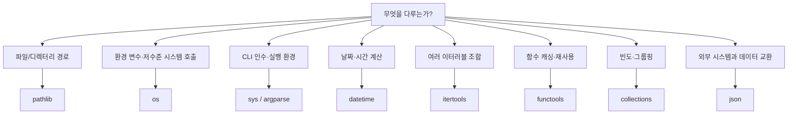

# 11. 표준 라이브러리

파이썬의 표준 라이브러리는 "배터리 포함(batteries included)" 철학에 따라 다양한 기능을 제공합니다.

## 학습 목표

이 챕터를 완료하면 다음을 할 수 있습니다:

- **os, sys** 모듈로 시스템 작업 수행
- **datetime, time** 모듈로 날짜와 시간 처리
- **collections** 모듈의 특수 자료구조 활용
- **itertools** 모듈로 반복자 도구 사용
- **functools** 모듈로 함수형 프로그래밍 적용

## 핵심 개념(이론)

### 1) 표준 라이브러리의 역할과 경계
이 챕터의 핵심은 “무엇을 할 수 있나”가 아니라, **어떤 문제를 해결하고 어디까지 책임지는지**를 분명히 하는 것입니다.
경계가 흐리면 코드는 커질수록 결합이 늘어나고 수정 비용이 커집니다.

### 2) 왜 이 개념이 필요한가(실무 동기)
실무에서는 예외 상황, 성능, 협업, 테스트가 항상 문제를 만듭니다.
따라서 이 주제는 기능이 아니라 **품질(신뢰성/유지보수성/보안)**을 위한 기반으로 이해해야 합니다.

### 3) 트레이드오프: 간단함 vs 확장성
대부분의 선택은 “더 단순하게”와 “더 확장 가능하게” 사이에서 균형을 잡는 일입니다.
초기에는 단순함을, 장기 운영/팀 협업이 커질수록 확장성을 더 우선합니다.

### 4) 실패 모드(Failure Modes)를 먼저 생각하라
무엇이 실패하는지(입력, I/O, 동시성, 외부 시스템)를 먼저 떠올리면 설계가 안정적으로 변합니다.
이 챕터의 예제는 실패 모드를 축소해서 보여주므로, 실제 적용 시에는 더 많은 방어가 필요합니다.

### 5) 학습 포인트: 외우지 말고 “판단 기준”을 남겨라
핵심은 API를 외우는 것이 아니라, “언제 무엇을 선택할지” 판단 기준을 정리하는 것입니다.
이 기준이 쌓이면 새로운 라이브러리/도구가 나와도 빠르게 적응할 수 있습니다.

## 선택 기준(Decision Guide)
- 기본은 **가독성/명확성** 우선(최적화는 측정 이후).
- 외부 의존이 늘수록 **경계/추상화**와 **테스트**를 먼저 강화.
- 복잡도가 증가하면 “규칙을 코드로”가 아니라 “구조로” 담는 방향을 고려.

## 흔한 오해/주의점
- 도구/문법이 곧 실력이라는 오해가 있습니다. 실력은 문제를 단순화하고 구조화하는 능력입니다.
- 극단적 최적화/과설계는 학습과 유지보수를 방해할 수 있습니다.

## 요약
- 표준 라이브러리는 기능이 아니라 구조/품질을 위한 기반이다.
- 트레이드오프와 실패 모드를 먼저 생각하고, 판단 기준을 남기자.

## 핵심 내용

### 모듈 선택 기준

표준 라이브러리 모듈은 서로 기능이 겹치는 것처럼 보이지만, 각자 책임지는 계층이 다르기 때문에 "무엇을 다루는가"를 먼저 물으면 선택이 쉬워진다. 파일·디렉터리 경로를 값 객체로 다룰 때는 `pathlib`을 기본으로 쓰고, 환경 변수·프로세스·저수준 시스템 호출처럼 `pathlib`이 감싸지 않는 영역은 `os`가 담당한다. 인터프리터 자체의 실행 환경(커맨드라인 인수, 표준 입출력, 종료 코드, 플랫폼 정보)을 다룰 때는 `sys`를 쓰고, 그 인수를 사람이 쓰기 편한 옵션·도움말이 있는 CLI로 만들고 싶다면 `sys.argv`를 직접 파싱하는 대신 `argparse`로 넘어간다. 날짜·시간 계산과 포매팅은 `datetime`이 담당하며, 여러 이터러블을 메모리에 다 올리지 않고 조합·순회하고 싶다면 `itertools`를, 함수를 캐싱하거나 인수를 미리 고정하거나 누적 계산을 표현하고 싶다면 `functools`를 선택한다. 빈도 계산이나 그룹핑처럼 `dict`/`list`로 직접 구현하면 보일러플레이트가 늘어나는 패턴은 `collections`의 특수 자료구조가 대신 처리해 주고, 외부 시스템(API, 설정 파일)과 데이터를 주고받을 때는 `json`이 표준 선택지다. 아래 다이어그램은 이 판단 흐름을 요약한다.



### 시스템과 경로: os, sys, pathlib

세 모듈은 계층이 다르다. `os`는 운영체제 호출(환경 변수 조회, 프로세스 정보, 파일 디스크립터)에 집중하는 저수준 인터페이스이고, `pathlib`은 경로 자체를 문자열이 아닌 객체로 다루는 상위 계층이라 `/` 연산자로 경로를 조합하고 `.exists()`, `.glob()` 같은 메서드를 바로 호출할 수 있다. `sys`는 운영체제가 아니라 파이썬 인터프리터 자체(커맨드라인 인수, 표준 입출력, 실행 환경 정보)를 다루므로 앞의 둘과 역할이 겹치지 않는다. 새 코드에서 경로를 다룰 때는 `os.path.join`류의 문자열 결합보다 `pathlib.Path`를 기본으로 선택하는 것이 가독성과 크로스플랫폼 안전성 면에서 유리하다.

```python
import os
import sys
from pathlib import Path

# 환경 변수는 os.environ으로 읽되, 없을 때를 대비해 기본값을 지정한다
db_url = os.environ.get("DATABASE_URL", "sqlite:///local.db")
print(f"DB URL: {db_url}")

# 인터프리터 실행 환경 정보는 sys가 담당한다
print(f"cwd: {os.getcwd()}")
print(f"platform: {sys.platform}, python: {sys.version_info.major}.{sys.version_info.minor}")
print(f"script args: {sys.argv[1:]}")

# pathlib은 경로를 값 객체로 다뤄 os.path보다 읽기 쉬운 코드가 된다
config_path = Path.home() / ".config" / "myapp" / "settings.json"
print(f"config path: {config_path}")
print(f"exists: {config_path.exists()}, suffix: {config_path.suffix}")

# glob으로 조건에 맞는 파일만 뽑아낼 수 있다
project_root = Path(".")
py_files = list(project_root.glob("*.py"))
print(f"현재 폴더의 .py 파일 수: {len(py_files)}")
```

`sys.argv`를 직접 파싱하는 방식은 인수가 하나뿐인 즉석 스크립트에는 충분하지만, 옵션이 여러 개거나 도움말·타입 검증이 필요해지는 순간부터는 아래에서 다룰 `argparse`로 옮기는 편이 유지보수에 유리하다.

### 날짜와 시간: datetime

`datetime` 객체는 시간대 정보가 없는 **naive**와 시간대를 명시한 **aware** 두 종류로 나뉘며, 이 둘을 섞어서 비교하면 `TypeError`가 발생한다. 서버 로그나 여러 지역 사용자를 다루는 코드는 UTC 기준의 aware datetime을 기본값으로 삼는 것이 안전하다. 포매팅과 파싱은 `strftime`/`strptime`이 담당하고, 날짜 간 연산은 `timedelta`로 표현한다. 복잡한 시간대 변환(서머타임, IANA 타임존 이름)이 필요하면 표준 라이브러리의 `zoneinfo`(3.9+)나 외부 라이브러리 `dateutil`을 검토할 시점이다.

```python
from datetime import datetime, date, timedelta, timezone

# 현재 시각과 포매팅
now = datetime.now()
print(f"now: {now.isoformat()}")
print(f"formatted: {now.strftime('%Y년 %m월 %d일 %H:%M')}")

# 문자열을 날짜로 파싱하고 남은 기간을 계산한다
deadline = datetime.strptime("2026-08-15 18:00", "%Y-%m-%d %H:%M")
remaining = deadline - now
print(f"마감까지 {remaining.days}일 {remaining.seconds // 3600}시간 남음")

# 날짜 연산: 다음 월요일 구하기
today = date.today()
next_monday = today + timedelta(days=(7 - today.weekday()) % 7 or 7)
print(f"다음 월요일: {next_monday}")

# UTC를 명시한 aware datetime (naive와 섞으면 TypeError가 발생한다)
utc_now = datetime.now(timezone.utc)
print(f"UTC: {utc_now.isoformat()}")
```

### itertools로 반복자 조합하기

`itertools`는 중간 리스트를 만들지 않고 이터러블을 조합·변형하는 지연 평가(lazy) 도구 모음이다. `chain`은 여러 이터러블을 하나처럼 순회하고 싶을 때 리스트를 새로 만들지 않고 이어붙인다. `groupby`는 정렬된 데이터를 키 기준으로 연속된 구간별로 묶는데, **입력이 정렬돼 있지 않으면 같은 키가 여러 그룹으로 쪼개진다**는 점이 가장 흔한 함정이다. `combinations`는 순서를 따지지 않고 n개 중 k개를 뽑는 모든 조합을 생성하며, 순열이 필요하면 `permutations`를 대신 쓴다.

```python
from itertools import chain, groupby, combinations

# chain - 여러 이터러블을 하나처럼 순회
active_users = ["alice", "bob"]
pending_users = ["carol"]
for user in chain(active_users, pending_users):
    print(f"처리 대상: {user}")

# groupby - 정렬된 데이터를 키 기준으로 묶는다
records = [
    {"team": "backend", "name": "alice"},
    {"team": "backend", "name": "bob"},
    {"team": "frontend", "name": "carol"},
]
records.sort(key=lambda r: r["team"])
for team, members in groupby(records, key=lambda r: r["team"]):
    names = [m["name"] for m in members]
    print(f"{team}: {names}")

# combinations - 순서 없이 k개를 뽑는 모든 조합
players = ["A", "B", "C", "D"]
for pair in combinations(players, 2):
    print(f"매치업: {pair}")
```

### functools로 함수 재사용하기

`functools.reduce`는 시퀀스를 하나의 값으로 접는 범용 도구이지만, `sum`이나 `math.prod`처럼 더 명확한 대안이 있으면 그쪽을 우선하는 것이 가독성에 좋다. `lru_cache`는 순수 함수(같은 입력에 항상 같은 출력을 내는 함수)의 반복 호출 결과를 메모이제이션하는데, 동작 원리와 데코레이터로서의 세부 구조는 [13장 데코레이터](/post/python/python-decorators-closures-caching-logging-pattern-guide/)에서 다룬다. `partial`은 함수의 인수 일부를 미리 고정해 새 함수를 만들며, 콜백에 추가 인수를 넘겨야 하는 상황에서 람다 대신 쓰기 좋다.

```python
from functools import reduce, lru_cache, partial

# reduce - 누적 계산 (더 명확한 대안이 있으면 그것을 우선한다)
prices = [12000, 8500, 23000, 5000]
total = reduce(lambda acc, price: acc + price, prices, 0)
print(f"합계: {total}원 (같은 결과를 sum(prices)로도 얻을 수 있다)")

# lru_cache - 순수 함수의 반복 호출을 메모이제이션
@lru_cache(maxsize=None)
def fibonacci(n: int) -> int:
    return n if n < 2 else fibonacci(n - 1) + fibonacci(n - 2)

print(f"fibonacci(30) = {fibonacci(30)}")

# partial - 인수 일부를 미리 고정한 새 함수를 만든다
def send_notification(channel: str, user: str, message: str) -> str:
    return f"[{channel}] {user}: {message}"

notify_slack = partial(send_notification, "slack")
print(notify_slack("alice", "배포가 완료되었습니다"))
```

### collections의 특수 자료구조

`dict`와 `list`만으로도 대부분의 문제를 풀 수 있지만, 빈도 계산이나 그룹핑처럼 반복적으로 등장하는 패턴은 `collections`가 보일러플레이트를 대신 처리해 준다. `Counter`는 원소 빈도를 세고 `most_common()`으로 상위 항목을 바로 뽑아내며, 직접 `dict.get(key, 0) + 1` 패턴을 반복할 필요가 없다. `defaultdict`는 키가 없을 때 자동으로 기본값을 만들어 `if key not in d` 검사를 없애 준다. `namedtuple`은 필드 이름이 있는 불변 레코드가 필요할 때 `dict`보다 메모리를 덜 쓰면서 `.x`, `.y` 같은 속성 접근을 제공하며, 필드가 많고 메서드도 필요하면 `dataclass`로 넘어가는 것이 낫다.

```python
from collections import Counter, defaultdict, namedtuple

# Counter - 빈도 계산과 상위 항목 추출
text = "the quick brown fox jumps over the lazy dog the fox runs"
word_counts = Counter(text.split())
print(f"가장 흔한 단어 3개: {word_counts.most_common(3)}")

# defaultdict - 키가 없을 때 자동으로 기본값을 만들어 그룹핑 코드를 단순화
purchases_by_user = defaultdict(list)
for user, item in [("alice", "book"), ("bob", "pen"), ("alice", "notebook")]:
    purchases_by_user[user].append(item)
print(dict(purchases_by_user))

# namedtuple - 필드 이름이 있는 가벼운 불변 레코드
Point = namedtuple("Point", ["x", "y"])
p = Point(3, 4)
print(f"거리: {(p.x ** 2 + p.y ** 2) ** 0.5}")
```

### 데이터 교환: json

`json` 모듈은 파이썬 객체와 JSON 문자열을 오가는 표준 도구이며, 설정 파일 읽기·쓰기와 REST API 응답 처리에 가장 먼저 검토할 선택지다. `dumps`/`dump`는 직렬화, `loads`/`load`는 역직렬화를 담당하고, `ensure_ascii=False`를 지정하면 한글이 유니코드 이스케이프(`\uXXXX`) 대신 그대로 출력된다. `dataclass`와 함께 쓰면 `asdict()`로 딕셔너리로 변환한 뒤 그대로 `dumps`에 넘길 수 있어 반복적인 변환 코드를 줄인다.

```python
import json
from dataclasses import dataclass, asdict

@dataclass
class User:
    name: str
    age: int

user = User("alice", 30)

# 직렬화 - dataclass는 asdict()로 dict로 변환한 뒤 dumps에 넘긴다
payload = json.dumps(asdict(user), ensure_ascii=False, indent=2)
print(payload)

# 역직렬화
data = json.loads(payload)
restored = User(**data)
print(restored)
```

### 커맨드라인 도구: argparse

`sys.argv`를 직접 인덱싱해 인수를 읽는 방식은 옵션이 하나뿐인 즉석 스크립트에는 충분하지만, 옵션이 여러 개이거나 타입 검증·기본값·도움말이 필요해지면 코드가 금방 지저분해진다. `argparse`는 위치 인수(`path`)와 옵션 인수(`--top`)를 선언적으로 정의하고, `--help`를 자동으로 만들어 주며, 타입 변환과 잘못된 입력에 대한 오류 메시지까지 처리한다.

```python
import argparse

def build_parser() -> argparse.ArgumentParser:
    parser = argparse.ArgumentParser(description="디렉터리 통계 도구")
    parser.add_argument("path", type=str, help="분석할 디렉터리 경로")
    parser.add_argument("--top", type=int, default=5, help="상위 확장자 개수")
    parser.add_argument("--json", action="store_true", help="JSON으로 출력")
    return parser

if __name__ == "__main__":
    parser = build_parser()
    # 실제 CLI에서는 parse_args()를 인수 없이 호출해 sys.argv를 그대로 읽는다
    args = parser.parse_args(["--top", "3", "."])
    print(f"분석 경로: {args.path}, top: {args.top}, json 출력: {args.json}")
```

### 자주 하는 실수

아래 코드는 `groupby`와 `datetime` 비교에서 실제로 자주 발생하는 두 가지 오류를 재현한다. 두 경우 모두 "우연히 동작하는 코드"와 "항상 동작하는 코드"의 차이를 보여준다.

```python
from datetime import datetime, timezone
from itertools import groupby

# 실수 1: groupby는 입력이 정렬돼 있다고 가정한다. 정렬 없이 쓰면 같은 키가 여러 그룹으로 쪼개진다.
data = [("b", 1), ("a", 2), ("b", 3)]
wrong_groups = [(k, list(v)) for k, v in groupby(data, key=lambda x: x[0])]
print(f"정렬 없이 그룹핑 (그룹 수={len(wrong_groups)}): {wrong_groups}")

data.sort(key=lambda x: x[0])
correct_groups = [(k, list(v)) for k, v in groupby(data, key=lambda x: x[0])]
print(f"정렬 후 그룹핑 (그룹 수={len(correct_groups)}): {correct_groups}")

# 실수 2: naive datetime과 aware datetime을 비교하면 TypeError가 발생한다.
naive = datetime(2026, 7, 17, 9, 0)
aware = datetime(2026, 7, 17, 9, 0, tzinfo=timezone.utc)
try:
    naive < aware
except TypeError as e:
    print(f"비교 실패: {e}")
```

이 밖에도 실무에서 반복해서 마주치는 함정이 있다. `os.path` 문자열 결합 대신 `pathlib`의 `/` 연산자를 쓰면 운영체제별 구분자 문제를 신경 쓸 필요가 없다. `lru_cache`는 인수가 모두 해시 가능해야 하므로 리스트·딕셔너리 인수를 그대로 넘기면 `TypeError`가 발생하며, 이런 함수는 튜플처럼 불변 인수로 설계하거나 캐시 키를 직접 만들어야 한다. `json.dumps`는 `datetime` 객체를 그대로 직렬화하지 못하므로, 내보내기 전에 `isoformat()`으로 문자열화하거나 `default=str`을 지정해야 한다.

## 실습 프로젝트

### 프로젝트 1: 파일 시스템 리포트 도구

이 프로젝트는 `pathlib`로 디렉터리를 순회하고, `collections.Counter`로 확장자 빈도를 집계하며, `datetime`으로 오래된 파일을 찾아내고, `argparse`로 옵션을 받아 `json`으로 결과를 내보내는 CLI 도구다. 하나의 스크립트 안에서 이번 장에서 다룬 모듈 다섯 개가 각자의 역할대로 조합된다.

```python
import argparse
import json
from collections import Counter
from datetime import datetime, timedelta
from pathlib import Path


class FileSystemAnalyzer:
    """디렉터리를 순회해 파일 통계를 수집하고 리포트를 만든다."""

    def __init__(self, root, stale_days=90):
        self.root = Path(root).resolve()
        self.stale_days = stale_days
        self.extension_counts = Counter()
        self.stale_files = []
        self.total_files = 0
        self.total_dirs = 0

    def analyze(self):
        cutoff = datetime.now() - timedelta(days=self.stale_days)
        for entry in self.root.rglob("*"):
            if entry.is_file():
                self.total_files += 1
                self.extension_counts[entry.suffix.lower() or "(확장자 없음)"] += 1
                modified = datetime.fromtimestamp(entry.stat().st_mtime)
                if modified < cutoff:
                    self.stale_files.append(str(entry.relative_to(self.root)))
            elif entry.is_dir():
                self.total_dirs += 1

    def report(self, top=5):
        return {
            "root": str(self.root),
            "total_files": self.total_files,
            "total_directories": self.total_dirs,
            "top_extensions": self.extension_counts.most_common(top),
            "stale_file_count": len(self.stale_files),
            "stale_files_sample": self.stale_files[:10],
        }


def build_parser():
    parser = argparse.ArgumentParser(description="파일 시스템 통계 리포트 도구")
    parser.add_argument("path", nargs="?", default=".", help="분석할 디렉터리 (기본값: 현재 디렉터리)")
    parser.add_argument("--top", type=int, default=5, help="상위 확장자 개수")
    parser.add_argument("--stale-days", type=int, default=90, help="오래된 파일 기준(일)")
    parser.add_argument("--json", action="store_true", help="결과를 JSON 파일로 저장")
    return parser


def main(argv=None):
    args = build_parser().parse_args(argv)
    analyzer = FileSystemAnalyzer(args.path, stale_days=args.stale_days)
    analyzer.analyze()
    result = analyzer.report(top=args.top)

    if args.json:
        output_path = Path("report.json")
        output_path.write_text(json.dumps(result, ensure_ascii=False, indent=2), encoding="utf-8")
        print(f"리포트 저장: {output_path}")
    else:
        print(f"경로: {result['root']}")
        print(f"파일 {result['total_files']}개, 디렉터리 {result['total_directories']}개")
        print(f"상위 확장자: {result['top_extensions']}")
        print(f"{args.stale_days}일 이상 수정되지 않은 파일: {result['stale_file_count']}개")


if __name__ == "__main__":
    main([])
```

### 프로젝트 2: 로그 요약 CLI

이 프로젝트는 로그 한 줄을 `datetime.strptime`으로 파싱하고, `collections.Counter`로 레벨별 빈도를, `itertools.groupby`로 시간대별 건수를, `functools.reduce`로 누적 집계를 계산한 뒤 `argparse` 옵션에 따라 사람이 읽기 좋은 형태 또는 `json`으로 출력한다. 실제 로그 파일 대신 스크립트 안에 샘플 데이터를 두어 별도 파일 없이 그대로 실행할 수 있게 했다.

```python
import argparse
import json
from collections import Counter
from datetime import datetime
from functools import reduce
from itertools import groupby


SAMPLE_LOG_LINES = [
    "2026-07-10 09:12:03 INFO 서버 시작",
    "2026-07-10 09:15:41 ERROR DB 연결 실패",
    "2026-07-10 09:16:02 WARNING 재시도 중",
    "2026-07-10 10:02:11 INFO 요청 처리 완료",
    "2026-07-10 10:05:59 ERROR 타임아웃",
    "2026-07-10 11:20:30 INFO 배치 작업 시작",
]


def parse_line(line):
    date_part, time_part, level, *message_parts = line.split(" ")
    timestamp = datetime.strptime(f"{date_part} {time_part}", "%Y-%m-%d %H:%M:%S")
    return {"timestamp": timestamp, "level": level, "message": " ".join(message_parts)}


def summarize(lines):
    records = [parse_line(line) for line in lines]

    # collections.Counter - 레벨별 빈도
    level_counts = Counter(record["level"] for record in records)

    # itertools.groupby - 시간(hour) 단위로 그룹핑하려면 먼저 정렬해야 한다
    records.sort(key=lambda r: r["timestamp"].hour)
    hourly_counts = {
        hour: len(list(group))
        for hour, group in groupby(records, key=lambda r: r["timestamp"].hour)
    }

    # functools.reduce - ERROR 레벨 메시지 개수를 누적 계산
    error_total = reduce(
        lambda acc, record: acc + (1 if record["level"] == "ERROR" else 0),
        records,
        0,
    )

    return {
        "total_lines": len(records),
        "level_counts": dict(level_counts),
        "hourly_counts": hourly_counts,
        "error_total": error_total,
    }


def build_parser():
    parser = argparse.ArgumentParser(description="로그 요약 도구 (샘플 데이터 사용)")
    parser.add_argument("--json", action="store_true", help="결과를 JSON으로 출력")
    return parser


def main(argv=None):
    args = build_parser().parse_args(argv)
    result = summarize(SAMPLE_LOG_LINES)

    if args.json:
        print(json.dumps(result, ensure_ascii=False, indent=2))
    else:
        print(f"총 {result['total_lines']}줄, 레벨별: {result['level_counts']}")
        print(f"시간대별 로그 수: {result['hourly_counts']}")
        print(f"ERROR 총계: {result['error_total']}")


if __name__ == "__main__":
    main([])
```

## 체크리스트

### 시스템과 경로
- [ ] os와 pathlib의 역할 차이를 설명할 수 있다
- [ ] 환경 변수를 안전하게 읽고 기본값을 지정할 수 있다
- [ ] sys.argv/sys.platform으로 실행 환경 정보를 얻을 수 있다

### 날짜와 시간
- [ ] naive datetime과 aware datetime의 차이와 위험을 설명할 수 있다
- [ ] strftime/strptime으로 포매팅과 파싱을 할 수 있다
- [ ] timedelta로 날짜 연산을 할 수 있다

### 반복자와 함수형 도구
- [ ] itertools.chain/groupby/combinations를 상황에 맞게 선택할 수 있다
- [ ] groupby 사용 전 정렬이 필요한 이유를 설명할 수 있다
- [ ] functools.reduce/lru_cache/partial의 용도를 구분할 수 있다

### 자료구조와 데이터 교환
- [ ] collections.Counter/defaultdict로 그룹핑·집계 코드를 단순화할 수 있다
- [ ] json으로 데이터를 직렬화/역직렬화할 수 있다
- [ ] argparse로 옵션이 있는 CLI 도구를 만들 수 있다

## 다음 단계

🎉 **축하합니다!** 파이썬 표준 라이브러리를 마스터했습니다.

이제 [12. 정규표현식](/post/python/python-regex-re-module-pattern-matching-performance-guide/)로 넘어가서 텍스트 처리의 강력한 도구를 학습해봅시다.

---

💡 **팁:**
- 표준 라이브러리를 먼저 확인한 후 외부 라이브러리를 고려하세요
- 경로는 문자열 결합 대신 pathlib의 `/` 연산자를 우선 사용하세요
- 날짜와 시간 처리 시 naive와 aware datetime을 섞지 말고, 복잡한 시간대 변환이 필요하면 zoneinfo나 dateutil을 검토하세요
- itertools/functools는 가독성을 해치지 않는 선에서 사용하고, 단순 반복문이 더 명확하면 그것을 우선하세요
