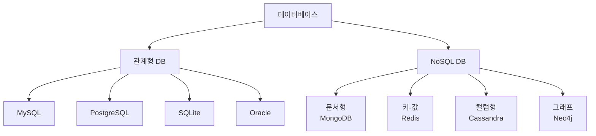

# 챕터 22: 데이터베이스

데이터베이스는 현대 애플리케이션의 핵심 구성 요소입니다. 파이썬에서는 다양한 데이터베이스 시스템과 연동할 수 있는 풍부한 라이브러리와 ORM 도구를 제공합니다. 이 챕터에서는 관계형 데이터베이스부터 NoSQL까지 다양한 데이터베이스 기술을 다룹니다.

## 학습 목표
- 다양한 데이터베이스 시스템을 이해할 수 있다
- SQL 쿼리를 파이썬에서 실행할 수 있다
- ORM을 활용한 객체-관계 매핑을 구현할 수 있다
- NoSQL 데이터베이스를 효과적으로 활용할 수 있다

## 핵심 개념(이론)

### 1) 데이터베이스의 역할과 경계
이 챕터의 핵심은 “무엇을 할 수 있나”가 아니라, **어떤 문제를 해결하고 어디까지 책임지는지**를 분명히 하는 것입니다.
경계가 흐리면 코드는 커질수록 결합이 늘어나고 수정 비용이 커집니다.

### 2) 왜 이 개념이 필요한가(실무 동기)
실무에서는 예외 상황, 성능, 협업, 테스트가 항상 문제를 만듭니다.
따라서 이 주제는 기능이 아니라 **품질(신뢰성/유지보수성/보안)**을 위한 기반으로 이해해야 합니다.

### 3) 트레이드오프: 간단함 vs 확장성
대부분의 선택은 “더 단순하게”와 “더 확장 가능하게” 사이에서 균형을 잡는 일입니다.
초기에는 단순함을, 장기 운영/팀 협업이 커질수록 확장성을 더 우선합니다.

### 4) 실패 모드(Failure Modes)를 먼저 생각하라
무엇이 실패하는지(입력, I/O, 동시성, 외부 시스템)를 먼저 떠올리면 설계가 안정적으로 변합니다.
이 챕터의 예제는 실패 모드를 축소해서 보여주므로, 실제 적용 시에는 더 많은 방어가 필요합니다.

### 5) 학습 포인트: 외우지 말고 “판단 기준”을 남겨라
핵심은 API를 외우는 것이 아니라, “언제 무엇을 선택할지” 판단 기준을 정리하는 것입니다.
이 기준이 쌓이면 새로운 라이브러리/도구가 나와도 빠르게 적응할 수 있습니다.

## 선택 기준(Decision Guide)
- 기본은 **가독성/명확성** 우선(최적화는 측정 이후).
- 외부 의존이 늘수록 **경계/추상화**와 **테스트**를 먼저 강화.
- 복잡도가 증가하면 “규칙을 코드로”가 아니라 “구조로” 담는 방향을 고려.

## 흔한 오해/주의점
- 도구/문법이 곧 실력이라는 오해가 있습니다. 실력은 문제를 단순화하고 구조화하는 능력입니다.
- 극단적 최적화/과설계는 학습과 유지보수를 방해할 수 있습니다.

## 요약
- 데이터베이스는 기능이 아니라 구조/품질을 위한 기반이다.
- 트레이드오프와 실패 모드를 먼저 생각하고, 판단 기준을 남기자.

## 데이터베이스 기초

### 데이터베이스 유형



### ACID 속성

```python
# ACID 속성 이해
# Atomicity (원자성): 모든 연산이 성공하거나 모두 실패
# Consistency (일관성): 데이터베이스는 항상 일관된 상태 유지
# Isolation (고립성): 동시 실행 트랜잭션들이 서로 영향 없음
# Durability (지속성): 커밋된 트랜잭션은 영구적으로 저장

import sqlite3

def transfer_money(from_account, to_account, amount):
    """계좌 이체 - ACID 속성 예제"""
    conn = sqlite3.connect('bank.db')
    cursor = conn.cursor()
    
    try:
        # 트랜잭션 시작
        cursor.execute("BEGIN")
        
        # 출금 계좌 잔액 확인
        cursor.execute(
            "SELECT balance FROM accounts WHERE id = ?", 
            (from_account,)
        )
        from_balance = cursor.fetchone()[0]
        
        if from_balance < amount:
            raise ValueError("잔액 부족")
        
        # 출금
        cursor.execute(
            "UPDATE accounts SET balance = balance - ? WHERE id = ?",
            (amount, from_account)
        )
        
        # 입금
        cursor.execute(
            "UPDATE accounts SET balance = balance + ? WHERE id = ?",
            (amount, to_account)
        )
        
        # 커밋
        conn.commit()
        print(f"이체 완료: {amount}원")
        
    except Exception as e:
        # 롤백
        conn.rollback()
        print(f"이체 실패: {e}")
        
    finally:
        conn.close()
```

## SQLite - 내장 데이터베이스

### 기본 연결과 CRUD 연산

```python
import sqlite3
from datetime import datetime

class SQLiteManager:
    def __init__(self, db_name):
        self.db_name = db_name
        self.init_database()
    
    def init_database(self):
        """데이터베이스 초기화"""
        with sqlite3.connect(self.db_name) as conn:
            cursor = conn.cursor()
            
            # 테이블 생성
            cursor.execute('''
                CREATE TABLE IF NOT EXISTS users (
                    id INTEGER PRIMARY KEY AUTOINCREMENT,
                    username TEXT UNIQUE NOT NULL,
                    email TEXT UNIQUE NOT NULL,
                    created_at TIMESTAMP DEFAULT CURRENT_TIMESTAMP
                )
            ''')
            
            cursor.execute('''
                CREATE TABLE IF NOT EXISTS posts (
                    id INTEGER PRIMARY KEY AUTOINCREMENT,
                    user_id INTEGER,
                    title TEXT NOT NULL,
                    content TEXT,
                    created_at TIMESTAMP DEFAULT CURRENT_TIMESTAMP,
                    FOREIGN KEY (user_id) REFERENCES users (id)
                )
            ''')
            
            conn.commit()
    
    def create_user(self, username, email):
        """사용자 생성"""
        try:
            with sqlite3.connect(self.db_name) as conn:
                cursor = conn.cursor()
                cursor.execute(
                    "INSERT INTO users (username, email) VALUES (?, ?)",
                    (username, email)
                )
                conn.commit()
                return cursor.lastrowid
        except sqlite3.IntegrityError:
            print("사용자명 또는 이메일이 이미 존재합니다.")
            return None
    
    def get_user(self, user_id):
        """사용자 조회"""
        with sqlite3.connect(self.db_name) as conn:
            cursor = conn.cursor()
            cursor.execute(
                "SELECT * FROM users WHERE id = ?", 
                (user_id,)
            )
            return cursor.fetchone()
    
    def update_user(self, user_id, **kwargs):
        """사용자 정보 업데이트"""
        if not kwargs:
            return
            
        fields = ", ".join([f"{key} = ?" for key in kwargs.keys()])
        values = list(kwargs.values()) + [user_id]
        
        with sqlite3.connect(self.db_name) as conn:
            cursor = conn.cursor()
            cursor.execute(
                f"UPDATE users SET {fields} WHERE id = ?",
                values
            )
            conn.commit()
    
    def delete_user(self, user_id):
        """사용자 삭제"""
        with sqlite3.connect(self.db_name) as conn:
            cursor = conn.cursor()
            cursor.execute("DELETE FROM users WHERE id = ?", (user_id,))
            conn.commit()
    
    def create_post(self, user_id, title, content):
        """게시글 생성"""
        with sqlite3.connect(self.db_name) as conn:
            cursor = conn.cursor()
            cursor.execute(
                "INSERT INTO posts (user_id, title, content) VALUES (?, ?, ?)",
                (user_id, title, content)
            )
            conn.commit()
            return cursor.lastrowid
    
    def get_user_posts(self, user_id):
        """사용자 게시글 조회"""
        with sqlite3.connect(self.db_name) as conn:
            cursor = conn.cursor()
            cursor.execute('''
                SELECT p.id, p.title, p.content, p.created_at, u.username
                FROM posts p
                JOIN users u ON p.user_id = u.id
                WHERE p.user_id = ?
                ORDER BY p.created_at DESC
            ''', (user_id,))
            return cursor.fetchall()

# 사용 예제
db = SQLiteManager("blog.db")

# 사용자 생성
user_id = db.create_user("john_doe", "john@example.com")
print(f"사용자 생성: ID {user_id}")

# 게시글 생성
post_id = db.create_post(user_id, "첫 번째 게시글", "안녕하세요!")
print(f"게시글 생성: ID {post_id}")

# 사용자 게시글 조회
posts = db.get_user_posts(user_id)
for post in posts:
    print(f"게시글: {post[1]} - {post[2]}")
```

### 고급 SQL 쿼리

```python
import sqlite3
import json

class AdvancedSQLiteManager:
    def __init__(self, db_name):
        self.db_name = db_name
        self.setup_database()
    
    def setup_database(self):
        """데이터베이스 설정"""
        with sqlite3.connect(self.db_name) as conn:
            cursor = conn.cursor()
            
            # 제품 테이블
            cursor.execute('''
                CREATE TABLE IF NOT EXISTS products (
                    id INTEGER PRIMARY KEY,
                    name TEXT NOT NULL,
                    category TEXT NOT NULL,
                    price DECIMAL(10,2) NOT NULL,
                    stock INTEGER DEFAULT 0,
                    tags TEXT  -- JSON 형태로 저장
                )
            ''')
            
            # 주문 테이블
            cursor.execute('''
                CREATE TABLE IF NOT EXISTS orders (
                    id INTEGER PRIMARY KEY,
                    customer_name TEXT NOT NULL,
                    order_date DATE DEFAULT CURRENT_DATE,
                    total_amount DECIMAL(10,2) DEFAULT 0
                )
            ''')
            
            # 주문 상세 테이블
            cursor.execute('''
                CREATE TABLE IF NOT EXISTS order_items (
                    id INTEGER PRIMARY KEY,
                    order_id INTEGER,
                    product_id INTEGER,
                    quantity INTEGER NOT NULL,
                    unit_price DECIMAL(10,2) NOT NULL,
                    FOREIGN KEY (order_id) REFERENCES orders (id),
                    FOREIGN KEY (product_id) REFERENCES products (id)
                )
            ''')
            
            # 인덱스 생성
            cursor.execute(
                "CREATE INDEX IF NOT EXISTS idx_products_category ON products(category)"
            )
            cursor.execute(
                "CREATE INDEX IF NOT EXISTS idx_orders_date ON orders(order_date)"
            )
            
            conn.commit()
    
    def add_sample_data(self):
        """샘플 데이터 추가"""
        with sqlite3.connect(self.db_name) as conn:
            cursor = conn.cursor()
            
            # 제품 데이터
            products = [
                ("노트북", "전자제품", 1500000, 10, json.dumps(["컴퓨터", "업무용"])),
                ("마우스", "전자제품", 50000, 25, json.dumps(["컴퓨터", "액세서리"])),
                ("키보드", "전자제품", 120000, 15, json.dumps(["컴퓨터", "액세서리"])),
                ("모니터", "전자제품", 300000, 8, json.dumps(["컴퓨터", "디스플레이"])),
                ("책상", "가구", 200000, 5, json.dumps(["가구", "사무용품"])),
            ]
            
            cursor.executemany(
                "INSERT OR IGNORE INTO products (name, category, price, stock, tags) VALUES (?, ?, ?, ?, ?)",
                products
            )
            
            conn.commit()
    
    def complex_queries(self):
        """복잡한 쿼리 예제"""
        with sqlite3.connect(self.db_name) as conn:
            cursor = conn.cursor()
            
            # 1. 집계 함수 사용
            print("=== 카테고리별 제품 통계 ===")
            cursor.execute('''
                SELECT 
                    category,
                    COUNT(*) as product_count,
                    AVG(price) as avg_price,
                    MIN(price) as min_price,
                    MAX(price) as max_price,
                    SUM(stock) as total_stock
                FROM products
                GROUP BY category
                ORDER BY avg_price DESC
            ''')
            
            for row in cursor.fetchall():
                print(f"카테고리: {row[0]}")
                print(f"  제품 수: {row[1]}")
                print(f"  평균 가격: {row[2]:,.0f}원")
                print(f"  가격 범위: {row[3]:,.0f}원 ~ {row[4]:,.0f}원")
                print(f"  총 재고: {row[5]}")
                print()
            
            # 2. 윈도우 함수 사용 (SQLite 3.25+)
            print("=== 가격 순위 ===")
            cursor.execute('''
                SELECT 
                    name,
                    category,
                    price,
                    RANK() OVER (ORDER BY price DESC) as price_rank,
                    RANK() OVER (PARTITION BY category ORDER BY price DESC) as category_rank
                FROM products
                ORDER BY price DESC
            ''')
            
            for row in cursor.fetchall():
                print(f"{row[0]} ({row[1]}): {row[2]:,.0f}원 (전체 {row[3]}위, 카테고리 {row[4]}위)")
            
            # 3. JSON 함수 사용
            print("\n=== 태그별 제품 검색 ===")
            cursor.execute('''
                SELECT name, category, tags
                FROM products
                WHERE tags LIKE '%컴퓨터%'
            ''')
            
            for row in cursor.fetchall():
                tags = json.loads(row[2])
                print(f"{row[0]} ({row[1]}): {', '.join(tags)}")

# 사용 예제
manager = AdvancedSQLiteManager("advanced.db")
manager.add_sample_data()
manager.complex_queries()
```

## SQLAlchemy ORM

### 모델 정의

```python
from sqlalchemy import create_engine, Column, Integer, String, DateTime, ForeignKey, Text, Boolean
from sqlalchemy.ext.declarative import declarative_base
from sqlalchemy.orm import sessionmaker, relationship
from datetime import datetime

Base = declarative_base()

class User(Base):
    __tablename__ = 'users'
    
    id = Column(Integer, primary_key=True)
    username = Column(String(80), unique=True, nullable=False)
    email = Column(String(120), unique=True, nullable=False)
    created_at = Column(DateTime, default=datetime.utcnow)
    is_active = Column(Boolean, default=True)
    
    # 관계 정의
    posts = relationship("Post", back_populates="author", cascade="all, delete-orphan")
    
    def __repr__(self):
        return f'<User {self.username}>'

class Post(Base):
    __tablename__ = 'posts'
    
    id = Column(Integer, primary_key=True)
    title = Column(String(200), nullable=False)
    content = Column(Text)
    created_at = Column(DateTime, default=datetime.utcnow)
    user_id = Column(Integer, ForeignKey('users.id'), nullable=False)
    
    # 관계 정의
    author = relationship("User", back_populates="posts")
    
    def __repr__(self):
        return f'<Post {self.title}>'

# 데이터베이스 설정
engine = create_engine('sqlite:///blog_orm.db', echo=True)
Base.metadata.create_all(engine)

Session = sessionmaker(bind=engine)
session = Session()
```

### CRUD 연산 (ORM)

```python
from sqlalchemy.orm import Session
from sqlalchemy import and_, or_, func

class BlogService:
    def __init__(self, session: Session):
        self.session = session
    
    def create_user(self, username: str, email: str) -> User:
        """사용자 생성"""
        user = User(username=username, email=email)
        self.session.add(user)
        self.session.commit()
        return user
    
    def get_user_by_id(self, user_id: int) -> User:
        """ID로 사용자 조회"""
        return self.session.query(User).filter(User.id == user_id).first()
    
    def get_user_by_username(self, username: str) -> User:
        """사용자명으로 사용자 조회"""
        return self.session.query(User).filter(User.username == username).first()
    
    def update_user(self, user_id: int, **kwargs) -> User:
        """사용자 정보 업데이트"""
        user = self.get_user_by_id(user_id)
        if user:
            for key, value in kwargs.items():
                setattr(user, key, value)
            self.session.commit()
        return user
    
    def delete_user(self, user_id: int) -> bool:
        """사용자 삭제"""
        user = self.get_user_by_id(user_id)
        if user:
            self.session.delete(user)
            self.session.commit()
            return True
        return False
    
    def create_post(self, user_id: int, title: str, content: str) -> Post:
        """게시글 생성"""
        post = Post(user_id=user_id, title=title, content=content)
        self.session.add(post)
        self.session.commit()
        return post
    
    def get_posts_by_user(self, user_id: int) -> list:
        """사용자의 게시글 조회"""
        return self.session.query(Post).filter(Post.user_id == user_id).all()
    
    def search_posts(self, keyword: str) -> list:
        """게시글 검색"""
        return (self.session.query(Post)
                .filter(or_(
                    Post.title.contains(keyword),
                    Post.content.contains(keyword)
                ))
                .all())
    
    def get_user_stats(self):
        """사용자 통계"""
        stats = (self.session.query(
                    User.username,
                    func.count(Post.id).label('post_count')
                )
                .outerjoin(Post)
                .group_by(User.id)
                .all())
        return stats
    
    def get_recent_posts(self, limit: int = 10):
        """최근 게시글"""
        return (self.session.query(Post)
                .order_by(Post.created_at.desc())
                .limit(limit)
                .all())

# 사용 예제
service = BlogService(session)

# 사용자 생성
user = service.create_user("alice", "alice@example.com")
print(f"사용자 생성: {user}")

# 게시글 생성
post = service.create_post(user.id, "SQLAlchemy 튜토리얼", "ORM 사용법을 알아보자!")
print(f"게시글 생성: {post}")

# 통계 조회
stats = service.get_user_stats()
for username, post_count in stats:
    print(f"{username}: {post_count}개 게시글")

# 검색
results = service.search_posts("SQLAlchemy")
print(f"검색 결과: {len(results)}개")
```

## Redis - NoSQL 데이터베이스

```python
import redis
import json
from datetime import datetime, timedelta

class RedisManager:
    def __init__(self, host='localhost', port=6379, db=0):
        self.redis_client = redis.Redis(host=host, port=port, db=db, decode_responses=True)
    
    def set_user_session(self, user_id: str, session_data: dict, expire_seconds: int = 3600):
        """사용자 세션 저장"""
        session_key = f"session:{user_id}"
        self.redis_client.setex(
            session_key, 
            expire_seconds, 
            json.dumps(session_data)
        )
    
    def get_user_session(self, user_id: str) -> dict:
        """사용자 세션 조회"""
        session_key = f"session:{user_id}"
        session_data = self.redis_client.get(session_key)
        return json.loads(session_data) if session_data else None
    
    def cache_user_data(self, user_id: str, user_data: dict, expire_seconds: int = 300):
        """사용자 데이터 캐싱"""
        cache_key = f"user_cache:{user_id}"
        self.redis_client.setex(
            cache_key,
            expire_seconds,
            json.dumps(user_data)
        )
    
    def get_cached_user_data(self, user_id: str) -> dict:
        """캐시된 사용자 데이터 조회"""
        cache_key = f"user_cache:{user_id}"
        cached_data = self.redis_client.get(cache_key)
        return json.loads(cached_data) if cached_data else None
    
    def add_to_leaderboard(self, user_id: str, score: float):
        """리더보드에 점수 추가"""
        self.redis_client.zadd("leaderboard", {user_id: score})
    
    def get_leaderboard(self, limit: int = 10) -> list:
        """리더보드 조회"""
        return self.redis_client.zrevrange("leaderboard", 0, limit-1, withscores=True)
    
    def publish_message(self, channel: str, message: str):
        """메시지 발행"""
        self.redis_client.publish(channel, message)
    
    def subscribe_to_channel(self, channel: str):
        """채널 구독"""
        pubsub = self.redis_client.pubsub()
        pubsub.subscribe(channel)
        return pubsub
    
    def rate_limit_check(self, user_id: str, limit: int = 10, window_seconds: int = 60) -> bool:
        """요청 제한 확인"""
        key = f"rate_limit:{user_id}"
        current_time = datetime.now()
        
        # 슬라이딩 윈도우 방식
        pipe = self.redis_client.pipeline()
        pipe.zremrangebyscore(key, 0, current_time.timestamp() - window_seconds)
        pipe.zcard(key)
        pipe.zadd(key, {str(current_time.timestamp()): current_time.timestamp()})
        pipe.expire(key, window_seconds)
        
        results = pipe.execute()
        request_count = results[1]
        
        return request_count < limit

# 사용 예제
redis_manager = RedisManager()

# 세션 관리
session_data = {
    "user_id": "123",
    "username": "alice",
    "login_time": datetime.now().isoformat()
}
redis_manager.set_user_session("123", session_data)

# 캐시 사용
user_data = {"name": "Alice", "email": "alice@example.com"}
redis_manager.cache_user_data("123", user_data)

# 리더보드
redis_manager.add_to_leaderboard("alice", 1500)
redis_manager.add_to_leaderboard("bob", 1200)
leaderboard = redis_manager.get_leaderboard()
print(f"리더보드: {leaderboard}")

# 요청 제한
is_allowed = redis_manager.rate_limit_check("123")
print(f"요청 허용: {is_allowed}")
```

## 실습 프로젝트

### 프로젝트 1: 완전한 블로그 시스템

```python
from flask import Flask, request, jsonify, render_template_string
from sqlalchemy import create_engine, Column, Integer, String, DateTime, ForeignKey, Text
from sqlalchemy.ext.declarative import declarative_base
from sqlalchemy.orm import sessionmaker, relationship
from datetime import datetime
import redis
import json

app = Flask(__name__)

# 데이터베이스 설정
engine = create_engine('sqlite:///complete_blog.db')
Base = declarative_base()
Session = sessionmaker(bind=engine)

# Redis 설정 (선택사항)
try:
    redis_client = redis.Redis(host='localhost', port=6379, db=0, decode_responses=True)
    redis_client.ping()  # 연결 테스트
    USE_REDIS = True
except:
    USE_REDIS = False
    print("Redis 연결 실패 - 캐시 기능 비활성화")

# 모델 정의
class User(Base):
    __tablename__ = 'users'
    id = Column(Integer, primary_key=True)
    username = Column(String(80), unique=True, nullable=False)
    email = Column(String(120), unique=True, nullable=False)
    created_at = Column(DateTime, default=datetime.utcnow)
    posts = relationship("Post", back_populates="author")

class Post(Base):
    __tablename__ = 'posts'
    id = Column(Integer, primary_key=True)
    title = Column(String(200), nullable=False)
    content = Column(Text)
    created_at = Column(DateTime, default=datetime.utcnow)
    user_id = Column(Integer, ForeignKey('users.id'))
    author = relationship("User", back_populates="posts")

Base.metadata.create_all(engine)

class BlogAPI:
    def __init__(self):
        self.session = Session()
    
    def create_user(self, username, email):
        user = User(username=username, email=email)
        self.session.add(user)
        self.session.commit()
        return user
    
    def get_user(self, user_id):
        # 캐시 확인
        if USE_REDIS:
            cached_user = redis_client.get(f"user:{user_id}")
            if cached_user:
                return json.loads(cached_user)
        
        # 데이터베이스에서 조회
        user = self.session.query(User).get(user_id)
        if user:
            user_data = {
                'id': user.id,
                'username': user.username,
                'email': user.email,
                'created_at': user.created_at.isoformat()
            }
            # 캐시에 저장 (5분)
            if USE_REDIS:
                redis_client.setex(f"user:{user_id}", 300, json.dumps(user_data))
            return user_data
        return None
    
    def create_post(self, user_id, title, content):
        post = Post(user_id=user_id, title=title, content=content)
        self.session.add(post)
        self.session.commit()
        
        # 캐시 무효화
        if USE_REDIS:
            redis_client.delete(f"user_posts:{user_id}")
            redis_client.delete("recent_posts")
        return post
    
    def get_posts(self, user_id=None, limit=10):
        if user_id:
            cache_key = f"user_posts:{user_id}"
        else:
            cache_key = "recent_posts"
        
        # 캐시 확인
        if USE_REDIS:
            cached_posts = redis_client.get(cache_key)
            if cached_posts:
                return json.loads(cached_posts)
        
        # 데이터베이스에서 조회
        query = self.session.query(Post)
        if user_id:
            query = query.filter(Post.user_id == user_id)
        
        posts = query.order_by(Post.created_at.desc()).limit(limit).all()
        posts_data = [{
            'id': post.id,
            'title': post.title,
            'content': post.content,
            'created_at': post.created_at.isoformat(),
            'author': post.author.username
        } for post in posts]
        
        # 캐시에 저장 (2분)
        if USE_REDIS:
            redis_client.setex(cache_key, 120, json.dumps(posts_data))
        return posts_data

blog_api = BlogAPI()

# REST API 엔드포인트
@app.route('/api/users', methods=['POST'])
def create_user():
    data = request.json
    try:
        user = blog_api.create_user(data['username'], data['email'])
        return jsonify({'id': user.id, 'username': user.username})
    except Exception as e:
        return jsonify({'error': str(e)}), 400

@app.route('/api/users/<int:user_id>')
def get_user(user_id):
    user = blog_api.get_user(user_id)
    if user:
        return jsonify(user)
    return jsonify({'error': 'User not found'}), 404

@app.route('/api/posts', methods=['POST'])
def create_post():
    data = request.json
    try:
        post = blog_api.create_post(data['user_id'], data['title'], data['content'])
        return jsonify({'id': post.id, 'title': post.title})
    except Exception as e:
        return jsonify({'error': str(e)}), 400

@app.route('/api/posts')
def get_posts():
    user_id = request.args.get('user_id', type=int)
    limit = request.args.get('limit', 10, type=int)
    posts = blog_api.get_posts(user_id, limit)
    return jsonify(posts)

# 웹 인터페이스
@app.route('/')
def index():
    return render_template_string('''
    <!DOCTYPE html>
    <html>
    <head>
        <title>블로그 시스템</title>
        <style>
            body { font-family: Arial, sans-serif; max-width: 800px; margin: 0 auto; padding: 20px; }
            .post { border: 1px solid #ddd; padding: 15px; margin: 10px 0; border-radius: 5px; }
            .form-group { margin: 10px 0; }
            input, textarea { width: 100%; padding: 8px; box-sizing: border-box; }
            button { background: #007bff; color: white; padding: 10px 20px; border: none; cursor: pointer; border-radius: 3px; }
            button:hover { background: #0056b3; }
            .error { color: red; margin: 10px 0; }
            .success { color: green; margin: 10px 0; }
        </style>
    </head>
    <body>
        <h1>블로그 시스템</h1>
        
        <div id="messages"></div>
        
        <h2>사용자 생성</h2>
        <div class="form-group">
            <input type="text" id="username" placeholder="사용자명">
        </div>
        <div class="form-group">
            <input type="email" id="email" placeholder="이메일">
        </div>
        <button onclick="createUser()">사용자 생성</button>
        
        <h2>게시글 작성</h2>
        <div class="form-group">
            <input type="number" id="user_id" placeholder="사용자 ID">
        </div>
        <div class="form-group">
            <input type="text" id="title" placeholder="제목">
        </div>
        <div class="form-group">
            <textarea id="content" placeholder="내용" rows="4"></textarea>
        </div>
        <button onclick="createPost()">게시글 작성</button>
        
        <h2>최근 게시글</h2>
        <button onclick="loadPosts()">새로고침</button>
        <div id="posts"></div>
        
        <script>
            function showMessage(message, isError = false) {
                const messagesDiv = document.getElementById('messages');
                const messageDiv = document.createElement('div');
                messageDiv.className = isError ? 'error' : 'success';
                messageDiv.textContent = message;
                messagesDiv.appendChild(messageDiv);
                setTimeout(() => messageDiv.remove(), 3000);
            }
            
            async function createUser() {
                try {
                    const response = await fetch('/api/users', {
                        method: 'POST',
                        headers: {'Content-Type': 'application/json'},
                        body: JSON.stringify({
                            username: document.getElementById('username').value,
                            email: document.getElementById('email').value
                        })
                    });
                    
                    if (response.ok) {
                        const result = await response.json();
                        showMessage('사용자 생성됨: ID ' + result.id);
                        document.getElementById('username').value = '';
                        document.getElementById('email').value = '';
                    } else {
                        const error = await response.json();
                        showMessage('오류: ' + error.error, true);
                    }
                } catch (e) {
                    showMessage('네트워크 오류: ' + e.message, true);
                }
            }
            
            async function createPost() {
                try {
                    const response = await fetch('/api/posts', {
                        method: 'POST',
                        headers: {'Content-Type': 'application/json'},
                        body: JSON.stringify({
                            user_id: parseInt(document.getElementById('user_id').value),
                            title: document.getElementById('title').value,
                            content: document.getElementById('content').value
                        })
                    });
                    
                    if (response.ok) {
                        const result = await response.json();
                        showMessage('게시글 작성됨: ' + result.title);
                        document.getElementById('title').value = '';
                        document.getElementById('content').value = '';
                        loadPosts();
                    } else {
                        const error = await response.json();
                        showMessage('오류: ' + error.error, true);
                    }
                } catch (e) {
                    showMessage('네트워크 오류: ' + e.message, true);
                }
            }
            
            async function loadPosts() {
                try {
                    const response = await fetch('/api/posts');
                    const posts = await response.json();
                    const postsDiv = document.getElementById('posts');
                    
                    if (posts.length === 0) {
                        postsDiv.innerHTML = '<p>게시글이 없습니다.</p>';
                        return;
                    }
                    
                    postsDiv.innerHTML = posts.map(post => `
                        <div class="post">
                            <h3>${post.title}</h3>
                            <p>${post.content}</p>
                            <small>작성자: ${post.author} | 작성일: ${new Date(post.created_at).toLocaleString()}</small>
                        </div>
                    `).join('');
                } catch (e) {
                    showMessage('게시글 로드 오류: ' + e.message, true);
                }
            }
            
            // 페이지 로드 시 게시글 로드
            loadPosts();
        </script>
    </body>
    </html>
    ''')

if __name__ == '__main__':
    print("블로그 시스템 시작")
    print("Redis 캐시:", "사용" if USE_REDIS else "미사용")
    app.run(debug=True)
```

## 요약

이 챕터에서는 파이썬에서 다양한 데이터베이스를 활용하는 방법을 다뤘습니다:

1. **SQLite**: 내장 데이터베이스로 기본 SQL 연산과 고급 쿼리
2. **SQLAlchemy ORM**: 객체-관계 매핑으로 데이터베이스 추상화
3. **Redis**: NoSQL 데이터베이스로 캐싱과 세션 관리
4. **실무 패턴**: 캐싱, 세션 관리, API 구현

이러한 기술들을 조합하면 확장 가능하고 성능이 우수한 데이터 중심 애플리케이션을 구축할 수 있습니다.

## 체크리스트
- [ ] SQL 쿼리 작성 능력
- [ ] 데이터베이스 연동 구현
- [ ] ORM 모델 설계
- [ ] NoSQL 데이터베이스 활용
- [ ] 보안과 성능 고려

## 다음 단계
데이터베이스를 마스터했다면, 웹 개발과 프레임워크 활용을 학습합니다. 
