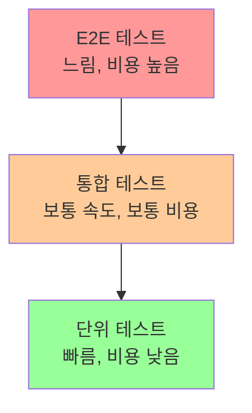

# 챕터 24: 테스팅과 디버깅

소프트웨어 개발에서 테스팅과 디버깅은 품질 보증의 핵심입니다. 파이썬은 다양한 테스팅 프레임워크와 디버깅 도구를 제공하여 견고하고 신뢰할 수 있는 코드를 작성할 수 있게 도와줍니다.

## 학습 목표
- 다양한 테스트 종류와 방법론을 이해할 수 있다
- 단위 테스트와 통합 테스트를 작성할 수 있다
- 효과적인 디버깅 기법을 활용할 수 있다
- 테스트 자동화와 CI/CD를 구축할 수 있다

## 1. 테스팅 기초

### 1.1 테스트 피라미드



### 1.2 TDD (Test-Driven Development)

```python
# TDD 사이클: Red -> Green -> Refactor

# 1. Red: 실패하는 테스트 작성
import unittest

class TestCalculator(unittest.TestCase):
    def test_add(self):
        calc = Calculator()
        result = calc.add(2, 3)
        self.assertEqual(result, 5)

# 2. Green: 테스트를 통과하는 최소한의 코드 작성
class Calculator:
    def add(self, a, b):
        return a + b

# 3. Refactor: 코드 개선
class Calculator:
    def add(self, a, b):
        """두 수를 더합니다."""
        if not isinstance(a, (int, float)) or not isinstance(b, (int, float)):
            raise TypeError("숫자만 입력 가능합니다")
        return a + b
    
    def subtract(self, a, b):
        """두 수를 뺍니다.""" 
        if not isinstance(a, (int, float)) or not isinstance(b, (int, float)):
            raise TypeError("숫자만 입력 가능합니다")
        return a - b
    
    def multiply(self, a, b):
        """두 수를 곱합니다."""
        if not isinstance(a, (int, float)) or not isinstance(b, (int, float)):
            raise TypeError("숫자만 입력 가능합니다")
        return a * b
    
    def divide(self, a, b):
        """두 수를 나눕니다."""
        if not isinstance(a, (int, float)) or not isinstance(b, (int, float)):
            raise TypeError("숫자만 입력 가능합니다")
        if b == 0:
            raise ValueError("0으로 나눌 수 없습니다")
        return a / b
```

## 2. unittest 모듈

### 2.1 기본 테스트 케이스

```python
import unittest
from datetime import datetime

class TestStringMethods(unittest.TestCase):
    
    def setUp(self):
        """각 테스트 메서드 실행 전에 호출됩니다."""
        self.test_string = "Hello World"
        self.test_list = [1, 2, 3, 4, 5]
    
    def tearDown(self):
        """각 테스트 메서드 실행 후에 호출됩니다."""
        pass
    
    def test_upper(self):
        """문자열 대문자 변환 테스트"""
        self.assertEqual(self.test_string.upper(), 'HELLO WORLD')
    
    def test_isupper(self):
        """대문자 판별 테스트"""
        self.assertTrue('HELLO'.isupper())
        self.assertFalse('Hello'.isupper())
    
    def test_split(self):
        """문자열 분할 테스트"""
        s = 'hello world'
        self.assertEqual(s.split(), ['hello', 'world'])
        
        # 컨텍스트 매니저를 사용한 예외 테스트
        with self.assertRaises(TypeError):
            s.split(2)
    
    def test_list_operations(self):
        """리스트 연산 테스트"""
        self.assertIn(3, self.test_list)
        self.assertNotIn(6, self.test_list)
        self.assertEqual(len(self.test_list), 5)
        
        # 근사값 비교
        self.assertAlmostEqual(22/7, 3.14, places=2)
    
    def test_custom_assertions(self):
        """사용자 정의 어설션"""
        # 사용자 정의 메시지
        self.assertTrue(len(self.test_string) > 5, 
                       f"문자열 길이가 5보다 작습니다: {len(self.test_string)}")

class TestCalculatorAdvanced(unittest.TestCase):
    
    @classmethod
    def setUpClass(cls):
        """클래스의 모든 테스트 실행 전에 한 번 호출됩니다."""
        print("계산기 테스트 시작")
        cls.calc = Calculator()
    
    @classmethod
    def tearDownClass(cls):
        """클래스의 모든 테스트 실행 후에 한 번 호출됩니다."""
        print("계산기 테스트 완료")
    
    def test_add_positive_numbers(self):
        """양수 덧셈 테스트"""
        result = self.calc.add(10, 20)
        self.assertEqual(result, 30)
    
    def test_add_negative_numbers(self):
        """음수 덧셈 테스트"""
        result = self.calc.add(-5, -3)
        self.assertEqual(result, -8)
    
    def test_divide_by_zero(self):
        """0으로 나누기 예외 테스트"""
        with self.assertRaises(ValueError) as context:
            self.calc.divide(10, 0)
        
        self.assertIn("0으로 나눌 수 없습니다", str(context.exception))
    
    def test_type_error(self):
        """타입 에러 테스트"""
        with self.assertRaises(TypeError):
            self.calc.add("10", 20)
    
    @unittest.skip("아직 구현되지 않은 기능")
    def test_power(self):
        """거듭제곱 테스트 (건너뛰기)"""
        pass
    
    @unittest.skipIf(datetime.now().weekday() == 6, "일요일에는 실행하지 않음")
    def test_conditional_skip(self):
        """조건부 건너뛰기"""
        self.assertTrue(True)

# 테스트 실행
if __name__ == '__main__':
    # 상세한 출력
    unittest.main(verbosity=2)
```

### 2.2 테스트 스위트와 러너

```python
import unittest

def create_test_suite():
    """사용자 정의 테스트 스위트 생성"""
    suite = unittest.TestSuite()
    
    # 특정 테스트 메서드만 추가
    suite.addTest(TestCalculatorAdvanced('test_add_positive_numbers'))
    suite.addTest(TestCalculatorAdvanced('test_divide_by_zero'))
    
    # 전체 테스트 클래스 추가
    suite.addTests(unittest.TestLoader().loadTestsFromTestCase(TestStringMethods))
    
    return suite

def run_custom_tests():
    """사용자 정의 테스트 실행"""
    runner = unittest.TextTestRunner(verbosity=2)
    suite = create_test_suite()
    result = runner.run(suite)
    
    print(f"\n테스트 결과:")
    print(f"실행된 테스트: {result.testsRun}")
    print(f"실패한 테스트: {len(result.failures)}")
    print(f"에러 테스트: {len(result.errors)}")

if __name__ == '__main__':
    run_custom_tests()
```

## 3. pytest 프레임워크

### 3.1 기본 사용법

```python
# test_pytest_example.py
import pytest
import math

# 간단한 테스트 함수
def test_math_operations():
    assert 2 + 2 == 4
    assert 3 * 3 == 9
    assert 10 / 2 == 5.0

def test_string_operations():
    text = "pytest"
    assert text.upper() == "PYTEST"
    assert len(text) == 6
    assert "py" in text

# 예외 테스트
def test_zero_division():
    with pytest.raises(ZeroDivisionError):
        1 / 0

def test_type_error():
    with pytest.raises(TypeError, match="unsupported operand"):
        "hello" + 123

# 근사값 테스트
def test_float_comparison():
    assert 0.1 + 0.2 == pytest.approx(0.3)
    assert math.pi == pytest.approx(3.14, abs=0.01)
```

### 3.2 픽스처 (Fixtures)

```python
import pytest
import tempfile
import os
from pathlib import Path

# 기본 픽스처
@pytest.fixture
def sample_data():
    """테스트 데이터 제공"""
    return {
        'users': ['alice', 'bob', 'charlie'],
        'scores': [85, 92, 78],
        'config': {'debug': True, 'version': '1.0'}
    }

# 함수 스코프 픽스처 (기본값)
@pytest.fixture(scope="function")
def temp_file():
    """임시 파일 생성"""
    with tempfile.NamedTemporaryFile(mode='w', delete=False) as f:
        f.write("테스트 데이터")
        temp_path = f.name
    
    yield temp_path  # 테스트에서 사용
    
    # 정리 작업
    os.unlink(temp_path)

# 클래스 스코프 픽스처
@pytest.fixture(scope="class")
def database_connection():
    """데이터베이스 연결 시뮬레이션"""
    print("\n데이터베이스 연결 생성")
    connection = {"status": "connected", "db": "test_db"}
    yield connection
    print("\n데이터베이스 연결 종료")

# 모듈 스코프 픽스처
@pytest.fixture(scope="module")
def expensive_resource():
    """비용이 많이 드는 리소스"""
    print("\n비용이 많이 드는 리소스 생성")
    resource = {"data": list(range(10000))}
    yield resource
    print("\n리소스 정리")

# 픽스처를 사용하는 테스트
def test_sample_data_users(sample_data):
    assert len(sample_data['users']) == 3
    assert 'alice' in sample_data['users']

def test_sample_data_scores(sample_data):
    assert max(sample_data['scores']) == 92
    assert min(sample_data['scores']) == 78

def test_temp_file_creation(temp_file):
    assert os.path.exists(temp_file)
    with open(temp_file, 'r') as f:
        content = f.read()
    assert content == "테스트 데이터"

class TestDatabaseOperations:
    def test_connection_status(self, database_connection):
        assert database_connection['status'] == 'connected'
    
    def test_database_name(self, database_connection):
        assert database_connection['db'] == 'test_db'

# 매개변수화된 테스트
@pytest.mark.parametrize("input,expected", [
    (2, 4),
    (3, 9),
    (4, 16),
    (5, 25)
])
def test_square_function(input, expected):
    def square(x):
        return x ** 2
    
    assert square(input) == expected

# 복합 매개변수
@pytest.mark.parametrize("a,b,expected", [
    (1, 2, 3),
    (10, 20, 30),
    (-1, 1, 0),
    (0, 0, 0)
])
def test_addition(a, b, expected):
    assert a + b == expected

# 조건부 건너뛰기
@pytest.mark.skipif(os.name == 'nt', reason="Windows에서는 실행하지 않음")
def test_unix_specific():
    assert os.name == 'posix'

# 예상 실패
@pytest.mark.xfail(reason="알려진 버그")
def test_known_bug():
    assert 1 == 2  # 이 테스트는 실패할 것으로 예상됨
```

### 3.3 conftest.py와 공유 픽스처

```python
# conftest.py - 프로젝트 전체에서 사용할 픽스처
import pytest
import sqlite3
from pathlib import Path

@pytest.fixture(scope="session")
def test_database():
    """테스트용 데이터베이스 생성"""
    db_path = Path("test.db")
    
    # 데이터베이스 생성 및 초기화
    conn = sqlite3.connect(db_path)
    cursor = conn.cursor()
    
    cursor.execute('''
        CREATE TABLE users (
            id INTEGER PRIMARY KEY,
            name TEXT NOT NULL,
            email TEXT UNIQUE NOT NULL
        )
    ''')
    
    # 테스트 데이터 삽입
    test_users = [
        ("Alice", "alice@example.com"),
        ("Bob", "bob@example.com"),
        ("Charlie", "charlie@example.com")
    ]
    
    cursor.executemany("INSERT INTO users (name, email) VALUES (?, ?)", test_users)
    conn.commit()
    conn.close()
    
    yield str(db_path)  # 테스트에서 사용할 데이터베이스 경로
    
    # 정리 작업
    if db_path.exists():
        db_path.unlink()

@pytest.fixture
def db_connection(test_database):
    """데이터베이스 연결 제공"""
    conn = sqlite3.connect(test_database)
    yield conn
    conn.close()

# 사용 예제 테스트
def test_user_count(db_connection):
    cursor = db_connection.cursor()
    cursor.execute("SELECT COUNT(*) FROM users")
    count = cursor.fetchone()[0]
    assert count == 3

def test_user_names(db_connection):
    cursor = db_connection.cursor()
    cursor.execute("SELECT name FROM users ORDER BY name")
    names = [row[0] for row in cursor.fetchall()]
    assert names == ["Alice", "Bob", "Charlie"]
```

## 4. 모킹과 패칭

### 4.1 unittest.mock 기본

```python
import unittest
from unittest.mock import Mock, MagicMock, patch
import requests

# 모킹할 대상 클래스
class EmailService:
    def send_email(self, to, subject, body):
        # 실제로는 이메일을 발송하는 코드
        print(f"이메일 발송: {to} - {subject}")
        return True

class UserService:
    def __init__(self, email_service):
        self.email_service = email_service
    
    def register_user(self, username, email):
        # 사용자 등록 로직
        user_data = {"username": username, "email": email, "id": 123}
        
        # 환영 이메일 발송
        self.email_service.send_email(
            email, 
            "환영합니다!", 
            f"안녕하세요 {username}님, 회원가입을 환영합니다!"
        )
        
        return user_data

class TestMocking(unittest.TestCase):
    
    def test_mock_basic(self):
        """기본 Mock 사용법"""
        # Mock 객체 생성
        mock_email = Mock()
        
        # Mock 객체 설정
        mock_email.send_email.return_value = True
        
        # 테스트 대상 코드 실행
        user_service = UserService(mock_email)
        result = user_service.register_user("alice", "alice@example.com")
        
        # 결과 검증
        self.assertEqual(result["username"], "alice")
        
        # Mock 호출 검증
        mock_email.send_email.assert_called_once_with(
            "alice@example.com",
            "환영합니다!",
            "안녕하세요 alice님, 회원가입을 환영합니다!"
        )
    
    def test_mock_side_effect(self):
        """side_effect 사용"""
        mock_email = Mock()
        
        # 예외를 발생시키는 Mock
        mock_email.send_email.side_effect = Exception("이메일 서버 오류")
        
        user_service = UserService(mock_email)
        
        # 예외가 발생하는지 확인
        with self.assertRaises(Exception):
            user_service.register_user("bob", "bob@example.com")
    
    def test_mock_call_count(self):
        """Mock 호출 횟수 검증"""
        mock_email = MagicMock()
        user_service = UserService(mock_email)
        
        # 여러 번 호출
        user_service.register_user("alice", "alice@example.com")
        user_service.register_user("bob", "bob@example.com")
        
        # 호출 횟수 검증
        self.assertEqual(mock_email.send_email.call_count, 2)
        
        # 모든 호출 검증
        expected_calls = [
            unittest.mock.call("alice@example.com", "환영합니다!", "안녕하세요 alice님, 회원가입을 환영합니다!"),
            unittest.mock.call("bob@example.com", "환영합니다!", "안녕하세요 bob님, 회원가입을 환영합니다!")
        ]
        mock_email.send_email.assert_has_calls(expected_calls)

# 외부 API 호출을 모킹하는 예제
class WeatherService:
    def get_weather(self, city):
        """외부 API에서 날씨 정보를 가져옵니다."""
        url = f"http://api.weather.com/v1/weather/{city}"
        response = requests.get(url)
        return response.json()
    
    def get_weather_summary(self, city):
        """날씨 요약 정보를 반환합니다."""
        try:
            weather_data = self.get_weather(city)
            return f"{city}: {weather_data['description']}, {weather_data['temperature']}°C"
        except Exception as e:
            return f"날씨 정보를 가져올 수 없습니다: {e}"

class TestWeatherService(unittest.TestCase):
    
    @patch('requests.get')
    def test_get_weather_success(self, mock_get):
        """성공적인 날씨 API 호출 테스트"""
        # Mock 응답 설정
        mock_response = Mock()
        mock_response.json.return_value = {
            "description": "맑음",
            "temperature": 25
        }
        mock_get.return_value = mock_response
        
        # 테스트 실행
        weather_service = WeatherService()
        result = weather_service.get_weather_summary("서울")
        
        # 결과 검증
        self.assertEqual(result, "서울: 맑음, 25°C")
        
        # API 호출 검증
        mock_get.assert_called_once_with("http://api.weather.com/v1/weather/서울")
    
    @patch('requests.get')
    def test_get_weather_failure(self, mock_get):
        """날씨 API 호출 실패 테스트"""
        # Mock이 예외를 발생시키도록 설정
        mock_get.side_effect = requests.exceptions.RequestException("네트워크 오류")
        
        weather_service = WeatherService()
        result = weather_service.get_weather_summary("서울")
        
        # 오류 처리 검증
        self.assertIn("날씨 정보를 가져올 수 없습니다", result)

if __name__ == '__main__':
    unittest.main()
```

## 5. 디버깅 기법

### 5.1 기본 디버깅 방법

```python
import logging
import traceback
from datetime import datetime

# 로깅 설정
logging.basicConfig(
    level=logging.DEBUG,
    format='%(asctime)s - %(name)s - %(levelname)s - %(message)s',
    handlers=[
        logging.FileHandler('debug.log'),
        logging.StreamHandler()
    ]
)

logger = logging.getLogger(__name__)

def buggy_function(numbers):
    """버그가 있는 함수 예제"""
    logger.debug(f"함수 시작: numbers={numbers}")
    
    total = 0
    for i, num in enumerate(numbers):
        logger.debug(f"반복 {i}: num={num}, total={total}")
        
        if num < 0:
            logger.warning(f"음수 발견: {num}")
        
        # 의도적인 버그: 0으로 나누기
        try:
            result = num / (num - 5)  # num이 5일 때 문제 발생
            total += result
            logger.debug(f"계산 결과: {result}, 누적 합계: {total}")
        except ZeroDivisionError:
            logger.error(f"0으로 나누기 오류: num={num}")
            logger.error(f"전체 스택 트레이스:\n{traceback.format_exc()}")
            raise
    
    logger.info(f"함수 완료: 최종 결과={total}")
    return total

# 디버깅 예제
def debug_example():
    test_data = [1, 2, 3, 4, 5, 6, 7]
    
    try:
        result = buggy_function(test_data)
        print(f"결과: {result}")
    except Exception as e:
        print(f"오류 발생: {e}")
        # 상세한 오류 정보 출력
        print("\n상세 오류 정보:")
        traceback.print_exc()

if __name__ == "__main__":
    debug_example()
```

### 5.2 pdb 디버거 사용

```python
import pdb

def calculate_factorial(n):
    """팩토리얼 계산 함수 (디버깅 포함)"""
    print(f"팩토리얼 계산 시작: n={n}")
    
    # 디버거 중단점 설정
    pdb.set_trace()
    
    if n < 0:
        raise ValueError("음수는 팩토리얼을 계산할 수 없습니다")
    
    if n == 0 or n == 1:
        return 1
    
    result = 1
    for i in range(2, n + 1):
        result *= i
        print(f"i={i}, result={result}")
    
    return result

def fibonacci_debug(n):
    """피보나치 수열 (디버깅 예제)"""
    if n <= 0:
        return 0
    elif n == 1:
        return 1
    
    # 조건부 중단점
    if n > 10:
        pdb.set_trace()
    
    a, b = 0, 1
    for i in range(2, n + 1):
        a, b = b, a + b
    
    return b

# 사용 예제
def pdb_example():
    print("pdb 디버거 예제")
    
    # 팩토리얼 계산
    try:
        result = calculate_factorial(5)
        print(f"5! = {result}")
    except Exception as e:
        print(f"오류: {e}")
    
    # 피보나치 수열
    fib_result = fibonacci_debug(15)
    print(f"fibonacci(15) = {fib_result}")

# pdb 명령어 가이드:
# n (next): 다음 줄 실행
# s (step): 함수 내부로 들어가기
# c (continue): 다음 중단점까지 실행
# l (list): 현재 코드 표시
# p <변수명>: 변수 값 출력
# pp <변수명>: 예쁘게 출력
# w (where): 현재 스택 트레이스 표시
# u (up): 상위 프레임으로 이동
# d (down): 하위 프레임으로 이동
# q (quit): 디버거 종료

if __name__ == "__main__":
    pdb_example()
```

### 5.3 고급 디버깅 도구

```python
import sys
import time
import functools
from contextlib import contextmanager

def debug_decorator(func):
    """함수 호출을 추적하는 데코레이터"""
    @functools.wraps(func)
    def wrapper(*args, **kwargs):
        print(f"🔍 호출: {func.__name__}")
        print(f"   인수: args={args}, kwargs={kwargs}")
        
        start_time = time.time()
        try:
            result = func(*args, **kwargs)
            end_time = time.time()
            print(f"✅ 완료: {func.__name__} (실행시간: {end_time - start_time:.4f}초)")
            print(f"   반환값: {result}")
            return result
        except Exception as e:
            end_time = time.time()
            print(f"❌ 오류: {func.__name__} (실행시간: {end_time - start_time:.4f}초)")
            print(f"   오류: {type(e).__name__}: {e}")
            raise
    return wrapper

@contextmanager
def debug_context(name):
    """디버깅 컨텍스트 매니저"""
    print(f"🚀 {name} 시작")
    start_time = time.time()
    try:
        yield
    except Exception as e:
        print(f"💥 {name}에서 오류 발생: {e}")
        raise
    finally:
        end_time = time.time()
        print(f"🏁 {name} 완료 (소요시간: {end_time - start_time:.4f}초)")

class DebugTracer:
    """코드 실행을 추적하는 클래스"""
    
    def __init__(self):
        self.indent_level = 0
    
    def trace_calls(self, frame, event, arg):
        """함수 호출 추적"""
        if event == 'call':
            func_name = frame.f_code.co_name
            filename = frame.f_code.co_filename
            line_no = frame.f_lineno
            
            indent = "  " * self.indent_level
            print(f"{indent}→ {func_name}() [{filename}:{line_no}]")
            self.indent_level += 1
            
        elif event == 'return':
            self.indent_level -= 1
            func_name = frame.f_code.co_name
            indent = "  " * self.indent_level
            print(f"{indent}← {func_name}() 반환: {arg}")
        
        return self.trace_calls
    
    def start_tracing(self):
        """추적 시작"""
        sys.settrace(self.trace_calls)
    
    def stop_tracing(self):
        """추적 중지"""
        sys.settrace(None)

# 사용 예제
@debug_decorator
def complex_calculation(x, y):
    """복잡한 계산 함수"""
    with debug_context("수학 연산"):
        result = x ** 2 + y ** 2
        intermediate = result * 0.5
        final = intermediate + 10
        return final

@debug_decorator
def recursive_fibonacci(n):
    """재귀 피보나치 (추적 예제)"""
    if n <= 1:
        return n
    return recursive_fibonacci(n-1) + recursive_fibonacci(n-2)

def tracing_example():
    """추적 예제"""
    tracer = DebugTracer()
    
    print("=== 일반 함수 호출 ===")
    result1 = complex_calculation(3, 4)
    print(f"결과: {result1}")
    
    print("\n=== 함수 호출 추적 ===")
    tracer.start_tracing()
    result2 = recursive_fibonacci(5)
    tracer.stop_tracing()
    print(f"피보나치 결과: {result2}")

if __name__ == "__main__":
    tracing_example()
```

## 6. 실습 프로젝트

### 프로젝트 1: TDD로 구현하는 계산기

```python
# test_calculator_tdd.py
import unittest
import math

class TestCalculatorTDD(unittest.TestCase):
    
    def setUp(self):
        self.calc = Calculator()
    
    # 기본 연산 테스트
    def test_add(self):
        self.assertEqual(self.calc.add(2, 3), 5)
        self.assertEqual(self.calc.add(-1, 1), 0)
        self.assertEqual(self.calc.add(0, 0), 0)
    
    def test_subtract(self):
        self.assertEqual(self.calc.subtract(5, 3), 2)
        self.assertEqual(self.calc.subtract(0, 5), -5)
    
    def test_multiply(self):
        self.assertEqual(self.calc.multiply(3, 4), 12)
        self.assertEqual(self.calc.multiply(-2, 3), -6)
        self.assertEqual(self.calc.multiply(0, 100), 0)
    
    def test_divide(self):
        self.assertEqual(self.calc.divide(10, 2), 5)
        self.assertEqual(self.calc.divide(7, 2), 3.5)
        
        with self.assertRaises(ValueError):
            self.calc.divide(10, 0)
    
    # 고급 연산 테스트
    def test_power(self):
        self.assertEqual(self.calc.power(2, 3), 8)
        self.assertEqual(self.calc.power(5, 0), 1)
        self.assertEqual(self.calc.power(2, -1), 0.5)
    
    def test_square_root(self):
        self.assertEqual(self.calc.square_root(9), 3)
        self.assertEqual(self.calc.square_root(16), 4)
        self.assertAlmostEqual(self.calc.square_root(2), math.sqrt(2), places=10)
        
        with self.assertRaises(ValueError):
            self.calc.square_root(-1)
    
    def test_factorial(self):
        self.assertEqual(self.calc.factorial(0), 1)
        self.assertEqual(self.calc.factorial(1), 1)
        self.assertEqual(self.calc.factorial(5), 120)
        
        with self.assertRaises(ValueError):
            self.calc.factorial(-1)
    
    # 메모리 기능 테스트
    def test_memory_operations(self):
        self.calc.memory_store(10)
        self.assertEqual(self.calc.memory_recall(), 10)
        
        self.calc.memory_add(5)
        self.assertEqual(self.calc.memory_recall(), 15)
        
        self.calc.memory_clear()
        self.assertEqual(self.calc.memory_recall(), 0)
    
    # 연산 히스토리 테스트
    def test_history(self):
        self.calc.add(2, 3)
        self.calc.multiply(4, 5)
        
        history = self.calc.get_history()
        self.assertEqual(len(history), 2)
        self.assertIn("2 + 3 = 5", history)
        self.assertIn("4 × 5 = 20", history)
        
        self.calc.clear_history()
        self.assertEqual(len(self.calc.get_history()), 0)

# calculator.py - TDD로 구현된 계산기
import math

class Calculator:
    def __init__(self):
        self.memory = 0
        self.history = []
    
    def _record_operation(self, operation, result):
        """연산 기록"""
        self.history.append(f"{operation} = {result}")
    
    def add(self, a, b):
        result = a + b
        self._record_operation(f"{a} + {b}", result)
        return result
    
    def subtract(self, a, b):
        result = a - b
        self._record_operation(f"{a} - {b}", result)
        return result
    
    def multiply(self, a, b):
        result = a * b
        self._record_operation(f"{a} × {b}", result)
        return result
    
    def divide(self, a, b):
        if b == 0:
            raise ValueError("0으로 나눌 수 없습니다")
        result = a / b
        self._record_operation(f"{a} ÷ {b}", result)
        return result
    
    def power(self, base, exponent):
        result = base ** exponent
        self._record_operation(f"{base} ^ {exponent}", result)
        return result
    
    def square_root(self, number):
        if number < 0:
            raise ValueError("음수의 제곱근은 계산할 수 없습니다")
        result = math.sqrt(number)
        self._record_operation(f"√{number}", result)
        return result
    
    def factorial(self, n):
        if n < 0:
            raise ValueError("음수의 팩토리얼은 계산할 수 없습니다")
        result = math.factorial(n)
        self._record_operation(f"{n}!", result)
        return result
    
    # 메모리 기능
    def memory_store(self, value):
        self.memory = value
    
    def memory_recall(self):
        return self.memory
    
    def memory_add(self, value):
        self.memory += value
    
    def memory_clear(self):
        self.memory = 0
    
    # 히스토리 기능
    def get_history(self):
        return self.history.copy()
    
    def clear_history(self):
        self.history.clear()

if __name__ == '__main__':
    unittest.main()
```

### 프로젝트 2: 웹 API 테스트 스위트

```python
# test_web_api.py
import unittest
from unittest.mock import patch, Mock
import json
import requests
from flask import Flask, jsonify, request

# 테스트할 Flask 애플리케이션
app = Flask(__name__)

# 간단한 데이터 저장소
users_db = []
next_id = 1

@app.route('/api/users', methods=['GET'])
def get_users():
    return jsonify(users_db)

@app.route('/api/users', methods=['POST'])
def create_user():
    global next_id
    data = request.json
    
    if not data or 'name' not in data or 'email' not in data:
        return jsonify({'error': '이름과 이메일이 필요합니다'}), 400
    
    # 이메일 중복 검사
    if any(user['email'] == data['email'] for user in users_db):
        return jsonify({'error': '이미 존재하는 이메일입니다'}), 409
    
    user = {
        'id': next_id,
        'name': data['name'],
        'email': data['email']
    }
    users_db.append(user)
    next_id += 1
    
    return jsonify(user), 201

@app.route('/api/users/<int:user_id>', methods=['GET'])
def get_user(user_id):
    user = next((u for u in users_db if u['id'] == user_id), None)
    if not user:
        return jsonify({'error': '사용자를 찾을 수 없습니다'}), 404
    return jsonify(user)

@app.route('/api/users/<int:user_id>', methods=['DELETE'])
def delete_user(user_id):
    global users_db
    user = next((u for u in users_db if u['id'] == user_id), None)
    if not user:
        return jsonify({'error': '사용자를 찾을 수 없습니다'}), 404
    
    users_db = [u for u in users_db if u['id'] != user_id]
    return '', 204

# 테스트 클래스
class TestWebAPI(unittest.TestCase):
    
    def setUp(self):
        """각 테스트 전에 실행"""
        self.app = app.test_client()
        self.app.testing = True
        
        # 데이터 초기화
        global users_db, next_id
        users_db.clear()
        next_id = 1
    
    def test_get_empty_users(self):
        """빈 사용자 목록 조회"""
        response = self.app.get('/api/users')
        
        self.assertEqual(response.status_code, 200)
        self.assertEqual(response.json, [])
    
    def test_create_user_success(self):
        """사용자 생성 성공"""
        user_data = {
            'name': 'Alice',
            'email': 'alice@example.com'
        }
        
        response = self.app.post('/api/users',
                               data=json.dumps(user_data),
                               content_type='application/json')
        
        self.assertEqual(response.status_code, 201)
        self.assertEqual(response.json['name'], 'Alice')
        self.assertEqual(response.json['email'], 'alice@example.com')
        self.assertIn('id', response.json)
    
    def test_create_user_missing_data(self):
        """필수 데이터 누락"""
        user_data = {'name': 'Alice'}  # 이메일 누락
        
        response = self.app.post('/api/users',
                               data=json.dumps(user_data),
                               content_type='application/json')
        
        self.assertEqual(response.status_code, 400)
        self.assertIn('error', response.json)
    
    def test_create_user_duplicate_email(self):
        """중복 이메일 검사"""
        user_data = {
            'name': 'Alice',
            'email': 'alice@example.com'
        }
        
        # 첫 번째 사용자 생성
        self.app.post('/api/users',
                     data=json.dumps(user_data),
                     content_type='application/json')
        
        # 같은 이메일로 두 번째 사용자 생성 시도
        response = self.app.post('/api/users',
                               data=json.dumps(user_data),
                               content_type='application/json')
        
        self.assertEqual(response.status_code, 409)
        self.assertIn('이미 존재하는 이메일', response.json['error'])
    
    def test_get_user_success(self):
        """특정 사용자 조회 성공"""
        # 사용자 생성
        user_data = {'name': 'Bob', 'email': 'bob@example.com'}
        create_response = self.app.post('/api/users',
                                      data=json.dumps(user_data),
                                      content_type='application/json')
        user_id = create_response.json['id']
        
        # 사용자 조회
        response = self.app.get(f'/api/users/{user_id}')
        
        self.assertEqual(response.status_code, 200)
        self.assertEqual(response.json['name'], 'Bob')
    
    def test_get_user_not_found(self):
        """존재하지 않는 사용자 조회"""
        response = self.app.get('/api/users/999')
        
        self.assertEqual(response.status_code, 404)
        self.assertIn('error', response.json)
    
    def test_delete_user_success(self):
        """사용자 삭제 성공"""
        # 사용자 생성
        user_data = {'name': 'Charlie', 'email': 'charlie@example.com'}
        create_response = self.app.post('/api/users',
                                      data=json.dumps(user_data),
                                      content_type='application/json')
        user_id = create_response.json['id']
        
        # 사용자 삭제
        response = self.app.delete(f'/api/users/{user_id}')
        self.assertEqual(response.status_code, 204)
        
        # 삭제 확인
        get_response = self.app.get(f'/api/users/{user_id}')
        self.assertEqual(get_response.status_code, 404)
    
    def test_user_workflow(self):
        """전체 사용자 관리 워크플로우"""
        # 1. 사용자 생성
        users_data = [
            {'name': 'Alice', 'email': 'alice@example.com'},
            {'name': 'Bob', 'email': 'bob@example.com'},
            {'name': 'Charlie', 'email': 'charlie@example.com'}
        ]
        
        created_users = []
        for user_data in users_data:
            response = self.app.post('/api/users',
                                   data=json.dumps(user_data),
                                   content_type='application/json')
            self.assertEqual(response.status_code, 201)
            created_users.append(response.json)
        
        # 2. 전체 사용자 목록 조회
        response = self.app.get('/api/users')
        self.assertEqual(response.status_code, 200)
        self.assertEqual(len(response.json), 3)
        
        # 3. 특정 사용자 조회
        user_id = created_users[0]['id']
        response = self.app.get(f'/api/users/{user_id}')
        self.assertEqual(response.status_code, 200)
        self.assertEqual(response.json['name'], 'Alice')
        
        # 4. 사용자 삭제
        response = self.app.delete(f'/api/users/{user_id}')
        self.assertEqual(response.status_code, 204)
        
        # 5. 삭제 후 목록 확인
        response = self.app.get('/api/users')
        self.assertEqual(len(response.json), 2)

# 외부 API 호출을 포함한 서비스 테스트
class ExternalAPIService:
    def __init__(self, base_url):
        self.base_url = base_url
    
    def get_user_info(self, user_id):
        """외부 API에서 사용자 정보 조회"""
        response = requests.get(f"{self.base_url}/users/{user_id}")
        response.raise_for_status()
        return response.json()
    
    def create_notification(self, user_id, message):
        """외부 알림 서비스에 메시지 전송"""
        payload = {'user_id': user_id, 'message': message}
        response = requests.post(f"{self.base_url}/notifications", json=payload)
        return response.status_code == 201

class TestExternalAPIService(unittest.TestCase):
    
    def setUp(self):
        self.service = ExternalAPIService("https://api.example.com")
    
    @patch('requests.get')
    def test_get_user_info_success(self, mock_get):
        """외부 API 사용자 정보 조회 성공"""
        # Mock 응답 설정
        mock_response = Mock()
        mock_response.json.return_value = {
            'id': 123,
            'name': 'John Doe',
            'email': 'john@example.com'
        }
        mock_response.raise_for_status.return_value = None
        mock_get.return_value = mock_response
        
        # 테스트 실행
        result = self.service.get_user_info(123)
        
        # 검증
        self.assertEqual(result['name'], 'John Doe')
        mock_get.assert_called_once_with("https://api.example.com/users/123")
    
    @patch('requests.get')
    def test_get_user_info_not_found(self, mock_get):
        """외부 API 사용자 정보 조회 실패"""
        # Mock이 404 오류를 발생시키도록 설정
        mock_response = Mock()
        mock_response.raise_for_status.side_effect = requests.exceptions.HTTPError("404 Not Found")
        mock_get.return_value = mock_response
        
        # 예외 발생 확인
        with self.assertRaises(requests.exceptions.HTTPError):
            self.service.get_user_info(999)
    
    @patch('requests.post')
    def test_create_notification_success(self, mock_post):
        """알림 생성 성공"""
        mock_response = Mock()
        mock_response.status_code = 201
        mock_post.return_value = mock_response
        
        result = self.service.create_notification(123, "안녕하세요!")
        
        self.assertTrue(result)
        mock_post.assert_called_once_with(
            "https://api.example.com/notifications",
            json={'user_id': 123, 'message': '안녕하세요!'}
        )

if __name__ == '__main__':
    unittest.main()
```

## 요약

이 챕터에서는 파이썬에서 효과적인 테스팅과 디버깅 방법을 다뤘습니다:

1. **테스팅 기초**: TDD, 테스트 피라미드, 다양한 테스트 유형
2. **unittest 모듈**: 기본적인 테스트 프레임워크 사용법
3. **pytest**: 더 간단하고 강력한 테스팅 도구
4. **모킹과 패칭**: 외부 의존성을 격리한 테스트
5. **디버깅 기법**: 로깅, pdb, 고급 디버깅 도구
6. **실습 프로젝트**: TDD 계산기, 웹 API 테스트 스위트

이러한 기법들을 활용하면 더 안정적이고 유지보수하기 쉬운 코드를 작성할 수 있습니다.

## 체크리스트
- [ ] 단위 테스트 작성 능력
- [ ] 통합 테스트 구현
- [ ] 모킹과 패칭 활용
- [ ] 디버깅 도구 사용
- [ ] 테스트 자동화 구축

## 다음 단계
테스팅과 디버깅을 마스터했다면, 파이썬 패키지 배포와 프로젝트 관리를 학습합니다.
``` 