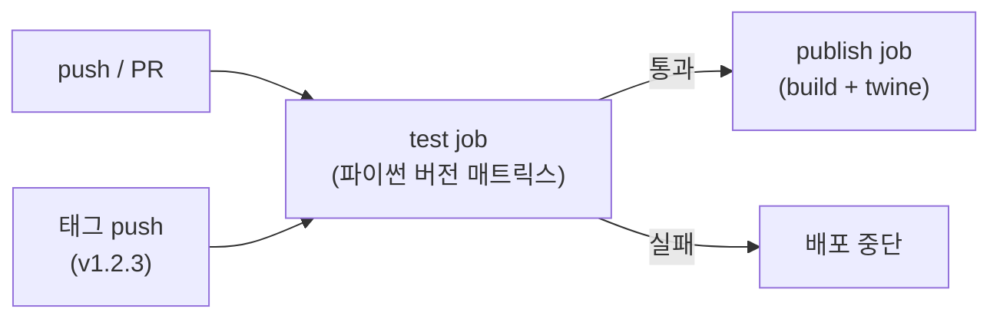

# 챕터 25: 패키징과 배포 전략

파이썬에서 “패키징(packaging)”은 코드를 **설치 가능한 형태로 만드는 일**, “배포(deployment)”는 그 결과물을 **운영 환경에 안정적으로 전달하고 실행하는 일**입니다. 이 챕터는 도구 나열이 아니라, **무엇을 왜 선택하는지**(표준/트레이드오프/실무 함정)를 중심으로 정리합니다.

## 학습 목표
- 파이썬 패키지의 구조와 표준을 이해할 수 있다
- 패키지를 빌드하고 배포할 수 있다
- 의존성을 효과적으로 관리할 수 있다
- 배포 자동화와 버전 관리를 구현할 수 있다

## 핵심 개념(이론)

### 1) 패키징과 배포의 역할과 경계
이 챕터의 핵심은 “무엇을 할 수 있나”가 아니라, **어떤 문제를 해결하고 어디까지 책임지는지**를 분명히 하는 것입니다.
경계가 흐리면 코드는 커질수록 결합이 늘어나고 수정 비용이 커집니다.

### 2) 왜 이 개념이 필요한가(실무 동기)
실무에서는 예외 상황, 성능, 협업, 테스트가 항상 문제를 만듭니다.
따라서 이 주제는 기능이 아니라 <strong>품질(신뢰성/유지보수성/보안)</strong>을 위한 기반으로 이해해야 합니다.

### 3) 트레이드오프: 간단함 vs 확장성
대부분의 선택은 “더 단순하게”와 “더 확장 가능하게” 사이에서 균형을 잡는 일입니다.
초기에는 단순함을, 장기 운영/팀 협업이 커질수록 확장성을 더 우선합니다.

### 4) 실패 모드(Failure Modes)를 먼저 생각하라
무엇이 실패하는지(입력, I/O, 동시성, 외부 시스템)를 먼저 떠올리면 설계가 안정적으로 변합니다.
이 챕터의 예제는 실패 모드를 축소해서 보여주므로, 실제 적용 시에는 더 많은 방어가 필요합니다.

### 5) 학습 포인트: 외우지 말고 “판단 기준”을 남겨라
핵심은 API를 외우는 것이 아니라, “언제 무엇을 선택할지” 판단 기준을 정리하는 것입니다.
이 기준이 쌓이면 새로운 라이브러리/도구가 나와도 빠르게 적응할 수 있습니다.

## 선택 기준(Decision Guide)
- 기본은 **가독성/명확성** 우선(최적화는 측정 이후).
- 외부 의존이 늘수록 **경계/추상화**와 **테스트**를 먼저 강화.
- 복잡도가 증가하면 “규칙을 코드로”가 아니라 “구조로” 담는 방향을 고려.

## 흔한 오해/주의점
- 도구/문법이 곧 실력이라는 오해가 있습니다. 실력은 문제를 단순화하고 구조화하는 능력입니다.
- 극단적 최적화/과설계는 학습과 유지보수를 방해할 수 있습니다.

## 요약
- 패키징과 배포는 기능이 아니라 구조/품질을 위한 기반이다.
- 트레이드오프와 실패 모드를 먼저 생각하고, 판단 기준을 남기자.

## 핵심 내용

### 1) 배포 형식의 기반: sdist와 wheel

패키징의 최종 산출물은 두 종류입니다. `sdist`(source distribution)는 소스 코드와 메타데이터를 담은 압축 파일로, 설치 시점에 대상 환경에서 빌드 단계를 다시 실행해야 합니다.
`wheel`(built distribution, `.whl`)은 이미 빌드가 끝난 상태로 압축된 아카이브라서 설치할 때는 그냥 풀어서 배치하기만 하면 됩니다.
그래서 wheel은 sdist보다 설치가 빠르고, 대상 환경에 컴파일러나 빌드 의존성이 없어도 설치가 가능합니다.
실무에서는 `python -m build`로 두 형식을 한 번에 만들어 함께 배포하는 것이 표준입니다. pip는 대상 플랫폼에 맞는 wheel이 있으면 그것을 우선 설치하고, 없으면 sdist로 폴백합니다.

```text
dist/
  my_pkg-0.1.0.tar.gz        # sdist
  my_pkg-0.1.0-py3-none-any.whl  # wheel (순수 파이썬, 모든 플랫폼 호환)
```

### 2) `pyproject.toml`: 빌드 시스템과 메타데이터의 단일 진실 공급원

과거 파이썬 패키징은 `setup.py` 하나가 메타데이터 선언과 빌드 로직 실행을 동시에 담당했습니다. 문제는 pip가 그 프로젝트의 의존성이 무엇인지 알려면 `setup.py`를 **실행**해야 했고, 실행하려면 이미 `setuptools`가 설치돼 있어야 한다는 순환 의존이 있었다는 점입니다.
[PEP 518](https://peps.python.org/pep-0518/)은 `pyproject.toml`의 `[build-system]` 테이블을 도입해, pip가 프로젝트 코드를 건드리기 **전에** 어떤 빌드 도구(`build-backend`)와 그 도구가 필요로 하는 패키지(`requires`)를 격리된 임시 환경에 먼저 설치하도록 표준화했습니다.
이어서 [PEP 621](https://peps.python.org/pep-0621/)은 `name`, `version`, `dependencies` 같은 프로젝트 메타데이터 자체를 `[project]` 테이블로 표준화했습니다. 이전에는 setuptools, flit, poetry 같은 빌드 백엔드마다 메타데이터 표기 방식이 제각각이었는데, PEP 621 이후로는 백엔드를 바꿔도 `[project]` 테이블은 그대로 재사용할 수 있습니다.

다음은 라이브러리와 CLI를 함께 배포하는 `pyproject.toml` 예시로, 선택적 의존성 그룹과 배포용 메타데이터까지 포함합니다.

```toml
[build-system]
requires = ["setuptools>=68", "wheel"]
build-backend = "setuptools.build_meta"

[project]
name = "my-pkg"
version = "0.1.0"
description = "Example package for packaging chapter"
readme = "README.md"
license = { text = "MIT" }
requires-python = ">=3.10"
authors = [{ name = "Jerry Kim", email = "dev@example.com" }]
classifiers = [
    "Programming Language :: Python :: 3",
    "License :: OSI Approved :: MIT License",
    "Operating System :: OS Independent",
]
dependencies = [
    "requests>=2.31,<3",
]

[project.optional-dependencies]
dev = ["pytest>=8.0", "ruff>=0.5", "build>=1.2", "twine>=5.0"]
docs = ["mkdocs>=1.6"]

[project.scripts]
my-pkg = "my_pkg.cli:main"

[project.urls]
Homepage = "https://example.com/my-pkg"
Repository = "https://example.com/my-pkg.git"
```

`dev`, `docs`처럼 이름 붙인 그룹은 `pip install "my-pkg[dev]"`로 필요할 때만 설치합니다. 배포 대상 사용자는 `dependencies`만 설치하므로, 테스트·문서 도구가 최종 설치 크기를 늘리지 않습니다.

### 3) venv로 프로젝트별 의존성 격리하기

여러 프로젝트가 시스템 하나의 파이썬 site-packages를 공유하면, 프로젝트 A가 `requests==2.28`을 요구하고 프로젝트 B가 `requests>=2.31`을 요구할 때 둘 다 동시에 만족시킬 방법이 없습니다.
`venv` 모듈은 파이썬 3.3부터 표준 라이브러리에 포함된 경량 가상환경 도구로, 프로젝트마다 독립된 site-packages와 독립된 `pip`를 가진 폴더를 만들어 이 충돌을 원천적으로 없앱니다.
과거에 널리 쓰이던 서드파티 `virtualenv`는 3.3 이전 파이썬에도 쓸 수 있고 기능이 더 많지만, 표준 라이브러리만으로 충분한 대부분의 경우에는 `venv`가 추가 설치 없이 바로 쓸 수 있어 더 간단합니다. 시스템 파이썬 자체(C 확장 라이브러리 등 비-파이썬 의존성 포함)까지 버전별로 관리하고 싶다면 conda 계열 도구가 더 적합합니다.

```bash
# 가상환경 생성 (프로젝트 폴더 안에 .venv 디렉터리 생성)
python -m venv .venv

# 활성화 (macOS/Linux)
source .venv/bin/activate

# 활성화 (Windows PowerShell)
.venv\Scripts\Activate.ps1

# 활성화되면 프롬프트에 (.venv)가 표시되고, pip/python이 격리된 환경을 가리킴
python -m pip install --upgrade pip
python -m pip install -e ".[dev]"   # 현재 패키지를 editable 모드 + dev 그룹까지 설치

# 현재 환경에 설치된 정확한 버전 확인
python -m pip freeze

# 작업 종료 시 비활성화
deactivate
```

CI 환경에서는 로컬에서 활성화해 둔 가상환경 상태를 신뢰하지 말고, 매 실행마다 `python -m venv .venv`부터 새로 만들거나 컨테이너 이미지를 새로 빌드해서 "내 컴퓨터에서는 되는데" 문제를 구조적으로 차단하는 것이 안전합니다.

### 4) 빌드 프론트엔드/백엔드 분리와 `python -m build`

[PEP 517](https://peps.python.org/pep-0517/)은 "빌드를 요청하는 도구(프론트엔드)"와 "실제로 빌드를 수행하는 도구(백엔드)"를 표준 훅 함수(`build_sdist`, `build_wheel`)로 분리했습니다.
`build` 패키지나 `pip`는 프론트엔드로서 `pyproject.toml`의 `[build-system]`에 적힌 백엔드(`setuptools.build_meta`, `hatchling`, `flit_core`, `poetry.core` 등)를 호출할 뿐, 백엔드가 내부에서 어떻게 빌드하는지는 알 필요가 없습니다.
덕분에 프로젝트는 워크플로 도구(CI 설정, `python -m build` 명령)를 그대로 둔 채 백엔드만 `setuptools`에서 `hatchling` 등으로 자유롭게 바꿀 수 있습니다.

```bash
# 빌드 프론트엔드 설치 및 실행 (sdist + wheel 동시 생성)
python -m pip install --upgrade build
python -m build

# 생성된 wheel의 메타데이터 확인 (설치 없이 내용물 점검)
python -m zipfile -l dist/my_pkg-0.1.0-py3-none-any.whl
```

개발 중 자주 쓰는 `pip install -e .`(editable install)도 [PEP 660](https://peps.python.org/pep-0660/)에서 `build_editable` 훅으로 표준화되었습니다. 과거 `setup.py develop`이 `sys.path`에 소스 경로를 직접 심볼릭 링크로 꽂던 방식과 달리, 현재는 각 빌드 백엔드가 표준 훅을 통해 편집 가능 설치를 구현하므로 백엔드를 바꿔도 동일하게 동작합니다.

### 5) 의존성 관리: requirements.txt vs pyproject.toml

`requirements.txt`는 `pip freeze`로 "지금 이 환경에서 실제로 동작한 정확한 버전 목록"을 캡처하는 관행에서 출발했습니다. 이 방식은 배포된 앱이나 노트북 환경을 토씨 하나 틀리지 않고 재현하는 데는 강하지만, "내 라이브러리가 필요로 하는 범위"와 "한 번 우연히 동작했던 조합"을 구분하지 못합니다.
`pyproject.toml`의 `dependencies`는 반대로 **추상 의존성**을 선언합니다. 라이브러리라면 `requests>=2.31,<3`처럼 호환 가능한 범위를 명시해, 이 라이브러리를 설치하는 다른 프로젝트의 의존성 해석을 지나치게 제약하지 않는 것이 목표입니다.
두 방식은 경쟁 관계가 아니라 역할이 다릅니다. 실무에서는 `pyproject.toml`에 추상 범위를 선언하고, `pip-compile`(pip-tools) 같은 lock 도구로 그 범위를 실제로 풀어낸 정확한 버전 목록을 별도 lock 파일로 생성해 CI와 배포에 사용하는 조합이 일반적입니다.

| 상황 | 권장 방식 | 판단 기준 |
|---|---|---|
| 라이브러리(다른 프로젝트가 import) | `pyproject.toml`의 `dependencies`에 범위 지정 | 설치하는 쪽의 의존성 해석을 막지 않아야 함 |
| 앱/서비스(직접 배포·운영) | `pyproject.toml` 추상 범위 + lock 파일(`pip-compile`, `uv lock` 등) 병행 | 범위로 유연성, lock으로 재현성 둘 다 확보 |
| 빠른 프로토타입·교육용 스크립트 | `requirements.txt` (pip freeze 결과) | 도구 학습 비용 없이 즉시 재현 |
| CI 파이프라인 | 반드시 lock 파일(정확한 버전) 기준으로 설치 | 같은 커밋이면 언제 실행해도 같은 결과가 나와야 함 |

```bash
# pip-tools로 추상 의존성(pyproject.toml)을 lock 파일로 컴파일
python -m pip install pip-tools
pip-compile pyproject.toml -o requirements.lock.txt

# lock 파일 기준으로 정확히 동일한 환경 재현
python -m pip install -r requirements.lock.txt
```

### 6) 버전 관리: Semantic Versioning

[Semantic Versioning(semver)](https://semver.org/)은 버전 번호를 `MAJOR.MINOR.PATCH` 세 부분으로 나누고, 각 자리의 증가에 명확한 의미를 부여하는 규약입니다. MAJOR는 기존 공개 API와 호환되지 않는 변경, MINOR는 하위 호환을 유지하면서 기능을 추가한 변경, PATCH는 하위 호환을 유지하는 버그 수정을 의미합니다.
`1.2.3-alpha.1`처럼 하이픈 뒤에 붙는 프리릴리스 태그는 정식 릴리스보다 낮은 우선순위를 가지며, `+build.5`처럼 더하기 뒤에 붙는 빌드 메타데이터는 버전 비교에 영향을 주지 않습니다.
semver는 어디까지가 "공개 API"인지를 프로젝트가 스스로 정의해야만 의미가 있는 규약이라는 한계가 있습니다. 내부 구현 세부사항도 사용자가 실제로 의존하기 시작하면 사실상 공개 API처럼 취급해야 하는 경우가 실무에서는 흔합니다(Hyrum의 법칙).

| 변경 내용 | 이전 버전 | 다음 버전 | 자리 |
|---|---|---|---|
| 함수 시그니처 변경, 인자 제거 등 호환성 깨짐 | 1.2.3 | 2.0.0 | MAJOR |
| 기존 API는 그대로 두고 새 함수 추가 | 1.2.3 | 1.3.0 | MINOR |
| 동작은 그대로, 버그만 수정 | 1.2.3 | 1.2.4 | PATCH |

### 7) PyPI 배포 절차: twine으로 업로드하기

표준 릴리스 흐름은 빌드 → 검증 → TestPyPI 업로드로 설치 확인 → 정식 PyPI 업로드 순입니다. `twine check`는 업로드 전에 `README`가 PyPI가 렌더링할 수 있는 형식인지, 메타데이터가 누락되지 않았는지를 미리 점검합니다.
인증 방식은 과거의 사용자명/비밀번호에서 프로젝트별로 범위를 제한할 수 있는 API 토큰으로 넘어갔고, GitHub Actions 같은 CI 환경에서는 토큰조차 저장하지 않는 **Trusted Publishing**(OIDC 기반)이 최신 권장 방식입니다. 아래 명령은 실제 계정 자격증명 없이 절차만 보여줍니다. `__token__`은 PyPI API 토큰 인증 시 사용자명 자리에 고정으로 들어가는 값이고, 실제 토큰 값은 환경 변수로 주입하고 커밋하지 않습니다.

```bash
# 업로드 전 메타데이터/README 검증
python -m twine check dist/*

# TestPyPI에 먼저 업로드해 설치까지 검증 (토큰은 환경 변수로 주입, 예시일 뿐 실제 값 아님)
TWINE_USERNAME=__token__ TWINE_PASSWORD="$TESTPYPI_API_TOKEN" \
  python -m twine upload --repository testpypi dist/*

# 별도 venv에서 설치 테스트
python -m pip install -i https://test.pypi.org/simple/ my-pkg

# 검증이 끝나면 정식 PyPI에 업로드
TWINE_USERNAME=__token__ TWINE_PASSWORD="$PYPI_API_TOKEN" \
  python -m twine upload dist/*
```

### 8) CI/CD: GitHub Actions로 테스트와 배포 자동화

전형적인 파이프라인은 두 단계로 나뉩니다. 모든 push/PR에서는 여러 파이썬 버전 매트릭스로 테스트를 돌려 회귀를 조기에 잡고, 태그 push(릴리스)에서만 빌드와 배포를 실행해 테스트를 통과하지 못한 코드가 PyPI에 올라가는 일을 구조적으로 막습니다.



```yaml
name: CI

on:
  push:
    branches: [main]
    tags: ["v*"]
  pull_request:
    branches: [main]

jobs:
  test:
    runs-on: ubuntu-latest
    strategy:
      matrix:
        python-version: ["3.10", "3.11", "3.12"]
    steps:
      - uses: actions/checkout@v4
      - uses: actions/setup-python@v5
        with:
          python-version: ${{ matrix.python-version }}
      - run: python -m pip install --upgrade pip
      - run: python -m pip install -e ".[dev]"
      - run: pytest

  publish:
    needs: test
    if: startsWith(github.ref, 'refs/tags/v')
    runs-on: ubuntu-latest
    permissions:
      id-token: write  # Trusted Publishing(OIDC)에 필요, 토큰 저장 불필요
    steps:
      - uses: actions/checkout@v4
      - uses: actions/setup-python@v5
        with:
          python-version: "3.12"
      - run: python -m pip install --upgrade build
      - run: python -m build
      - uses: pypa/gh-action-pypi-publish@release/v1
```

`needs: test`는 publish 잡이 test 잡의 성공을 전제로만 실행되게 하고, `if: startsWith(github.ref, 'refs/tags/v')`는 일반 push/PR에서는 배포가 실행되지 않고 `v1.2.3` 같은 릴리스 태그를 붙였을 때만 배포가 실행되게 제한합니다.

### 자주 하는 실수/주의점

- **`setup.py`만 믿기**: 최신 생태계는 `pyproject.toml` 중심으로 이동했습니다. 도구 호환성과 CI 구성에서도 `pyproject.toml` 기반이 더 유리합니다.
- **의존성 범위를 너무 빡빡하게 고정**: 라이브러리에서 `requests==2.31.0`처럼 정확히 고정하면, 다른 라이브러리와 동시에 설치될 때 버전 충돌을 일으키기 쉽습니다. 범위(`>=2.31,<3`)로 열어두고, 정확한 재현이 필요한 곳(앱 배포, CI)에서는 별도 lock 파일을 씁니다.
- **앱을 PyPI로 배포하려는 습관**: 앱 배포의 핵심은 "설치"가 아니라 "운영"이므로, 실행 환경 전체(파이썬 버전, OS 라이브러리 포함)를 고정할 수 있는 컨테이너 이미지 배포가 더 적합한 경우가 많습니다.
- **API 토큰을 코드나 CI 로그에 노출**: 토큰은 항상 CI 시크릿(GitHub Actions의 `secrets.*`)이나 Trusted Publishing으로 관리하고, 빌드 산출물이나 커밋 로그에 남지 않도록 합니다.
- **MAJOR 버전 없이 breaking change 배포**: 함수 시그니처를 바꾸거나 인자를 제거하면서 PATCH만 올리면, semver를 신뢰하고 자동 업그레이드하는 사용자의 애플리케이션이 예고 없이 깨집니다.

## 실습 프로젝트

### 1. 유틸리티 라이브러리 패키징

`src/` 레이아웃으로 프로젝트를 구성하고, 아래 `pyproject.toml`을 작성한 뒤 `python -m build`로 sdist/wheel을 만들고 TestPyPI에 업로드해 봅니다. `src/` 레이아웃은 테스트를 돌릴 때 설치되지 않은 소스가 실수로 import되는 것을 막아, 패키징 오류를 조기에 드러냅니다.

```text
string-utils/
  pyproject.toml
  README.md
  src/
    string_utils/
      __init__.py
      core.py
  tests/
    test_core.py
```

```toml
[build-system]
requires = ["setuptools>=68", "wheel"]
build-backend = "setuptools.build_meta"

[project]
name = "string-utils-demo"
version = "0.1.0"
description = "Small string utility functions for the packaging exercise"
readme = "README.md"
requires-python = ">=3.10"
dependencies = []

[project.optional-dependencies]
dev = ["pytest>=8.0", "build>=1.2", "twine>=5.0"]
```

빌드와 검증까지 마치면 아래 순서로 확인합니다.

```bash
python -m venv .venv && source .venv/bin/activate
python -m pip install -e ".[dev]"
pytest
python -m build
python -m twine check dist/*
```

### 2. CI/CD 배포 파이프라인 구축

`.github/workflows/publish.yml`에 앞서 본 CI 워크플로를 그대로 저장하고, `v0.1.0` 형태의 태그를 push했을 때만 배포 잡이 실행되는지 확인합니다. 실제 PyPI 계정 없이도 `test` 잡만으로 매트릭스 테스트가 정상 동작하는지는 검증할 수 있습니다.

```yaml
# .github/workflows/publish.yml
name: CI

on:
  push:
    branches: [main]
    tags: ["v*"]
  pull_request:
    branches: [main]

jobs:
  test:
    runs-on: ubuntu-latest
    strategy:
      matrix:
        python-version: ["3.10", "3.11", "3.12"]
    steps:
      - uses: actions/checkout@v4
      - uses: actions/setup-python@v5
        with:
          python-version: ${{ matrix.python-version }}
      - run: python -m pip install -e ".[dev]"
      - run: pytest

  publish:
    needs: test
    if: startsWith(github.ref, 'refs/tags/v')
    runs-on: ubuntu-latest
    permissions:
      id-token: write
    steps:
      - uses: actions/checkout@v4
      - uses: actions/setup-python@v5
        with:
          python-version: "3.12"
      - run: python -m pip install --upgrade build
      - run: python -m build
      - uses: pypa/gh-action-pypi-publish@release/v1
```

배포 잡을 실제로 PyPI까지 연결하려면, PyPI 프로젝트 설정에서 이 저장소를 Trusted Publisher로 등록해 두어야 토큰 없이 `id-token: write` 권한만으로 업로드가 승인됩니다. 등록 없이 태그를 push하면 publish 잡은 인증 단계에서 실패하므로, 이 연습에서는 test 잡의 통과 여부까지만 확인해도 파이프라인의 핵심 동작(테스트 게이트)은 검증됩니다.

## 체크리스트
- [ ] sdist와 wheel의 차이를 설명하고, 언제 둘 다 필요한지 판단할 수 있다
- [ ] `pyproject.toml`의 `[build-system]`과 `[project]` 테이블 역할을 구분해 작성할 수 있다
- [ ] venv로 프로젝트별 가상환경을 만들고 lock 파일로 재현 가능한 환경을 구성할 수 있다
- [ ] requirements.txt와 pyproject.toml 의존성 선언의 목적 차이를 설명할 수 있다
- [ ] semantic versioning 규칙에 따라 변경 유형별로 올바른 버전을 매길 수 있다
- [ ] twine을 이용한 TestPyPI/PyPI 업로드 절차를 순서대로 수행할 수 있다
- [ ] 테스트 통과를 배포 조건으로 거는 GitHub Actions 워크플로를 작성할 수 있다

## 다음 단계
패키징과 배포를 마스터했다면, [26. 디자인 패턴](/post/python/python-design-patterns-gof-singleton-factory-observer-guide/)으로 넘어가 소프트웨어 설계 패턴과 아키텍처를 학습합니다.
