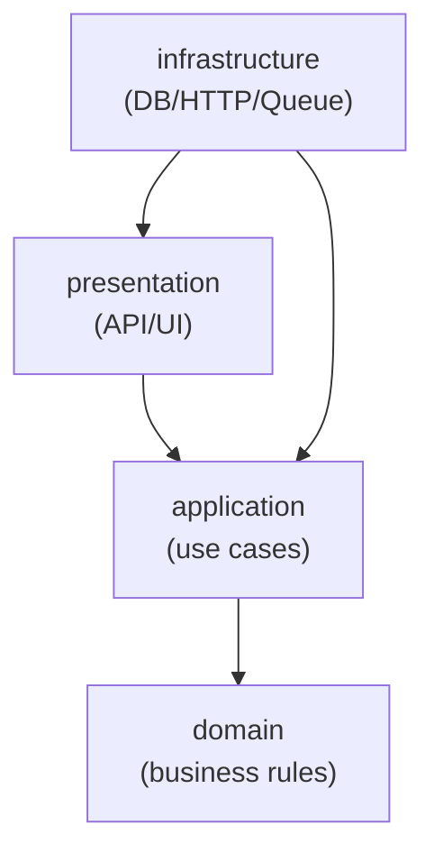

# 챕터 28: 프로젝트 아키텍처 전략

아키텍처는 “멋진 폴더 트리”가 아니라, **변경에 강한 구조**를 만드는 규칙입니다. 파이썬 프로젝트는 규모가 커질수록 “파일이 늘어서 복잡해지는 문제”보다 “의존성이 뒤엉켜서 변경이 무서워지는 문제”가 더 큽니다. 이 챕터는 **경계(boundary), 의존성 방향, 테스트 용이성**을 중심으로 정리합니다.

## 학습 목표
- 확장 가능한 프로젝트 구조를 설계할 수 있다
- 아키텍처 패턴을 적절히 선택하고 적용할 수 있다
- 모듈 간 의존성을 효과적으로 관리할 수 있다
- 대규모 시스템의 설계 원칙을 이해할 수 있다

## 핵심 개념(이론)

### 1) 프로젝트 아키텍처의 역할과 경계
이 챕터의 핵심은 “무엇을 할 수 있나”가 아니라, **어떤 문제를 해결하고 어디까지 책임지는지**를 분명히 하는 것입니다.
경계가 흐리면 코드는 커질수록 결합이 늘어나고 수정 비용이 커집니다.

### 2) 왜 이 개념이 필요한가(실무 동기)
실무에서는 예외 상황, 성능, 협업, 테스트가 항상 문제를 만듭니다.
따라서 이 주제는 기능이 아니라 **품질(신뢰성/유지보수성/보안)**을 위한 기반으로 이해해야 합니다.

### 3) 트레이드오프: 간단함 vs 확장성
대부분의 선택은 “더 단순하게”와 “더 확장 가능하게” 사이에서 균형을 잡는 일입니다.
초기에는 단순함을, 장기 운영/팀 협업이 커질수록 확장성을 더 우선합니다.

### 4) 실패 모드(Failure Modes)를 먼저 생각하라
무엇이 실패하는지(입력, I/O, 동시성, 외부 시스템)를 먼저 떠올리면 설계가 안정적으로 변합니다.
이 챕터의 예제는 실패 모드를 축소해서 보여주므로, 실제 적용 시에는 더 많은 방어가 필요합니다.

### 5) 학습 포인트: 외우지 말고 “판단 기준”을 남겨라
핵심은 API를 외우는 것이 아니라, “언제 무엇을 선택할지” 판단 기준을 정리하는 것입니다.
이 기준이 쌓이면 새로운 라이브러리/도구가 나와도 빠르게 적응할 수 있습니다.

## 선택 기준(Decision Guide)
- 기본은 **가독성/명확성** 우선(최적화는 측정 이후).
- 외부 의존이 늘수록 **경계/추상화**와 **테스트**를 먼저 강화.
- 복잡도가 증가하면 “규칙을 코드로”가 아니라 “구조로” 담는 방향을 고려.

## 흔한 오해/주의점
- 도구/문법이 곧 실력이라는 오해가 있습니다. 실력은 문제를 단순화하고 구조화하는 능력입니다.
- 극단적 최적화/과설계는 학습과 유지보수를 방해할 수 있습니다.

## 요약
- 프로젝트 아키텍처는 기능이 아니라 구조/품질을 위한 기반이다.
- 트레이드오프와 실패 모드를 먼저 생각하고, 판단 기준을 남기자.

## 핵심 내용

### 아키텍처의 핵심 질문 3가지
- **경계는 어디인가?** (도메인/유스케이스/인프라/프레임워크)
- **의존성은 어느 방향인가?** (핵심 로직이 외부 기술에 종속되는가?)
- **테스트는 쉬운가?** (DB/네트워크 없이 핵심 로직을 빠르게 테스트 가능한가?)

### 아키텍처 원칙(실무적 해석)
- **SOLID**: “확장할 때 기존 코드를 덜 건드리게 하는 규칙”
- **DRY**: “중복 제거”가 아니라 “지식 중복 제거”(같은 규칙이 여러 곳에 흩어지지 않게)
- **KISS**: “복잡도를 최소화” (특히 초기)
- **YAGNI**: “미래를 예측해 과설계하지 않기”
- **관심사 분리(SoC)**: 변경 이유가 같은 것끼리 모으고, 다른 것은 분리하기

### 대표 패턴: 레이어드 vs 클린(헥사고날)
| 패턴 | 장점 | 단점 | 언제 쓰나 |
|---|---|---|---|
| 레이어드(Controller/Service/Repository) | 이해/온보딩 쉬움 | 레이어 규칙이 무너지면 결합 폭발 | 팀이 크고 CRUD 비중이 높을 때 |
| 클린/헥사고날(Ports & Adapters) | 핵심 로직 보호, 테스트 쉬움 | 초기 설계 비용 | 도메인 복잡, 장기 유지보수/확장 중요 |

### 의존성 방향(가장 중요한 규칙)
아래는 “핵심이 바깥에 의존하지 않게” 만드는 가장 기본 구조입니다.



핵심 포인트는 **domain/application이 infrastructure에 직접 의존하지 않게** 만드는 것입니다. 대신 인터페이스(포트)를 application/domain 쪽에 두고, 구현을 infrastructure에서 제공합니다.

### 프로젝트 구조
현실적인 기본형(예: 웹 API 서비스)은 아래 정도가 시작점으로 좋습니다.

```text
my_service/
  pyproject.toml
  src/
    my_service/
      presentation/   # web/api/cli
      application/    # use cases, orchestration
      domain/         # entities, value objects, policies
      infrastructure/ # db, http clients, message queue adapters
  tests/
```

#### 네이밍 컨벤션(권장)
- 패키지/모듈: `snake_case`
- 클래스: `PascalCase`
- 함수/변수: `snake_case`
- “무엇을 하는지”보다 “어떤 책임인지”로 이름을 짓기(예: `user_repository.py`는 OK, `user_helper.py`는 위험 신호)

### 레이어드 아키텍처
- **프레젠테이션 계층**: UI/API 레이어
- **비즈니스 계층**: 핵심 로직
- **데이터 접근 계층**: 저장소 추상화
- **계층 간 통신**: 인터페이스 정의

### 도메인 주도 설계 (DDD)
- **도메인 모델**: 비즈니스 규칙 모델링
- **애그리게이트**: 일관성 경계
- **리포지토리 패턴**: 데이터 접근 추상화
- **도메인 서비스**: 비즈니스 로직 캡슐화

### 마이크로서비스
- **서비스 분해**: 기능별 독립 서비스
- **API 게이트웨이**: 단일 진입점
- **서비스 간 통신**: REST, gRPC, 메시징
- **데이터 관리**: 서비스별 데이터베이스

### 의존성 관리
- **의존성 주입**: 결합도 감소
- **인터페이스 분리**: 추상화 활용
- **팩토리 패턴**: 객체 생성 추상화
- **컨테이너**: 의존성 관리 도구

### 이벤트 기반 아키텍처
- **이벤트 소싱**: 상태 변화 기록
- **CQRS**: 명령과 쿼리 분리
- **메시지 큐**: 비동기 처리
- **이벤트 스토어**: 이벤트 저장소

### 확장성과 성능
- **수평/수직 확장**: 스케일링 전략
- **캐싱 전략**: 다층 캐시 구조
- **로드 밸런싱**: 트래픽 분산
- **데이터베이스 샤딩**: 데이터 분산

### 보안 아키텍처
- **인증/인가**: 보안 계층
- **데이터 암호화**: 전송/저장 암호화
- **감사 로깅**: 보안 이벤트 기록
- **취약점 분석**: 보안 검증

## 자주 하는 실수/주의점
- **DB 모델이 곧 도메인이라고 착각**: ORM 모델은 인프라 편의가 섞이기 쉬워, 도메인 규칙을 오염시킵니다.
- **“유틸” 폴더 남발**: 경계가 모호한 코드가 계속 쌓여 기술부채가 됩니다.
- **프레임워크가 도메인을 지배**: 도메인 로직이 Flask/Django 객체에 박히면 테스트와 변경이 어려워집니다.

## 실습 프로젝트
1. 전자상거래 플랫폼 아키텍처
2. 콘텐츠 관리 시스템
3. IoT 데이터 처리 시스템
4. 소셜 미디어 플랫폼

## 체크리스트
- [ ] 아키텍처 원칙 이해
- [ ] 프로젝트 구조 설계
- [ ] 패턴 선택과 적용
- [ ] 의존성 관리 구현
- [ ] 확장성 고려 설계

## 다음 단계
프로젝트 아키텍처를 마스터했다면, 코드 품질 관리와 개발 프로세스를 학습합니다. 
