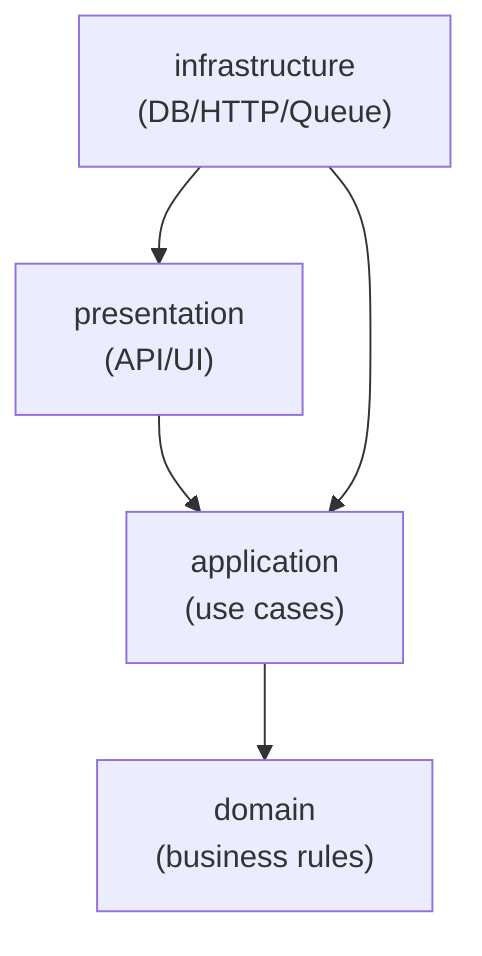

# 챕터 28: 프로젝트 아키텍처 전략

아키텍처는 “멋진 폴더 트리”가 아니라, **변경에 강한 구조**를 만드는 규칙입니다. 파이썬 프로젝트는 규모가 커질수록 “파일이 늘어서 복잡해지는 문제”보다 “의존성이 뒤엉켜서 변경이 무서워지는 문제”가 더 큽니다. 이 챕터는 **경계(boundary), 의존성 방향, 테스트 용이성**을 중심으로 정리합니다.

## 학습 목표
- 확장 가능한 프로젝트 구조를 설계할 수 있다
- 아키텍처 패턴을 적절히 선택하고 적용할 수 있다
- 모듈 간 의존성을 효과적으로 관리할 수 있다
- 대규모 시스템의 설계 원칙을 이해할 수 있다

## 핵심 개념(이론)

### 1) 프로젝트 아키텍처의 역할과 경계
이 챕터의 핵심은 “무엇을 할 수 있나”가 아니라, **어떤 문제를 해결하고 어디까지 책임지는지**를 분명히 하는 것입니다.
경계가 흐리면 코드는 커질수록 결합이 늘어나고 수정 비용이 커집니다.

### 2) 왜 이 개념이 필요한가(실무 동기)
실무에서는 예외 상황, 성능, 협업, 테스트가 항상 문제를 만듭니다.
따라서 이 주제는 기능이 아니라 **품질(신뢰성/유지보수성/보안)**을 위한 기반으로 이해해야 합니다.

### 3) 트레이드오프: 간단함 vs 확장성
대부분의 선택은 “더 단순하게”와 “더 확장 가능하게” 사이에서 균형을 잡는 일입니다.
초기에는 단순함을, 장기 운영/팀 협업이 커질수록 확장성을 더 우선합니다.

### 4) 실패 모드(Failure Modes)를 먼저 생각하라
무엇이 실패하는지(입력, I/O, 동시성, 외부 시스템)를 먼저 떠올리면 설계가 안정적으로 변합니다.
이 챕터의 예제는 실패 모드를 축소해서 보여주므로, 실제 적용 시에는 더 많은 방어가 필요합니다.

### 5) 학습 포인트: 외우지 말고 “판단 기준”을 남겨라
핵심은 API를 외우는 것이 아니라, “언제 무엇을 선택할지” 판단 기준을 정리하는 것입니다.
이 기준이 쌓이면 새로운 라이브러리/도구가 나와도 빠르게 적응할 수 있습니다.

## 선택 기준(Decision Guide)
- 기본은 **가독성/명확성** 우선(최적화는 측정 이후).
- 외부 의존이 늘수록 **경계/추상화**와 **테스트**를 먼저 강화.
- 복잡도가 증가하면 “규칙을 코드로”가 아니라 “구조로” 담는 방향을 고려.

## 흔한 오해/주의점
- 도구/문법이 곧 실력이라는 오해가 있습니다. 실력은 문제를 단순화하고 구조화하는 능력입니다.
- 극단적 최적화/과설계는 학습과 유지보수를 방해할 수 있습니다.

## 요약
- 프로젝트 아키텍처는 기능이 아니라 구조/품질을 위한 기반이다.
- 트레이드오프와 실패 모드를 먼저 생각하고, 판단 기준을 남기자.

## 핵심 내용

### 아키텍처의 핵심 질문 3가지
- **경계는 어디인가?** (도메인/유스케이스/인프라/프레임워크)
- **의존성은 어느 방향인가?** (핵심 로직이 외부 기술에 종속되는가?)
- **테스트는 쉬운가?** (DB/네트워크 없이 핵심 로직을 빠르게 테스트 가능한가?)

### 아키텍처 원칙(실무적 해석)
- **SOLID**: “확장할 때 기존 코드를 덜 건드리게 하는 규칙”
- **DRY**: “중복 제거”가 아니라 “지식 중복 제거”(같은 규칙이 여러 곳에 흩어지지 않게)
- **KISS**: “복잡도를 최소화” (특히 초기)
- **YAGNI**: “미래를 예측해 과설계하지 않기”
- **관심사 분리(SoC)**: 변경 이유가 같은 것끼리 모으고, 다른 것은 분리하기

### 대표 패턴: 레이어드 vs 클린(헥사고날)
| 패턴 | 장점 | 단점 | 언제 쓰나 |
|---|---|---|---|
| 레이어드(Controller/Service/Repository) | 이해/온보딩 쉬움 | 레이어 규칙이 무너지면 결합 폭발 | 팀이 크고 CRUD 비중이 높을 때 |
| 클린/헥사고날(Ports & Adapters) | 핵심 로직 보호, 테스트 쉬움 | 초기 설계 비용 | 도메인 복잡, 장기 유지보수/확장 중요 |

### 의존성 방향(가장 중요한 규칙)
아래는 “핵심이 바깥에 의존하지 않게” 만드는 가장 기본 구조입니다.


```mermaid
flowchart TD
    presentation["presentation</br>(API/UI)"] --> application["application</br>(use cases)"]
    application --> domain["domain</br>(business rules)"]
    infrastructure["infrastructure</br>(DB/HTTP/Queue)"] --> application
    infrastructure --> presentation
```

핵심 포인트는 **domain/application이 infrastructure에 직접 의존하지 않게** 만드는 것입니다. 대신 인터페이스(포트)를 application/domain 쪽에 두고, 구현을 infrastructure에서 제공합니다.

### 프로젝트 구조
현실적인 기본형(예: 웹 API 서비스)은 아래 정도가 시작점으로 좋습니다.

```text
my_service/
  pyproject.toml
  src/
    my_service/
      presentation/   # web/api/cli
      application/    # use cases, orchestration
      domain/         # entities, value objects, policies
      infrastructure/ # db, http clients, message queue adapters
  tests/
```

#### 네이밍 컨벤션(권장)
- 패키지/모듈: `snake_case`
- 클래스: `PascalCase`
- 함수/변수: `snake_case`
- “무엇을 하는지”보다 “어떤 책임인지”로 이름을 짓기(예: `user_repository.py`는 OK, `user_helper.py`는 위험 신호)

### 계층형(레이어드) 아키텍처: 계층별 책임과 디렉토리
레이어드 아키텍처는 코드를 "무엇을 하는가"가 아니라 "변경 이유가 같은가"를 기준으로 나눕니다. presentation은 "입출력 형식이 바뀌면" 변하고, domain은 "비즈니스 규칙이 바뀌면" 변하고, infrastructure는 "저장소/외부 시스템이 바뀌면" 변합니다. 이 세 가지 변경 이유는 서로 다른 속도로 바뀌기 때문에, 한 파일에 섞어 두면 무관한 변경끼리 서로를 건드리게 됩니다. 앞서 본 의존성 방향 다이어그램의 핵심은 domain이 가장 적게 바뀌어야 하는 계층이므로, 가장 적게 의존해야 한다는 것입니다.
아래는 "주문 접수" 기능 하나를 예로 삼아 네 계층을 실제 코드로 나눈 것입니다. 이 예제는 하나의 유스케이스만 다루므로 실제 서비스보다 단순화되어 있지만, 계층 사이의 의존 방향은 동일하게 유지합니다.

```text
my_service/
  pyproject.toml
  src/
    my_service/
      presentation/          # 외부 입출력 형식(API, CLI 등)
        __init__.py
        main.py               # 조립(composition root)
      application/            # 유스케이스 오케스트레이션
        __init__.py
        ports.py              # 인터페이스(포트) 정의
        use_cases/
          __init__.py
          place_order.py
      domain/                 # 프레임워크 의존 없는 순수 비즈니스 규칙
        __init__.py
        entities.py
        value_objects.py
      infrastructure/         # DB/외부 시스템 구현체(어댑터)
        __init__.py
        db/
          sqlite_order_repository.py
        notification/
          console_notifier.py
        config.py
  tests/
    unit/
      test_place_order.py
```

domain 계층은 `sqlite3`, `flask` 같은 외부 라이브러리를 import하지 않습니다. 순수 파이썬 값과 규칙만으로 이루어져 있어야, 프레임워크나 DB를 바꿔도 domain 코드는 그대로 유지됩니다. 아래 `Money`는 통화 계산의 부동소수점 오차를 피하기 위해 정수(최소 단위)로 금액을 표현하는 값 객체(value object)이고, `Order`는 주문의 규칙(빈 주문 금지, 총액 계산)을 캡슐화한 엔티티입니다.

```python
# domain/value_objects.py
from dataclasses import dataclass


@dataclass(frozen=True)
class Money:
    """통화 금액을 나타내는 값 객체. 부동소수점 오차를 피하기 위해 정수(원 단위)로 다룬다."""
    amount: int
    currency: str = "KRW"

    def __add__(self, other: "Money") -> "Money":
        if self.currency != other.currency:
            raise ValueError("통화가 다른 Money는 더할 수 없습니다")
        return Money(self.amount + other.amount, self.currency)
```

```python
# domain/entities.py
from dataclasses import dataclass, field
from .value_objects import Money


@dataclass
class OrderLine:
    product_id: str
    quantity: int
    unit_price: Money

    def subtotal(self) -> Money:
        return Money(self.unit_price.amount * self.quantity, self.unit_price.currency)


@dataclass
class Order:
    order_id: str
    lines: list[OrderLine] = field(default_factory=list)

    def add_line(self, line: OrderLine) -> None:
        if line.quantity <= 0:
            raise ValueError("수량은 1 이상이어야 합니다")
        self.lines.append(line)

    def total(self) -> Money:
        total = Money(0)
        for line in self.lines:
            total = total + line.subtotal()
        return total
```

domain 계층은 "주문에 최소 1줄이 있어야 한다", "수량은 1 이상이어야 한다" 같은 규칙을 스스로 지킵니다. 이 규칙이 DB 스키마나 API 검증 로직에 흩어져 있지 않고 `Order`/`OrderLine` 안에 모여 있다는 점이 핵심입니다. application과 infrastructure는 이 domain 객체를 사용할 뿐, domain은 그 위 계층을 전혀 알지 못합니다.

### 인터페이스 설계: abc.ABC로 모듈 간 결합도 낮추기
application 계층이 "주문을 저장한다"는 동작이 필요할 때, 곧바로 `SqliteOrderRepository` 같은 구체 클래스를 참조하면 application이 특정 DB 구현에 결합됩니다. 이를 피하기 위해 application/domain 쪽에 **포트(port)**, 즉 추상 인터페이스를 두고 infrastructure가 그 인터페이스를 구현하게 만듭니다. 파이썬에서는 `abc.ABC`와 `@abstractmethod`로 이 계약을 코드로 강제할 수 있습니다. `abc.ABC`를 상속한 클래스는 추상 메서드를 하나라도 구현하지 않으면 인스턴스화 시점에 `TypeError`가 발생하므로, "구현을 깜빡한 메서드"가 런타임 초반에 바로 드러납니다. 이는 [10장: 고급 OOP](/post/python/python-oop-advanced-inheritance-polymorphism-abstraction-guide/)에서 다룬 상속·추상화 개념을 아키텍처 경계에 적용한 것입니다.

```python
# application/ports.py
from abc import ABC, abstractmethod
from domain.entities import Order


class OrderRepository(ABC):
    """주문 저장소의 포트. domain/application은 이 추상화에만 의존하고, 구체 구현은 모른다."""

    @abstractmethod
    def save(self, order: Order) -> None: ...

    @abstractmethod
    def find_by_id(self, order_id: str) -> Order | None: ...


class Notifier(ABC):
    """알림 발송 포트. 이메일/슬랙/콘솔 등 실제 채널은 infrastructure가 결정한다."""

    @abstractmethod
    def notify(self, message: str) -> None: ...
```

인터페이스를 지키지 않은 구현체는 만들 수조차 없습니다. 다음처럼 `find_by_id`를 빠뜨리면 인스턴스 생성 시점에 즉시 실패합니다.

```python
class BrokenRepository(OrderRepository):
    """save만 구현하고 find_by_id를 빠뜨린 잘못된 예."""
    def save(self, order: Order) -> None:
        pass


BrokenRepository()
# TypeError 발생: 추상 메서드 find_by_id를 구현하지 않았기 때문
# (정확한 예외 메시지 문구는 파이썬 버전에 따라 다르다)
```

이 결합도 감소는 테스트에도 직접적인 이득을 줍니다. `PlaceOrderUseCase`가 `OrderRepository`라는 인터페이스만 알면, 테스트에서는 SQLite 대신 인메모리 가짜 구현을 넣어 DB 없이도 유스케이스 로직을 검증할 수 있습니다. 다음 절의 의존성 주입이 바로 이 구조를 만드는 방법입니다.

### 의존성 주입: 생성자 주입으로 테스트하기 쉬운 유스케이스 만들기
**의존성 주입(Dependency Injection, DI)**은 객체가 필요로 하는 협력 객체를 자기 내부에서 만들지 않고, 외부에서 생성자(또는 세터)를 통해 전달받는 방식입니다. 가장 흔한 형태는 **생성자 주입**으로, `__init__`이 인터페이스 타입의 매개변수를 받아 인스턴스 속성에 저장하는 것입니다. 반대로 아래처럼 클래스가 내부에서 구체 클래스를 직접 생성하면, 그 클래스를 쓰는 모든 코드(테스트 포함)가 그 구체 구현에 발이 묶입니다.

```python
# 나쁜 예: 유스케이스가 구체 클래스를 직접 생성한다
import sqlite3


class PlaceOrderUseCaseBad:
    def __init__(self) -> None:
        self._conn = sqlite3.connect("orders.db")  # 테스트에서도 항상 실제 DB 파일이 필요하다

    def execute(self, order_id: str, amount: int) -> None:
        self._conn.execute(
            "INSERT INTO orders (order_id, amount) VALUES (?, ?)", (order_id, amount)
        )
        self._conn.commit()
```

이 버전은 단위 테스트를 작성하려면 실제 SQLite 파일이 있어야 하고, 알림 채널을 바꾸려면 클래스 내부를 고쳐야 합니다. 생성자 주입으로 바꾸면 `PlaceOrderUseCase`는 `OrderRepository`와 `Notifier`라는 인터페이스만 알고, 실제 구현이 SQLite인지 메모리인지는 신경 쓰지 않습니다.

```python
# application/use_cases/place_order.py
from domain.entities import Order
from application.ports import OrderRepository, Notifier


class PlaceOrderUseCase:
    """생성자 주입으로 구현체가 아닌 인터페이스(포트)에 의존한다."""

    def __init__(self, repository: OrderRepository, notifier: Notifier) -> None:
        self._repository = repository
        self._notifier = notifier

    def execute(self, order: Order) -> None:
        if not order.lines:
            raise ValueError("주문에는 최소 1개 이상의 상품이 필요합니다")
        self._repository.save(order)
        self._notifier.notify(f"주문 {order.order_id}가 접수되었습니다")
```

이제 테스트는 진짜 DB나 네트워크 없이, `OrderRepository`/`Notifier`를 구현한 가짜(fake) 객체만으로 `PlaceOrderUseCase`의 로직을 검증할 수 있습니다. 이 테스트는 밀리초 단위로 끝나고, 외부 상태에 의존하지 않아 반복 실행해도 결과가 항상 같습니다. 자세한 테스트 작성 기법은 [24장: 테스팅과 디버깅](/post/python/python-testing-debugging-pytest-tdd-mocking-guide/)에서 다룹니다.

```python
# tests/unit/test_place_order.py
from domain.entities import Order, OrderLine
from domain.value_objects import Money
from application.ports import OrderRepository, Notifier
from application.use_cases.place_order import PlaceOrderUseCase


class FakeRepository(OrderRepository):
    def __init__(self) -> None:
        self.saved: list[Order] = []

    def save(self, order: Order) -> None:
        self.saved.append(order)

    def find_by_id(self, order_id: str) -> Order | None:
        return next((o for o in self.saved if o.order_id == order_id), None)


class FakeNotifier(Notifier):
    def __init__(self) -> None:
        self.messages: list[str] = []

    def notify(self, message: str) -> None:
        self.messages.append(message)


def test_place_order_saves_and_notifies() -> None:
    repo = FakeRepository()
    notifier = FakeNotifier()
    use_case = PlaceOrderUseCase(repo, notifier)

    order = Order(order_id="ORD-1")
    order.add_line(OrderLine("SKU-1", 2, Money(1000)))
    use_case.execute(order)

    assert len(repo.saved) == 1
    assert "ORD-1" in notifier.messages[0]


def test_place_order_rejects_empty_order() -> None:
    use_case = PlaceOrderUseCase(FakeRepository(), FakeNotifier())
    order = Order(order_id="ORD-2")

    try:
        use_case.execute(order)
        assert False, "빈 주문은 예외를 던져야 한다"
    except ValueError:
        pass
```

이처럼 생성자 주입은 "테스트를 쉽게 만들기 위한 도구"에 가깝습니다. 프로젝트 규모가 커지면 `dependency-injector` 같은 DI 컨테이너 라이브러리로 조립을 자동화하기도 하지만, 원리는 동일한 생성자 주입입니다. 팩토리 패턴과 DI 컨테이너의 관계는 [26장: 디자인 패턴](/post/python/python-design-patterns-gof-singleton-factory-observer-guide/)에서 더 다룹니다.

### 인프라 구현체와 조립(Composition Root)
infrastructure 계층은 application이 정의한 포트를 실제로 구현합니다. 이 구현체들은 domain/application을 import할 수 있지만, 그 반대는 금지됩니다. 그리고 이 구현체를 어디서 골라 조립할지는 애플리케이션 전체에서 **단 한 곳**, 흔히 **조립 루트(composition root)**라고 부르는 지점에서만 결정합니다. 아래 `main.py`가 그 역할을 합니다.

```python
# infrastructure/db/sqlite_order_repository.py
import sqlite3
import json
from domain.entities import Order, OrderLine
from domain.value_objects import Money
from application.ports import OrderRepository


class SqliteOrderRepository(OrderRepository):
    """SQLite로 주문을 저장하는 구현체. application 계층은 이 클래스의 존재를 모른다."""

    def __init__(self, db_path: str) -> None:
        self._conn = sqlite3.connect(db_path)
        self._conn.execute(
            "CREATE TABLE IF NOT EXISTS orders (order_id TEXT PRIMARY KEY, lines TEXT)"
        )

    def save(self, order: Order) -> None:
        lines = [
            {"product_id": l.product_id, "quantity": l.quantity, "unit_price": l.unit_price.amount}
            for l in order.lines
        ]
        self._conn.execute(
            "INSERT OR REPLACE INTO orders (order_id, lines) VALUES (?, ?)",
            (order.order_id, json.dumps(lines)),
        )
        self._conn.commit()

    def find_by_id(self, order_id: str) -> Order | None:
        row = self._conn.execute(
            "SELECT lines FROM orders WHERE order_id = ?", (order_id,)
        ).fetchone()
        if row is None:
            return None
        order = Order(order_id=order_id)
        for item in json.loads(row[0]):
            order.add_line(OrderLine(item["product_id"], item["quantity"], Money(item["unit_price"])))
        return order
```

```python
# infrastructure/notification/console_notifier.py
from application.ports import Notifier


class ConsoleNotifier(Notifier):
    """실무에서는 이메일/슬랙 등으로 교체하지만, 여기서는 콘솔 출력으로 단순화한다."""

    def notify(self, message: str) -> None:
        print(f"[NOTIFY] {message}")
```

```python
# presentation/main.py
from application.use_cases.place_order import PlaceOrderUseCase
from infrastructure.db.sqlite_order_repository import SqliteOrderRepository
from infrastructure.notification.console_notifier import ConsoleNotifier
from domain.entities import Order, OrderLine
from domain.value_objects import Money


def build_use_case() -> PlaceOrderUseCase:
    """조립 루트: 구체 구현을 선택해 주입하는 애플리케이션 내 유일한 지점."""
    repository = SqliteOrderRepository("orders.db")
    notifier = ConsoleNotifier()
    return PlaceOrderUseCase(repository, notifier)


if __name__ == "__main__":
    use_case = build_use_case()
    order = Order(order_id="ORD-100")
    order.add_line(OrderLine("SKU-42", 3, Money(1500)))
    use_case.execute(order)
```

`sqlite3`를 import하는 파일은 `infrastructure/db/sqlite_order_repository.py`와 `main.py`뿐입니다. domain과 application 어디에도 `sqlite3`라는 이름이 등장하지 않으므로, 나중에 SQLite를 PostgreSQL이나 인메모리 저장소로 바꾸더라도 domain/application 코드는 한 줄도 건드릴 필요가 없습니다. DB 연동 자체의 상세한 기법(커넥션 풀, 트랜잭션 등)은 [22장: 데이터베이스](/post/python/python-database-sql-nosql-orm-transaction-guide/)를 참고하세요.

### 설정 관리: 환경별 config 분리
운영 환경(development/test/production)마다 DB 주소, 디버그 여부, 비밀키 같은 값이 달라집니다. 이런 값을 코드에 하드코딩하면 배포 환경을 바꿀 때마다 코드를 고쳐야 하고, 비밀키가 소스 저장소에 그대로 노출되는 사고로 이어지기 쉽습니다. **12-Factor App** 원칙은 이런 설정 값을 코드가 아니라 환경변수로 주입하라고 권장합니다. 아래 `load_config`는 `APP_ENV` 값에 따라 다른 설정을 조립하고, 운영 환경에서는 필수 환경변수가 없으면 즉시(가능한 한 앱 시작 시점에) `KeyError`로 실패하게 만듭니다. 이 "빠르게 실패하기(fail fast)"는 설정 누락을 요청 처리 도중이 아니라 배포 직후에 드러나게 해 줍니다.

```python
# infrastructure/config.py
import os
from dataclasses import dataclass


@dataclass(frozen=True)
class DatabaseConfig:
    host: str
    port: int
    name: str


@dataclass(frozen=True)
class AppConfig:
    debug: bool
    database: DatabaseConfig
    secret_key: str


def load_config() -> AppConfig:
    """환경변수 APP_ENV(development/test/production)에 따라 다른 설정을 만든다."""
    env = os.environ.get("APP_ENV", "development")

    if env == "production":
        return AppConfig(
            debug=False,
            database=DatabaseConfig(
                host=os.environ["DB_HOST"],
                port=int(os.environ.get("DB_PORT", "5432")),
                name=os.environ["DB_NAME"],
            ),
            secret_key=os.environ["SECRET_KEY"],
        )
    if env == "test":
        return AppConfig(
            debug=True,
            database=DatabaseConfig(host="localhost", port=5432, name="test_db"),
            secret_key="test-secret",
        )
    return AppConfig(
        debug=True,
        database=DatabaseConfig(host="localhost", port=5432, name="dev_db"),
        secret_key="dev-secret",
    )
```

`production` 분기는 `os.environ["DB_HOST"]`처럼 대괄호 접근을 사용해, 값이 없으면 즉시 예외가 나도록 의도했습니다. `development`/`test` 분기는 로컬 개발 편의를 위해 기본값을 허용합니다. 실무에서는 `.env` 파일과 `python-dotenv` 같은 라이브러리로 로컬 환경변수를 관리하는 경우가 많지만, `load_config` 자체는 표준 라이브러리 `os.environ`만으로 충분히 구현할 수 있습니다.

### 대규모 프로젝트의 디렉토리 구조
지금까지의 예제는 "주문"이라는 하나의 도메인만 다뤘습니다. 여러 도메인이 함께 있는 큰 서비스에서는, 도메인마다 계층 구조(presentation/application/domain/infrastructure)를 반복하고, 여러 도메인이 공통으로 쓰는 값 객체나 예외는 별도의 **shared kernel(공유 커널)**로 뽑아냅니다. DDD에서 이렇게 독립적으로 발전할 수 있는 하나의 도메인 단위를 **바운디드 컨텍스트(bounded context)**라고 부르는데, 아래 `ordering`, `billing`은 각각 하나의 바운디드 컨텍스트입니다.

```text
big_service/
  pyproject.toml
  docker/
    Dockerfile
    docker-compose.yml
  src/
    big_service/
      shared_kernel/          # 여러 도메인이 공유하는 값 객체·예외
        value_objects.py
        exceptions.py
      ordering/                # 바운디드 컨텍스트 1: 주문
        presentation/
        application/
        domain/
        infrastructure/
      billing/                 # 바운디드 컨텍스트 2: 결제
        presentation/
        application/
        domain/
        infrastructure/
      config.py
      main.py                  # 전체 조립 루트
  tests/
    ordering/
      unit/
      integration/
    billing/
      unit/
      integration/
  scripts/
    migrate.py
```

한 팀이 감당할 수 있는 크기를 넘어서거나, `ordering`과 `billing`이 서로 다른 배포 주기·확장 정책을 필요로 하기 시작하면, 이 구조는 그대로 마이크로서비스 분리의 후보가 됩니다. 반대로 아직 팀이 작고 도메인 경계가 자주 바뀐다면, 하나의 배포 단위(모놀리스) 안에서 바운디드 컨텍스트만 코드로 분리해 두는 편이 전환 비용을 낮춥니다. 언제 서비스를 쪼갤지에 대한 판단 기준은 아래 마이크로서비스 절에서 이어집니다.

### 도메인 주도 설계 (DDD)
- **도메인 모델**: 비즈니스 규칙 모델링
- **애그리게이트**: 일관성 경계
- **리포지토리 패턴**: 데이터 접근 추상화
- **도메인 서비스**: 비즈니스 로직 캡슐화

### 마이크로서비스
- **서비스 분해**: 기능별 독립 서비스
- **API 게이트웨이**: 단일 진입점
- **서비스 간 통신**: REST, gRPC, 메시징
- **데이터 관리**: 서비스별 데이터베이스

의존성 주입과 인터페이스 설계는 앞서 실제 코드로 다뤘으므로, 여기서는 여러 서비스가 상태 변화를 어떻게 전달하는지를 다루는 이벤트 기반 아키텍처로 넘어갑니다.

### 이벤트 기반 아키텍처
- **이벤트 소싱**: 상태 변화 기록
- **CQRS**: 명령과 쿼리 분리
- **메시지 큐**: 비동기 처리
- **이벤트 스토어**: 이벤트 저장소

### 확장성과 성능
- **수평/수직 확장**: 스케일링 전략
- **캐싱 전략**: 다층 캐시 구조
- **로드 밸런싱**: 트래픽 분산
- **데이터베이스 샤딩**: 데이터 분산

### 보안 아키텍처
- **인증/인가**: 보안 계층
- **데이터 암호화**: 전송/저장 암호화
- **감사 로깅**: 보안 이벤트 기록
- **취약점 분석**: 보안 검증

## 자주 하는 실수/주의점
- **DB 모델이 곧 도메인이라고 착각**: ORM 모델은 인프라 편의가 섞이기 쉬워, 도메인 규칙을 오염시킵니다.
- **“유틸” 폴더 남발**: 경계가 모호한 코드가 계속 쌓여 기술부채가 됩니다.
- **프레임워크가 도메인을 지배**: 도메인 로직이 Flask/Django 객체에 박히면 테스트와 변경이 어려워집니다.
- **인터페이스를 구현체 쪽에 정의**: `OrderRepository` 같은 포트를 `infrastructure`에 두면, application이 결국 infrastructure를 import하게 되어 의존성 방향이 반대로 뒤집힙니다. 포트는 항상 application/domain 쪽에 둡니다.
- **설정 값을 코드에 하드코딩**: DB 주소나 비밀키를 소스에 박아 두면 배포 환경마다 코드를 고쳐야 하고, 저장소에 비밀키가 노출될 위험이 커집니다. `load_config()`처럼 환경변수 기반으로 분리합니다.

## 실습 프로젝트

### 프로젝트 1: 재고 관리 시스템
앞서 본 "주문" 예제를 응용해, 재고 예약 기능을 레이어드 구조로 직접 구현하는 실습입니다. 아래 스켈레톤은 domain(재고 규칙)/application(포트+유스케이스)/infrastructure(인메모리 저장소)를 파일 하나에 압축해 두었으니, 실제 프로젝트에서는 앞서 본 디렉토리 구조처럼 파일을 분리해 보세요. 이 실습의 목표는 `SqliteStockRepository`를 새로 추가하고, `InMemoryStockRepository`와 아무 문제 없이 교체할 수 있는지(즉 `ReserveStockUseCase`를 한 줄도 고치지 않고 저장소만 바꿀 수 있는지) 확인하는 것입니다.

```python
"""재고 관리 시스템 — 레이어드 아키텍처 + 의존성 주입 실습용 스켈레톤."""
from abc import ABC, abstractmethod
from dataclasses import dataclass


# ---- domain ----
class InsufficientStockError(Exception):
    """재고가 부족할 때 발생하는 도메인 예외."""


@dataclass
class StockItem:
    sku: str
    quantity: int

    def reserve(self, amount: int) -> None:
        if amount <= 0:
            raise ValueError("예약 수량은 1 이상이어야 합니다")
        if amount > self.quantity:
            raise InsufficientStockError(f"{self.sku} 재고 부족: 요청 {amount}, 보유 {self.quantity}")
        self.quantity -= amount


# ---- application: 포트 ----
class StockRepository(ABC):
    @abstractmethod
    def get(self, sku: str) -> StockItem: ...

    @abstractmethod
    def update(self, item: StockItem) -> None: ...


# ---- application: 유스케이스 (생성자 주입) ----
class ReserveStockUseCase:
    def __init__(self, repository: StockRepository) -> None:
        self._repository = repository

    def execute(self, sku: str, amount: int) -> None:
        item = self._repository.get(sku)
        item.reserve(amount)
        self._repository.update(item)


# ---- infrastructure: 구현체 ----
class InMemoryStockRepository(StockRepository):
    def __init__(self) -> None:
        self._items: dict[str, StockItem] = {}

    def seed(self, item: StockItem) -> None:
        self._items[item.sku] = item

    def get(self, sku: str) -> StockItem:
        return self._items[sku]

    def update(self, item: StockItem) -> None:
        self._items[item.sku] = item


if __name__ == "__main__":
    repo = InMemoryStockRepository()
    repo.seed(StockItem(sku="SKU-1", quantity=10))

    use_case = ReserveStockUseCase(repo)
    use_case.execute("SKU-1", 3)
    print(repo.get("SKU-1"))  # StockItem(sku='SKU-1', quantity=7)

    try:
        use_case.execute("SKU-1", 100)
    except InsufficientStockError as exc:
        print(f"예상된 실패: {exc}")
```

### 프로젝트 2: 콘텐츠 관리 시스템
이번에는 같은 포트에 대해 **두 가지 구현체**(메모리, JSON 파일)를 미리 준비해 두고, 설정 값 하나로 구현체를 교체하는 실습입니다. `build_repository()`가 조립 루트 역할을 하며, `STORAGE_BACKEND` 환경변수만 바꾸면 `PublishArticleUseCase`는 코드를 전혀 건드리지 않고도 저장 방식을 바꿀 수 있습니다.

```python
"""콘텐츠 관리 시스템 — 포트 하나에 구현체 두 개를 두고 설정으로 교체하는 실습용 스켈레톤."""
from __future__ import annotations
import json
import os
from abc import ABC, abstractmethod
from dataclasses import asdict, dataclass
from pathlib import Path


# ---- domain ----
class ArticleValidationError(Exception):
    """제목·본문 규칙을 어겼을 때 발생하는 도메인 예외."""


@dataclass
class Article:
    slug: str
    title: str
    body: str
    published: bool = False

    def publish(self) -> None:
        if len(self.title) < 5:
            raise ArticleValidationError("제목은 5자 이상이어야 합니다")
        if len(self.body) < 20:
            raise ArticleValidationError("본문은 20자 이상이어야 합니다")
        self.published = True


# ---- application: 포트 ----
class ArticleRepository(ABC):
    @abstractmethod
    def save(self, article: Article) -> None: ...

    @abstractmethod
    def find_by_slug(self, slug: str) -> Article | None: ...


# ---- application: 유스케이스 ----
class PublishArticleUseCase:
    def __init__(self, repository: ArticleRepository) -> None:
        self._repository = repository

    def execute(self, article: Article) -> None:
        article.publish()
        self._repository.save(article)


# ---- infrastructure: 구현체 1 (메모리) ----
class InMemoryArticleRepository(ArticleRepository):
    def __init__(self) -> None:
        self._articles: dict[str, Article] = {}

    def save(self, article: Article) -> None:
        self._articles[article.slug] = article

    def find_by_slug(self, slug: str) -> Article | None:
        return self._articles.get(slug)


# ---- infrastructure: 구현체 2 (JSON 파일) ----
class JsonFileArticleRepository(ArticleRepository):
    def __init__(self, path: Path) -> None:
        self._path = path
        if not self._path.exists():
            self._path.write_text("{}", encoding="utf-8")

    def _load(self) -> dict:
        return json.loads(self._path.read_text(encoding="utf-8"))

    def save(self, article: Article) -> None:
        data = self._load()
        data[article.slug] = asdict(article)
        self._path.write_text(json.dumps(data, ensure_ascii=False), encoding="utf-8")

    def find_by_slug(self, slug: str) -> Article | None:
        data = self._load()
        raw = data.get(slug)
        return Article(**raw) if raw else None


def build_repository() -> ArticleRepository:
    """설정(STORAGE_BACKEND)에 따라 구현체를 고르는 조립 지점."""
    backend = os.environ.get("STORAGE_BACKEND", "memory")
    if backend == "file":
        return JsonFileArticleRepository(Path("articles.json"))
    return InMemoryArticleRepository()


if __name__ == "__main__":
    repository = build_repository()
    use_case = PublishArticleUseCase(repository)

    article = Article(slug="hello-world", title="첫 번째 글", body="이것은 CMS 실습을 위한 예시 본문입니다.")
    use_case.execute(article)

    found = repository.find_by_slug("hello-world")
    print(found, found.published if found else None)
```

### 추가 실습 아이디어
- **IoT 데이터 처리 시스템**: 센서 데이터 수집(infrastructure)과 이상치 판정 규칙(domain)을 분리해 보세요. 수집 프로토콜(MQTT, HTTP)이 바뀌어도 판정 규칙 코드는 변하지 않아야 합니다.
- **소셜 미디어 플랫폼**: 팔로우/피드 생성처럼 도메인 규칙이 많은 기능을 골라, `FeedRepository` 포트 뒤에 실제 구현(RDB) 대신 인메모리 구현을 먼저 만들고 유스케이스 테스트부터 작성해 보세요.

## 체크리스트
- [ ] 아키텍처 원칙 이해
- [ ] 프로젝트 구조 설계
- [ ] 패턴 선택과 적용
- [ ] 의존성 관리 구현
- [ ] 확장성 고려 설계

## 다음 단계
프로젝트 아키텍처를 마스터했다면, [29장: 코드 품질](/post/python/python-code-quality-lint-type-check-refactoring-guide/)로 넘어가 코드 품질 관리와 개발 프로세스를 학습합니다.
