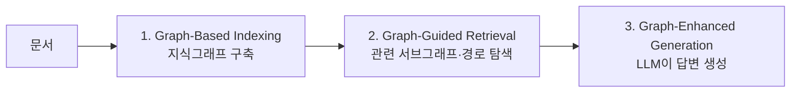

01~04장까지 다룬 검색은 모두 **텍스트 문서**를 검색 단위로 삼는 TextRAG였습니다. **GraphRAG**는 검색 대상을 문서가 아니라 **그래프**로 바꿉니다. 이 장은 지식을 그래프로 표현하는 방법부터, 실제 벤치마크에서 이 접근이 어떤 한계에 부딪혔고 어떻게 개선되었는지까지 다룹니다.

## 지식을 그래프로 표현하기

지식(knowledge)은 사실(fact)의 집합과 규칙(rule)의 집합으로 나눌 수 있습니다. 하나의 사실은 **(주어, 서술어, 목적어)** 형태의 <strong>트리플(triple)</strong>로 표현되며, 이 트리플이 그래프에서는 <strong>간선(edge)</strong>에 대응됩니다.

$$G = (V, E)$$

<strong>TAG(Text-Attributed Graph, 텍스트 속성 그래프)</strong>는 노드(Entity, 예: Person·City·Company)와 엣지(Relation, 예: LivesIn·WorksAt)로 구성되며, 각 노드·엣지에는 텍스트 속성이 함께 달립니다(예: Person 노드의 속성은 "Alice", LivesIn 엣지의 속성은 "since 2020"). "주어"와 "목적어"라는 역할은 고정되어 있지 않고 **상대적**입니다 — 어떤 트리플에서는 주어였던 개체가 다른 트리플에서는 목적어가 될 수 있습니다.

## GraphRAG의 3단계 파이프라인

GraphRAG는 크게 세 단계로 구성됩니다.

<strong>Graph-Based Indexing(그래프 색인)</strong>은 문서들로부터 지식그래프를 구축하는 단계로, 기존 오픈 지식그래프를 활용하거나 직접 문서로부터 그래프를 구축(Self-Constructed Graph)합니다.

> Darren Edge 외, "From Local to Global: A Graph RAG Approach to Query-Focused Summarization", *arXiv:2404.16130* (2024)

<strong>Graph-Guided Retrieval(G-Retrieval)</strong>은 질문에 관련된 서브그래프(subgraph)나 경로(path)를 찾아내는 단계이고, <strong>Graph-Enhanced Generation(G-Generation)</strong>은 검색된 그래프 정보를 바탕으로 LLM이 답변을 생성하는 단계입니다. 이 구조는 02장에서 다룬 Retriever-Reader 구조와 본질적으로 같은 틀이지만, 검색 단위가 텍스트 청크에서 그래프의 노드·경로·서브그래프로 바뀐 것이 차이입니다.

일부 구현체는 <strong>GNN(Graph Neural Network)</strong>을 검색에 활용합니다. GNN은 각 노드가 이웃 노드로부터 정보를 전달받아(Message Passing) 자신의 표현(representation)을 업데이트하는 방식으로 그래프를 처리하는 신경망입니다.

## Retriever의 종류와 검색 방식

Graph RAG에서 사용되는 Retriever는 여러 방식으로 구현됩니다. **Non-parametric Retriever**는 별도의 학습 파라미터 없이 그래프 구조 자체를 이용해, 질문의 주제 개체(topic entity)로부터 몇 단계 떨어진 경로(k-hop)를 검색합니다. **LM(Language Model)-based Retriever**는 언어모델을 이용해 관련성을 판단하고, **Subgraph Retriever**는 관련된 서브그래프 단위로, **GNN-based Retriever**는 GNN으로 학습된 그래프 구조상의 관련성을 이용해 검색합니다.

검색 방식도 두 축으로 나뉩니다. **Retrieval Paradigm**은 한 번만 검색하는 **Once Retrieval**과, 검색과 추론을 반복하며 점진적으로 정보를 모으는 **Iterative Retrieval** 중 선택합니다. **Retrieval Granularity**는 노드·트리플·경로·서브그래프 또는 이들을 섞은 Hybrid 방식 중 무엇을 검색 결과로 반환할지 결정합니다.

| Granularity | 반환 단위 | 특징 |
|---|---|---|
| Nodes | 개체 하나 | 가장 세밀하지만 문맥 정보 부족 |
| Triplets | (주어, 서술어, 목적어) | 사실 하나를 온전히 담음 |
| Paths | 여러 트리플이 이어진 경로 | 다단계 추론(multi-hop)에 유리 |
| Subgraphs | 관련 노드·엣지 묶음 | 가장 풍부한 문맥, 노이즈도 커짐 |

## 실습 벤치마크 — CRAG의 평가 방식

Meta가 주최한 KDD Cup의 **CRAG(Comprehensive RAG)** 벤치마크는 질문(`query`)·정답(`answer`) 외에 도메인(finance·music·movie·sports·open), 질문 유형(simple·comparison·multi-hop 등), 답이 바뀌는 속도(static·dynamic 등)를 함께 제공합니다. 웹 검색 결과는 원시 HTML로 제공되어, 태그를 제거하고 문장 단위로 청킹하는 전처리가 먼저 필요합니다. 금융처럼 표·수치 중심의 정형 데이터가 필요한 질문은 웹 텍스트만으로는 잘 풀리지 않는다는 점이 지식그래프 결합의 동기가 됩니다.

CRAG는 답변을 네 가지로 분류해 채점합니다.

$$\text{CRAG score} = n_{\text{perfect}} + 0.5 \times n_{\text{acceptable}} - n_{\text{incorrect}}$$

**Perfect**(정답과 완전히 일치, +1), **Acceptable**(사소한 오류는 있으나 유용한 답, +0.5), **Missing**("모른다"류의 무응답, 0), **Incorrect**(틀리거나 무관한 답, -1)로 나뉘며, 이 점수식이 의미하는 것은 명확합니다 — **모르는 질문에는 찍지 말고 모른다고 답하는 것이 감점을 피하는 전략**입니다. Perfect는 문자열 완전 일치로, Missing은 "모른다" 포함 여부로 기계적으로 판정하지만, Acceptable(의미상 동등) 여부는 자동 판정이 어려워 Reader보다 성능이 좋은 LLM에게 질문·정답·모델 답변을 주고 판정시키는 **LLM-as-a-judge** 방식을 씁니다.

## 실습에서 드러난 한계 — 고정된 질의 생성의 취약성

자연어 질문을 구조화된 질의(JSON 형태)로 변환한 뒤, 미리 정해둔 결정 트리(decision tree)에 따라 그래프에서 조회하는 방식의 Query Engine을 실제로 구현해보면 치명적인 한계가 드러납니다.

자연어 질문을 구조화된 질의로 바꾸는 과정 자체를 LLM에 맡기면, 똑같은 질문을 여러 번 넣어도 매번 다른 구조화 질의가 생성되는 <strong>비결정성(non-determinism)</strong>이 나타납니다(예: 시간 조건이 특정 "쿼리 시점"으로 잡히기도 하고 "올해"로 잡히기도 함). 이 무작위성 때문에 그래프에서 불필요하게 넓은 범위의 정보가 함께 딸려 나오게 됩니다. 03장에서 다룬 것처럼 불필요한 정보가 컨텍스트에 대량으로 섞여 들어가면, LLM의 컨텍스트 길이 한계를 초과할 위험뿐 아니라 오히려 명확한 답을 낼 수 있는 상황에서도 관련 없는 정보에 묻혀 "모른다"고 답하거나 틀린 답을 내는 경우가 늘어납니다.

이 문제의 해결 방향은 고정된 결정 트리를 버리는 것입니다. 06장에서 다룰 **MCP**를 이용해 그래프 조회 기능을 여러 개의 개별 Tool로 노출하고, LLM이 스스로 "지금 어떤 Tool이 필요한지" 판단해 호출하며, 결과가 불충분하면 추가 Tool 호출을 반복하는 **에이전틱 워크플로우**로 전환하면, 한 번에 필요 이상의 정보를 가져오는 대신 질문에 실제로 필요한 만큼만 단계적으로 조회할 수 있습니다.

그래프를 실제로 조회할 때는 **Cypher**(Neo4j 등 속성 그래프 DB에서 사용)나 **SPARQL**(RDF 형태의 지식그래프를 조회하는 W3C 표준 언어) 같은 질의 언어를 씁니다.

## 흔한 오개념 — "GraphRAG는 TextRAG보다 항상 더 정확한 상위 호환이다"

그래프가 텍스트보다 더 구조화된 정보를 담고 있으니 GraphRAG가 TextRAG의 상위 호환일 것이라 생각하기 쉽지만, 위에서 다룬 실습 사례가 보여주듯 그래프 조회 자체가 부정확하면(비결정적인 질의 생성) 오히려 TextRAG보다 나쁜 결과를 낼 수 있습니다. 그래프의 강점은 다단계 추론(multi-hop, 예: "A의 상사의 고향은?")처럼 명시적인 관계 체인을 따라가야 하는 질문에서 발휘되고, 단순한 사실 하나를 찾는 질문에는 텍스트 검색만으로 충분한 경우가 많습니다. 어떤 방식이 유리한지는 질문의 성격(단일 사실 조회인가, 관계를 여러 단계 거쳐야 하는가)에 달려 있으며, "그래프니까 더 정교하다"는 전제로 무조건 GraphRAG를 선택하는 것은 오히려 03장에서 다룬 컨텍스트 과잉 문제를 자초할 수 있습니다.

다음 장에서는 방금 언급한 에이전틱 워크플로우를 실제로 구현하는 표준 프로토콜인 MCP를 이용해, LLM이 정형 데이터베이스를 안전하게 조회하는 Text2SQL을 다룹니다.
