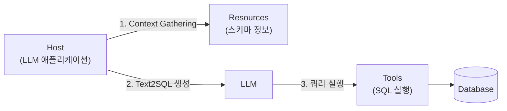

지금까지 다룬 검색은 텍스트 문서(01~04장)와 그래프(05장)를 대상으로 했습니다. 이 장은 세 번째 데이터 형태인 **정형 데이터베이스**를 다룹니다. LLM이 자연어 질문을 SQL로 바꿔 데이터베이스를 조회하게 하려면, 단순히 프롬프트에 스키마를 적어 넣는 것만으로는 안전하지도 표준화되지도 않습니다. 이 장은 이 문제를 표준 프로토콜로 해결하는 **MCP(Model Context Protocol)**를 다룹니다.

## N×M 통합 문제

MCP 이전에는, $N$개의 LLM 애플리케이션이 $M$개의 서로 다른 도구·데이터 소스에 연결되려면 이론적으로 $N \times M$개의 커스텀 연결 코드가 필요했습니다 — 애플리케이션마다 각 도구에 맞춰 별도로 연동해야 했기 때문입니다. 이는 USB가 등장하기 전 기기마다 다른 케이블이 필요했던 문제와 같은 구조입니다.

> "MCP is like a USB-C port for AI applications." — Model Context Protocol 공식 문서, https://modelcontextprotocol.io/introduction

MCP는 모든 도구가 **공통 표준 인터페이스**로 통신하게 만들어, 이 문제를 $N + M$ 수준으로 단순화합니다. 각 애플리케이션은 MCP라는 하나의 프로토콜만 구현하면 되고, 각 도구도 MCP 서버로 한 번만 노출하면 모든 MCP 호환 애플리케이션에서 쓸 수 있습니다.

## MCP의 세 가지 구성 요소

MCP는 역할이 분명하게 나뉜 세 가지 핵심 개념으로 구성됩니다. **Resources(리소스)**는 데이터베이스 스키마처럼 LLM에게 "무엇이 있는지"에 대한 정보를 공유하는 역할입니다(Schema Sharing). **Tools(도구)**는 실제로 무언가를 실행(execution)하는 역할로, 예를 들어 SQL 쿼리를 실제 데이터베이스에 실행하는 기능입니다. **Prompts**는 특정 작업을 위한 프롬프트 템플릿을 제공하는 역할입니다.

이를 사용하는 **Host**(LLM 애플리케이션)는 다음 순서로 동작합니다. 먼저 **Context Gathering** 단계에서 Host가 MCP 서버로부터 데이터베이스 스키마 정보(Resource)를 가져옵니다. 그다음 **Text2SQL & Execution** 단계에서 사용자의 자연어 질문과 앞서 가져온 스키마를 LLM에 함께 전달해 SQL 쿼리를 생성시키고, 이 쿼리를 MCP의 Tool을 통해 실제로 데이터베이스에 실행합니다.



임의의 SQL이 그대로 실행되지 않도록 하는 보안(Security & Best Practices)이 중요하게 다뤄집니다. 또한 실제 챗봇 서비스에서는 모든 사용자 입력이 SQL 질의는 아니므로, Host 쪽에서 "지금 이 요청이 일반 대화인지 Text2SQL을 호출해야 하는지"를 판단하는 **Host-Side Routing**이 필요합니다 — 일반 대화와 Text2SQL Assistant가 하나의 Host 안에서 공존하도록 설계합니다.

## 실습 구현 — FastMCP 서버와 LlamaIndex 클라이언트

서버 쪽은 `fastmcp` 라이브러리로 구현합니다. `FastMCP(name=..., port=...)`로 서버 객체를 만들고, 일반 파이썬 함수에 `@mcp.tool()` 데코레이터를 붙이면 함수 시그니처와 docstring이 그대로 Tool의 입력 스키마·설명이 되어 LLM에게 노출됩니다.

```python
from fastmcp import FastMCP

mcp = FastMCP(name="finance-server", port=8000)

@mcp.tool()
def get_price_history(ticker: str, days: int = 30) -> list[dict]:
    """지정한 티커의 최근 N일간 종가 이력을 반환한다."""
    return fetch_price_history(ticker, days)   # 실제 데이터 조회 로직

@mcp.resource(uri="schema://companies", mime_type="text/plain")
def company_schema() -> str:
    """회사명-티커 매핑 표기 형식 예시를 반환한다."""
    return "예: Apple Inc. -> AAPL, Samsung Electronics -> 005930.KS"

mcp.run(transport="streamable-http")
```

읽기 전용 데이터(예: 티커 표기 형식 예시)는 `@mcp.resource()`로 Resource로 등록합니다. LLM은 도구 설명을 보고 어떤 Tool을 부를지 판단하므로, **docstring을 명확히 쓰는 것 자체가 프롬프트 설계의 일부**입니다 — docstring이 모호하면 LLM이 엉뚱한 Tool을 선택하거나 잘못된 인자를 넘길 수 있습니다.

클라이언트 쪽은 LlamaIndex로 구현합니다. `BasicMCPClient(서버 URL)`로 서버에 접속하고 `McpToolSpec`으로 감싼 뒤 도구 목록을 받아 `FunctionAgent`에 넘기면, 에이전트가 질문을 받아 스스로 도구 호출을 반복하며 답을 만듭니다.

```python
from llama_index.tools.mcp import BasicMCPClient, McpToolSpec
from llama_index.core.agent.workflow import FunctionAgent

client = BasicMCPClient("http://localhost:8000")
tool_spec = McpToolSpec(client=client)
tools = await tool_spec.to_tool_list_async()

agent = FunctionAgent(tools=tools, llm=llm, system_prompt="금융 데이터 조회를 돕는 어시스턴트입니다.")
response = await agent.run("애플의 최근 30일 종가를 알려줘")
```

에이전트는 질문을 받으면 `ToolCall` → `ToolCallResult` 이벤트 스트림을 반복하며, 필요한 Tool을 스스로 판단해 호출합니다. 이는 05장 마지막에서 다룬 "고정된 결정 트리 대신 LLM이 스스로 Tool을 판단해 호출하는" 에이전틱 워크플로우의 실제 구현입니다.

## 실전 한계

이 구조에도 세 가지 실무적 한계가 있습니다. 첫째, 도구 출력이 그대로 모델 컨텍스트에 쌓이므로 결과가 길면 컨텍스트 한계를 초과해 실패할 수 있습니다 — 이는 03장에서 다룬 "검색 결과를 많이 넣을수록 좋은 것은 아니다"라는 원칙이 Tool 호출 결과에도 그대로 적용되는 사례입니다. 둘째, 어떤 Tool을 호출할지가 모델에 맡겨져 있어 동작을 예측하거나 디버깅하기 어렵습니다. 셋째, 도구 호출마다 서버 왕복이 발생해 다단계 워크플로우에서는 지연 시간이 누적됩니다.

## 흔한 오개념 — "MCP는 Text2SQL 전용 기술이다"

이 장이 Text2SQL 예시로 MCP를 설명했지만, MCP 자체는 SQL이나 데이터베이스에 국한된 기술이 아닙니다. MCP의 Resources·Tools·Prompts라는 세 요소는 "LLM에게 무엇이 있는지 알려주고(Resources), 무언가를 실행시키고(Tools), 특정 작업의 프롬프트 형식을 제공하는(Prompts)" 범용 인터페이스이며, 05장에서 다룬 GraphRAG의 그래프 조회 함수든, 파일 시스템 접근이든, 외부 API 호출이든 같은 방식으로 Tool로 노출할 수 있습니다. 이 장에서 Text2SQL을 예시로 다룬 이유는 "정형 데이터를 안전하게 다뤄야 한다"는 요구가 MCP의 설계 동기(임의 SQL 실행 방지 등)를 가장 뚜렷하게 보여주기 때문이지, MCP의 적용 범위가 SQL로 한정되기 때문이 아닙니다.

다음 장에서는 지금까지 다룬 여러 검색 방식(Sparse, Dense, Graph)의 결과를 마지막에 다시 정렬하는 Cross-Encoder를, 실제로 처음부터 학습시키는 방법으로 이 시리즈를 마무리합니다.
