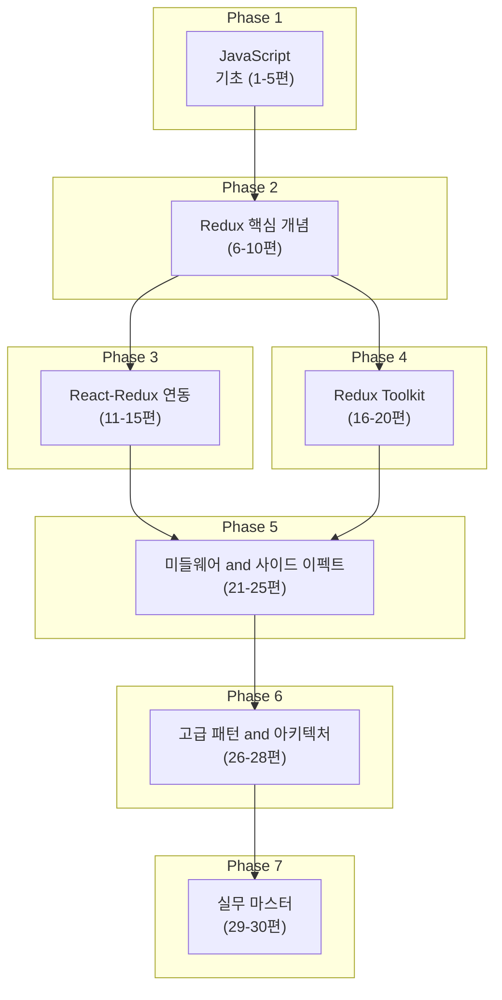

# Redux 완전 정복 - 초보부터 전문가까지

**Redux**는 JavaScript 앱을 위한 예측 가능한 **상태 관리** 라이브러리입니다. 복잡해지는 프론트엔드에서 "어떤 화면에서든 같은 데이터를 일관되게 다루고, 변경 이력을 추적할 수 있는 구조"가 필요해졌고, Flux 패턴을 단순화한 Redux가 그 답이 되었습니다.

> "You might not need Redux." — Dan Abramov, [You Might Not Need Redux (2016)](https://medium.com/@dan_abramov/you-might-not-need-redux-be46360cf367). Redux는 만능이 아니지만, **상태 관리**가 복잡해지는 순간 선택지가 됩니다. 이 시리즈는 그 선택을 할 수 있도록, 기초부터 실무까지 체계적으로 다룹니다.

이 챕터는 시리즈 소개이자 커리큘럼·학습 방법·참고 자료를 한곳에 모은 도입 페이지입니다. **왜 이 페이지부터 읽어야 할까요?** 실제 Redux 코드를 작성하기 전에, 전체 로드맵을 보면 "지금 내가 어디쯤에 있는지"와 "다음에 무엇을 배우면 되는지"를 항상 확인할 수 있습니다. 그래서 01편으로 들어가기 직전에, 이 커리큘럼 한 번만 훑어 두는 것을 권합니다.

## 왜 Redux를 배워야 하는가

이 시리즈에 들어서기 전에, **Redux를 배우는 이유**와 **이 학습이 끝났을 때 얻는 것**을 명확히 두면 동기가 유지되고 목표가 분명해집니다.

### 동기: 상태가 복잡해질 때 생기는 문제와 Redux의 이점

React만으로도 작은 앱은 만들 수 있습니다. 그러나 컴포넌트가 늘고 **상태**가 여러 화면·여러 단계에 흩어지면, **Props Drilling**(깊은 단계로 props만 계속 넘기기), **예측하기 어려운 업데이트**(어디서 state가 바뀌었는지 추적 어려움), **디버깅 난이도**(버그 재현과 원인 격리가 힘듦)가 생깁니다. Redux는 이런 문제를 줄이기 위해 **단일 소스 of Truth**(하나의 Store), **예측 가능한 단방향 데이터 흐름**(Action → Reducer → State), **Redux DevTools**를 통한 타임트래블 디버깅과 상태 스냅샷을 제공합니다. 상태 변경이 모두 액션·리듀서를 거치므로 "언제, 왜" 바뀌었는지 추적하기 쉽고, 팀에서 상태 규칙을 통일하기에도 유리합니다.

### 이 시리즈를 끝내면 해결할 수 있는 문제

이 커리큘럼을 완주하면 다음 같은 **실제 문제**를 스스로 설계·구현할 수 있게 됩니다. **대규모 폼·멀티 스텝 플로우**에서 단계별 데이터를 한 곳에서 관리하고, **서버 상태(API 응답)와 클라이언트 상태(UI, 폼)**를 일관되게 다루며, **팀 협업** 시 "상태는 어디서 바꾸고, 어떻게 나눌지" 같은 규칙을 Redux 패턴으로 정리할 수 있습니다. Redux Toolkit과 RTK Query를 쓰면 보일러플레이트를 줄이면서도 위와 같은 이점을 유지할 수 있습니다.

### 학습 결과로 얻는 것 (실무·취업 관점)

실무에서는 **레거시 Redux** 코드베이스 유지보수, **신규 프로젝트**에서 상태 구조 설계, **Redux를 쓸지 말지**(Context API, Zustand 등 대안과의 트레이드오프) 판단이 자주 필요합니다. 이 시리즈를 마치면 Redux/Redux Toolkit/RTK Query를 활용해 상태를 설계하고, 디버깅·테스트·최적화까지 할 수 있는 수준에 도달합니다. 프론트엔드 채용에서도 "상태 관리 경험"을 요구하는 경우가 많으므로, Redux를 이해하고 실습한 경험은 이력과 면접에서 차별화 요소가 됩니다.

| 구분 | 내용 |
|------|------|
| **동기** | Props Drilling·예측 어려운 업데이트·디버깅 난이도 → Redux의 단일 Store, 단방향 흐름, DevTools로 완화 |
| **해결하는 문제** | 대규모 폼/멀티 스텝, 서버·클라이언트 상태 일관성, 팀 협업 시 상태 규칙 통일 |
| **학습 결과** | 레거시 Redux 유지보수, 신규 프로젝트 상태 설계, Redux vs 대안 판단, 실무·취업 차별화 |

### Redux를 쓰기 좋은 경우 / 피하는 경우 (한눈에 보기)

실무에서 "Redux를 도입할지" 결정할 때 참고할 수 있도록, **사용해도 되는 경우**와 **피하는 경우**를 요약합니다. 상세한 판단 기준과 대안(Context API, Zustand 등)은 10편 "언제 Redux를 쓸까"에서 다룹니다.

| 구분 | 내용 |
|------|------|
| **쓰기 좋은 경우** | 여러 화면·컴포넌트가 같은 상태를 공유할 때; 상태 업데이트 로직이 복잡하거나 디버깅·재현이 중요할 때; 미들웨어(로깅·비동기)로 액션을 가로채야 할 때; 팀에서 상태 규칙을 통일하고 싶을 때. |
| **피하는 경우** | 로컬 UI 상태만 있고 props drilling이 심하지 않을 때; 앱 규모가 작고 학습 비용 대비 이득이 적을 때; 서버 상태만 필요하고 RTK Query 외 Redux 기능이 거의 필요 없을 때. |

## 프로젝트 개요

이 절에서는 이 시리즈가 어떤 목표를 두고, 어떤 독자를 위한 것인지 한눈에 정리합니다.

이 프로젝트는 **JavaScript를 잘 다루지 못하는 개발자도 Redux를 통해 SW 전문가 수준으로 성장**할 수 있도록 설계된 체계적인 학습 가이드입니다.

총 **30편**의 글을 통해 JavaScript 기초부터 **Redux**의 고급 기법까지, 현대적인 Redux Toolkit과 RTK Query를 활용한 실무 능력을 완벽하게 습득합니다.

## 학습 목표

- JavaScript/TypeScript 기초부터 Redux까지 단계적 학습
- Redux Toolkit을 활용한 현대적인 상태 관리 패턴 마스터
- React-Redux Hooks를 통한 효율적인 컴포넌트 연동
- 비동기 처리와 사이드 이펙트 관리 (Thunk, Saga, RTK Query)
- 실전 프로젝트를 통한 아키텍처 설계 및 최적화 능력 배양
- 테스팅, 디버깅, 성능 최적화 등 전문가 수준의 실무 역량 개발

## 커리큘럼 한눈에 보기

아래는 Phase별로 어떤 주제를 다루는지, 그리고 각 편의 제목과 링크를 한 테이블로 모은 것입니다. 학습 순서를 정할 때 이 표를 기준으로 "다음에 읽을 글"을 고르면 됩니다.

### Phase 1: JavaScript/TypeScript 기초 다지기 (1-5편)

이 절에서는 1~5편이 다루는 범위와, Redux 학습과의 연결을 요약합니다.

**왜 이 Phase가 필요한가**: Redux의 Action, Reducer, state는 모두 JavaScript의 변수·함수·객체·배열로 이루어져 있습니다. 이 Phase를 건너뛰면 07편(Reducer 작성)·09편(데이터 흐름)에서 코드를 읽고 수정하는 데 어렵습니다. **배우면 얻는 것**: Redux 코드를 읽고 작성할 수 있는 언어 기초와, 불변성·비동기·타입 개념이 잡혀 Phase 2로 넘어갈 준비가 됩니다. **기대 효과와의 연결**: 기술적 역량 — Modern JavaScript/TypeScript 능숙한 사용.

| 편 | 제목 | 링크 | 이 편이 필요한 이유 / 이 편을 마치면 |
|----|------|------|--------------------------------------|
| 01 | JavaScript 핵심 개념 - 변수, 함수, 객체 | [01. JavaScript 핵심 개념](01-javascript-fundamentals/) | Reducer/state가 모두 JS 객체·함수이므로 이 기초 없이는 07·09편 이해가 어렵다. 배우면 Redux 코드를 읽고 수정할 기초가 된다. |
| 02 | ES6+ 필수 문법 - 구조 분해, 스프레드, 템플릿 리터럴 | [02. ES6+ 필수 문법](02-es6-essential-syntax/) | Redux에서 스프레드로 불변 업데이트를 자주 쓴다. 이 편을 마치면 08편(불변성)과 리듀서 작성이 수월해진다. |
| 03 | 배열과 객체 다루기 - map, filter, reduce | [03. 배열과 객체 다루기](03-array-object-manipulation/) | 리듀서와 selector에서 map/filter/reduce 패턴이 핵심이다. 배우면 상태 파생·변환 로직을 작성할 수 있다. |
| 04 | 비동기 JavaScript - Promise와 async/await | [04. 비동기 JavaScript](04-asynchronous-javascript/) | Thunk·RTK Query 등 비동기 액션의 기반이다. 이 편 없이는 21~24편(미들웨어·API) 이해가 어렵다. |
| 05 | TypeScript 기초 - 타입 시스템 이해하기 | [05. TypeScript 기초](05-typescript-basics/) | 실무 Redux는 타입 안전하게 쓰는 경우가 많다. 28편(Redux와 TypeScript)과 실전 프로젝트의 기초가 된다. |

### Phase 2: Redux 핵심 개념 (6-10편)

앞의 Phase 1이 JS/TS 기초라면, 이 Phase에서는 Redux 자체의 개념에 집중합니다.

**왜 이 Phase가 필요한가**: Redux를 "쓰는 방법"만 익히고 개념을 건너뛰면, 왜 그런 구조인지·언제 Redux를 쓸지 판단하지 못합니다. 이 Phase를 마치면 Store/Action/Reducer와 단방향 흐름을 설명하고, 작은 앱을 순수 Redux만으로 구현할 수 있습니다. **기대 효과와의 연결**: 기술적 역량 — Redux 상태 관리 마스터의 기초; 전문가 수준 — "상태 관리가 왜 필요한지" 설명·판단 능력.

| 편 | 제목 | 링크 | 이 편이 필요한 이유 / 이 편을 마치면 |
|----|------|------|--------------------------------------|
| 06 | Redux란 무엇인가 - Flux 아키텍처와 상태 관리 | [06. Redux란 무엇인가](06-what-is-redux/) | 상태 관리가 왜 필요한지, Redux가 어떤 문제를 푸는지 알지 못하면 이후 편이 "암기"가 된다. 배우면 학습 동기와 설계 판단의 기준이 생긴다. |
| 07 | Redux의 핵심 - Action, Reducer, Store | [07. Redux 핵심 개념](07-redux-core-concepts/) | Redux 코드의 90%는 이 세 요소 조합이다. 이 편 없이는 11편(React-Redux) 이후 모든 실습이 불가능하다. |
| 08 | 불변성의 중요성 - Immutability in Redux | [08. 불변성](08-immutability-in-redux/) | 불변성을 지키지 않으면 리듀서에서 예측 불가한 버그와 리렌더 이슈가 난다. 배우면 올바른 state 업데이트 패턴을 쓸 수 있다. |
| 09 | Redux 데이터 흐름 이해하기 | [09. Redux 데이터 흐름](09-redux-data-flow/) | dispatch→reducer→구독자 흐름을 모르면 11·12편(Provider, 훅)이 왜 필요한지 이해하기 어렵다. 디버깅과 DevTools 활용의 기초가 된다. |
| 10 | Redux를 사용하는 이유와 적절한 사용 시기 | [10. 언제 Redux를 쓸까](10-when-to-use-redux/) | 실무에서 "Redux 쓸까 말까" 판단이 필요하다. 배우면 프로젝트 규모·요구사항에 맞는 선택을 할 수 있다. |

### Phase 3: React-Redux 연동 (11-15편)

Redux 개념을 익힌 뒤, 실제 화면(React 컴포넌트)과 Store를 어떻게 연결하는지 다룹니다.

**왜 이 Phase가 필요한가**: Store만 있어도 화면과 연결하지 않으면 앱으로 동작하지 않습니다. 이 Phase를 건너뛰면 Redux를 "실제 화면에 반영"할 수 없고, 16편 이후 RTK·미들웨어도 React와 연동하는 방법을 알아야 쓸 수 있습니다. **배우면 얻는 것**: Provider·connect·Hooks로 컴포넌트와 Store를 연결하고, 리렌더 최적화와 selector 패턴까지 적용한 Counter·Todo 수준 앱을 만들 수 있습니다. **기대 효과와의 연결**: 기술적 역량 — React-Redux를 통한 효율적인 컴포넌트 설계; 실무 능력 — 실전 프로젝트 구현의 첫 단계.

| 편 | 제목 | 링크 | 이 편이 필요한 이유 / 이 편을 마치면 |
|----|------|------|--------------------------------------|
| 11 | React-Redux 시작하기 - Provider와 connect | [11. React-Redux 시작하기](11-react-redux-basics/) | Store를 컴포넌트에 주입하는 방법을 모르면 Redux state가 화면에 반영되지 않는다. 배우면 앱 전체에서 Store를 사용할 수 있다. |
| 12 | React-Redux Hooks - useSelector와 useDispatch | [12. React-Redux Hooks](12-react-redux-hooks/) | 실무에서는 Hooks 방식이 주로 쓰인다. 이 편을 마치면 함수 컴포넌트에서 state 구독·dispatch를 간결하게 쓸 수 있다. |
| 13 | 컴포넌트 최적화 - 리렌더링 제어 | [13. 컴포넌트 최적화](13-component-optimization/) | 구독 범위를 잘못 잡으면 불필요한 리렌더로 성능이 떨어진다. 배우면 실무 수준의 렌더 제어가 가능해진다. |
| 14 | 데이터 선택자 - Selector 패턴 | [14. Selector 패턴](14-selector-patterns/) | state에서 파생 데이터를 안전·재사용 가능하게 꺼내는 방법이다. 13편 최적화와 26편(구조)의 기초가 된다. |
| 15 | 실습: Counter와 Todo 앱 만들기 | [15. 실습: Counter와 Todo](15-practice-counter-todo/) | 1~14편을 한 번에 적용하는 종합 실습이다. 마치면 Redux+React 기초를 스스로 구현할 수 있다는 확신이 생긴다. |

### Phase 4: Redux Toolkit - 현대적인 Redux (16-20편)

Redux Toolkit으로 생산성을 높이는 단계입니다. (챕터 예정)

**왜 이 Phase가 필요한가**: 순수 Redux만으로는 보일러플레이트가 많아 실무에서 RTK를 쓰는 경우가 대부분이다. 이 Phase를 마치면 createSlice·configureStore·createAsyncThunk로 동일한 기능을 더 짧고 안전하게 작성할 수 있다. **기대 효과와의 연결**: 기술적 역량 — Redux Toolkit을 활용한 상태 관리 마스터; 실무 능력 — 신규 프로젝트에서 권장 방식 적용.

| 편 | 제목 | 링크 |
|----|------|------|
| 16 | Redux Toolkit 소개 - 왜 RTK인가? | [16. Redux Toolkit 소개](16-redux-toolkit-introduction/) |
| 17 | createSlice - 간결한 리듀서 작성 | (예정) |
| 18 | configureStore - Store 설정 자동화 | (예정) |
| 19 | createAsyncThunk - 비동기 액션 간편화 | (예정) |
| 20 | 실습: Redux Toolkit으로 실전 앱 만들기 | (예정) |

### Phase 5: 미들웨어와 사이드 이펙트 (21-25편)

**왜 이 Phase가 필요한가**: API 호출·로깅·에러 처리 등 "액션 외부 부수 효과"를 다루지 않으면 실전 앱을 완성하기 어렵다. 이 Phase를 마치면 Thunk·Saga·RTK Query 중 상황에 맞는 방식을 선택할 수 있다. **기대 효과와의 연결**: 기술적 역량 — 비동기 처리와 사이드 이펙트 관리; 실무 능력 — 서버 상태·캐싱 연동.

비동기 처리와 복잡한 로직을 다루는 단계입니다. (챕터 예정)

| 편 | 제목 | 이 편이 필요한 이유 / 이 편을 마치면 |
|----|------|--------------------------------------|
| 21 | Redux 미들웨어의 이해 | API 호출·로깅 등 액션 외부 부수 효과의 문을 연다. 배우면 22~24편(Thunk·Saga·RTK Query)이 왜 필요한지 이해한다. |
| 22 | Redux Thunk - 가장 간단한 비동기 처리 | 비동기 액션을 가장 단순한 형태로 다룬다. 마치면 dispatch 안에서 API 호출·지연 dispatch를 쓸 수 있다. |
| 23 | Redux Saga - 강력한 사이드 이펙트 관리 | 복잡한 비동기·순서 제어가 필요할 때 선택한다. 마치면 제너레이터 기반 사이드 이펙트 흐름을 설계할 수 있다. |
| 24 | RTK Query - 데이터 페칭의 혁명 | 서버 상태·캐싱을 Redux와 통합하는 공식 방식이다. 마치면 API 페칭·캐시·뮤테이션을 선언적으로 다룰 수 있다. |
| 25 | 실습: RTK Query로 블로그 앱 만들기 | 21~24편을 종합 적용하는 실습이다. 마치면 Thunk·Saga·RTK Query 중 상황에 맞는 방식을 선택할 수 있다. |

### Phase 6: 고급 패턴과 아키텍처 (26-28편)

**왜 이 Phase가 필요한가**: 폴더 구조·정규화·타입 설계 없이 진행하면 대규모 앱에서 유지보수가 어려워진다. 이 Phase를 마치면 확장 가능한 Redux 구조와 TypeScript 연동을 설계할 수 있다. **기대 효과와의 연결**: 실무 능력 — 확장 가능한 아키텍처 설계; 전문가 수준 — 복잡한 상태 관리 문제를 설계부터 해결까지 완수.

전문가 수준의 Redux 아키텍처 설계 단계입니다. (챕터 예정)

| 편 | 제목 | 이 편이 필요한 이유 / 이 편을 마치면 |
|----|------|--------------------------------------|
| 26 | Redux 프로젝트 구조 - 확장 가능한 설계 | 폴더·모듈 구분 없이 진행하면 대규모 앱에서 유지보수가 어렵다. 마치면 확장 가능한 Redux 폴더 구조를 설계할 수 있다. |
| 27 | 정규화 (Normalization) - 복잡한 데이터 관리 | 중첩·중복 데이터는 업데이트와 일관성 이슈를 낳는다. 마치면 정규화된 state 형태로 복잡한 데이터를 다룰 수 있다. |
| 28 | Redux와 TypeScript - 타입 안전한 상태 관리 | 실무에서는 타입 안전한 액션·state가 자주 요구된다. 마치면 Redux와 TypeScript를 연동한 타입 안전한 구조를 설계할 수 있다. |

### Phase 7: 실무 마스터 레벨 (29-30편)

**왜 이 Phase가 필요한가**: 성능·디버깅·테스트를 다루지 않으면 배포 후 이슈 대응과 리팩토링이 어렵다. 이 Phase를 마치면 Redux 앱의 성능 최적화·테스트 작성·E-Commerce 수준 실전 프로젝트를 완수할 수 있다. **기대 효과와의 연결**: 실무 능력 — 성능 최적화와 디버깅, 테스트 작성과 코드 품질; 전문가 수준 — 팀원에게 Redux를 가르칠 수 있는 수준.

실전 프로젝트와 최적화, 테스팅 단계입니다. (챕터 예정)

| 편 | 제목 | 이 편이 필요한 이유 / 이 편을 마치면 |
|----|------|--------------------------------------|
| 29 | Redux 성능 최적화와 디버깅 | 성능·디버깅을 다루지 않으면 배포 후 이슈 대응이 어렵다. 마치면 Redux DevTools 활용·리렌더 최적화·디버깅 기법을 적용할 수 있다. |
| 30 | 테스팅과 실전 프로젝트 - E-Commerce 앱 | 테스트와 실전 앱을 한 번에 체험하는 종합 단계다. 마치면 Redux 앱의 테스트 작성과 E-Commerce 수준 실전 프로젝트를 완수할 수 있다. |

아래는 Phase별 상세 목차입니다.

### Phase별 상세 목차

**Phase 1 (1-5편)**  
1. [JavaScript 핵심 개념 - 변수, 함수, 객체](01-javascript-fundamentals/) — 변수 선언 (var, let, const), 함수 정의와 화살표 함수, 객체와 배열 기본 조작  
2. [ES6+ 필수 문법 - 구조 분해, 스프레드, 템플릿 리터럴](02-es6-essential-syntax/) — 구조 분해 할당, 스프레드 연산자와 Rest 파라미터, 템플릿 리터럴  
3. [배열과 객체 다루기 - map, filter, reduce](03-array-object-manipulation/) — 고차 함수, map/filter/reduce, 불변성 유지 패턴  
4. [비동기 JavaScript - Promise와 async/await](04-asynchronous-javascript/) — 비동기 필요성, Promise, async/await  
5. [TypeScript 기초 - 타입 시스템 이해하기](05-typescript-basics/) — 기본 타입과 인터페이스, 제네릭 기초  

**Phase 2 (6-10편)**  
6. [Redux란 무엇인가 - Flux 아키텍처와 상태 관리](06-what-is-redux/)  
7. [Redux의 핵심 - Action, Reducer, Store](07-redux-core-concepts/)  
8. [불변성의 중요성 - Immutability in Redux](08-immutability-in-redux/)  
9. [Redux 데이터 흐름 이해하기](09-redux-data-flow/)  
10. [Redux를 사용하는 이유와 적절한 사용 시기](10-when-to-use-redux/)  

**Phase 3 (11-15편)**  
11. [React-Redux 시작하기 - Provider와 connect](11-react-redux-basics/)  
12. [React-Redux Hooks - useSelector와 useDispatch](12-react-redux-hooks/)  
13. [컴포넌트 최적화 - 리렌더링 제어](13-component-optimization/)  
14. [데이터 선택자 - Selector 패턴](14-selector-patterns/)  
15. [실습: Counter와 Todo 앱 만들기](15-practice-counter-todo/)  

**Phase 4~7 (16-30편, 예정)**  
16. [Redux Toolkit 소개](16-redux-toolkit-introduction/) — 17. createSlice — 18. configureStore — 19. createAsyncThunk — 20. 실습 RTK 앱 — 21. 미들웨어 — 22. Thunk — 23. Saga — 24. RTK Query — 25. 실습 블로그 앱 — 26. 프로젝트 구조 — 27. 정규화 — 28. Redux와 TypeScript — 29. 성능 최적화와 디버깅 — 30. 테스팅과 E-Commerce 앱

## 각 글의 구성

이 절에서는 **한 편 한 편의 챕터가 어떤 블록으로 이루어져 있는지**를 요약합니다. 글을 읽을 때 "학습 목표 → 핵심 개념 → 실습 코드 → 체크리스트" 순서로 보면 효율적입니다.

각 챕터는 다음과 같은 구조로 구성됩니다:

### **기본 구성**
- **학습 목표**: 이 챕터에서 달성할 구체적인 학습 목표
- **핵심 개념**: 반드시 이해해야 할 핵심 내용
- **실습 코드**: 직접 따라할 수 있는 예제 코드
- **흔한 실수**: 초보자가 자주 하는 실수와 해결 방법
- **체크리스트**: 학습 완료 확인을 위한 체크리스트

### **JavaScript 기초 챕터 (1-5편)**
- **왜 배워야 하는가**: 해당 개념이 Redux에서 어떻게 사용되는지
- **단계별 설명**: 초보자도 이해할 수 있는 상세한 설명
- **실습 문제**: 손으로 직접 코딩하며 익히는 연습 문제

### **Redux 실전 챕터 (6-30편)**
- **실무 사례**: 실제 프로젝트에서의 활용 예시
- **Best Practices**: 업계 표준 패턴과 모범 사례
- **안티패턴**: 피해야 할 나쁜 패턴들
- **심화 학습**: 더 깊이 공부하고 싶은 분들을 위한 고급 주제

### **챕터 작성 시 메타데이터 규칙**
컬렉션 목록 순서와 URL 안정성을 위해, **01편부터 30편까지 각 챕터의 frontmatter**에 다음을 반드시 넣습니다. **`collection_order`**: 편 번호와 동일한 정수(1, 2, …, 30). **`slug`**: 소문자·하이픈·영문만 사용하는 kebab-case(예: `javascript-fundamentals`, `redux-toolkit-introduction`). 00 챕터는 `collection_order: 0`, `slug: getting-started-redux`를 사용합니다. 새 챕터를 추가할 때 이 규칙을 지키면 목록 정렬과 링크가 커리큘럼과 일치합니다.

## 학습 방법론

여기서는 **어떤 순서로, 얼마나 시간을 두고 학습할지**에 대한 실질적인 가이드를 다룹니다. "초보자를 위한 단계적 접근"과 "효과적인 학습 프로세스"를 먼저 읽은 뒤, 자신에 맞는 "추천 학습 경로"를 선택하면 됩니다.

### 초보자를 위한 단계적 접근

1. **JavaScript 기초 탄탄히** (1-5편)  
   급하게 넘어가지 말고 충분히 연습, 모든 예제 코드를 직접 타이핑, 에러를 두려워하지 말고 실험하기.

2. **Redux 개념 완벽 이해** (6-10편)  
   각 개념의 '왜'를 이해하기, 그림과 다이어그램으로 시각화, 작은 예제부터 시작.

3. **실습으로 체화** (11-30편)  
   이론 학습 후 반드시 실습, 에러 메시지 읽는 법 익히기, 공식 문서 참조 습관 들이기.

### 효과적인 학습 프로세스

한 편의 글을 "읽기만 하고 끝" 내지 "코드만 복사해서 실행"하면 기억에 잘 남지 않습니다. 아래 흐름은 **개념 학습 → 따라하기 → 응용 → 실습 → 복습**까지 한 사이클을 정리한 것입니다. 각 단계를 건너뛰지 않고 따라가면 이해가 오래 유지되고, 실무에서 바로 꺼내 쓸 수 있습니다.

```
1. 개념 학습 (읽기)
   ↓
2. 예제 따라하기 (타이핑)
   ↓
3. 변형해보기 (응용)
   ↓
4. 문제 해결하기 (실습)
   ↓
5. 복습과 정리 (체크리스트)
```

이 사이클을 한 챕터마다 한 번씩 적용해 보세요. 특히 2번(직접 타이핑)과 4번(실습 문제)을 생략하면 "알 것 같은데 막상 코드를 못 짜는" 상태가 되기 쉽습니다.

### 학습 팁

- **하루 1-2시간, 꾸준히**: 한꺼번에 많이 하는 것보다 매일 조금씩
- **손으로 직접 코딩**: 복사-붙여넣기 금지!
- **에러는 친구**: 에러 메시지를 읽고 이해하는 연습
- **커뮤니티 활용**: 막힐 때는 질문하기 (Stack Overflow, Discord)
- **프로젝트 만들기**: 배운 내용으로 작은 프로젝트 직접 만들어보기

## 기대 효과

이 시리즈를 완주하면 다음과 같은 역량을 갖추게 됩니다:

### **기술적 역량**
- Modern JavaScript/TypeScript 능숙한 사용
- Redux/Redux Toolkit을 활용한 상태 관리 마스터
- React-Redux를 통한 효율적인 컴포넌트 설계
- 비동기 처리와 사이드 이펙트 관리 능력

### **실무 능력**
- 실전 프로젝트 구조 설계 및 구현
- 성능 최적화와 디버깅 기법
- 테스트 작성과 코드 품질 관리
- 확장 가능한 아키텍처 설계

### **전문가 수준**
- Redux 공식 문서를 스스로 읽고 학습하는 능력
- 새로운 라이브러리와 패턴을 빠르게 습득
- 팀원들에게 Redux를 가르칠 수 있는 수준
- 복잡한 상태 관리 문제를 설계부터 해결까지 완수

### Phase/챕터와 역량 매핑

각 Phase가 위 **기대 효과**의 어떤 역량에 직접 기여하는지 요약하면 아래와 같습니다. "결과적으로 어떤 것에 도움이 되는지"를 선택·복습할 때 참고하세요.

| 역량 | 기여하는 Phase |
|------|----------------|
| Modern JavaScript/TypeScript 능숙한 사용 | Phase 1 (1-5편) |
| Redux/Redux Toolkit을 활용한 상태 관리 마스터 | Phase 2(개념) + Phase 4(RTK) + Phase 5(미들웨어) + Phase 6(아키텍처) |
| React-Redux를 통한 효율적인 컴포넌트 설계 | Phase 3 (11-15편) |
| 비동기 처리와 사이드 이펙트 관리 능력 | Phase 1(04편) + Phase 5 (21-25편) |
| 실전 프로젝트 구조 설계 및 구현 | Phase 3(실습) + Phase 4·5(실습) + Phase 6(구조) + Phase 7(29-30편) |
| 성능 최적화와 디버깅, 테스트·코드 품질 | Phase 3(13-14편) + Phase 7 (29-30편) |
| 확장 가능한 아키텍처 설계 | Phase 6 (26-28편) |
| Redux 문서 독학·패턴 습득·가르침·복잡 문제 해결 | Phase 2(판단) + Phase 6-7 전반 |

## 이 시리즈를 읽은 후 달성해야 할 목표 (평가 기준)

이 시리즈를 완주한 뒤에는 **상태 관리가 왜 필요한지**를 설명하고, **Redux의 세 가지 원칙**을 말과 코드로 보여 줄 수 있으며, **프로젝트 규모와 요구사항에 따라 Redux를 쓸지 Context API 등 대안을 쓸지** 판단할 수 있게 됩니다. 또한 **Action·Reducer·Store**를 조합해 Counter·Todo 수준의 작은 앱을 구현하고, **React-Redux(Provider·connect 또는 Hooks)**로 컴포넌트와 Store를 연결하며, **selector·메모이제이션·React.memo**로 불필요한 리렌더링을 줄일 수 있는 수준에 도달합니다. 아래 표의 항목을 스스로 설명·선택·구현할 수 있으면 학습 목표를 달성한 것입니다.

| 영역 | 평가 기준 |
|------|-----------|
| 개념 | **상태 관리**가 왜 필요한지, Flux/Redux의 단방향 데이터 흐름을 설명할 수 있다. |
| 원칙 | Redux의 세 가지 원칙(Single Source of Truth, Read-Only State, Pure Reducers)을 설명하고 코드로 보여줄 수 있다. |
| 판단 | 프로젝트 규모·요구사항에 따라 Redux를 쓸지, Context API 등 대안을 쓸지 판단할 수 있다. |
| 구현 | Action, Reducer, Store를 조합해 작은 앱(Counter, Todo)을 구현할 수 있다. |
| 연동 | React-Redux(Provider, connect 또는 Hooks)로 컴포넌트와 Store를 연결할 수 있다. |
| 최적화 | 불필요한 리렌더링을 줄이기 위해 selector·메모이제이션·React.memo를 적용할 수 있다. |

## 사용법

### **추천 학습 경로**

**1. JavaScript 초보자**  
Phase 1 (1-5편) → Phase 2 (6-10편) → Phase 3 (11-15편) → Phase 4 (16-20편) → Phase 5 (21-25편) → Phase 6-7 (26-30편).  
**예상 소요 시간**: 3-4개월 (하루 1-2시간)

**2. JavaScript는 알지만 Redux는 처음**  
Phase 1 (빠르게 복습) → Phase 2 (6-10편) → Phase 4 (16-20편) → Phase 3 (11-15편) → Phase 5 (21-25편) → Phase 6-7 (26-30편).  
**예상 소요 시간**: 2-3개월

**3. 기존 Redux 사용자 (RTK 학습 목적)**  
Phase 4 (16-20편) → Phase 5 (21-25편) → Phase 6-7 (26-30편).  
**예상 소요 시간**: 1-2개월

### **참고 학습 방법**
- 특정 주제가 궁금할 때 해당 챕터만 선택적으로 학습
- 실무에서 문제 발생 시 관련 챕터 참조
- 코드 리뷰나 아키텍처 설계 시 Best Practices 참고

## 실습 프로젝트

### **Phase별 프로젝트**

**Phase 3: 기본 앱**  
- **Counter 앱**: Redux 기초 이해  
- **Todo 앱**: CRUD 작업과 상태 관리  

**Phase 4: 실전 앱**  
- **사용자 관리 시스템**: Redux Toolkit 활용  
- **날씨 앱**: API 연동과 비동기 처리  

**Phase 5: 고급 앱**  
- **블로그 앱**: RTK Query로 완전한 CRUD  
- **소셜 미디어 피드**: 무한 스크롤과 캐싱  

**Phase 7: 최종 프로젝트**  
- **E-Commerce 앱**: 장바구니, 결제, 주문 관리 — 상품 목록 및 검색, 장바구니 관리, 사용자 인증, 주문 처리, 결제 시뮬레이션

## 참고 자료

### **공식 문서**
- [Redux 공식 문서](https://redux.js.org/)
- [Redux Toolkit 공식 문서](https://redux-toolkit.js.org/)
- [React-Redux 공식 문서](https://react-redux.js.org/)
- [RTK Query 공식 문서](https://redux-toolkit.js.org/rtk-query/overview)

### **추천 학습 자료**
- [Redux Essentials 튜토리얼](https://redux.js.org/tutorials/essentials/part-1-overview-concepts)
- [Redux Fundamentals 튜토리얼](https://redux.js.org/tutorials/fundamentals/part-1-overview)
- [Egghead.io - Redux 코스](https://egghead.io/courses/fundamentals-of-redux-course-from-dan-abramov-bd5cc867)

### **유용한 도구**
- [Redux DevTools Extension](https://github.com/reduxjs/redux-devtools)
- [Redux Toolkit Templates](https://redux-toolkit.js.org/introduction/getting-started#using-create-react-app)
- [TypeScript Redux Template](https://github.com/reduxjs/cra-template-redux-typescript)

## 커리큘럼 맵

Phase 1부터 7까지의 **진행 순서**와 **Phase 간 연결 관계**를 한눈에 보려면 아래 다이어그램을 참고하세요. Phase 2(Redux 핵심)를 마친 뒤에는 Phase 3(React-Redux)과 Phase 4(Redux Toolkit) 중 어느 쪽을 먼저 갈지 선택할 수 있고, 두 경로 모두 Phase 5(미들웨어)로 합쳐집니다. 자신의 수준(JS 초보인지, Redux만 새로 배우는지)에 맞는 경로를 골라 순서대로 진행하면 됩니다.



(노드 라벨의 `&`는 Mermaid 파서 호환을 위해 `and`로 표기했습니다.)

위 맵에서 화살표는 "이 Phase를 끝낸 뒤 다음으로 권장하는 Phase"를 의미합니다. 실제 학습 시에는 "추천 학습 경로" 절의 시나리오(초보자 / Redux만 처음 / RTK 목적)에 맞는 경로를 선택하면 됩니다.

## 학습 지원

- **자주 묻는 질문**: 각 챕터마다 FAQ 섹션이 포함되어 있습니다.
- **트러블슈팅**: 흔한 에러와 해결 방법을 상세히 설명합니다.
- **커뮤니티**: [Reactiflux Discord](https://www.reactiflux.com/), [Stack Overflow - Redux 태그](https://stackoverflow.com/questions/tagged/redux), [Reddit - r/reactjs](https://www.reddit.com/r/reactjs/)

---

**"Redux를 배우는 것은 단순히 라이브러리를 익히는 것이 아니라, 상태 관리에 대한 깊은 이해를 얻는 여정입니다."**

JavaScript를 잘 모르는 당신도, 이 시리즈를 마치면 Redux 전문가가 될 수 있습니다.

**Let's start your Redux journey!**

## 다음 단계

다음 챕터부터 시작하세요: [01. JavaScript 핵심 개념 - 변수, 함수, 객체](01-javascript-fundamentals/).
