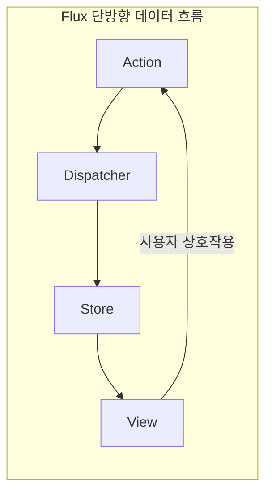
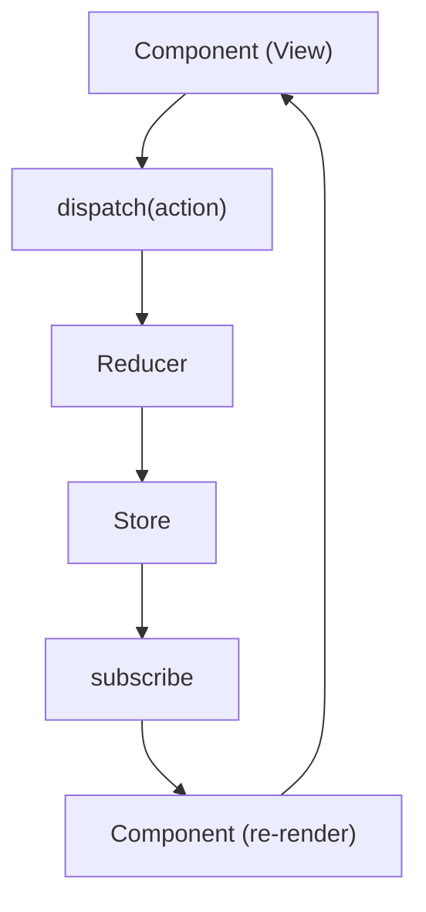

01~05장에서 JavaScript/TypeScript 기초를 다졌다면, 이 장부터 **Redux 자체**를 다룹니다. "Redux란 무엇인가"에서는 **상태 관리가 왜 필요한지**, **Flux·Redux의 단방향 데이터 흐름**이 어떤 문제를 해결하는지를 배웁니다. 이 장을 마치면 07(Action, Reducer, Store)로 넘어가 Redux의 구체적인 API를 익힐 준비가 됩니다.

## 이 글을 읽은 후 달성해야 할 목표 (평가 기준)

이 챕터를 마치면 다음을 할 수 있어야 합니다:

- **상태 관리**가 왜 필요한지, Props Drilling·상태 동기화 문제를 설명할 수 있다.
- **Flux** 아키텍처의 등장 배경과 단방향 데이터 흐름을 설명할 수 있다.
- Redux의 세 가지 원칙(Single Source of Truth, Read-Only State, Pure Reducers)을 설명하고 코드로 구분할 수 있다.
- Store, **Action**, **Reducer**의 역할을 구분하고, 언제 Redux를 쓸지·피할지 판단할 수 있다.

## 상태 관리의 필요성

### 상태(State)란 무엇인가?

```javascript
// UI 상태
const uiState = {
    isMenuOpen: false,
    theme: 'dark',
    currentPage: 'home'
};

// 데이터 상태
const dataState = {
    user: { id: 1, name: "Alice" },
    posts: [...],
    comments: [...]
};

// 앱 상태
const appState = {
    isLoading: false,
    error: null,
    networkStatus: 'online'
};
```

**상태**: 시간에 따라 변할 수 있는 데이터

### 상태 관리가 어려운 이유

```javascript
// ❌ 여러 컴포넌트에서 같은 상태를 관리
function App() {
    const [user, setUser] = useState(null);
    
    return (
        <>
            <Header user={user} />           {/* user 전달 */}
            <Sidebar user={user} />          {/* user 전달 */}
            <Content user={user} />          {/* user 전달 */}
            <Footer user={user} />           {/* user 전달 */}
        </>
    );
}

// 문제점:
// 1. Props Drilling: 깊게 중첩된 컴포넌트에 전달하기 어려움
// 2. 상태 동기화: 여러 곳에서 같은 상태를 수정하면 불일치 발생
// 3. 디버깅 어려움: 상태가 어디서 어떻게 변경되는지 추적 어려움
```

## Flux 아키텍처의 등장

### 기존 MVC 패턴의 문제

```
❌ 양방향 데이터 흐름 (MVC)

Model ←→ View ←→ Controller
  ↕        ↕        ↕
Model ←→ View ←→ Controller

문제점:
- 데이터 흐름이 복잡하고 예측하기 어려움
- 규모가 커질수록 디버깅 어려움
- 하나의 변경이 연쇄적인 업데이트 유발
```

### Flux 아키텍처



**Flux**의 장점: 데이터 흐름이 명확하고 예측 가능하며, 디버깅이 쉽고 상태 변경이 일관되게 처리됩니다.

**Flux 핵심 개념**:

1. **Action**: 무슨 일이 일어났는지 설명
2. **Dispatcher**: Action을 Store로 전달
3. **Store**: 상태를 저장하고 관리
4. **View**: 상태를 화면에 표시

## Redux란 무엇인가?

### Redux의 정의

> Redux는 JavaScript 앱을 위한 **예측 가능한 상태 컨테이너**입니다.  
> — [Redux 공식 문서](https://redux.js.org/introduction/getting-started#basic-example), Redux (Dan Abramov, 2015)

**핵심 키워드**:
- **예측 가능한**: 같은 입력 → 항상 같은 출력
- **상태 컨테이너**: 앱의 모든 **상태**를 한 곳에서 관리

### Redux의 탄생 (역사·배경)

**Flux**는 2011년 Facebook이 복잡한 클라이언트 **상태** 문제를 다루기 위해 공개한 아키텍처 개념입니다. 2015년 **Dan Abramov**가 Flux를 단순화한 **Redux** 라이브러리를 공개했고, React 생태계에서 사실상 표준 **상태 관리** 도구로 자리 잡았습니다. 2019년에는 보일러플레이트를 줄인 **Redux Toolkit**이 정식 권장 방식이 되었습니다.

| 시기 | 내용 |
|------|------|
| 2011 | Facebook, Flux 아키텍처 개념 발표 |
| 2015 | Dan Abramov, Redux 라이브러리 공개 |
| 2015–현재 | React 생태계의 표준 **상태 관리** 라이브러리로 확산 |
| 2019 | Redux Toolkit 출시 (현대적인 Redux 권장 방식) |

### Redux 데이터 흐름



## Redux의 3가지 원칙

### 원칙 1: Single Source of Truth (단일 진실 공급원)

```javascript
// ✅ Redux: 모든 상태가 하나의 Store에
const store = {
    user: { id: 1, name: "Alice" },
    todos: [...],
    posts: [...]
};

// ❌ 여러 곳에 상태가 분산됨
const userState = { ... };
const todosState = { ... };
const postsState = { ... };
```

**장점**:
- 앱의 전체 상태를 한눈에 파악
- 디버깅과 테스트가 쉬움
- 서버 렌더링(SSR)이 쉬움

### 원칙 2: State is Read-Only (상태는 읽기 전용)

```javascript
// ❌ 직접 수정 불가
state.user.name = "Bob"; // 안 됨!

// ✅ Action을 dispatch하여 변경
dispatch({
    type: 'UPDATE_USER_NAME',
    payload: 'Bob'
});
```

**장점**:
- 상태 변경을 추적 가능
- Time Travel Debugging (시간 여행 디버깅)
- Undo/Redo 구현 가능

### 원칙 3: Changes are Made with Pure Functions (순수 함수로만 변경)

```javascript
// Reducer는 순수 함수여야 함
function todoReducer(state = [], action) {
    switch (action.type) {
        case 'ADD_TODO':
            // ✅ 새 배열 반환 (불변성 유지)
            return [...state, action.payload];
        
        case 'REMOVE_TODO':
            // ✅ filter로 새 배열 생성
            return state.filter(todo => todo.id !== action.payload);
        
        default:
            return state;
    }
}

// ❌ 순수 함수가 아닌 예
function impureReducer(state = [], action) {
    state.push(action.payload); // 원본 수정!
    return state; // 같은 참조 반환
}
```

**순수 함수 특징**:
1. 같은 입력 → 항상 같은 출력
2. 부수 효과(Side Effect) 없음
3. 입력값을 변경하지 않음

## Redux 핵심 개념

### Store (저장소)

```javascript
// Store: 상태를 저장하는 객체
const store = createStore(reducer);

// 상태 읽기
const state = store.getState();

// 상태 변경 구독
store.subscribe(() => {
    console.log('상태 변경:', store.getState());
});

// Action dispatch
store.dispatch({ type: 'INCREMENT' });
```

### Action (액션)

```javascript
// Action: 무슨 일이 일어났는지 설명하는 객체
const addTodoAction = {
    type: 'ADD_TODO',  // 필수: 액션 타입
    payload: {         // 선택: 데이터
        id: 1,
        text: 'Learn Redux'
    }
};

// Action Creator: Action을 생성하는 함수
function addTodo(text) {
    return {
        type: 'ADD_TODO',
        payload: {
            id: Date.now(),
            text
        }
    };
}

// 사용
dispatch(addTodo('Learn Redux'));
```

### Reducer (리듀서)

```javascript
// Reducer: (state, action) => newState
const initialState = {
    count: 0,
    todos: []
};

function rootReducer(state = initialState, action) {
    switch (action.type) {
        case 'INCREMENT':
            return {
                ...state,
                count: state.count + 1
            };
        
        case 'ADD_TODO':
            return {
                ...state,
                todos: [...state.todos, action.payload]
            };
        
        default:
            return state;
    }
}
```

## Redux가 해결하는 문제

### Props Drilling 해결

```javascript
// ❌ Props Drilling
function App() {
    const [user, setUser] = useState(null);
    return <GrandParent user={user} />;
}

function GrandParent({ user }) {
    return <Parent user={user} />;
}

function Parent({ user }) {
    return <Child user={user} />;
}

function Child({ user }) {
    return <div>{user.name}</div>;
}

// ✅ Redux 사용
function Child() {
    const user = useSelector(state => state.user);
    return <div>{user.name}</div>;
}
```

### 상태 공유 간소화

```javascript
// 여러 컴포넌트에서 같은 상태 사용
function Header() {
    const user = useSelector(state => state.user);
    return <div>Welcome, {user.name}</div>;
}

function Sidebar() {
    const user = useSelector(state => state.user);
    return <div>Profile: {user.name}</div>;
}

function Settings() {
    const user = useSelector(state => state.user);
    const dispatch = useDispatch();
    
    const updateName = (newName) => {
        dispatch({ type: 'UPDATE_USER', payload: { name: newName } });
        // Header, Sidebar 모두 자동 업데이트!
    };
}
```

### 예측 가능한 상태 변화

```javascript
// 모든 상태 변화는 Action을 통해서만
dispatch({ type: 'LOGIN', payload: { user: {...} } });
dispatch({ type: 'ADD_TODO', payload: { text: '...' } });
dispatch({ type: 'LOGOUT' });

// DevTools로 모든 Action 추적 가능
// Time Travel: 이전 상태로 되돌리기 가능
```

## Redux의 장단점

### 장점

```
✅ 예측 가능성: 상태 변화가 명확하고 추적 가능
✅ 중앙 집중식: 모든 상태를 한 곳에서 관리
✅ 디버깅 도구: Redux DevTools로 강력한 디버깅
✅ 미들웨어: 비동기 처리, 로깅 등 확장 가능
✅ 서버 렌더링: SSR 지원
✅ 테스트 용이: 순수 함수로 테스트 쉬움
✅ 생태계: 많은 라이브러리와 리소스
```

### 단점

```
❌ 보일러플레이트: 초기 설정 코드 많음 (Redux Toolkit으로 해결!)
❌ 학습 곡선: 개념 이해에 시간 필요
❌ 작은 앱에는 과함: 간단한 앱에는 Context API로 충분
❌ 성능: 잘못 사용하면 불필요한 리렌더링
```

### 한계와 비판적 시각

Redux는 **만능이 아닙니다**. 작은 앱에 도입하면 오버엔지니어링이 되고, 서버 **상태**만 필요할 때는 React Query·SWR 등이 더 적합할 수 있습니다. Redux 창시자 Dan Abramov도 "대부분의 앱은 Redux가 필요 없다"고 말한 바 있습니다. **상태** 복잡도·팀 규모·디버깅 요구를 먼저 보고, Redux·Context·Zustand 등 중에서 **선택**하는 것이 중요합니다.

## 언제 Redux를 사용해야 할까?

### Redux가 필요한 경우 ✅

```
✅ 여러 컴포넌트에서 같은 상태를 사용
✅ 상태 변화를 추적하고 싶을 때
✅ 복잡한 상태 업데이트 로직
✅ 중형~대형 애플리케이션
✅ 팀 협업 프로젝트
✅ 서버 상태와 클라이언트 상태를 함께 관리
```

### Redux가 불필요한 경우 ❌

```
❌ 작은 앱 (컴포넌트 5개 미만)
❌ 지역 상태만 있는 경우
❌ 단순한 CRUD 작업만
❌ 서버 상태만 관리 (React Query 사용)
❌ 프로토타입/간단한 데모
```

### 판단 기준 한눈에 보기

| 구분 | 사용해도 되는 경우 | 피해야 하는 경우 |
|------|---------------------|-------------------|
| 규모 | 중형~대형 앱, 여러 화면에서 같은 상태 공유 | 컴포넌트 수 적고 지역 상태만 있는 작은 앱 |
| 요구사항 | 상태 변화 추적·디버깅·Time Travel 필요 | 단순 CRUD, 서버 상태만 캐싱하면 되는 경우 |
| 팀 | 협업·코드 리뷰·일관된 패턴 필요 | 프로토타입·단기 데모 |

## Redux vs 다른 상태 관리

### Context API

```javascript
// Context API - 작은 앱에 적합
const UserContext = createContext();

function App() {
    const [user, setUser] = useState(null);
    return (
        <UserContext.Provider value={{ user, setUser }}>
            <Components />
        </UserContext.Provider>
    );
}

// Redux - 복잡한 상태 관리
const store = configureStore({ reducer: rootReducer });
```

**선택 기준**:
- Context: 단순한 전역 상태
- Redux: 복잡한 상태 로직과 디버깅 필요

### MobX

```javascript
// MobX - 객체 지향적, 자동 반응성
class TodoStore {
    @observable todos = [];
    
    @action addTodo(text) {
        this.todos.push({ id: Date.now(), text });
    }
}

// Redux - 함수형, 명시적
function todoReducer(state = [], action) {
    if (action.type === 'ADD_TODO') {
        return [...state, action.payload];
    }
    return state;
}
```

### Zustand, Jotai, Recoil

```javascript
// Zustand - 간단한 API
const useStore = create(set => ({
    count: 0,
    increment: () => set(state => ({ count: state.count + 1 }))
}));

// Redux Toolkit - 더 많은 기능과 구조
const counterSlice = createSlice({
    name: 'counter',
    initialState: { count: 0 },
    reducers: {
        increment: state => { state.count += 1; }
    }
});
```

## 실습 퀴즈 🏋️‍♂️

### 퀴즈 1: Redux 원칙
```
Q: Redux의 3가지 원칙이 아닌 것은?
A) Single Source of Truth
B) State is Read-Only
C) Changes are Made with Pure Functions
D) State can be mutated directly

정답: D
```

### 퀴즈 2: Redux 적합성
```
Q: 다음 중 Redux가 가장 적합한 경우는?
A) 5개 컴포넌트의 작은 Todo 앱
B) 100개 컴포넌트의 대시보드, 여러 상태 공유
C) 정적 블로그
D) 단일 페이지 랜딩 페이지

정답: B
```

## 체크리스트 (평가 기준 확인)

- [ ] **상태 관리**의 필요성과 Props Drilling 문제를 설명할 수 있다.
- [ ] **Flux** 아키텍처의 단방향 데이터 흐름을 설명할 수 있다.
- [ ] Redux의 3가지 원칙을 설명하고 코드로 구분할 수 있다.
- [ ] Store, **Action**, **Reducer**의 역할을 구분할 수 있다.
- [ ] Redux의 장단점과 한계를 이해하고, 언제 Redux를 쓸지·피할지 판단할 수 있다.

## 다음 단계 🚀

**다음 챕터**: `07. Redux의 핵심 - Action, Reducer, Store`에서 Redux의 핵심 개념을 코드로 직접 구현하며 깊이 있게 학습합니다.

### 추가 학습 자료
- [Redux 공식 문서 - Motivation](https://redux.js.org/understanding/thinking-in-redux/motivation)
- [Flux 아키텍처](https://facebook.github.io/flux/)
- [Redux vs Context API](https://blog.isquaredsoftware.com/2021/01/context-redux-differences/)

---

**핵심 요약**: Redux는 **예측 가능한 상태 관리**를 위한 라이브러리입니다. 3가지 원칙을 이해하면 Redux의 철학을 알 수 있습니다! 💪

