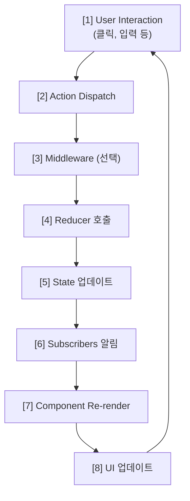

08장(불변성)까지 Redux의 "어떻게 상태를 바꾸는지"를 봤다면, 이 장에서는 **한 번의 사용자 동작이 Store를 거쳐 화면까지 어떻게 전달되는지** 전체 흐름을 정리합니다. dispatch → reducer → 새 state → 구독자에게 알림 → 리렌더의 단방향 데이터 흐름과, 비동기 액션(Thunk)이 이 흐름에 어떻게 끼어드는지 이해하면 11장(React-Redux)에서 Provider·connect·훅을 배울 때 훨씬 수월합니다.

## 이 글을 읽은 후 달성해야 할 목표 (평가 기준)

이 챕터를 마치면 다음을 할 수 있어야 합니다:

- Redux의 **단방향 데이터 흐름**을 설명하고, User Interaction → dispatch → Reducer → State → Re-render 순서를 추적할 수 있다.
- 동기 **Action**과 비동기 **Action**(Thunk)의 흐름 차이를 설명할 수 있다.
- Redux DevTools로 **Action**·상태 변화를 시각화하고 디버깅할 수 있다.

## Redux 데이터 흐름 개요

Redux는 **단방향 데이터 흐름**을 따릅니다:



## 단계별 데이터 흐름

아래는 **클릭 → dispatch → Reducer → state 갱신 → 구독자 알림 → 리렌더**까지 각 단계에서 일어나는 일을 코드로 보여줍니다. **Step 1**에서는 사용자 상호작용이 **dispatch** 호출로 이어지는 부분만 다룹니다.

### [Step 1] User Interaction

```javascript
// 사용자가 버튼 클릭
function Counter() {
    const dispatch = useDispatch();
    
    return (
        <button onClick={() => dispatch({ type: 'INCREMENT' })}>
            +1
        </button>
    );
}
```

**Step 2**에서는 **dispatch(action)**이 호출되면 **Store**가 **Middleware** 체인을 거친 뒤 **rootReducer**를 호출하고, 반환된 **새 state**로 내부 state를 바꾼 다음 **subscribe**된 리스너들을 실행하는 과정을 다룹니다.

### [Step 2] Action Dispatch

```javascript
// dispatch 함수 호출
dispatch({
    type: 'INCREMENT',
    payload: undefined
});

// 또는 Action Creator 사용
dispatch(increment());

// Store 내부에서 일어나는 일
store.dispatch = function(action) {
    console.log('Dispatching:', action);
    
    // Middleware 체인 실행
    const chain = [middleware1, middleware2, ...];
    
    // Reducer 호출
    currentState = rootReducer(currentState, action);
    
    // Subscribers에게 알림
    listeners.forEach(listener => listener());
    
    return action;
};
```

**Step 3**에서는 **Middleware**가 **dispatch**와 **Reducer** 사이에서 **action**을 가로채 로깅·비동기 처리 등을 한 뒤 **next(action)**으로 다음 단계로 넘기는 방식을 다룹니다.

### [Step 3] Middleware (선택)

```javascript
// Middleware는 dispatch와 reducer 사이에 위치
const loggerMiddleware = store => next => action => {
    console.log('이전 상태:', store.getState());
    console.log('액션:', action);
    
    const result = next(action); // 다음 middleware 또는 reducer
    
    console.log('다음 상태:', store.getState());
    return result;
};

// 흐름
// dispatch → middleware1 → middleware2 → reducer
```

**Step 4**에서는 **rootReducer**(또는 **combineReducers**로 묶인 Reducer)가 **현재 state**와 **action**을 받아 **새 state**를 계산해 반환하는 과정을 다룹니다. **Store**는 이 반환값으로 내부 state를 교체합니다.

### [Step 4] Reducer 호출

```javascript
// Reducer가 새 상태 계산
function counterReducer(state = { count: 0 }, action) {
    console.log('Reducer 호출:', state, action);
    
    switch (action.type) {
        case 'INCREMENT':
            const newState = { count: state.count + 1 };
            console.log('새 상태:', newState);
            return newState;
        
        default:
            return state;
    }
}

// 실행 순서
// 1. rootReducer 호출
// 2. combineReducers가 각 slice reducer 호출
// 3. 각 reducer가 새 상태 반환
// 4. 전체 새 상태 트리 생성
```

**Step 5**에서는 **Store**가 **Reducer**가 반환한 **새 state**로 내부 **currentState**를 교체하고, **subscribe**로 등록된 리스너들을 호출해 React-Redux 같은 구독자가 리렌더를 트리거할 수 있게 하는 부분을 다룹니다.

### [Step 5] State 업데이트

```javascript
// Store 내부
let currentState = { count: 0 };

function dispatch(action) {
    const previousState = currentState;
    
    // Reducer로 새 상태 계산
    currentState = rootReducer(currentState, action);
    
    // 상태 변경 확인
    const hasChanged = previousState !== currentState;
    
    if (hasChanged) {
        console.log('상태 변경됨!');
        notifyListeners();
    }
}
```

### [Step 6] Subscribers 알림

```javascript
// Subscribers (React-Redux가 내부적으로 사용)
const listeners = new Set();

function subscribe(listener) {
    listeners.add(listener);
    
    return function unsubscribe() {
        listeners.delete(listener);
    };
}

function notifyListeners() {
    listeners.forEach(listener => {
        listener(); // React 컴포넌트에게 상태 변경 알림
    });
}

// React-Redux 내부
useEffect(() => {
    const unsubscribe = store.subscribe(() => {
        // State 변경 시 컴포넌트 리렌더링 트리거
        forceUpdate();
    });
    
    return unsubscribe;
}, []);
```

### [Step 7] Component Re-render

```javascript
function Counter() {
    // useSelector가 자동으로 subscribe
    const count = useSelector(state => state.counter.count);
    
    console.log('Counter 렌더링, count:', count);
    
    return <div>{count}</div>;
}

// React-Redux 내부 로직
function useSelector(selector) {
    const [, forceUpdate] = useReducer(x => x + 1, 0);
    const latestSelector = useRef(selector);
    const latestSelectedState = useRef();
    
    useEffect(() => {
        const checkForUpdates = () => {
            const newSelectedState = latestSelector.current(store.getState());
            
            if (newSelectedState !== latestSelectedState.current) {
                latestSelectedState.current = newSelectedState;
                forceUpdate();
            }
        };
        
        const unsubscribe = store.subscribe(checkForUpdates);
        return unsubscribe;
    }, []);
    
    return latestSelectedState.current;
}
```

### [Step 8] UI 업데이트

```javascript
// React가 Virtual DOM 비교 후 실제 DOM 업데이트
function Counter() {
    const count = useSelector(state => state.counter.count);
    
    // count가 0 → 1로 변경되면
    // React가 <div>0</div>를 <div>1</div>로 업데이트
    return <div>{count}</div>;
}
```

## 완전한 흐름 예제

### Todo 추가 전체 프로세스

```javascript
// ========== 1. User Interaction ==========
function TodoForm() {
    const [text, setText] = useState('');
    const dispatch = useDispatch();
    
    const handleSubmit = (e) => {
        e.preventDefault();
        console.log('[1] User submitted form');
        
        // ========== 2. Action Dispatch ==========
        console.log('[2] Dispatching ADD_TODO action');
        dispatch(addTodo(text));
    };
    
    return (
        <form onSubmit={handleSubmit}>
            <input value={text} onChange={e => setText(e.target.value)} />
            <button type="submit">Add</button>
        </form>
    );
}

// ========== 3. Action Creator ==========
function addTodo(text) {
    const action = {
        type: 'ADD_TODO',
        payload: {
            id: Date.now(),
            text,
            completed: false
        }
    };
    console.log('[3] Action created:', action);
    return action;
}

// ========== 4. Middleware (선택) ==========
const loggerMiddleware = store => next => action => {
    console.log('[4] Middleware - Before:', store.getState());
    console.log('[4] Action:', action);
    
    const result = next(action);
    
    console.log('[4] Middleware - After:', store.getState());
    return result;
};

// ========== 5. Reducer ==========
function todosReducer(state = [], action) {
    console.log('[5] Reducer called with:', action.type);
    
    switch (action.type) {
        case 'ADD_TODO':
            const newState = [...state, action.payload];
            console.log('[5] New state:', newState);
            return newState;
        
        default:
            return state;
    }
}

// ========== 6. State Update & Notify ==========
// Redux Store 내부
function dispatch(action) {
    console.log('[6] Updating state...');
    currentState = rootReducer(currentState, action);
    
    console.log('[6] Notifying subscribers...');
    listeners.forEach(listener => listener());
}

// ========== 7. Component Re-render ==========
function TodoList() {
    console.log('[7] TodoList rendering...');
    const todos = useSelector(state => state.todos);
    
    // ========== 8. UI Update ==========
    console.log('[8] Updating UI with', todos.length, 'todos');
    
    return (
        <ul>
            {todos.map(todo => (
                <li key={todo.id}>{todo.text}</li>
            ))}
        </ul>
    );
}
```

### 실행 결과 (콘솔)

```
[1] User submitted form
[2] Dispatching ADD_TODO action
[3] Action created: { type: 'ADD_TODO', payload: {...} }
[4] Middleware - Before: { todos: [] }
[4] Action: { type: 'ADD_TODO', payload: {...} }
[5] Reducer called with: ADD_TODO
[5] New state: [{ id: 123, text: 'Learn Redux', completed: false }]
[4] Middleware - After: { todos: [{ id: 123, ... }] }
[6] Updating state...
[6] Notifying subscribers...
[7] TodoList rendering...
[8] Updating UI with 1 todos
```

## 비동기 데이터 흐름

### 비동기 Action (Thunk)

```javascript
// ========== 비동기 Action Creator ==========
function fetchTodos() {
    return async (dispatch, getState) => {
        console.log('[1] Async: Fetch started');
        
        // 로딩 시작
        dispatch({ type: 'FETCH_TODOS_REQUEST' });
        console.log('[2] Async: Loading state set');
        
        try {
            // API 호출
            console.log('[3] Async: Calling API...');
            const response = await fetch('/api/todos');
            const todos = await response.json();
            
            // 성공
            console.log('[4] Async: Success, dispatching data');
            dispatch({ 
                type: 'FETCH_TODOS_SUCCESS', 
                payload: todos 
            });
            
        } catch (error) {
            // 실패
            console.log('[4] Async: Error occurred');
            dispatch({ 
                type: 'FETCH_TODOS_FAILURE', 
                payload: error.message 
            });
        }
    };
}

// ========== Reducer ==========
function todosReducer(state = { data: [], loading: false, error: null }, action) {
    switch (action.type) {
        case 'FETCH_TODOS_REQUEST':
            console.log('[5] Reducer: Setting loading...');
            return { ...state, loading: true, error: null };
        
        case 'FETCH_TODOS_SUCCESS':
            console.log('[5] Reducer: Data received');
            return { ...state, loading: false, data: action.payload };
        
        case 'FETCH_TODOS_FAILURE':
            console.log('[5] Reducer: Error occurred');
            return { ...state, loading: false, error: action.payload };
        
        default:
            return state;
    }
}

// ========== Component ==========
function TodoList() {
    const dispatch = useDispatch();
    const { data: todos, loading, error } = useSelector(state => state.todos);
    
    useEffect(() => {
        console.log('[Component] Fetching todos...');
        dispatch(fetchTodos());
    }, [dispatch]);
    
    if (loading) {
        console.log('[UI] Showing loading...');
        return <div>Loading...</div>;
    }
    
    if (error) {
        console.log('[UI] Showing error...');
        return <div>Error: {error}</div>;
    }
    
    console.log('[UI] Showing', todos.length, 'todos');
    return (
        <ul>
            {todos.map(todo => (
                <li key={todo.id}>{todo.text}</li>
            ))}
        </ul>
    );
}
```

### 비동기 흐름 타임라인

```
Time  | Event
------|-----------------------------------------------
0ms   | User clicks "Load Todos"
1ms   | dispatch(fetchTodos())
2ms   | Thunk middleware intercepts
3ms   | dispatch({ type: 'FETCH_TODOS_REQUEST' })
4ms   | Reducer updates: loading = true
5ms   | Component re-renders (shows "Loading...")
6ms   | fetch() API call starts
...   | (waiting for response)
500ms | API response received
501ms | dispatch({ type: 'FETCH_TODOS_SUCCESS', payload: [...] })
502ms | Reducer updates: loading = false, data = [...]
503ms | Component re-renders (shows todo list)
```

## Redux DevTools로 흐름 추적

### DevTools 설치 및 설정

```javascript
// Store 생성 시 DevTools 연결
import { createStore } from 'redux';

const store = createStore(
    rootReducer,
    window.__REDUX_DEVTOOLS_EXTENSION__ && window.__REDUX_DEVTOOLS_EXTENSION__()
);

// 또는 Redux Toolkit (자동 포함)
import { configureStore } from '@reduxjs/toolkit';

const store = configureStore({
    reducer: rootReducer
    // DevTools 자동 활성화
});
```

### DevTools 주요 기능

```javascript
// 1. Action Log
// - 모든 dispatch된 Action 추적
// - Action 타입, payload, timestamp

// 2. State Diff
// - 이전 상태와 현재 상태 비교
// - 무엇이 변경되었는지 확인

// 3. Action Stack Trace
// - Action이 어디서 dispatch되었는지
// - 호출 스택 추적

// 4. Time Travel
// - 이전 상태로 되돌리기
// - 특정 Action 재실행

// 5. State Chart
// - 상태 변화를 시각적으로 표시
```

### 커스텀 로깅

```javascript
// Action에 메타데이터 추가
function addTodo(text) {
    return {
        type: 'ADD_TODO',
        payload: { text },
        meta: {
            timestamp: Date.now(),
            source: 'user-input'
        }
    };
}

// DevTools에서 Action 필터링
// - 특정 타입만 보기
// - 특정 시간대만 보기
// - payload 내용으로 검색
```

## 디버깅 패턴

### 각 단계에 로깅 추가

```javascript
// 1. Action Creator
const addTodo = (text) => {
    console.log('🎬 [Action Creator] Creating ADD_TODO');
    return {
        type: 'ADD_TODO',
        payload: { id: Date.now(), text }
    };
};

// 2. Middleware
const debugMiddleware = store => next => action => {
    console.log('🔀 [Middleware] Action:', action.type);
    console.log('📊 [Middleware] Current State:', store.getState());
    
    const result = next(action);
    
    console.log('📊 [Middleware] Next State:', store.getState());
    return result;
};

// 3. Reducer
function todosReducer(state = [], action) {
    console.log('⚙️ [Reducer] Processing:', action.type);
    console.log('⚙️ [Reducer] Current todos:', state.length);
    
    switch (action.type) {
        case 'ADD_TODO':
            const newState = [...state, action.payload];
            console.log('⚙️ [Reducer] New todos:', newState.length);
            return newState;
        
        default:
            return state;
    }
}

// 4. Component
function TodoList() {
    console.log('🎨 [Component] Rendering TodoList');
    const todos = useSelector(state => {
        console.log('🔍 [Selector] Selecting todos');
        return state.todos;
    });
    
    console.log('🎨 [Component] Todos count:', todos.length);
    
    return <div>{/* ... */}</div>;
}
```

### Performance 추적

```javascript
// Action 처리 시간 측정
const performanceMiddleware = store => next => action => {
    const start = performance.now();
    
    const result = next(action);
    
    const end = performance.now();
    console.log(`⏱️ ${action.type} took ${end - start}ms`);
    
    return result;
};

// Render 시간 측정
function TodoList() {
    const renderStart = performance.now();
    const todos = useSelector(state => state.todos);
    
    useEffect(() => {
        const renderEnd = performance.now();
        console.log(`⏱️ Render took ${renderEnd - renderStart}ms`);
    });
    
    return <div>{/* ... */}</div>;
}
```

## 실습 문제 🏋️‍♂️

### 문제 1: 흐름 추적하기
```javascript
// 다음 코드의 실행 순서를 적으세요
dispatch(addTodo('Learn Redux'));

// A. Reducer 호출
// B. Component Re-render
// C. Action Creator 실행
// D. State 업데이트
// E. Subscribers 알림

// 답: C → A → D → E → B
```

### 문제 2: 로깅 Middleware 작성
```javascript
// TODO: 다음 정보를 로깅하는 Middleware 작성
// - Action 타입
// - 이전 상태
// - 다음 상태
// - 처리 시간

// 답안:
const loggerMiddleware = store => next => action => {
    const start = Date.now();
    console.log('Action:', action.type);
    console.log('Previous State:', store.getState());
    
    const result = next(action);
    
    console.log('Next State:', store.getState());
    console.log('Time:', Date.now() - start, 'ms');
    console.log('---');
    
    return result;
};
```

## 체크리스트 ✅

- [ ] Redux의 단방향 데이터 흐름을 이해한다
- [ ] Action dispatch부터 UI 업데이트까지 추적할 수 있다
- [ ] Redux DevTools를 사용할 수 있다
- [ ] 비동기 Action의 흐름을 이해한다
- [ ] 각 단계에서 디버깅할 수 있다

## 다음 단계 🚀

**다음 챕터**: `10. Redux를 사용하는 이유와 적절한 사용 시기`에서 언제 Redux가 필요하고 언제 불필요한지, 대안들과 비교하며 학습합니다!

### 추가 학습 자료
- [Redux Data Flow](https://redux.js.org/tutorials/fundamentals/part-2-concepts-data-flow)
- [Redux DevTools Extension](https://github.com/reduxjs/redux-devtools)
- [Middleware](https://redux.js.org/understanding/history-and-design/middleware)

---

**핵심 요약**: Redux의 단방향 데이터 흐름을 이해하면 디버깅이 쉬워집니다. DevTools로 매 단계를 추적하세요! 💪


