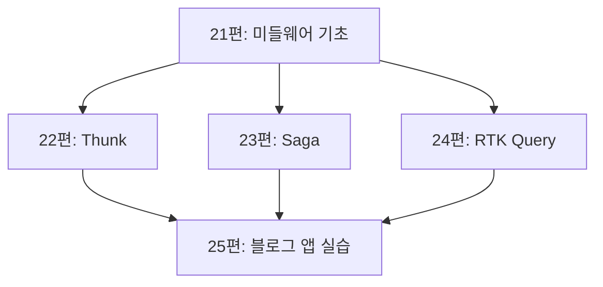

# 25. 실습: RTK Query로 블로그 앱 만들기

Phase 5의 마지막 편입니다. 게시글 목록·상세·댓글·좋아요 기능을 가진 블로그 앱을 24편의 RTK Query로 구현하며, 21–24편에서 배운 미들웨어·캐시 태그 개념을 실전 규모로 적용합니다.

## 학습 목표

- 여러 리소스(게시글, 댓글)가 얽힌 API를 세밀한 캐시 태그로 설계할 수 있다.
- 좋아요처럼 즉각적인 반응이 필요한 뮤테이션에 낙관적 업데이트를 적용할 수 있다.
- 목록 조회, 상세 조회, 생성, 수정, 삭제가 서로의 캐시에 미치는 영향을 태그로 정확히 표현할 수 있다.

## API 설계: postsApi

```javascript
// features/api/postsApi.js
import { createApi, fetchBaseQuery } from "@reduxjs/toolkit/query/react";

export const postsApi = createApi({
  reducerPath: "postsApi",
  baseQuery: fetchBaseQuery({ baseUrl: "/api" }),
  tagTypes: ["Post", "Comment"],
  endpoints: (builder) => ({
    getPosts: builder.query({
      query: () => "/posts",
      // 목록의 각 항목과 목록 전체를 개별 태그로 제공 — 세밀한 무효화를 위해
      providesTags: (result) =>
        result
          ? [...result.map((post) => ({ type: "Post", id: post.id })), { type: "Post", id: "LIST" }]
          : [{ type: "Post", id: "LIST" }],
    }),
    getPostById: builder.query({
      query: (postId) => `/posts/${postId}`,
      providesTags: (result, error, postId) => [{ type: "Post", id: postId }],
    }),
    addPost: builder.mutation({
      query: (newPost) => ({ url: "/posts", method: "POST", body: newPost }),
      invalidatesTags: [{ type: "Post", id: "LIST" }], // 목록만 무효화(개별 게시글은 아직 없으므로)
    }),
    updatePost: builder.mutation({
      query: ({ id, ...patch }) => ({ url: `/posts/${id}`, method: "PATCH", body: patch }),
      invalidatesTags: (result, error, { id }) => [{ type: "Post", id }], // 해당 게시글만 무효화
    }),
    deletePost: builder.mutation({
      query: (postId) => ({ url: `/posts/${postId}`, method: "DELETE" }),
      invalidatesTags: (result, error, postId) => [
        { type: "Post", id: postId },
        { type: "Post", id: "LIST" }, // 목록에서도 사라져야 하므로 LIST도 함께 무효화
      ],
    }),
  }),
});

export const {
  useGetPostsQuery,
  useGetPostByIdQuery,
  useAddPostMutation,
  useUpdatePostMutation,
  useDeletePostMutation,
} = postsApi;
```

## 세밀한 태그 설계가 필요한 이유

24편에서는 `providesTags: ["Todo"]`처럼 단순한 태그를 썼습니다. 게시글처럼 **목록 화면과 상세 화면이 분리된** 리소스는 더 세밀한 태그가 필요합니다.

- **`{ type: "Post", id: "LIST" }`**: "게시글 목록"이라는 개념 자체에 대한 태그. 게시글이 추가/삭제되어 목록의 구성이 바뀔 때 무효화한다.
- **`{ type: "Post", id: postId }`**: 특정 게시글 하나에 대한 태그. 그 게시글의 내용이 수정될 때만 무효화한다.

`updatePost`가 `id`가 일치하는 태그만 무효화하도록 설계했기 때문에, **게시글 A를 수정해도 게시글 B의 상세 화면이나 목록 전체가 불필요하게 재요청되지 않습니다.** 태그를 뭉뚱그려 `"Post"` 하나로만 쓰면, 게시글 하나만 바뀌어도 목록 전체와 다른 모든 상세 화면이 재요청되는 비효율이 생깁니다.

## 댓글 API: 게시글과의 관계 표현

```javascript
// endpoints 안에 추가
getCommentsByPostId: builder.query({
  query: (postId) => `/posts/${postId}/comments`,
  providesTags: (result, error, postId) => [{ type: "Comment", id: postId }],
}),
addComment: builder.mutation({
  query: ({ postId, text }) => ({
    url: `/posts/${postId}/comments`,
    method: "POST",
    body: { text },
  }),
  invalidatesTags: (result, error, { postId }) => [{ type: "Comment", id: postId }], // 해당 게시글의 댓글 목록만 갱신
}),
```

댓글이 게시글에 종속된 리소스이므로, 태그의 `id`로 **게시글 ID**를 사용합니다. 이렇게 하면 게시글 A에 댓글을 달아도 게시글 B의 댓글 목록에는 영향을 주지 않습니다.

## 좋아요 기능: 낙관적 업데이트(Optimistic Update)

좋아요 버튼은 사용자가 클릭했을 때 **서버 응답을 기다리지 않고 즉시 UI에 반영**되는 것이 자연스러운 사용자 경험입니다. RTK Query는 `onQueryStarted`로 이를 지원합니다.

```javascript
likePost: builder.mutation({
  query: (postId) => ({ url: `/posts/${postId}/like`, method: "POST" }),
  async onQueryStarted(postId, { dispatch, queryFulfilled }) {
    // 서버 응답 전에 캐시를 미리 낙관적으로 업데이트
    const patchResult = dispatch(
      postsApi.util.updateQueryData("getPostById", postId, (draft) => {
        draft.likeCount += 1; // 17편에서 본 Immer draft와 동일한 방식으로 직접 수정
      })
    );
    try {
      await queryFulfilled; // 실제 서버 요청 완료를 기다림
    } catch {
      patchResult.undo(); // 요청이 실패하면 낙관적 업데이트를 되돌린다
    }
  },
}),
```

`onQueryStarted`는 뮤테이션이 시작되는 시점에 실행되는 콜백입니다. `updateQueryData`로 캐시된 `getPostById` 결과를 **서버 응답 전에 미리 수정**해두고, 실제 요청이 실패하면 `patchResult.undo()`로 원상 복구합니다. 사용자는 클릭 즉시 좋아요 수가 올라가는 것을 보고, 네트워크 실패 시에만(드문 경우) 잠깐 뒤 원래 값으로 되돌아가는 것을 보게 됩니다.

## 컴포넌트 조합

```jsx
// features/posts/PostDetail.jsx
import { useGetPostByIdQuery, useGetCommentsByPostIdQuery, useAddCommentMutation, useLikePostMutation } from "../api/postsApi";

function PostDetail({ postId }) {
  const { data: post, isLoading } = useGetPostByIdQuery(postId);
  const { data: comments } = useGetCommentsByPostIdQuery(postId);
  const [addComment] = useAddCommentMutation();
  const [likePost] = useLikePostMutation();

  if (isLoading) return <p>불러오는 중...</p>;

  return (
    <article>
      <h1>{post.title}</h1>
      <p>{post.body}</p>
      <button onClick={() => likePost(postId)}>♥ {post.likeCount}</button>

      <section>
        <h2>댓글 {comments?.length ?? 0}개</h2>
        <ul>
          {comments?.map((comment) => <li key={comment.id}>{comment.text}</li>)}
        </ul>
        <CommentForm onSubmit={(text) => addComment({ postId, text })} />
      </section>
    </article>
  );
}
```

`likePost(postId)`를 클릭하면 좋아요 수가 즉시 반영되고, `addComment`가 성공하면 `getCommentsByPostId` 캐시가 자동으로 무효화되어 댓글 목록이 최신 상태로 갱신됩니다. 컴포넌트 코드 어디에도 로딩 상태를 수동으로 관리하는 코드나, 댓글 추가 후 목록을 수동으로 재요청하는 코드가 없습니다.

## Phase 5 전체 정리: 21–25편이 어떻게 연결되는가



21편에서 배운 미들웨어 구조가 22–24편 세 도구의 공통 기반이며, 이 편은 그중 실무에서 가장 자주 쓰이는 RTK Query를 중심으로 실제 규모의 기능(목록, 상세, 댓글, 좋아요)을 조립했습니다. 프로젝트에 따라 22편(단순 로직)이나 23편(복잡한 순서 제어)이 더 적합한 부분이 섞여 있을 수 있다는 것도 기억해두면 좋습니다.

## 실무 체크리스트

- 목록과 상세로 분리된 리소스에 `{ type, id: "LIST" }`와 `{ type, id }`를 구분해 태그를 설계했는가?
- 즉각적인 사용자 반응이 중요한 뮤테이션(좋아요, 토글)에 낙관적 업데이트를 적용했는가?
- 낙관적 업데이트가 실패했을 때 `patchResult.undo()`로 원상 복구되는 경로를 테스트했는가?

## 연습 과제

### 기초(★☆☆)
- `deletePost` 뮤테이션을 호출한 뒤, 게시글 목록에서 해당 항목이 자동으로 사라지는지 확인해보세요.

### 중급(★★☆)
- 댓글 삭제 기능(`deleteComment`)을 추가하고, 해당 게시글의 댓글 목록에만 영향을 주도록 태그를 설계해보세요.

### 고급(★★★)
- `likePost`의 `onQueryStarted`에서 서버 요청이 의도적으로 실패하도록 만들어(네트워크 탭에서 요청 차단 등), 낙관적으로 올라갔던 좋아요 수가 정말로 되돌아가는지 확인해보세요.

## 요약

- 목록/상세가 분리된 리소스는 `{ type, id: "LIST" }`와 `{ type, id }` 두 종류의 태그로 세밀하게 캐시를 제어한다.
- 낙관적 업데이트는 `onQueryStarted` + `updateQueryData`로 구현하며, 실패 시 `patchResult.undo()`로 복구한다.
- Phase 5의 21–24편은 모두 같은 미들웨어 기반 위에서 서로 다른 트레이드오프를 제공하는 도구들이다.

## 참고 문헌 및 출처(추천)

- Redux Toolkit 공식 문서, "RTK Query, Optimistic Updates"
- Redux 공식 문서, "Redux Essentials, Part 8: RTK Query Advanced Patterns"

---

## 다음 글

- 다음: [26. Redux 프로젝트 구조 - 확장 가능한 설계](../redux-project-structure/)
